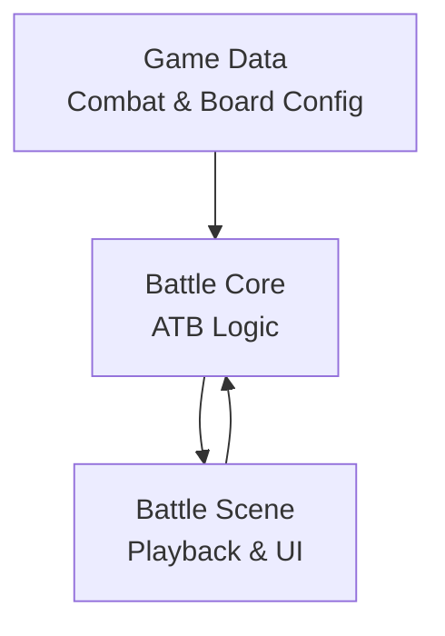
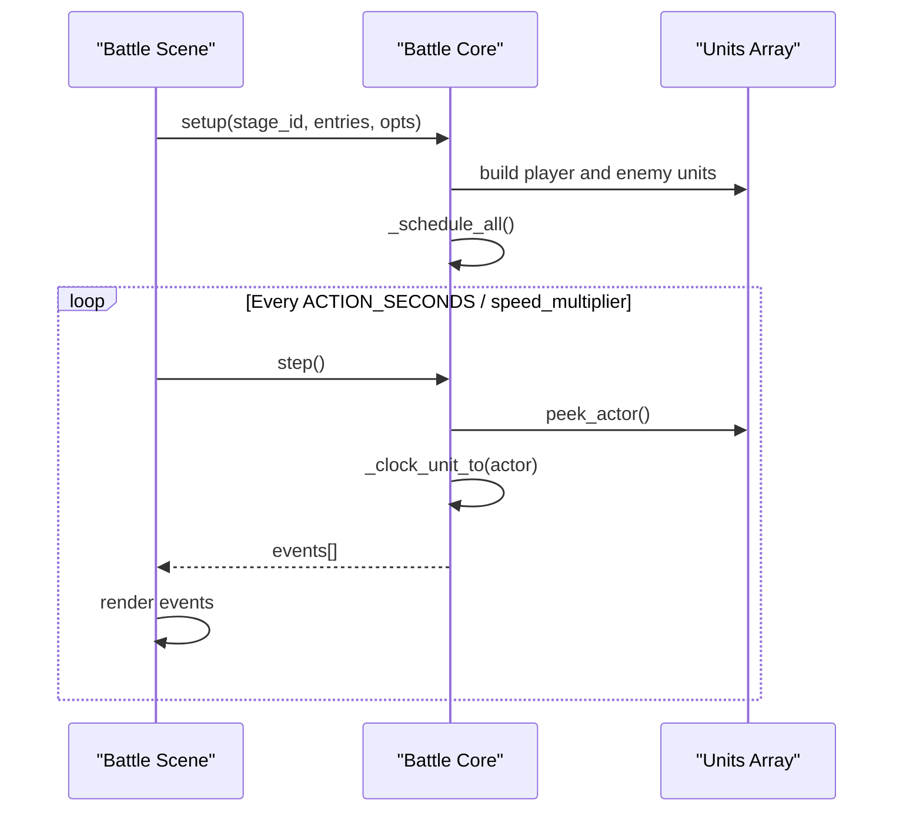
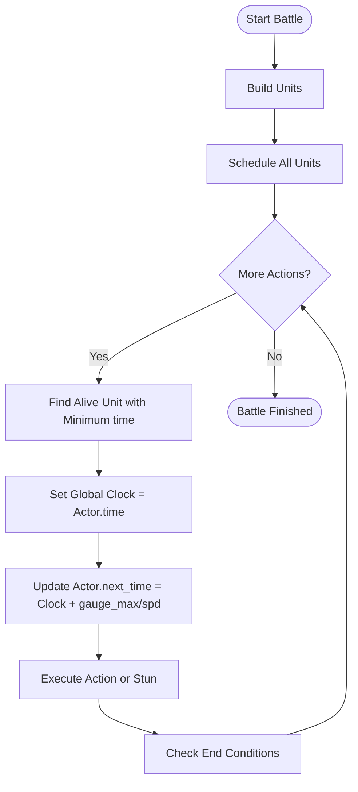
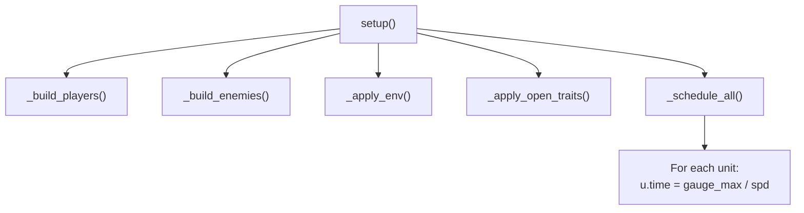
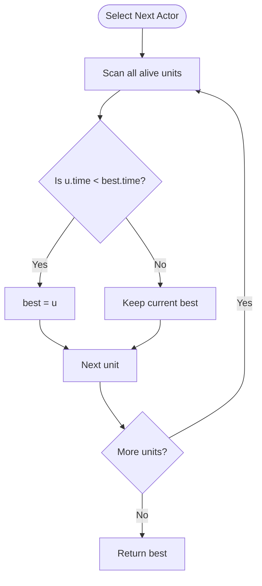
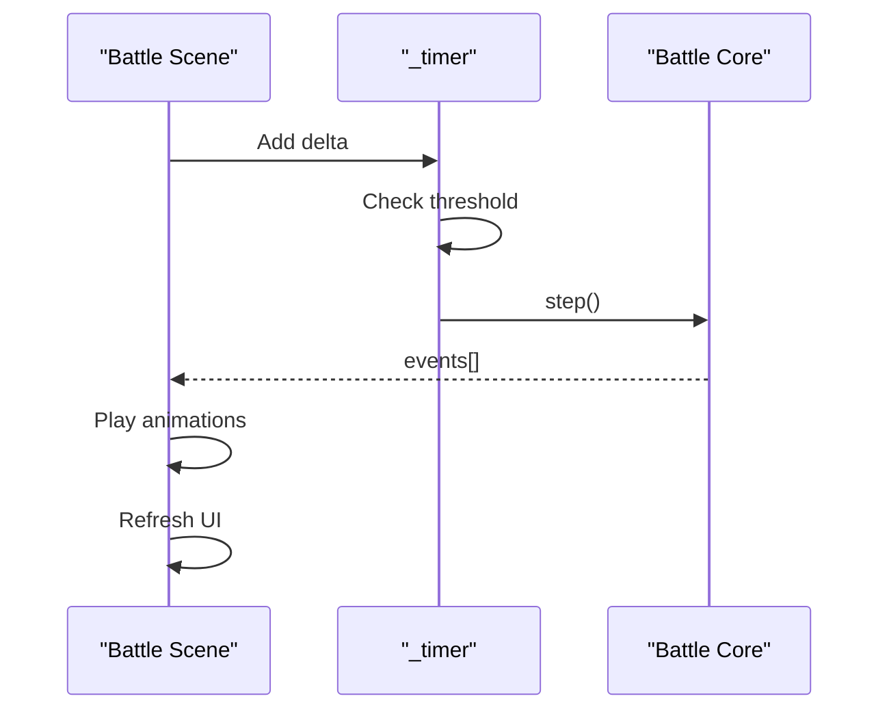
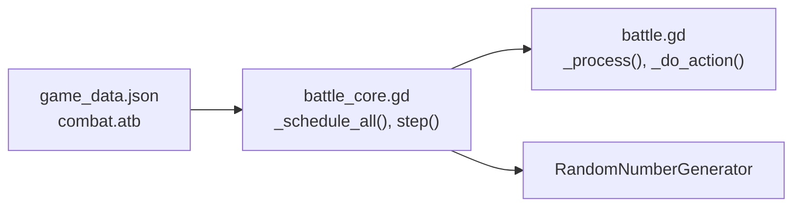

# ATB Turn Order System

<cite>
**Referenced Files in This Document**   
- [battle_core.gd](file://scripts/battle_core.gd)
- [battle.gd](file://scripts/battle.gd)
- [game_data.json](file://data/game_data.json)
</cite>

## Table of Contents
1. [Introduction](#introduction)
2. [Project Structure](#project-structure)
3. [Core Components](#core-components)
4. [Architecture Overview](#architecture-overview)
5. [Detailed Component Analysis](#detailed-component-analysis)
6. [Dependency Analysis](#dependency-analysis)
7. [Performance Considerations](#performance-considerations)
8. [Troubleshooting Guide](#troubleshooting-guide)
9. [Conclusion](#conclusion)

## Introduction
This document explains the Action Time Battle (ATB) turn order system used by the battle core. It focuses on how action timers are calculated from speed attributes, how the gauge mechanic works, and how the scheduler determines which unit acts next. The system is deterministic: given the same initial state and random seed, it produces identical results every time.

The key idea is simple: each unit has a “next action time.” At any moment, the unit with the smallest next action time acts. After acting, its next action time is updated using the current clock and the unit’s speed. The UI advances the simulation at fixed intervals and asks the core for the next set of actions to play.

## Project Structure
The ATB logic lives primarily in the battle core script, while the battle scene drives playback and updates the user interface. Configuration values such as the gauge maximum and energy thresholds come from the game data file.

**Diagram sources**
- [battle_core.gd:1-15](file://scripts/battle_core.gd#L1-L15)
- [battle.gd:1-15](file://scripts/battle.gd#L1-L15)
- [game_data.json:120-132](file://data/game_data.json#L120-L132)

**Section sources**
- [battle_core.gd:1-15](file://scripts/battle_core.gd#L1-L15)
- [battle.gd:1-15](file://scripts/battle.gd#L1-L15)
- [game_data.json:120-132](file://data/game_data.json#L120-L132)

## Core Components
- Battle Core: Implements the ATB timeline, scheduling, actor selection, and action execution.
- Battle Scene: Drives the clock, calls the core step-by-step, and renders events.
- Game Data: Provides combat configuration, including ATB parameters like gauge maximum and energy costs.

Key responsibilities:
- Schedule all units with their first action times based on speed.
- Select the next actor by finding the minimum next action time among alive units.
- Advance the global clock to the actor’s scheduled time.
- Update the actor’s next action time after it acts.
- Return event lists for the UI to animate.

**Section sources**
- [battle_core.gd:9-14](file://scripts/battle_core.gd#L9-L14)
- [battle_core.gd:36-42](file://scripts/battle_core.gd#L36-L42)
- [battle.gd:640-670](file://scripts/battle.gd#L640-L670)

## Architecture Overview
The ATB system separates simulation from presentation. The core maintains an internal timeline and returns discrete events; the scene controls the pacing and displays animations.

**Diagram sources**
- [battle_core.gd:44-67](file://scripts/battle_core.gd#L44-L67)
- [battle_core.gd:366-370](file://scripts/battle_core.gd#L366-L370)
- [battle_core.gd:392-415](file://scripts/battle_core.gd#L392-L415)
- [battle.gd:640-670](file://scripts/battle.gd#L640-L670)

## Detailed Component Analysis

### ATB Timeline and Scheduling
The ATB timeline uses a global clock and per-unit next-action timestamps. Each unit stores a `time` field representing when it will act next.

Initialization:
- On setup, the core builds both sides’ units.
- Then it schedules all units once.
- For each unit, the first action time equals `gauge_max / spd`.

Selection:
- To find the next actor, the core scans alive units and picks the one with the smallest `time`.
- The scene can also request a sorted preview of upcoming actors via an ordering helper.

Clock update:
- When an actor acts, the global clock jumps to that actor’s scheduled time.
- The actor’s next action time is then recalculated as `current_clock + gauge_max / spd`.

**Diagram sources**
- [battle_core.gd:366-370](file://scripts/battle_core.gd#L366-L370)
- [battle_core.gd:373-386](file://scripts/battle_core.gd#L373-L386)
- [battle_core.gd:392-415](file://scripts/battle_core.gd#L392-L415)
- [battle_core.gd:428-431](file://scripts/battle_core.gd#L428-L431)

**Section sources**
- [battle_core.gd:36-42](file://scripts/battle_core.gd#L36-L42)
- [battle_core.gd:366-386](file://scripts/battle_core.gd#L366-L386)
- [battle_core.gd:392-431](file://scripts/battle_core.gd#L392-L431)

### Time Calculation Formula
The formula for each unit’s next action time is:

- Next action time = Current clock + Gauge maximum / Speed

Where:
- Current clock is the global time advanced to the actor’s scheduled time.
- Gauge maximum comes from combat configuration.
- Speed is the unit’s speed attribute.

Examples:
- If gauge maximum is 1000 and a unit has speed 100, its interval is 1000 / 100 = 10 time units.
- If another unit has speed 200, its interval is 1000 / 200 = 5 time units.
- Higher speed means smaller intervals and more frequent turns.

Determinism:
- The core does not accumulate delta-time for timing; it computes exact action moments.
- With the same initial state and random seed, the sequence of actions is identical.

**Section sources**
- [battle_core.gd:9-11](file://scripts/battle_core.gd#L9-L11)
- [battle_core.gd:366-370](file://scripts/battle_core.gd#L366-L370)
- [battle_core.gd:428-431](file://scripts/battle_core.gd#L428-L431)
- [game_data.json:126-131](file://data/game_data.json#L126-L131)

### Scheduling Process
Scheduling happens during setup:

1. Build player entries and enemy units.
2. Apply environment effects and opening traits.
3. Call the scheduler to assign each unit its first action time.

The scheduler reads the gauge maximum from combat configuration and assigns:
- First action time = gauge_max / spd

After this, the battle loop repeatedly selects the next actor and updates its time.

**Diagram sources**
- [battle_core.gd:44-67](file://scripts/battle_core.gd#L44-L67)
- [battle_core.gd:366-370](file://scripts/battle_core.gd#L366-L370)

**Section sources**
- [battle_core.gd:44-67](file://scripts/battle_core.gd#L44-L67)
- [battle_core.gd:366-370](file://scripts/battle_core.gd#L366-L370)

### Actor Selection and Turn Order
The system finds the next actor by scanning all alive units and choosing the one with the smallest `time`.

- `peek_actor()` returns the next actor.
- `action_order()` returns a sorted list of alive units by increasing `time`, used by the UI to show upcoming turns.

This approach avoids complex priority queues and keeps behavior predictable.

**Diagram sources**
- [battle_core.gd:373-386](file://scripts/battle_core.gd#L373-L386)

**Section sources**
- [battle_core.gd:373-386](file://scripts/battle_core.gd#L373-L386)

### Clock Progression Mechanism
The battle scene controls the visual pace:

- It accumulates elapsed time in `_process(delta)`.
- When enough time has passed, it calls `core.step()` to advance the simulation by one action.
- The returned events are played as animations, and the UI refreshes health bars, logs, and the upcoming order bar.

This decouples gameplay timing from frame rate and animation duration.

**Diagram sources**
- [battle.gd:640-670](file://scripts/battle.gd#L640-L670)
- [battle_core.gd:392-415](file://scripts/battle_core.gd#L392-L415)

**Section sources**
- [battle.gd:640-670](file://scripts/battle.gd#L640-L670)
- [battle_core.gd:392-415](file://scripts/battle_core.gd#L392-L415)

### Deterministic Behavior
The system is designed to be deterministic:

- The core comment states that the timeline does not use delta accumulation; instead, it computes exact action moments.
- A random seed is stored and used for RNG-dependent effects.
- The UI footer shows the active seed so replays and smoke tests can assert consistent outcomes.

This ensures that identical inputs produce identical outputs, which is important for testing and debugging.

**Section sources**
- [battle_core.gd:9-11](file://scripts/battle_core.gd#L9-L11)
- [battle_core.gd:37-38](file://scripts/battle_core.gd#L37-L38)
- [battle.gd:517-518](file://scripts/battle.gd#L517-L518)

## Dependency Analysis
The ATB system depends on:

- Combat configuration for gauge maximum and energy thresholds.
- Unit stats, especially speed, for scheduling.
- Random number generator for crits, variance, and other probabilistic effects.
- The battle scene for pacing and rendering.

**Diagram sources**
- [game_data.json:126-131](file://data/game_data.json#L126-L131)
- [battle_core.gd:36-38](file://scripts/battle_core.gd#L36-L38)
- [battle_core.gd:366-370](file://scripts/battle_core.gd#L366-L370)
- [battle.gd:640-670](file://scripts/battle.gd#L640-L670)

**Section sources**
- [game_data.json:126-131](file://data/game_data.json#L126-L131)
- [battle_core.gd:36-38](file://scripts/battle_core.gd#L36-L38)
- [battle_core.gd:366-370](file://scripts/battle_core.gd#L366-L370)
- [battle.gd:640-670](file://scripts/battle.gd#L640-L670)

## Performance Considerations
- Scheduling and actor selection use linear scans over the units array.
- The code comment notes that with up to 12 units, a linear scan is simpler and safer than maintaining a heap.
- This keeps the implementation straightforward and avoids reference identity issues.

Optimization opportunities:
- If the number of units grows significantly, consider a priority queue keyed by `time`.
- Cache alive unit lists if they are frequently accessed.
- Avoid unnecessary UI refreshes by batching updates.

[No sources needed since this section provides general guidance]

## Troubleshooting Guide
Common issues and checks:

- Wrong turn order: Verify that each unit’s `spd` is correct and that `gauge_max` matches expectations.
- No actions progressing: Ensure the battle scene’s timer reaches the threshold and calls `step()`.
- Non-deterministic results: Confirm that the random seed is set consistently for testing.
- UI out of sync: Make sure the scene refreshes units, cards, status, order, and log after each step.

Relevant areas to inspect:
- Scheduling initialization.
- Actor selection logic.
- Clock update after action.
- Scene timer and step invocation.

**Section sources**
- [battle_core.gd:366-370](file://scripts/battle_core.gd#L366-L370)
- [battle_core.gd:373-386](file://scripts/battle_core.gd#L373-L386)
- [battle_core.gd:392-431](file://scripts/battle_core.gd#L392-L431)
- [battle.gd:640-670](file://scripts/battle.gd#L640-L670)

## Conclusion
The ATB turn order system is a clean, deterministic timeline built around speed-based action intervals. Each unit’s next action time is computed from the current clock and the ratio of gauge maximum to speed. The scheduler initializes all units once, and the battle loop repeatedly selects the earliest actor, advances the clock, and updates that actor’s next action time. The UI drives the pace and renders events without participating in calculations, ensuring consistent and testable behavior across runs.