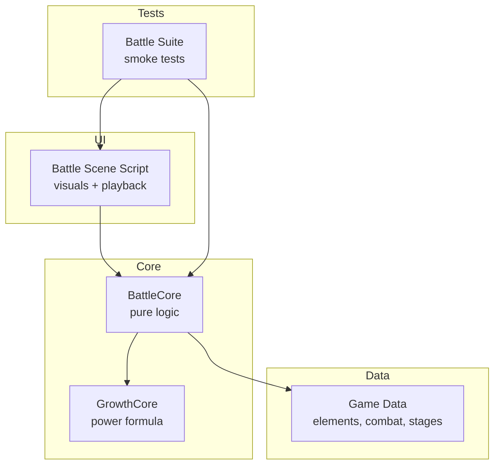
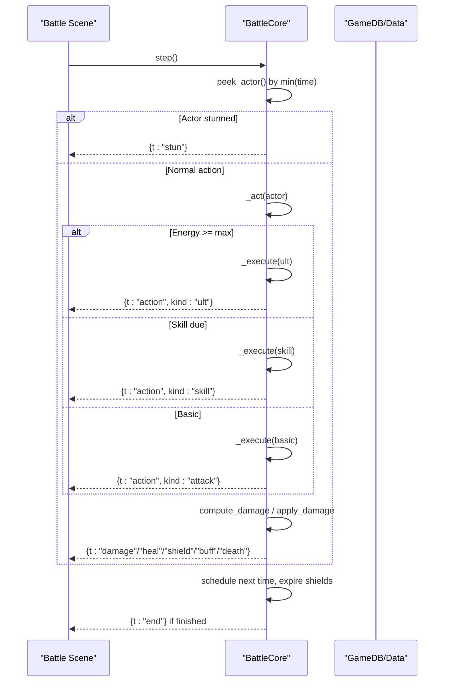
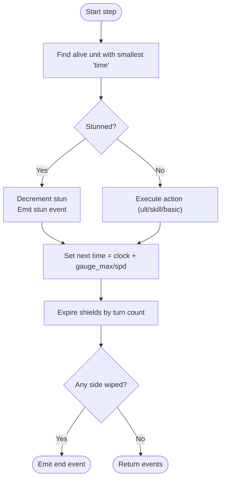
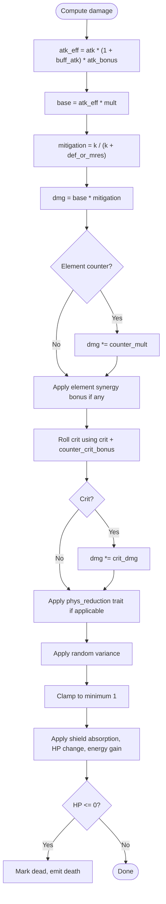
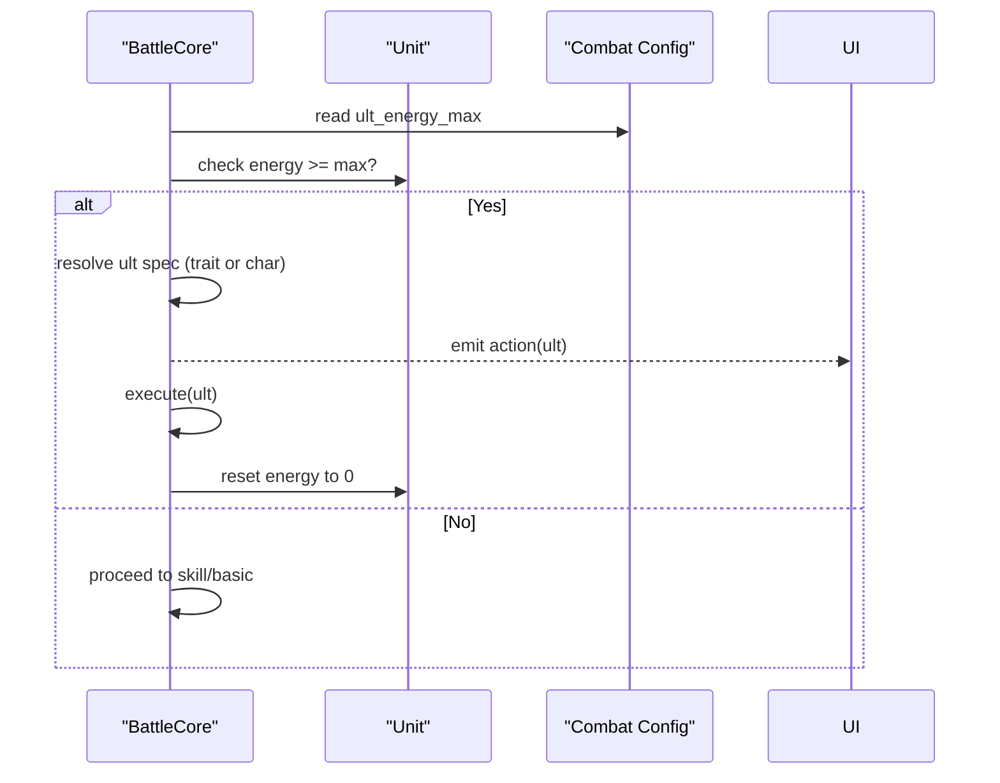
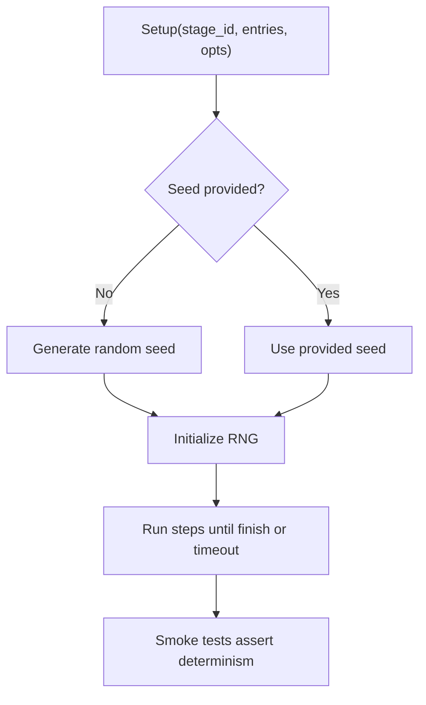
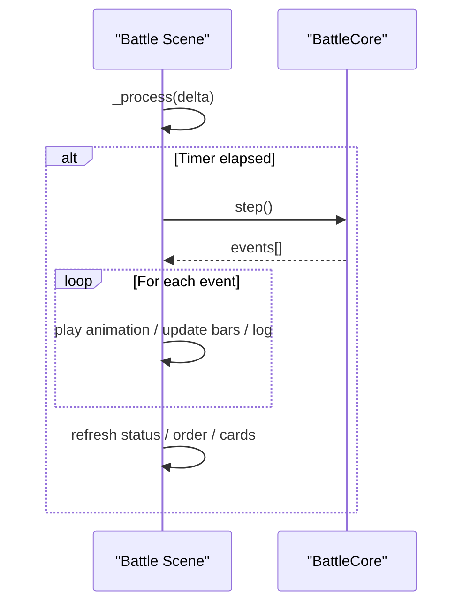
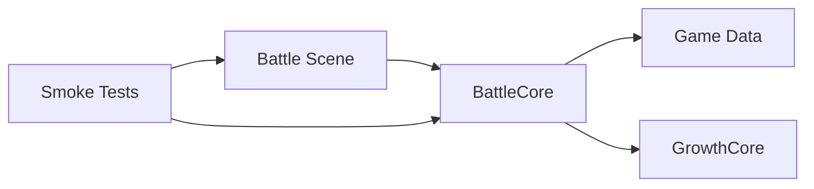

# Battle System

<cite>
**Referenced Files in This Document**
- [battle_core.gd](file://scripts/battle_core.gd)
- [battle.gd](file://scripts/battle.gd)
- [battle_ctx.gd](file://scripts/battle_ctx.gd)
- [growth_core.gd](file://scripts/growth_core.gd)
- [game_data.json](file://data/game_data.json)
- [battle_suite.gd](file://tools/suites/battle_suite.gd)
</cite>

## Table of Contents
1. [Introduction](#introduction)
2. [Project Structure](#project-structure)
3. [Core Components](#core-components)
4. [Architecture Overview](#architecture-overview)
5. [Detailed Component Analysis](#detailed-component-analysis)
6. [Dependency Analysis](#dependency-analysis)
7. [Performance Considerations](#performance-considerations)
8. [Troubleshooting Guide](#troubleshooting-guide)
9. [Conclusion](#conclusion)
10. [Appendices](#appendices)

## Introduction
This document explains the semi-automatic ATB (Action Time Battle) combat system implemented in the project. It covers:
- Turn order calculation based on speed attributes and action timers
- Damage formulas including attack, defense, element counters, role advantages, and external buffs
- Ultimate ability system with energy accumulation and powerful effects
- Deterministic battle simulation that produces consistent results for the same inputs
- Examples of battle scenarios, skill interactions, and counter chains
- The visualization layer that renders battles while keeping core logic pure and testable

The design separates a pure logic core from UI presentation so that simulations can be run headless and still match what players see on screen.

## Project Structure
At a high level:
- Core logic lives in a pure RefCounted class that models units, actions, damage, and outcomes without any Godot nodes.
- A scene script drives the visual presentation by repeatedly calling the core’s step function and playing animations based on returned events.
- Configuration is loaded from data files and provides elements, combat constants, board layout, and stage definitions.
- A smoke test suite validates configuration, geometry, math, flow, determinism, and scene behavior.

**Diagram sources**
- [battle_core.gd:1-15](file://scripts/battle_core.gd#L1-L15)
- [battle.gd:1-12](file://scripts/battle.gd#L1-L12)
- [game_data.json:119-132](file://data/game_data.json#L119-L132)
- [battle_suite.gd:1-14](file://tools/suites/battle_suite.gd#L1-L14)

**Section sources**
- [battle_core.gd:1-15](file://scripts/battle_core.gd#L1-L15)
- [battle.gd:1-12](file://scripts/battle.gd#L1-L12)
- [game_data.json:119-132](file://data/game_data.json#L119-L132)
- [battle_suite.gd:1-14](file://tools/suites/battle_suite.gd#L1-L14)

## Core Components
- BattleCore: Pure logic for setup, scheduling, execution, damage, healing, shields, buffs, stun, ultimates, and win/lose conditions.
- Battle Scene Script: Visual layer that builds background, grid, unit tokens, HUD, logs, and plays events as animations.
- GrowthCore: Shared power formula used to compute team power and recommended difficulty alignment.
- Game Data: Elements, counters, combat constants, ATB parameters, board layout, and stage definitions.
- Smoke Tests: Validate configuration, geometry, combat math, flow, determinism, and scene behavior.

Key responsibilities:
- BattleCore owns all state transitions and numerical calculations; it emits typed events for the UI to render.
- Battle reads those events and updates visuals only; no game rules are re-implemented there.
- GrowthCore centralizes power computation so UI previews and battle stats stay in sync.

**Section sources**
- [battle_core.gd:22-42](file://scripts/battle_core.gd#L22-L42)
- [battle.gd:75-116](file://scripts/battle.gd#L75-L116)
- [growth_core.gd:42-53](file://scripts/growth_core.gd#L42-L53)
- [game_data.json:119-132](file://data/game_data.json#L119-L132)

## Architecture Overview
The system follows a strict separation:
- UI calls step() each frame or at fixed intervals to advance time.
- step() selects the next actor by lowest “next action time”, executes their action (ult → skill → basic), applies damage/heal/shield/buff/stun, schedules next turn, checks end conditions, and returns a batch of events.
- UI consumes events to animate sprites, float text, bars, and log lines.

**Diagram sources**
- [battle_core.gd:392-425](file://scripts/battle_core.gd#L392-L425)
- [battle_core.gd:441-466](file://scripts/battle_core.gd#L441-L466)
- [battle_core.gd:477-516](file://scripts/battle_core.gd#L477-L516)
- [battle_core.gd:672-761](file://scripts/battle_core.gd#L672-L761)
- [battle.gd:640-671](file://scripts/battle.gd#L640-L671)

## Detailed Component Analysis

### Turn Order Calculation (ATB)
- Each unit has a “next action time” initialized to gauge_max / spd.
- At each step, the unit with the smallest time acts first. After acting, its time is set to current clock + gauge_max / spd.
- This avoids delta accumulation and ensures deterministic ordering given the same RNG seed.

**Diagram sources**
- [battle_core.gd:366-386](file://scripts/battle_core.gd#L366-L386)
- [battle_core.gd:392-425](file://scripts/battle_core.gd#L392-L425)
- [battle_core.gd:428-436](file://scripts/battle_core.gd#L428-L436)

**Section sources**
- [battle_core.gd:366-386](file://scripts/battle_core.gd#L366-L386)
- [battle_core.gd:392-425](file://scripts/battle_core.gd#L392-L425)

### Damage Calculation Formula
Damage combines multiple multiplicative and additive modifiers:
- Base damage = attacker.atk × (1 + buff_atk) × atk_bonus × skill.mult
- Mitigation uses def or mres depending on damage type via a k/(k+defense) curve
- Element counter multiplies damage and adds crit chance
- Elemental synergy bonus (from synergies) further multiplies damage for matching element
- Crit roll uses attacker.crit plus counter bonus; on crit, multiply by crit_dmg
- Physical traits may reduce physical damage taken
- Final variance applies ±percentage around computed value
- Minimum damage clamped to 1

Energy gains:
- Attacker gains energy per hit (scaled by number of targets hit)
- Target gains energy per instance of being dealt damage

Shields absorb before HP loss; death triggers death events.

**Diagram sources**
- [battle_core.gd:672-711](file://scripts/battle_core.gd#L672-L711)
- [battle_core.gd:723-761](file://scripts/battle_core.gd#L723-L761)
- [game_data.json:119-132](file://data/game_data.json#L119-L132)

**Section sources**
- [battle_core.gd:672-711](file://scripts/battle_core.gd#L672-L711)
- [battle_core.gd:723-761](file://scripts/battle_core.gd#L723-L761)
- [game_data.json:119-132](file://data/game_data.json#L119-L132)

### Ultimate Ability System
- Units accumulate energy through hits and taking damage.
- When energy reaches the configured maximum, the unit releases an ultimate instead of normal action.
- For bosses, the ultimate can be defined via traits; otherwise character ult is used.
- Releasing an ultimate resets energy to zero.

**Diagram sources**
- [battle_core.gd:441-466](file://scripts/battle_core.gd#L441-L466)
- [battle_core.gd:468-475](file://scripts/battle_core.gd#L468-L475)
- [game_data.json:126-132](file://data/game_data.json#L126-L132)

**Section sources**
- [battle_core.gd:441-466](file://scripts/battle_core.gd#L441-L466)
- [battle_core.gd:468-475](file://scripts/battle_core.gd#L468-L475)
- [game_data.json:126-132](file://data/game_data.json#L126-L132)

### Deterministic Battle Simulation
- A fixed RNG seed ensures identical runs for the same inputs.
- The core records the seed and uses it for all random rolls (crits, variance, stun application).
- Smoke tests assert that two runs with the same seed produce identical action counts, winners, damage sequences, and log line counts.

**Diagram sources**
- [battle_core.gd:44-51](file://scripts/battle_core.gd#L44-L51)
- [battle_suite.gd:535-555](file://tools/suites/battle_suite.gd#L535-L555)

**Section sources**
- [battle_core.gd:44-51](file://scripts/battle_core.gd#L44-L51)
- [battle_suite.gd:535-555](file://tools/suites/battle_suite.gd#L535-L555)

### Visualization Layer
- The scene constructs backgrounds, grid cells, unit tokens, and HUD.
- It drives the core by calling step() periodically and playing animations based on events.
- Events include action start, damage, heal, shield, buff, stun, death, and end.
- The UI never recalculates numbers; it only renders what the core reports.

**Diagram sources**
- [battle.gd:640-671](file://scripts/battle.gd#L640-L671)
- [battle.gd:673-785](file://scripts/battle.gd#L673-L785)

**Section sources**
- [battle.gd:640-671](file://scripts/battle.gd#L640-L671)
- [battle.gd:673-785](file://scripts/battle.gd#L673-L785)

### Example Scenarios and Interactions
- Boss with granite armor: starts with shield proportional to max HP and reduces physical damage. Its ultimate can target front row with high multiplier and stun chance.
- Environment effect: boosts a specific element’s stat (e.g., wind speed), changing turn order and timing.
- Synergy open effects: initial energy or shield granted at battle start based on formation synergies.
- External buff: attack bonus from altar blessing increases effective attack in damage formula.

These behaviors are validated by smoke tests covering boss traits, environment effects, synergy opens, and external buffs.

**Section sources**
- [battle_core.gd:227-267](file://scripts/battle_core.gd#L227-L267)
- [battle_core.gd:713-721](file://scripts/battle_core.gd#L713-L721)
- [battle_suite.gd:150-179](file://tools/suites/battle_suite.gd#L150-L179)
- [battle_suite.gd:370-443](file://tools/suites/battle_suite.gd#L370-L443)
- [battle_suite.gd:500-516](file://tools/suites/battle_suite.gd#L500-L516)

## Dependency Analysis
- BattleCore depends on:
  - GameDB for combat constants, elements, board layout, and stage data
  - GrowthCore for power calculations
  - RandomNumberGenerator seeded for determinism
- Battle Scene depends on:
  - BattleCore for simulation
  - UI helpers for rendering
- Smoke tests depend on both core and scene to validate end-to-end behavior.

**Diagram sources**
- [battle.gd:13-15](file://scripts/battle.gd#L13-L15)
- [battle_core.gd:20-21](file://scripts/battle_core.gd#L20-L21)
- [battle_suite.gd:18-21](file://tools/suites/battle_suite.gd#L18-L21)

**Section sources**
- [battle.gd:13-15](file://scripts/battle.gd#L13-L15)
- [battle_core.gd:20-21](file://scripts/battle_core.gd#L20-L21)
- [battle_suite.gd:18-21](file://tools/suites/battle_suite.gd#L18-L21)

## Performance Considerations
- Turn selection scans all units; with small team sizes this is efficient and avoids heap overhead.
- Event-driven UI minimizes recomputation; only necessary bars and labels are updated per step.
- Deterministic RNG avoids non-deterministic branching paths that could complicate profiling.
- Shield expiration and stun decrement are O(n) over units per step; acceptable for typical team sizes.

[No sources needed since this section provides general guidance]

## Troubleshooting Guide
Common issues and where to look:
- Wrong turn order: verify speed values and gauge_max; ensure environment effects applied correctly.
- Unexpected ult usage: check energy thresholds and per-hit/taken energy gains.
- Damage mismatch: inspect element counters, crit rolls, variance, and physical reduction traits.
- UI not updating: confirm events are emitted and scene processes them; check bar width resets and anchor positions.

Relevant areas:
- ATB scheduling and clock advancement
- Damage and mitigation path
- Shield and stun lifecycle
- Event playback in scene

**Section sources**
- [battle_core.gd:366-436](file://scripts/battle_core.gd#L366-L436)
- [battle_core.gd:672-761](file://scripts/battle_core.gd#L672-L761)
- [battle.gd:640-785](file://scripts/battle.gd#L640-L785)

## Conclusion
The ATB combat system cleanly separates deterministic core logic from visual presentation. Turn order is driven by speed-based timers, damage integrates attack, defense/mres, element counters, synergy bonuses, and traits, and ultimates provide impactful abilities gated by energy. The smoke test suite ensures configuration integrity, mathematical correctness, deterministic behavior, and scene fidelity. This architecture makes the system robust, testable, and easy to extend with new monsters, skills, and environments purely through configuration.

[No sources needed since this section summarizes without analyzing specific files]

## Appendices

### Key Constants and Parameters
- ATB gauge_max, ult_energy_max, ult_energy_per_hit, ult_energy_per_taken
- Combat counters and crit bonuses
- Board layout rows and slots

**Section sources**
- [game_data.json:119-132](file://data/game_data.json#L119-L132)
- [game_data.json:133-200](file://data/game_data.json#L133-L200)