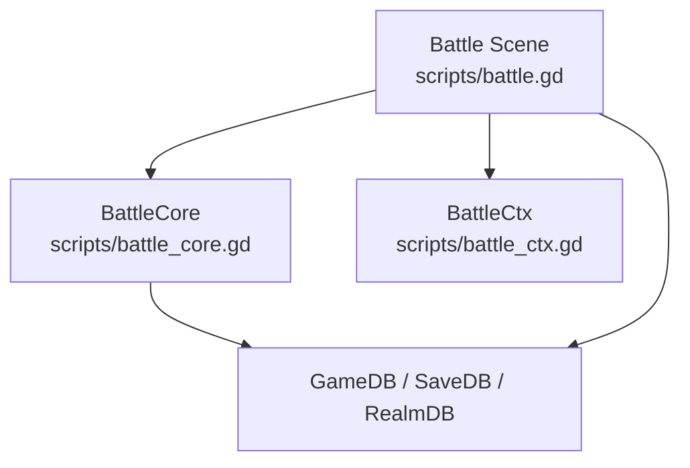
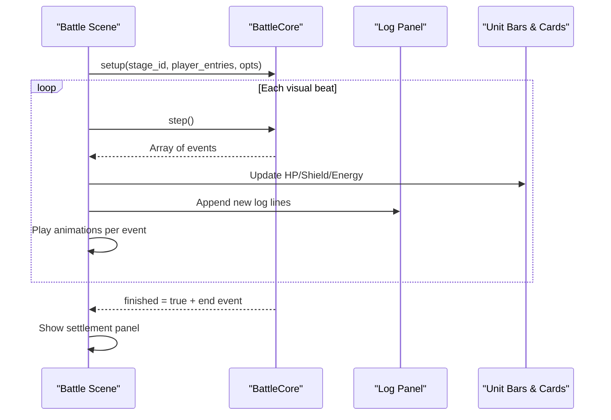
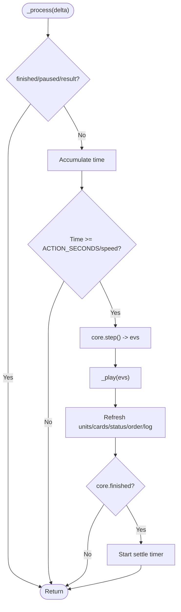
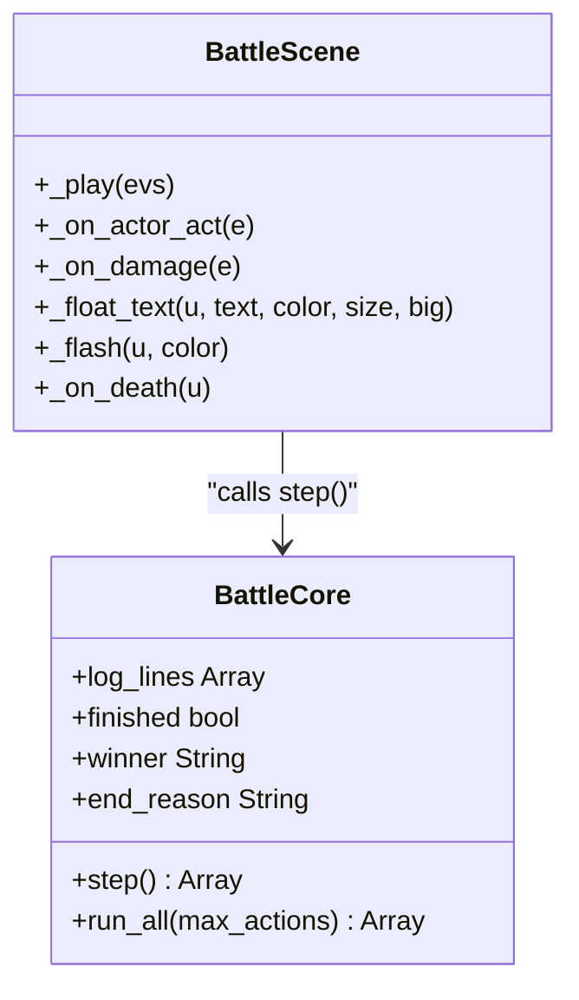
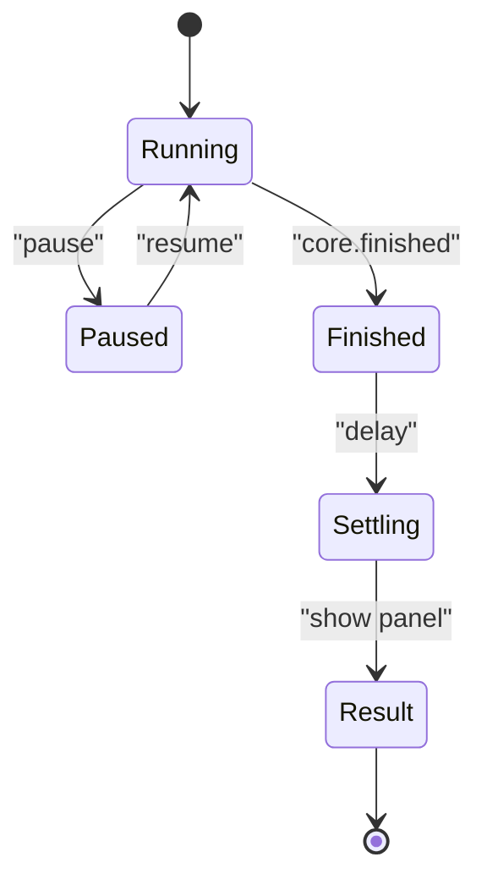
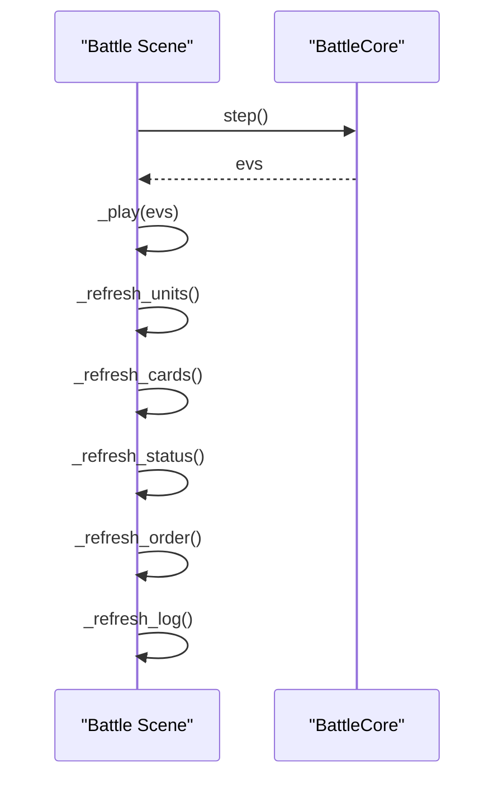
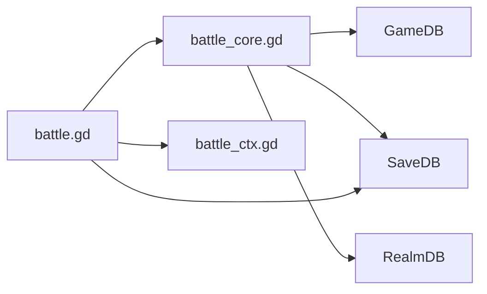

# Battle Visualization Layer

<cite>
**Referenced Files in This Document**
- [battle.gd](file://scripts/battle.gd)
- [battle_core.gd](file://scripts/battle_core.gd)
- [battle_ctx.gd](file://scripts/battle_ctx.gd)
</cite>

## Table of Contents
1. [Introduction](#introduction)
2. [Project Structure](#project-structure)
3. [Core Components](#core-components)
4. [Architecture Overview](#architecture-overview)
5. [Detailed Component Analysis](#detailed-component-analysis)
6. [Dependency Analysis](#dependency-analysis)
7. [Performance Considerations](#performance-considerations)
8. [Troubleshooting Guide](#troubleshooting-guide)
9. [Conclusion](#conclusion)

## Introduction
This document explains the battle visualization layer that renders combat events for the game’s 3x3 turn-based battles. The UI controller receives deterministic event streams from the core simulation and translates them into animations, floating text, health/shield bars, unit highlights, and log entries. It deliberately performs no game logic: all damage, healing, shields, buffs, stuns, deaths, and end conditions are computed by the core system. The visualization layer only consumes those results to present a smooth, timed presentation.

## Project Structure
The battle visualization layer is implemented primarily in the battle scene script, which owns UI nodes (background, units, plates, float text, team cards, logs, result panel). It drives a pure-logic core instance that computes actions and emits events each “beat.” A thin context object carries per-battle metadata between scenes.

**Diagram sources**
- [battle.gd:1-120](file://scripts/battle.gd#L1-L120)
- [battle_core.gd:1-70](file://scripts/battle_core.gd#L1-L70)
- [battle_ctx.gd:1-20](file://scripts/battle_ctx.gd#L1-L20)

**Section sources**
- [battle.gd:1-120](file://scripts/battle.gd#L1-L120)
- [battle_core.gd:1-70](file://scripts/battle_core.gd#L1-L70)
- [battle_ctx.gd:1-20](file://scripts/battle_ctx.gd#L1-L20)

## Core Components
- Battle scene (UI controller): Builds the battlefield, unit tokens, team cards, logs, and result panels. Drives the core step-by-step at a fixed visual cadence and plays animations based on events.
- BattleCore (simulation): Maintains state, schedules turns via an ATB-like timeline, resolves targets, calculates damage/heals/shields/buffs/stuns/deaths, and emits a list of events per action.
- BattleCtx (context): Holds per-session data such as stage id, temporary attack bonus, and seed override used to initialize the core deterministically.

Key responsibilities:
- UI controller: Rendering, timing, user interaction, and event playback. No numeric decisions.
- Core: Deterministic simulation, event emission, and finalization. No rendering or input.

**Section sources**
- [battle.gd:1-120](file://scripts/battle.gd#L1-L120)
- [battle_core.gd:1-70](file://scripts/battle_core.gd#L1-L70)
- [battle_ctx.gd:1-20](file://scripts/battle_ctx.gd#L1-L20)

## Architecture Overview
The visualization layer uses a strict separation of concerns:
- The core runs independently and deterministically given a seed.
- The UI advances the core once per visual beat and plays back the returned events.
- All visuals derive from core state; there is no parallel calculation in the UI.

**Diagram sources**
- [battle.gd:640-670](file://scripts/battle.gd#L640-L670)
- [battle_core.gd:392-425](file://scripts/battle_core.gd#L392-L425)
- [battle_core.gd:792-800](file://scripts/battle_core.gd#L792-L800)

## Detailed Component Analysis

### Event Stream and Playback
The UI controller repeatedly calls the core’s step function and receives an array of events. It then dispatches each event to specific handlers that produce floating text, flashes, bar updates, and log entries.

**Diagram sources**
- [battle.gd:640-670](file://scripts/battle.gd#L640-L670)

**Section sources**
- [battle.gd:640-670](file://scripts/battle.gd#L640-L670)

### Event Types and Visual Responses
The core emits typed events. The UI maps each type to a concrete visual effect without recalculating values.

- action: Indicates an actor is acting (attack, skill, or ultimate). Visuals include a small forward lunge of the sprite and floating name/ult text.
- damage: Shows floating damage number, color changes for crit/counter, and a red flash on the target. If shield absorbs all damage, shows “block” text instead.
- heal: Shows green floating “+value” and a green flash on the target.
- shield: Shows blue floating “shield value” and a blue flash.
- buff: Shows gold floating “ATK +X%”.
- stun_apply: Shows yellow floating “stun” text on the affected unit.
- death: Shows “death” text, scales down the sprite, and dims the plate.
- end: Triggers settlement after a short delay, showing win/loss, stars, rewards, and stats.

**Diagram sources**
- [battle.gd:674-785](file://scripts/battle.gd#L674-L785)
- [battle_core.gd:392-425](file://scripts/battle_core.gd#L392-L425)

**Section sources**
- [battle.gd:674-785](file://scripts/battle.gd#L674-L785)
- [battle_core.gd:405-415](file://scripts/battle_core.gd#L405-L415)
- [battle_core.gd:518-571](file://scripts/battle_core.gd#L518-L571)
- [battle_core.gd:723-761](file://scripts/battle_core.gd#L723-L761)
- [battle_core.gd:792-800](file://scripts/battle_core.gd#L792-L800)

### Timing System
- Fixed visual cadence: The UI accumulates delta time and triggers one core step every ACTION_SECONDS divided by current speed multiplier. This decouples presentation speed from deterministic core ticks.
- Speed control: Users can cycle through speeds, changing the interval between steps.
- Pause/Skip: Pausing stops advancing; skipping runs the core to completion instantly and refreshes UI once.
- Settlement delay: After the core finishes, a short delay precedes the result panel to let the last animation finish.

**Diagram sources**
- [battle.gd:640-670](file://scripts/battle.gd#L640-L670)
- [battle.gd:806-839](file://scripts/battle.gd#L806-L839)

**Section sources**
- [battle.gd:640-670](file://scripts/battle.gd#L640-L670)
- [battle.gd:806-839](file://scripts/battle.gd#L806-L839)

### UI Updates and State Synchronization
After playing events, the UI synchronizes persistent visuals:
- Unit tokens: HP fill width, shield fill placement after HP, energy fill percentage, dead-state dimming.
- Team cards: HP and energy fills plus HP text.
- Status header: Turn count, ally/enemy alive counts.
- Order strip: Next six actors sorted by next-action time.
- Log panel: Appends new lines with color coding for different message types.

**Diagram sources**
- [battle.gd:657-670](file://scripts/battle.gd#L657-L670)
- [battle.gd:532-635](file://scripts/battle.gd#L532-L635)

**Section sources**
- [battle.gd:532-635](file://scripts/battle.gd#L532-L635)
- [battle.gd:657-670](file://scripts/battle.gd#L657-L670)

### Separation from Game Logic
The battle scene explicitly avoids any numeric judgment:
- Damage, healing, shielding, buffs, stuns, and death are fully computed in the core and emitted as events.
- The UI reads event fields and displays them; it does not recompute values.
- The core maintains deterministic behavior via a seeded RNG and ATB scheduling independent of frame time.

This ensures that headless smoke tests and on-screen playbacks produce identical outcomes.

**Section sources**
- [battle.gd:1-12](file://scripts/battle.gd#L1-L12)
- [battle_core.gd:1-15](file://scripts/battle_core.gd#L1-L15)

### Examples of Event-to-Animation Mapping
- Damage: Floating number appears above the target; color indicates critical or counter hit; if shield absorbs everything, shows “block”; target flashes red.
- Heal: Green “+value” floats up; target flashes green.
- Shield: Blue “shield value” floats; target flashes blue.
- Buff: Gold “ATK +X%” floats near the target.
- Stun: Yellow “stun” text appears on the stunned unit; later the core emits a stun event when the unit skips its turn.
- Death: “Death” text floats; sprite shrinks; plate fades.
- End: After a short delay, the result panel shows outcome, stars, rewards, and statistics.

These behaviors are driven by the event dispatcher and helper functions for floating text and flashing.

**Section sources**
- [battle.gd:674-785](file://scripts/battle.gd#L674-L785)
- [battle_core.gd:405-415](file://scripts/battle_core.gd#L405-L415)
- [battle_core.gd:518-571](file://scripts/battle_core.gd#L518-L571)
- [battle_core.gd:723-761](file://scripts/battle_core.gd#L723-L761)
- [battle_core.gd:792-800](file://scripts/battle_core.gd#L792-L800)

## Dependency Analysis
- The UI depends on the core for state and events, and on shared services for data access (GameDB, SaveDB, RealmDB).
- The core depends on data services for configuration and growth calculations but has no UI dependencies.
- BattleCtx provides a clean handoff of per-battle metadata into the core.

**Diagram sources**
- [battle.gd:1-120](file://scripts/battle.gd#L1-L120)
- [battle_core.gd:1-70](file://scripts/battle_core.gd#L1-L70)
- [battle_ctx.gd:1-20](file://scripts/battle_ctx.gd#L1-L20)

**Section sources**
- [battle.gd:1-120](file://scripts/battle.gd#L1-L120)
- [battle_core.gd:1-70](file://scripts/battle_core.gd#L1-L70)
- [battle_ctx.gd:1-20](file://scripts/battle_ctx.gd#L1-L20)

## Performance Considerations
- Deterministic core: Using a fixed seed ensures reproducible simulations, enabling reliable smoke tests and screenshots.
- Decoupled timing: The UI advances the core at a fixed visual cadence, independent of frame rate, ensuring consistent presentation.
- Minimal UI work per beat: Only necessary refreshes occur after events; heavy operations like rebuilding backgrounds are done once.
- Skip mode: Skipping runs the core to completion and refreshes once, avoiding per-frame overhead during long fights.

[No sources needed since this section provides general guidance]

## Troubleshooting Guide
Common issues and where to look:
- Events not appearing: Verify the UI is calling core.step() each beat and that the event dispatcher matches event types.
- Bars not updating: Ensure refresh functions run after events and that bar widths are constrained correctly.
- Logs not scrolling: Confirm new log lines are appended and scroll position is updated after a frame.
- Settlement not showing: Check that core.finished becomes true and the settle timer is started.

Relevant areas:
- Event playback and refresh loop
- Log appending and scrolling
- Settlement flow and timers

**Section sources**
- [battle.gd:640-670](file://scripts/battle.gd#L640-L670)
- [battle.gd:609-635](file://scripts/battle.gd#L609-L635)
- [battle.gd:924-967](file://scripts/battle.gd#L924-L967)

## Conclusion
The battle visualization layer cleanly separates presentation from simulation. The UI controller consumes deterministic events from the core and renders animations, text, and UI updates without performing game logic. The timing system ensures smooth playback regardless of core tick frequency, while the event-driven design makes it straightforward to add new effects or adjust presentation without touching the core. This architecture supports both interactive play and automated testing with predictable outcomes.

[No sources needed since this section summarizes without analyzing specific files]