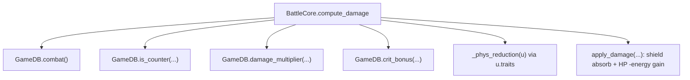
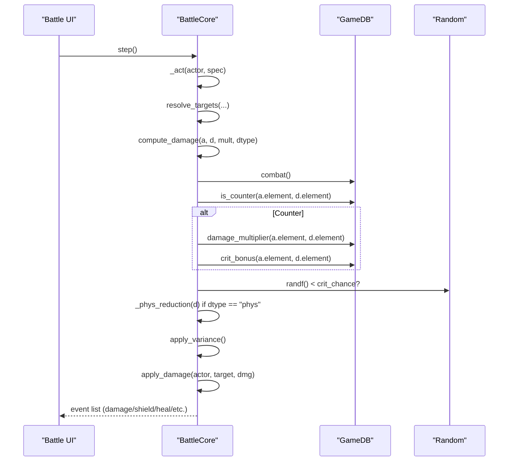
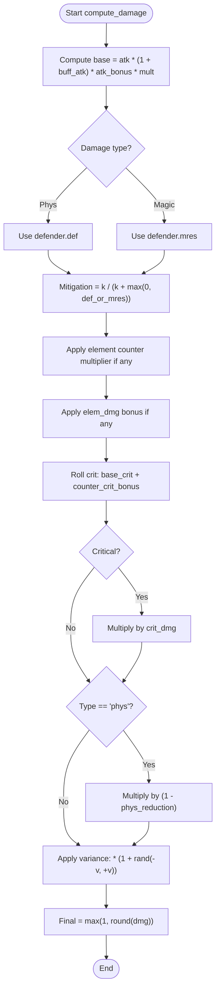

# Damage Calculation & Mitigation

<cite>
**Referenced Files in This Document**
- [battle_core.gd](file://scripts/battle_core.gd)
- [game_db.gd](file://scripts/game_db.gd)
- [game_data.json](file://data/game_data.json)
- [apply_chapter1.py](file://tools/_inspect/apply_chapter1.py)
- [main_menu_suite.gd](file://tools/suites/main_menu_suite.gd)
- [battle_suite.gd](file://tools/suites/battle_suite.gd)
</cite>

## Table of Contents
1. Introduction
2. Project Structure
3. Core Components
4. Architecture Overview
5. Detailed Component Analysis
6. Dependency Analysis
7. Performance Considerations
8. Troubleshooting Guide
9. Conclusion
10. Appendices

## Introduction
This document explains the complete damage calculation and mitigation system used in the battle core. It covers:
- The full damage formula, including attack scaling, defense/magic resistance mitigation using k/(k+defense), element counter multipliers, critical hit mechanics, physical damage reduction from traits (e.g., granite armor), and variance randomization.
- How physical damage uses defense while magic damage uses magic resistance.
- The element counter chain Water→Fire→Wind→Earth→Light↔Dark and how counter attacks receive bonus critical chance.
- Shield absorption mechanics and how shields interact with damage.
- Energy accumulation tied to damage dealt and received.
- Concrete examples for different scenarios: elemental advantages, critical hits, and shield interactions.

## Project Structure
The damage system is implemented primarily in the battle core logic and configuration layer:
- BattleCore computes damage, applies mitigations, handles shields, energy, and events.
- GameDB provides element relationships, combat parameters, and counters.
- game_data.json defines elements, combat constants, and ATB parameters.
- Tooling scripts demonstrate and assert behavior for counters, granite armor, and shield effects.

**Diagram sources**
- [battle_core.gd:672-710](file://scripts/battle_core.gd#L672-L710)
- [game_db.gd:107-108](file://scripts/game_db.gd#L107-L108)
- [game_db.gd:84-102](file://scripts/game_db.gd#L84-L102)

**Section sources**
- [battle_core.gd:672-710](file://scripts/battle_core.gd#L672-L710)
- [game_db.gd:84-102](file://scripts/game_db.gd#L84-L102)
- [game_data.json:119-132](file://data/game_data.json#L119-L132)

## Core Components
- Damage computation pipeline: compute_damage calculates raw damage, applies defense/mres mitigation, element counter multiplier, crit check, physical trait reduction, and variance.
- Shield absorption: apply_damage absorbs damage into target’s shield before reducing HP.
- Energy system: attackers gain energy per hit; targets gain energy per damage taken.
- Element counter system: defined by GameDB based on elements table; provides both damage multiplier and extra crit chance when countering.
- Physical trait reduction: traits like granite_armor provide phys_reduction that reduces incoming physical damage.

**Section sources**
- [battle_core.gd:672-710](file://scripts/battle_core.gd#L672-L710)
- [battle_core.gd:723-735](file://scripts/battle_core.gd#L723-L735)
- [game_db.gd:84-102](file://scripts/game_db.gd#L84-L102)
- [game_data.json:119-132](file://data/game_data.json#L119-L132)

## Architecture Overview
The flow of a single attack action through the battle core:

**Diagram sources**
- [battle_core.gd:477-515](file://scripts/battle_core.gd#L477-L515)
- [battle_core.gd:672-710](file://scripts/battle_core.gd#L672-L710)
- [battle_core.gd:723-735](file://scripts/battle_core.gd#L723-L735)
- [game_db.gd:84-102](file://scripts/game_db.gd#L84-L102)

## Detailed Component Analysis

### Damage Formula and Pipeline
The damage formula applied per target is:
- Base damage = attacker.atk × (1 + buff_atk) × atk_bonus × skill.mult
- Defense mitigation:
  - If damage type is "phys": use defender.def
  - If damage type is "magic": use defender.mres
  - Mitigation factor = k / (k + max(0, defense_or_mres)), where k = combat.def_reduction_k
- Element counter multiplier:
  - If attacker.element counters defender.element, multiply by combat.counter_damage_mult
- Elemental synergy bonus:
  - If attacker has elem_dmg for its own element, multiply by (1 + bonus)
- Critical hit:
  - crit_chance = attacker.crit + (counter ? combat.counter_crit_bonus : 0)
  - Roll RNG; if success, multiply by attacker.crit_dmg
- Physical trait reduction:
  - For "phys" damage only, multiply by (1 - phys_cut), where phys_cut is the maximum phys_reduction among target’s traits
- Variance:
  - Multiply by (1 + random(-variance, +variance)), where variance = combat.damage_variance
- Final value = max(1, round(dmg))

Key references:
- Attack scaling and base: [battle_core.gd:672-675](file://scripts/battle_core.gd#L672-L675)
- Defense vs mres selection and mitigation: [battle_core.gd:677-680](file://scripts/battle_core.gd#L677-L680)
- Counter multiplier and synergy bonus: [battle_core.gd:682-691](file://scripts/battle_core.gd#L682-L691)
- Crit chance and crit multiplier: [battle_core.gd:693-696](file://scripts/battle_core.gd#L693-L696)
- Physical trait reduction: [battle_core.gd:698-699](file://scripts/battle_core.gd#L698-L699), [battle_core.gd:714-720](file://scripts/battle_core.gd#L714-L720)
- Variance: [battle_core.gd:701-702](file://scripts/battle_core.gd#L701-L702)
- Combat constants: [game_data.json:119-132](file://data/game_data.json#L119-L132)

**Section sources**
- [battle_core.gd:672-710](file://scripts/battle_core.gd#L672-L710)
- [game_data.json:119-132](file://data/game_data.json#L119-L132)

### Element Counter Chain and Bonuses
- Elements and their strong_against relationships are defined in game_data.json under elements.table.
- The chain includes:
  - Water strong against Fire
  - Fire strong against Wind
  - Wind strong against Earth
  - Earth strong against Water
  - Light strong against Dark
  - Dark strong against Light
- When an attacker’s element counters the defender’s element:
  - Damage multiplier = combat.counter_damage_mult (default 1.25)
  - Additional crit chance = combat.counter_crit_bonus (default 0.10)
- These values are read via GameDB functions:
  - is_counter(attacker_elem, defender_elem)
  - damage_multiplier(attacker_elem, defender_elem)
  - crit_bonus(attacker_elem, defender_elem)

References:
- Elements and order: [game_data.json:59-117](file://data/game_data.json#L59-L117)
- Counter checks and bonuses: [game_db.gd:84-102](file://scripts/game_db.gd#L84-L102)
- Assertions in tests: [main_menu_suite.gd:77-90](file://tools/suites/main_menu_suite.gd#L77-L90)

**Section sources**
- [game_data.json:59-117](file://data/game_data.json#L59-L117)
- [game_db.gd:84-102](file://scripts/game_db.gd#L84-L102)
- [main_menu_suite.gd:77-90](file://tools/suites/main_menu_suite.gd#L77-L90)

### Shield Absorption Mechanics
- Shields are stored per unit and can be granted by synergies or traits (e.g., granite_armor).
- During apply_damage:
  - If target.shield > 0, absorbed = min(target.shield, computed_damage_value)
  - target.shield -= absorbed
  - Remaining damage reduces HP
- Granite armor trait:
  - At start of battle, grants a permanent shield equal to a percentage of max_hp
  - Also provides phys_reduction to reduce incoming physical damage
- References:
  - Shield application and expiry: [battle_core.gd:227-239](file://scripts/battle_core.gd#L227-L239), [battle_core.gd:538-553](file://scripts/battle_core.gd#L538-L553)
  - Shield absorption in damage: [battle_core.gd:723-730](file://scripts/battle_core.gd#L723-L730)
  - Granite armor trait definition: [apply_chapter1.py:121-132](file://tools/_inspect/apply_chapter1.py#L121-L132)

**Section sources**
- [battle_core.gd:227-239](file://scripts/battle_core.gd#L227-L239)
- [battle_core.gd:538-553](file://scripts/battle_core.gd#L538-L553)
- [battle_core.gd:723-730](file://scripts/battle_core.gd#L723-L730)
- [apply_chapter1.py:121-132](file://tools/_inspect/apply_chapter1.py#L121-L132)

### Physical Damage Reduction from Traits (Granite Armor)
- Target’s traits may include phys_reduction.
- During compute_damage, for "phys" damage, the highest phys_reduction among traits is applied as a multiplicative reduction: dmg *= (1 - phys_cut).
- Tests verify that granite_armor yields ~30% physical damage reduction and does not affect magic damage.

References:
- Trait reading and reduction: [battle_core.gd:714-720](file://scripts/battle_core.gd#L714-L720)
- Test assertions: [battle_suite.gd:292-322](file://tools/suites/battle_suite.gd#L292-L322)

**Section sources**
- [battle_core.gd:714-720](file://scripts/battle_core.gd#L714-L720)
- [battle_suite.gd:292-322](file://tools/suites/battle_suite.gd#L292-L322)

### Energy Accumulation System
- Attacker gains energy per hit: ult_energy_per_hit (default 12) multiplied by number of targets hit.
- Target gains energy per damage taken: ult_energy_per_taken (default 8).
- Energy caps at 100.
- When energy reaches the cap, the unit releases its ultimate ability first before normal actions.

References:
- Energy per hit: [battle_core.gd:503-505](file://scripts/battle_core.gd#L503-L505)
- Energy per taken: [battle_core.gd:734-735](file://scripts/battle_core.gd#L734-L735)
- Ultimate trigger: [battle_core.gd:442-451](file://scripts/battle_core.gd#L442-L451)
- Constants: [game_data.json:126-132](file://data/game_data.json#L126-L132)

**Section sources**
- [battle_core.gd:503-505](file://scripts/battle_core.gd#L503-L505)
- [battle_core.gd:734-735](file://scripts/battle_core.gd#L734-L735)
- [battle_core.gd:442-451](file://scripts/battle_core.gd#L442-L451)
- [game_data.json:126-132](file://data/game_data.json#L126-L132)

### Flowchart of Damage Computation

**Diagram sources**
- [battle_core.gd:672-710](file://scripts/battle_core.gd#L672-L710)
- [game_data.json:119-132](file://data/game_data.json#L119-L132)

## Dependency Analysis
- BattleCore depends on GameDB for:
  - Combat constants (def_reduction_k, counter_damage_mult, counter_crit_bonus, base_crit_damage, damage_variance, ATB settings)
  - Element relationships (is_counter, damage_multiplier, crit_bonus)
- GameDB reads from game_data.json which centralizes all balance parameters and element definitions.
- Tooling suites validate behavior and ensure consistency between code and config.

**Diagram sources**
- [game_data.json:59-132](file://data/game_data.json#L59-L132)
- [game_db.gd:84-108](file://scripts/game_db.gd#L84-L108)
- [battle_core.gd:672-710](file://scripts/battle_core.gd#L672-L710)

**Section sources**
- [game_data.json:59-132](file://data/game_data.json#L59-L132)
- [game_db.gd:84-108](file://scripts/game_db.gd#L84-L108)
- [battle_core.gd:672-710](file://scripts/battle_core.gd#L672-L710)

## Performance Considerations
- Deterministic RNG seed ensures reproducible results across runs, aiding testing and debugging.
- Linear scans over units are acceptable due to small team sizes (≤12 units).
- Avoid unnecessary recomputation: combat constants are read once per call path; element checks are O(1) lookups.
- Variance introduces randomness but is bounded and cheap.

[No sources needed since this section provides general guidance]

## Troubleshooting Guide
- Unexpected high/low damage:
  - Check element counter status and counter multiplier/crit bonus in GameDB.
  - Verify defense/mres values and def_reduction_k constant.
  - Inspect traits for phys_reduction on physical damage.
- Shields not absorbing:
  - Ensure target.shield > 0 and shield_until not expired.
  - Confirm granite_armor or synergy open_shield was applied at setup.
- Energy not filling:
  - Verify ult_energy_per_hit and ult_energy_per_taken constants.
  - Confirm energy cap at 100 and that ult triggers correctly.
- Reproducibility issues:
  - Set seed_override to a fixed value for deterministic runs.

**Section sources**
- [battle_core.gd:227-239](file://scripts/battle_core.gd#L227-L239)
- [battle_core.gd:723-735](file://scripts/battle_core.gd#L723-L735)
- [game_data.json:119-132](file://data/game_data.json#L119-L132)

## Conclusion
The damage system combines robust mitigation (defense/mres via k/(k+def)), element counters with configurable multipliers and crit bonuses, critical hit mechanics, physical trait reductions, and variance. Shields absorb damage before HP loss, and energy accumulates both on dealing and receiving damage to enable strategic ultimate usage. The design keeps balance parameters centralized in configuration and encapsulates complex logic in BattleCore, ensuring clarity and testability.

[No sources needed since this section summarizes without analyzing specific files]

## Appendices

### Concrete Examples

#### Example 1: Elemental Advantage (Water vs Fire)
- Attacker: Water element, atk=500, crit=5%, crit_dmg=150%
- Defender: Fire element, def=200, mres=0
- Constants: k=300, counter_damage_mult=1.25, counter_crit_bonus=10%, damage_variance=5%
- Steps:
  - Base = 500 × 1.0 × 1.0 × 1.0 = 500
  - Mitigation = 300 / (300 + 200) = 0.6 → 500 × 0.6 = 300
  - Counter multiplier = 1.25 → 300 × 1.25 = 375
  - Crit chance = 5% + 10% = 15%; roll RNG
  - If crit: 375 × 1.5 = 562.5
  - Variance: ±5% around final value
  - Final rounded to nearest integer, minimum 1

References:
- [battle_core.gd:672-710](file://scripts/battle_core.gd#L672-L710)
- [game_data.json:119-132](file://data/game_data.json#L119-L132)

#### Example 2: Magic Damage vs High Magic Resistance
- Attacker: Magic damage, atk=400, mult=1.0
- Defender: mres=400, no def relevance
- Constants: k=300
- Steps:
  - Base = 400
  - Mitigation = 300 / (300 + 400) ≈ 0.4286 → 400 × 0.4286 ≈ 171
  - No element counter unless applicable
  - Crit and variance apply as usual

References:
- [battle_core.gd:677-680](file://scripts/battle_core.gd#L677-L680)
- [game_data.json:119-132](file://data/game_data.json#L119-L132)

#### Example 3: Shield Interaction (Granite Armor Boss)
- Boss has granite_armor trait: phys_reduction=30%, open shield = 20% max_hp
- Attacker deals 1000 physical damage
- Steps:
  - Compute damage with mitigation and possible counter/crit/variance
  - Apply phys_reduction: dmg × (1 - 0.30)
  - Shield absorbs up to available shield amount
  - Remaining damage reduces HP

References:
- [apply_chapter1.py:121-132](file://tools/_inspect/apply_chapter1.py#L121-L132)
- [battle_core.gd:227-239](file://scripts/battle_core.gd#L227-L239)
- [battle_core.gd:714-720](file://scripts/battle_core.gd#L714-L720)
- [battle_core.gd:723-730](file://scripts/battle_core.gd#L723-L730)

#### Example 4: Critical Hit Without Counter
- Attacker: crit=5%, crit_dmg=150%
- Defender: same element, no counter
- Steps:
  - Crit chance = 5%
  - If crit: multiply by 1.5; otherwise normal damage
  - Variance ±5%

References:
- [battle_core.gd:693-696](file://scripts/battle_core.gd#L693-L696)
- [game_data.json:119-132](file://data/game_data.json#L119-L132)