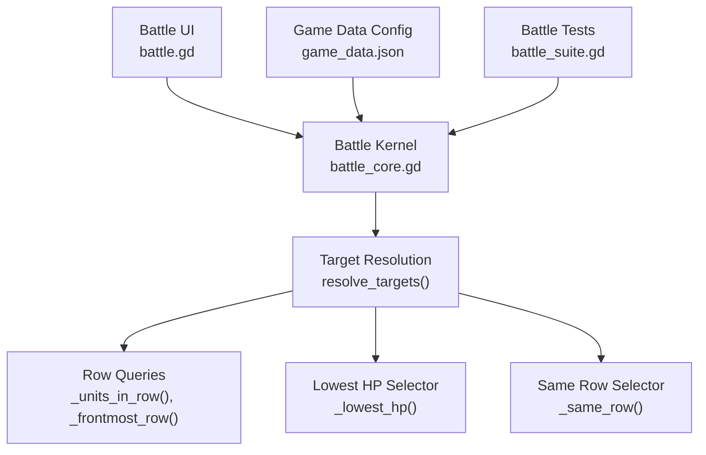
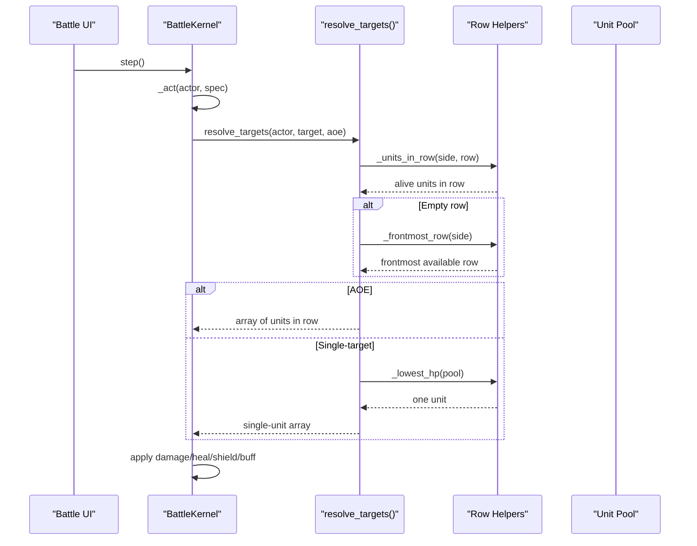
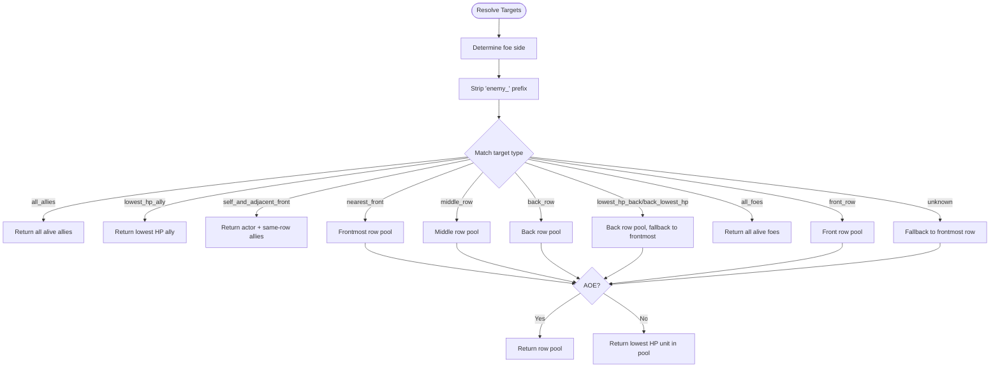
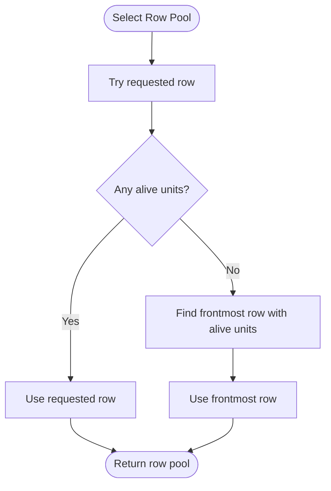
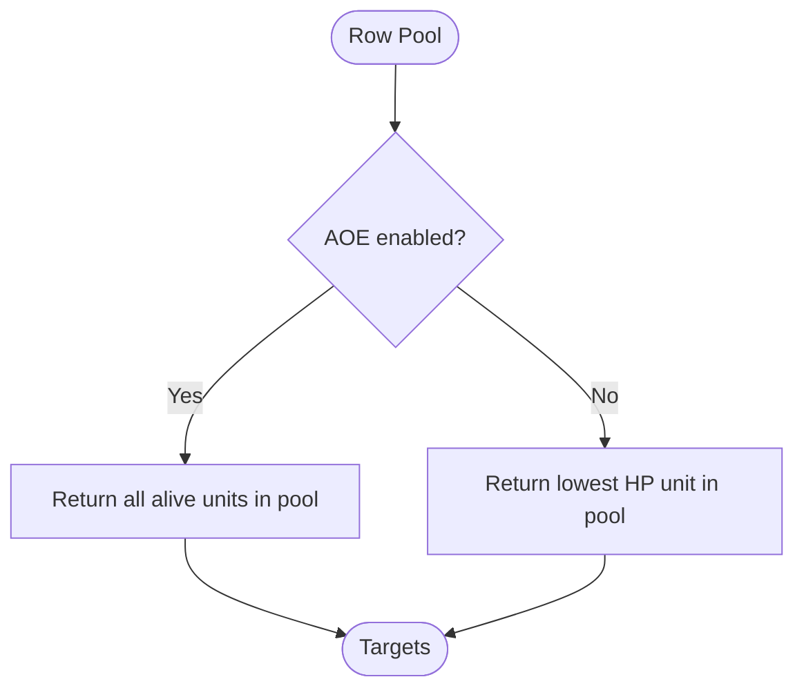
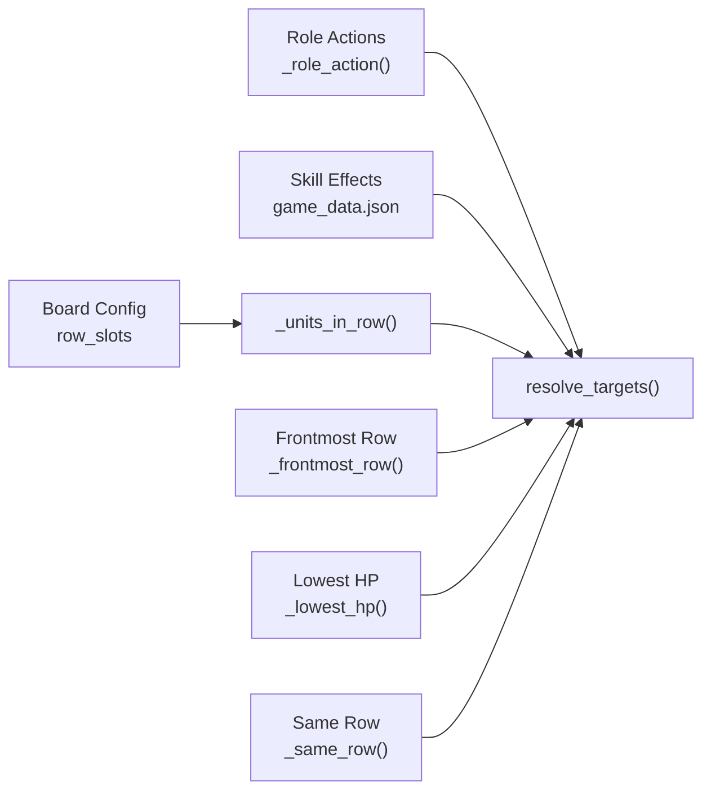

# Target Selection Logic

<cite>
**Referenced Files in This Document**
- [battle_core.gd](file://scripts/battle_core.gd)
- [game_data.json](file://data/game_data.json)
- [battle_suite.gd](file://tools/suites/battle_suite.gd)
</cite>

## Table of Contents
1. [Introduction](#introduction)
2. [Project Structure](#project-structure)
3. [Core Components](#core-components)
4. [Architecture Overview](#architecture-overview)
5. [Detailed Component Analysis](#detailed-component-analysis)
6. [Dependency Analysis](#dependency-analysis)
7. [Performance Considerations](#performance-considerations)
8. [Troubleshooting Guide](#troubleshooting-guide)
9. [Conclusion](#conclusion)

## Introduction
This document explains the target selection system that determines which units are affected by attacks, heals, shields, and buffs in the battle simulation. It covers:
- The supported target types such as `nearest_front`, `middle_row`, `back_row`, `lowest_hp_back`, `all_allies`, and `self_and_adjacent_front`.
- How row-based targeting works with front, middle, and back positioning.
- How empty rows fall back to the frontmost available row.
- The difference between single-target and area-of-effect (AOE) targeting.
- Examples from roles and abilities, including archers targeting low HP enemies in the back row and healers targeting allies.
- Why the system is deterministic and how it supports reproducible battle outcomes.

The core logic lives in the battle kernel, while character and skill configurations define which target patterns each role or ability uses.

## Project Structure
The target selection system is implemented primarily in the battle kernel script and referenced by game data configuration:
- The battle kernel defines target resolution helpers, row queries, and the main target selector.
- Game data defines default role actions and specific skill effects that declare target strings like `enemy_middle_row` or `enemy_back_lowest_hp`.
- Test suites assert expected behavior for key target patterns.

**Diagram sources**
- [battle_core.gd:576-667](file://scripts/battle_core.gd#L576-L667)
- [game_data.json:485-505](file://data/game_data.json#L485-L505)
- [battle_suite.gd:334-348](file://tools/suites/battle_suite.gd#L334-L348)

**Section sources**
- [battle_core.gd:1-15](file://scripts/battle_core.gd#L1-L15)
- [game_data.json:119-162](file://data/game_data.json#L119-L162)

## Core Components
The target selection system is centered around a few key responsibilities:
- Role-based default actions determine common target patterns for basic attacks.
- Skill and ultimate effects override defaults with explicit target strings.
- The central resolver maps target strings to actual unit arrays.
- Helpers compute row membership, frontmost row fallback, lowest HP selection, and same-row ally selection.

Key implementation points:
- Default role actions include nearest-front physical attacks for tanks/warriors, middle-row magic AOE for mages, back-row lowest HP physical attacks for archers/assassins, lowest HP ally healing for healers, and all-allies attack buffing for supports.
- Target strings may be prefixed with `enemy_`; the resolver strips this prefix so both `middle_row` and `enemy_middle_row` resolve consistently.
- Single-target vs AOE is controlled by an `aoe` flag passed alongside the target string.

**Section sources**
- [battle_core.gd:269-284](file://scripts/battle_core.gd#L269-L284)
- [battle_core.gd:492-516](file://scripts/battle_core.gd#L492-L516)
- [battle_core.gd:576-611](file://scripts/battle_core.gd#L576-L611)

## Architecture Overview
The target selection flow connects configuration-driven abilities to deterministic unit selection.

**Diagram sources**
- [battle_core.gd:441-466](file://scripts/battle_core.gd#L441-L466)
- [battle_core.gd:492-516](file://scripts/battle_core.gd#L492-L516)
- [battle_core.gd:576-655](file://scripts/battle_core.gd#L576-L655)

## Detailed Component Analysis

### Target Types and Behavior
The resolver supports several semantic target types. All enemy-facing targets are relative to the actor’s opponent side; ally-facing targets are relative to the actor’s own side.

| Target String | Meaning | Single-Target Behavior | AOE Behavior | Notes |
|---|---|---|---|---|
| `nearest_front` | Opponent’s frontmost row | Picks lowest HP unit in frontmost row | Hits all alive units in frontmost row | Falls back to frontmost available row if front is empty |
| `middle_row` | Opponent’s middle row | Picks lowest HP unit in middle row | Hits all alive units in middle row | Falls back to frontmost available row if middle is empty |
| `back_row` | Opponent’s back row | Picks lowest HP unit in back row | Hits all alive units in back row | Falls back to frontmost available row if back is empty |
| `lowest_hp_back` or `back_lowest_hp` | Opponent’s back row, lowest HP | Picks lowest HP unit in back row | If back row has units, hits them; otherwise falls back to frontmost row AOE | Accepts two word orders for compatibility |
| `all_allies` | All living allies on actor’s side | Returns all allies | Same as single-target because it already returns the full ally pool | Used by healers and support buffs |
| `lowest_hp_ally` | Lowest HP ally on actor’s side | Returns the single lowest HP ally | Not typically used with AOE | Used by healers when not using all-allies |
| `self_and_adjacent_front` | Actor plus same-side same-row allies | Returns actor plus other alive allies in the same row | Same result set | Used by knight-style shield skills |
| `all_foes` | All living opponents | Returns all foes | Same as single-target because it already returns the full foe pool | Used by cross-row AOE ultimates |

Additional behaviors:
- Unknown target strings fall back to the frontmost row with the same AOE semantics as `nearest_front`.
- Target strings can be prefixed with `enemy_`; the resolver strips this prefix before matching.

**Diagram sources**
- [battle_core.gd:576-655](file://scripts/battle_core.gd#L576-L655)

**Section sources**
- [battle_core.gd:576-655](file://scripts/battle_core.gd#L576-L655)

### Row-Based Positioning and Empty Row Fallback
Rows are defined as front, middle, and back. The board configuration maps slot numbers to rows:
- Front: slots 1, 2, 3
- Middle: slots 4, 5, 6
- Back: slots 7, 8, 9

When a target specifies a particular row but that row has no alive units, the system falls back to the frontmost row that still has alive units. This ensures abilities do not fail silently due to empty rows.

For example:
- `middle_row` with no middle enemies falls back to the frontmost row.
- `back_row` with no back enemies falls back to the frontmost row.
- `lowest_hp_back` first tries the back row; if empty, it uses the frontmost row instead.

**Diagram sources**
- [battle_core.gd:614-633](file://scripts/battle_core.gd#L614-L633)
- [game_data.json:133-157](file://data/game_data.json#L133-L157)

**Section sources**
- [battle_core.gd:614-633](file://scripts/battle_core.gd#L614-L633)
- [game_data.json:133-157](file://data/game_data.json#L133-L157)

### Single-Target vs Area-of-Effect Targeting
The `aoe` flag changes how a row-based target resolves:
- If `aoe` is true, the entire row pool is returned.
- If `aoe` is false, only the lowest HP unit in the pool is returned.

This distinction is important:
- Mages use middle-row AOE to hit multiple enemies at once.
- Archers and assassins use back-row lowest HP to focus a single fragile target.
- Knights use `self_and_adjacent_front` to protect themselves and nearby allies.

**Diagram sources**
- [battle_core.gd:647-655](file://scripts/battle_core.gd#L647-L655)
- [battle_core.gd:636-644](file://scripts/battle_core.gd#L636-L644)

**Section sources**
- [battle_core.gd:636-655](file://scripts/battle_core.gd#L636-L655)

### Deterministic Target Selection
The lowest HP selector iterates through the candidate pool and picks the first unit whose HP is strictly lower than the current best. There is no randomization in target selection. This design ensures that:
- The same battle state always selects the same target.
- Battle logs and test assertions remain stable across runs.
- Reproducible outcomes are possible even when randomness affects damage variance or crit rolls.

The comment in the code explicitly states that deterministic selection avoids making battle reports unreproducible.

**Section sources**
- [battle_core.gd:636-644](file://scripts/battle_core.gd#L636-L644)

### Role-Based Target Patterns
Default role actions define typical combat behavior:
- Tanks and warriors: nearest-front physical attack.
- Mages: middle-row magic attack with AOE.
- Archers and assassins: back-row lowest HP physical attack.
- Healers: lowest HP ally heal.
- Supports: all-allies attack buff.

These defaults make roles feel distinct without hardcoding every ability into the kernel.

**Section sources**
- [battle_core.gd:269-284](file://scripts/battle_core.gd#L269-L284)

### Ability Examples from Game Data
Character and skill configurations demonstrate how target strings are used in practice.

#### Knight Shield: Self and Adjacent Front
The knight’s ultimate applies a shield to itself and adjacent front allies. The effect uses `shield_all` with `target = self_and_adjacent_front`.

- Configuration path: character skill effect target.
- Behavior: returns the actor plus other alive allies in the same row.

**Section sources**
- [game_data.json:485-505](file://data/game_data.json#L485-L505)
- [battle_core.gd:538-553](file://scripts/battle_core.gd#L538-L553)
- [battle_core.gd:658-667](file://scripts/battle_core.gd#L658-L667)

#### Mage AOE: Enemy Middle Row
The mage’s ultimate targets enemy middle row with AOE magic damage.

- Configuration path: character skill effect target and AOE flag.
- Behavior: hits all alive enemies in the middle row.

**Section sources**
- [game_data.json:553-576](file://data/game_data.json#L553-L576)
- [battle_core.gd:492-516](file://scripts/battle_core.gd#L492-L516)

#### Archer Focus Fire: Enemy Back Lowest HP
The archer’s ultimate targets the enemy back row’s lowest HP unit.

- Configuration path: character skill effect target.
- Behavior: selects the lowest HP enemy in the back row; if the back row is empty, it falls back to the frontmost row.

**Section sources**
- [game_data.json:624-642](file://data/game_data.json#L624-L642)
- [battle_core.gd:599-607](file://scripts/battle_core.gd#L599-L607)

#### Healer Support: All Allies
The healer’s ultimate heals all allies.

- Configuration path: character skill effect target.
- Behavior: returns all alive allies on the actor’s side.

**Section sources**
- [game_data.json:697-719](file://data/game_data.json#L697-L719)
- [battle_core.gd:518-535](file://scripts/battle_core.gd#L518-L535)

### Cross-Row AOE Example
Some ultimates need to target all enemies regardless of row. The kernel provides `all_foes` for this case, bypassing row-specific logic.

**Section sources**
- [battle_core.gd:592-594](file://scripts/battle_core.gd#L592-L594)

## Dependency Analysis
Target selection depends on several supporting systems:

**Diagram sources**
- [battle_core.gd:269-284](file://scripts/battle_core.gd#L269-L284)
- [battle_core.gd:576-667](file://scripts/battle_core.gd#L576-L667)
- [game_data.json:133-157](file://data/game_data.json#L133-L157)

**Section sources**
- [battle_core.gd:269-284](file://scripts/battle_core.gd#L269-L284)
- [battle_core.gd:576-667](file://scripts/battle_core.gd#L576-L667)
- [game_data.json:133-157](file://data/game_data.json#L133-L157)

## Performance Considerations
Target selection is designed for small unit counts:
- The unit list is short (up to 12 units), so linear scans are acceptable.
- `_units_in_row` filters by side, alive status, and slot membership.
- `_lowest_hp` performs a simple linear scan to find the minimum HP unit.
- `_frontmost_row` checks rows in fixed order until it finds one with alive units.

There is no complex sorting or heap structure for target selection, keeping the logic simple and predictable.

[No sources needed since this section provides general guidance]

## Troubleshooting Guide
Common issues and how to diagnose them:

| Symptom | Likely Cause | How to Investigate |
|---|---|---|
| Ability hits unexpected row | Requested row is empty and fallback triggers | Check whether the target row has alive units; verify `_frontmost_row` fallback |
| AOE does not hit multiple enemies | `aoe` flag is false | Confirm the ability config sets `aoe: true` for multi-target abilities |
| Lowest HP target seems random | Misunderstanding of deterministic selection | Verify HP values; remember ties keep the first encountered unit |
| `enemy_middle_row` does not match | Missing `enemy_` prefix handling confusion | Remember the resolver strips `enemy_` before matching |
| Knight shield hits wrong allies | Wrong row assignment or dead ally filtering | Check actor’s row and whether allies are alive |

Useful references:
- Target resolver logic and fallback rules.
- Row slot definitions.
- Test assertions for `nearest_front`, `lowest_hp_back`, and middle-row AOE.

**Section sources**
- [battle_core.gd:576-655](file://scripts/battle_core.gd#L576-L655)
- [game_data.json:133-157](file://data/game_data.json#L133-L157)
- [battle_suite.gd:334-348](file://tools/suites/battle_suite.gd#L334-L348)

## Conclusion
The target selection system provides a clear, configuration-driven way to decide who gets hit by attacks, heals, shields, and buffs. It supports intuitive target types like nearest front, middle row, back row, lowest HP back, all allies, and self-and-adjacent-front. Row-based targeting gracefully handles empty rows by falling back to the frontmost available row. Single-target and AOE behaviors are distinguished by an explicit flag, enabling focused strikes and broad sweeps. Role defaults and character skill configurations together express common combat patterns, while deterministic selection ensures reproducible battles.