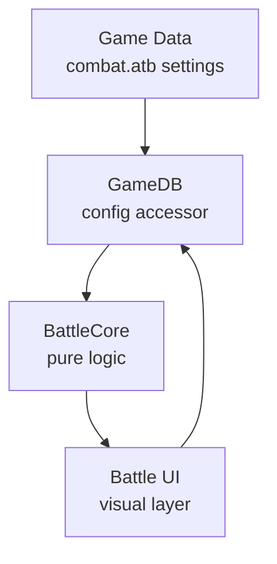
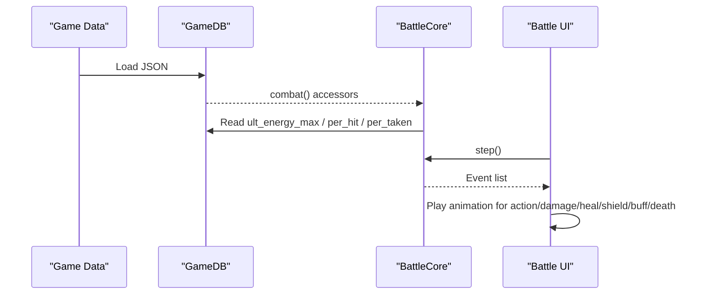
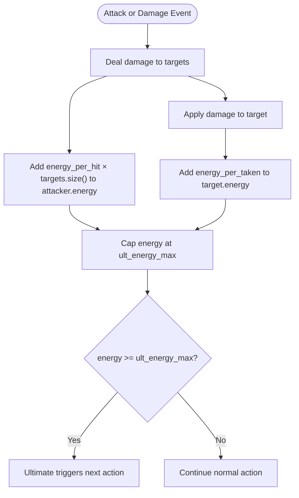
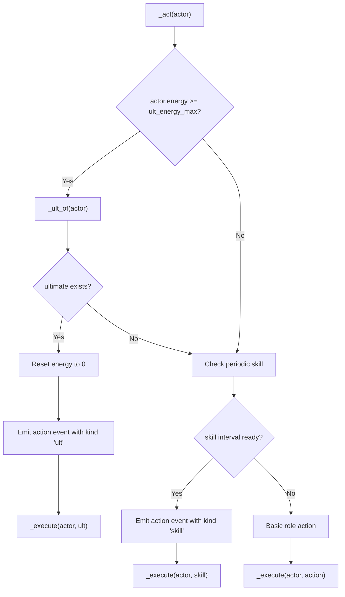
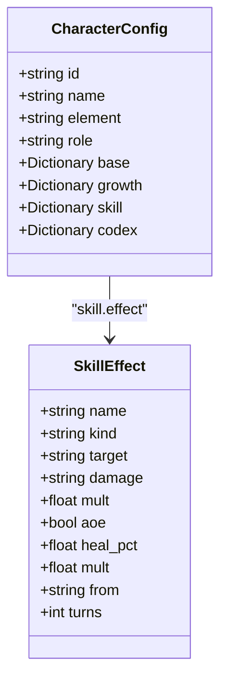
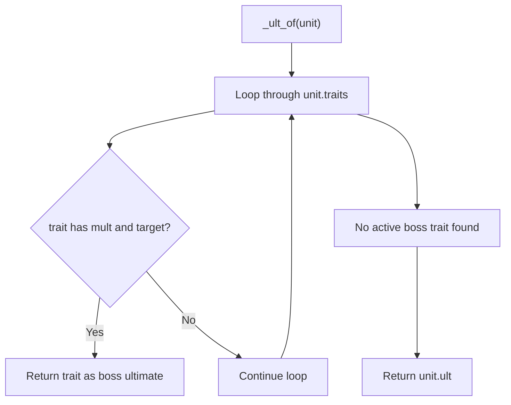
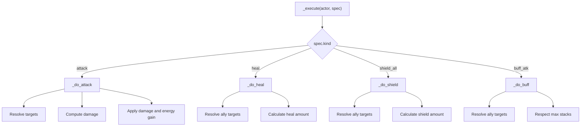
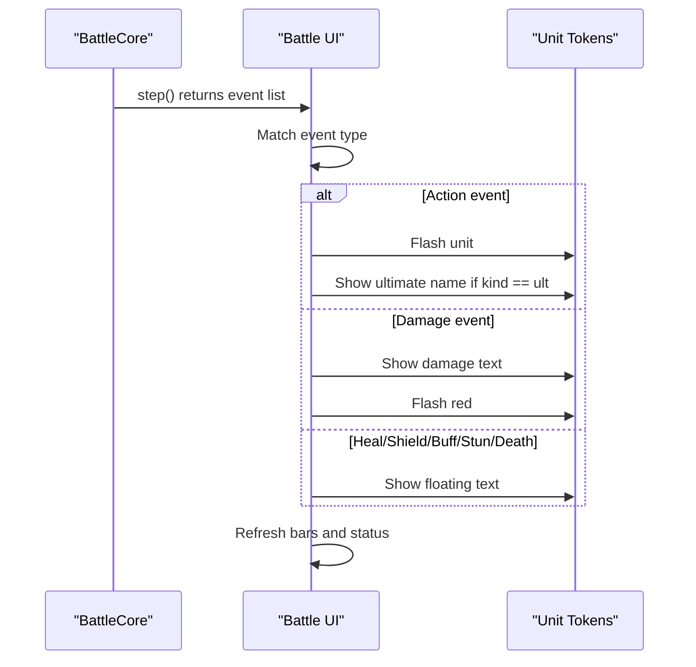
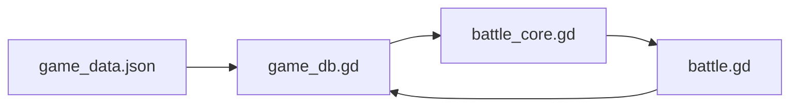

# Ultimate Ability System

<cite>
**Referenced Files in This Document**
- [battle_core.gd](file://scripts/battle_core.gd)
- [battle.gd](file://scripts/battle.gd)
- [game_db.gd](file://scripts/game_db.gd)
- [game_data.json](file://data/game_data.json)
</cite>

## Table of Contents
1. [Introduction](#introduction)
2. [Project Structure](#project-structure)
3. [Core Components](#core-components)
4. [Architecture Overview](#architecture-overview)
5. [Detailed Component Analysis](#detailed-component-analysis)
6. [Dependency Analysis](#dependency-analysis)
7. [Performance Considerations](#performance-considerations)
8. [Troubleshooting Guide](#troubleshooting-guide)
9. [Conclusion](#conclusion)

## Introduction
This document explains the ultimate ability system used by the battle engine. It covers:
- How energy accumulates through dealing damage and taking hits, with configurable values for energy per hit and energy per taken.
- The priority system where ultimates trigger before regular skills or basic attacks when energy reaches the maximum threshold.
- How ultimates are defined in character configurations and how boss ultimates differ from player character ultimates through the traits system.
- Examples of different ultimate effects such as area damage, healing, shielding, and buffs.
- The visual presentation layer that displays ultimate animations while keeping core logic pure and testable.

The system is designed so that all numerical decisions happen in a pure logic layer, while the UI only plays events returned by that layer. This makes outcomes deterministic and testable even without graphics.

## Project Structure
The ultimate ability system spans three main areas:
- Configuration data defines combat parameters, including energy thresholds and accumulation rates.
- Battle core implements the turn-based engine, energy accumulation, priority resolution, and effect execution.
- Battle UI reads events from the core and renders animations, floating text, bars, and logs.

**Diagram sources**
- [game_data.json:119-132](file://data/game_data.json#L119-L132)
- [game_db.gd:107-112](file://scripts/game_db.gd#L107-L112)
- [battle_core.gd:1-14](file://scripts/battle_core.gd#L1-L14)
- [battle.gd:1-14](file://scripts/battle.gd#L1-L14)

**Section sources**
- [game_data.json:119-132](file://data/game_data.json#L119-L132)
- [game_db.gd:107-112](file://scripts/game_db.gd#L107-L112)
- [battle_core.gd:1-14](file://scripts/battle_core.gd#L1-L14)
- [battle.gd:1-14](file://scripts/battle.gd#L1-L14)

## Core Components
The ultimate ability system has four key responsibilities:
- Energy configuration: maximum energy, energy gained per hit, and energy gained per taken.
- Energy accumulation: increase actor energy on successful hits; increase target energy when they take damage.
- Priority resolution: when energy reaches the maximum, choose the ultimate over skill or attack.
- Effect execution: support area damage, healing, shielding, and buffs through a unified action executor.

Energy-related configuration lives under the combat section. The default values are:
- Maximum energy: 100
- Energy per hit: 12
- Energy per taken: 8

These values can be tuned centrally without changing code.

**Section sources**
- [game_data.json:119-132](file://data/game_data.json#L119-L132)
- [battle_core.gd:441-465](file://scripts/battle_core.gd#L441-L465)
- [battle_core.gd:492-515](file://scripts/battle_core.gd#L492-L515)
- [battle_core.gd:723-735](file://scripts/battle_core.gd#L723-L735)

## Architecture Overview
The architecture separates pure simulation from presentation:

**Diagram sources**
- [game_data.json:119-132](file://data/game_data.json#L119-L132)
- [game_db.gd:107-112](file://scripts/game_db.gd#L107-L112)
- [battle_core.gd:391-415](file://scripts/battle_core.gd#L391-L415)
- [battle.gd:657-695](file://scripts/battle.gd#L657-L695)

## Detailed Component Analysis

### Energy Accumulation Mechanics
Energy increases in two ways:
- Dealing damage: each attack adds energy based on the number of targets hit.
- Taking damage: each unit gains energy when it takes damage, regardless of whether shields absorb part of it.

The formulas are:
- Actor energy gain = energy_per_hit × number_of_targets_hit
- Target energy gain = energy_per_taken

Both values are capped at the configured maximum energy.

**Diagram sources**
- [battle_core.gd:492-515](file://scripts/battle_core.gd#L492-L515)
- [battle_core.gd:723-735](file://scripts/battle_core.gd#L723-L735)
- [game_data.json:119-132](file://data/game_data.json#L119-L132)

**Section sources**
- [battle_core.gd:492-515](file://scripts/battle_core.gd#L492-L515)
- [battle_core.gd:723-735](file://scripts/battle_core.gd#L723-L735)
- [game_data.json:119-132](file://data/game_data.json#L119-L132)

### Priority System: Ultimates Before Skills and Attacks
When an actor’s energy reaches the maximum threshold, the engine chooses the ultimate first. Only if no valid ultimate exists does it fall back to the periodic skill, then to the basic role action.

Priority order:
1. Ultimate if energy ≥ maximum energy and an ultimate is available.
2. Skill if its interval condition is met.
3. Basic attack or role-defined action.

**Diagram sources**
- [battle_core.gd:441-465](file://scripts/battle_core.gd#L441-L465)
- [battle_core.gd:468-474](file://scripts/battle_core.gd#L468-L474)
- [battle_core.gd:477-489](file://scripts/battle_core.gd#L477-L489)

**Section sources**
- [battle_core.gd:441-465](file://scripts/battle_core.gd#L441-L465)
- [battle_core.gd:468-474](file://scripts/battle_core.gd#L468-L474)
- [battle_core.gd:477-489](file://scripts/battle_core.gd#L477-L489)

### Defining Ultimates in Character Configurations
Player characters define their ultimate through a nested structure:
- `skill.effect` contains the executable effect definition.
- `codex.ult` provides descriptive text shown in the character panel.

The engine uses `skill.effect` for gameplay. The description in `codex.ult` is mainly for display and documentation.

Example patterns found in the data:
- Area magic damage targeting the middle row.
- Single-target physical damage against the lowest HP enemy in the back row.
- Group healing using a percentage of target max HP.
- Shielding allies using a multiplier of the caster’s defense.

**Diagram sources**
- [game_data.json:553-576](file://data/game_data.json#L553-L576)
- [game_data.json:624-642](file://data/game_data.json#L624-L642)
- [game_data.json:697-719](file://data/game_data.json#L697-L719)
- [game_data.json:798-822](file://data/game_data.json#L798-L822)

**Section sources**
- [game_data.json:553-576](file://data/game_data.json#L553-L576)
- [game_data.json:624-642](file://data/game_data.json#L624-L642)
- [game_data.json:697-719](file://data/game_data.json#L697-L719)
- [game_data.json:798-822](file://data/game_data.json#L798-L822)

### Boss Ultimates Through the Traits System
Boss ultimates differ from player character ultimates in where they are defined:
- Player characters use `skill.effect`.
- Bosses use `traits`, specifically a trait that includes both `mult` and `target`.

During ultimate selection, the engine checks the unit’s traits first for an active boss ultimate. If none is found, it falls back to the unit’s `ult` field.

**Diagram sources**
- [battle_core.gd:468-474](file://scripts/battle_core.gd#L468-L474)

**Section sources**
- [battle_core.gd:468-474](file://scripts/battle_core.gd#L468-L474)

### Ultimate Effects: Area Damage, Healing, Shielding, Buffs
The executor supports multiple effect kinds:
- Attack: single-target or area damage.
- Heal: restore HP, optionally based on target max HP or attacker stats.
- Shield: apply temporary shield to one or more allies.
- Buff: stackable attack buff applied to allies.

Examples from the configuration:
- Area magic damage against the middle row.
- Physical single-target damage against the lowest HP back-row enemy.
- Group healing based on target max HP.
- Shielding allies using defender stat scaling.

**Diagram sources**
- [battle_core.gd:477-489](file://scripts/battle_core.gd#L477-L489)
- [battle_core.gd:492-515](file://scripts/battle_core.gd#L492-L515)
- [battle_core.gd:518-535](file://scripts/battle_core.gd#L518-L535)
- [battle_core.gd:538-553](file://scripts/battle_core.gd#L538-L553)
- [battle_core.gd:556-571](file://scripts/battle_core.gd#L556-L571)

**Section sources**
- [battle_core.gd:477-489](file://scripts/battle_core.gd#L477-L489)
- [battle_core.gd:492-515](file://scripts/battle_core.gd#L492-L515)
- [battle_core.gd:518-535](file://scripts/battle_core.gd#L518-L535)
- [battle_core.gd:538-553](file://scripts/battle_core.gd#L538-L553)
- [battle_core.gd:556-571](file://scripts/battle_core.gd#L556-L571)

### Visual Presentation Layer
The UI layer is responsible only for playing events. It does not calculate damage, energy, or decision logic. When the core returns an event, the UI:
- Shows floating text for heals, shields, buffs, stun application, and death.
- Flashes units for actions and damage.
- Animates ultimate actions with a forward lunge and label.
- Updates health bars, shield bars, and energy bars.
- Logs events for readability.

**Diagram sources**
- [battle.gd:657-695](file://scripts/battle.gd#L657-L695)
- [battle.gd:697-715](file://scripts/battle.gd#L697-L715)
- [battle.gd:718-728](file://scripts/battle.gd#L718-L728)
- [battle.gd:743-784](file://scripts/battle.gd#L743-L784)

**Section sources**
- [battle.gd:657-695](file://scripts/battle.gd#L657-L695)
- [battle.gd:697-715](file://scripts/battle.gd#L697-L715)
- [battle.gd:718-728](file://scripts/battle.gd#L718-L728)
- [battle.gd:743-784](file://scripts/battle.gd#L743-L784)

## Dependency Analysis
The ultimate system depends on:
- Game data for combat tuning.
- GameDB for reading configuration.
- BattleCore for simulation.
- Battle UI for presentation.

**Diagram sources**
- [game_data.json:119-132](file://data/game_data.json#L119-L132)
- [game_db.gd:107-112](file://scripts/game_db.gd#L107-L112)
- [battle_core.gd:391-415](file://scripts/battle_core.gd#L391-L415)
- [battle.gd:657-695](file://scripts/battle.gd#L657-L695)

**Section sources**
- [game_data.json:119-132](file://data/game_data.json#L119-L132)
- [game_db.gd:107-112](file://scripts/game_db.gd#L107-L112)
- [battle_core.gd:391-415](file://scripts/battle_core.gd#L391-L415)
- [battle.gd:657-695](file://scripts/battle.gd#L657-L695)

## Performance Considerations
- Energy accumulation is O(1) per target hit and O(1) per damage application.
- Ultimate selection is O(1) after energy check.
- Target resolution scans alive units and rows; with small team sizes this remains cheap.
- The UI updates bars and logs every step but does not recalculate game state.

For large-scale testing or headless runs, the same core logic produces deterministic results because randomness is seeded and the engine exposes a stable event stream.

[No sources needed since this section provides general guidance]

## Troubleshooting Guide
Common issues and where to look:
- Ultimate never triggers: verify energy reaches the configured maximum and that the unit has a valid ultimate or boss trait.
- Energy grows too fast: check `ult_energy_per_hit` and `ult_energy_per_taken`.
- Energy grows too slow: check the same values and confirm multi-target attacks are hitting enough enemies.
- Boss ultimate not firing: ensure the boss trait includes both `mult` and `target`.
- Ultimate visuals missing: confirm the UI receives an action event with `kind == "ult"` and that the token for the unit exists.

Relevant implementation points:
- Ultimate priority and reset logic.
- Energy gain on hit and on taken.
- Boss ultimate selection via traits.
- UI event handling for ultimates.

**Section sources**
- [battle_core.gd:441-465](file://scripts/battle_core.gd#L441-L465)
- [battle_core.gd:468-474](file://scripts/battle_core.gd#L468-L474)
- [battle_core.gd:492-515](file://scripts/battle_core.gd#L492-L515)
- [battle_core.gd:723-735](file://scripts/battle_core.gd#L723-L735)
- [battle.gd:697-715](file://scripts/battle.gd#L697-L715)

## Conclusion
The ultimate ability system cleanly separates configuration, simulation, and presentation:
- Configuration centralizes energy thresholds and accumulation rates.
- BattleCore handles energy accumulation, priority resolution, and effect execution.
- Battle UI renders animations and logs without touching game math.

This design makes ultimates easy to balance, test, and extend. New ultimate effects can be added by defining new effect specifications, while the core executor already supports area damage, healing, shielding, and buffs. Boss ultimates integrate naturally through the traits system, ensuring consistent behavior across player characters and enemies.