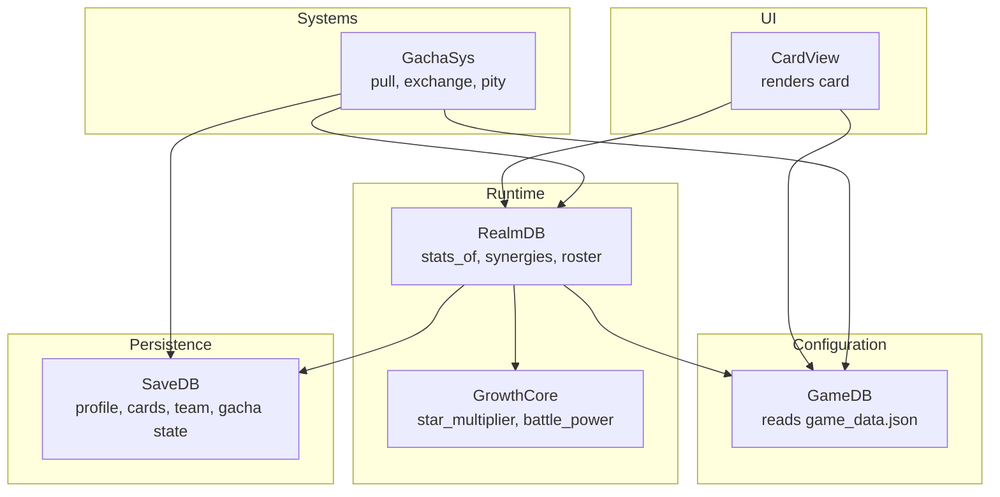
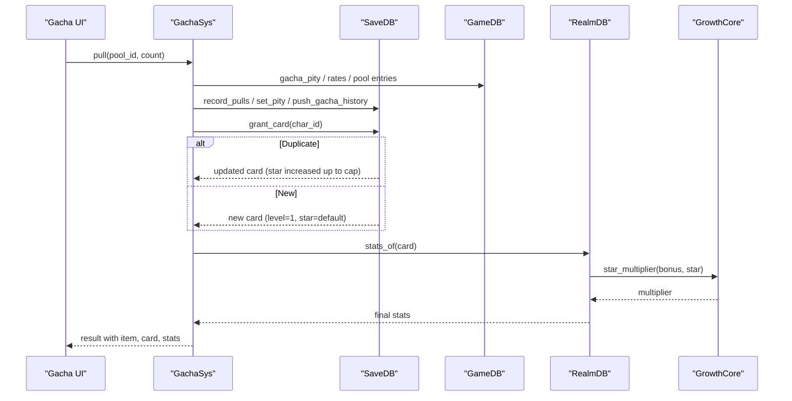
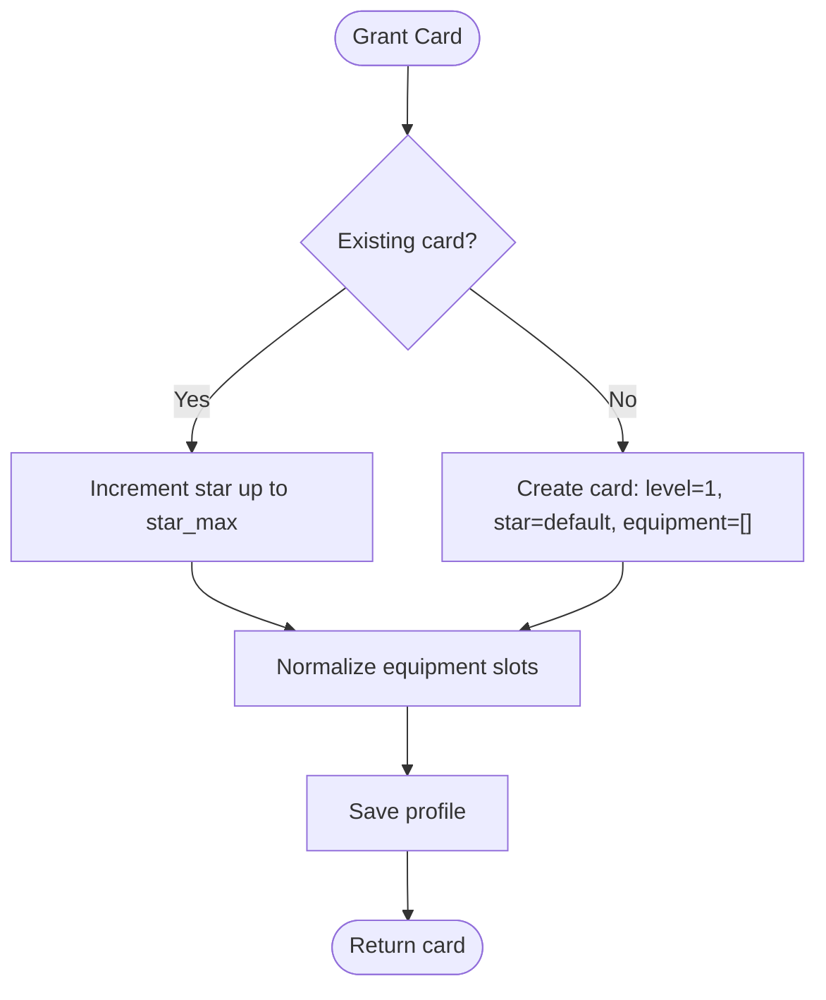
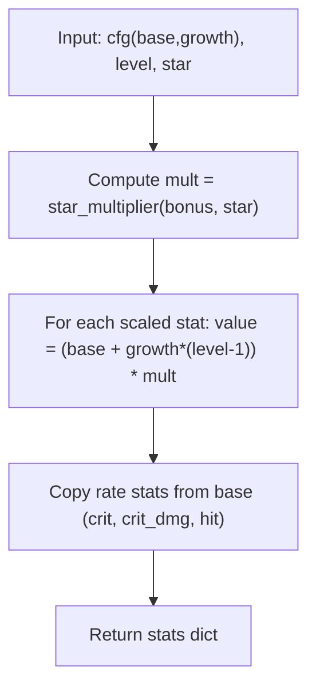
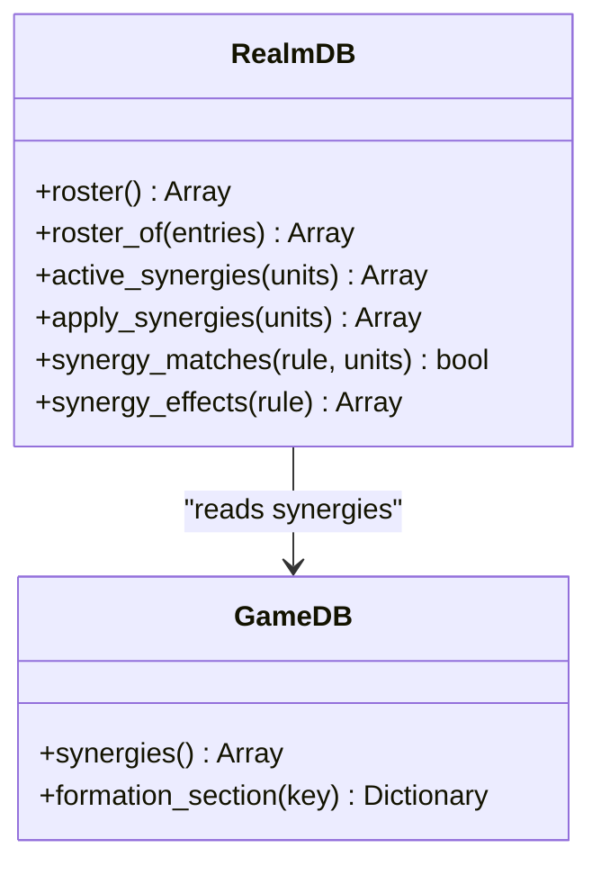
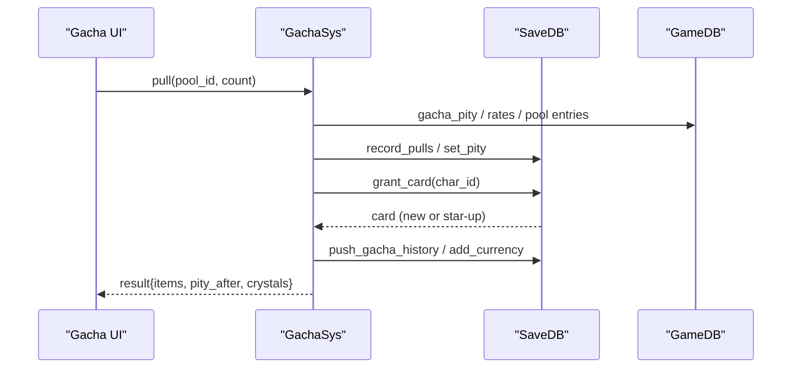
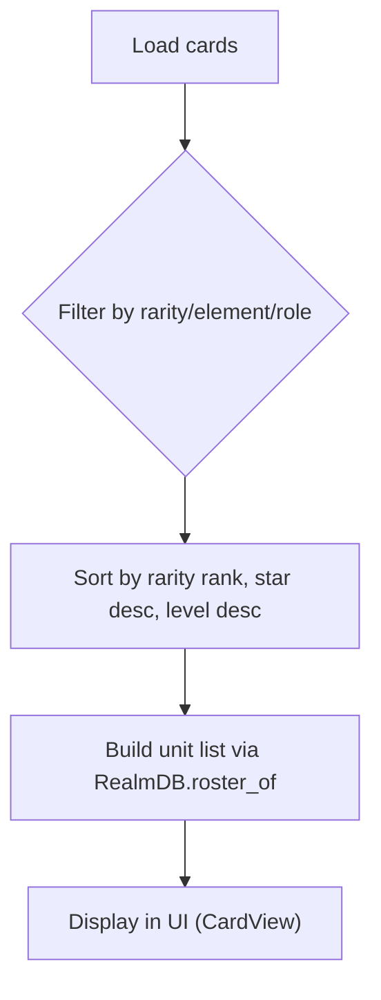
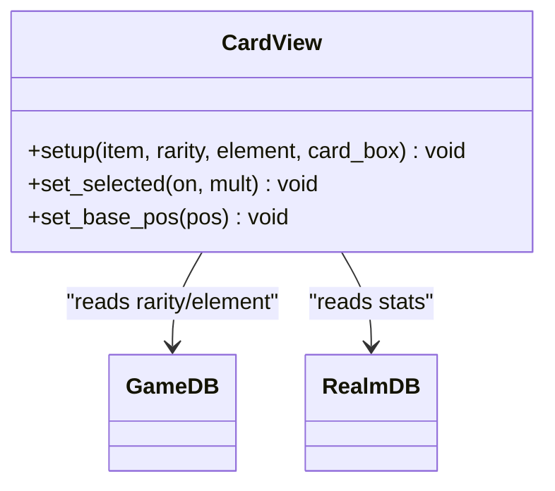
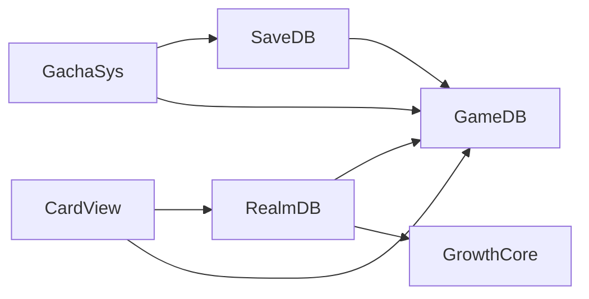

# Card Instances & Progression

<cite>
**Referenced Files in This Document**
- [save_db.gd](file://scripts/save_db.gd)
- [game_db.gd](file://scripts/game_db.gd)
- [realm_db.gd](file://scripts/realm_db.gd)
- [growth_core.gd](file://scripts/growth_core.gd)
- [gacha_sys.gd](file://scripts/gacha_sys.gd)
- [card_view.gd](file://scripts/card_view.gd)
- [game_data.json](file://data/game_data.json)
</cite>

## Table of Contents
1. Introduction
2. Project Structure
3. Core Components
4. Architecture Overview
5. Detailed Component Analysis
6. Dependency Analysis
7. Performance Considerations
8. Troubleshooting Guide
9. Conclusion

## Introduction
This document explains how player-owned card instances are created, tracked, and progressed through the game’s systems. It covers:
- How a base character definition from configuration becomes a dynamic card instance stored in SaveDB
- The card lifecycle: acquisition via gacha, star-up evolution on duplicates, leveling, and stat calculation
- The relationship between static character definitions and dynamic instance properties (level, star, exp, equipment)
- Integration with RealmDB for derived attributes and synergy bonuses
- Inventory management, filtering, and sorting capabilities for cards

The goal is to provide both conceptual understanding and code-level traceability for developers and designers working on progression and UI around cards.

## Project Structure
Card instance management spans several layers:
- Configuration layer (GameDB): reads game_data.json and exposes typed queries for rarities, characters, growth tables, formation rules, etc.
- Persistence layer (SaveDB): owns the player profile JSON, including the cards array and team presets; handles normalization and migration
- Runtime derivation layer (RealmDB): computes final stats by combining base + growth + star multiplier, then applies synergies
- Growth math (GrowthCore): pure functions for star multipliers and power calculations
- Gacha system (GachaSys): orchestrates pulls, pity, currency/tickets, and grants cards or materials
- UI (CardView): renders card visuals based on config and instance data

**Diagram sources**
- [game_db.gd:1-100](file://scripts/game_db.gd#L1-L100)
- [save_db.gd:1-120](file://scripts/save_db.gd#L1-L120)
- [realm_db.gd:1-80](file://scripts/realm_db.gd#L1-L80)
- [growth_core.gd:1-53](file://scripts/growth_core.gd#L1-L53)
- [gacha_sys.gd:1-120](file://scripts/gacha_sys.gd#L1-L120)
- [card_view.gd:1-60](file://scripts/card_view.gd#L1-L60)

**Section sources**
- [game_db.gd:1-120](file://scripts/game_db.gd#L1-L120)
- [save_db.gd:1-120](file://scripts/save_db.gd#L1-L120)
- [realm_db.gd:1-80](file://scripts/realm_db.gd#L1-L80)
- [growth_core.gd:1-53](file://scripts/growth_core.gd#L1-L53)
- [gacha_sys.gd:1-120](file://scripts/gacha_sys.gd#L1-L120)
- [card_view.gd:1-60](file://scripts/card_view.gd#L1-L60)

## Core Components
- SaveDB: Central persistence for player profile, including cards array, team, progress, gacha state, and materials. Normalizes equipment slots and migrates legacy fields. Provides grant_card for acquisition and duplicate handling.
- GameDB: Read-only configuration access to characters, rarities, growth tables, elements, combat, formation rules, and gacha parameters.
- RealmDB: Computes final stats for a card using GrowthCore, builds rosters, applies synergies, and provides formation reports and hints.
- GrowthCore: Pure functions for star multiplier and battle power.
- GachaSys: Pulls, pity logic, cost resolution, granting items/cards, recording history, and emitting results.
- CardView: Renders card visuals based on config and instance data, showing level, stars, element badge, rarity marks, and stats.

Key responsibilities and boundaries are intentionally separated so that UI, systems, and persistence do not leak into each other.

**Section sources**
- [save_db.gd:235-277](file://scripts/save_db.gd#L235-L277)
- [game_db.gd:140-190](file://scripts/game_db.gd#L140-L190)
- [realm_db.gd:13-78](file://scripts/realm_db.gd#L13-L78)
- [growth_core.gd:17-53](file://scripts/growth_core.gd#L17-L53)
- [gacha_sys.gd:196-317](file://scripts/gacha_sys.gd#L196-L317)
- [card_view.gd:44-108](file://scripts/card_view.gd#L44-L108)

## Architecture Overview
The card lifecycle flows through these stages:
1. Acquisition: GachaSys resolves cost, rolls rarity and entry, applies pity, and calls SaveDB.grant_card to create or star-up a card.
2. Persistence: SaveDB stores the card instance with char_id, level, star, exp, and equipment. Equipment arrays are normalized to slot_count.
3. Derivation: RealmDB.stats_of uses GrowthCore to compute stats from base + growth × (level - 1), multiplied by star multiplier.
4. Synergies: RealmDB applies formation synergies to units, adjusting stats per target row and adding battle-level buffs.
5. UI: CardView displays card visuals, level, star count, element badge, and computed stats.

**Diagram sources**
- [gacha_sys.gd:196-317](file://scripts/gacha_sys.gd#L196-L317)
- [save_db.gd:235-277](file://scripts/save_db.gd#L235-L277)
- [realm_db.gd:13-31](file://scripts/realm_db.gd#L13-L31)
- [growth_core.gd:17-39](file://scripts/growth_core.gd#L17-L39)
- [game_db.gd:258-278](file://scripts/game_db.gd#L258-L278)

## Detailed Component Analysis

### Card Instance Data Model and Lifecycle
- Base character definition: Each character has base stats, growth per level, element, role, rarity, and display metadata. These are read from GameDB.
- Dynamic card instance: Stored in SaveDB.cards as a dictionary with:
  - char_id: links to the base character
  - level: current level (starts at 1)
  - star: current star rating (clamped to rarity star_max)
  - exp: accumulated experience (not used for leveling in current flow; reserved for future)
  - equipment: fixed-length array of slot IDs (empty string means no equipment)
- Acquisition:
  - GachaSys.pull decides rarity and entry, respects pity, and calls SaveDB.grant_card
  - SaveDB.grant_card creates a new card if none exists, or increments star if duplicate, capped by rarity star_max
  - Equipment arrays are normalized to slot_count via SaveDB._normalize_cards
- Star-up evolution:
  - Duplicates increment star up to rarity star_max
  - Star multiplier affects all scaled stats (hp, atk, def, mres, spd)
- Leveling:
  - Stats scale linearly with level using base + growth × (level - 1)
  - Final stats are rounded and multiplied by star multiplier
- Derived attributes:
  - RealmDB.stats_of returns final stats for a card instance
  - Battle power is computed from stats using GrowthCore.battle_power

**Diagram sources**
- [save_db.gd:235-277](file://scripts/save_db.gd#L235-L277)
- [save_db.gd:184-193](file://scripts/save_db.gd#L184-L193)

**Section sources**
- [save_db.gd:235-277](file://scripts/save_db.gd#L235-L277)
- [save_db.gd:184-193](file://scripts/save_db.gd#L184-L193)
- [game_db.gd:140-190](file://scripts/game_db.gd#L140-L190)
- [game_db.gd:258-278](file://scripts/game_db.gd#L258-L278)

### Stat Calculation and Star Multiplier
- GrowthCore.stats_of computes:
  - Scaled stats: hp, atk, def, mres, spd = (base + growth × (level - 1)) × star_multiplier
  - Rate stats: crit, crit_dmg, hit remain as base values (no growth or star multiplier)
- Star multiplier:
  - star_multiplier(bonus, star) uses growth.star_up.per_star_attr_bonus table indexed by star-1
  - If bonus table empty, multiplier defaults to 1.0
- Battle power:
  - Weighted sum of stats: hp×0.12 + atk×2.4 + def×1.6 + mres×1.1 + spd×2.0 + crit×600.0

**Diagram sources**
- [growth_core.gd:17-39](file://scripts/growth_core.gd#L17-L39)
- [game_db.gd:258-278](file://scripts/game_db.gd#L258-L278)

**Section sources**
- [growth_core.gd:17-53](file://scripts/growth_core.gd#L17-L53)
- [game_db.gd:258-278](file://scripts/game_db.gd#L258-L278)

### Synergy Bonuses and Team Composition
- Synergies are declarative rules defined in GameDB.formation.synergies with conditions and effects
- Conditions include member_count, row_count, role_count, element_count, rarity_count, char_ids, distinct_elements
- Effects can be:
  - mul: percentage multiplier on stats (all or specific stat)
  - add: additive modifiers (e.g., crit)
  - battle: open_energy, open_shield, elem_dmg applied to unit["synergy_buffs"]
- Apply process:
  - active_synergies evaluates which rules match the current units
  - apply_synergies mutates each unit’s stats with mul/add effects and records battle-level buffs
  - Power is recalculated per unit after applying synergies

**Diagram sources**
- [realm_db.gd:80-244](file://scripts/realm_db.gd#L80-L244)
- [game_db.gd:748-793](file://scripts/game_db.gd#L748-L793)

**Section sources**
- [realm_db.gd:80-244](file://scripts/realm_db.gd#L80-L244)
- [game_db.gd:748-793](file://scripts/game_db.gd#L748-L793)

### Gacha Integration and Card Granting
- GachaSys.pull:
  - Resolves cost options and pays resources
  - Reads pity configuration and state from GameDB and SaveDB
  - Rolls rarity and entry, applies UP rates and ten-guarantee
  - Calls SaveDB.grant_card for heroes or SaveDB.grant_reward for materials
  - Records pulls, pity updates, gacha history, and wish crystals
  - Emits pulled signal with result including items, max rarity, and pity state
- Duplicate handling:
  - SaveDB.grant_card increments star up to rarity star_max
  - Star-up is reflected in card instance and stats via RealmDB.stats_of

**Diagram sources**
- [gacha_sys.gd:196-317](file://scripts/gacha_sys.gd#L196-L317)
- [save_db.gd:235-277](file://scripts/save_db.gd#L235-L277)
- [game_db.gd:287-533](file://scripts/game_db.gd#L287-L533)

**Section sources**
- [gacha_sys.gd:196-317](file://scripts/gacha_sys.gd#L196-L317)
- [save_db.gd:235-277](file://scripts/save_db.gd#L235-L277)
- [game_db.gd:287-533](file://scripts/game_db.gd#L287-L533)

### Card Inventory Management, Filtering, and Sorting
- Inventory storage:
  - SaveDB.cards holds all owned cards
  - SaveDB.find_card(char_id) retrieves a specific card
  - Equipment arrays are normalized to slot_count; empty strings mean unequipped
- Filtering:
  - Use GameDB.characters() to enumerate all heroes
  - For owned-only lists, iterate SaveDB.cards and match char_id
  - Rarity filters use GameDB.rarity_order() and GameDB.rarity(id)
  - Element filters use GameDB.element_table() and character(element)
- Sorting:
  - Sort by rarity rank via GameDB.rarity_rank(id)
  - Sort by star descending, then level descending
  - Sort by name via GameDB.full_name(char_id)
- Team integration:
  - SaveDB.team() returns current lineup entries
  - SaveDB.normalize_team ensures valid slots and uniqueness
  - RealmDB.roster_of(entries) builds unit list with stats and power

**Section sources**
- [save_db.gd:235-277](file://scripts/save_db.gd#L235-L277)
- [save_db.gd:293-352](file://scripts/save_db.gd#L293-L352)
- [game_db.gd:140-190](file://scripts/game_db.gd#L140-L190)
- [realm_db.gd:33-78](file://scripts/realm_db.gd#L33-L78)

### UI Rendering and Progression Display
- CardView.setup receives item, rarity, element, and card_box
- Displays:
  - Element badge with icon and color
  - Rarity mark and star icons (clamped to star_max)
  - Level label from card.level
  - Stats band with hp, atk, def values from stats
- Selection and hover animations are handled internally without affecting data
- CardView does not mutate state; it only renders provided data

**Diagram sources**
- [card_view.gd:44-108](file://scripts/card_view.gd#L44-L108)
- [card_view.gd:173-218](file://scripts/card_view.gd#L173-L218)

**Section sources**
- [card_view.gd:44-108](file://scripts/card_view.gd#L44-L108)
- [card_view.gd:173-218](file://scripts/card_view.gd#L173-L218)

## Dependency Analysis
- SaveDB depends on GameDB for configuration (equipment_slot_count, team_max, formation presets)
- RealmDB depends on GameDB for synergies and board layout, and on GrowthCore for math
- GachaSys depends on GameDB for pool/rate/pity configuration and on SaveDB for state and granting
- CardView depends on GameDB for rarity/element visuals and on RealmDB for stats

Potential coupling points:
- SaveDB normalizes equipment based on GameDB.equipment_slot_count; changes here affect all cards
- RealmDB.stats_of relies on GrowthCore.star_multiplier; any formula change impacts all derived stats
- GachaSys.pity_state reads SaveDB.pity_of(group); group mapping must stay consistent with GameDB.gacha_pity_group

**Diagram sources**
- [save_db.gd:184-193](file://scripts/save_db.gd#L184-L193)
- [realm_db.gd:13-31](file://scripts/realm_db.gd#L13-L31)
- [gacha_sys.gd:196-317](file://scripts/gacha_sys.gd#L196-L317)
- [card_view.gd:44-108](file://scripts/card_view.gd#L44-L108)

**Section sources**
- [save_db.gd:184-193](file://scripts/save_db.gd#L184-L193)
- [realm_db.gd:13-31](file://scripts/realm_db.gd#L13-L31)
- [gacha_sys.gd:196-317](file://scripts/gacha_sys.gd#L196-L317)
- [card_view.gd:44-108](file://scripts/card_view.gd#L44-L108)

## Performance Considerations
- Stats computation is O(1) per card; team-wide synergy application is O(U×R) where U is units and R is number of synergy rules
- Saving profile should be batched when possible (e.g., gacha ten-pull uses save=false until final commit)
- Avoid repeated lookups by caching GameDB sections in long-lived contexts if needed
- Equipment normalization runs once on load; ensure slot_count remains stable to prevent re-normalization overhead

[No sources needed since this section provides general guidance]

## Troubleshooting Guide
Common issues and resolutions:
- Missing or malformed equipment slots:
  - Ensure SaveDB._normalize_cards runs on load; verify equipment array length equals GameDB.equipment_slot_count
  - Empty strings represent unequipped slots; avoid nulls
- Duplicate star exceeding cap:
  - SaveDB.grant_card clamps star to rarity star_max; check GameDB.rarity(id).star_max
- Incorrect stats display:
  - Verify RealmDB.stats_of is called with correct card instance; confirm GrowthCore.star_multiplier index matches star-1
- Synergy not applying:
  - Check condition types and counts; ensure units have required roles/elements/rarities
  - Confirm effect mode (mul/add/battle) targets correct stats and rows
- Gacha pity not persisting:
  - Ensure SaveDB.set_pity is called with correct group from GameDB.gacha_pity_group
  - Verify SaveDB.save_profile is invoked after batch operations

**Section sources**
- [save_db.gd:184-193](file://scripts/save_db.gd#L184-L193)
- [save_db.gd:235-277](file://scripts/save_db.gd#L235-L277)
- [realm_db.gd:13-31](file://scripts/realm_db.gd#L13-L31)
- [realm_db.gd:80-244](file://scripts/realm_db.gd#L80-L244)
- [gacha_sys.gd:196-317](file://scripts/gacha_sys.gd#L196-L317)

## Conclusion
The card instance system cleanly separates configuration, persistence, runtime derivation, and UI rendering. Player-owned cards are created from base character definitions and persisted with dynamic properties like level, star, and equipment. Progression flows through gacha acquisition, duplicate star-up, and stat calculation via GrowthCore and RealmDB. Synergies provide flexible, declarative bonuses tied to team composition. Inventory management supports filtering and sorting by rarity, element, and role, while UI components render accurate progression states. This architecture ensures consistency across preview, battle, and persistence layers.

[No sources needed since this section summarizes without analyzing specific files]