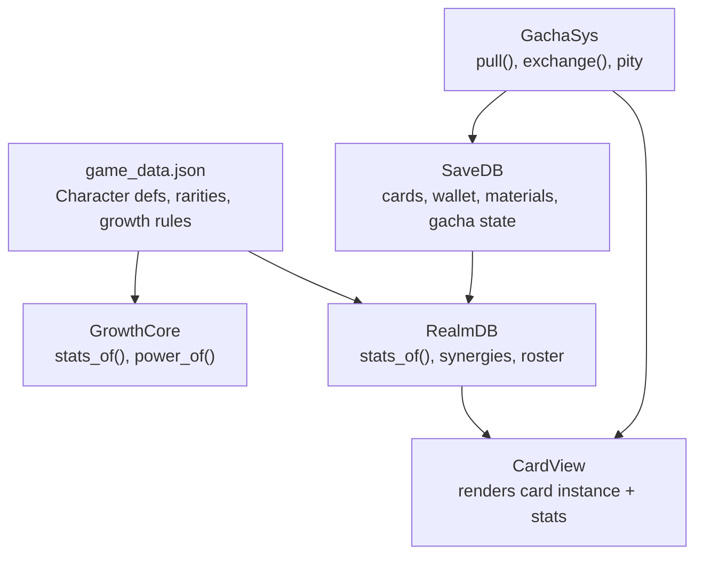
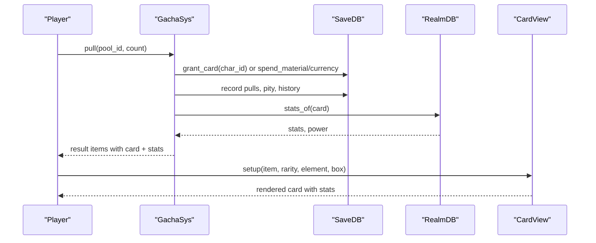
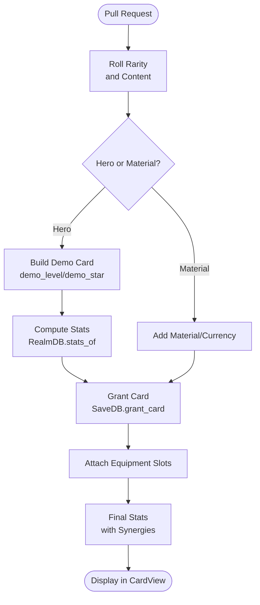
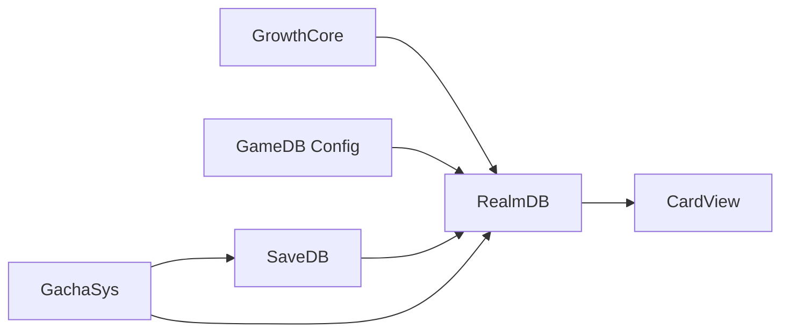

# Character & Card System

<cite>
**Referenced Files in This Document**
- [game_data.json](file://data/game_data.json)
- [growth_core.gd](file://scripts/growth_core.gd)
- [realm_db.gd](file://scripts/realm_db.gd)
- [save_db.gd](file://scripts/save_db.gd)
- [gacha_sys.gd](file://scripts/gacha_sys.gd)
- [card_view.gd](file://scripts/card_view.gd)
</cite>

## Table of Contents
1. [Introduction](#introduction)
2. [Project Structure](#project-structure)
3. [Core Components](#core-components)
4. [Architecture Overview](#architecture-overview)
5. [Detailed Component Analysis](#detailed-component-analysis)
6. [Dependency Analysis](#dependency-analysis)
7. [Performance Considerations](#performance-considerations)
8. [Troubleshooting Guide](#troubleshooting-guide)
9. [Conclusion](#conclusion)

## Introduction
This document explains the character and card management system with a clear separation between:
- Character definitions (static, balance data in game_data.json)
- Card instances (player-owned characters with level, star, equipment, and progression)

It also documents the growth formula that derives final stats from base attributes, growth rates, level, star rating, and star-up bonuses, as well as the full lifecycle from acquisition through evolution and equipment attachment. Examples are provided by referencing concrete sections of the configuration and code.

## Project Structure
The system spans configuration, runtime calculation, persistence, gacha acquisition, and UI display:
- Configuration: character definitions, rarities, growth rules, gacha pools
- Runtime: growth formulas, synergy application, roster building
- Persistence: player profile, cards, inventory, gacha state
- Acquisition: gacha logic, pity, exchange shop
- UI: card rendering and stat display

**Diagram sources**
- [game_data.json:456-1052](file://data/game_data.json#L456-L1052)
- [growth_core.gd:1-53](file://scripts/growth_core.gd#L1-L53)
- [realm_db.gd:13-78](file://scripts/realm_db.gd#L13-L78)
- [save_db.gd:235-277](file://scripts/save_db.gd#L235-L277)
- [gacha_sys.gd:203-317](file://scripts/gacha_sys.gd#L203-L317)
- [card_view.gd:47-108](file://scripts/card_view.gd#L47-L108)

**Section sources**
- [game_data.json:456-1052](file://data/game_data.json#L456-L1052)
- [growth_core.gd:1-53](file://scripts/growth_core.gd#L1-L53)
- [realm_db.gd:13-78](file://scripts/realm_db.gd#L13-L78)
- [save_db.gd:235-277](file://scripts/save_db.gd#L235-L277)
- [gacha_sys.gd:203-317](file://scripts/gacha_sys.gd#L203-L317)
- [card_view.gd:47-108](file://scripts/card_view.gd#L47-L108)

## Core Components
- Character definitions: static entries under characters with id, rarity, element, role, base stats, growth rates, skill metadata, and codex info.
- Rarity table: defines star caps, default stars, level caps, frame visuals, and inner rect for UI.
- Growth rules: per-star attribute bonus array, equipment slot count, bond effects.
- GrowthCore: pure functions to compute final stats and battle power.
- RealmDB: runtime layer that applies growth and synergies to produce final unit stats and team power.
- SaveDB: persistent storage for cards, teams, materials, currencies, and gacha state.
- GachaSys: acquisition engine with probabilities, pity, ten-guarantee, and exchange shop.
- CardView: UI component that renders a card instance with rarity frame, element badge, nameplate, level, stars, and computed stats.

**Section sources**
- [game_data.json:370-455](file://data/game_data.json#L370-L455)
- [game_data.json:456-1052](file://data/game_data.json#L456-L1052)
- [game_data.json:1053-1095](file://data/game_data.json#L1053-L1095)
- [growth_core.gd:1-53](file://scripts/growth_core.gd#L1-L53)
- [realm_db.gd:13-78](file://scripts/realm_db.gd#L13-L78)
- [save_db.gd:235-277](file://scripts/save_db.gd#L235-L277)
- [gacha_sys.gd:203-317](file://scripts/gacha_sys.gd#L203-L317)
- [card_view.gd:47-108](file://scripts/card_view.gd#L47-L108)

## Architecture Overview
The system uses a dual-layer model:
- Static layer: game_data.json defines character templates and growth parameters.
- Instance layer: SaveDB stores player-owned cards with level, star, exp, and equipment; RealmDB computes final stats using GrowthCore and synergies; GachaSys handles acquisition and progression triggers; CardView displays instances.

**Diagram sources**
- [gacha_sys.gd:203-317](file://scripts/gacha_sys.gd#L203-L317)
- [save_db.gd:235-277](file://scripts/save_db.gd#L235-L277)
- [realm_db.gd:13-78](file://scripts/realm_db.gd#L13-L78)
- [card_view.gd:47-108](file://scripts/card_view.gd#L47-L108)

## Detailed Component Analysis

### Character Definitions (Static Layer)
Character definitions live in game_data.json under characters. Each entry includes:
- Identity: id, name, title, rarity, element, role
- Visuals: portrait, prefer_slot
- Base stats: hp, atk, def, mres, crit, crit_dmg, hit, spd
- Growth rates: hp, atk, def, mres, spd per level
- Skill metadata: name, type, cost, target, desc, shards, effect
- Codex: class, battle_role, attack/ult/passive descriptions

Examples:
- Tank example: knight_rock with earth element, tank role, base stats and growth rates
- Mage example: pyro_girl with fire element, mage role, base stats and growth rates
- Healer example: holy_priest with light element, healer role, base stats and growth rates

These definitions are read by GameDB and used by GrowthCore and RealmDB to compute stats and display information.

**Section sources**
- [game_data.json:456-524](file://data/game_data.json#L456-L524)
- [game_data.json:525-595](file://data/game_data.json#L525-L595)
- [game_data.json:670-745](file://data/game_data.json#L670-L745)

### Growth Formula System
GrowthCore implements the core growth math:
- Final stats = (base + growth × (level - 1)) × star_multiplier
- Star multiplier comes from growth.star_up.per_star_attr_bonus indexed by star minus one
- Scaled attributes: hp, atk, def, mres, spd
- Rate attributes: crit, crit_dmg, hit pass through from base without growth
- Battle power is a weighted sum of stats including speed and crit

Star-up bonuses:
- Defined in growth.star_up.per_star_attr_bonus
- Example values: 0.0, 0.15, 0.3, 0.5, 0.75
- Applied multiplicatively to scaled attributes

Stat derivation example references:
- knight_rock base and growth fields
- pyro_girl base and growth fields
- holy_priest base and growth fields

Battle power formula:
- Weighted combination of hp, atk, def, mres, spd, crit

**Section sources**
- [growth_core.gd:13-53](file://scripts/growth_core.gd#L13-L53)
- [game_data.json:1053-1095](file://data/game_data.json#L1053-L1095)
- [game_data.json:456-524](file://data/game_data.json#L456-L524)
- [game_data.json:525-595](file://data/game_data.json#L525-L595)
- [game_data.json:670-745](file://data/game_data.json#L670-L745)

### Card Lifecycle: Acquisition Through Evolution and Equipment
Acquisition:
- GachaSys.pull resolves rarity via rates and pity, selects content via choose_entry, creates item, and grants hero or material
- For heroes, _make_item builds a demo card using config demo_level/demo_star and computes stats via RealmDB.stats_of
- Real granting goes through SaveDB.grant_card which either creates a new card or increments star up to rarity star_max

Progression:
- Level: defined by growth.level_up.cost_exp_per_level and cost_gold_per_level
- Star-up: repeated cards increment star capped by rarity star_max; star_up.per_star_attr_bonus increases stats
- Equipment: blank_equipment initialized per card; slot_count from growth.equipment.slot_count; set bonuses configured but not yet applied in stats_of

Inventory handling:
- Materials and currencies stored in SaveDB wallet and pending_items
- Grant reward routes currency vs material consistently

Evolution path:
- Acquire card -> initial star based on rarity star_default -> repeat same char_id to increase star -> equip items to slots -> compute final stats via RealmDB

**Diagram sources**
- [gacha_sys.gd:457-502](file://scripts/gacha_sys.gd#L457-L502)
- [gacha_sys.gd:513-528](file://scripts/gacha_sys.gd#L513-L528)
- [save_db.gd:235-277](file://scripts/save_db.gd#L235-L277)
- [realm_db.gd:13-78](file://scripts/realm_db.gd#L13-L78)
- [card_view.gd:47-108](file://scripts/card_view.gd#L47-L108)

**Section sources**
- [gacha_sys.gd:203-317](file://scripts/gacha_sys.gd#L203-L317)
- [gacha_sys.gd:457-502](file://scripts/gacha_sys.gd#L457-L502)
- [gacha_sys.gd:513-528](file://scripts/gacha_sys.gd#L513-L528)
- [save_db.gd:235-277](file://scripts/save_db.gd#L235-L277)
- [game_data.json:1053-1095](file://data/game_data.json#L1053-L1095)

### Relationship Between Base Stats, Growth Rates, and Final Computed Values
- Base stats define starting values at level 1
- Growth rates add linear increments per level beyond 1
- Star multiplier scales the sum of base plus growth contributions
- Rate attributes (crit, crit_dmg, hit) do not scale with growth; they remain from base unless modified elsewhere
- Synergies can multiply stats further and add crit; these are applied after growth

Example references:
- knight_rock base and growth show how a tank’s HP and DEF grow
- pyro_girl base and growth show DPS scaling
- holy_priest base and growth show support scaling

**Section sources**
- [growth_core.gd:24-39](file://scripts/growth_core.gd#L24-L39)
- [game_data.json:456-524](file://data/game_data.json#L456-L524)
- [game_data.json:525-595](file://data/game_data.json#L525-L595)
- [game_data.json:670-745](file://data/game_data.json#L670-L745)

### Card Instance Management and Inventory Handling
- Cards are stored in SaveDB.profile.cards as dictionaries with char_id, level, star, exp, equipment
- find_card locates existing instances; grant_card creates or upgrades star
- Equipment arrays are normalized to slot_count with empty strings representing explicit unequip
- Team management enforces slot uniqueness and max team size
- Materials and currencies tracked separately; grant_reward routes correctly

**Section sources**
- [save_db.gd:235-277](file://scripts/save_db.gd#L235-L277)
- [save_db.gd:285-353](file://scripts/save_db.gd#L285-L353)
- [save_db.gd:449-505](file://scripts/save_db.gd#L449-L505)

### Progression Tracking
- Gacha state tracks total pulls, pulls_by_pool, pity groups, history, exchanges
- Pity counters persist across periods when group is shared
- Recent heroes list filters out non-hero entries
- Exchange shop records counts per char_id

**Section sources**
- [save_db.gd:508-620](file://scripts/save_db.gd#L508-L620)
- [gacha_sys.gd:76-98](file://scripts/gacha_sys.gd#L76-L98)
- [gacha_sys.gd:320-348](file://scripts/gacha_sys.gd#L320-L348)

### UI Rendering of Card Instances
CardView constructs a visual representation:
- Reads item.config, item.card, item.stats
- Builds rarity glow, shadow, bed, portrait holder, frame, info band, element badge, rarity marks, selection ring
- Displays level, stars, and stats (hp, atk, def)
- Uses rarity.inner_rect to keep elements within card opening

**Section sources**
- [card_view.gd:47-108](file://scripts/card_view.gd#L47-L108)
- [card_view.gd:115-178](file://scripts/card_view.gd#L115-L178)
- [card_view.gd:181-218](file://scripts/card_view.gd#L181-L218)

## Dependency Analysis
Key dependencies:
- GrowthCore depends only on configuration arrays for star bonuses
- RealmDB depends on GameDB for character/rarity/synergy data and SaveDB for team/cards
- SaveDB persists all player state and provides defaults/migrations
- GachaSys depends on GameDB for pool/rate/pity configuration and SaveDB for resources/state
- CardView depends on item structures produced by GachaSys and RealmDB

**Diagram sources**
- [growth_core.gd:1-53](file://scripts/growth_core.gd#L1-L53)
- [realm_db.gd:13-78](file://scripts/realm_db.gd#L13-L78)
- [save_db.gd:235-277](file://scripts/save_db.gd#L235-L277)
- [gacha_sys.gd:203-317](file://scripts/gacha_sys.gd#L203-L317)
- [card_view.gd:47-108](file://scripts/card_view.gd#L47-L108)

**Section sources**
- [growth_core.gd:1-53](file://scripts/growth_core.gd#L1-L53)
- [realm_db.gd:13-78](file://scripts/realm_db.gd#L13-L78)
- [save_db.gd:235-277](file://scripts/save_db.gd#L235-L277)
- [gacha_sys.gd:203-317](file://scripts/gacha_sys.gd#L203-L317)
- [card_view.gd:47-108](file://scripts/card_view.gd#L47-L108)

## Performance Considerations
- GrowthCore is pure and stateless; safe to call frequently for previews and tests
- RealmDB computes stats once per unit and caches results in unit objects
- SaveDB batches saves where possible (e.g., grant_card save=false for batch operations)
- GachaSys supports free mode for distribution testing without writing state
- CardView avoids heavy layout recalculations by computing inner rects once

[No sources needed since this section provides general guidance]

## Troubleshooting Guide
Common issues and checks:
- Missing character definition: ensure character id exists in game_data.json characters
- Incorrect star cap: verify rarity star_max and that grant_card clamps star
- Stats mismatch: confirm GrowthCore stats_of receives correct cfg, level, star, and star bonus table
- Equipment slots: normalize_cards ensures equipment array length matches slot_count
- Pity not triggering: check pity_group mapping and SaveDB.pity_of values
- Exchange shop unavailable: verify exchange_cost and current pool UP list

**Section sources**
- [save_db.gd:184-193](file://scripts/save_db.gd#L184-L193)
- [save_db.gd:235-277](file://scripts/save_db.gd#L235-L277)
- [gacha_sys.gd:76-98](file://scripts/gacha_sys.gd#L76-L98)
- [gacha_sys.gd:320-348](file://scripts/gacha_sys.gd#L320-L348)

## Conclusion
The character and card system cleanly separates static definitions from dynamic instances. GrowthCore centralizes stat calculations, ensuring consistency across UI and combat. SaveDB manages persistence for cards, inventory, and gacha state. GachaSys orchestrates acquisition with robust probability and pity mechanics. CardView renders instances with accurate stats and rarity visuals. Together, these components provide a scalable foundation for character progression, equipment attachment, and team composition.

[No sources needed since this section summarizes without analyzing specific files]