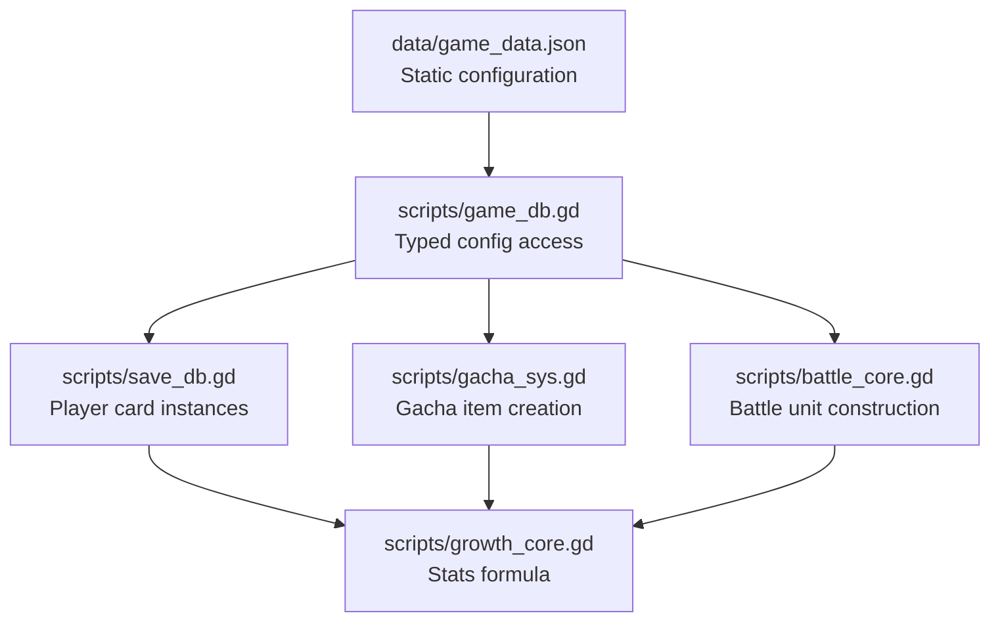
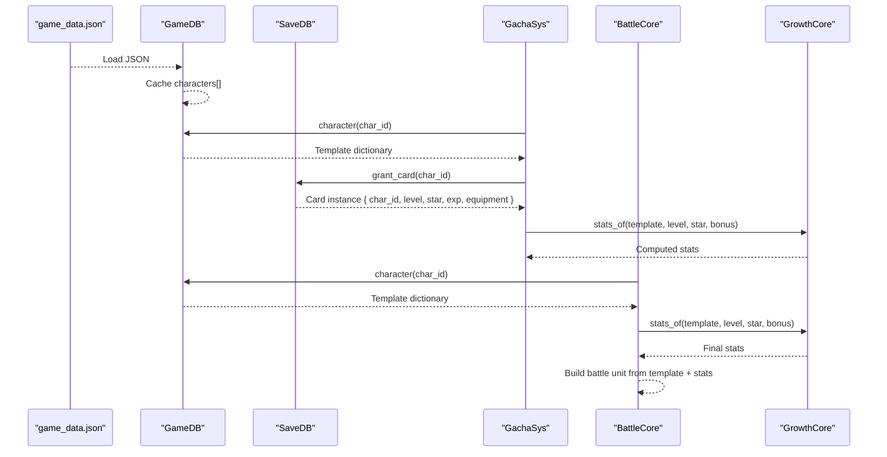
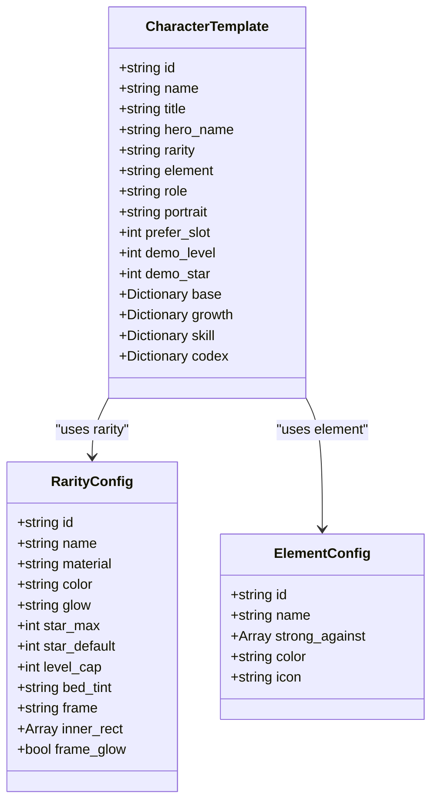
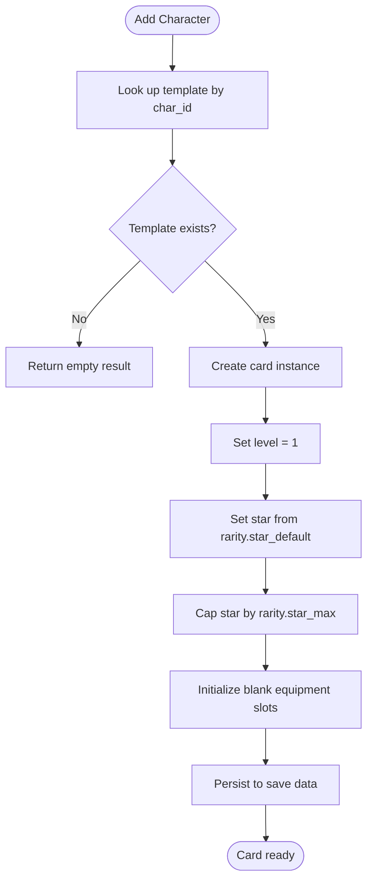
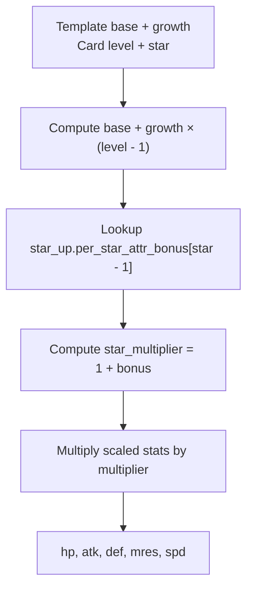
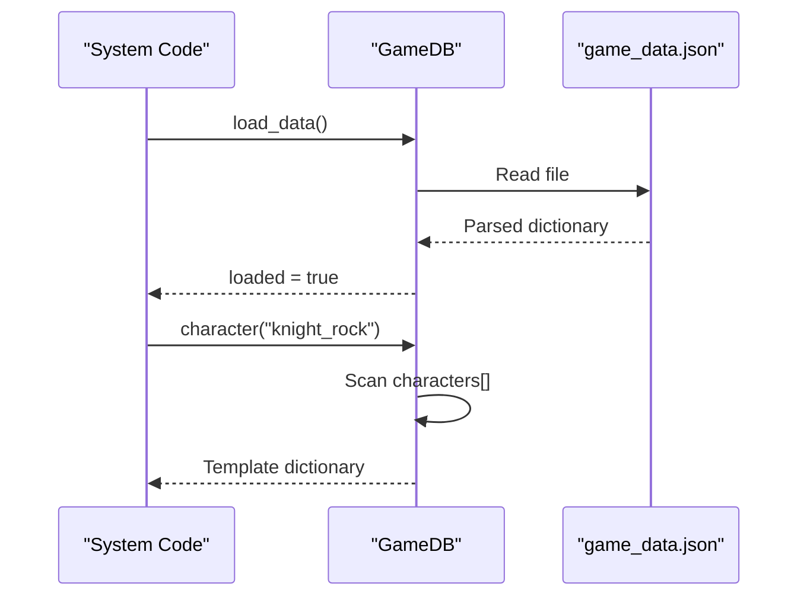
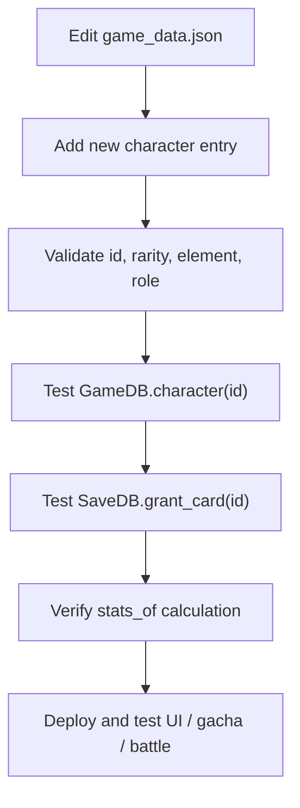
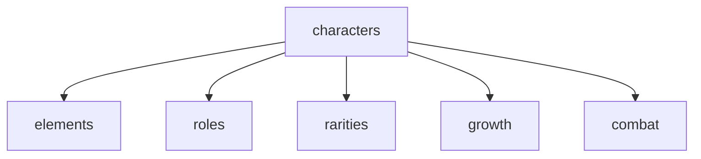

# Character Definitions

<cite>
**Referenced Files in This Document**   
- [game_data.json](file://data/game_data.json)
- [game_db.gd](file://scripts/game_db.gd)
- [growth_core.gd](file://scripts/growth_core.gd)
- [save_db.gd](file://scripts/save_db.gd)
- [battle_core.gd](file://scripts/battle_core.gd)
- [gacha_sys.gd](file://scripts/gacha_sys.gd)
</cite>

## Table of Contents
1. [Introduction](#introduction)
2. [Project Structure](#project-structure)
3. [Core Components](#core-components)
4. [Architecture Overview](#architecture-overview)
5. [Detailed Component Analysis](#detailed-component-analysis)
6. [Dependency Analysis](#dependency-analysis)
7. [Performance Considerations](#performance-considerations)
8. [Troubleshooting Guide](#troubleshooting-guide)
9. [Conclusion](#conclusion)

## Introduction
This document explains how characters are defined as static configuration data and how those definitions become player-owned card instances at runtime. The central source of truth is the character list inside `data/game_data.json`. Each character entry defines a template: its identity, rarity, element, role, portrait, base stats, per-level growth, skill behavior, and display information. Runtime systems then instantiate cards from these templates, attach player state such as level, star, experience, and equipment, and compute final stats through shared growth formulas.

The documentation covers:
- The structure of character entries in `game_data.json`
- Base attributes, growth rates, star-up bonuses, and skill configurations
- How character IDs, names, rarities, and properties relate to each other
- How `GameDB` provides typed access to character definitions
- How new characters can be added to the system

## Project Structure
Character-related data and logic are split across three main layers:
- Configuration layer: `data/game_data.json` contains all static game data, including the `characters` array.
- Typed access layer: `scripts/game_db.gd` loads the JSON once and exposes query functions for elements, rarities, roles, characters, and related sections.
- Runtime instantiation layer: `scripts/save_db.gd`, `scripts/gacha_sys.gd`, and `scripts/battle_core.gd` create player-owned card instances, compute stats, and build battle units using character templates.

**Diagram sources**
- [game_data.json:456-1052](file://data/game_data.json#L456-L1052)
- [game_db.gd:17-37](file://scripts/game_db.gd#L17-L37)
- [game_db.gd:181-190](file://scripts/game_db.gd#L181-L190)
- [save_db.gd:253-277](file://scripts/save_db.gd#L253-L277)
- [gacha_sys.gd:457-502](file://scripts/gacha_sys.gd#L457-L502)
- [battle_core.gd:108-139](file://scripts/battle_core.gd#L108-L139)
- [growth_core.gd:24-39](file://scripts/growth_core.gd#L24-L39)

**Section sources**
- [game_data.json:456-1052](file://data/game_data.json#L456-L1052)
- [game_db.gd:1-37](file://scripts/game_db.gd#L1-L37)
- [save_db.gd:246-277](file://scripts/save_db.gd#L246-L277)
- [gacha_sys.gd:457-502](file://scripts/gacha_sys.gd#L457-L502)
- [battle_core.gd:108-139](file://scripts/battle_core.gd#L108-L139)
- [growth_core.gd:1-39](file://scripts/growth_core.gd#L1-L39)

## Core Components
Character definitions are organized around several key concepts:

- **Character ID**: A unique string identifier used by every system to look up a character template. Examples include `"knight_rock"`, `"pyro_girl"`, `"elf_ranger"`, `"holy_priest"`, `"arcane_girl"`, `"shadow_assassin"`, `"earth_guardian"`, and `"flame_knight"`.
- **Name and Title**: Human-readable labels displayed in UI and codex panels. Some characters also have a separate hero name used for full display names.
- **Rarity**: One of `"R"`, `"SR"`, `"SSR"`, or `"UR"`. Rarity controls visual frame, glow, maximum stars, default stars, and level cap.
- **Element**: One of `"water"`, `"fire"`, `"wind"`, `"earth"`, `"light"`, or `"dark"`. Element interacts with combat counter rules.
- **Role**: Tactical role such as `"tank"`, `"warrior"`, `"mage"`, `"archer"`, `"assassin"`, or `"healer"`. Role maps to preferred board rows and class matrix categories like `"front"`, `"dps"`, `"agile"`, or `"support"`.
- **Portrait**: Path to the character artwork used in card views and battle units.
- **Base Stats**: Starting values for health, attack, defense, magic resistance, critical rate, critical damage, hit rate, and speed.
- **Growth Rates**: Per-level increases for core attributes and speed.
- **Skill Configuration**: Name, type, cost, target, description, shard upgrades, and effect parameters.
- **Codex**: Display-only information such as class classification, battle role text, attack/ult/passive descriptions, and optional reference stat panels.

**Section sources**
- [game_data.json:456-1052](file://data/game_data.json#L456-L1052)
- [game_db.gd:181-190](file://scripts/game_db.gd#L181-L190)
- [game_db.gd:231-253](file://scripts/game_db.gd#L231-L253)

## Architecture Overview
The character definition architecture separates static configuration from runtime state:

1. `GameDB` loads `data/game_data.json` once and caches it.
2. Systems request character templates by ID through `GameDB.character(id)`.
3. Player-owned cards store only mutable state: `char_id`, `level`, `star`, `exp`, and `equipment`.
4. Final stats are computed by combining the character template with the card’s level and star, plus global star-up bonus tables.
5. Battle units are built from both the template and the computed stats.

**Diagram sources**
- [game_db.gd:17-37](file://scripts/game_db.gd#L17-L37)
- [game_db.gd:181-190](file://scripts/game_db.gd#L181-L190)
- [save_db.gd:253-277](file://scripts/save_db.gd#L253-L277)
- [gacha_sys.gd:457-502](file://scripts/gacha_sys.gd#L457-L502)
- [battle_core.gd:108-139](file://scripts/battle_core.gd#L108-L139)
- [growth_core.gd:24-39](file://scripts/growth_core.gd#L24-L39)

## Detailed Component Analysis

### Character Entry Structure
A character entry in `game_data.json` is a dictionary with the following fields:

| Field | Type | Purpose | Example Meaning |
|---|---|---|---|
| `id` | String | Unique template identifier | `"knight_rock"` |
| `name` | String | Display name on card and UI | `"磐岩骑士"` |
| `title` | String | Flavor title | `"不屈的岩盾"` |
| `hero_name` | Optional String | Separate hero name for full display | `"依莲"` |
| `rarity` | String | Quality tier | `"R"`, `"SR"`, `"SSR"`, `"UR"` |
| `element` | String | Elemental attribute | `"earth"`, `"fire"`, `"wind"`, `"light"`, `"dark"` |
| `role` | String | Tactical role | `"tank"`, `"warrior"`, `"mage"`, `"archer"`, `"assassin"`, `"healer"` |
| `portrait` | String | Artwork path | `"res://assets/art/characters/char_knight.png"` |
| `prefer_slot` | Integer | Preferred board slot hint | `1`, `2`, `5`, `6`, `7`, `8` |
| `demo_level` | Integer | Demo card level shown in menus | `20`, `30` |
| `demo_star` | Integer | Demo card star shown in menus | `1`, `2`, `3` |
| `base` | Dictionary | Starting stats | See base stats table below |
| `growth` | Dictionary | Per-level stat growth | See growth table below |
| `skill` | Dictionary | Ultimate skill configuration | See skill table below |
| `codex` | Dictionary | Display-only lore and panel info | Class, battle role, attack/ult/passive text |

#### Base Attributes
The `base` dictionary defines starting combat attributes:

| Attribute | Type | Meaning |
|---|---|---|
| `hp` | Number | Health points |
| `atk` | Number | Attack power |
| `def` | Number | Physical defense |
| `mres` | Number | Magic resistance |
| `crit` | Number | Critical hit rate |
| `crit_dmg` | Number | Critical hit multiplier |
| `hit` | Number | Hit rate |
| `spd` | Number | Speed |

#### Growth Rates
The `growth` dictionary defines how core attributes increase per level:

| Attribute | Type | Meaning |
|---|---|---|
| `hp` | Number | HP growth per level |
| `atk` | Number | ATK growth per level |
| `def` | Number | DEF growth per level |
| `mres` | Number | MRES growth per level |
| `spd` | Number | SPD growth per level |

Critical rate, critical damage, and hit rate are treated as base-only ratios; they do not grow per level in the current formula.

#### Skill Configuration
The `skill` dictionary defines the character’s ultimate ability:

| Field | Type | Purpose |
|---|---|---|
| `name` | String | Skill display name |
| `type` | String | Skill category, typically `"ult"` |
| `cost` | Number | Energy or resource cost |
| `target` | String | Target selection rule |
| `desc` | String | Human-readable description |
| `shards` | Array | Star-based upgrades with star threshold and description |
| `effect` | Dictionary | Engine-facing effect parameters such as kind, target, damage type, multiplier, duration, and notes |

#### Complete Character Definition Examples
The repository includes multiple complete character definitions that demonstrate different rarities, roles, and skill patterns:

- **Tank example**: Earth tank with defensive base stats, moderate growth, and a shield-oriented ultimate.
- **Mage examples**: Fire mages with lower health but higher attack, critical stats, and area-of-effect magic attacks.
- **Archer example**: Wind archer with high speed, critical rate, and single-target back-row execution style.
- **Healer example**: Light healer with magic resistance focus and team healing ultimate.
- **Assassin example**: Dark assassin with high critical rate and multi-hit back-row targeting.
- **Warrior example**: Fire warrior with balanced front-row stats and physical attack ultimate.

These examples show how:
- Base stats define the character’s starting profile.
- Growth rates scale stats with level.
- Skills describe both player-facing text and engine-facing effects.
- Codex provides display-only classification and flavor text.

**Section sources**
- [game_data.json:456-1052](file://data/game_data.json#L456-L1052)
- [game_data.json:1053-1095](file://data/game_data.json#L1053-L1095)

### Relationship Between Character Identity and Properties
Character identity is primarily driven by `id`. Other fields provide context:

- `id` is the lookup key used by `GameDB.character(id)`.
- `name` is the primary display label.
- `hero_name` is an optional secondary label used for full names.
- `rarity` determines visual quality, star limits, and default star value.
- `element` determines elemental interactions and color/icon references.
- `role` determines tactical classification and preferred board placement.
- `portrait` links the template to artwork assets.
- `prefer_slot` hints at ideal board positioning.
- `demo_level` and `demo_star` control preview visuals, not actual card production defaults.

**Diagram sources**
- [game_data.json:456-1052](file://data/game_data.json#L456-L1052)
- [game_data.json:370-454](file://data/game_data.json#L370-L454)
- [game_data.json:59-117](file://data/game_data.json#L59-L117)

**Section sources**
- [game_db.gd:181-190](file://scripts/game_db.gd#L181-L190)
- [game_db.gd:231-253](file://scripts/game_db.gd#L231-L253)
- [game_data.json:370-454](file://data/game_data.json#L370-L454)
- [game_data.json:59-117](file://data/game_data.json#L59-L117)

### Static Templates Versus Player-Owned Card Instances
Character templates are immutable configuration. Player-owned cards are mutable runtime instances derived from those templates.

Key distinctions:
- **Template**: Defined in `game_data.json`. Contains `id`, `name`, `rarity`, `element`, `role`, `base`, `growth`, `skill`, and `codex`.
- **Card Instance**: Stored in save data. Contains `char_id`, `level`, `star`, `exp`, and `equipment`. It references a template via `char_id`.
- **Demo Card**: Used for previews and gacha reveal. Uses `demo_level` and `demo_star` from the template rather than the saved card’s actual level and star.
- **Battle Unit**: Built from both template and computed stats. Includes metadata like slot, row, cell, icon, and ultimate effect.

**Diagram sources**
- [save_db.gd:253-277](file://scripts/save_db.gd#L253-L277)
- [game_db.gd:181-190](file://scripts/game_db.gd#L181-L190)
- [game_db.gd:152-154](file://scripts/game_db.gd#L152-L154)

**Section sources**
- [save_db.gd:246-277](file://scripts/save_db.gd#L246-L277)
- [gacha_sys.gd:457-502](file://scripts/gacha_sys.gd#L457-L502)
- [battle_core.gd:108-139](file://scripts/battle_core.gd#L108-L139)

### Stats Calculation and Star-Up Bonuses
Final stats are calculated by combining:
- Base stats from the character template
- Growth rates multiplied by level minus one
- Star-up multiplier from `growth.star_up.per_star_attr_bonus`

The formula is:
- Final stat = (base + growth × (level - 1)) × star_multiplier
- Rate stats like critical rate and critical damage use base values directly without growth scaling.

Star-up bonuses are indexed by star minus one, so star 1 uses index 0, star 2 uses index 1, and so on. If the bonus array is missing or too short, the multiplier is clamped safely.

**Diagram sources**
- [growth_core.gd:17-39](file://scripts/growth_core.gd#L17-L39)
- [game_data.json:1053-1095](file://data/game_data.json#L1053-L1095)

**Section sources**
- [growth_core.gd:1-53](file://scripts/growth_core.gd#L1-L53)
- [game_data.json:1053-1095](file://data/game_data.json#L1053-L1095)

### GameDB Layer and Typed Access
`GameDB` is the read-only configuration layer. Its responsibilities include:
- Loading `data/game_data.json`
- Parsing JSON into memory
- Providing typed query functions for elements, rarities, roles, characters, codex, growth, gacha, formation, adventure, monsters, and more

For characters specifically:
- `characters()` returns the full character array
- `character(id)` returns the matching template or an empty dictionary if not found
- `hero_name(char_id)` returns the hero name or falls back to the card name
- `full_name(char_id)` combines card name and hero name when available
- `card_battle_role(char_id)` returns codex battle role text or falls back to role tactic text

**Diagram sources**
- [game_db.gd:17-37](file://scripts/game_db.gd#L17-L37)
- [game_db.gd:181-190](file://scripts/game_db.gd#L181-L190)
- [game_db.gd:231-253](file://scripts/game_db.gd#L231-L253)

**Section sources**
- [game_db.gd:1-37](file://scripts/game_db.gd#L1-L37)
- [game_db.gd:181-190](file://scripts/game_db.gd#L181-L190)
- [game_db.gd:231-253](file://scripts/game_db.gd#L231-L253)

### Adding New Characters
To add a new character to the system:

1. Add a new dictionary to the `characters` array in `data/game_data.json`.
2. Assign a unique `id`.
3. Provide `name`, `title`, and optionally `hero_name`.
4. Set `rarity` to one of the existing rarity keys.
5. Set `element` to one of the configured elements.
6. Set `role` to one of the configured roles.
7. Set `portrait` to a valid asset path.
8. Set `prefer_slot` based on the character’s intended board position.
9. Set `demo_level` and `demo_star` for menu preview visuals.
10. Define `base` with starting stats.
11. Define `growth` with per-level increases.
12. Define `skill` with display text and engine-facing effect parameters.
13. Optionally add `codex` for class classification, battle role text, attack/ult/passive descriptions, and reference stat panels.

After adding the template:
- `GameDB.character(new_id)` will return the new template.
- Gacha pools can automatically include the new character if the pool uses auto-collection by rarity.
- SaveDB can grant a card instance using `grant_card(new_id)`.
- BattleCore can build a battle unit using the template and computed stats.

**Diagram sources**
- [game_data.json:456-1052](file://data/game_data.json#L456-L1052)
- [game_db.gd:181-190](file://scripts/game_db.gd#L181-L190)
- [save_db.gd:253-277](file://scripts/save_db.gd#L253-L277)
- [growth_core.gd:24-39](file://scripts/growth_core.gd#L24-L39)

**Section sources**
- [game_data.json:456-1052](file://data/game_data.json#L456-L1052)
- [game_db.gd:181-190](file://scripts/game_db.gd#L181-L190)
- [save_db.gd:253-277](file://scripts/save_db.gd#L253-L277)
- [growth_core.gd:24-39](file://scripts/growth_core.gd#L24-L39)

## Dependency Analysis
Character definitions depend on several supporting configuration sections:

- **Elements**: Define elemental relationships, colors, icons, and counter rules.
- **Roles**: Define tactical roles, preferred rows, and class classifications.
- **Rarities**: Define visual frames, glow, star limits, default stars, and level caps.
- **Growth**: Define global star-up bonuses, equipment slots, and progression rules.
- **Combat**: Define battle constants such as counter damage multiplier, critical damage, and ATB settings.

**Diagram sources**
- [game_data.json:59-117](file://data/game_data.json#L59-L117)
- [game_data.json:303-369](file://data/game_data.json#L303-L369)
- [game_data.json:370-454](file://data/game_data.json#L370-L454)
- [game_data.json:1053-1095](file://data/game_data.json#L1053-L1095)
- [game_data.json:119-302](file://data/game_data.json#L119-L302)
- [game_data.json:456-1052](file://data/game_data.json#L456-L1052)

**Section sources**
- [game_data.json:59-117](file://data/game_data.json#L59-L117)
- [game_data.json:303-369](file://data/game_data.json#L303-L369)
- [game_data.json:370-454](file://data/game_data.json#L370-L454)
- [game_data.json:1053-1095](file://data/game_data.json#L1053-L1095)
- [game_data.json:119-302](file://data/game_data.json#L119-L302)

## Performance Considerations
- `GameDB` loads the entire configuration once and caches it, avoiding repeated file reads.
- Character lookup scans the `characters` array linearly. For the current number of characters, this is acceptable, but future expansion should consider indexing by `id` if performance becomes a concern.
- Stats computation is lightweight and deterministic, making it suitable for frequent calls during gacha reveals, formation previews, and battle initialization.
- Star-up bonus arrays are small and accessed by index, which is efficient.

[No sources needed since this section provides general guidance]

## Troubleshooting Guide
Common issues when working with character definitions:

- **Unknown character ID**: If `GameDB.character(id)` returns an empty dictionary, verify that the `id` exists in `game_data.json` and matches exactly.
- **Missing portrait**: UI code checks whether the portrait path exists before rendering full card art. Missing paths fall back to compact card faces.
- **Invalid rarity**: Ensure `rarity` matches one of the configured rarity keys. Invalid rarities may cause missing frame, glow, star limit, or default star behavior.
- **Invalid element**: Ensure `element` matches one of the configured elements. Invalid elements may break counter rules and color/icon references.
- **Invalid role**: Ensure `role` matches one of the configured roles. Invalid roles may cause missing class classification or battle role text.
- **Incorrect star-up behavior**: Verify that `growth.star_up.per_star_attr_bonus` has enough entries for expected star levels. The multiplier clamps out-of-range indices, but missing bonuses reduce expected scaling.
- **Mismatched demo values**: Changing `demo_level` or `demo_star` affects preview visuals, not the default star granted to newly pulled cards. Default card star comes from `rarities[rarity].star_default`.

**Section sources**
- [game_db.gd:181-190](file://scripts/game_db.gd#L181-L190)
- [game_db.gd:152-154](file://scripts/game_db.gd#L152-L154)
- [save_db.gd:253-277](file://scripts/save_db.gd#L253-L277)
- [growth_core.gd:17-39](file://scripts/growth_core.gd#L17-L39)
- [gacha_sys.gd:457-502](file://scripts/gacha_sys.gd#L457-L502)

## Conclusion
Character definitions in this project follow a clean separation between static configuration and runtime state. `game_data.json` holds authoritative templates describing identity, rarity, element, role, base stats, growth, skills, and display information. `GameDB` provides typed access to those templates. `SaveDB` creates player-owned card instances with mutable state. `GrowthCore` computes final stats from templates and card state. `BattleCore` builds battle units using both template and computed stats.

This design makes it straightforward to add new characters by editing configuration, while keeping gameplay systems consistent, predictable, and easy to maintain.

[No sources needed since this section summarizes without analyzing specific files]