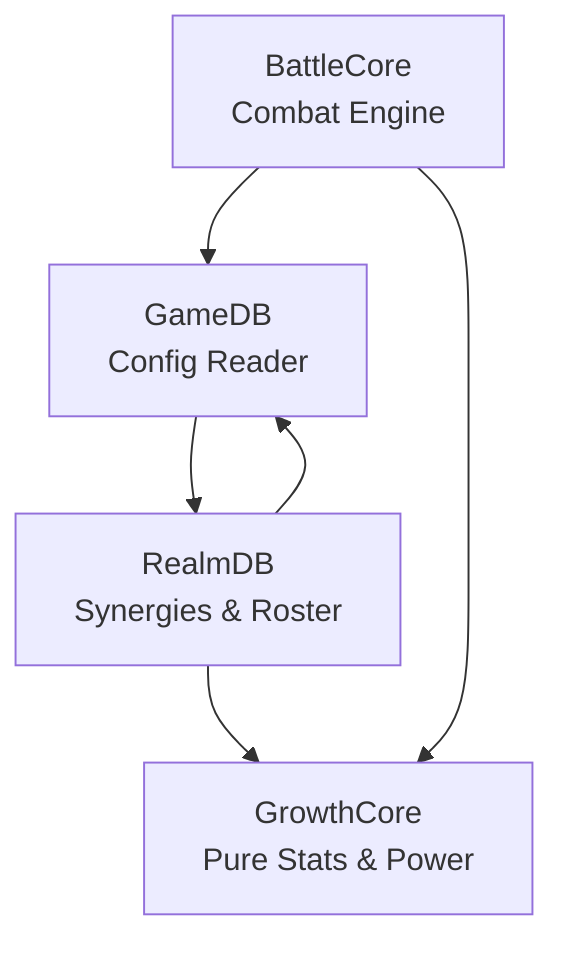
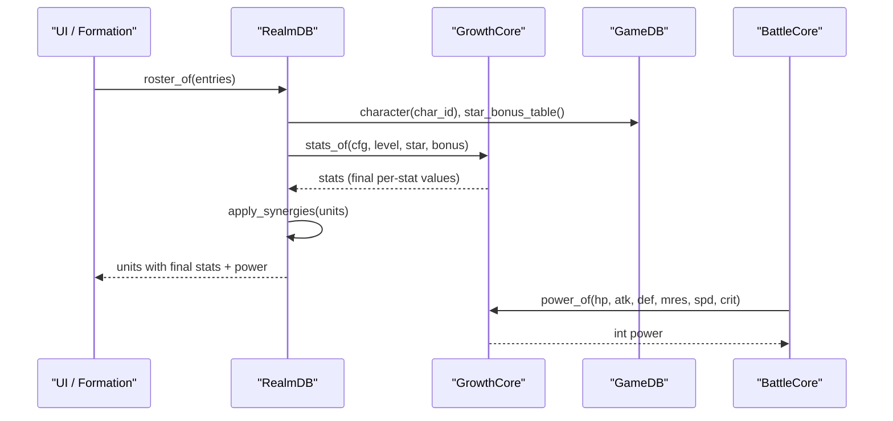
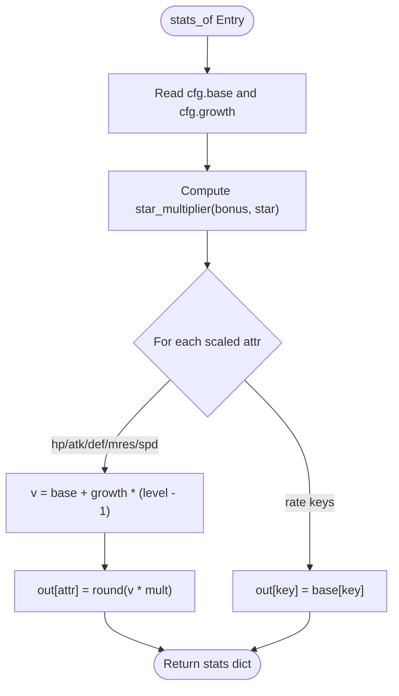
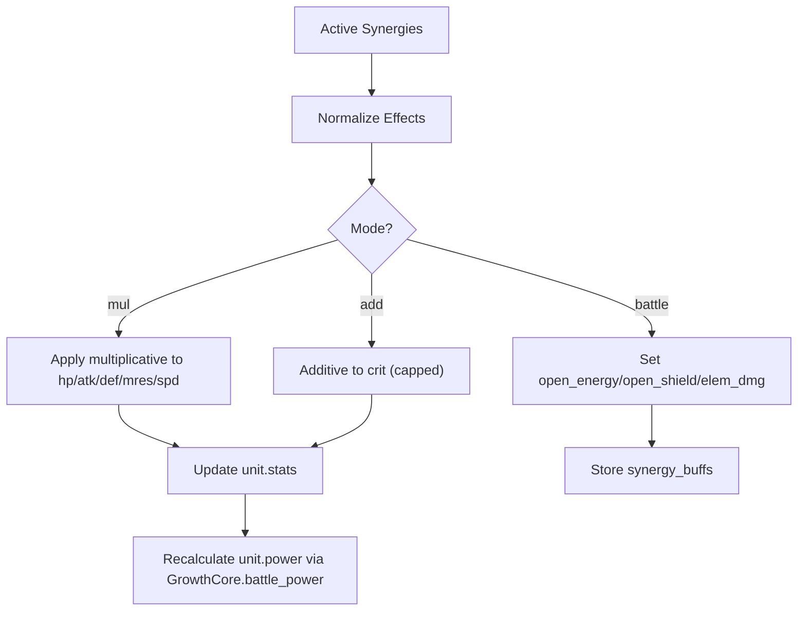
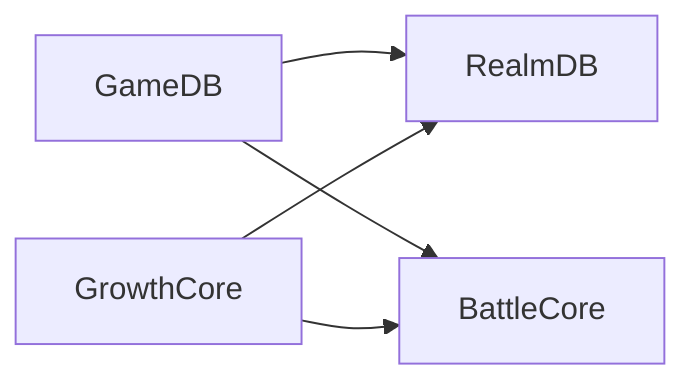

# Growth Formulas & Stat Calculation

<cite>
**Referenced Files in This Document**
- [growth_core.gd](file://scripts/growth_core.gd)
- [realm_db.gd](file://scripts/realm_db.gd)
- [battle_core.gd](file://scripts/battle_core.gd)
- [game_db.gd](file://scripts/game_db.gd)
- [game_data.json](file://data/game_data.json)
</cite>

## Table of Contents
1. [Introduction](#introduction)
2. [Project Structure](#project-structure)
3. [Core Components](#core-components)
4. [Architecture Overview](#architecture-overview)
5. [Detailed Component Analysis](#detailed-component-analysis)
6. [Dependency Analysis](#dependency-analysis)
7. [Performance Considerations](#performance-considerations)
8. [Troubleshooting Guide](#troubleshooting-guide)
9. [Conclusion](#conclusion)

## Introduction
This document explains the growth formula system and stat calculation mechanics used to derive final character stats from base values, growth rates, level, star multipliers, and synergies. It focuses on the pure function architecture of GrowthCore, how different attribute types scale, the battle power formula, and how these calculations integrate with the realm database for synergies and equipment bonuses. Examples are provided to illustrate stat progression across levels and stars, and performance considerations for using pure functions are discussed.

## Project Structure
The stat calculation pipeline is split into clear layers:
- Configuration layer (GameDB): reads game_data.json and exposes typed accessors for characters, elements, combat rules, growth tables, etc.
- Pure growth math layer (GrowthCore): computes final stats and battle power without side effects.
- Runtime derivation layer (RealmDB): applies synergies and builds roster entries with final stats and power.
- Battle layer (BattleCore): consumes precomputed stats and uses GrowthCore’s power_of for consistent team power reporting.

**Diagram sources**
- [game_db.gd:1-10](file://scripts/game_db.gd#L1-L10)
- [growth_core.gd:1-12](file://scripts/growth_core.gd#L1-L12)
- [realm_db.gd:1-10](file://scripts/realm_db.gd#L1-L10)
- [battle_core.gd:1-21](file://scripts/battle_core.gd#L1-L21)

**Section sources**
- [game_db.gd:1-10](file://scripts/game_db.gd#L1-L10)
- [growth_core.gd:1-12](file://scripts/growth_core.gd#L1-L12)
- [realm_db.gd:1-10](file://scripts/realm_db.gd#L1-L10)
- [battle_core.gd:1-21](file://scripts/battle_core.gd#L1-L21)

## Core Components
- GrowthCore: Pure functions for star multiplier, stats calculation, and battle power.
- RealmDB: Applies synergies to units, computes team power, and provides roster builders.
- BattleCore: Uses GrowthCore.power_of to compute unit and team power consistently; handles combat logic separately.
- GameDB: Provides configuration data including growth.star_up.per_star_attr_bonus and combat constants.

Key responsibilities:
- GrowthCore.stats_of(cfg, level, star, bonus) returns final per-stat values.
- GrowthCore.battle_power(stats) returns a single integer power value.
- RealmDB.apply_synergies(units) mutates unit stats with synergy multipliers/additions and updates power.
- BattleCore.unit_power(u) delegates to GrowthCore.power_of for consistent power numbers across UI and combat.

**Section sources**
- [growth_core.gd:13-53](file://scripts/growth_core.gd#L13-L53)
- [realm_db.gd:13-31](file://scripts/realm_db.gd#L13-L31)
- [realm_db.gd:181-243](file://scripts/realm_db.gd#L181-L243)
- [battle_core.gd:311-323](file://scripts/battle_core.gd#L311-L323)

## Architecture Overview
The system enforces a clean separation between pure math and runtime state:
- GrowthCore has no autoload or I/O dependencies; it only takes inputs and returns outputs.
- RealmDB composes GrowthCore with configuration and synergy rules to produce final stats.
- BattleCore relies on GrowthCore for power calculations to ensure consistency between preview and actual combat.

**Diagram sources**
- [realm_db.gd:43-70](file://scripts/realm_db.gd#L43-L70)
- [realm_db.gd:181-243](file://scripts/realm_db.gd#L181-L243)
- [growth_core.gd:17-53](file://scripts/growth_core.gd#L17-L53)
- [game_db.gd:258-265](file://scripts/game_db.gd#L258-L265)
- [battle_core.gd:311-323](file://scripts/battle_core.gd#L311-L323)

## Detailed Component Analysis

### GrowthCore: Pure Function Architecture
- Star multiplier: Returns 1.0 if no bonus table; otherwise 1.0 + bonus[clamp(star - 1)].
- Stats calculation: For hp/atk/def/mres/spd, computes Base + Growth × (Level - 1), then rounds after multiplying by star multiplier. Rate attributes (crit, crit_dmg, hit) pass through base values unchanged.
- Battle power: Weighted sum of stats into a single integer for comparison and display.

Formula summary:
- Final Stats = (Base + Growth × (Level - 1)) × StarMultiplier
- Rate Attributes: crit, crit_dmg, hit remain as configured base values (no growth scaling).
- Battle Power = round(hp × 0.12 + atk × 2.4 + def × 1.6 + mres × 1.1 + spd × 2.0 + crit × 600.0)

**Diagram sources**
- [growth_core.gd:17-39](file://scripts/growth_core.gd#L17-L39)

**Section sources**
- [growth_core.gd:13-53](file://scripts/growth_core.gd#L13-L53)

### Attribute Scaling Differences
- Scaled attributes (hp, atk, def, mres, spd): Scale linearly with level via growth fields, then multiplied by star multiplier.
- Rate attributes (crit, crit_dmg, hit): Do not scale with level; they are passed through as base values. Synergies can add to crit via additive mode.

Example implications:
- Increasing level increases core combat stats proportionally to their growth values.
- Star upgrades boost all scaled stats uniformly by a percentage defined in growth.star_up.per_star_attr_bonus.
- Crit can be increased by synergies but not by level growth.

**Section sources**
- [growth_core.gd:13-39](file://scripts/growth_core.gd#L13-L39)
- [realm_db.gd:207-231](file://scripts/realm_db.gd#L207-L231)

### Battle Power Formula and Components
- Battle power aggregates multiple stats into one comparable number.
- Weights emphasize attack and speed while still accounting for survivability (hp, def, mres) and crit chance.

Components:
- hp weight: 0.12
- atk weight: 2.4
- def weight: 1.6
- mres weight: 1.1
- spd weight: 2.0
- crit weight: 600.0

Usage:
- Used by RealmDB.battle_power(stats) and BattleCore.unit_power(u) to ensure consistent power display and comparisons.

**Section sources**
- [growth_core.gd:42-53](file://scripts/growth_core.gd#L42-L53)
- [realm_db.gd:26-31](file://scripts/realm_db.gd#L26-L31)
- [battle_core.gd:311-323](file://scripts/battle_core.gd#L311-L323)

### Integration with RealmDB: Synergies and Equipment
- Synergy application:
  - Active synergies are computed based on formation composition.
  - Effects are normalized into modes: mul (multiplicative stat boosts), add (additive rate boosts like crit), battle (open_energy, open_shield, elem_dmg).
  - Per-unit stats are updated multiplicatively for hp/atk/def/mres/spd; crit is capped at a maximum.
  - Unit power is recalculated after applying synergies.
- Equipment bonuses:
  - Currently not integrated into GrowthCore.stats_of; placeholder exists in formation report for future expansion.

**Diagram sources**
- [realm_db.gd:161-178](file://scripts/realm_db.gd#L161-L178)
- [realm_db.gd:181-243](file://scripts/realm_db.gd#L181-L243)

**Section sources**
- [realm_db.gd:181-243](file://scripts/realm_db.gd#L181-L243)
- [realm_db.gd:340-359](file://scripts/realm_db.gd#L340-L359)

### Comprehensive Examples
Below are step-by-step examples demonstrating how stats are calculated at various levels and stars. Use these as references to verify your own configurations.

Example 1: Pyro Girl (fire mage)
- Base stats include hp, atk, def, mres, crit, crit_dmg, hit, spd.
- Growth adds per-level increments to hp, atk, def, mres, spd.
- Star multiplier from growth.star_up.per_star_attr_bonus scales scaled stats.

Steps:
1. Pick level L and star S.
2. Compute scaled stats: Base + Growth × (L - 1).
3. Multiply by star multiplier: 1.0 + bonus[S - 1].
4. Round to integer.
5. Rate attributes (crit, crit_dmg, hit) remain as base unless modified by synergies.

Example 2: Stone Guard (earth tank)
- Higher base def and mres; growth emphasizes survivability.
- Same formula applies; star multiplier affects all scaled stats uniformly.

Example 3: Elf Ranger (wind archer)
- Balanced base with higher spd; growth supports mobility and damage.
- Synergies may add crit or elemental damage; those do not affect base growth scaling.

Note: To compute exact numbers, substitute the character’s base and growth values from the configuration and apply the formulas above. The star multiplier array defines percentage increases per star level.

**Section sources**
- [game_data.json:470-552](file://data/game_data.json#L470-L552)
- [game_data.json:607-623](file://data/game_data.json#L607-L623)
- [growth_core.gd:17-39](file://scripts/growth_core.gd#L17-L39)
- [game_db.gd:258-265](file://scripts/game_db.gd#L258-L265)

## Dependency Analysis
- GrowthCore depends only on its inputs; no external state.
- RealmDB depends on GameDB for configuration and GrowthCore for math.
- BattleCore depends on GrowthCore for power calculations and GameDB for combat constants.

**Diagram sources**
- [game_db.gd:1-10](file://scripts/game_db.gd#L1-L10)
- [growth_core.gd:1-12](file://scripts/growth_core.gd#L1-L12)
- [realm_db.gd:1-10](file://scripts/realm_db.gd#L1-L10)
- [battle_core.gd:1-21](file://scripts/battle_core.gd#L1-L21)

**Section sources**
- [game_db.gd:1-10](file://scripts/game_db.gd#L1-L10)
- [growth_core.gd:1-12](file://scripts/growth_core.gd#L1-L12)
- [realm_db.gd:1-10](file://scripts/realm_db.gd#L1-L10)
- [battle_core.gd:1-21](file://scripts/battle_core.gd#L1-L21)

## Performance Considerations
- Pure functions minimize recomputation overhead and avoid hidden state changes.
- GrowthCore.stats_of performs O(1) arithmetic per attribute; negligible cost even for large rosters.
- RealmDB.apply_synergies iterates over active synergies and units; complexity is proportional to number of synergies and team size, which is small (≤ 5–9 units).
- Using GrowthCore.power_of ensures consistent power computation across UI and combat, avoiding duplicated logic and potential drift.

Benefits of pure functions:
- Deterministic results for given inputs.
- Easy to test and validate with smoke tests.
- Safe to reuse in build scripts and previews without autoload context.

[No sources needed since this section provides general guidance]

## Troubleshooting Guide
Common issues and checks:
- Incorrect star multiplier: Ensure star index maps correctly to per_star_attr_bonus and clamp behavior prevents out-of-bounds access.
- Rate attributes not scaling: Confirm that crit/crit_dmg/hit are not expected to grow with level; use synergies to adjust crit if needed.
- Synergy effects not applied: Verify that synergy conditions match current formation and that effect modes are correctly normalized.
- Power mismatch between UI and combat: Ensure both use GrowthCore.power_of and that unit stats reflect final post-synergy values.

Validation steps:
- Inspect unit.stats after RealmDB.roster_of or apply_synergies.
- Compare team_power sums with formation_report totals.
- Check combat constants (counter_damage_mult, counter_crit_bonus, base_crit_damage) when analyzing damage outcomes.

**Section sources**
- [realm_db.gd:161-243](file://scripts/realm_db.gd#L161-L243)
- [game_db.gd:119-132](file://scripts/game_db.gd#L119-L132)
- [battle_core.gd:672-711](file://scripts/battle_core.gd#L672-L711)

## Conclusion
The growth formula system centers on a clean, pure-function design in GrowthCore that computes final stats from base values, growth rates, level, and star multipliers. Different attribute types scale appropriately: core stats grow linearly with level and are uniformly boosted by stars, while rate attributes remain fixed unless augmented by synergies. Battle power consolidates stats into a single metric for consistent comparisons across UI and combat. RealmDB integrates synergies to finalize stats and power, ensuring that what players see matches what happens in battle. The architecture promotes maintainability, testability, and performance, making it straightforward to extend or tune formulas without risking unintended side effects.