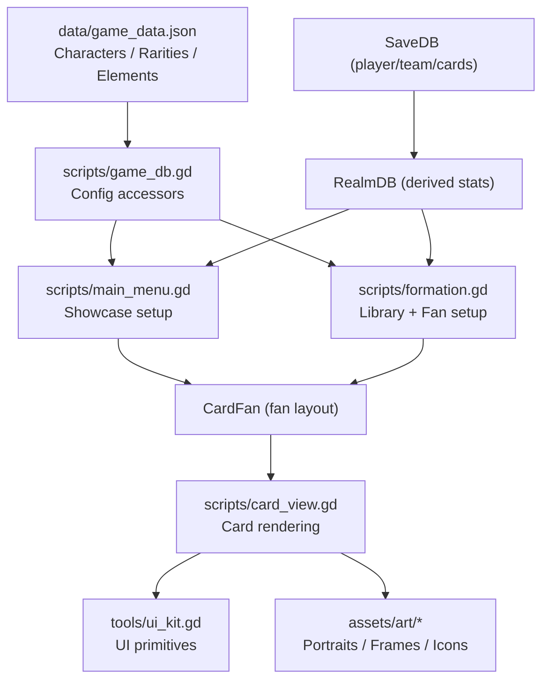
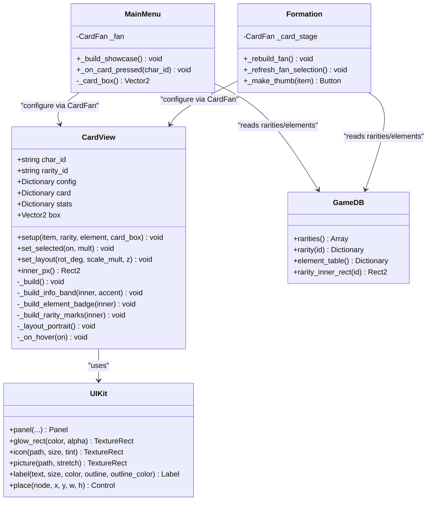
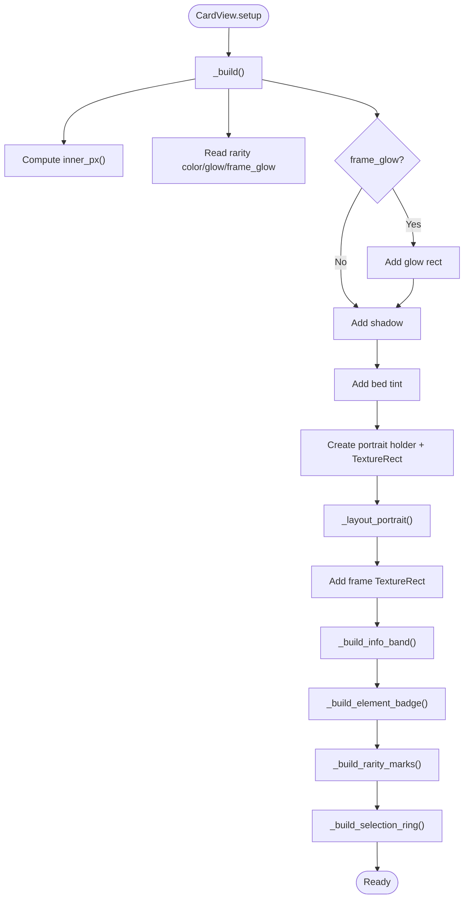
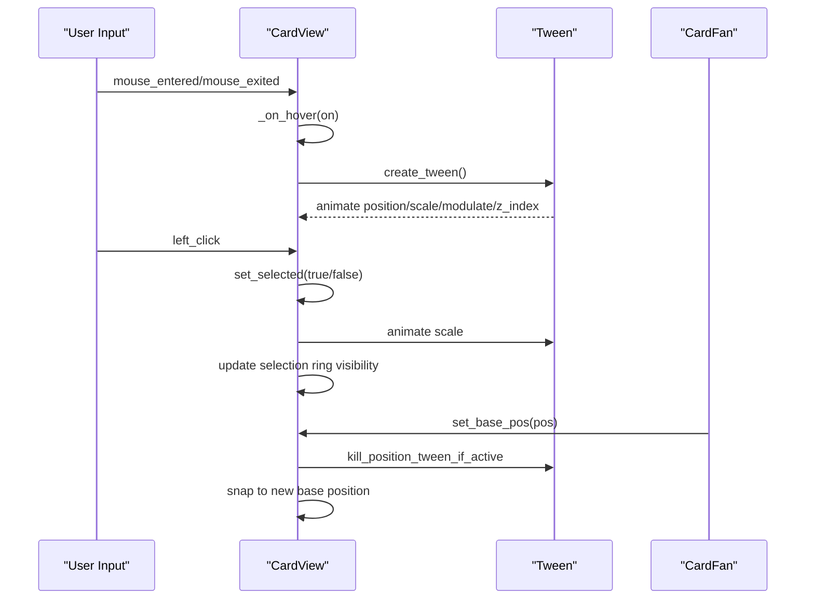
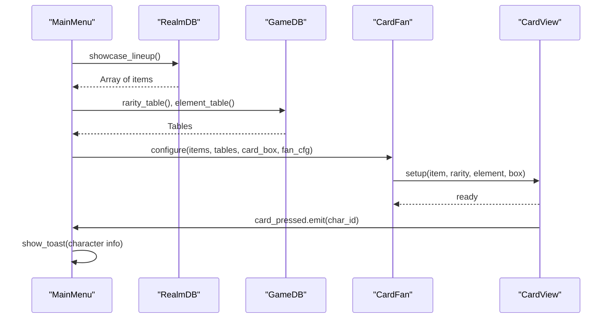
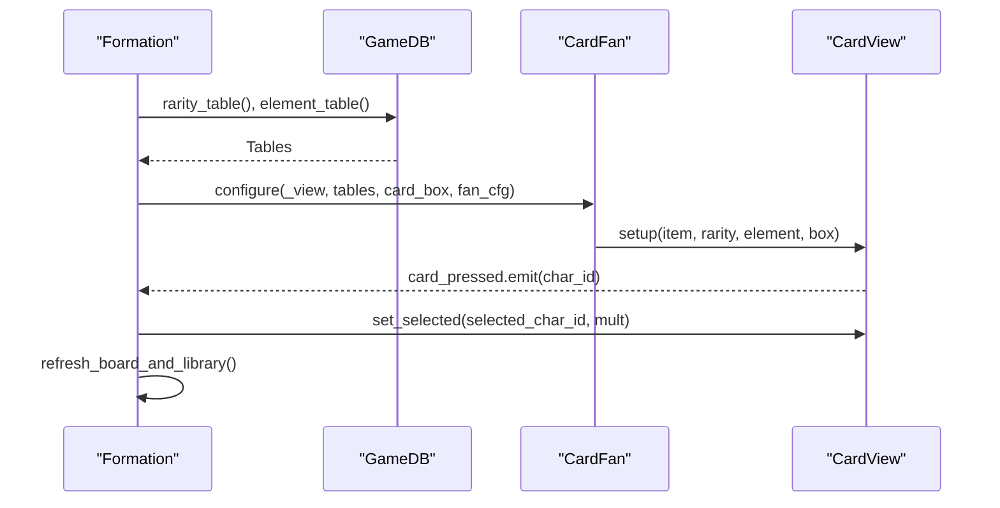
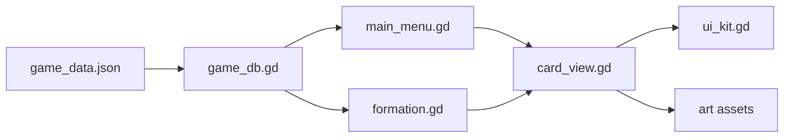

# Visual Representation & UI Integration

<cite>
**Referenced Files in This Document**   
- [card_view.gd](file://scripts/card_view.gd)
- [main_menu.gd](file://scripts/main_menu.gd)
- [formation.gd](file://scripts/formation.gd)
- [game_db.gd](file://scripts/game_db.gd)
- [ui_kit.gd](file://tools/ui_kit.gd)
- [game_data.json](file://data/game_data.json)
- [main_menu.tscn](file://scenes/main_menu.tscn)
- [formation.tscn](file://scenes/formation.tscn)
</cite>

## Table of Contents
1. [Introduction](#introduction)
2. [Project Structure](#project-structure)
3. [Core Components](#core-components)
4. [Architecture Overview](#architecture-overview)
5. [Detailed Component Analysis](#detailed-component-analysis)
6. [Dependency Analysis](#dependency-analysis)
7. [Performance Considerations](#performance-considerations)
8. [Troubleshooting Guide](#troubleshooting-guide)
9. [Conclusion](#conclusion)

## Introduction
This document explains how the game’s visual representation system renders character cards and integrates them into the main menu showcase and formation screen. The central rendering unit is `CardView`, a reusable control that draws a layered card: rarity glow, shadow, bed tint, portrait, frame, element badge, name plate, level indicator, star rating, rarity label, and selection ring. Data flows from configuration (`GameDB`), player data (`SaveDB`), derived stats (`RealmDB`), into scene controllers (`MainMenu`, `Formation`), which then build or configure `CardView` instances through a shared fan layout controller.

The system maps character definitions to visuals by reading:
- Character portrait path
- Rarity definition (frame image, inner clipping rectangle, glow flag, accent color, star maximum)
- Element definition (color and icon)
- Card instance data (level, star, equipment)
- Derived stats (HP, ATK, DEF)

Rarities R, SR, SSR, UR are visually distinguished by different frames, background tints, optional glow effects, accent colors, and maximum star counts. Character progression is shown via level text, star icons, and stat values.

## Project Structure
The visual card pipeline spans scripts, scenes, and data:

**Diagram sources**
- [main_menu.gd:62-67](file://scripts/main_menu.gd#L62-L67)
- [formation.gd:495-499](file://scripts/formation.gd#L495-L499)
- [card_view.gd:47-58](file://scripts/card_view.gd#L47-L58)
- [game_db.gd:141-174](file://scripts/game_db.gd#L141-L174)
- [game_data.json:370-454](file://data/game_data.json#L370-L454)

**Section sources**
- [main_menu.gd:1-44](file://scripts/main_menu.gd#L1-L44)
- [formation.gd:1-13](file://scripts/formation.gd#L1-L13)
- [card_view.gd:1-11](file://scripts/card_view.gd#L1-L11)
- [game_data.json:1-18](file://data/game_data.json#L1-L18)

## Core Components
- `CardView`: Renders one character card with layered visuals, hover/select animations, and click events.
- `MainMenu`: Builds the showcase lineup using `CardFan`, passing rarity and element tables to each card.
- `Formation`: Reuses the same fan and card view for library browsing, filtering, sorting, and team deployment.
- `GameDB`: Provides access to rarities, elements, characters, and helper methods like `rarity_inner_rect`.
- `UIKit`: Stateless helpers for panels, gradients, glows, icons, labels, and layout utilities used by `CardView`.

Key responsibilities:
- `CardView` owns the visual layering and interaction state.
- Scene controllers own data binding and fan configuration.
- `GameDB` centralizes configuration lookup.
- `UIKit` standardizes visual primitives.

**Section sources**
- [card_view.gd:1-36](file://scripts/card_view.gd#L1-L36)
- [main_menu.gd:62-67](file://scripts/main_menu.gd#L62-L67)
- [formation.gd:495-508](file://scripts/formation.gd#L495-L508)
- [game_db.gd:141-174](file://scripts/game_db.gd#L141-L174)
- [ui_kit.gd:1-10](file://tools/ui_kit.gd#L1-L10)

## Architecture Overview
The card visualization architecture separates data, configuration, and presentation:

**Diagram sources**
- [card_view.gd:47-108](file://scripts/card_view.gd#L47-L108)
- [main_menu.gd:62-67](file://scripts/main_menu.gd#L62-L67)
- [formation.gd:495-508](file://scripts/formation.gd#L495-L508)
- [game_db.gd:141-174](file://scripts/game_db.gd#L141-L174)
- [ui_kit.gd:41-129](file://tools/ui_kit.gd#L41-L129)

## Detailed Component Analysis

### CardView Rendering Pipeline
`CardView` builds a layered card structure:
1. Rarity glow (optional)
2. Shadow
3. Bed tint
4. Portrait clipped to inner rectangle
5. Frame overlay
6. Info band with HP/ATK/DEF
7. Name plate with level indicator
8. Element badge
9. Rarity label and star row
10. Selection ring (gold glow + border)

**Diagram sources**
- [card_view.gd:61-108](file://scripts/card_view.gd#L61-L108)
- [card_view.gd:115-218](file://scripts/card_view.gd#L115-L218)
- [card_view.gd:223-244](file://scripts/card_view.gd#L223-L244)

#### Sprite Loading and Clipping
- Portrait loading uses `UIKit.picture`, which safely loads only if the resource exists.
- The portrait is placed inside a clipped `Control` whose size equals the rarity-specific inner rectangle.
- `_layout_portrait` scales the portrait to fit within the inner area with a small zoom factor and bottom bias so the character’s feet align naturally.

**Section sources**
- [card_view.gd:90-99](file://scripts/card_view.gd#L90-L99)
- [card_view.gd:247-259](file://scripts/card_view.gd#L247-L259)
- [ui_kit.gd:122-129](file://tools/ui_kit.gd#L122-L129)

#### Frame Animations and Hover/Select States
- Hover triggers a tweened lift, slight scale increase, brightness boost, and z-index bump.
- Select toggles a gold selection ring and applies a separate scale multiplier.
- Both hover and select share a base scale/position model to avoid conflicts during fan scrolling.

**Diagram sources**
- [card_view.gd:337-362](file://scripts/card_view.gd#L337-L362)
- [card_view.gd:278-321](file://scripts/card_view.gd#L278-L321)
- [card_view.gd:290-298](file://scripts/card_view.gd#L290-L298)

#### Rarity Indicators and Star Ratings
- Rarity label shows the ID (R/SR/SSR/UR).
- Stars are drawn based on `card.star`, clamped to `rarity.star_max`.
- Each rarity defines its own frame, inner rectangle, glow flag, accent color, and star maximum.

**Section sources**
- [card_view.gd:198-218](file://scripts/card_view.gd#L198-L218)
- [game_data.json:370-454](file://data/game_data.json#L370-L454)

#### Stat Displays and Progression
- Stats panel displays HP, ATK, DEF with icons and formatted numbers.
- Level indicator shows `Lv.<level>` above the name plate.
- Stars indicate progression up to the rarity-defined maximum.

**Section sources**
- [card_view.gd:128-178](file://scripts/card_view.gd#L128-L178)
- [ui_kit.gd:135-144](file://tools/ui_kit.gd#L135-L144)

### Main Menu Showcase Integration
`MainMenu` builds the showcase lineup by:
- Fetching the lineup from `RealmDB.showcase_lineup()`
- Configuring `CardFan` with items, rarity table, element table, card box size, and fan settings
- Connecting card press events to show a toast with character details

**Diagram sources**
- [main_menu.gd:62-67](file://scripts/main_menu.gd#L62-L67)
- [main_menu.gd:173-198](file://scripts/main_menu.gd#L173-L198)
- [card_view.gd:47-58](file://scripts/card_view.gd#L47-L58)

**Section sources**
- [main_menu.gd:35-44](file://scripts/main_menu.gd#L35-L44)
- [main_menu.gd:62-67](file://scripts/main_menu.gd#L62-L67)
- [main_menu.gd:173-198](file://scripts/main_menu.gd#L173-L198)

### Formation Screen Integration
`Formation` reuses the same card fan and card view for:
- Library browsing with filters (rarity, element, role) and sort options
- Selecting a card and deploying it onto the 3x3 board
- Highlighting the selected card via `set_selected`

**Diagram sources**
- [formation.gd:495-508](file://scripts/formation.gd#L495-L508)
- [formation.gd:503-508](file://scripts/formation.gd#L503-L508)
- [card_view.gd:278-285](file://scripts/card_view.gd#L278-L285)

**Section sources**
- [formation.gd:77-100](file://scripts/formation.gd#L77-L100)
- [formation.gd:495-508](file://scripts/formation.gd#L495-L508)
- [formation.gd:551-609](file://scripts/formation.gd#L551-L609)

### Rarity Visual Distinction Examples
Rarities differ in:
- Frame texture
- Inner clipping rectangle
- Background tint
- Optional glow effect
- Accent color
- Maximum stars

Examples from configuration:
- R: matte paper feel, brownish tint, no glow, max 3 stars
- SR: glossy acrylic, teal tint, glow enabled, max 3 stars
- SSR: holo foil emboss, purple tint, glow enabled, max 4 stars
- UR: lenticular 3D, gold tint, glow enabled, max 5 stars

These differences are consumed by `CardView` when building the card layers and determining star limits.

**Section sources**
- [game_data.json:370-454](file://data/game_data.json#L370-L454)
- [card_view.gd:71-79](file://scripts/card_view.gd#L71-L79)
- [card_view.gd:198-218](file://scripts/card_view.gd#L198-L218)

### Customization Points
To customize card visuals:
- Change rarity definitions in `game_data.json` (frame path, inner_rect, glow, color, star_max)
- Adjust portrait scaling constants in `CardView` (`PORTRAIT_ZOOM`, `PORTRAIT_BOTTOM_BIAS`)
- Modify info band layout in `_build_info_band` (stat spacing, name plate height, level label position)
- Update element badge styling in `_build_element_badge`
- Extend selection ring appearance in `_build_selection_ring`

**Section sources**
- [card_view.gd:16-17](file://scripts/card_view.gd#L16-L17)
- [card_view.gd:115-178](file://scripts/card_view.gd#L115-L178)
- [card_view.gd:181-195](file://scripts/card_view.gd#L181-L195)
- [card_view.gd:223-244](file://scripts/card_view.gd#L223-L244)
- [game_data.json:370-454](file://data/game_data.json#L370-L454)

## Dependency Analysis
The visual system depends on:
- Configuration data for characters, rarities, and elements
- Runtime data for card instances (level, star, equipment)
- UI primitives for consistent styling
- Scene controllers for layout and interaction

**Diagram sources**
- [game_data.json:456-800](file://data/game_data.json#L456-L800)
- [game_db.gd:141-174](file://scripts/game_db.gd#L141-L174)
- [main_menu.gd:62-67](file://scripts/main_menu.gd#L62-L67)
- [formation.gd:495-499](file://scripts/formation.gd#L495-L499)
- [card_view.gd:47-58](file://scripts/card_view.gd#L47-L58)
- [ui_kit.gd:41-129](file://tools/ui_kit.gd#L41-L129)

**Section sources**
- [game_db.gd:141-174](file://scripts/game_db.gd#L141-L174)
- [main_menu.gd:62-67](file://scripts/main_menu.gd#L62-L67)
- [formation.gd:495-499](file://scripts/formation.gd#L495-L499)
- [card_view.gd:47-58](file://scripts/card_view.gd#L47-L58)

## Performance Considerations
Rendering multiple character cards simultaneously requires careful management of:
- Node creation and destruction: `CardView._build` clears and frees previous children before rebuilding.
- Texture loading: `UIKit.picture` checks resource existence before loading to avoid errors.
- Animation conflicts: Hover and select tweens coordinate through shared base scale/position; fan scrolling kills position tweens to prevent jitter.
- Z-index management: Selected and hovered cards temporarily raise z-index without permanently altering base stacking order.
- Clipping: Portrait clipping prevents overflow and reduces unnecessary draw calls outside the inner rectangle.

Recommendations:
- Avoid recreating `CardView` unnecessarily; reuse instances where possible.
- Keep rarity frames and portraits optimized in resolution and format.
- Limit simultaneous visible cards in large lists; use lazy loading or pagination if needed.
- Prefer static textures over dynamic shaders for simple glow effects unless interactivity demands otherwise.

**Section sources**
- [card_view.gd:67-69](file://scripts/card_view.gd#L67-L69)
- [card_view.gd:290-298](file://scripts/card_view.gd#L290-L298)
- [card_view.gd:350-362](file://scripts/card_view.gd#L350-L362)
- [ui_kit.gd:122-129](file://tools/ui_kit.gd#L122-L129)

## Troubleshooting Guide
Common issues and resolutions:
- Missing portrait: Ensure `portrait` path exists and is valid; `UIKit.picture` will not crash but will leave an empty slot.
- Incorrect inner rectangle: Verify rarity `inner_rect` matches frame design; mismatched values cause UI elements to clip or overflow.
- Star count exceeding limit: Stars are clamped to `rarity.star_max`; check configuration if stars appear truncated.
- Hover/select animation glitches: Ensure `set_base_pos` is called during fan scrolling to reset tween targets.
- Selection ring not showing: Confirm `_selected` state is updated via `set_selected` and ring visibility is tied to selection.

**Section sources**
- [card_view.gd:247-259](file://scripts/card_view.gd#L247-L259)
- [card_view.gd:198-218](file://scripts/card_view.gd#L198-L218)
- [card_view.gd:290-298](file://scripts/card_view.gd#L290-L298)
- [card_view.gd:309-321](file://scripts/card_view.gd#L309-L321)

## Conclusion
The visual representation system centers around `CardView`, which transforms character definitions into rich, interactive cards. Rarity, element, and progression data drive visual differentiation, while scene controllers integrate these cards into the main menu showcase and formation screen. The architecture cleanly separates configuration, runtime data, and presentation, enabling customization and performance-conscious rendering. By following the documented patterns and configuration points, developers can extend card visuals, adjust layouts, and maintain consistency across UI surfaces.