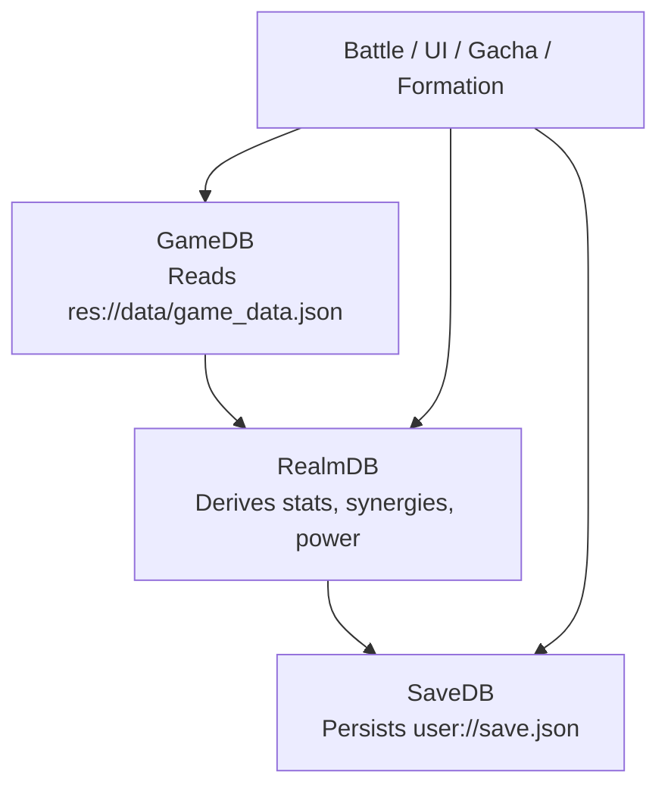
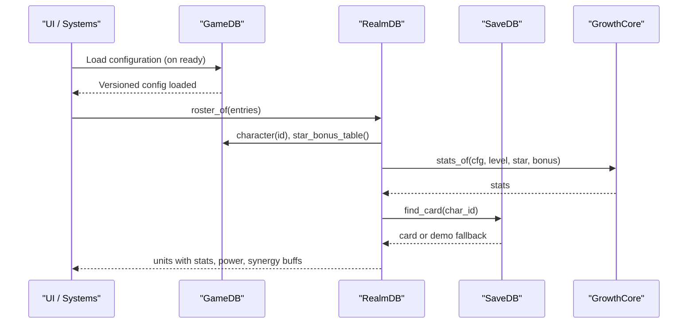
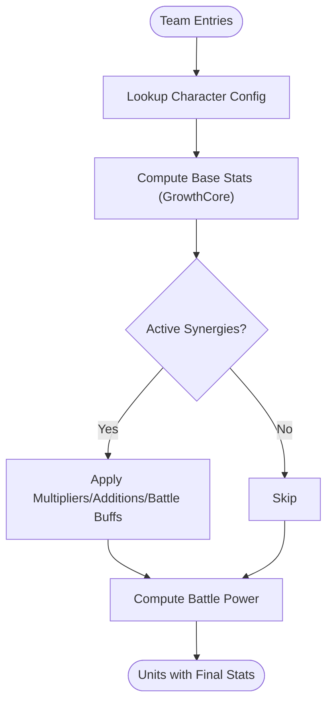
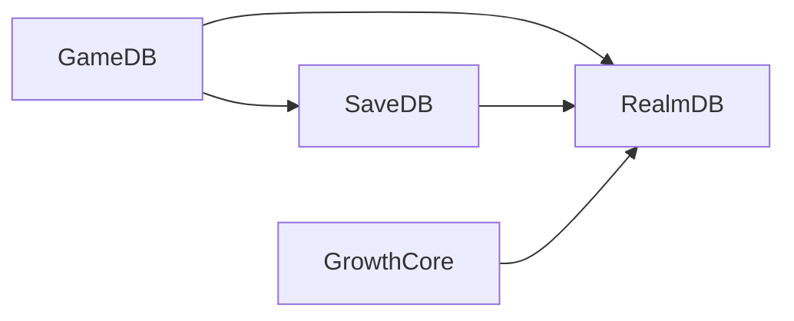
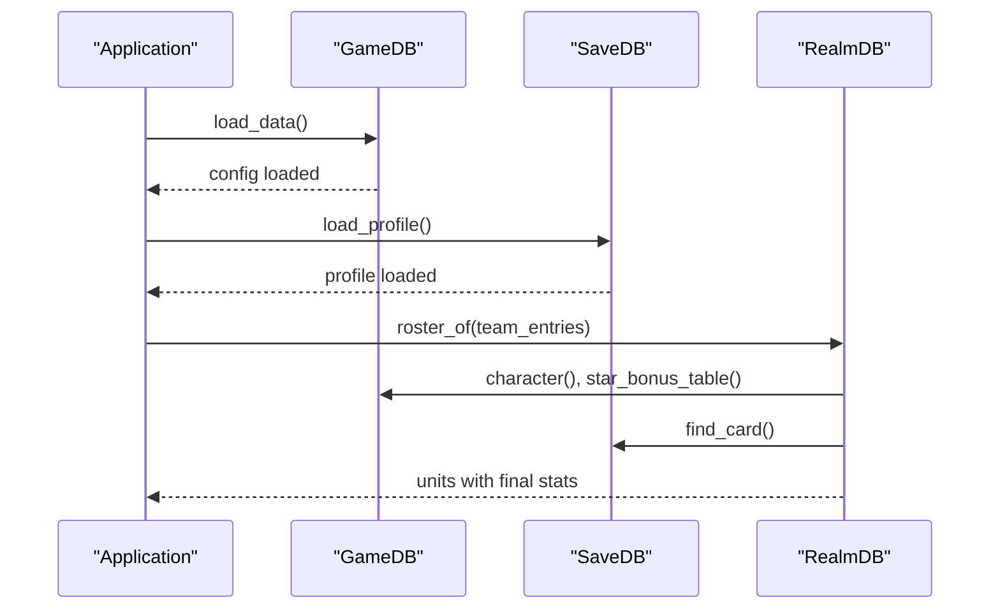

# Configuration & Data Management

<cite>
**Referenced Files in This Document**
- [game_data.json](file://data/game_data.json)
- [schema.sql](file://data/db/schema.sql)
- [game_db.gd](file://scripts/game_db.gd)
- [realm_db.gd](file://scripts/realm_db.gd)
- [save_db.gd](file://scripts/save_db.gd)
- [growth_core.gd](file://scripts/growth_core.gd)
- [README.md](file://README.md)
</cite>

## Table of Contents
1. [Introduction](#introduction)
2. [Project Structure](#project-structure)
3. [Core Components](#core-components)
4. [Architecture Overview](#architecture-overview)
5. [Detailed Component Analysis](#detailed-component-analysis)
6. [Dependency Analysis](#dependency-analysis)
7. [Performance Considerations](#performance-considerations)
8. [Troubleshooting Guide](#troubleshooting-guide)
9. [Conclusion](#conclusion)
10. [Appendices](#appendices)

## Introduction
This document explains the game configuration and data management systems, focusing on:
- The JSON schema for game_data.json (characters, stages, balance parameters).
- The legacy SQLite database schema and migration considerations.
- Data validation rules, type checking, and integrity constraints.
- Examples of valid configurations, data relationships, and versioning strategies.
- Hot-reloading capabilities, serialization formats, backup/restore procedures.
- How configuration data drives runtime behavior across UI, battle, and progression systems.

## Project Structure
The project separates static configuration, runtime derivation, and persistent player state into three layers:
- GameDB reads and exposes read-only configuration from a single JSON file.
- RealmDB derives final stats, synergies, and combat hints by combining configuration with player state.
- SaveDB persists player progress, inventory, gacha state, and team presets to a local JSON file.

**Diagram sources**
- [game_db.gd:1-47](file://scripts/game_db.gd#L1-L47)
- [realm_db.gd:1-35](file://scripts/realm_db.gd#L1-L35)
- [save_db.gd:1-22](file://scripts/save_db.gd#L1-L22)

**Section sources**
- [README.md:432-442](file://README.md#L432-L442)
- [game_db.gd:1-47](file://scripts/game_db.gd#L1-L47)
- [realm_db.gd:1-35](file://scripts/realm_db.gd#L1-L35)
- [save_db.gd:1-22](file://scripts/save_db.gd#L1-L22)

## Core Components
- GameDB: Loads game_data.json at startup, provides typed accessors for elements, rarities, characters, combat/board config, gacha pools, stamina, formation rules, adventure map, monsters, and more. It is read-only and does not touch player state.
- RealmDB: Computes final stats using GrowthCore, applies synergies, calculates team power, and generates counter reports and formation hints. It never writes to disk.
- SaveDB: Centralized persistence layer for player profile, wallet, stamina, cards, teams, presets, progress, gacha state, and statistics. Normalizes and migrates data on load; emits signals on save/load.
- GrowthCore: Pure functions for stat calculation and battle power, shared between UI/build tools and runtime to keep numbers consistent.

Key responsibilities and boundaries are enforced by design:
- Only GameDB reads configuration.
- Only SaveDB writes player data.
- RealmDB composes both without side effects.

**Section sources**
- [game_db.gd:1-47](file://scripts/game_db.gd#L1-L47)
- [realm_db.gd:1-35](file://scripts/realm_db.gd#L1-L35)
- [save_db.gd:1-22](file://scripts/save_db.gd#L1-L22)
- [growth_core.gd:1-53](file://scripts/growth_core.gd#L1-L53)

## Architecture Overview
The system follows a layered architecture:
- Configuration Layer (GameDB): Read-only JSON-backed API.
- Derivation Layer (RealmDB + GrowthCore): Pure computations over configuration and saved state.
- Persistence Layer (SaveDB): Single source of truth for player data with normalization and migration.

**Diagram sources**
- [game_db.gd:13-37](file://scripts/game_db.gd#L13-L37)
- [realm_db.gd:13-70](file://scripts/realm_db.gd#L13-L70)
- [growth_core.gd:24-53](file://scripts/growth_core.gd#L24-L53)
- [save_db.gd:235-243](file://scripts/save_db.gd#L235-L243)

## Detailed Component Analysis

### GameData JSON Schema (game_data.json)
The JSON file defines all static game content and balance parameters. Key sections include:
- meta: Title, genre, viewport settings, iso tilt angles.
- economy: Currency definitions (hard/soft tokens) with names, icons, colors.
- elements: Elemental order and counters (water > fire > wind > earth > light > dark).
- combat: Counter multipliers, ATB gauge, board layout (rows, slots, pixel geometry), battle coordinates, token sizes, screen rect.
- roles: Role definitions with preferred rows and descriptions.
- rarities: Rarity tiers with frame assets, inner rects, level caps, star defaults/max.
- characters: Array of hero entries with id, name, rarity, element, role, portrait, prefer_slot, base stats, growth rates, skill definitions, codex info.
- adventure: Stage select map nodes, links, stage kinds, star rating rules, chapter stages list.
- gacha: Pools, tickets, pity groups, costs, history limits, rate notices, shop, new-player gifts.
- formation: Team max members, scene path, stamina spend timing, synergies, role counters/chains/tactics.
- monsters: Monster table and order used in battles.

Example relationships:
- Characters reference rarities and elements via string IDs.
- Roles influence preferred rows and class matrix used by UI and synergy evaluation.
- Combat board maps slot indices to grid cells for rendering and targeting.
- Gacha pools reference currencies and tickets defined in economy.

Validation and safety:
- Accessors return safe defaults when keys are missing.
- Arrays/dictionaries are validated before use to avoid crashes.
- Rates are normalized to sum to 1.0 for robustness against misconfiguration.

Versioning:
- meta.version tracks configuration version.
- GameDB exposes version() for logging and diagnostics.

**Section sources**
- [game_data.json:1-118](file://data/game_data.json#L1-L118)
- [game_data.json:119-302](file://data/game_data.json#L119-L302)
- [game_data.json:303-455](file://data/game_data.json#L303-L455)
- [game_data.json:456-800](file://data/game_data.json#L456-L800)
- [game_db.gd:40-47](file://scripts/game_db.gd#L40-L47)
- [game_db.gd:55-103](file://scripts/game_db.gd#L55-L103)
- [game_db.gd:141-183](file://scripts/game_db.gd#L141-L183)
- [game_db.gd:326-344](file://scripts/game_db.gd#L326-L344)

### Legacy Database Schema (schema.sql)
The SQL file defines two logical databases split at build time:
- cfg: Static configuration tables for heroes, skills, items, chapters, stages, monster groups, drop groups, and gacha pools. Uses CHECK constraints and JSON validation where applicable.
- player: Dynamic player tables for player profile, hero instances, formations, items, stage progress, and gacha state. Includes foreign keys within this DB and triggers to maintain updated_at timestamps.

Migration and integrity notes:
- Cross-database foreign keys are not enforced; application layer validates references (e.g., hero_id -> cfg.hero_id).
- user_version fields enable hot updates and migrations for each DB.
- Time stored as ISO8601 strings using localtime; comments recommend Unix timestamps for time-diff calculations.
- Indexes optimize queries on stage ordering and drop groups.

Build-time splitting:
- Comments indicate that a single schema file is split into two physical databases during build:
  - data/db/game_cfg.db (read-only, hot-updatable)
  - data/db/player_save.db (writable, WAL-enabled, backed up)

**Section sources**
- [schema.sql:1-39](file://data/db/schema.sql#L1-L39)
- [schema.sql:41-165](file://data/db/schema.sql#L41-L165)
- [schema.sql:166-327](file://data/db/schema.sql#L166-L327)

### Data Validation Rules, Type Checking, Integrity Constraints
- JSON parsing: GameDB checks parsed result is a dictionary; errors logged if invalid.
- Safe accessors: section(), character(), rarity(), etc., return empty dictionaries or arrays when keys are missing.
- Numeric clamping and bounds:
  - Stamina, currency balances, and item counts are non-negative.
  - Slot indices constrained to 1..9; team size limited by team_max().
  - Star values bounded by rarity star_max/star_default.
- JSON fields in SQLite:
  - Columns storing JSON use CHECK(json_valid(...)) to enforce structure at DB level.
- Normalization:
  - SaveDB normalizes equipment slots to fixed length with explicit empty-string for “unequipped”.
  - Teams are deduplicated by char_id and slot; out-of-range entries are discarded.
- Migration:
  - _migrate_gacha() moves legacy global pity counts into per-group structures once.

Examples of constraints:
- tb_player_hero.star BETWEEN 1 AND 6.
- tb_player.gold, diamond, pay_diamond, stamina >= 0.
- tb_cfg_stage.stage_type IN {1,2,3}.
- tb_cfg_drop_group.is_guaranteed IN {0,1}.

**Section sources**
- [game_db.gd:17-37](file://scripts/game_db.gd#L17-L37)
- [game_db.gd:115-136](file://scripts/game_db.gd#L115-L136)
- [save_db.gd:184-192](file://scripts/save_db.gd#L184-L192)
- [save_db.gd:293-316](file://scripts/save_db.gd#L293-L316)
- [save_db.gd:195-209](file://scripts/save_db.gd#L195-L209)
- [schema.sql:52-66](file://data/db/schema.sql#L52-L66)
- [schema.sql:111-123](file://data/db/schema.sql#L111-L123)
- [schema.sql:137-145](file://data/db/schema.sql#L137-L145)
- [schema.sql:178-193](file://data/db/schema.sql#L178-L193)
- [schema.sql:198-209](file://data/db/schema.sql#L198-L209)

### Examples of Valid Configurations and Data Relationships
Valid character entry highlights:
- id, name, title, rarity, element, role, portrait, prefer_slot, demo_level, demo_star.
- base stats: hp, atk, def, mres, crit, crit_dmg, hit, spd.
- growth rates: hp, atk, def, mres, spd.
- skill: name, type, cost, target, desc, shards, effect (kind, target, damage/mult/heal_pct).
- codex: class, battle_role, attack/ult/passive text.

Stage configuration highlights:
- chapter_id, stage_no, stage_type, monster_group_id, stamina_cost, rewards, first_clear, pre_stage_id.

Relationships:
- Characters link to rarities and elements by ID.
- Stages link to monster groups and chapters.
- Gacha pools reference currencies and tickets defined in economy.

**Section sources**
- [game_data.json:456-800](file://data/game_data.json#L456-L800)
- [schema.sql:111-132](file://data/db/schema.sql#L111-L132)

### Version Management Strategies
- Configuration version: meta.version exposed via GameDB.version().
- Player save version: SaveDB.SAVE_VERSION written on save; default profile ensures compatibility.
- Database versions: PRAGMA user_version set for both cfg and player DBs to support migrations.
- Migration hooks:
  - SaveDB._migrate_gacha() adapts legacy pity structure once.
  - Schema comments describe how to split and migrate DBs at build time.

**Section sources**
- [game_db.gd:40-47](file://scripts/game_db.gd#L40-L47)
- [save_db.gd:11-12](file://scripts/save_db.gd#L11-L12)
- [save_db.gd:168-176](file://scripts/save_db.gd#L168-L176)
- [schema.sql:46-47](file://data/db/schema.sql#L46-L47)
- [schema.sql:171-173](file://data/db/schema.sql#L171-L173)
- [save_db.gd:195-209](file://scripts/save_db.gd#L195-L209)

### Hot-Reloading Capabilities
- Configuration hot reload:
  - GameDB loads from res://data/game_data.json at startup. Replacing the file and reloading the module allows hot updates without touching player saves.
- Database hot update:
  - The cfg database is designed to be replaced at runtime (read-only), while player_save.db remains untouched. Build comments specify this separation to enable safe hot updates.

Operational notes:
- Ensure configuration changes are backward compatible or provide migration logic in GameDB accessors.
- Validate JSON after replacement to prevent runtime parse errors.

**Section sources**
- [game_db.gd:17-37](file://scripts/game_db.gd#L17-L37)
- [schema.sql:1-16](file://data/db/schema.sql#L1-L16)

### Data Serialization Formats
- Configuration: JSON (UTF-8), parsed into Godot Dictionary/Array.
- Player save: JSON (user://save.json), pretty-printed with tabs for readability.
- Database: SQLite with TEXT columns for JSON payloads validated via json_valid().

Serialization safeguards:
- SaveDB writes version tag and emits saved signal.
- On load, SaveDB fills missing fields with defaults and normalizes structures.

**Section sources**
- [game_db.gd:25-37](file://scripts/game_db.gd#L25-L37)
- [save_db.gd:168-176](file://scripts/save_db.gd#L168-L176)
- [save_db.gd:146-165](file://scripts/save_db.gd#L146-L165)
- [schema.sql:21-22](file://data/db/schema.sql#L21-L22)

### Backup and Restore Procedures
- SaveDB supports reset_profile() to recreate default save.
- Smoke tests demonstrate backing up and restoring save files around test runs.
- For production:
  - Back up user://save.json regularly.
  - Keep cfg DB immutable except during controlled hot updates.
  - Use WAL mode for player_save.db to reduce corruption risk during backups.

**Section sources**
- [save_db.gd:179-181](file://scripts/save_db.gd#L179-L181)
- [tools/suites/formation_suite.gd:83-90](file://tools/suites/formation_suite.gd#L83-L90)
- [schema.sql:1-16](file://data/db/schema.sql#L1-L16)

### Relationship Between Configuration Data and Runtime Behavior
- Elements and counters: GameDB.is_counter and damage_multiplier drive elemental advantage in combat.
- Board layout: GameDB.board() and slot_cell() determine unit positions and targeting zones.
- Synergies: RealmDB evaluates formation.synergies to apply stat multipliers, crit additions, and battle-level buffs (open_energy, open_shield, elem_dmg).
- Power calculation: GrowthCore.battle_power unifies team power across UI and battle.
- Gacha: GameDB.gacha_* methods normalize probabilities, costs, pity, and UP lists; SaveDB tracks pulls and history; RealmDB uses these to compute outcomes.

**Diagram sources**
- [realm_db.gd:33-70](file://scripts/realm_db.gd#L33-L70)
- [realm_db.gd:86-178](file://scripts/realm_db.gd#L86-L178)
- [realm_db.gd:189-243](file://scripts/realm_db.gd#L189-L243)
- [growth_core.gd:24-53](file://scripts/growth_core.gd#L24-L53)

**Section sources**
- [game_db.gd:83-103](file://scripts/game_db.gd#L83-L103)
- [game_db.gd:111-136](file://scripts/game_db.gd#L111-L136)
- [realm_db.gd:86-178](file://scripts/realm_db.gd#L86-L178)
- [realm_db.gd:189-243](file://scripts/realm_db.gd#L189-L243)
- [growth_core.gd:24-53](file://scripts/growth_core.gd#L24-L53)

## Dependency Analysis
High-level dependencies:
- RealmDB depends on GameDB for configuration and SaveDB for player state.
- SaveDB depends on GameDB for defaults and team limits.
- GrowthCore is independent and reused by both UI and runtime.

**Diagram sources**
- [game_db.gd:1-47](file://scripts/game_db.gd#L1-L47)
- [realm_db.gd:1-35](file://scripts/realm_db.gd#L1-L35)
- [save_db.gd:1-22](file://scripts/save_db.gd#L1-L22)
- [growth_core.gd:1-53](file://scripts/growth_core.gd#L1-L53)

**Section sources**
- [game_db.gd:1-47](file://scripts/game_db.gd#L1-L47)
- [realm_db.gd:1-35](file://scripts/realm_db.gd#L1-L35)
- [save_db.gd:1-22](file://scripts/save_db.gd#L1-L22)
- [growth_core.gd:1-53](file://scripts/growth_core.gd#L1-L53)

## Performance Considerations
- Configuration loading occurs once at startup; subsequent access is O(1) dictionary lookups.
- Stat computation is linear in number of units; synergy evaluation iterates rules and units but remains lightweight for typical team sizes.
- JSON storage is human-readable and small; consider compression only if save size grows significantly.
- Database indexes on stage ordering and drop groups improve query performance.

[No sources needed since this section provides general guidance]

## Troubleshooting Guide
Common issues and resolutions:
- Configuration file missing or unreadable:
  - GameDB logs an error and returns false; ensure res://data/game_data.json exists and is readable.
- JSON parse failure:
  - Verify JSON syntax; GameDB rejects non-dictionary roots.
- Invalid team entries:
  - SaveDB.normalize_team discards unknown heroes, duplicates, and out-of-range slots; use team_errors() for human-readable messages.
- Equipment slot mismatch:
  - SaveDB._normalize_cards pads equipment arrays to slot_count; ensure GameDB.equipment_slot_count() matches expected slots.
- Gacha state migration:
  - If legacy pity_small/pity_large exist, SaveDB._migrate_gacha() consolidates them into per-group structures.

**Section sources**
- [game_db.gd:17-37](file://scripts/game_db.gd#L17-L37)
- [save_db.gd:293-344](file://scripts/save_db.gd#L293-L344)
- [save_db.gd:184-192](file://scripts/save_db.gd#L184-L192)
- [save_db.gd:195-209](file://scripts/save_db.gd#L195-L209)

## Conclusion
The configuration and data management systems are cleanly separated into read-only configuration, pure derivation, and centralized persistence. This design enables:
- Safe hot updates to configuration without affecting player data.
- Consistent stat calculations across UI and battle via GrowthCore.
- Robust validation and migration paths for both JSON and SQLite data.
- Clear versioning strategies for configuration, saves, and databases.

Adhering to these patterns ensures maintainability, predictability, and scalability as content and features grow.

[No sources needed since this section summarizes without analyzing specific files]

## Appendices

### Appendix A: Key Data Flows

**Diagram sources**
- [game_db.gd:17-37](file://scripts/game_db.gd#L17-L37)
- [save_db.gd:146-165](file://scripts/save_db.gd#L146-L165)
- [realm_db.gd:33-70](file://scripts/realm_db.gd#L33-L70)

### Appendix B: Example Valid Config Snippets (by reference)
- Character definition: see [game_data.json:456-800](file://data/game_data.json#L456-L800)
- Stage configuration: see [schema.sql:111-123](file://data/db/schema.sql#L111-L123)
- Gacha pool and costs: see [game_db.gd:287-419](file://scripts/game_db.gd#L287-L419)

[No additional sources needed beyond those cited above]