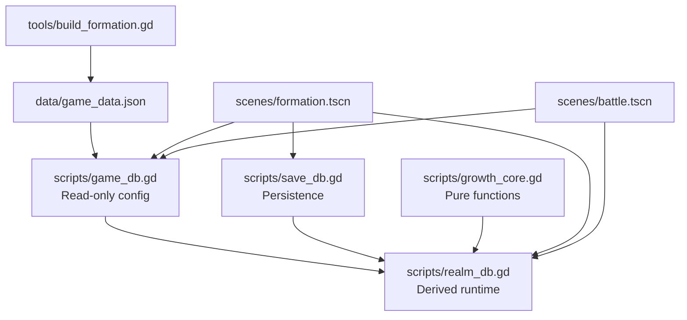
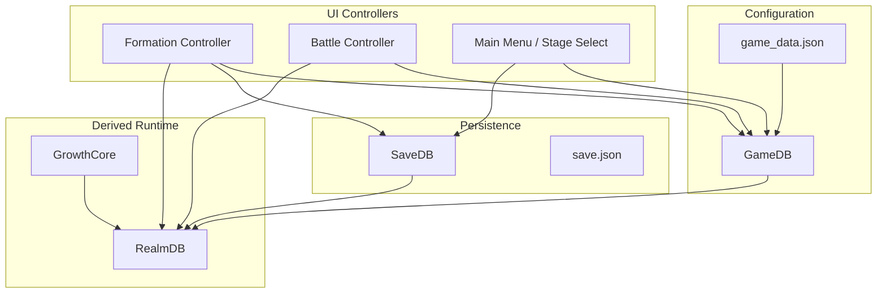
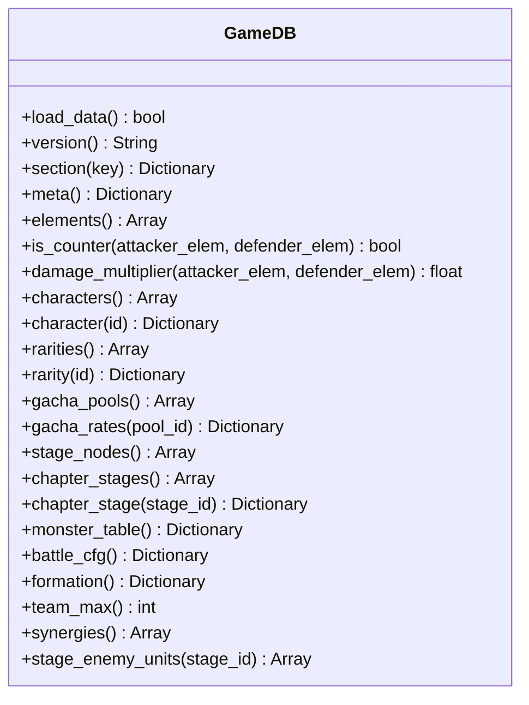
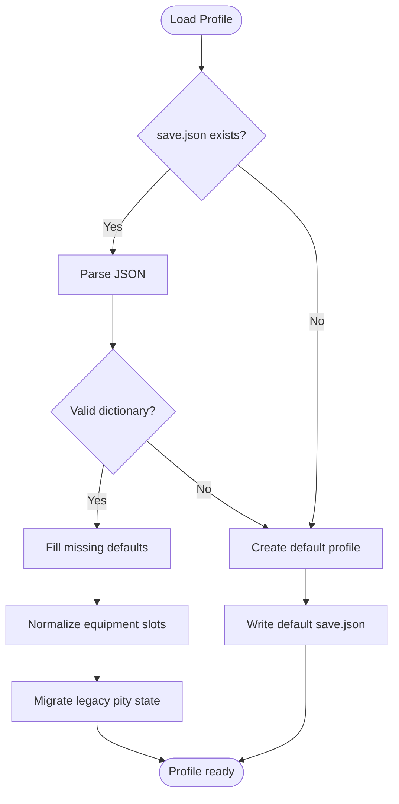
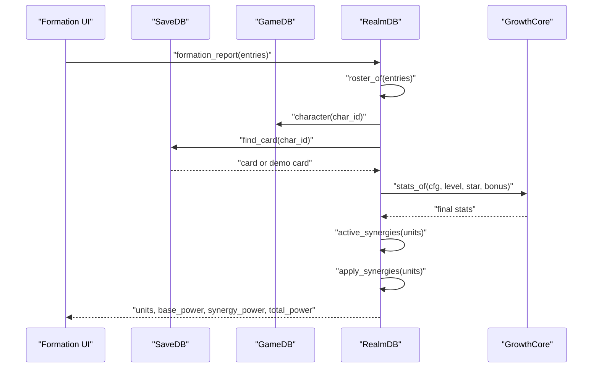
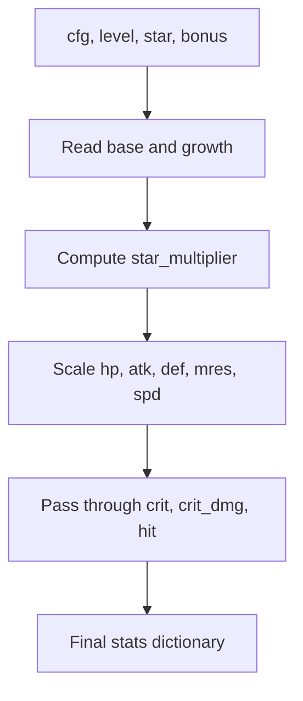
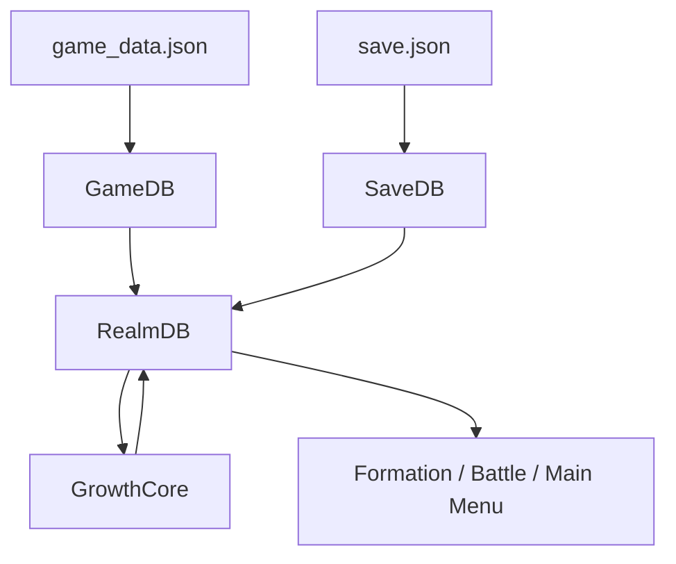
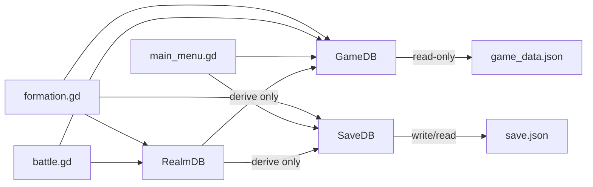
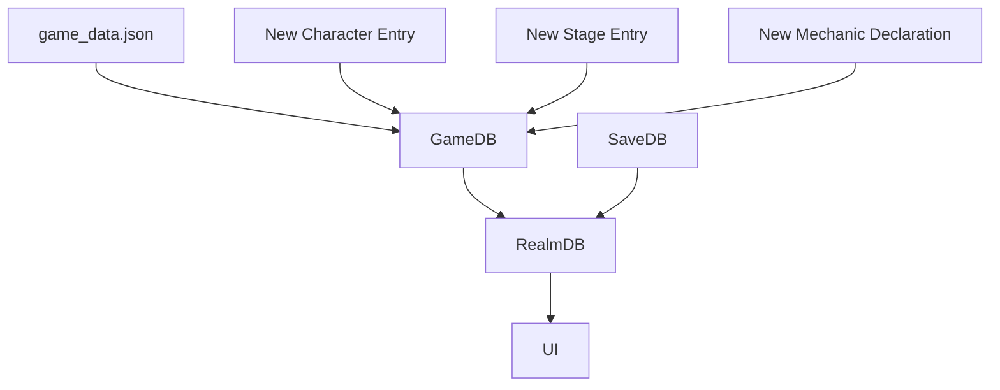
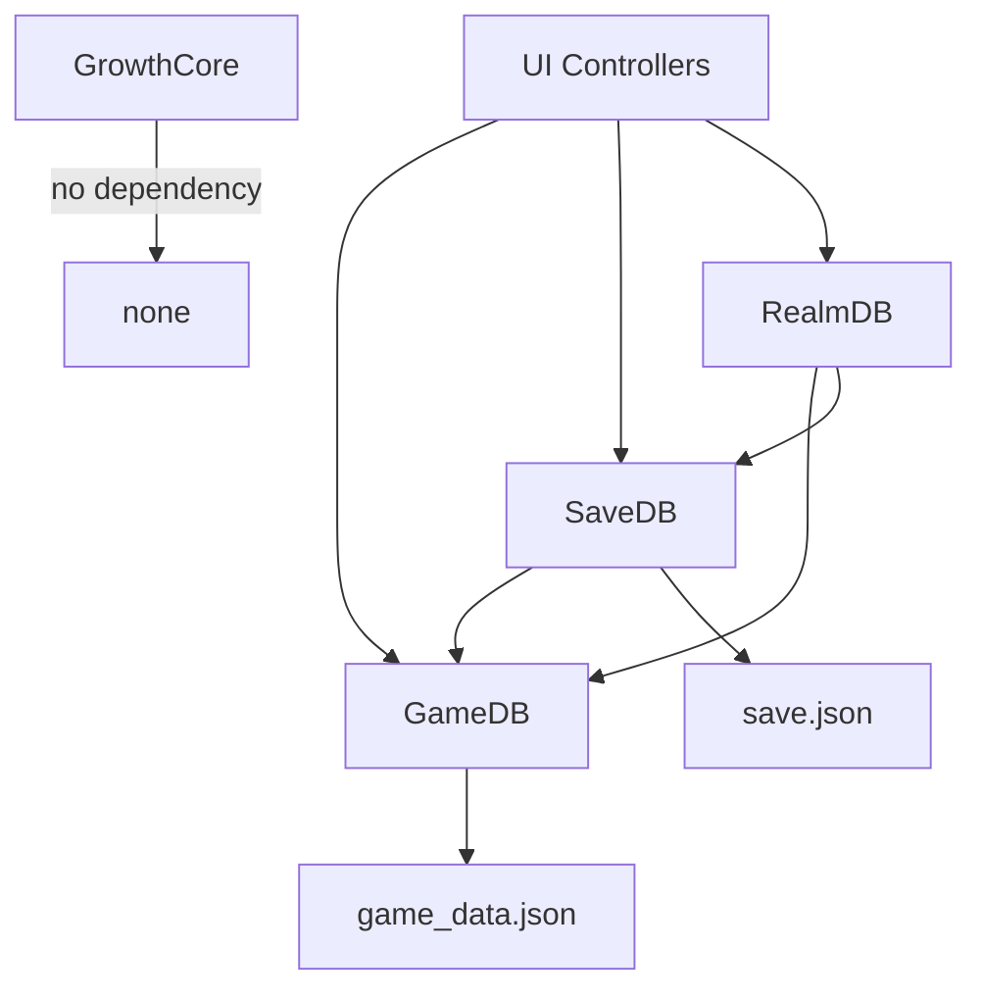

# Core Architecture

<cite>
**Referenced Files in This Document**
- [README.md](file://README.md)
- [game_data.json](file://data/game_data.json)
- [game_db.gd](file://scripts/game_db.gd)
- [save_db.gd](file://scripts/save_db.gd)
- [realm_db.gd](file://scripts/realm_db.gd)
- [growth_core.gd](file://scripts/growth_core.gd)
- [build_formation.gd](file://tools/build_formation.gd)
</cite>

## Table of Contents
1. [Introduction](#introduction)
2. [Project Structure](#project-structure)
3. [Core Components](#core-components)
4. [Architecture Overview](#architecture-overview)
5. [Detailed Component Analysis](#detailed-component-analysis)
6. [Dependency Analysis](#dependency-analysis)
7. [Performance Considerations](#performance-considerations)
8. [Troubleshooting Guide](#troubleshooting-guide)
9. [Conclusion](#conclusion)
10. [Appendices](#appendices)

## Introduction
This document explains the core architecture of Card Adventure, focusing on its layered data model, service-oriented systems, deterministic growth calculations, and extension points for characters, stages, and mechanics. The project separates configuration, persistence, and derived runtime values into three autoload services:

- **GameDB**: read-only configuration layer backed by `data/game_data.json`.
- **SaveDB**: single persistence layer writing to `user://save.json`.
- **RealmDB**: derived runtime layer that computes final stats, team power, synergies, counters, and UI-facing reports without writing to disk.

The design keeps UI controllers free of business logic: they call clean APIs on these layers rather than parsing JSON or mutating save files directly. Growth formulas are isolated in a pure-function class so build scripts and runtime code share one source of truth.

## Project Structure
At a high level, the project follows a clear separation between:

- **Configuration**: `data/game_data.json` plus SQL/schema artifacts kept as legacy.
- **Data Services**: `scripts/game_db.gd`, `scripts/save_db.gd`, `scripts/realm_db.gd`.
- **Pure Logic**: `scripts/growth_core.gd`.
- **UI Scenes**: `scenes/main_menu.tscn`, `scenes/stage_select.tscn`, `scenes/formation.tscn`, `scenes/battle.tscn`, `scenes/gacha.tscn`.
- **Build Tools**: `tools/build_*.gd` generate scene structure; `tools/smoke_*.gd` run headless tests.

**Diagram sources**
- [game_db.gd:1-14](file://scripts/game_db.gd#L1-L14)
- [save_db.gd:1-21](file://scripts/save_db.gd#L1-L21)
- [realm_db.gd:1-18](file://scripts/realm_db.gd#L1-L18)
- [growth_core.gd:1-11](file://scripts/growth_core.gd#L1-L11)
- [build_formation.gd:25-34](file://tools/build_formation.gd#L25-L34)

**Section sources**
- [README.md:62-96](file://README.md#L62-L96)
- [README.md:432-464](file://README.md#L432-L464)

## Core Components
The core systems form a small set of focused services:

| Layer | File | Responsibility | Data Source | Mutates State? |
|---|---|---|---|---|
| Configuration | `scripts/game_db.gd` | Loads `game_data.json`, exposes typed query methods for elements, roles, rarities, characters, gacha, stamina, adventure, formation, monsters, and board layout. | `res://data/game_data.json` | No |
| Persistence | `scripts/save_db.gd` | Creates default profiles, normalizes cards and teams, manages wallet, stamina, progress, gacha state, materials, and statistics. | `user://save.json` | Yes |
| Derived Runtime | `scripts/realm_db.gd` | Computes final stats, battle power, roster, synergies, counter hints, and formation reports. | GameDB + SaveDB | No |
| Pure Growth Math | `scripts/growth_core.gd` | Star multiplier, stat calculation, and unified power formula. | None (pure) | No |

Key design rules:

- Only GameDB reads configuration.
- Only SaveDB writes player data.
- RealmDB derives values but never persists them.
- GrowthCore has no autoload dependency and can be preloaded by build tools.
- UI controllers depend on service APIs, not raw JSON or file paths.

**Section sources**
- [game_db.gd:1-14](file://scripts/game_db.gd#L1-L14)
- [save_db.gd:1-18](file://scripts/save_db.gd#L1-L18)
- [realm_db.gd:1-18](file://scripts/realm_db.gd#L1-L18)
- [growth_core.gd:1-11](file://scripts/growth_core.gd#L1-L11)
- [README.md:432-443](file://README.md#L432-L443)

## Architecture Overview
Card Adventure uses a layered architecture with explicit boundaries:

1. **Configuration Layer**: GameDB parses JSON once and provides stable accessors.
2. **Persistence Layer**: SaveDB owns the canonical player profile and guarantees normalization.
3. **Derived Layer**: RealmDB composes configuration and saved state into usable runtime objects.
4. **Pure Math Layer**: GrowthCore contains deterministic formulas shared across UI previews and gameplay.
5. **UI Controllers**: Scene scripts consume service APIs and render results.

**Diagram sources**
- [game_db.gd:17-37](file://scripts/game_db.gd#L17-L37)
- [save_db.gd:146-176](file://scripts/save_db.gd#L146-L176)
- [realm_db.gd:13-18](file://scripts/realm_db.gd#L13-L18)
- [growth_core.gd:17-39](file://scripts/growth_core.gd#L17-L39)

**Section sources**
- [README.md:432-443](file://README.md#L432-L443)

## Detailed Component Analysis

### Configuration Layer: GameDB
GameDB is the single read-only entry point for game design data. It loads `game_data.json`, validates it, and exposes domain-specific getters such as element counters, rarity ordering, character lookup, gacha pool rules, stamina configuration, adventure maps, chapter stages, monster tables, board geometry, formation rules, and enemy composition helpers.

Important responsibilities:

- Load and validate JSON at startup.
- Provide safe fallbacks when fields are missing.
- Normalize lists like elements, rarities, and gacha rates.
- Expose readable names, icons, colors, and positions for UI.
- Derive stage-related metadata such as recommended power, stamina cost, display name, and enemy composition.

**Diagram sources**
- [game_db.gd:17-37](file://scripts/game_db.gd#L17-L37)
- [game_db.gd:53-102](file://scripts/game_db.gd#L53-L102)
- [game_db.gd:141-190](file://scripts/game_db.gd#L141-L190)
- [game_db.gd:287-344](file://scripts/game_db.gd#L287-L344)
- [game_db.gd:565-698](file://scripts/game_db.gd#L565-L698)
- [game_db.gd:711-740](file://scripts/game_db.gd#L711-L740)
- [game_db.gd:748-800](file://scripts/game_db.gd#L748-L800)
- [game_db.gd:837-870](file://scripts/game_db.gd#L837-L870)

**Section sources**
- [game_db.gd:1-37](file://scripts/game_db.gd#L1-L37)
- [game_db.gd:53-102](file://scripts/game_db.gd#L53-L102)
- [game_db.gd:141-190](file://scripts/game_db.gd#L141-L190)
- [game_db.gd:287-344](file://scripts/game_db.gd#L287-L344)
- [game_db.gd:565-698](file://scripts/game_db.gd#L565-L698)
- [game_db.gd:711-740](file://scripts/game_db.gd#L711-L740)
- [game_db.gd:748-800](file://scripts/game_db.gd#L748-L800)
- [game_db.gd:837-870](file://scripts/game_db.gd#L837-L870)

### Persistence Layer: SaveDB
SaveDB is the only place that reads from or writes to `user://save.json`. It creates a default profile when none exists, fills missing keys recursively, normalizes card equipment slots, migrates legacy gacha pity state, and enforces team constraints.

Key responsibilities:

- Default profile generation from configuration.
- Profile load/save with versioning.
- Wallet operations for currencies.
- Card granting with star caps.
- Team validation, normalization, presets, and active preset switching.
- Progress tracking including cleared stages, star ratings, and material inventory.
- Gacha state including total pulls, per-pool counts, pity groups, history, and exchange counts.

**Diagram sources**
- [save_db.gd:26-82](file://scripts/save_db.gd#L26-L82)
- [save_db.gd:102-109](file://scripts/save_db.gd#L102-L109)
- [save_db.gd:146-176](file://scripts/save_db.gd#L146-L176)
- [save_db.gd:184-209](file://scripts/save_db.gd#L184-L209)

**Section sources**
- [save_db.gd:1-21](file://scripts/save_db.gd#L1-L21)
- [save_db.gd:26-82](file://scripts/save_db.gd#L26-L82)
- [save_db.gd:146-176](file://scripts/save_db.gd#L146-L176)
- [save_db.gd:184-209](file://scripts/save_db.gd#L184-L209)
- [save_db.gd:213-277](file://scripts/save_db.gd#L213-L277)
- [save_db.gd:285-352](file://scripts/save_db.gd#L285-L352)
- [save_db.gd:357-404](file://scripts/save_db.gd#L357-L404)
- [save_db.gd:409-505](file://scripts/save_db.gd#L409-L505)
- [save_db.gd:516-619](file://scripts/save_db.gd#L516-L619)

### Derived Runtime Layer: RealmDB
RealmDB turns raw configuration and saved state into values used by UI and combat. It does not write to disk. Its main outputs include:

- Final stats for a card based on level, star, and star bonus table.
- Battle power using a unified formula.
- A roster built from the current team or arbitrary entries.
- Active synergy evaluation and effect application.
- Counter reports combining element and role advantages.
- Formation reports exposing base power, synergy power, total power, and hints.

**Diagram sources**
- [realm_db.gd:13-18](file://scripts/realm_db.gd#L13-L18)
- [realm_db.gd:33-70](file://scripts/realm_db.gd#L33-L70)
- [realm_db.gd:86-178](file://scripts/realm_db.gd#L86-L178)
- [realm_db.gd:189-243](file://scripts/realm_db.gd#L189-L243)
- [realm_db.gd:340-359](file://scripts/realm_db.gd#L340-L359)
- [growth_core.gd:24-39](file://scripts/growth_core.gd#L24-L39)

**Section sources**
- [realm_db.gd:1-18](file://scripts/realm_db.gd#L1-L18)
- [realm_db.gd:13-70](file://scripts/realm_db.gd#L13-L70)
- [realm_db.gd:86-178](file://scripts/realm_db.gd#L86-L178)
- [realm_db.gd:189-243](file://scripts/realm_db.gd#L189-L243)
- [realm_db.gd:281-359](file://scripts/realm_db.gd#L281-L359)
- [realm_db.gd:433-498](file://scripts/realm_db.gd#L433-L498)

### Pure Function Layer: GrowthCore
GrowthCore isolates deterministic growth math. It has no autoload dependency, no file I/O, and no Godot node references. It exposes:

- Star multiplier from the configured per-star bonus array.
- Stats calculation from character base, growth, level, and star bonus.
- Unified battle power formula used everywhere in the project.

**Diagram sources**
- [growth_core.gd:17-39](file://scripts/growth_core.gd#L17-L39)
- [growth_core.gd:42-52](file://scripts/growth_core.gd#L42-L52)

**Section sources**
- [growth_core.gd:1-52](file://scripts/growth_core.gd#L1-L52)

### Data Flow: JSON Configuration to Runtime Values
The full flow from configuration to final runtime values is:

1. GameDB loads `game_data.json`.
2. SaveDB loads or creates `save.json`.
3. RealmDB reads character configuration from GameDB and card state from SaveDB.
4. GrowthCore calculates final stats from base, growth, level, and star bonus.
5. RealmDB applies synergies and produces unit objects with final stats and power.
6. UI controllers render roster, formation report, and battle preview.

**Diagram sources**
- [game_db.gd:17-37](file://scripts/game_db.gd#L17-L37)
- [save_db.gd:146-176](file://scripts/save_db.gd#L146-L176)
- [realm_db.gd:13-18](file://scripts/realm_db.gd#L13-L18)
- [growth_core.gd:24-39](file://scripts/growth_core.gd#L24-L39)

**Section sources**
- [README.md:432-443](file://README.md#L432-L443)
- [README.md:332-343](file://README.md#L332-L343)

### Component Interaction Diagram: UI Controllers Depend on Data Layers
UI controllers should not parse JSON or touch save files directly. Instead, they use:

- GameDB for configuration queries.
- SaveDB for persistent state changes.
- RealmDB for computed values and reports.

**Diagram sources**
- [build_formation.gd:25-34](file://tools/build_formation.gd#L25-L34)
- [game_db.gd:1-14](file://scripts/game_db.gd#L1-L14)
- [save_db.gd:1-18](file://scripts/save_db.gd#L1-L18)
- [realm_db.gd:1-18](file://scripts/realm_db.gd#L1-L18)

**Section sources**
- [README.md:75-84](file://README.md#L75-L84)
- [README.md:153-205](file://README.md#L153-L205)
- [README.md:207-244](file://README.md#L207-L244)

### Extension Points and Plugin Mechanisms
The system is designed so new content can often be added by editing configuration rather than changing code.

#### Adding New Characters
New characters extend the `characters` array in `game_data.json`. Each character defines:

- Identity: `id`, `name`, optional `hero_name`.
- Rarity, element, role, portrait, and preferred slot.
- Display state: `demo_level`, `demo_star`.
- Combat stats: `base` and `growth`.
- Optional codex text for UI.
- Optional skill definition consumed by combat.

GameDB already supports iterating characters, looking up by ID, and reading codex fields. RealmDB uses character configuration to compute stats and roster items.

#### Adding New Stages
Stages live under the adventure section of `game_data.json`. The project distinguishes:

- Chapter stages: battle-relevant stage list.
- Select map nodes: visual placement and navigation.
- Enemy units: monster IDs, slots, and derived element/role composition.

GameDB provides chapter stage lookup, stamina cost, recommended power, display name, and enemy composition helpers. RealmDB uses enemy composition for counter hints.

#### Adding New Game Mechanics
Mechanics are mostly declarative:

- Element counters and damage multipliers are in GameDB.
- Synergy conditions and effects are declared in `formation.synergies`.
- Gacha pools, rates, pity groups, tickets, costs, and reveal animations are in `gacha`.
- Stamina recovery and economy currencies are in `stamina` and `economy`.

RealmDB evaluates synergy conditions and applies effects without hardcoding combinations. GrowthCore centralizes stat formulas so new growth features can reuse the same math path.

**Diagram sources**
- [game_db.gd:181-190](file://scripts/game_db.gd#L181-L190)
- [game_db.gd:565-698](file://scripts/game_db.gd#L565-L698)
- [game_db.gd:748-800](file://scripts/game_db.gd#L748-L800)
- [realm_db.gd:86-178](file://scripts/realm_db.gd#L86-L178)

**Section sources**
- [README.md:362-392](file://README.md#L362-L392)
- [README.md:444-464](file://README.md#L444-L464)
- [README.md:580-605](file://README.md#L580-L605)

## Dependency Analysis
The dependencies follow a strict direction:

- UI depends on GameDB, SaveDB, and RealmDB.
- RealmDB depends on GameDB and SaveDB.
- SaveDB depends on GameDB for defaults and configuration-driven behavior.
- GameDB depends only on the JSON file.
- GrowthCore has no external dependency.

**Diagram sources**
- [game_db.gd:7-37](file://scripts/game_db.gd#L7-L37)
- [save_db.gd:11-21](file://scripts/save_db.gd#L11-L21)
- [realm_db.gd:10-18](file://scripts/realm_db.gd#L10-L18)
- [growth_core.gd:1-11](file://scripts/growth_core.gd#L1-L11)

**Section sources**
- [README.md:432-443](file://README.md#L432-L443)

## Performance Considerations
- GameDB loads JSON once and caches it in memory.
- SaveDB writes the entire profile as formatted JSON; batched operations avoid excessive disk writes where possible.
- RealmDB recomputes derived values on demand; this keeps UI previews consistent with runtime values.
- GrowthCore is pure and fast, suitable for repeated calls during roster building.
- Build tools preload GrowthCore so UI previews and gameplay use identical formulas.

[No sources needed since this section provides general guidance]

## Troubleshooting Guide
Common issues and their architectural causes:

- **Missing configuration file**: GameDB logs an error if `game_data.json` is absent or cannot be parsed.
- **Invalid JSON structure**: GameDB rejects non-dictionary roots and returns false from load.
- **Corrupted or old save file**: SaveDB fills defaults, normalizes equipment slots, and migrates legacy gacha pity state.
- **Team validation errors**: SaveDB returns human-readable errors for duplicate heroes, invalid slots, unknown characters, or exceeding team limits.
- **Mismatched stats between UI and battle**: Both should use GrowthCore via RealmDB; if they diverge, check whether a controller bypassed RealmDB or GrowthCore.
- **Equipment bonuses showing zero**: Equipment is defined in configuration but not yet wired into stat computation; this is expected until the equipment system is fully integrated.

**Section sources**
- [game_db.gd:17-37](file://scripts/game_db.gd#L17-L37)
- [save_db.gd:146-176](file://scripts/save_db.gd#L146-L176)
- [save_db.gd:184-209](file://scripts/save_db.gd#L184-L209)
- [save_db.gd:319-344](file://scripts/save_db.gd#L319-L344)
- [README.md:580-593](file://README.md#L580-L593)

## Conclusion
Card Adventure’s core architecture cleanly separates configuration, persistence, and derived runtime values. GameDB centralizes design data, SaveDB centralizes player state, and RealmDB composes both into deterministic, testable outputs. GrowthCore ensures that stat calculations and battle power remain identical across UI previews and gameplay. This structure makes it straightforward to add new characters, stages, and mechanics primarily through configuration while keeping UI controllers simple and dependent on stable service APIs.

[No sources needed since this section summarizes without analyzing specific files]

## Appendices

### API Summary: Service Responsibilities

| Service | Primary Inputs | Primary Outputs | Write Access? |
|---|---|---|---|
| GameDB | `game_data.json` | Typed configuration queries | No |
| SaveDB | Player actions and defaults | Normalized profile, wallet, cards, team, progress, gacha state | Yes |
| RealmDB | GameDB + SaveDB | Final stats, roster, synergies, counter reports, formation reports | No |
| GrowthCore | Character config, level, star, bonus | Deterministic stats and power | No |

**Section sources**
- [game_db.gd:1-14](file://scripts/game_db.gd#L1-L14)
- [save_db.gd:1-18](file://scripts/save_db.gd#L1-L18)
- [realm_db.gd:1-18](file://scripts/realm_db.gd#L1-L18)
- [growth_core.gd:1-11](file://scripts/growth_core.gd#L1-L11)