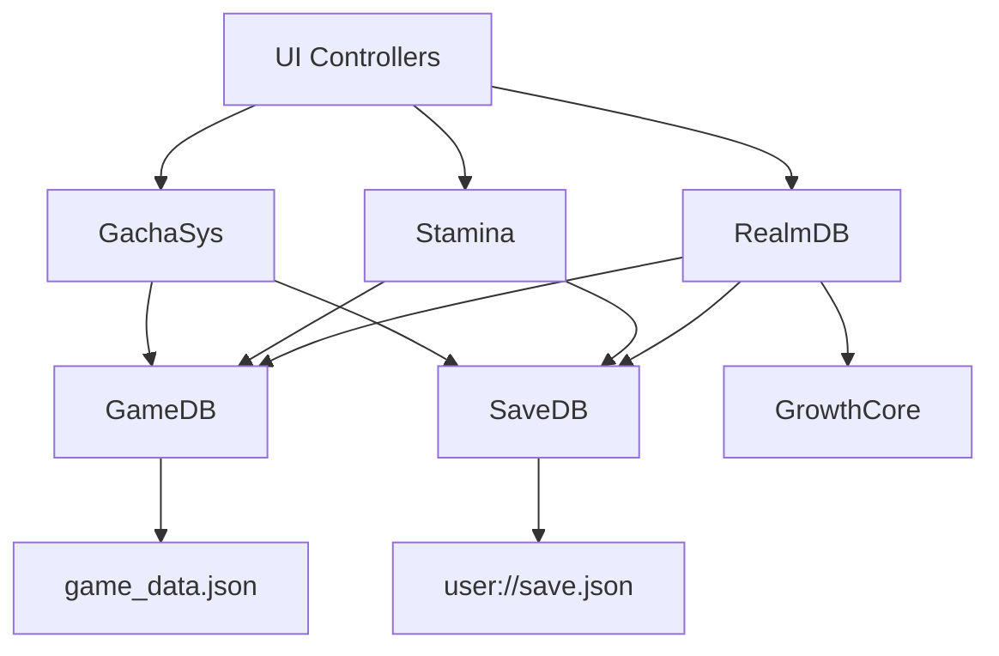
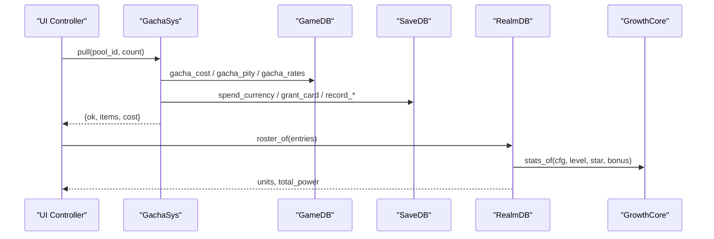
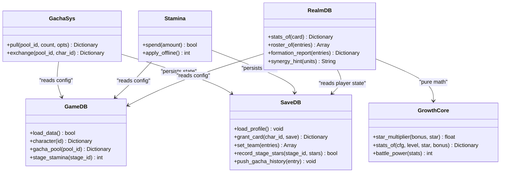

# Data Layer Architecture

<cite>
**Referenced Files in This Document**
- [game_db.gd](file://scripts/game_db.gd)
- [save_db.gd](file://scripts/save_db.gd)
- [realm_db.gd](file://scripts/realm_db.gd)
- [growth_core.gd](file://scripts/growth_core.gd)
- [gacha_sys.gd](file://scripts/gacha_sys.gd)
- [stamina.gd](file://scripts/stamina.gd)
- [game_data.json](file://data/game_data.json)
- [schema.sql](file://data/db/schema.sql)
</cite>

## Table of Contents
1. Introduction
2. Project Structure
3. Core Components
4. Architecture Overview
5. Detailed Component Analysis
6. Dependency Analysis
7. Performance Considerations
8. Troubleshooting Guide
9. Conclusion
10. Appendices

## Introduction
This document explains the data layer architecture of Card Adventure, focusing on a clean three-tier system:
- GameDB: Read-only configuration access to game design data.
- SaveDB: Persistent player data storage and migration.
- RealmDB: Derived runtime calculations for attributes, synergies, and team power.

The design uses service-oriented patterns to expose stable APIs to UI controllers and gameplay systems. It separates concerns so that configuration, persistence, and derived computations are independent, testable, and maintainable.

## Project Structure
At a high level, the data layer is implemented as Godot Node services with clear responsibilities:
- Configuration (GameDB) reads from a JSON file and exposes typed query methods.
- Persistence (SaveDB) manages a single save file with default profiles, migrations, and normalized writes.
- Runtime (RealmDB) computes final stats, synergy effects, and team metrics using GrowthCore formulas.
- Supporting services like GachaSys and Stamina coordinate business logic while delegating data access to the three layers.

**Diagram sources**
- [game_db.gd:17-37](file://scripts/game_db.gd#L17-L37)
- [save_db.gd:146-176](file://scripts/save_db.gd#L146-L176)
- [realm_db.gd:13-70](file://scripts/realm_db.gd#L13-L70)
- [growth_core.gd:17-53](file://scripts/growth_core.gd#L17-L53)
- [gacha_sys.gd:203-317](file://scripts/gacha_sys.gd#L203-L317)
- [stamina.gd:86-146](file://scripts/stamina.gd#L86-L146)

**Section sources**
- [game_db.gd:1-800](file://scripts/game_db.gd#L1-L800)
- [save_db.gd:1-643](file://scripts/save_db.gd#L1-L643)
- [realm_db.gd:1-498](file://scripts/realm_db.gd#L1-L498)
- [growth_core.gd:1-53](file://scripts/growth_core.gd#L1-L53)
- [gacha_sys.gd:196-317](file://scripts/gacha_sys.gd#L196-L317)
- [stamina.gd:52-172](file://scripts/stamina.gd#L52-L172)
- [game_data.json:1-800](file://data/game_data.json#L1-L800)
- [schema.sql:1-327](file://data/db/schema.sql#L1-L327)

## Core Components
- GameDB: Loads and serves read-only configuration from game_data.json. Provides typed helpers for elements, combat, rarities, characters, gacha rules, stamina config, formation rules, stages, monsters, and more.
- SaveDB: Manages a single save profile under user://save.json. Handles defaults, normalization, migrations, wallet, cards, teams, presets, progress, materials, gacha state, and statistics. Emits signals on load/save.
- RealmDB: Computes final stats via GrowthCore, applies synergies, builds roster, reports formation power, and provides hints and counter analysis.
- GrowthCore: Pure functions for attribute scaling by level and star, and unified battle power calculation.
- GachaSys: Orchestrates pulls, costs, pity, history, and exchanges; delegates currency/material changes to SaveDB and rule lookups to GameDB.
- Stamina: Tracks current stamina, offline recovery, and persists updates through SaveDB.

**Section sources**
- [game_db.gd:17-37](file://scripts/game_db.gd#L17-L37)
- [save_db.gd:26-109](file://scripts/save_db.gd#L26-L109)
- [realm_db.gd:13-70](file://scripts/realm_db.gd#L13-L70)
- [growth_core.gd:17-53](file://scripts/growth_core.gd#L17-L53)
- [gacha_sys.gd:203-317](file://scripts/gacha_sys.gd#L203-L317)
- [stamina.gd:86-146](file://scripts/stamina.gd#L86-L146)

## Architecture Overview
The three-tier separation ensures:
- Configuration immutability at runtime (GameDB).
- Single source of truth for player state (SaveDB).
- Deterministic derived values (RealmDB + GrowthCore).

**Diagram sources**
- [gacha_sys.gd:203-317](file://scripts/gacha_sys.gd#L203-L317)
- [game_db.gd:287-547](file://scripts/game_db.gd#L287-L547)
- [save_db.gd:221-277](file://scripts/save_db.gd#L221-L277)
- [realm_db.gd:43-70](file://scripts/realm_db.gd#L43-L70)
- [growth_core.gd:24-53](file://scripts/growth_core.gd#L24-L53)

## Detailed Component Analysis

### GameDB: Read-Only Configuration Service
Responsibilities:
- Load and parse game_data.json once at startup.
- Provide typed queries for elements, combat, rarities, characters, codex, growth, gacha, stamina, economy, adventure stages, monsters, board layout, formation rules.
- Normalize and validate configuration-derived values (e.g., rarity order, rates normalization, slot-to-cell mapping).

Key behaviors:
- Centralized section() helper returns safe dictionaries.
- Combat counters and multipliers use configuration tables.
- Gacha utilities normalize probabilities and compute costs with fallbacks.
- Formation helpers provide team limits, scene paths, and synergy/role configurations.

Typical usage patterns:
- Query element properties and counters.
- Retrieve character or monster entries by id.
- Get gacha pool rules, rates, pity, and cost options.
- Access stage metadata and recommended power.

Adding a new configuration type:
- Add a new top-level section or nested table in game_data.json.
- Expose typed getters/setters in GameDB with safe defaults and validation.
- Update any dependent services (e.g., GachaSys, Stamina) to consume the new API.

Error handling and validation:
- File existence and open errors are logged.
- JSON parsing failures are reported.
- Missing keys return safe defaults rather than crashing.

Performance considerations:
- Single load at startup; subsequent reads are in-memory dictionary lookups.
- Normalization happens during load or when querying specific sections.

**Section sources**
- [game_db.gd:17-37](file://scripts/game_db.gd#L17-L37)
- [game_db.gd:55-102](file://scripts/game_db.gd#L55-L102)
- [game_db.gd:141-195](file://scripts/game_db.gd#L141-L195)
- [game_db.gd:287-547](file://scripts/game_db.gd#L287-L547)
- [game_db.gd:565-707](file://scripts/game_db.gd#L565-L707)
- [game_db.gd:711-797](file://scripts/game_db.gd#L711-L797)
- [game_data.json:19-118](file://data/game_data.json#L19-L118)

### SaveDB: Persistent Player Data Service
Responsibilities:
- Manage a single save profile under user://save.json.
- Provide default profile construction, normalization, and migration.
- Offer typed APIs for wallet, cards, teams, presets, progress, materials, gacha state, and statistics.
- Emit signals on loaded/saved events.

Key behaviors:
- Defaults ensure consistent structure across versions; missing fields are filled without overwriting existing values.
- Cards are normalized to fixed equipment slot arrays; empty slots represent explicit unequip.
- Team entries are validated and normalized to enforce rules (max members, unique hero per slot, valid slot range).
- Gacha state tracks pulls, pity groups, history cap, and exchange counts.

Typical usage patterns:
- Grant or upgrade cards; check balances; spend currencies.
- Set or switch team presets; retrieve normalized team entries.
- Record stage stars and clear counts; add materials or spend them.
- Track gacha pulls and history; query recent heroes.

Adding a new persistent field:
- Extend _default_profile() with the new key and sensible defaults.
- Add typed getters/setters in SaveDB with normalization if needed.
- If migrating old saves, implement a migration step in load_profile().

Error handling and validation:
- File write errors are logged; operations fail safely.
- Input validation for teams prevents illegal states.
- Material spending checks prevent negative balances.

Performance considerations:
- Batched saves where possible (e.g., grant_card with save=false for bulk operations).
- History capped to avoid unbounded growth.
- Minimal disk writes for frequent updates (e.g., stamina persists periodically).

**Section sources**
- [save_db.gd:26-109](file://scripts/save_db.gd#L26-L109)
- [save_db.gd:146-176](file://scripts/save_db.gd#L146-L176)
- [save_db.gd:185-209](file://scripts/save_db.gd#L185-L209)
- [save_db.gd:221-277](file://scripts/save_db.gd#L221-L277)
- [save_db.gd:285-404](file://scripts/save_db.gd#L285-L404)
- [save_db.gd:409-493](file://scripts/save_db.gd#L409-L493)
- [save_db.gd:516-619](file://scripts/save_db.gd#L516-L619)

### RealmDB: Derived Runtime Calculations Service
Responsibilities:
- Compute final stats for cards using GrowthCore.
- Build rosters from team entries, including demo fallbacks for unseen heroes.
- Evaluate synergies declaratively from configuration and apply multiplicative/additive/battle effects.
- Provide formation reports, team power, synergy hints, and counter analysis.

Key behaviors:
- stats_of combines base/growth with star multiplier.
- roster_of constructs unit objects with slot, cell, row, config, stats, and power.
- active_synergies evaluates conditions and normalizes effects; apply_synergies mutates unit stats and adds battle buffs.
- synergy_hint suggests how to activate nearby synergies.

Typical usage patterns:
- Build a roster for preview or battle.
- Calculate team power and synergy contributions.
- Show counter recommendations based on enemy composition.

Adding a new derived metric:
- Implement pure math in GrowthCore if it depends only on cfg/level/star.
- Add a method in RealmDB to combine GrowthCore results with synergies.
- Expose a typed API for UI or gameplay to consume the metric.

Error handling and validation:
- Safe fallbacks for missing cards (demo_level/demo_star).
- Defensive checks for empty configs or invalid inputs.

Performance considerations:
- Synergy evaluation iterates configured rules once per roster build.
- Power recomputation is bounded by team size.

**Section sources**
- [realm_db.gd:13-70](file://scripts/realm_db.gd#L13-L70)
- [realm_db.gd:85-179](file://scripts/realm_db.gd#L85-L179)
- [realm_db.gd:189-254](file://scripts/realm_db.gd#L189-L254)
- [realm_db.gd:281-359](file://scripts/realm_db.gd#L281-L359)
- [realm_db.gd:430-498](file://scripts/realm_db.gd#L430-L498)
- [growth_core.gd:17-53](file://scripts/growth_core.gd#L17-L53)

### GrowthCore: Pure Functions for Attribute Scaling
Responsibilities:
- Compute star multiplier from configuration.
- Derive final stats from base and growth values scaled by level and star.
- Provide unified battle power formula used across UI and battle systems.

Usage:
- Called by RealmDB.stats_of and other systems needing deterministic stat computation.

**Section sources**
- [growth_core.gd:17-53](file://scripts/growth_core.gd#L17-L53)

### GachaSys: Business Logic for Pulls and Exchange
Responsibilities:
- Validate pool and cost, perform draws, apply pity, update history, and persist changes via SaveDB.
- Return structured results with affordability checks and reasons for failure.

Typical usage patterns:
- Pull single or ten times; handle free mode for simulation.
- Exchange wish crystals for UP heroes; track exchange counts.

Error handling:
- Returns ok=false with reason when resources are insufficient or pool unknown.
- Ensures no side effects (no spends, no saves) on failed attempts.

**Section sources**
- [gacha_sys.gd:203-317](file://scripts/gacha_sys.gd#L203-L317)
- [gacha_sys.gd:321-347](file://scripts/gacha_sys.gd#L321-L347)
- [gacha_sys.gd:543-567](file://scripts/gacha_sys.gd#L543-L567)

### Stamina: Offline Recovery and State Management
Responsibilities:
- Track current stamina value and last accounted time.
- Apply offline recovery and persist updates through SaveDB.
- Provide formatted next recovery time and regeneration rate.

Typical usage patterns:
- Spend stamina before entering stages; fill or grant stamina for events.
- On app start, apply offline recovery and emit changes.

Error handling:
- Guard against negative amounts and full stamina edge cases.
- Persist only when necessary to reduce disk writes.

**Section sources**
- [stamina.gd:52-172](file://scripts/stamina.gd#L52-L172)

## Dependency Analysis
The data layer enforces strict dependency direction:
- UI and gameplay call service APIs (GachaSys, Stamina) which delegate to SaveDB and GameDB.
- RealmDB depends on GameDB and SaveDB but never writes to disk.
- GrowthCore is pure and has no dependencies on autoloads or nodes.

**Diagram sources**
- [game_db.gd:17-37](file://scripts/game_db.gd#L17-L37)
- [save_db.gd:146-176](file://scripts/save_db.gd#L146-L176)
- [realm_db.gd:13-70](file://scripts/realm_db.gd#L13-L70)
- [growth_core.gd:17-53](file://scripts/growth_core.gd#L17-L53)
- [gacha_sys.gd:203-317](file://scripts/gacha_sys.gd#L203-L317)
- [stamina.gd:86-146](file://scripts/stamina.gd#L86-L146)

**Section sources**
- [game_db.gd:1-800](file://scripts/game_db.gd#L1-L800)
- [save_db.gd:1-643](file://scripts/save_db.gd#L1-L643)
- [realm_db.gd:1-498](file://scripts/realm_db.gd#L1-L498)
- [growth_core.gd:1-53](file://scripts/growth_core.gd#L1-L53)
- [gacha_sys.gd:196-317](file://scripts/gacha_sys.gd#L196-L317)
- [stamina.gd:52-172](file://scripts/stamina.gd#L52-L172)

## Performance Considerations
- Configuration loading occurs once; all reads are in-memory.
- SaveDB batches writes where possible (e.g., granting multiple cards with save=false then saving once).
- Stamina persists periodically to reduce disk I/O.
- RealmDB computes synergies per roster build; keep roster sizes small and reuse results.
- GrowthCore is pure and fast; avoid redundant recalculations in hot paths.

[No sources needed since this section provides general guidance]

## Troubleshooting Guide
Common issues and remedies:
- Configuration not found or unreadable: Check file path and permissions; GameDB logs errors and returns false.
- Save file write failure: Verify user directory access; SaveDB logs error codes and aborts safely.
- Invalid team entries: Use SaveDB.normalize_team and SaveDB.team_errors to diagnose slot ranges, duplicates, and unknown heroes.
- Insufficient resources for pulls: GachaSys returns detailed reasons; check SaveDB balances and material counts.
- Stamina inconsistencies: Ensure apply_offline runs on startup; verify seconds_per_point and maximum values from GameDB.

**Section sources**
- [game_db.gd:17-37](file://scripts/game_db.gd#L17-L37)
- [save_db.gd:168-176](file://scripts/save_db.gd#L168-L176)
- [save_db.gd:294-344](file://scripts/save_db.gd#L294-L344)
- [gacha_sys.gd:543-567](file://scripts/gacha_sys.gd#L543-L567)
- [stamina.gd:120-146](file://scripts/stamina.gd#L120-L146)

## Conclusion
Card Adventure’s data layer cleanly separates configuration, persistence, and derived calculations. GameDB provides immutable, typed access to design data; SaveDB centralizes player state with robust defaults and migrations; RealmDB delivers deterministic, synergy-aware computations backed by GrowthCore. Services like GachaSys and Stamina orchestrate workflows while relying on these layers for data access and validation. This design enables scalable feature additions, reliable testing, and predictable behavior across UI and gameplay systems.

[No sources needed since this section summarizes without analyzing specific files]

## Appendices

### Typical Usage Patterns

- Querying game data:
  - Retrieve character info and element details via GameDB.character and GameDB.element.
  - Get gacha pool rules, rates, and costs via GameDB.gacha_pool, gacha_rates, and gacha_cost.
  - Access stage metadata and stamina requirements via GameDB.chapter_stage and GameDB.stage_stamina.

- Saving player progress:
  - Grant or upgrade cards via SaveDB.grant_card; batch with save=false for efficiency.
  - Set or switch team presets via SaveDB.set_team and SaveDB.switch_preset.
  - Record stage stars and clear counts via SaveDB.record_stage_stars and SaveDB.stage_clear_count.

- Calculating derived attributes:
  - Build a roster and compute stats via RealmDB.roster_of and RealmDB.stats_of.
  - Evaluate synergies and get formation report via RealmDB.active_synergies and RealmDB.formation_report.
  - Use GrowthCore.star_multiplier and GrowthCore.battle_power for pure math.

**Section sources**
- [game_db.gd:181-195](file://scripts/game_db.gd#L181-L195)
- [game_db.gd:287-547](file://scripts/game_db.gd#L287-L547)
- [game_db.gd:652-707](file://scripts/game_db.gd#L652-L707)
- [save_db.gd:221-277](file://scripts/save_db.gd#L221-L277)
- [save_db.gd:285-404](file://scripts/save_db.gd#L285-L404)
- [realm_db.gd:43-70](file://scripts/realm_db.gd#L43-L70)
- [realm_db.gd:189-254](file://scripts/realm_db.gd#L189-L254)
- [growth_core.gd:17-53](file://scripts/growth_core.gd#L17-L53)

### Adding New Data Types Across Layers

- To add a new configuration type:
  - Define the schema in game_data.json under an appropriate section.
  - Add typed getters in GameDB with safe defaults and validation.
  - Update dependent services to consume the new API.

- To add a new persistent field:
  - Extend SaveDB._default_profile with the new key and defaults.
  - Add typed getters/setters in SaveDB; normalize on load if needed.
  - Implement migration logic in SaveDB.load_profile if required.

- To add a new derived metric:
  - Implement pure math in GrowthCore if applicable.
  - Add a method in RealmDB to combine GrowthCore outputs with synergies.
  - Expose a typed API for UI or gameplay consumption.

**Section sources**
- [game_data.json:19-118](file://data/game_data.json#L19-L118)
- [game_db.gd:287-547](file://scripts/game_db.gd#L287-L547)
- [save_db.gd:26-109](file://scripts/save_db.gd#L26-L109)
- [realm_db.gd:13-70](file://scripts/realm_db.gd#L13-L70)
- [growth_core.gd:17-53](file://scripts/growth_core.gd#L17-L53)

### Data Schema Reference (SQLite)
The repository includes a SQLite schema describing static configuration and player data structures. While the runtime currently uses JSON-based configuration and save files, the schema documents intended database tables for future integration or server-side persistence.

- Configuration DB sections include heroes, skills, items, chapters, stages, monster groups, drop groups, and gacha pools.
- Player DB sections include player info, hero instances, formations, inventory, stage progress, and gacha state.

**Section sources**
- [schema.sql:42-165](file://data/db/schema.sql#L42-L165)
- [schema.sql:167-327](file://data/db/schema.sql#L167-L327)