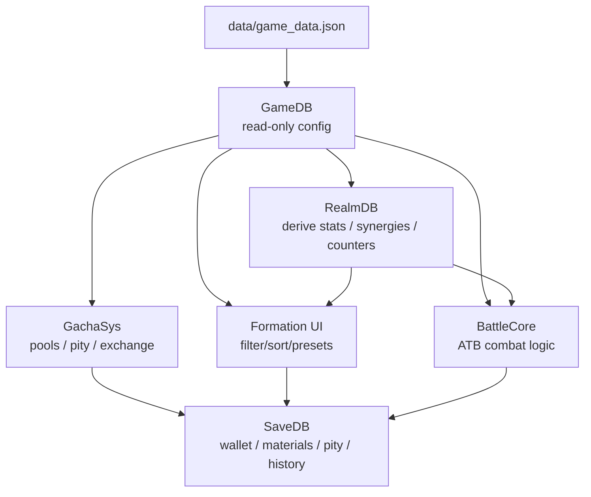
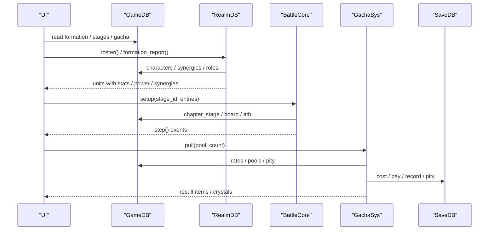
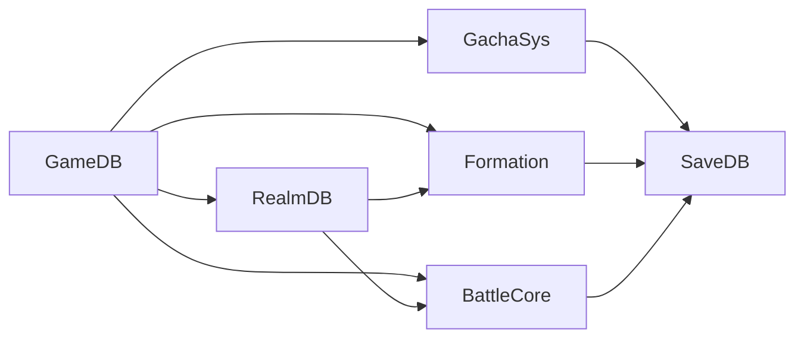

# Extension Points & Plugin Mechanisms

<cite>
**Referenced Files in This Document**
- [README.md](file://README.md)
- [game_data.json](file://data/game_data.json)
- [game_db.gd](file://scripts/game_db.gd)
- [realm_db.gd](file://scripts/realm_db.gd)
- [growth_core.gd](file://scripts/growth_core.gd)
- [battle_core.gd](file://scripts/battle_core.gd)
- [gacha_sys.gd](file://scripts/gacha_sys.gd)
- [formation.gd](file://scripts/formation.gd)
- [save_db.gd](file://scripts/save_db.gd)
- [apply_formation.py](file://tools/_inspect/apply_formation.py)
</cite>

## Table of Contents
1. [Introduction](#introduction)
2. [Project Structure](#project-structure)
3. [Core Components](#core-components)
4. [Architecture Overview](#architecture-overview)
5. [Detailed Component Analysis](#detailed-component-analysis)
6. [Dependency Analysis](#dependency-analysis)
7. [Performance Considerations](#performance-considerations)
8. [Troubleshooting Guide](#troubleshooting-guide)
9. [Conclusion](#conclusion)
10. [Appendices](#appendices)

## Introduction
This document explains how to extend Card Adventure with new content and features without modifying core code. The project is designed around a data-driven architecture: configuration lives in a single JSON file, and the engine reads it through a read-only configuration layer. New characters, stages, enemies, battle mechanics, gacha pools, and team synergy bonuses can be added by editing configuration and assets only.

Key extension principles:
- Data-first: all gameplay rules are defined in `data/game_data.json`.
- Read-only config layer: `GameDB` exposes typed queries over the JSON; systems consume it but never write to it.
- Pure logic layers: `BattleCore`, `GrowthCore`, and `GachaSys` implement deterministic, testable logic that interprets configuration.
- Runtime derivation: `RealmDB` computes final stats, synergies, and counters from configuration and save data.
- Save isolation: `SaveDB` is the single source of truth for player state; no other module writes files directly.

**Section sources**
- [README.md:62-96](file://README.md#L62-L96)
- [game_db.gd:1-37](file://scripts/game_db.gd#L1-L37)

## Project Structure
The extension surface centers on `data/game_data.json`, which contains sections for economy, elements, combat, roles, rarities, characters, growth, gacha, stamina, adventure (stages), modes, menu, monsters, and formation (synergies, presets, UI text). Scripts under `scripts/` provide layered accessors and runtime computation. Tools under `tools/` generate scenes and validate data.

**Diagram sources**
- [game_db.gd:1-37](file://scripts/game_db.gd#L1-L37)
- [realm_db.gd:1-18](file://scripts/realm_db.gd#L1-L18)
- [battle_core.gd:1-14](file://scripts/battle_core.gd#L1-L14)
- [gacha_sys.gd:1-16](file://scripts/gacha_sys.gd#L1-L16)
- [formation.gd:1-12](file://scripts/formation.gd#L1-L12)
- [save_db.gd:1-10](file://scripts/save_db.gd#L1-L10)

**Section sources**
- [README.md:62-96](file://README.md#L62-L96)
- [game_data.json:1-58](file://data/game_data.json#L1-L58)

## Core Components
- GameDB: Loads `game_data.json` once and provides typed getters for every section. It is the single entry point for configuration.
- RealmDB: Computes final unit stats, team power, synergy activation, and counter hints. It applies synergy effects per unit and attaches “battle-level” synergy buffs (open energy/shield/elem dmg) for the combat system.
- BattleCore: Implements the 3x3 ATB combat loop. It builds units from configuration, resolves targets, executes skills/ultimates, calculates damage, and determines win/loss.
- GachaSys: Handles pool selection, rarity rolls, UP distribution, pity progression, costs, wish crystals, and exchange shop. All probability decisions are pure functions driven by configuration.
- GrowthCore: Pure functions for stat scaling by level/star and unified power calculation used across UI and combat.
- SaveDB: Single persistence layer for wallet, materials, team presets, progress, gacha state, and settings.

**Section sources**
- [game_db.gd:17-37](file://scripts/game_db.gd#L17-L37)
- [realm_db.gd:13-35](file://scripts/realm_db.gd#L13-L35)
- [battle_core.gd:44-66](file://scripts/battle_core.gd#L44-L66)
- [gacha_sys.gd:203-317](file://scripts/gacha_sys.gd#L203-L317)
- [growth_core.gd:26-53](file://scripts/growth_core.gd#L26-L53)
- [save_db.gd:26-83](file://scripts/save_db.gd#L26-L83)

## Architecture Overview
The system separates concerns into layers:
- Configuration Layer (GameDB): read-only JSON accessors.
- Derivation Layer (RealmDB): combines configuration + save state to compute final attributes, synergies, and counters.
- Logic Layers (BattleCore, GachaSys, GrowthCore): deterministic algorithms that interpret configuration.
- Persistence Layer (SaveDB): centralizes all disk writes.
- UI Layer (Formation, menus): binds configuration and save state to visuals.

**Diagram sources**
- [game_db.gd:287-539](file://scripts/game_db.gd#L287-L539)
- [realm_db.gd:33-70](file://scripts/realm_db.gd#L33-L70)
- [battle_core.gd:44-66](file://scripts/battle_core.gd#L44-L66)
- [gacha_sys.gd:203-317](file://scripts/gacha_sys.gd#L203-L317)
- [save_db.gd:146-176](file://scripts/save_db.gd#L146-L176)

## Detailed Component Analysis

### Adding New Characters via JSON
To add a new character without code changes:
- Add an entry under `characters[]` in `game_data.json` with:
  - Identity: `id`, `name`, `title`, `rarity`, `element`, `role`, `portrait`, `prefer_slot`
  - Stats: `base` and `growth` fields for hp/atk/def/mres/crit/crit_dmg/hit/spd
  - Skill: `skill.name`, `skill.type`, `skill.cost`, `skill.target`, `skill.desc`, `skill.effect`
  - Optional codex display fields for lore and descriptions
- Ensure the referenced `portrait` path exists under `assets/art/characters/`.
- The character will automatically appear in:
  - Gacha pools if included in pool entries or auto-collected by rarity
  - Formation screen filtering/sorting/searching
  - Combat when deployed
  - Synergy rules referencing its id/element/rarity/role

Validation and integration points:
- `GameDB.character(id)` returns the config; missing entries return empty dict.
- `RealmDB.stats_of()` computes final stats using `GrowthCore.stats_of(cfg, level, star, bonus_table)`.
- `BattleCore._build_players()` maps config to unit fields and assigns default role actions.
- `GachaSys._make_item()` uses `GameDB.character(id)` to build card preview and stats.

Best practices:
- Keep `prefer_slot` aligned with role’s recommended rows.
- Use existing `rarities` order and frame paths.
- Keep skill effect keys consistent with supported kinds (attack/heal/shield/buff_atk).

**Section sources**
- [game_data.json:456-800](file://data/game_data.json#L456-L800)
- [game_db.gd:181-190](file://scripts/game_db.gd#L181-L190)
- [realm_db.gd:13-18](file://scripts/realm_db.gd#L13-L18)
- [growth_core.gd:26-39](file://scripts/growth_core.gd#L26-L39)
- [battle_core.gd:108-149](file://scripts/battle_core.gd#L108-L149)
- [gacha_sys.gd:457-491](file://scripts/gacha_sys.gd#L457-L491)

### Creating New Stages and Enemies
Stages are defined under `adventure.chapter_stages.list`. Each stage includes:
- `id`, `name`, `kind` (battle/elite/event/rest), `recommend_power`, `stamina`
- `enemies`: array of enemy definitions with `mob`, optional `slot`, `lv`
- Optional `env` for environmental multipliers (e.g., element stat boost)

Enemies are defined under `monsters.table`. Each monster has:
- `base` stats, `action` (default behavior), `skill` (periodic ability), `traits` (passives like granite armor)

Process:
- Add a new stage entry with enemy references.
- Add or reuse monster entries with desired action/skill/traits.
- Optionally define environment effects in `stage.env`.
- Re-run map/stage tools if you modify node positions or recommendations.

Integration:
- `BattleCore.setup()` loads stage via `GameDB.chapter_stage(stage_id)` and builds enemies scaled by `power_scale`.
- `_apply_env()` applies environmental stat multipliers to matching elements.
- `_apply_open_traits()` applies traits like initial shields.

**Section sources**
- [game_db.gd:653-707](file://scripts/game_db.gd#L653-L707)
- [game_db.gd:711-729](file://scripts/game_db.gd#L711-L729)
- [battle_core.gd:152-188](file://scripts/battle_core.gd#L152-L188)
- [battle_core.gd:207-239](file://scripts/battle_core.gd#L207-L239)

### Extending Battle Mechanics
Battle mechanics are mostly declarative:
- Role defaults: `roles` define preferred rows and default actions (tank/warrior/mage/archer/assassin/healer/support).
- Skills: each character/monster defines `skill` with target semantics (`nearest_front`, `middle_row`, `enemy_back_lowest_hp`, etc.).
- Traits: passive behaviors like `granite_armor` granting initial shield or physical reduction.
- Environment: stage-level modifiers that multiply specific stats for matching elements.

To add a new mechanic:
- For new role behaviors, add a role entry under `roles` with `prefer_rows` and description.
- For new skill types, ensure effect kinds are handled in `BattleCore._execute()` (attack/heal/shield/buff_atk).
- For new traits, add trait ids and handling in `_apply_open_traits()` or damage application where appropriate.
- For environment effects, add `env` entries to stages.

Determinism and testing:
- ATB uses fixed gauge_max and speed-based scheduling; same seed yields identical logs.
- Smoke tests assert combat determinism and formula correctness.

**Section sources**
- [game_db.gd:303-368](file://scripts/game_db.gd#L303-L368)
- [battle_core.gd:269-284](file://scripts/battle_core.gd#L269-L284)
- [battle_core.gd:477-571](file://scripts/battle_core.gd#L477-L571)
- [battle_core.gd:672-761](file://scripts/battle_core.gd#L672-L761)

### Synergy System: Declarative Team Bonuses
Synergies are defined under `formation.synergies`. Each rule has:
- `cond`: condition type such as `member_count`, `role_count`, `element_count`, `distinct_elements`, `rarity_count`, `row_count`, `char_ids`
- `effects` (or legacy `effect`): list of effects with mode `mul` (stat multiplier), `add` (flat rate like crit), or `battle` (open_energy/open_shield/elem_dmg)
- Optional `target` to restrict effects to specific rows (e.g., `row:front`)

How it works:
- `RealmDB.active_synergies()` evaluates conditions against current team units.
- `apply_synergies()` normalizes effects, applies per-unit multipliers/additions, recomputes power, and attaches battle-level buffs.
- BattleCore reads `synergy_buffs` at setup to apply open energy/shield and element damage bonuses.

Extensibility:
- Add new synergy rules purely in JSON.
- Extend condition types in `synergy_matches()` if needed.
- Extend effect modes in `_normalize_effect()` and `apply_synergies()` for new stat types.

Compatibility:
- Legacy single `effect` field remains supported alongside `effects` arrays.
- Effects targeting specific rows do not leak to other rows.

**Section sources**
- [game_db.gd:787-798](file://scripts/game_db.gd#L787-L798)
- [realm_db.gd:85-178](file://scripts/realm_db.gd#L85-L178)
- [realm_db.gd:181-253](file://scripts/realm_db.gd#L181-L253)
- [battle_core.gd:242-267](file://scripts/battle_core.gd#L242-L267)

### Extending the Gacha System: Pools and Mechanics
Gacha configuration lives under `gacha.pools`. Each pool defines:
- `id`, `rates` (probability per rarity), `pool` (content per rarity), `up` (UP heroes per rarity), `up_rate`
- `cost.single` / `cost.ten` (ticket and gem options), `pity_group`, `pity.small/large`, `ten_guarantee.rarity`
- `crystal.per_pull`, `exchange_cost`, `shop`, `new_player_gift`, `reveal` hooks

Adding a new pool:
- Create a new pool entry with rates, pool contents, UP list, and cost options.
- Configure pity group and ten-guarantee rarity.
- If adding a new currency, define it under `economy.currencies`.

Mechanics:
- `pick_rarity()` selects rarity based on normalized rates and minimum rarity for pity.
- `choose_entry()` splits UP vs rest by `up_rate`, then picks weighted content.
- `pull()` orchestrates payment, item grants, pity updates, crystal accumulation, and history logging.
- `exchange()` allows spending wish crystals to redeem UP heroes.

Free mode:
- `pull(..., opts.free=true)` simulates draws without writing to save, useful for distribution checks.

**Section sources**
- [game_db.gd:287-539](file://scripts/game_db.gd#L287-L539)
- [gacha_sys.gd:34-193](file://scripts/gacha_sys.gd#L34-L193)
- [gacha_sys.gd:203-317](file://scripts/gacha_sys.gd#L203-L317)
- [gacha_sys.gd:366-430](file://scripts/gacha_sys.gd#L366-L430)
- [gacha_sys.gd:435-563](file://scripts/gacha_sys.gd#L435-L563)

### Data Validation Requirements and Schema Constraints
Configuration validation is enforced by:
- Type-safe accessors in `GameDB` returning empty dicts/arrays when fields are missing.
- Defaults applied in `SaveDB._fill_defaults()` for save structure.
- Tooling scripts that overwrite entire sections (e.g., `apply_formation.py`) to keep consistency.
- Smoke tests asserting schema integrity (e.g., synergy counts, role chains, formation scene paths).

Constraints to observe:
- Rarity must match `rarities.order`; unknown rarities fall back to lowest rank.
- Pool entries must reference valid character ids or item ids.
- Synergy conditions must use supported types; unsupported types evaluate to false.
- Equipment slots must be filled to `slot_count` with empty strings for empty slots.

Common pitfalls:
- Missing `portrait` paths cause placeholder rendering.
- Invalid stage ids or monster ids produce warnings and skipped units.
- Mismatched JSON types (float vs int) can cause lookup issues; code normalizes where possible.

**Section sources**
- [game_db.gd:17-37](file://scripts/game_db.gd#L17-L37)
- [save_db.gd:102-109](file://scripts/save_db.gd#L102-L109)
- [apply_formation.py:220-232](file://tools/_inspect/apply_formation.py#L220-L232)
- [battle_core.gd:152-161](file://scripts/battle_core.gd#L152-L161)

### Community Content Examples and Best Practices
Examples present in the repository:
- Multiple characters with distinct roles, elements, rarities, and skills.
- Monster roster with varied actions, skills, and traits.
- Stage list covering ordinary, elite, event, and boss nodes.
- Synergy rules combining roles, elements, rarities, and row counts.
- Gacha pools with different currencies, tickets, pity groups, and exchange shops.

Best practices:
- Keep balance within existing formulas; adjust base/growth carefully and re-run recommendation tools.
- Use existing icons/colors for elements and rarities to maintain visual consistency.
- Prefer declarative rules (synergies, roles, actions) over hardcoding behaviors.
- Validate changes with smoke tests before committing.

**Section sources**
- [game_data.json:456-800](file://data/game_data.json#L456-L800)
- [game_data.json:119-302](file://data/game_data.json#L119-L302)
- [game_data.json:303-368](file://data/game_data.json#L303-L368)
- [game_data.json:370-455](file://data/game_data.json#L370-L455)

## Dependency Analysis

Coupling and cohesion:
- GameDB is highly cohesive (single responsibility: config access) and loosely coupled via typed getters.
- RealmDB depends on GameDB and SaveDB; encapsulates derivation logic.
- BattleCore and GachaSys depend on GameDB and SaveDB; remain free of UI concerns.
- Formation UI depends on GameDB, RealmDB, and SaveDB; delegates rules to configuration.

Potential circular dependencies:
- None observed; layers are strictly one-directional (UI → Derivation/Logic → Config/Persistence).

External integrations:
- File I/O only through GameDB (config) and SaveDB (save).
- Godot resources (textures, fonts) referenced by configuration paths.

**Diagram sources**
- [game_db.gd:1-37](file://scripts/game_db.gd#L1-L37)
- [realm_db.gd:1-18](file://scripts/realm_db.gd#L1-L18)
- [battle_core.gd:1-14](file://scripts/battle_core.gd#L1-L14)
- [gacha_sys.gd:1-16](file://scripts/gacha_sys.gd#L1-L16)
- [formation.gd:1-12](file://scripts/formation.gd#L1-L12)
- [save_db.gd:1-10](file://scripts/save_db.gd#L1-L10)

**Section sources**
- [game_db.gd:1-37](file://scripts/game_db.gd#L1-L37)
- [realm_db.gd:1-18](file://scripts/realm_db.gd#L1-L18)
- [battle_core.gd:1-14](file://scripts/battle_core.gd#L1-L14)
- [gacha_sys.gd:1-16](file://scripts/gacha_sys.gd#L1-L16)
- [formation.gd:1-12](file://scripts/formation.gd#L1-L12)
- [save_db.gd:1-10](file://scripts/save_db.gd#L1-L10)

## Performance Considerations
- Deterministic ATB scheduling avoids delta accumulation; performance scales linearly with unit count.
- Synergy evaluation iterates rules and units; keep synergy lists concise and avoid overly complex conditions.
- Gacha probability functions are pure and fast; distribution checks run offline in free mode.
- Avoid excessive dynamic node creation in UI; prefer configuration-driven layouts generated by build scripts.

[No sources needed since this section provides general guidance]

## Troubleshooting Guide
Common extension issues and debugging techniques:
- Character not appearing in gacha:
  - Verify pool entries include the character id or rely on auto-collection by rarity.
  - Check `GameDB.gacha_pool_entries(pool_id, rarity)` returns expected list.
- Synergy not activating:
  - Confirm condition type and values match team composition.
  - Use `RealmDB.active_synergies()` to inspect active rules.
- Enemy not spawning:
  - Ensure stage `enemies` reference valid `mob` ids.
  - Check `GameDB.monster(mob_id)` returns non-empty config.
- Damage formula mismatch:
  - Validate element counters and traits; review `compute_damage()` and `_phys_reduction()`.
- Save corruption:
  - Reset profile via `SaveDB.reset_profile()` and re-run smoke tests.
  - Inspect `user://save.json` after operations.

Useful tools:
- Smoke tests for data integrity and combat determinism.
- Diagnostic scripts for gacha distribution and scene previews.
- Apply scripts to regenerate formation sections safely.

**Section sources**
- [gacha_sys.gd:366-430](file://scripts/gacha_sys.gd#L366-L430)
- [realm_db.gd:161-178](file://scripts/realm_db.gd#L161-L178)
- [battle_core.gd:672-761](file://scripts/battle_core.gd#L672-L761)
- [save_db.gd:179-182](file://scripts/save_db.gd#L179-L182)
- [apply_formation.py:220-232](file://tools/_inspect/apply_formation.py#L220-L232)

## Conclusion
Card Adventure’s extension model is robust and data-centric. By editing `game_data.json` and adding assets, you can introduce new characters, stages, enemies, battle mechanics, gacha pools, and synergy rules without touching core code. The layered architecture ensures clarity, testability, and compatibility. Always validate changes with smoke tests and diagnostic tools to maintain stability.

[No sources needed since this section summarizes without analyzing specific files]

## Appendices

### Step-by-Step: Add a New Character
1. Add character entry under `characters[]` with identity, stats, skill, and portrait path.
2. Ensure rarity and element exist in their respective tables.
3. Run smoke tests to verify integration.
4. Test in formation and battle to confirm behavior.

**Section sources**
- [game_data.json:456-800](file://data/game_data.json#L456-L800)
- [game_db.gd:181-190](file://scripts/game_db.gd#L181-L190)
- [realm_db.gd:13-18](file://scripts/realm_db.gd#L13-L18)

### Step-by-Step: Add a New Stage and Enemy
1. Define monster entry under `monsters.table` with base/action/skill/traits.
2. Add stage entry under `adventure.chapter_stages.list` referencing the monster.
3. Optionally set `env` for environmental effects.
4. Re-run map/stage tools if adjusting node positions or recommendations.
5. Test in battle to validate scaling and behavior.

**Section sources**
- [game_db.gd:653-707](file://scripts/game_db.gd#L653-L707)
- [game_db.gd:711-729](file://scripts/game_db.gd#L711-L729)
- [battle_core.gd:152-188](file://scripts/battle_core.gd#L152-L188)

### Step-by-Step: Add a New Gacha Pool
1. Add pool entry under `gacha.pools` with rates, pool contents, up list, and cost options.
2. Configure pity group and ten-guarantee rarity.
3. If using a new currency, define it under `economy.currencies`.
4. Test with free mode to check distribution and pity behavior.
5. Validate exchange shop availability for UP heroes.

**Section sources**
- [game_db.gd:287-539](file://scripts/game_db.gd#L287-L539)
- [gacha_sys.gd:203-317](file://scripts/gacha_sys.gd#L203-L317)
- [gacha_sys.gd:366-430](file://scripts/gacha_sys.gd#L366-L430)

### Step-by-Step: Add a New Synergy Rule
1. Add rule under `formation.synergies` with condition and effects.
2. Choose condition type (member_count, role_count, element_count, distinct_elements, rarity_count, row_count, char_ids).
3. Define effects with mode mul/add/battle and target restrictions if needed.
4. Test in formation to verify activation and stat updates.
5. Confirm battle-level effects apply at combat start.

**Section sources**
- [game_db.gd:787-798](file://scripts/game_db.gd#L787-L798)
- [realm_db.gd:85-178](file://scripts/realm_db.gd#L85-L178)
- [realm_db.gd:181-253](file://scripts/realm_db.gd#L181-L253)
- [battle_core.gd:242-267](file://scripts/battle_core.gd#L242-L267)