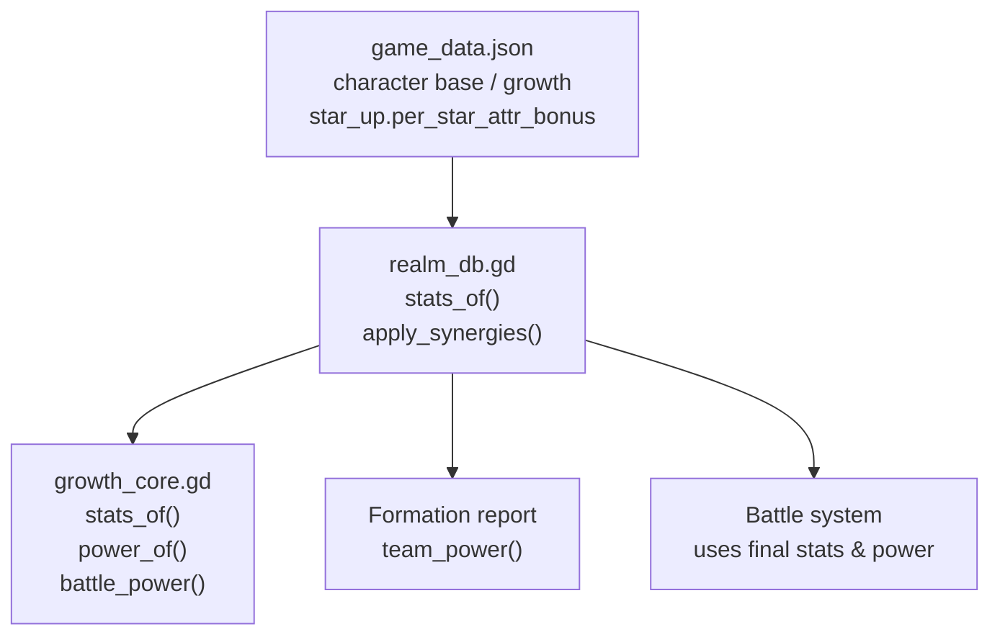
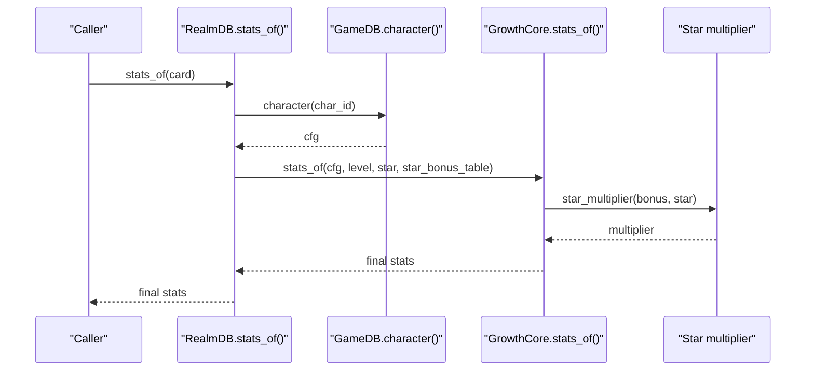
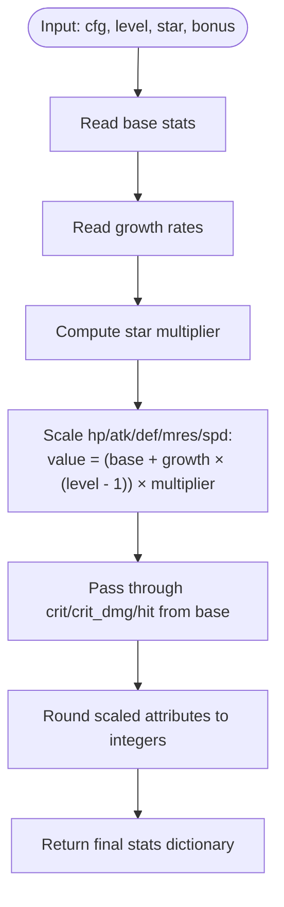
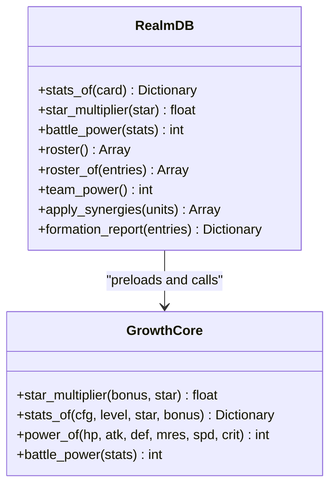
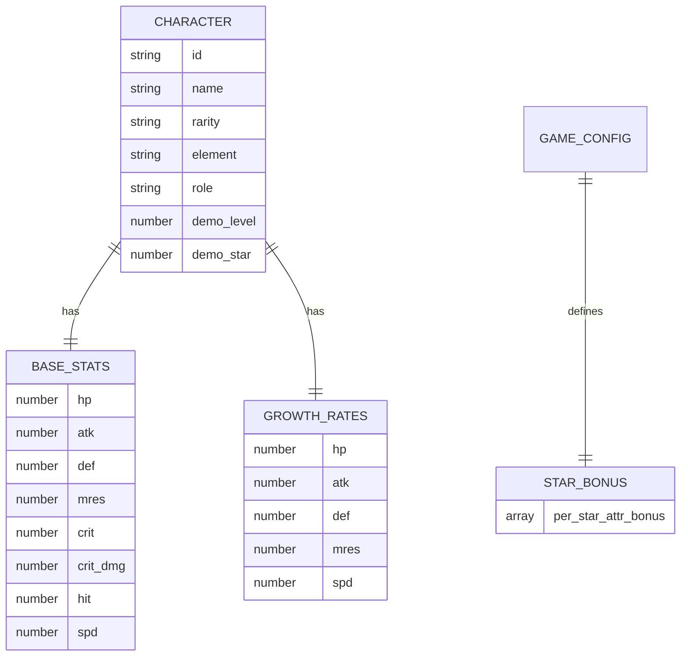
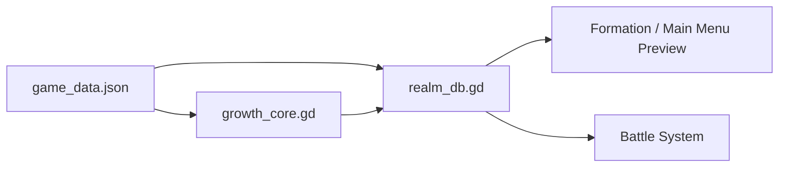

# Growth Calculation System

<cite>
**Referenced Files in This Document**   
- [growth_core.gd](file://scripts/growth_core.gd)
- [realm_db.gd](file://scripts/realm_db.gd)
- [game_data.json](file://data/game_data.json)
- [battle_suite.gd](file://tools/suites/battle_suite.gd)
</cite>

## Table of Contents
1. [Introduction](#introduction)
2. [Project Structure](#project-structure)
3. [Core Components](#core-components)
4. [Architecture Overview](#architecture-overview)
5. [Detailed Component Analysis](#detailed-component-analysis)
6. [Dependency Analysis](#dependency-analysis)
7. [Performance Considerations](#performance-considerations)
8. [Troubleshooting Guide](#troubleshooting-guide)
9. [Conclusion](#conclusion)
10. [Appendices](#appendices)

## Introduction
This document explains the growth calculation system that turns character configuration data into deterministic final attributes and team power values. It covers how base stats from `game_data.json` are combined with per-level growth rates, star multipliers, and synergy bonuses to produce the stats used by UI previews, formation reports, and battle logic. The design intentionally centralizes the pure math in a single script so that preview numbers and battle numbers cannot drift apart.

The core formula is:
- Final attribute = (base value + growth rate × (level − 1)) × star multiplier
- Some ratio fields such as critical hit chance are not scaled by level or star; they are passed through directly.
- Team power is a weighted sum of final attributes, including speed and critical hit chance.

## Project Structure
The growth calculation system spans three main layers:
- Data layer: `game_data.json` contains character definitions, growth configuration, and rarity/star bonus tables.
- Pure function layer: `growth_core.gd` implements deterministic formulas for stats and power.
- Runtime composition layer: `realm_db.gd` loads configuration, applies star bonuses and synergy effects, and exposes roster/power APIs used by UI and battle systems.

**Diagram sources**
- [game_data.json:456-1051](file://data/game_data.json#L456-L1051)
- [game_data.json:1053-1095](file://data/game_data.json#L1053-L1095)
- [growth_core.gd:1-52](file://scripts/growth_core.gd#L1-L52)
- [realm_db.gd:13-30](file://scripts/realm_db.gd#L13-L30)
- [realm_db.gd:33-77](file://scripts/realm_db.gd#L33-L77)

**Section sources**
- [game_data.json:456-1051](file://data/game_data.json#L456-L1051)
- [game_data.json:1053-1095](file://data/game_data.json#L1053-L1095)
- [growth_core.gd:1-52](file://scripts/growth_core.gd#L1-L52)
- [realm_db.gd:1-30](file://scripts/realm_db.gd#L1-L30)

## Core Components
The growth system has two primary responsibilities:
1. Compute final character attributes from configuration, level, and star rating.
2. Compute unified team power using a fixed weighting formula.

Key behaviors:
- Base stats and growth rates come from each character entry in `game_data.json`.
- Star ratings apply a percentage bonus array indexed by star minus one.
- Level progression uses linear growth: each level adds one more growth increment.
- Ratio fields like critical hit chance are not multiplied by star or level growth.
- Synergy bonuses can multiply main attributes and add to critical hit chance.
- Power combines HP, attack, defense, magic resistance, speed, and critical hit chance into a single integer score.

**Section sources**
- [growth_core.gd:11-14](file://scripts/growth_core.gd#L11-L14)
- [growth_core.gd:17-39](file://scripts/growth_core.gd#L17-L39)
- [growth_core.gd:42-52](file://scripts/growth_core.gd#L42-L52)
- [game_data.json:456-1051](file://data/game_data.json#L456-L1051)
- [game_data.json:1053-1095](file://data/game_data.json#L1053-L1095)

## Architecture Overview
The architecture separates concerns clearly:
- `game_data.json` is read-only configuration.
- `growth_core.gd` is stateless and does not access autoloads, disk, or scene nodes.
- `realm_db.gd` is the runtime adapter: it reads configuration, converts save data into cards, computes stats, applies synergies, and returns units with final stats and power.

**Diagram sources**
- [realm_db.gd:13-18](file://scripts/realm_db.gd#L13-L18)
- [growth_core.gd:17-39](file://scripts/growth_core.gd#L17-L39)

## Detailed Component Analysis

### GrowthCore: Pure Function Layer
`GrowthCore` is the only place where growth math lives. It defines:
- Attribute keys for scaling: HP, ATK, DEF, MRES, SPD.
- Rate keys for ratios: crit, crit_dmg, hit.
- Star multiplier lookup with safe clamping.
- Stats computation combining base, growth, level, and star multiplier.
- Unified power formula.

**Diagram sources**
- [growth_core.gd:17-39](file://scripts/growth_core.gd#L17-L39)

#### Star Multiplier
The star multiplier converts a star rating into a multiplicative factor:
- If no star bonus table exists, the multiplier is 1.0.
- Otherwise, the bonus array is indexed by star minus one.
- Out-of-range stars are clamped to the nearest valid index.

This means:
- Star 1 uses index 0.
- Star 2 uses index 1.
- Higher stars use later entries.
- Missing entries do not crash; they clamp to the last available bonus.

**Section sources**
- [growth_core.gd:17-21](file://scripts/growth_core.gd#L17-L21)
- [game_data.json:1064-1074](file://data/game_data.json#L1064-L1074)

#### Stats Computation
For each scaled attribute:
- Value = base + growth × (level − 1).
- Result = round(value × star multiplier).
- Output is an integer.

For ratio fields:
- crit, crit_dmg, and hit are taken directly from base.
- They are not multiplied by star or level growth.

Edge cases handled:
- Missing base or growth fields default to zero.
- Level 1 produces no growth contribution because level − 1 equals zero.
- Star multiplier defaults to 1.0 when no bonus array is present.

**Section sources**
- [growth_core.gd:24-39](file://scripts/growth_core.gd#L24-L39)

#### Power Formula
Team power is computed as:
- Power = round(HP × 0.12 + ATK × 2.4 + DEF × 1.6 + MRES × 1.1 + SPD × 2.0 + CRIT × 600.0)

This formula is used consistently for:
- Recommended stage power comparisons.
- Formation total power.
- In-battle ally power calculations.

**Section sources**
- [growth_core.gd:42-52](file://scripts/growth_core.gd#L42-L52)

### RealmDB: Runtime Composition Layer
`RealmDB` wraps `GrowthCore` and adds runtime context:
- Converts a saved card into final stats.
- Reads star bonus tables from game configuration.
- Builds roster entries with slot, row, cell, config, stats, and power.
- Applies synergy bonuses after computing base stats.
- Computes team power as the sum of individual unit powers.

**Diagram sources**
- [growth_core.gd:1-52](file://scripts/growth_core.gd#L1-L52)
- [realm_db.gd:1-30](file://scripts/realm_db.gd#L1-L30)
- [realm_db.gd:33-77](file://scripts/realm_db.gd#L33-L77)

#### Stats Conversion
`RealmDB.stats_of`:
- Looks up the character configuration by `char_id`.
- Uses the card’s level and star.
- Passes the star bonus table from `GameDB.star_bonus_table`.
- Returns the result of `GrowthCore.stats_of`.

If the character configuration is missing, it returns an empty dictionary instead of crashing.

**Section sources**
- [realm_db.gd:13-18](file://scripts/realm_db.gd#L13-L18)

#### Roster Construction
`RealmDB.roster_of`:
- Iterates over formation entries.
- Resolves character configuration.
- Falls back to demo level and star if the card is not owned.
- Computes stats and power.
- Sorts units by slot.

This ensures that even unowned heroes can be previewed during formation and smoke testing.

**Section sources**
- [realm_db.gd:38-70](file://scripts/realm_db.gd#L38-L70)
- [realm_db.gd:462-473](file://scripts/realm_db.gd#L462-L473)

#### Synergy Application
After base stats are computed, synergies can modify them:
- Multiplicative bonuses apply to HP, ATK, DEF, MRES, SPD.
- Critical hit chance receives additive bonuses.
- Battle-level effects like open energy, open shield, and element damage are stored separately for the battle system.
- Final stats are rounded again after synergy multiplication.
- Unit power is recalculated after applying synergies.

**Section sources**
- [realm_db.gd:181-243](file://scripts/realm_db.gd#L181-L243)

#### Team Power
Team power is the sum of all unit powers after synergy application. This makes team power consistent across formation preview and battle preparation.

**Section sources**
- [realm_db.gd:73-77](file://scripts/realm_db.gd#L73-L77)
- [realm_db.gd:336-359](file://scripts/realm_db.gd#L336-L359)

### Game Data Configuration
Character entries in `game_data.json` contain:
- `base`: starting stats at level 1.
- `growth`: per-level increments for scalable attributes.
- `demo_level` and `demo_star`: fallback values for previewing characters without saves.
- Rarity and role metadata used elsewhere in the game.

The global growth section includes:
- Level-up cost and scale type.
- Breakthrough settings.
- Star-up percentage bonuses.
- Equipment and bond placeholders.

**Diagram sources**
- [game_data.json:456-1051](file://data/game_data.json#L456-L1051)
- [game_data.json:1053-1095](file://data/game_data.json#L1053-L1095)

**Section sources**
- [game_data.json:456-1051](file://data/game_data.json#L456-L1051)
- [game_data.json:1053-1095](file://data/game_data.json#L1053-L1095)

## Dependency Analysis
The dependency graph shows clear separation between configuration, pure math, and runtime composition:

**Diagram sources**
- [game_data.json:456-1095](file://data/game_data.json#L456-L1095)
- [growth_core.gd:1-52](file://scripts/growth_core.gd#L1-L52)
- [realm_db.gd:1-77](file://scripts/realm_db.gd#L1-L77)

Coupling characteristics:
- `growth_core.gd` has no external dependencies beyond its own constants.
- `realm_db.gd` depends on `GameDB`, `SaveDB`, and `GrowthCore`.
- UI and battle code depend on `RealmDB` rather than reimplementing growth math.

Potential risks:
- If `game_data.json` changes structure, both `RealmDB` and preview/build scripts must stay compatible.
- Adding new stat types requires updating both the growth formula and the power formula.

**Section sources**
- [growth_core.gd:1-14](file://scripts/growth_core.gd#L1-L14)
- [realm_db.gd:1-10](file://scripts/realm_db.gd#L1-L10)

## Performance Considerations
Bulk stat calculations occur mainly in these paths:
- Building the roster for formation preview.
- Computing formation report power breakdown.
- Preparing battle teams.

Optimization techniques used:
- Pure functions avoid repeated configuration lookups inside the math layer.
- Stats are computed once per unit and cached in the unit dictionary.
- Team power is a simple summation over already-computed unit powers.
- Synergy application mutates unit stats in place and recalculates power immediately, avoiding redundant recomputation.
- Fallback to demo level/star prevents missing-save errors from blocking preview or test runs.

Recommended practices:
- Keep growth formulas free of I/O and random operations.
- Avoid recomputing stats unless level, star, equipment, or synergy state changes.
- Use integer rounding consistently to keep power values deterministic.
- Validate input early so expensive loops do not run on malformed data.

[No sources needed since this section provides general guidance]

## Troubleshooting Guide

### Common Stat Discrepancies
Symptoms:
- Preview stats differ from battle stats.
- Team power differs between formation screen and battle prep.
- Star upgrades appear to have no effect.

Likely causes:
- Using different star bonus tables.
- Forgetting to apply synergies before comparing final stats.
- Comparing raw stats instead of post-synergy stats.
- Misinterpreting ratio fields like crit_dmg as growth-scaled attributes.

Resolution steps:
1. Confirm the same `char_id`, level, and star are being compared.
2. Verify the star bonus table matches the expected configuration.
3. Check whether `apply_synergies` has been called before reading final stats.
4. Compare `unit.stats` after synergy application, not just the output of `stats_of`.
5. Use `battle_power` to compare overall strength instead of individual attributes.

**Section sources**
- [realm_db.gd:13-30](file://scripts/realm_db.gd#L13-L30)
- [realm_db.gd:181-243](file://scripts/realm_db.gd#L181-L243)
- [growth_core.gd:24-52](file://scripts/growth_core.gd#L24-L52)

### Debugging Tools
Useful tools:
- `RealmDB.roster_of` builds a full unit list with stats and power for any formation.
- `RealmDB.formation_report` returns base power, synergy power, and total power.
- Smoke tests validate combat math, determinism, and scene behavior.

Testing approach:
- Run smoke suites to verify that configuration, geometry, combat math, and determinism hold.
- Add assertions around specific hero combinations to catch regression in growth or synergy logic.
- Use headless diagnostic scripts to reproduce battles without opening the UI.

**Section sources**
- [realm_db.gd:336-359](file://scripts/realm_db.gd#L336-L359)
- [battle_suite.gd:30-58](file://tools/suites/battle_suite.gd#L30-L58)
- [battle_suite.gd:278-357](file://tools/suites/battle_suite.gd#L278-L357)

### Edge Cases
Handled edge cases:
- Missing base or growth fields default to zero.
- Star multiplier clamps out-of-range stars.
- Empty star bonus arrays return a multiplier of 1.0.
- Missing character configuration returns empty stats instead of crashing.
- Demo level and star provide fallback values for unowned characters.

Validation recommendations:
- Assert that base stats are non-negative.
- Assert that growth rates are non-negative for normal progression.
- Clamp star values to the configured maximum before calling growth functions.
- Validate that ratio fields like crit are within reasonable bounds.

**Section sources**
- [growth_core.gd:17-39](file://scripts/growth_core.gd#L17-L39)
- [realm_db.gd:13-18](file://scripts/realm_db.gd#L13-L18)
- [realm_db.gd:462-473](file://scripts/realm_db.gd#L462-L473)

## Conclusion
The growth calculation system is designed around a single source of truth for numeric formulas. By isolating pure math in `growth_core.gd` and wrapping it with runtime composition in `realm_db.gd`, the project avoids duplicated formulas and keeps preview, formation, and battle values synchronized. The formula is simple, deterministic, and easy to extend. Testing relies on smoke suites and deterministic seeds to ensure that changes to growth, star bonuses, or synergies do not silently break team balance or battle outcomes.

[No sources needed since this section summarizes without analyzing specific files]

## Appendices

### How to Add a New Growth Formula
Steps:
1. Decide whether the new field scales with level, star, or both.
2. If it scales with level, add it to the scaled attribute list in `stats_of`.
3. If it is a ratio, add it to the rate key handling path.
4. Update the power formula if the new field should affect team power.
5. Add corresponding fields to character entries in `game_data.json`.
6. Add tests covering:
   - Level 1 baseline.
   - Level increase growth.
   - Star multiplier effect.
   - Missing fields.
   - Integration with synergies.

**Section sources**
- [growth_core.gd:13-14](file://scripts/growth_core.gd#L13-L14)
- [growth_core.gd:24-52](file://scripts/growth_core.gd#L24-L52)
- [game_data.json:456-1051](file://data/game_data.json#L456-L1051)

### How to Modify Existing Growth Behavior
Guidelines:
- Prefer changing configuration values first.
- Only modify code when the formula itself needs to change.
- Keep star multiplier clamping behavior intact.
- Ensure ratio fields remain separate from scaled attributes.
- Re-run smoke tests after changes.

**Section sources**
- [growth_core.gd:17-39](file://scripts/growth_core.gd#L17-L39)
- [battle_suite.gd:278-357](file://tools/suites/battle_suite.gd#L278-L357)