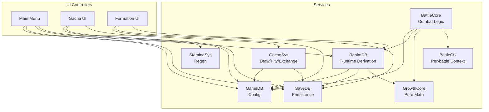
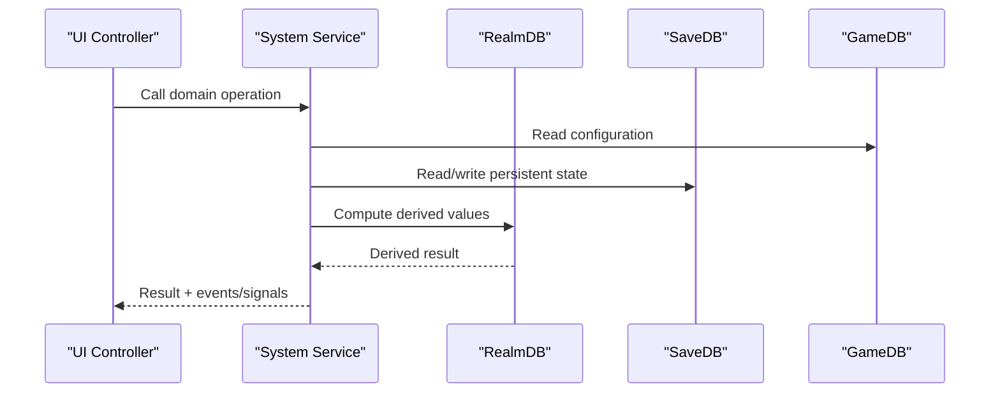
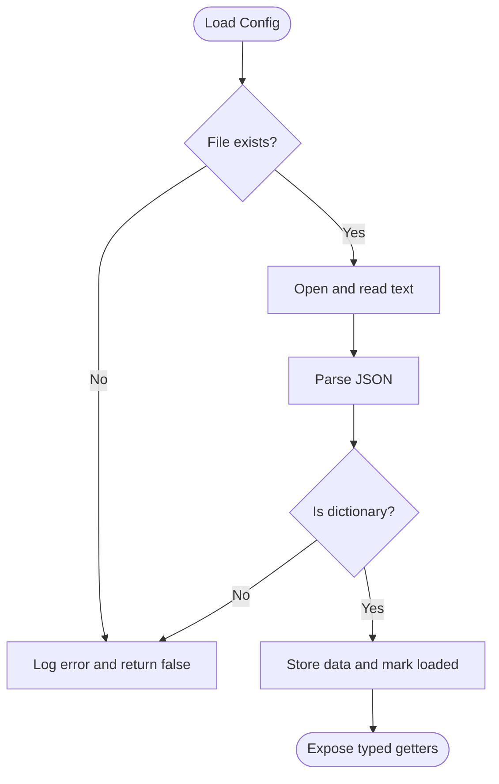
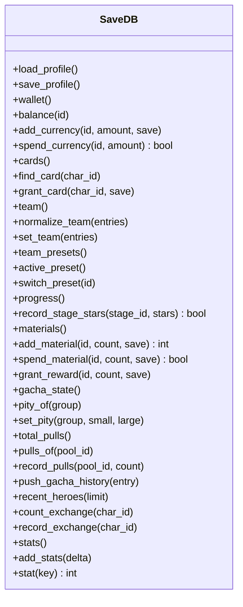
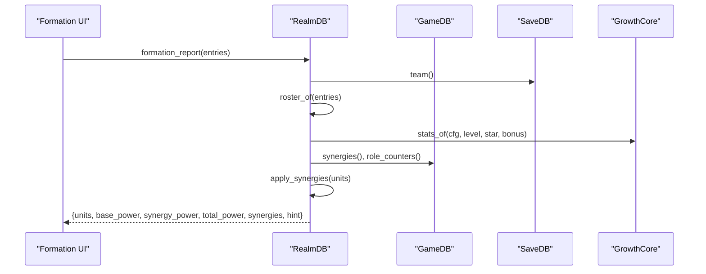
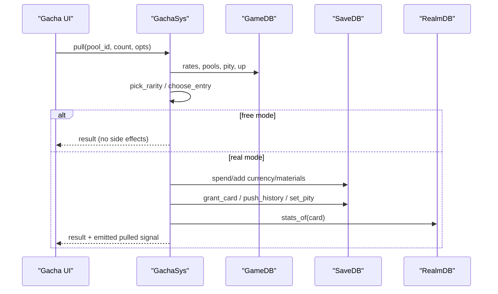
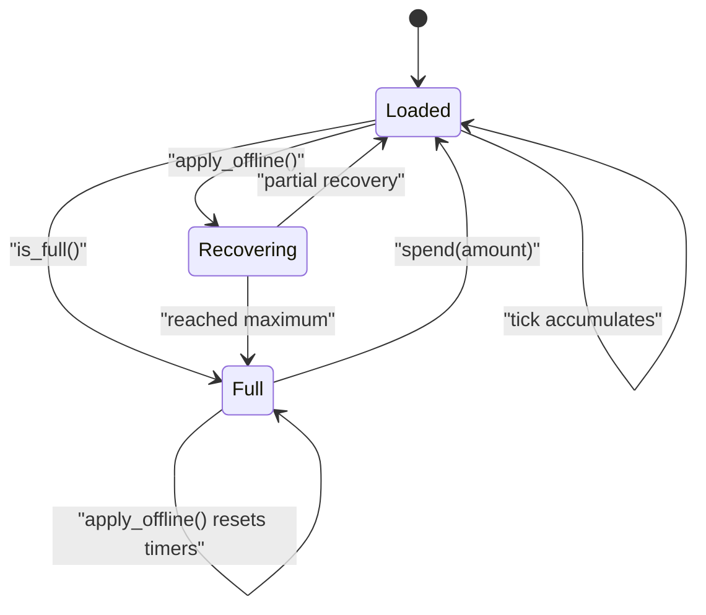
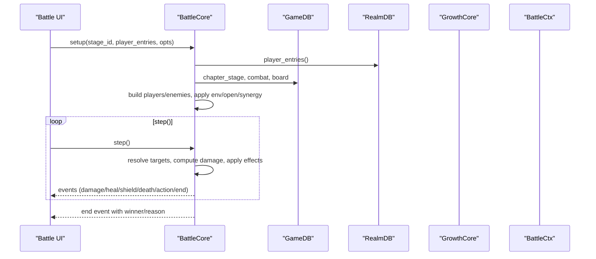
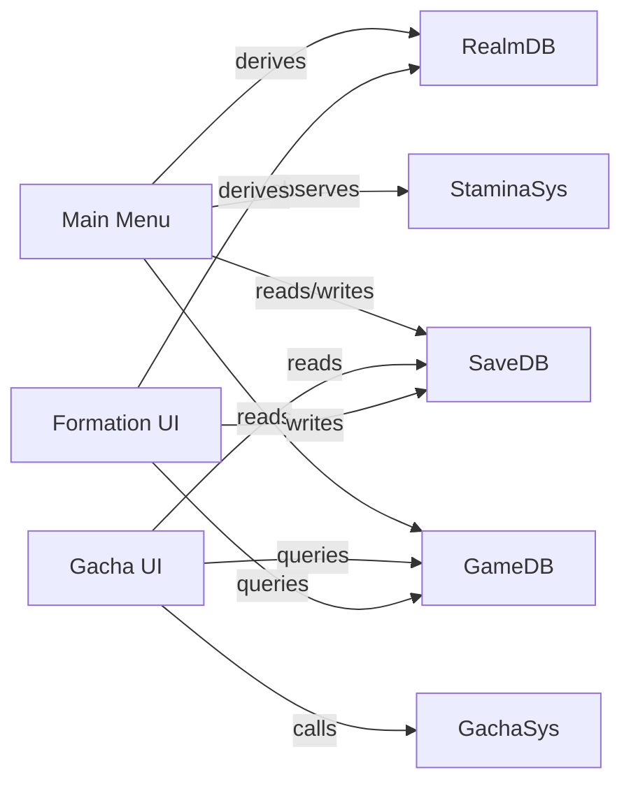
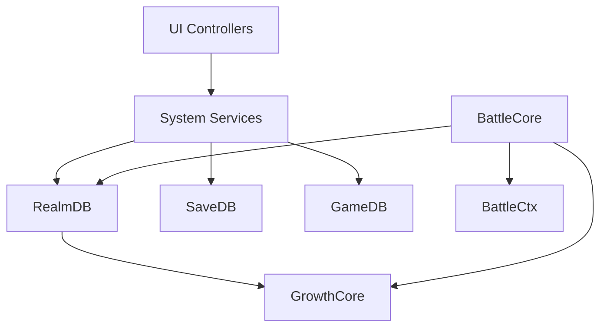

# Service-Oriented Patterns

<cite>
**Referenced Files in This Document**
- [game_db.gd](file://scripts/game_db.gd)
- [realm_db.gd](file://scripts/realm_db.gd)
- [save_db.gd](file://scripts/save_db.gd)
- [gacha_sys.gd](file://scripts/gacha_sys.gd)
- [stamina.gd](file://scripts/stamina.gd)
- [growth_core.gd](file://scripts/growth_core.gd)
- [battle_core.gd](file://scripts/battle_core.gd)
- [battle_ctx.gd](file://scripts/battle_ctx.gd)
- [main_menu.gd](file://scripts/main_menu.gd)
- [gacha.gd](file://scripts/gacha.gd)
- [formation.gd](file://scripts/formation.gd)
</cite>

## Table of Contents
1. Introduction
2. Project Structure
3. Core Components
4. Architecture Overview
5. Detailed Component Analysis
6. Dependency Analysis
7. Performance Considerations
8. Troubleshooting Guide
9. Conclusion
10. Appendices

## Introduction
This document explains the service-oriented design patterns used across Card Adventure. The game exposes major systems as services with clean, well-defined interfaces: configuration (GameDB), persistence (SaveDB), runtime derivation (RealmDB), gacha system (GachaSys), stamina system (StaminaSys), growth math (GrowthCore), and battle core (BattleCore). UI controllers interact only through these services, keeping presentation logic decoupled from business rules. We cover initialization, dependency injection via autoloads, inter-service communication, lifecycle management, error handling, testing strategies, and guidelines for adding new services while maintaining loose coupling and efficient data flow.

## Project Structure
The codebase is organized by responsibility rather than by scene:
- Configuration service: GameDB reads static game_data.json and exposes typed queries.
- Persistence service: SaveDB manages user://save.json, profiles, currencies, materials, team presets, and gacha state.
- Runtime derivation service: RealmDB computes final stats, synergies, power, and formation reports using GameDB + SaveDB.
- System services: GachaSys encapsulates draw/pity/exchange; StaminaSys handles offline regen; BattleCore runs deterministic combat; GrowthCore provides pure math functions.
- UI controllers: main_menu.gd, gacha.gd, formation.gd bind services to scenes without knowing implementation details.

**Diagram sources**
- [game_db.gd:1-120](file://scripts/game_db.gd#L1-L120)
- [save_db.gd:14-82](file://scripts/save_db.gd#L14-L82)
- [realm_db.gd:1-36](file://scripts/realm_db.gd#L1-L36)
- [gacha_sys.gd:1-19](file://scripts/gacha_sys.gd#L1-L19)
- [stamina.gd:1-36](file://scripts/stamina.gd#L1-L36)
- [growth_core.gd:1-53](file://scripts/growth_core.gd#L1-L53)
- [battle_core.gd:1-67](file://scripts/battle_core.gd#L1-L67)
- [battle_ctx.gd:1-18](file://scripts/battle_ctx.gd#L1-L18)
- [main_menu.gd:35-43](file://scripts/main_menu.gd#L35-L43)
- [gacha.gd:117-125](file://scripts/gacha.gd#L117-L125)
- [formation.gd:77-100](file://scripts/formation.gd#L77-L100)

**Section sources**
- [game_db.gd:1-120](file://scripts/game_db.gd#L1-L120)
- [save_db.gd:14-82](file://scripts/save_db.gd#L14-L82)
- [realm_db.gd:1-36](file://scripts/realm_db.gd#L1-L36)
- [gacha_sys.gd:1-19](file://scripts/gacha_sys.gd#L1-L19)
- [stamina.gd:1-36](file://scripts/stamina.gd#L1-L36)
- [growth_core.gd:1-53](file://scripts/growth_core.gd#L1-L53)
- [battle_core.gd:1-67](file://scripts/battle_core.gd#L1-L67)
- [battle_ctx.gd:1-18](file://scripts/battle_ctx.gd#L1-L18)
- [main_menu.gd:35-43](file://scripts/main_menu.gd#L35-L43)
- [gacha.gd:117-125](file://scripts/gacha.gd#L117-L125)
- [formation.gd:77-100](file://scripts/formation.gd#L77-L100)

## Core Components
- GameDB: Read-only configuration service. Loads JSON once and exposes typed getters for elements, rarities, characters, gacha tables, stage maps, formation rules, etc. Errors on missing or invalid config are logged via push_error.
- SaveDB: Persistence service. Manages profile, wallet, cards, team, presets, progress, gacha state, stamina snapshot. Normalizes data on load, migrates legacy fields, emits saved/loaded signals.
- RealmDB: Runtime derivation service. Computes final stats, synergy effects, team power, formation report, counter hints. Depends on GameDB and SaveDB; uses GrowthCore for math.
- GachaSys: Draw system. Encapsulates probability, pity, cost, exchange, history. Exposes pure functions pick_rarity and choose_entry for testability; supports free mode for simulation.
- StaminaSys: Offline stamina regen with timer-based tick and persisted last-accounted time. Emits changed/recovered signals.
- GrowthCore: Pure function layer for stat scaling and power calculation. No side effects.
- BattleCore: Deterministic ATB combat engine. Step-driven event loop producing events for UI to animate. Uses GameDB for configs and GrowthCore for power metrics.
- BattleCtx: Per-battle context passed between scenes (stage selection to battle). Holds stage_id, source, temporary buffs, seed override.

**Section sources**
- [game_db.gd:17-37](file://scripts/game_db.gd#L17-L37)
- [save_db.gd:146-177](file://scripts/save_db.gd#L146-L177)
- [realm_db.gd:13-36](file://scripts/realm_db.gd#L13-L36)
- [gacha_sys.gd:203-317](file://scripts/gacha_sys.gd#L203-L317)
- [stamina.gd:19-36](file://scripts/stamina.gd#L19-L36)
- [growth_core.gd:17-53](file://scripts/growth_core.gd#L17-L53)
- [battle_core.gd:44-67](file://scripts/battle_core.gd#L44-L67)
- [battle_ctx.gd:20-32](file://scripts/battle_ctx.gd#L20-L32)

## Architecture Overview
The architecture follows a layered service model:
- Presentation (UI controllers) depends on services, never on each other.
- Services depend on lower layers: UI → Systems → Runtime Derivation → Persistence → Configuration.
- Pure math (GrowthCore) has no dependencies, enabling reuse across preview and combat.
- Inter-service communication occurs via method calls and signals (e.g., SaveDB.loaded triggers StaminaSys reload).

**Diagram sources**
- [gacha.gd:604-625](file://scripts/gacha.gd#L604-L625)
- [gacha_sys.gd:203-317](file://scripts/gacha_sys.gd#L203-L317)
- [realm_db.gd:34-70](file://scripts/realm_db.gd#L34-L70)
- [save_db.gd:213-232](file://scripts/save_db.gd#L213-L232)
- [game_db.gd:287-344](file://scripts/game_db.gd#L287-L344)

**Section sources**
- [gacha.gd:604-625](file://scripts/gacha.gd#L604-L625)
- [gacha_sys.gd:203-317](file://scripts/gacha_sys.gd#L203-L317)
- [realm_db.gd:34-70](file://scripts/realm_db.gd#L34-L70)
- [save_db.gd:213-232](file://scripts/save_db.gd#L213-L232)
- [game_db.gd:287-344](file://scripts/game_db.gd#L287-L344)

## Detailed Component Analysis

### Configuration Service: GameDB
- Responsibility: Load and serve read-only configuration from game_data.json. Provides typed accessors for elements, rarities, characters, gacha pools, stages, formation rules, economy, and more.
- Initialization: Loads data in _ready; validates file existence and JSON parse; logs version and counts.
- Error handling: push_error on missing file or parse failure; returns safe defaults for missing sections.
- Data flow: UI and services call getters; no writes; ensures consistent configuration semantics across modules.

**Diagram sources**
- [game_db.gd:17-37](file://scripts/game_db.gd#L17-L37)

**Section sources**
- [game_db.gd:17-37](file://scripts/game_db.gd#L17-L37)
- [game_db.gd:545-560](file://scripts/game_db.gd#L545-L560)

### Persistence Service: SaveDB
- Responsibility: Centralized persistence for player profile, wallet, cards, team, presets, progress, gacha state, stamina snapshot. Ensures normalization and migration.
- Initialization: Loads profile on startup; fills defaults; normalizes cards; migrates legacy gacha fields; emits loaded signal.
- Error handling: Logs write errors; guards against invalid entries; enforces team constraints.
- Data flow: All write paths go through SaveDB; services read via getters; UI binds to profile or signals.

**Diagram sources**
- [save_db.gd:146-177](file://scripts/save_db.gd#L146-L177)
- [save_db.gd:213-232](file://scripts/save_db.gd#L213-L232)
- [save_db.gd:235-277](file://scripts/save_db.gd#L235-L277)
- [save_db.gd:285-352](file://scripts/save_db.gd#L285-L352)
- [save_db.gd:357-404](file://scripts/save_db.gd#L357-L404)
- [save_db.gd:409-447](file://scripts/save_db.gd#L409-L447)
- [save_db.gd:449-505](file://scripts/save_db.gd#L449-L505)
- [save_db.gd:516-643](file://scripts/save_db.gd#L516-L643)

**Section sources**
- [save_db.gd:146-177](file://scripts/save_db.gd#L146-L177)
- [save_db.gd:213-232](file://scripts/save_db.gd#L213-L232)
- [save_db.gd:285-352](file://scripts/save_db.gd#L285-L352)
- [save_db.gd:516-643](file://scripts/save_db.gd#L516-L643)

### Runtime Derivation Service: RealmDB
- Responsibility: Compute final stats, synergy effects, team power, formation report, counter hints, hero items, showcase lineups. Bridges GameDB and SaveDB with GrowthCore math.
- Key flows: roster_of builds unit lists with slot/cell/row mapping; apply_synergies mutates per-unit stats and adds battle-level buffs; formation_report aggregates base/synergy power and active synergies.
- Error handling: Safe fallbacks for missing cards/config; empty arrays/dicts handled gracefully.

**Diagram sources**
- [realm_db.gd:34-70](file://scripts/realm_db.gd#L34-L70)
- [realm_db.gd:161-243](file://scripts/realm_db.gd#L161-L243)
- [realm_db.gd:340-359](file://scripts/realm_db.gd#L340-L359)
- [growth_core.gd:26-53](file://scripts/growth_core.gd#L26-L53)

**Section sources**
- [realm_db.gd:13-36](file://scripts/realm_db.gd#L13-L36)
- [realm_db.gd:161-243](file://scripts/realm_db.gd#L161-L243)
- [realm_db.gd:340-359](file://scripts/realm_db.gd#L340-L359)

### Gacha System: GachaSys
- Responsibility: One-call draw pipeline: validate pool, compute cost, roll rarity/content, apply pity, pay, grant rewards, update history, persist state, emit results.
- Testability: Pure functions pick_rarity and choose_entry accept explicit random inputs; free mode simulates without side effects.
- Inter-service: Reads config from GameDB; persists state via SaveDB; computes stats via RealmDB when needed.

**Diagram sources**
- [gacha_sys.gd:203-317](file://scripts/gacha_sys.gd#L203-L317)
- [gacha_sys.gd:366-430](file://scripts/gacha_sys.gd#L366-L430)
- [gacha_sys.gd:435-528](file://scripts/gacha_sys.gd#L435-L528)

**Section sources**
- [gacha_sys.gd:203-317](file://scripts/gacha_sys.gd#L203-L317)
- [gacha_sys.gd:366-430](file://scripts/gacha_sys.gd#L366-L430)
- [gacha_sys.gd:435-528](file://scripts/gacha_sys.gd#L435-L528)

### Stamina System: StaminaSys
- Responsibility: Maintain current stamina, recover offline, persist last accounted time, emit changes.
- Lifecycle: On ready, loads from SaveDB, applies offline recovery, starts a Timer tick, emits initial changed.
- Inter-service: Reads max and seconds_per_point from GameDB; persists via SaveDB.profile["stamina"].

**Diagram sources**
- [stamina.gd:19-36](file://scripts/stamina.gd#L19-L36)
- [stamina.gd:54-81](file://scripts/stamina.gd#L54-L81)
- [stamina.gd:86-141](file://scripts/stamina.gd#L86-L141)
- [stamina.gd:144-166](file://scripts/stamina.gd#L144-L166)

**Section sources**
- [stamina.gd:19-36](file://scripts/stamina.gd#L19-L36)
- [stamina.gd:54-81](file://scripts/stamina.gd#L54-L81)
- [stamina.gd:86-141](file://scripts/stamina.gd#L86-L141)
- [stamina.gd:144-166](file://scripts/stamina.gd#L144-L166)

### Combat Engine: BattleCore
- Responsibility: Deterministic ATB combat with step-driven events. Builds units from player entries and stage enemies, applies environment/open traits/synergy opens, schedules actions, resolves targets, computes damage, tracks death/end conditions.
- Inter-service: Uses GameDB for configs (combat, board, ATB), GrowthCore for power metrics, RealmDB for player entries fallback, BattleCtx for per-battle context.
- Event contract: step() returns event list for UI to animate; run_all() executes until finish or timeout.

**Diagram sources**
- [battle_core.gd:44-67](file://scripts/battle_core.gd#L44-L67)
- [battle_core.gd:73-103](file://scripts/battle_core.gd#L73-L103)
- [battle_core.gd:391-425](file://scripts/battle_core.gd#L391-L425)
- [battle_core.gd:477-571](file://scripts/battle_core.gd#L477-L571)
- [battle_core.gd:672-761](file://scripts/battle_core.gd#L672-L761)

**Section sources**
- [battle_core.gd:44-67](file://scripts/battle_core.gd#L44-L67)
- [battle_core.gd:391-425](file://scripts/battle_core.gd#L391-L425)
- [battle_core.gd:477-571](file://scripts/battle_core.gd#L477-L571)
- [battle_core.gd:672-761](file://scripts/battle_core.gd#L672-L761)

### UI Controllers and Service Binding
- Main Menu: Binds player info, showcase lineup, team slots, stamina display, and navigation routes. Uses GameDB, SaveDB, RealmDB, StaminaSys without internal knowledge of their implementations.
- Gacha UI: Binds tabs, costs, pity bars, rate panel, shop panel, and pull sequence. Calls GachaSys.pull and exchange; refreshes UI based on results.
- Formation UI: Binds library, fan, board grid, presets, filters/sort, and confirm/deploy. Uses RealmDB for stats/synergies and SaveDB for team/presets.

**Diagram sources**
- [main_menu.gd:35-43](file://scripts/main_menu.gd#L35-L43)
- [gacha.gd:117-125](file://scripts/gacha.gd#L117-L125)
- [formation.gd:77-100](file://scripts/formation.gd#L77-L100)

**Section sources**
- [main_menu.gd:35-43](file://scripts/main_menu.gd#L35-L43)
- [gacha.gd:117-125](file://scripts/gacha.gd#L117-L125)
- [formation.gd:77-100](file://scripts/formation.gd#L77-L100)

## Dependency Analysis
- Loose coupling: UI controllers depend on services; services depend on lower layers; pure math has no dependencies.
- Cohesion: Each service owns a single responsibility (config, persistence, derivation, draw, regen, combat).
- Direct dependencies:
  - RealmDB depends on GameDB, SaveDB, GrowthCore.
  - GachaSys depends on GameDB, SaveDB; optionally RealmDB for card stats.
  - StaminaSys depends on GameDB, SaveDB.
  - BattleCore depends on GameDB, GrowthCore, RealmDB, BattleCtx.
- Indirect dependencies: UI indirectly depends on all services through controller bindings.
- Circular dependencies: None observed; services avoid mutual imports except via autoload references.

**Diagram sources**
- [realm_db.gd:1-36](file://scripts/realm_db.gd#L1-L36)
- [gacha_sys.gd:1-19](file://scripts/gacha_sys.gd#L1-L19)
- [stamina.gd:1-36](file://scripts/stamina.gd#L1-L36)
- [battle_core.gd:1-67](file://scripts/battle_core.gd#L1-L67)

**Section sources**
- [realm_db.gd:1-36](file://scripts/realm_db.gd#L1-L36)
- [gacha_sys.gd:1-19](file://scripts/gacha_sys.gd#L1-L19)
- [stamina.gd:1-36](file://scripts/stamina.gd#L1-L36)
- [battle_core.gd:1-67](file://scripts/battle_core.gd#L1-L67)

## Performance Considerations
- Configuration loading: GameDB loads JSON once at startup; subsequent queries are O(1) or O(n) over small tables. Avoid repeated file I/O.
- Persistence writes: SaveDB batches saves where possible (e.g., gacha pulls accumulate changes then save once). StaminaSys throttles disk writes to every 30 seconds during ticks.
- Computation: GrowthCore is pure and fast; RealmDB caches derived structures per call (e.g., roster_of sorts once); avoid recomputing in tight loops.
- Combat: BattleCore uses linear scan for actor scheduling due to small unit counts; deterministic RNG enables replay and avoids heavy allocations.

[No sources needed since this section provides general guidance]

## Troubleshooting Guide
- Configuration errors: GameDB logs push_error if config file missing or JSON invalid; check logs and ensure res://data/game_data.json exists and parses to a dictionary.
- Persistence failures: SaveDB logs write errors; verify user:// directory permissions; use SaveDB.reset_profile to rebuild defaults if corrupted.
- Team validation: Use SaveDB.team_errors to get human-readable messages for invalid entries; normalize via SaveDB.normalize_team before saving.
- Gacha issues: In free mode, verify pick_rarity/choose_entry behavior with fixed seeds; check affordability via GachaSys.cost; inspect pity_state for expected thresholds.
- Stamina anomalies: Confirm seconds_per_point and maximum from GameDB.stamina_cfg(); check last_accounted_at and accumulated time in SaveDB.profile["stamina"]; use StaminaSys.apply_offline to reconcile.
- Combat determinism: Set BattleCtx.seed_override to a fixed value for reproducible runs; compare step outputs to expected events.

**Section sources**
- [game_db.gd:17-37](file://scripts/game_db.gd#L17-L37)
- [save_db.gd:168-177](file://scripts/save_db.gd#L168-L177)
- [save_db.gd:319-344](file://scripts/save_db.gd#L319-L344)
- [gacha_sys.gd:77-98](file://scripts/gacha_sys.gd#L77-L98)
- [stamina.gd:120-141](file://scripts/stamina.gd#L120-L141)
- [battle_ctx.gd:15-18](file://scripts/battle_ctx.gd#L15-L18)

## Conclusion
Card Adventure’s service-oriented architecture cleanly separates concerns: configuration, persistence, derivation, systems, and combat logic. UI controllers remain thin, binding services to scenes without implementation knowledge. Services expose stable interfaces, support deterministic testing, and manage lifecycles via signals and autoload references. Following these patterns ensures maintainable, testable, and scalable gameplay systems.

[No sources needed since this section summarizes without analyzing specific files]

## Appendices

### Creating New Services: Guidelines
- Define a single responsibility and expose a focused interface (getters/setters, operations, signals).
- Depend only on lower layers (GameDB, SaveDB, GrowthCore); avoid direct UI coupling.
- Initialize in _ready or via autoload; handle missing data gracefully with safe defaults.
- Persist state through SaveDB; do not open files directly in other modules.
- Emit signals for asynchronous updates (e.g., SaveDB.saved/loaded, StaminaSys.changed).
- Provide pure functions where possible for testability (like GachaSys.pick_rarity).
- Keep data flow unidirectional: UI → Services → Lower Layers; avoid cross-service mutations outside defined boundaries.

[No sources needed since this section provides general guidance]

### Testing Approaches
- Unit tests for pure functions: GrowthCore.stats_of/power_of; GachaSys.pick_rarity/choose_entry with controlled randomness.
- Integration tests for services: Validate SaveDB normalization/migration; RealmDB formation_report consistency; StaminaSys offline recovery.
- Smoke tests for UI controllers: Verify button wiring, route resolution, and non-blocking transitions using auto_transition flags.
- Deterministic combat: Use BattleCtx.seed_override and assert step outputs for reproducibility.

[No sources needed since this section provides general guidance]