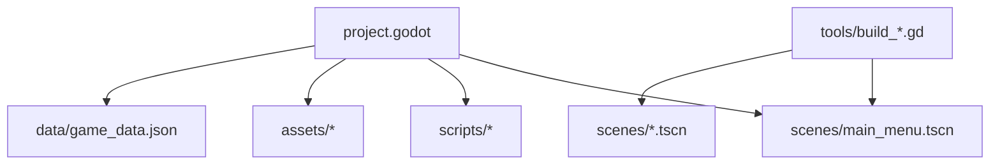
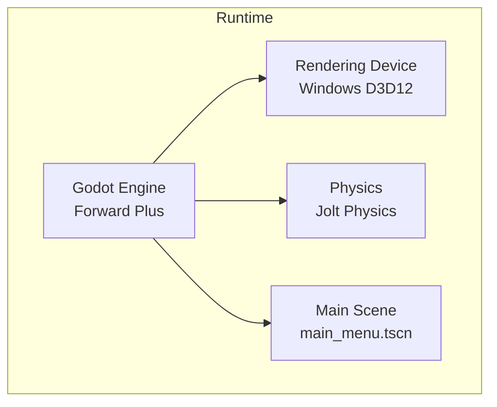
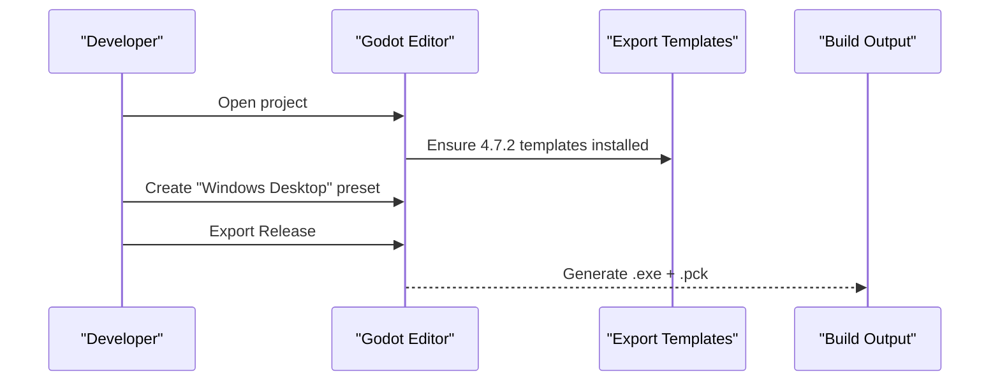
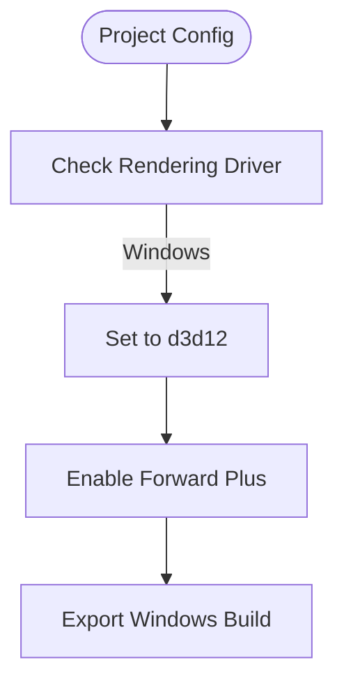
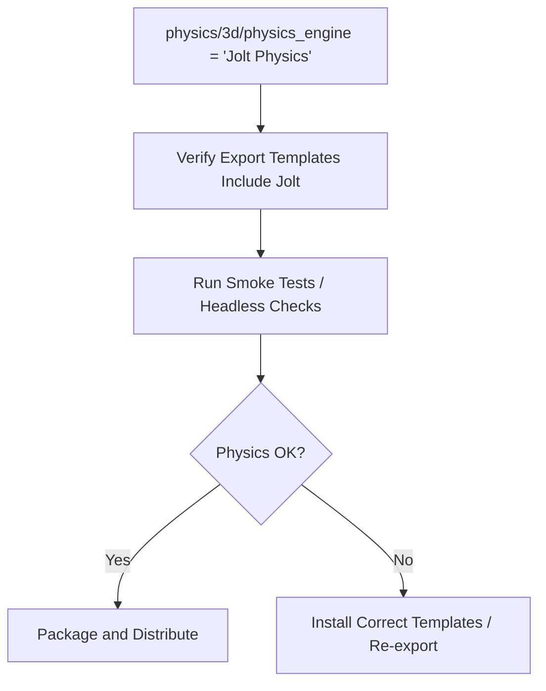
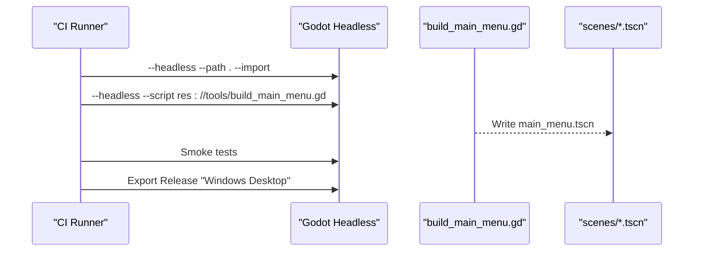
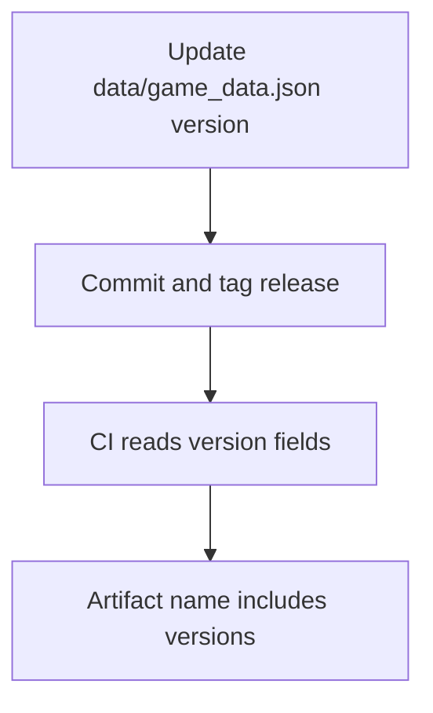
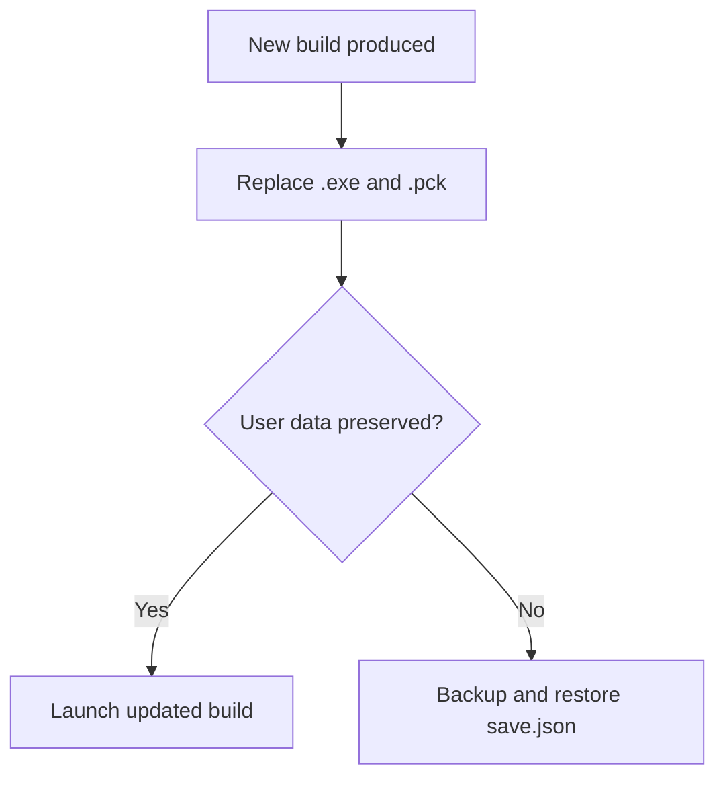
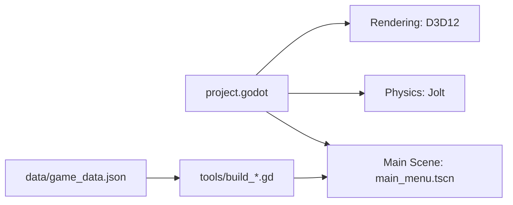

# Deployment & Distribution

<cite>
**Referenced Files in This Document**
- [project.godot](file://project.godot)
- [README.md](file://README.md)
- [build_main_menu.gd](file://tools/build_main_menu.gd)
- [game_data.json](file://data/game_data.json)
</cite>

## Table of Contents
1. Introduction
2. Project Structure
3. Core Components
4. Architecture Overview
5. Detailed Component Analysis
6. Dependency Analysis
7. Performance Considerations
8. Troubleshooting Guide
9. Conclusion
10. Appendices

## Introduction
This document explains how to deploy and distribute the Card Adventure game for Windows desktop using Godot 4.7. It covers exporting with DirectX 12, integrating Jolt Physics, building and packaging artifacts, automating builds, versioning, updates, security considerations (code signing), and distribution channels. The guidance is grounded in the project’s configuration and documented workflows.

## Project Structure
The project is a Godot 4.7.2 title targeting Windows with Forward Plus rendering on DirectX 12 and Jolt Physics enabled. The main scene is defined in the engine configuration, and assets, scenes, scripts, and tools are organized under dedicated folders. Scene layouts are generated by build scripts rather than edited manually.

**Diagram sources**
- [project.godot:6-12](file://project.godot#L6-L12)
- [build_main_menu.gd:1-15](file://tools/build_main_menu.gd#L1-L15)

**Section sources**
- [project.godot:6-12](file://project.godot#L6-L12)
- [README.md:62-96](file://README.md#L62-L96)

## Core Components
- Rendering backend: Windows DirectX 12 via Forward Plus.
- Physics engine: Jolt Physics.
- Main scene: main_menu.tscn.
- Programmatic scene generation: tools/build_*.gd scripts produce .tscn files at build time.
- Data-driven configuration: data/game_data.json drives gameplay content and UI layout constants used by build scripts.

Key implications for deployment:
- Export templates must match Godot 4.7.2.
- Windows export uses D3D12 driver as configured.
- Jolt Physics requires the corresponding export template features; ensure templates include physics modules.

**Section sources**
- [project.godot:43-49](file://project.godot#L43-L49)
- [project.godot:6-12](file://project.godot#L6-L12)
- [build_main_menu.gd:1-15](file://tools/build_main_menu.gd#L1-L15)
- [README.md:32-46](file://README.md#L32-L46)

## Architecture Overview
The runtime architecture centers on Godot’s engine with a D3D12 rendering device and Jolt Physics integration. The application entry point loads the main menu scene, which is constructed programmatically during development and baked into .tscn files consumed at runtime.

**Diagram sources**
- [project.godot:43-49](file://project.godot#L43-L49)
- [project.godot:6-12](file://project.godot#L6-L12)

## Detailed Component Analysis

### Windows Export and Packaging
- Prerequisites:
  - Godot 4.7.2 editor and matching export templates installed.
  - Windows Desktop export preset created once in the editor.
- Build steps:
  - Import assets and generate caches if needed.
  - Export release to produce an executable and associated PCK bundle.
- Output artifacts:
  - A Windows executable (.exe) plus a companion PCK file containing resources.

**Diagram sources**
- [README.md:32-46](file://README.md#L32-L46)

**Section sources**
- [README.md:32-46](file://README.md#L32-L46)

### DirectX 12 Configuration
- Rendering device driver is set to DirectX 12 for Windows.
- Forward Plus renderer is enabled via project features.
- Implication: Ensure target machines meet D3D12 requirements and have up-to-date graphics drivers.

**Diagram sources**
- [project.godot:43-49](file://project.godot#L43-L49)
- [project.godot:6-12](file://project.godot#L6-L12)

**Section sources**
- [project.godot:43-49](file://project.godot#L43-L49)
- [project.godot:6-12](file://project.godot#L6-L12)

### Jolt Physics Integration
- Jolt Physics is selected as the 3D physics engine.
- Ensure export templates include Jolt support; otherwise, exported builds may fail to initialize physics.
- Validate that any 3D objects or interactions rely on Jolt-compatible settings.

**Diagram sources**
- [project.godot:43-45](file://project.godot#L43-L45)

**Section sources**
- [project.godot:43-45](file://project.godot#L43-L45)

### Automated Build Pipeline
- Scene generation:
  - Use headless mode to run build scripts that output .tscn files deterministically.
  - Example: generating the main menu scene from its build script.
- Recommended CI steps:
  - Install Godot 4.7.2 and export templates.
  - Run asset import and cache generation.
  - Execute scene build scripts.
  - Run smoke tests.
  - Export Windows release artifact.

**Diagram sources**
- [build_main_menu.gd:1-15](file://tools/build_main_menu.gd#L1-L15)
- [README.md:493-508](file://README.md#L493-L508)

**Section sources**
- [build_main_menu.gd:1-15](file://tools/build_main_menu.gd#L1-L15)
- [README.md:493-508](file://README.md#L493-L508)

### Version Management
- Game data versioning:
  - data/game_data.json includes a version field to track content revisions.
- Engine/project metadata:
  - project.godot contains config_version and feature flags.
- Recommendation:
  - Bump game_data.json version when content changes.
  - Tag releases with both engine version and game data version.

**Diagram sources**
- [game_data.json:1-5](file://data/game_data.json#L1-L5)
- [project.godot:4-12](file://project.godot#L4-L12)

**Section sources**
- [game_data.json:1-5](file://data/game_data.json#L1-L5)
- [project.godot:4-12](file://project.godot#L4-L12)

### Update Mechanisms
- Save location:
  - User data resides under Godot’s user:// path, typically %APPDATA%\Godot\app_userdata\<App Name>\save.json.
- Update strategy:
  - Replace executable and PCK while preserving user:// directory so saves persist across updates.
  - Optionally implement an in-game updater that downloads new bundles and swaps them without overwriting user data.

**Section sources**
- [README.md:48-58](file://README.md#L48-L58)

### Security Considerations and File Signing
- Code signing:
  - Sign the Windows executable and any DLLs with a trusted code-signing certificate to avoid Windows SmartScreen warnings.
- Distribution integrity:
  - Provide checksums (e.g., SHA-256) for downloadable artifacts.
  - Consider signed update manifests for in-app updaters.
- Asset protection:
  - Keep sensitive configuration out of user-writable paths; store critical server-side logic on a backend if applicable.

[No sources needed since this section provides general guidance]

### Distribution Channels Setup
- Steam:
  - Package the .exe and .pck into a Steamworks app manifest; configure launch parameters and cloud saves if desired.
- Standalone website:
  - Host the installer or zip with checksums; provide clear installation instructions and system requirements (D3D12-capable GPU).
- Internal QA:
  - Distribute unsigned builds internally with a note about enabling “Allow running apps from anywhere” if required by policy.

[No sources needed since this section provides general guidance]

## Dependency Analysis
The runtime depends on:
- Godot engine configured for Windows D3D12 and Forward Plus.
- Jolt Physics module included in export templates.
- Generated scenes and scripts loaded at runtime.

**Diagram sources**
- [project.godot:6-12](file://project.godot#L6-L12)
- [project.godot:43-49](file://project.godot#L43-L49)
- [build_main_menu.gd:1-15](file://tools/build_main_menu.gd#L1-L15)
- [game_data.json:1-5](file://data/game_data.json#L1-L5)

**Section sources**
- [project.godot:6-12](file://project.godot#L6-L12)
- [project.godot:43-49](file://project.godot#L43-L49)
- [build_main_menu.gd:1-15](file://tools/build_main_menu.gd#L1-L15)
- [game_data.json:1-5](file://data/game_data.json#L1-L5)

## Performance Considerations
- Rendering:
  - D3D12 with Forward Plus offers modern performance but requires capable GPUs; ensure minimum specs are communicated to users.
- Physics:
  - Jolt Physics can be tuned via project settings; keep collision shapes minimal and use appropriate layers.
- Asset pipeline:
  - Use compressed textures and mipmaps; avoid oversized images.
- Startup:
  - Preload only necessary scenes; defer heavy initialization until after first frame.
- Diagnostics:
  - Use headless smoke tests to validate deterministic behavior and catch regressions early.

[No sources needed since this section provides general guidance]

## Troubleshooting Guide
Common issues and resolutions:
- Missing export templates:
  - Install matching 4.7.2 templates before creating presets and exporting.
- Export fails due to missing preset:
  - Create a Windows Desktop preset in the editor once; then automate via command-line export.
- D3D12 runtime errors on target machines:
  - Verify GPU supports D3D12 and drivers are updated.
- Jolt Physics not initializing:
  - Confirm export templates include Jolt; re-export if necessary.
- Scene mismatches:
  - Regenerate scenes using build scripts to ensure consistency between editor and runtime.

**Section sources**
- [README.md:32-46](file://README.md#L32-L46)
- [README.md:493-508](file://README.md#L493-L508)

## Conclusion
Deploying Card Adventure for Windows involves configuring Godot 4.7.2 for DirectX 12 and Jolt Physics, generating scenes through build scripts, and exporting a release package. Automate imports, scene generation, testing, and exports in CI to ensure consistent builds. Preserve user data during updates, sign binaries for trust, and choose distribution channels that fit your audience.

[No sources needed since this section summarizes without analyzing specific files]

## Appendices

### Quick Commands Reference
- Import and run:
  - Use headless import and direct execution commands as documented.
- Export:
  - Create a Windows Desktop preset and export release to produce .exe + .pck.
- Scene generation:
  - Run build scripts in headless mode to regenerate scenes.

**Section sources**
- [README.md:14-28](file://README.md#L14-L28)
- [README.md:32-46](file://README.md#L32-L46)
- [README.md:493-508](file://README.md#L493-L508)