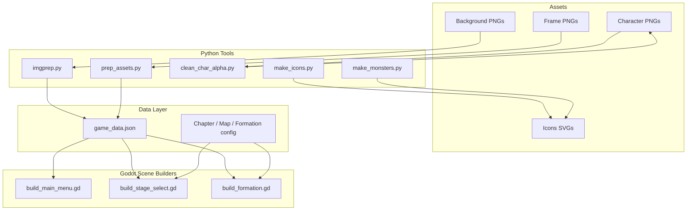
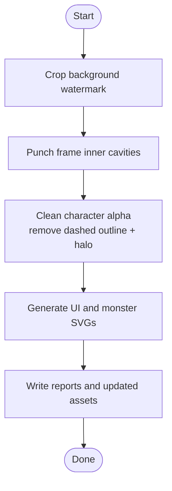
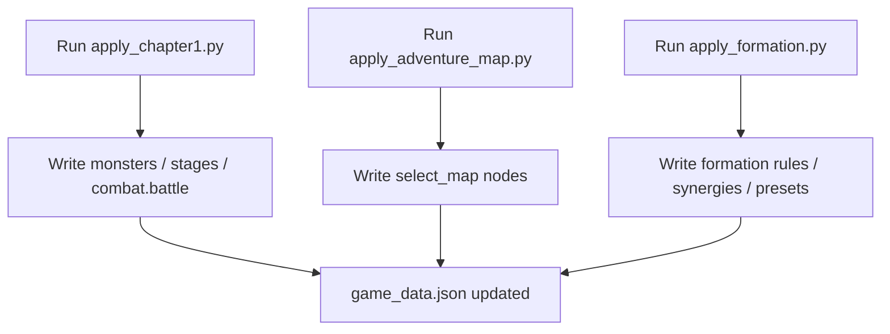
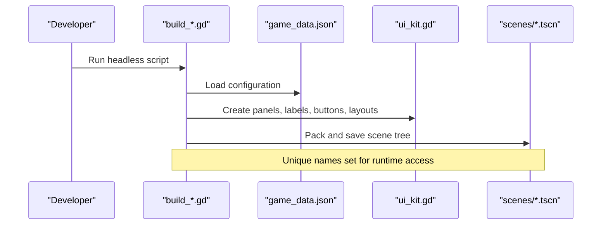
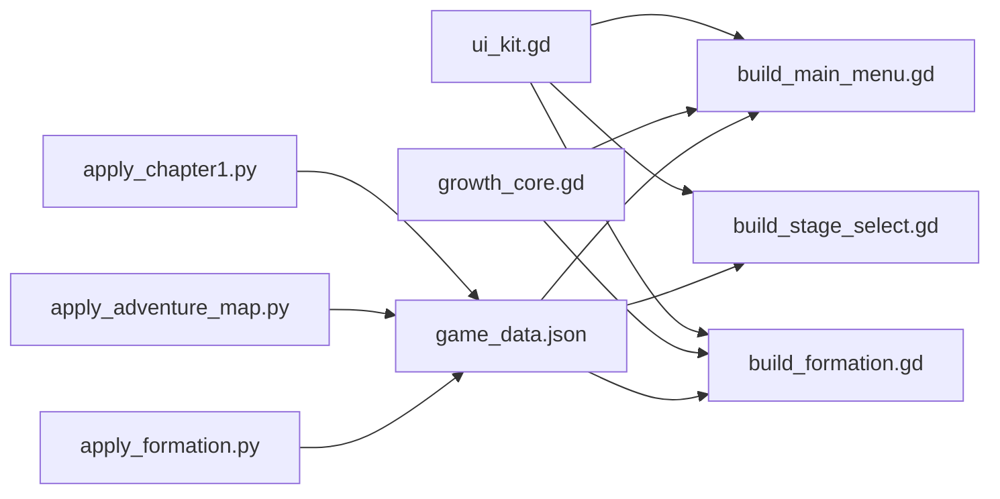

# Development Tools & Utilities

<cite>
**Referenced Files in This Document**
- [README.md](file://README.md)
- [tools/ui_kit.gd](file://tools/ui_kit.gd)
- [tools/build_main_menu.gd](file://tools/build_main_menu.gd)
- [tools/build_stage_select.gd](file://tools/build_stage_select.gd)
- [tools/build_formation.gd](file://tools/build_formation.gd)
- [tools/imgprep.py](file://tools/imgprep.py)
- [tools/prep_assets.py](file://tools/prep_assets.py)
- [tools/clean_char_alpha.py](file://tools/clean_char_alpha.py)
- [tools/make_icons.py](file://tools/make_icons.py)
- [tools/make_monsters.py](file://tools/make_monsters.py)
- [tools/_inspect/apply_chapter1.py](file://tools/_inspect/apply_chapter1.py)
- [tools/_inspect/apply_adventure_map.py](file://tools/_inspect/apply_adventure_map.py)
- [tools/_inspect/apply_formation.py](file://tools/_inspect/apply_formation.py)
</cite>

## Table of Contents
1. Introduction
2. Project Structure
3. Core Components
4. Architecture Overview
5. Detailed Component Analysis
6. Dependency Analysis
7. Performance Considerations
8. Troubleshooting Guide
9. Conclusion

## Introduction
This document explains the development toolkit and utility scripts that support asset preparation, data validation, build automation, rapid UI prototyping, and diagnostics for the game. It focuses on:
- Asset preparation pipeline: image processing, sprite generation, and icon creation
- Data validation tools: ensuring game data integrity and consistency
- Build automation: programmatic scene generation to streamline workflow
- UI kit usage: building consistent interfaces quickly
- Diagnostic tools: debugging battle, gacha, fan scroll, and other systems
- Python scripts for data manipulation and Godot tools for scene generation and testing

The project uses a single configuration source (game_data.json) and a layered runtime data model (GameDB, SaveDB, RealmDB). The tooling is designed to keep art, data, and scenes consistent with gameplay rules and design intent.

## Project Structure
The toolkit lives under tools/ and _inspect/. It includes:
- Python asset processors for images and icons
- Godot scene builders that generate .tscn files from configuration
- Data writers that write策划 (designer) content into game_data.json
- Smoke tests and diagnostic scripts for validation and debugging



**Diagram sources**
- [tools/imgprep.py:1-64](file://tools/imgprep.py#L1-L64)
- [tools/prep_assets.py:1-98](file://tools/prep_assets.py#L1-L98)
- [tools/clean_char_alpha.py:1-165](file://tools/clean_char_alpha.py#L1-L165)
- [tools/make_icons.py:1-110](file://tools/make_icons.py#L1-L110)
- [tools/make_monsters.py:1-430](file://tools/make_monsters.py#L1-L430)
- [tools/build_main_menu.gd:1-571](file://tools/build_main_menu.gd#L1-L571)
- [tools/build_stage_select.gd:1-487](file://tools/build_stage_select.gd#L1-L487)
- [tools/build_formation.gd:1-695](file://tools/build_formation.gd#L1-L695)
- [tools/_inspect/apply_chapter1.py:1-528](file://tools/_inspect/apply_chapter1.py#L1-L528)
- [tools/_inspect/apply_adventure_map.py:1-156](file://tools/_inspect/apply_adventure_map.py#L1-L156)
- [tools/_inspect/apply_formation.py:1-237](file://tools/_inspect/apply_formation.py#L1-L237)

**Section sources**
- [README.md:62-96](file://README.md#L62-L96)

## Core Components
- Asset preprocessing pipeline:
  - Background cropping and reference zooming
  - Frame punching and character alpha cleanup
  - Icon and monster SVG generation
- Data writers:
  - Chapter stages, monsters, and battle layout
  - Adventure map node coordinates and labels
  - Formation rules, synergies, and presets
- Scene builders:
  - Main menu, stage select, formation screens generated from game_data.json
- UI kit:
  - Reusable panels, gradients, text, buttons, and layout helpers
- Diagnostics and smoke tests:
  - Battle, gacha, fan scroll, and adventure data checks

**Section sources**
- [tools/imgprep.py:1-64](file://tools/imgprep.py#L1-L64)
- [tools/prep_assets.py:1-98](file://tools/prep_assets.py#L1-L98)
- [tools/clean_char_alpha.py:1-165](file://tools/clean_char_alpha.py#L1-L165)
- [tools/make_icons.py:1-110](file://tools/make_icons.py#L1-L110)
- [tools/make_monsters.py:1-430](file://tools/make_monsters.py#L1-L430)
- [tools/_inspect/apply_chapter1.py:1-528](file://tools/_inspect/apply_chapter1.py#L1-L528)
- [tools/_inspect/apply_adventure_map.py:1-156](file://tools/_inspect/apply_adventure_map.py#L1-L156)
- [tools/_inspect/apply_formation.py:1-237](file://tools/_inspect/apply_formation.py#L1-L237)
- [tools/build_main_menu.gd:1-571](file://tools/build_main_menu.gd#L1-L571)
- [tools/build_stage_select.gd:1-487](file://tools/build_stage_select.gd#L1-L487)
- [tools/build_formation.gd:1-695](file://tools/build_formation.gd#L1-L695)
- [tools/ui_kit.gd:1-388](file://tools/ui_kit.gd#L1-L388)

## Architecture Overview
The development pipeline connects raw assets and design data to validated game data and generated scenes.

```mermaid
sequenceDiagram
participant Designer as "Designer"
participant Py as "Python Tools"
participant JSON as "game_data.json"
participant GD as "Godot Scene Builders"
participant Scenes as "scenes/*.tscn"
Designer->>Py : Run asset/data scripts
Py->>JSON : Write or update sections
Note over Py,JSON : Idempotent writes; overwrite targeted sections
Designer->>GD : Run headless scene builders
GD->>JSON : Read configuration
GD->>Scenes : Generate scene trees and save .tscn
Note over GD,Scenes : Layout constants live in builders; dynamic content filled at runtime
```

**Diagram sources**
- [tools/imgprep.py:1-64](file://tools/imgprep.py#L1-L64)
- [tools/prep_assets.py:1-98](file://tools/prep_assets.py#L1-L98)
- [tools/clean_char_alpha.py:1-165](file://tools/clean_char_alpha.py#L1-L165)
- [tools/make_icons.py:1-110](file://tools/make_icons.py#L1-L110)
- [tools/make_monsters.py:1-430](file://tools/make_monsters.py#L1-L430)
- [tools/_inspect/apply_chapter1.py:1-528](file://tools/_inspect/apply_chapter1.py#L1-L528)
- [tools/_inspect/apply_adventure_map.py:1-156](file://tools/_inspect/apply_adventure_map.py#L1-L156)
- [tools/_inspect/apply_formation.py:1-237](file://tools/_inspect/apply_formation.py#L1-L237)
- [tools/build_main_menu.gd:1-571](file://tools/build_main_menu.gd#L1-L571)
- [tools/build_stage_select.gd:1-487](file://tools/build_stage_select.gd#L1-L487)
- [tools/build_formation.gd:1-695](file://tools/build_formation.gd#L1-L695)

## Detailed Component Analysis

### Asset Preparation Pipeline
- Background preprocessing:
  - Crops watermarks and prepares reference crops for UI alignment
- Card frames:
  - Punches inner cavities using flood-fill seeds, normalizes inner rectangles, and outputs size metadata
- Character portraits:
  - Removes dashed die-cut outlines via geodesic reconstruction and cleans anti-aliased halo pixels near transparent edges
- Icons:
  - Generates pure-white SVGs for UI elements and monster sprites, tuned for Godot’s ThorVG rasterizer



**Diagram sources**
- [tools/imgprep.py:13-39](file://tools/imgprep.py#L13-L39)
- [tools/prep_assets.py:16-98](file://tools/prep_assets.py#L16-L98)
- [tools/clean_char_alpha.py:110-154](file://tools/clean_char_alpha.py#L110-L154)
- [tools/make_icons.py:105-108](file://tools/make_icons.py#L105-L108)
- [tools/make_monsters.py:397-424](file://tools/make_monsters.py#L397-L424)

**Section sources**
- [tools/imgprep.py:1-64](file://tools/imgprep.py#L1-L64)
- [tools/prep_assets.py:1-98](file://tools/prep_assets.py#L1-L98)
- [tools/clean_char_alpha.py:1-165](file://tools/clean_char_alpha.py#L1-L165)
- [tools/make_icons.py:1-110](file://tools/make_icons.py#L1-L110)
- [tools/make_monsters.py:1-430](file://tools/make_monsters.py#L1-L430)

### Data Validation Tools
- Chapter and monster definitions:
  - Writes chapter stages, monsters, and battle layout into game_data.json
  - Computes power_scale so enemy totals match recommended power × difficulty
- Adventure map:
  - Writes select_map nodes with pixel-accurate positions based on concept art scaling
- Formation rules:
  - Writes team constraints, filters/sorts, tactical boxes, synergies, presets, and stamina spend timing



**Diagram sources**
- [tools/_inspect/apply_chapter1.py:421-495](file://tools/_inspect/apply_chapter1.py#L421-L495)
- [tools/_inspect/apply_adventure_map.py:134-151](file://tools/_inspect/apply_adventure_map.py#L134-L151)
- [tools/_inspect/apply_formation.py:220-228](file://tools/_inspect/apply_formation.py#L220-L228)

**Section sources**
- [tools/_inspect/apply_chapter1.py:1-528](file://tools/_inspect/apply_chapter1.py#L1-L528)
- [tools/_inspect/apply_adventure_map.py:1-156](file://tools/_inspect/apply_adventure_map.py#L1-L156)
- [tools/_inspect/apply_formation.py:1-237](file://tools/_inspect/apply_formation.py#L1-L237)

### Build Automation Scripts
Scene builders generate .tscn files without relying on autoloads. They read game_data.json, assemble UI using the UI kit, and persist scene trees.

- Main menu builder:
  - Builds HUD, player plate, stamina badge, title, right rail, card fan, team bar, start button, footer
- Stage select builder:
  - Builds background, HUD, map layers (decor/guide/nodes), team panel, enter/back buttons, footer
- Formation builder:
  - Builds top bar, search, title, card stage, power badge, board panel, library panel, tactical panel, command panel, back button, toast, popups



**Diagram sources**
- [tools/build_main_menu.gd:43-144](file://tools/build_main_menu.gd#L43-L144)
- [tools/build_stage_select.gd:44-140](file://tools/build_stage_select.gd#L44-L140)
- [tools/build_formation.gd:113-213](file://tools/build_formation.gd#L113-L213)
- [tools/ui_kit.gd:22-388](file://tools/ui_kit.gd#L22-L388)

**Section sources**
- [tools/build_main_menu.gd:1-571](file://tools/build_main_menu.gd#L1-L571)
- [tools/build_stage_select.gd:1-487](file://tools/build_stage_select.gd#L1-L487)
- [tools/build_formation.gd:1-695](file://tools/build_formation.gd#L1-L695)

### UI Kit for Rapid Prototyping
UIKit provides stateless helpers for:
- StyleBoxFlat panels with rounded corners, borders, shadows
- Gradient and radial textures
- Labels with outline/shadow effects
- Buttons with consistent hover/pressed states
- Layout utilities: fill, place, anchor variants, centering, spacers
- Owner propagation to ensure dynamically created nodes are saved into scenes

Usage examples:
- Panels and backgrounds: create styled containers for HUD areas
- Text: format numbers and produce readable labels
- Buttons: icon/text buttons with theme overrides
- Layout: position controls precisely for 1920×1080 viewport

**Section sources**
- [tools/ui_kit.gd:1-388](file://tools/ui_kit.gd#L1-L388)

### Diagnostic Tools for Debugging Game Systems
- Smoke tests validate configuration self-consistency, battlefield geometry, core battle logic, formation rules, and gacha behavior
- Diagnostics print distributions and state facts without asserting, useful after changing probabilities or UP lists
- Screenshot scripts capture key moments for visual regression checks

Typical flow:
- Run headless smoke tests to assert correctness
- Use diagnostics to inspect edge cases and distributions
- Capture screenshots to verify visuals

**Section sources**
- [README.md:491-548](file://README.md#L491-L548)

## Dependency Analysis
Key dependencies between tools and data:
- Scene builders depend on ui_kit.gd and growth_core.gd for preview stats
- Data writers depend on game_data.json schema and output targeted sections idempotently
- Asset processors operate on specific paths and write reports for downstream use



**Diagram sources**
- [tools/build_main_menu.gd:17-28](file://tools/build_main_menu.gd#L17-L28)
- [tools/build_formation.gd:25-36](file://tools/build_formation.gd#L25-L36)
- [tools/_inspect/apply_chapter1.py:26-28](file://tools/_inspect/apply_chapter1.py#L26-L28)
- [tools/_inspect/apply_adventure_map.py:19-21](file://tools/_inspect/apply_adventure_map.py#L19-L21)
- [tools/_inspect/apply_formation.py:16-18](file://tools/_inspect/apply_formation.py#L16-L18)

**Section sources**
- [tools/build_main_menu.gd:1-571](file://tools/build_main_menu.gd#L1-L571)
- [tools/build_stage_select.gd:1-487](file://tools/build_stage_select.gd#L1-L487)
- [tools/build_formation.gd:1-695](file://tools/build_formation.gd#L1-L695)
- [tools/_inspect/apply_chapter1.py:1-528](file://tools/_inspect/apply_chapter1.py#L1-L528)
- [tools/_inspect/apply_adventure_map.py:1-156](file://tools/_inspect/apply_adventure_map.py#L1-L156)
- [tools/_inspect/apply_formation.py:1-237](file://tools/_inspect/apply_formation.py#L1-L237)

## Performance Considerations
- Keep asset preprocessing deterministic:
  - Use fixed seeds and thresholds for flood-fill and geodesic reconstruction
  - Re-run from backups to ensure reproducibility
- Prefer vector SVGs for icons and monsters:
  - Avoid complex features unsupported by ThorVG
  - Use simple shapes and strokes for compatibility
- Minimize scene rebuild overhead:
  - Only regenerate scenes when layout constants change
  - Keep dynamic content out of .tscn; populate at runtime

[No sources needed since this section provides general guidance]

## Troubleshooting Guide
Common issues and resolutions:
- Missing or invalid game_data.json:
  - Scene builders will error if the file cannot be parsed; ensure all required sections exist
- Inconsistent chapter power scales:
  - Re-run apply_chapter1.py after changing recommended power to recompute power_scale
- Incorrect map node positions:
  - Re-run apply_adventure_map.py to refresh select_map with correct scaling
- UI misalignment:
  - Verify layout constants in builders and ensure unique names are set for runtime access
- Alpha artifacts on characters:
  - Re-run clean_char_alpha.py to remove dashed outlines and halo pixels

**Section sources**
- [tools/build_main_menu.gd:58-69](file://tools/build_main_menu.gd#L58-L69)
- [tools/build_stage_select.gd:57-68](file://tools/build_stage_select.gd#L57-L68)
- [tools/build_formation.gd:126-137](file://tools/build_formation.gd#L126-L137)
- [tools/_inspect/apply_chapter1.py:421-495](file://tools/_inspect/apply_chapter1.py#L421-L495)
- [tools/_inspect/apply_adventure_map.py:134-151](file://tools/_inspect/apply_adventure_map.py#L134-L151)
- [tools/clean_char_alpha.py:110-154](file://tools/clean_char_alpha.py#L110-L154)

## Conclusion
The toolkit centralizes asset processing, data writing, and scene generation around a single configuration source. This keeps art, data, and scenes aligned with gameplay rules and design intent. By following the documented workflows—preprocessing assets, writing data, generating scenes, and running smoke tests—you can iterate quickly while maintaining consistency and reliability across the project.

[No sources needed since this section summarizes without analyzing specific files]