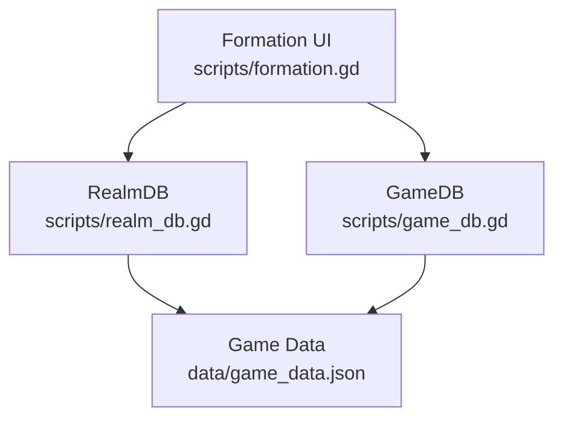
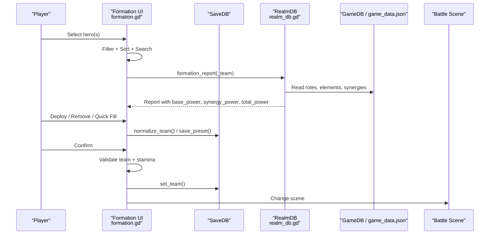
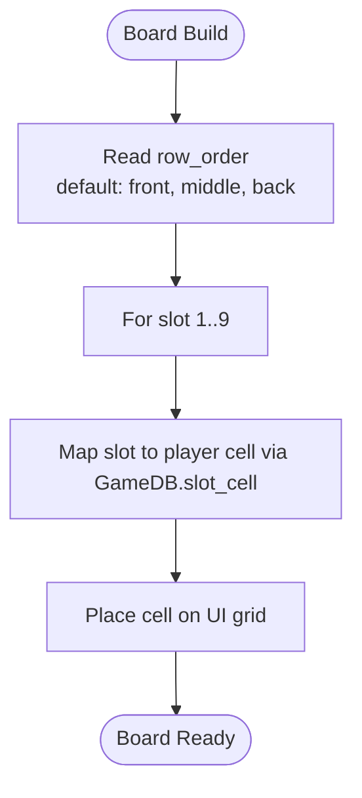
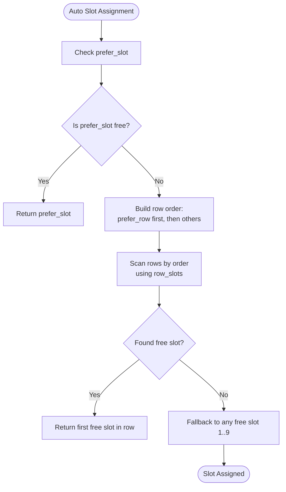
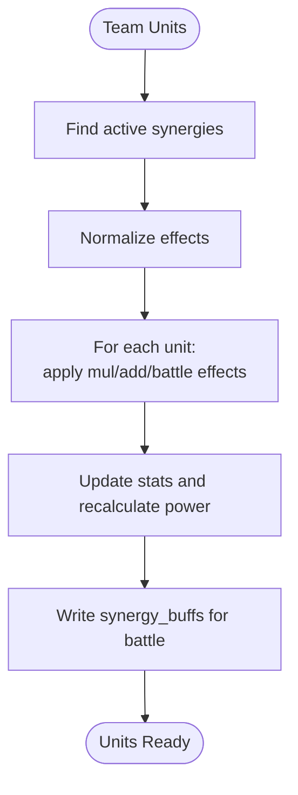
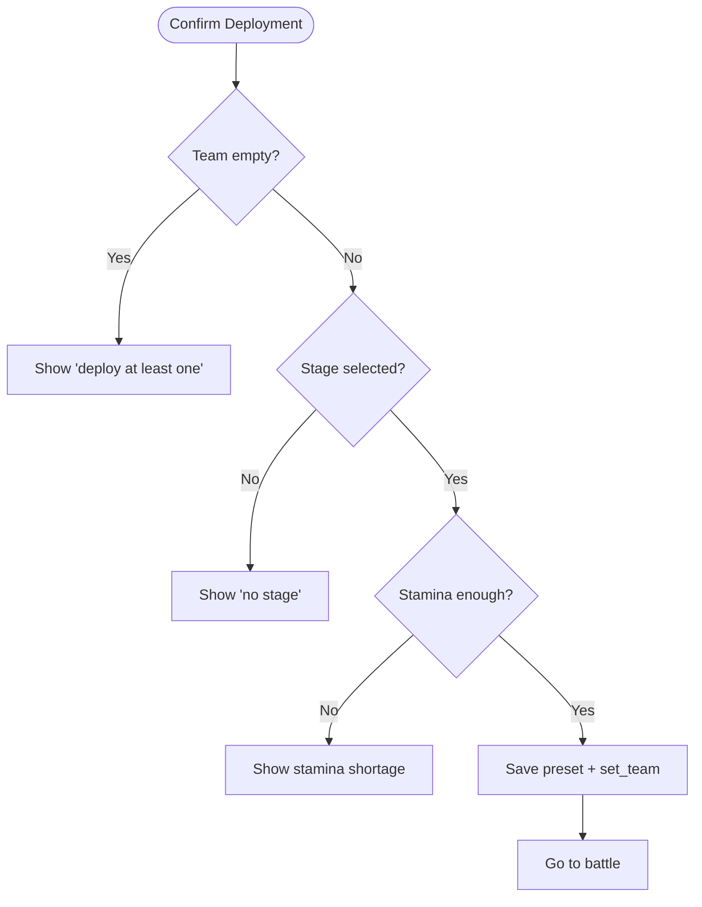
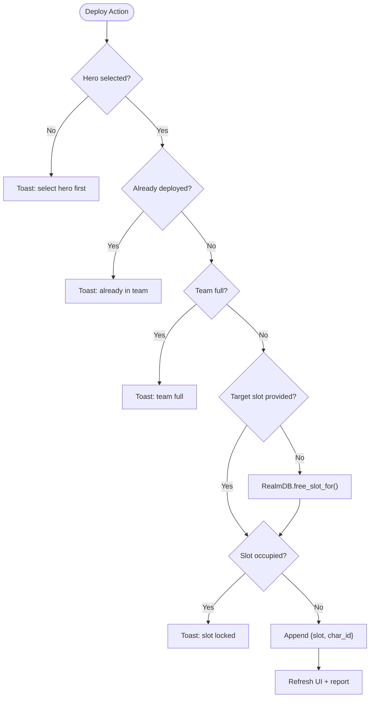
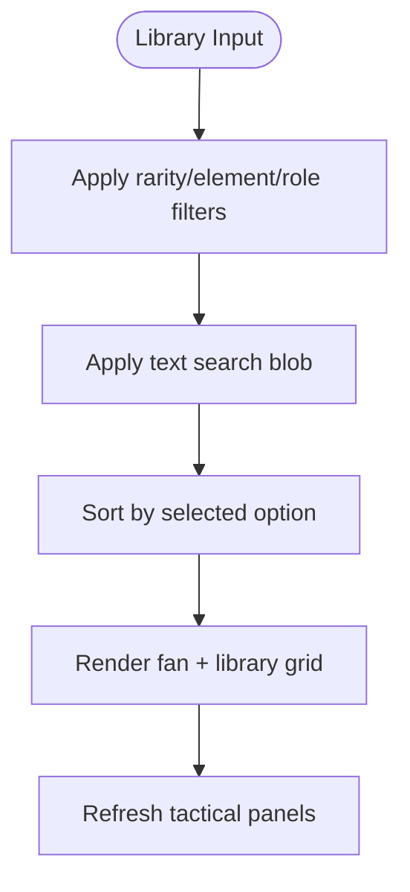
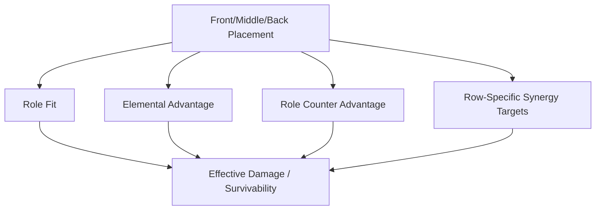
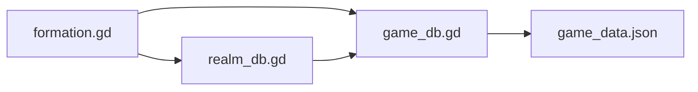

# Formation & Team System

<cite>
**Referenced Files in This Document**   
- [formation.gd](file://scripts/formation.gd)
- [realm_db.gd](file://scripts/realm_db.gd)
- [game_db.gd](file://scripts/game_db.gd)
- [game_data.json](file://data/game_data.json)
</cite>

## Table of Contents
1. [Introduction](#introduction)
2. [Project Structure](#project-structure)
3. [Core Components](#core-components)
4. [Architecture Overview](#architecture-overview)
5. [Detailed Component Analysis](#detailed-component-analysis)
6. [Dependency Analysis](#dependency-analysis)
7. [Performance Considerations](#performance-considerations)
8. [Troubleshooting Guide](#troubleshooting-guide)
9. [Conclusion](#conclusion)

## Introduction
This document explains the formation and team composition system used to build a 3×3 grid-based lineup, assign characters to slots, compute synergy bonuses, and preview how positioning affects battle performance. It covers:

- The 3×3 board layout and row semantics (front / middle / back).
- Role-based placement strategies and preferred rows.
- Synergy bonus rules that apply team-wide or position-specific buffs.
- Slot assignment logic, including automatic slot selection and validation constraints.
- Filtering and sorting for team optimization.
- Practical composition examples and strategy guidance.
- How formation positioning connects to combat outcomes.

The system is configuration-driven: most rules, labels, limits, and synergies live in data rather than hard-coded logic.

## Project Structure
The formation system spans three main layers:

| Layer | Responsibility | Key Files |
|---|---|---|
| UI & Interaction | Selection, filtering, sorting, board rendering, deploy/remove, quick fill, confirm/deploy flow | `scripts/formation.gd` |
| Runtime Data | Stats derivation, synergy evaluation, buff application, report generation, slot helpers | `scripts/realm_db.gd` |
| Configuration | Board geometry, roles, elements, rarities, character definitions, formation settings | `data/game_data.json`, `scripts/game_db.gd` |

**Diagram sources**
- [formation.gd:1-1172](file://scripts/formation.gd#L1-L1172)
- [realm_db.gd:1-498](file://scripts/realm_db.gd#L1-L498)
- [game_db.gd:754-798](file://scripts/game_db.gd#L754-L798)
- [game_data.json:119-369](file://data/game_data.json#L119-L369)

**Section sources**
- [formation.gd:1-1172](file://scripts/formation.gd#L1-L1172)
- [realm_db.gd:1-498](file://scripts/realm_db.gd#L1-L498)
- [game_db.gd:754-798](file://scripts/game_db.gd#L754-L798)
- [game_data.json:119-369](file://data/game_data.json#L119-L369)

## Core Components
- **Formation UI**: Manages hero selection, library filtering/sorting, 3×3 board interaction, preset management, tactical panels, and confirmation flow into battle.
- **RealmDB**: Converts saved cards into final stats, evaluates synergy rules, applies stat multipliers and battle-level buffs, and produces formation reports.
- **GameDB + Game Data**: Provides board layout, role definitions, element relationships, rarity tables, character configs, and formation-related settings such as team size, synergies, and counters.

Key responsibilities:
- Grid positioning uses a shared mapping between logical slots and visual cells so the formation screen and battle scene stay aligned.
- Roles define preferred rows; slot assignment respects those preferences unless overridden by user placement.
- Synergies are declarative: conditions evaluate against the current team, and effects modify stats or provide battle-level buffs.
- Quick fill ranks candidates using base power plus elemental and role counter advantages against the selected stage’s enemies.

**Section sources**
- [formation.gd:612-700](file://scripts/formation.gd#L612-L700)
- [formation.gd:722-804](file://scripts/formation.gd#L722-L804)
- [realm_db.gd:33-70](file://scripts/realm_db.gd#L33-L70)
- [realm_db.gd:80-243](file://scripts/realm_db.gd#L80-L243)
- [game_data.json:119-369](file://data/game_data.json#L119-L369)

## Architecture Overview
The formation pipeline connects UI actions to data computation and then to battle preparation.

**Diagram sources**
- [formation.gd:817-836](file://scripts/formation.gd#L817-L836)
- [formation.gd:1088-1115](file://scripts/formation.gd#L1088-L1115)
- [realm_db.gd:340-359](file://scripts/realm_db.gd#L340-L359)
- [game_db.gd:766-798](file://scripts/game_db.gd#L766-L798)

## Detailed Component Analysis

### 3×3 Grid Positioning Mechanics
The board is a 3×3 grid with nine logical slots. Rows are labeled front, middle, and back. Front is closest to the enemy; back is safest.

- Row names and slot mappings come from the combat board configuration.
- The UI derives cell positions directly from the same slot-to-cell mapping used by the battle scene, ensuring consistent placement across screens.
- Row order can be configured, but defaults to front → middle → back.

**Diagram sources**
- [formation.gd:614-638](file://scripts/formation.gd#L614-L638)
- [game_data.json:133-257](file://data/game_data.json#L133-L257)

**Section sources**
- [formation.gd:614-638](file://scripts/formation.gd#L614-L638)
- [game_data.json:133-257](file://data/game_data.json#L133-L257)

### Role-Based Placement Strategies
Roles define recommended rows and battle roles:

| Role | Preferred Rows | Typical Strategy |
|---|---:|---|
| Tank | Front | Absorb damage, protect allies |
| Warrior | Front, Middle | Melee DPS, flexible frontline/midline |
| Mage | Middle | Magic AOE damage |
| Archer | Middle, Back | Ranged physical DPS |
| Assassin | Back | Target fragile backline enemies |
| Healer | Back | Healing and debuff removal |
| Support | Back | Buffs, control, utility |

Characters also carry a `prefer_slot` hint. When auto-placing, the system tries that exact slot first, then falls back to the preferred row, then other rows in configured order, then any remaining slot.

**Diagram sources**
- [realm_db.gd:370-397](file://scripts/realm_db.gd#L370-L397)
- [game_data.json:303-369](file://data/game_data.json#L303-L369)

**Section sources**
- [realm_db.gd:370-397](file://scripts/realm_db.gd#L370-L397)
- [game_data.json:303-369](file://data/game_data.json#L303-L369)

### Synergy Bonus System
Synergies are declarative rules evaluated against the current team. Each rule has:

- A condition type: member count, row count, role count, element count, rarity count, specific character IDs, or distinct elements.
- One or more effects: stat multipliers, critical hit additions, or battle-level buffs like starting energy, starting shield, or element damage.

Effects can target all units or only a specific row. Stat multipliers are applied per unit, not globally, so row-specific buffs remain row-specific.

**Diagram sources**
- [realm_db.gd:86-120](file://scripts/realm_db.gd#L86-L120)
- [realm_db.gd:129-158](file://scripts/realm_db.gd#L129-L158)
- [realm_db.gd:161-243](file://scripts/realm_db.gd#L161-L243)

**Section sources**
- [realm_db.gd:80-243](file://scripts/realm_db.gd#L80-L243)

### Formation Validation Rules
Validation ensures the team is legal before entering battle:

- At least one hero must be deployed.
- The selected stage must exist.
- Stamina cost must be available at confirmation time.
- Duplicate heroes are rejected.
- Team size cannot exceed the configured maximum.
- Slot conflicts are prevented during deployment.

These checks happen in the UI before saving and transitioning to battle.

**Diagram sources**
- [formation.gd:1088-1115](file://scripts/formation.gd#L1088-L1115)

**Section sources**
- [formation.gd:1088-1115](file://scripts/formation.gd#L1088-L1115)

### Slot Assignment Logic
Slot assignment supports both manual and automatic placement:

- Manual placement: click an empty board cell to deploy the currently selected hero.
- Auto placement: if no slot is specified, the system finds the best free slot using preference logic.
- Removal: clicking a deployed cell removes that hero.
- Quick fill: fills the team up to the maximum using a scoring function that combines base power and counter advantage against the current stage’s enemies.

**Diagram sources**
- [formation.gd:722-743](file://scripts/formation.gd#L722-L743)
- [realm_db.gd:370-397](file://scripts/realm_db.gd#L370-L397)

**Section sources**
- [formation.gd:722-743](file://scripts/formation.gd#L722-L743)
- [realm_db.gd:370-397](file://scripts/realm_db.gd#L370-L397)

### Position-Specific Modifiers
Position matters because:

- Roles have preferred rows.
- Some synergies target specific rows.
- The tactical panel shows recommended rows based on role configuration.
- Characters show a “recommended row” hint when not deployed.

This means placing a mage in the front row may work mechanically, but it contradicts design intent and can reduce effectiveness.

**Section sources**
- [formation.gd:1025-1046](file://scripts/formation.gd#L1025-L1046)
- [game_data.json:303-369](file://data/game_data.json#L303-L369)

### Filtering and Sorting Capabilities
The library supports:

- Filters: rarity, element, role.
- Sorting: power, level, rarity, element, name.
- Text search across name, title, rarity label, element name, and role name.

These tools help optimize team building by quickly finding high-power or strategically useful heroes.

**Diagram sources**
- [formation.gd:403-483](file://scripts/formation.gd#L403-L483)

**Section sources**
- [formation.gd:237-351](file://scripts/formation.gd#L237-L351)
- [formation.gd:403-483](file://scripts/formation.gd#L403-L483)

### Relationship Between Formation Positioning and Battle Performance
Formation positioning influences battle performance through several channels:

- **Role alignment**: Tanks in front absorb damage; healers/support in back sustain the team; mages/archers in middle/back deal damage safely.
- **Elemental advantage**: Elemental counters increase damage; the tactical panel shows which enemies are countered.
- **Role counters**: Certain roles gain advantages against specific enemy roles.
- **Synergy targeting**: Some buffs apply only to specific rows, making correct placement essential.
- **Quick fill scoring**: The auto-fill algorithm considers both base power and counter advantage against the current stage’s enemies.

**Diagram sources**
- [formation.gd:807-812](file://scripts/formation.gd#L807-L812)
- [realm_db.gd:280-333](file://scripts/realm_db.gd#L280-L333)
- [game_data.json:119-117](file://data/game_data.json#L119-L117)

**Section sources**
- [formation.gd:807-812](file://scripts/formation.gd#L807-L812)
- [realm_db.gd:280-333](file://scripts/realm_db.gd#L280-L333)
- [game_data.json:59-117](file://data/game_data.json#L59-L117)

## Dependency Analysis
The formation system depends on layered abstractions:

- UI depends on GameDB for configuration and RealmDB for computed reports.
- RealmDB depends on GameDB for roles, elements, synergies, and board geometry.
- GameDB reads from game_data.json.

**Diagram sources**
- [formation.gd:1-1172](file://scripts/formation.gd#L1-L1172)
- [realm_db.gd:1-498](file://scripts/realm_db.gd#L1-L498)
- [game_db.gd:754-798](file://scripts/game_db.gd#L754-L798)
- [game_data.json:119-369](file://data/game_data.json#L119-L369)

**Section sources**
- [formation.gd:1-1172](file://scripts/formation.gd#L1-L1172)
- [realm_db.gd:1-498](file://scripts/realm_db.gd#L1-L498)
- [game_db.gd:754-798](file://scripts/game_db.gd#L754-L798)
- [game_data.json:119-369](file://data/game_data.json#L119-L369)

## Performance Considerations
- Filtering and sorting operate on the filtered view array, not the full roster, keeping UI updates responsive.
- Synergy evaluation iterates over configured rules and current units; this is lightweight for typical team sizes.
- Formation reports compute base power, activate synergies, apply effects, and recompute total power once per refresh.
- Quick fill builds a temporary ranked list and stops once the team is full.

[No sources needed since this section provides general guidance]

## Troubleshooting Guide
Common issues and resolutions:

| Issue | Symptom | Resolution |
|---|---|---|
| No hero selected | Deploy button disabled or toast says to select first | Choose a hero from the fan or library |
| Team full | Toast indicates team limit reached | Remove a hero before deploying another |
| Duplicate hero | Toast says hero already deployed | Remove existing instance or swap |
| Slot locked | Toast says slot is occupied | Choose another slot |
| No stamina | Confirmation fails with stamina shortage | Wait for stamina regen or choose lower-cost stage |
| No synergy hints | Tactical panel shows no synergy | Add required members, roles, elements, or rarities per configured rules |
| Wrong row placement | Character looks out of place or synergy not applying | Use role-preferred rows or check row-targeted synergies |

**Section sources**
- [formation.gd:722-743](file://scripts/formation.gd#L722-L743)
- [formation.gd:1088-1115](file://scripts/formation.gd#L1088-L1115)
- [realm_db.gd:256-276](file://scripts/realm_db.gd#L256-L276)

## Conclusion
The formation and team system centers on a configurable 3×3 grid where role-based placement, elemental and role counters, and declarative synergies combine to shape team strength. The UI makes it easy to filter, sort, preview, and validate teams, while RealmDB computes final stats and battle-ready buffs. Effective compositions balance front-line durability, mid-line damage, and back-line support, while leveraging synergies and counters tailored to the chosen stage.

[No sources needed since this section summarizes without analyzing specific files]