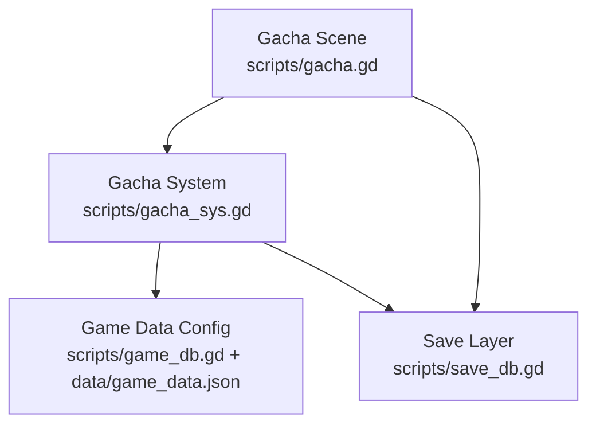
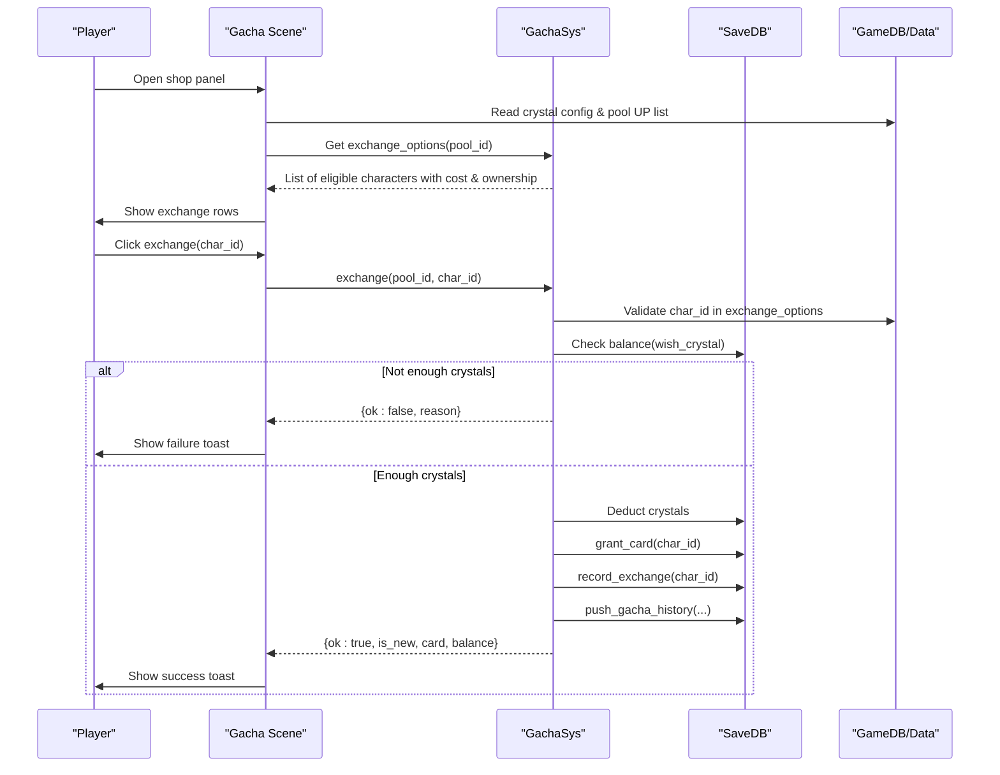
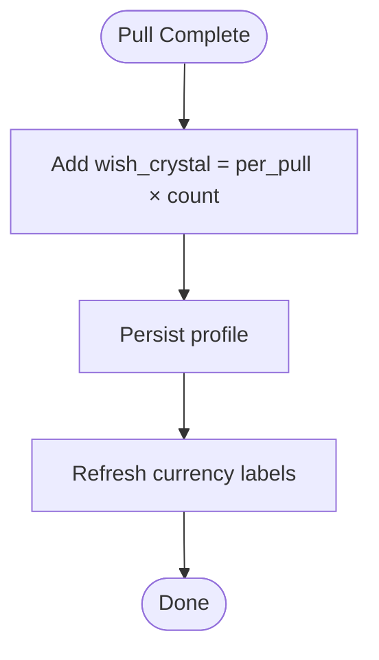
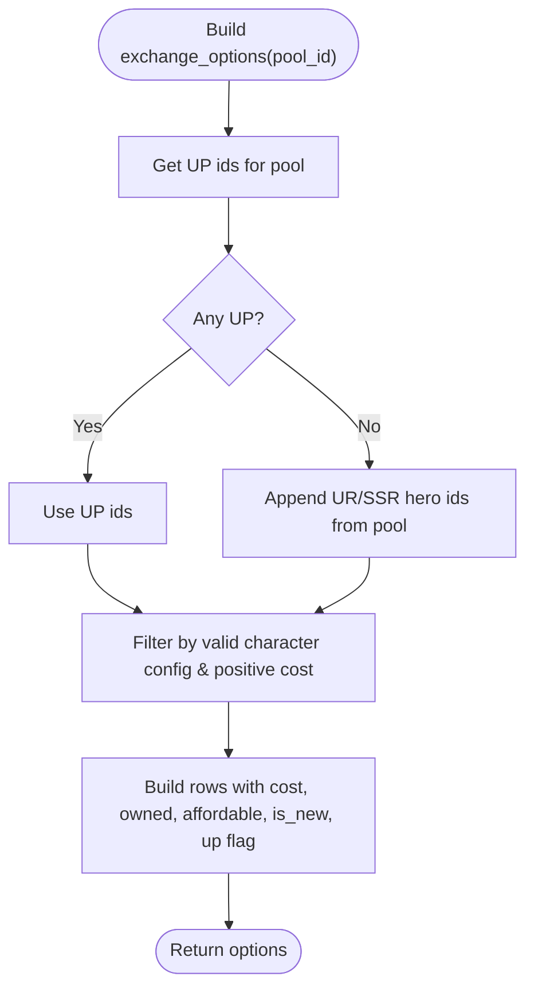
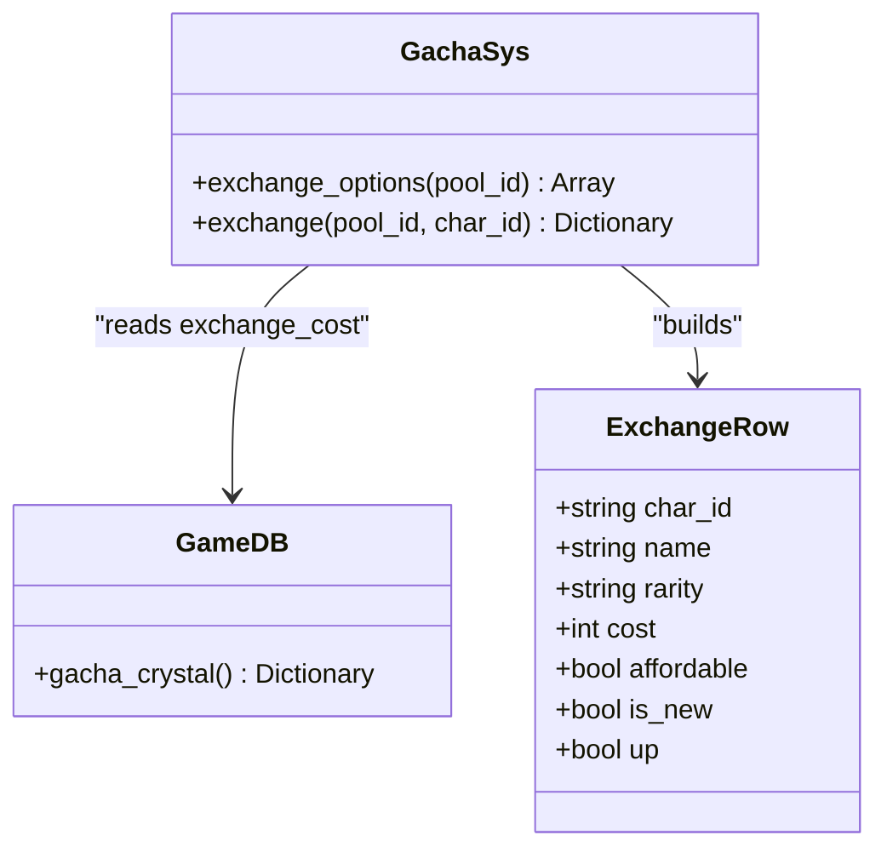
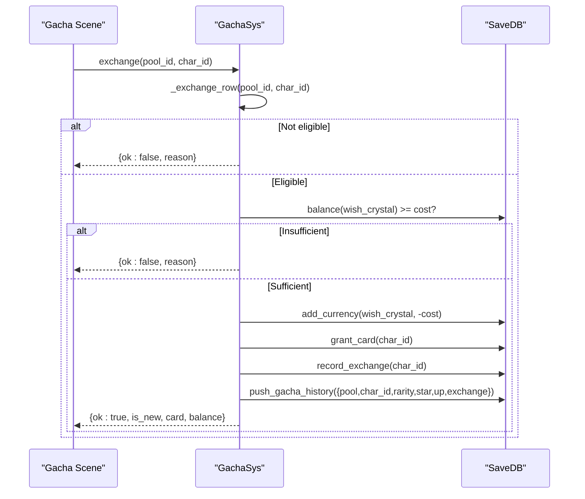
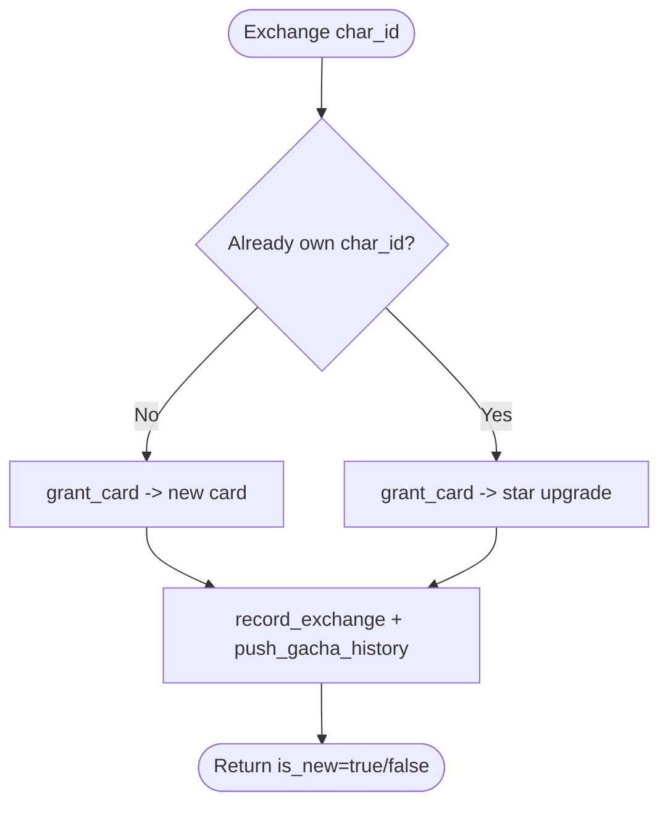
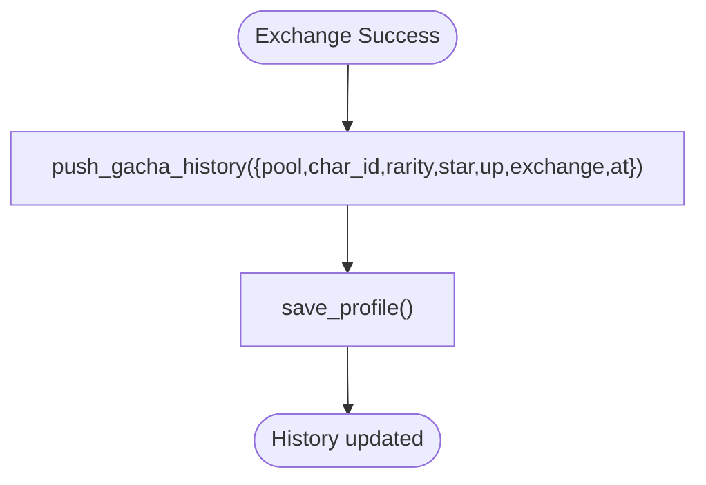
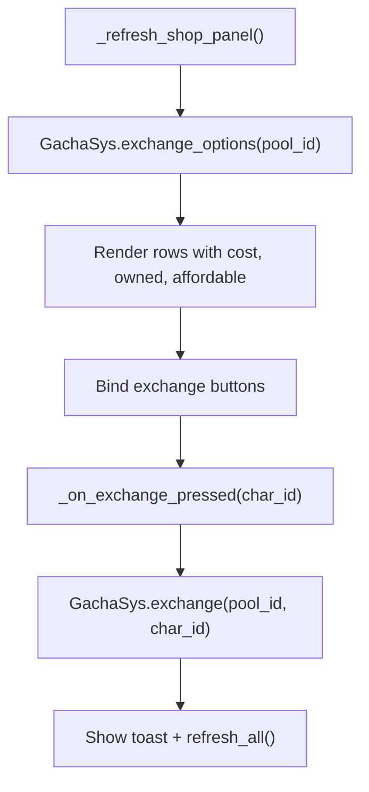
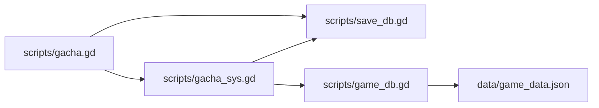

# Crystal Exchange Shop

<cite>
**Referenced Files in This Document**
- [gacha.gd](file://scripts/gacha.gd)
- [gacha_sys.gd](file://scripts/gacha_sys.gd)
- [game_db.gd](file://scripts/game_db.gd)
- [save_db.gd](file://scripts/save_db.gd)
- [game_data.json](file://data/game_data.json)
- [gacha_suite.gd](file://tools/suites/gacha_suite.gd)
</cite>

## Table of Contents
1. [Introduction](#introduction)
2. [Project Structure](#project-structure)
3. [Core Components](#core-components)
4. [Architecture Overview](#architecture-overview)
5. [Detailed Component Analysis](#detailed-component-analysis)
6. [Dependency Analysis](#dependency-analysis)
7. [Performance Considerations](#performance-considerations)
8. [Troubleshooting Guide](#troubleshooting-guide)
9. [Conclusion](#conclusion)

## Introduction
This document explains the crystal exchange shop system: how wish crystals are earned through pulls, how they are spent to directly exchange for characters, and how exchange eligibility is determined. It also documents the pricing structure by character rarity, the fallback logic when no UP characters exist, the full exchange flow including currency deduction and result handling, ownership checks, and integration with the main gacha history. Examples are provided to clarify typical exchange scenarios and the relationship between exchange items and pull results.

## Project Structure
The crystal exchange shop is implemented across a small set of focused modules:
- UI layer: Gacha scene script handles shop panel rendering, user interaction, and feedback.
- System layer: GachaSys encapsulates exchange eligibility, pricing, currency operations, card granting, and history recording.
- Data layer: GameDB reads configuration such as crystal currency, per-pull earnings, exchange costs, pool definitions, and UP lists. SaveDB persists balances, cards, pity counters, and gacha history.

**Diagram sources**
- [gacha.gd:500-599](file://scripts/gacha.gd#L500-L599)
- [gacha_sys.gd:159-348](file://scripts/gacha_sys.gd#L159-L348)
- [game_db.gd:511-523](file://scripts/game_db.gd#L511-L523)
- [save_db.gd:26-99](file://scripts/save_db.gd#L26-L99)

**Section sources**
- [gacha.gd:500-599](file://scripts/gacha.gd#L500-L599)
- [gacha_sys.gd:159-348](file://scripts/gacha_sys.gd#L159-L348)
- [game_db.gd:511-523](file://scripts/game_db.gd#L511-L523)
- [save_db.gd:26-99](file://scripts/save_db.gd#L26-L99)

## Core Components
- Wish crystal currency: Defined in game data as “wish_crystal”, with display name, icon, color, and per-pull earnings.
- Exchange pricing: A map from rarity to cost; UR and SSR both cost 120 wish crystals.
- Exchange eligibility: Determined by current pool’s UP list; if empty, falls back to UR/SSR entries in the pool.
- Exchange execution: Validates eligibility, checks balance, deducts crystals, grants or upgrades the character, records exchange count, pushes gacha history, and returns structured result.
- UI integration: Renders available exchange options, affordability, ownership state, and shows success/failure feedback.

Key behaviors:
- Each pull awards one wish crystal.
- Exchange is limited to eligible characters (UP first, then UR/SSR fallback).
- If the player already owns the character, exchange upgrades star level instead of adding another copy.
- All exchanges are recorded in gacha history with an “exchange” flag.

**Section sources**
- [game_data.json:1139-1150](file://data/game_data.json#L1139-L1150)
- [gacha_sys.gd:50-59](file://scripts/gacha_sys.gd#L50-L59)
- [gacha_sys.gd:159-188](file://scripts/gacha_sys.gd#L159-L188)
- [gacha_sys.gd:320-348](file://scripts/gacha_sys.gd#L320-L348)
- [gacha.gd:500-599](file://scripts/gacha.gd#L500-L599)

## Architecture Overview
The exchange shop integrates three layers:
- UI triggers exchange via button press.
- GachaSys validates eligibility, computes cost, performs persistence operations, and emits signals.
- SaveDB persists currency changes, card grants, exchange counts, and gacha history.

**Diagram sources**
- [gacha.gd:579-590](file://scripts/gacha.gd#L579-L590)
- [gacha_sys.gd:320-348](file://scripts/gacha_sys.gd#L320-L348)
- [save_db.gd:26-99](file://scripts/save_db.gd#L26-L99)
- [game_data.json:1139-1150](file://data/game_data.json#L1139-L1150)

## Detailed Component Analysis

### Wish Crystal Earnings and Currency
- Currency ID: “wish_crystal”.
- Per-pull earnings: 1 crystal per pull.
- Balance access: Through GachaSys.crystals() and SaveDB.balance().

Earning flow:
- Pull completes → SaveDB.add_currency("wish_crystal", gained, false) → Result includes “crystals” field.
- UI displays current crystal balance in multiple places (currency refresh, shop header, footer stats).

**Diagram sources**
- [gacha_sys.gd:295-304](file://scripts/gacha_sys.gd#L295-L304)
- [gacha.gd:267-277](file://scripts/gacha.gd#L267-L277)

**Section sources**
- [game_data.json:1139-1150](file://data/game_data.json#L1139-L1150)
- [gacha_sys.gd:50-59](file://scripts/gacha_sys.gd#L50-L59)
- [gacha_sys.gd:295-304](file://scripts/gacha_sys.gd#L295-L304)
- [gacha.gd:267-277](file://scripts/gacha.gd#L267-L277)

### Exchange Eligibility and Fallback Logic
Eligibility rules:
- Primary candidates: Current pool’s UP heroes.
- Fallback: If no UP heroes exist, include all UR and SSR hero entries from the pool.
- Only characters with a positive exchange cost are included.

**Diagram sources**
- [gacha_sys.gd:159-188](file://scripts/gacha_sys.gd#L159-L188)

**Section sources**
- [gacha_sys.gd:159-188](file://scripts/gacha_sys.gd#L159-L188)

### Exchange Pricing Structure
Pricing is defined by rarity:
- UR: 120 wish crystals
- SSR: 120 wish crystals

The UI shows the required cost and whether the player can afford it. Ownership status determines whether the exchange grants a new card or upgrades stars.

**Diagram sources**
- [gacha_sys.gd:159-188](file://scripts/gacha_sys.gd#L159-L188)
- [game_data.json:1145-1148](file://data/game_data.json#L1145-L1148)

**Section sources**
- [game_data.json:1145-1148](file://data/game_data.json#L1145-L1148)
- [gacha_sys.gd:159-188](file://scripts/gacha_sys.gd#L159-L188)
- [gacha.gd:519-576](file://scripts/gacha.gd#L519-L576)

### Exchange Process Flow
The exchange process enforces eligibility, checks balance, deducts currency, grants or upgrades the character, records exchange count, updates gacha history, and returns a structured result.

**Diagram sources**
- [gacha_sys.gd:320-348](file://scripts/gacha_sys.gd#L320-L348)
- [gacha.gd:579-590](file://scripts/gacha.gd#L579-L590)

**Section sources**
- [gacha_sys.gd:320-348](file://scripts/gacha_sys.gd#L320-L348)
- [gacha.gd:579-590](file://scripts/gacha.gd#L579-L590)

### Ownership Checking and Star Upgrades
- Ownership check: SaveDB.find_card(char_id) determines if the character exists.
- New card: If not owned, grant_card adds a new entry.
- Duplicate: If owned, grant_card upgrades star level (capped by save layer).
- UI reflects this via “is_new” and text like “已入队（新卡）” or “升星成功”.

**Diagram sources**
- [gacha_sys.gd:331-338](file://scripts/gacha_sys.gd#L331-L338)
- [gacha.gd:587-590](file://scripts/gacha.gd#L587-L590)

**Section sources**
- [gacha_sys.gd:331-338](file://scripts/gacha_sys.gd#L331-L338)
- [gacha.gd:587-590](file://scripts/gacha.gd#L587-L590)

### Integration with Main Gacha History
Every exchange is pushed into the gacha history with fields indicating it came from the shop:
- pool: current pool id
- char_id: exchanged character
- rarity: character rarity
- star: resulting star level
- up: true
- exchange: true
- at: timestamp

This allows players to see exchanges alongside normal pulls in the history view.

**Diagram sources**
- [gacha_sys.gd:334-338](file://scripts/gacha_sys.gd#L334-L338)

**Section sources**
- [gacha_sys.gd:334-338](file://scripts/gacha_sys.gd#L334-L338)

### UI Rendering and Interaction
- Shop panel renders each exchange option with portrait, name, rarity tag, ownership state, cost, and exchange button.
- Button disabled if not affordable.
- On click, calls GachaSys.exchange and shows toast messages for success or failure.
- Refreshes all UI elements after successful exchange.

**Diagram sources**
- [gacha.gd:500-599](file://scripts/gacha.gd#L500-L599)

**Section sources**
- [gacha.gd:500-599](file://scripts/gacha.gd#L500-L599)

## Dependency Analysis
- GachaScene depends on GachaSys for business logic and on SaveDB for persistence.
- GachaSys depends on GameDB for configuration and SaveDB for state.
- GameDB reads from game_data.json.
- SaveDB persists wallet, cards, pity, and history.

**Diagram sources**
- [gacha.gd:500-599](file://scripts/gacha.gd#L500-L599)
- [gacha_sys.gd:159-348](file://scripts/gacha_sys.gd#L159-L348)
- [game_db.gd:511-523](file://scripts/game_db.gd#L511-L523)
- [save_db.gd:26-99](file://scripts/save_db.gd#L26-L99)

**Section sources**
- [gacha.gd:500-599](file://scripts/gacha.gd#L500-L599)
- [gacha_sys.gd:159-348](file://scripts/gacha_sys.gd#L159-L348)
- [game_db.gd:511-523](file://scripts/game_db.gd#L511-L523)
- [save_db.gd:26-99](file://scripts/save_db.gd#L26-L99)

## Performance Considerations
- Exchange options are computed per pool and cached only during UI refresh; this is lightweight since it iterates over UP and UR/SSR entries.
- Currency operations and card grants are persisted once per exchange, minimizing disk writes.
- No heavy computation in UI path; most logic resides in GachaSys.

[No sources needed since this section provides general guidance]

## Troubleshooting Guide
Common issues and resolutions:
- Exchange fails due to insufficient crystals:
  - Reason message indicates shortfall and required cost.
  - Solution: Earn more wish crystals via pulls or adjust test data.
- Character not in exchange list:
  - The character must be either a current UP hero or part of UR/SSR fallback for the selected pool.
  - Solution: Switch to a pool that includes the character or wait for appropriate pool rotation.
- Exchange does not increase card count:
  - Expected behavior if the character is already owned; exchange upgrades star level instead.
  - Verify “is_new” flag and toast message.

Validation references:
- Tests assert insufficient crystal rejection and successful exchange with 120 crystals.
- Tests verify exchange count increments and duplicate exchange upgrades star rather than adding a new card.

**Section sources**
- [gacha_sys.gd:320-348](file://scripts/gacha_sys.gd#L320-L348)
- [gacha_suite.gd:422-445](file://tools/suites/gacha_suite.gd#L422-L445)

## Conclusion
The crystal exchange shop provides a deterministic safety net for acquiring high-rarity characters. Players earn wish crystals through pulls and spend them to directly exchange for eligible characters. The system prioritizes current UP heroes and falls back to UR/SSR entries when none are present. Exchange pricing is uniform across UR and SSR at 120 wish crystals. The exchange flow ensures correct currency deduction, ownership handling, star upgrades, exchange counting, and history integration. The UI clearly communicates eligibility, affordability, and outcomes, making the system transparent and reliable.

[No sources needed since this section summarizes without analyzing specific files]