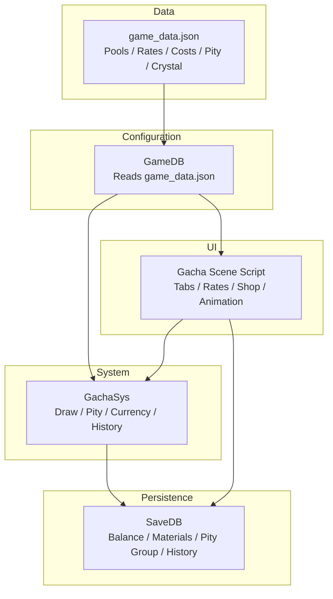
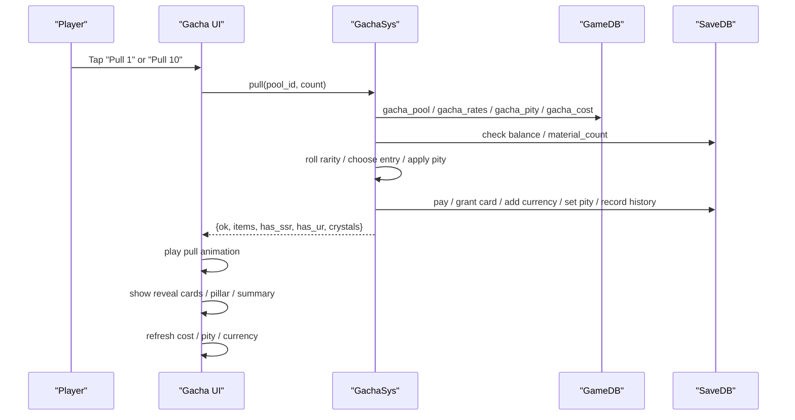
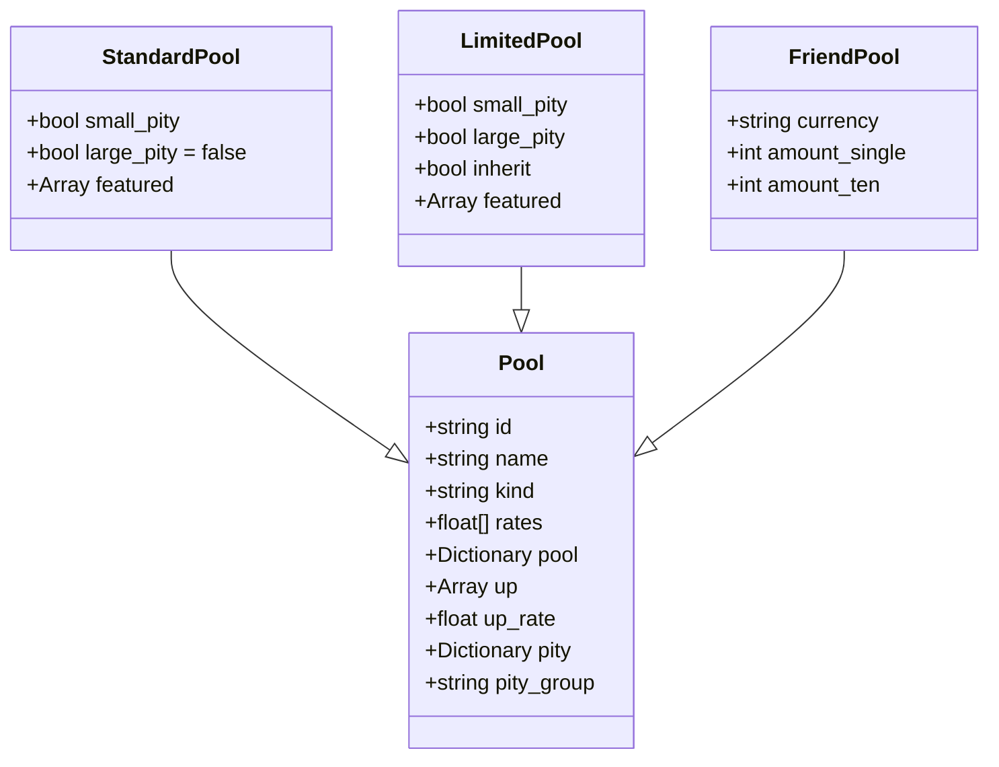
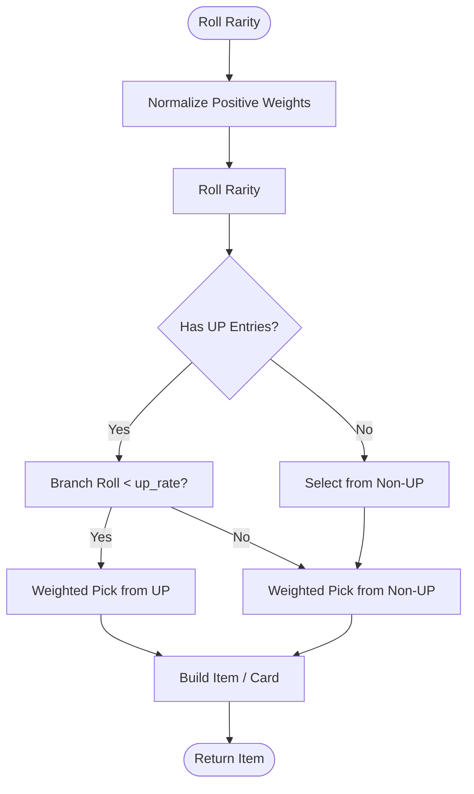
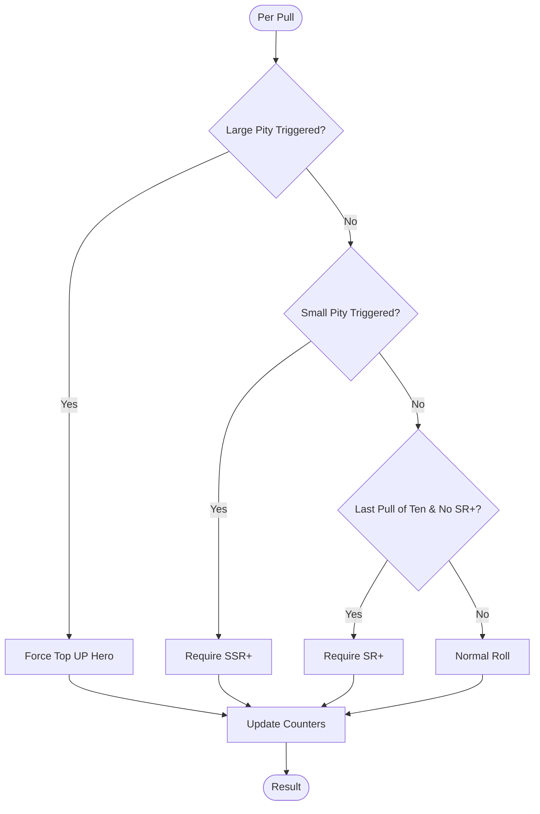
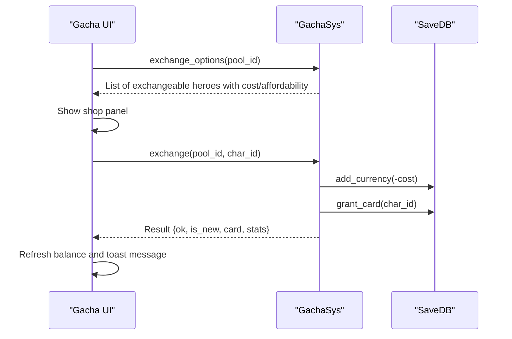
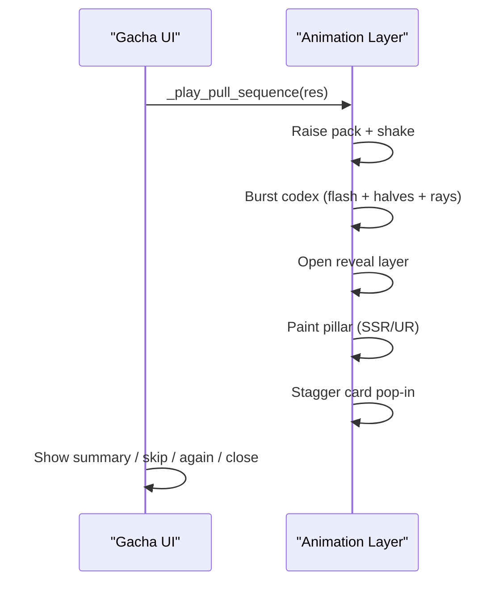
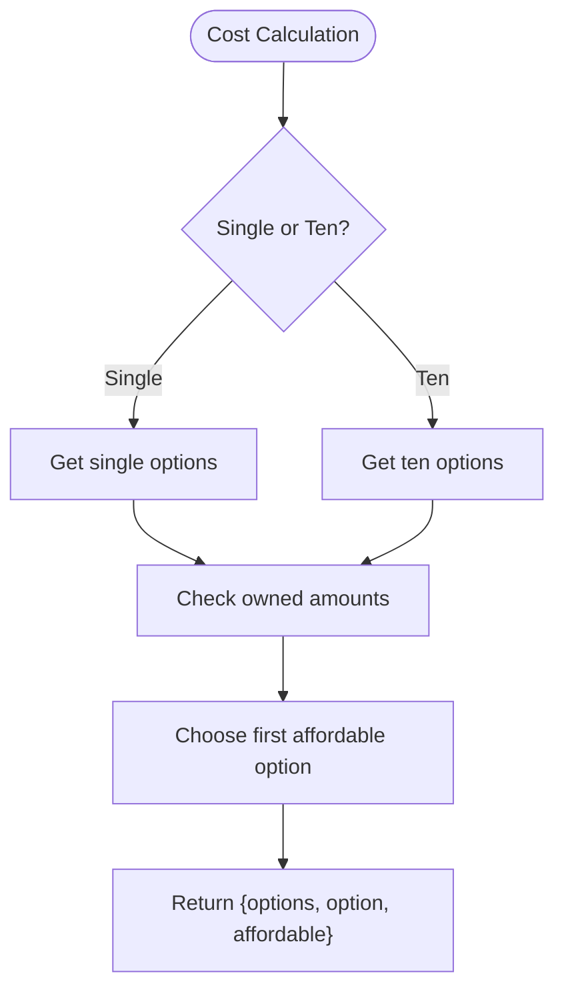
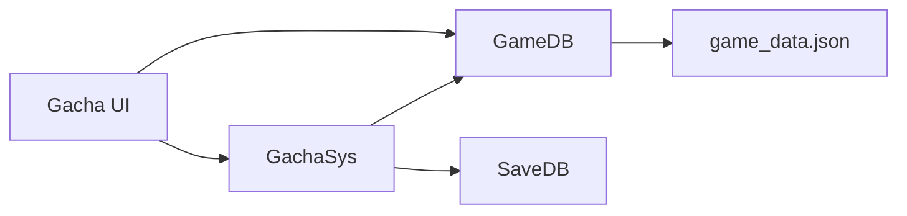

# Gacha & Summoning System

<cite>
**Referenced Files in This Document**   
- [gacha.gd](file://scripts/gacha.gd)
- [gacha_sys.gd](file://scripts/gacha_sys.gd)
- [game_db.gd](file://scripts/game_db.gd)
- [game_data.json](file://data/game_data.json)
- [gacha.tscn](file://scenes/gacha.tscn)
- [gacha_suite.gd](file://tools/suites/gacha_suite.gd)
</cite>

## Table of Contents
1. [Introduction](#introduction)
2. [Project Structure](#project-structure)
3. [Core Components](#core-components)
4. [Architecture Overview](#architecture-overview)
5. [Detailed Component Analysis](#detailed-component-analysis)
6. [Dependency Analysis](#dependency-analysis)
7. [Performance Considerations](#performance-considerations)
8. [Troubleshooting Guide](#troubleshooting-guide)
9. [Conclusion](#conclusion)
10. [Appendices](#appendices)

## Introduction
This document explains the gacha and summoning system implemented in the project. It covers:
- The multi-pool design supporting standard, limited, and friend gacha types.
- Probability distribution, UP mechanics, pity guarantees (small and large), and ten-pull guarantee.
- Crystal exchange shop for guaranteed access to featured heroes.
- Pull animation flow and result presentation.
- Integration with player currencies and resource management.
- Random number generation and fairness considerations.

The system is split into a configuration layer, a stateful system layer, and a UI layer. Configuration defines pool rules; the system performs draws, applies pity logic, manages resources, and records history; the UI binds data, handles interaction, and plays animations.

## Project Structure
The gacha feature spans three main layers:
- Configuration: `GameDB` reads `game_data.json` and exposes typed getters for pools, rates, costs, pity, crystal shop, and reveal settings.
- System: `GachaSys` encapsulates all draw logic, randomness, pity tracking, currency deduction, item granting, and history recording.
- UI: `Gacha` scene script connects `GameDB` and `SaveDB` results to the interface, builds tabs, shows probabilities, runs pull animations, and opens rate/shops panels.

**Diagram sources**
- [game_db.gd:281-538](file://scripts/game_db.gd#L281-L538)
- [gacha_sys.gd:1-19](file://scripts/gacha_sys.gd#L1-L19)
- [gacha.gd:1-15](file://scripts/gacha.gd#L1-L15)
- [game_data.json:1096-1500](file://data/game_data.json#L1096-L1500)

**Section sources**
- [game_db.gd:281-538](file://scripts/game_db.gd#L281-L538)
- [gacha_sys.gd:1-19](file://scripts/gacha_sys.gd#L1-L19)
- [gacha.gd:1-15](file://scripts/gacha.gd#L1-L15)
- [game_data.json:1096-1500](file://data/game_data.json#L1096-L1500)

## Core Components
- GameDB: Pure read-only configuration accessor for gacha pools, rates, tickets, costs, pity groups, ten-pull guarantee, crystal shop, reveal animation config, and rate notices.
- GachaSys: Stateful core that performs pulls, resolves rarity and content selection, enforces pity and ten-pull guarantees, deducts payment, grants items/cards, accumulates wish crystals, and writes history.
- Gacha UI: Scene controller that renders pool tabs, cost affordance, pity bars, recent heroes, probability panel, crystal shop, and pull animations.

Key responsibilities:
- Pool selection and switching.
- Cost calculation and affordability checks.
- Probability display and transparency.
- Pity state visualization and persistence.
- Crystal accumulation and exchange shop.
- Pull sequence animation and result reveal.

**Section sources**
- [game_db.gd:281-538](file://scripts/game_db.gd#L281-L538)
- [gacha_sys.gd:1-19](file://scripts/gacha_sys.gd#L1-L19)
- [gacha.gd:117-125](file://scripts/gacha.gd#L117-L125)

## Architecture Overview
The gacha workflow follows a clear separation of concerns:
- UI triggers a pull or exchange.
- System validates pool, calculates cost, rolls outcomes, applies pity, updates balances, and emits signals.
- UI reacts to results, plays animations, and refreshes displays.

**Diagram sources**
- [gacha.gd:604-625](file://scripts/gacha.gd#L604-L625)
- [gacha_sys.gd:203-317](file://scripts/gacha_sys.gd#L203-L317)
- [game_db.gd:281-538](file://scripts/game_db.gd#L281-L538)

## Detailed Component Analysis

### Multi-Pool System: Standard, Limited, Friend
The project defines three gacha pool types:
- Standard pool: Always available, no UP heroes, full pool uniform distribution, small pity enabled, no large pity.
- Limited pool: Featured UR/SSR UP heroes with an up-rate share, both small and large pity enabled, cross-period inheritance.
- Friend pool: Uses guild tokens, no UR, no pity, designed for daily grinding.

Pool configuration includes:
- id, name, tag, kind, accent color, description.
- ticket type or direct currency cost.
- rates per rarity.
- pity group and flags.
- up list and up_rate.
- pool entries per rarity (heroes and optional items).

**Diagram sources**
- [game_data.json:1210-1490](file://data/game_data.json#L1210-L1490)
- [game_db.gd:291-420](file://scripts/game_db.gd#L291-L420)

**Section sources**
- [game_data.json:1210-1490](file://data/game_data.json#L1210-L1490)
- [game_db.gd:291-420](file://scripts/game_db.gd#L291-L420)
- [gacha_suite.gd:78-111](file://tools/suites/gacha_suite.gd#L78-L111)

### Probability Distribution and UP Mechanics
Probability distribution is defined per pool by rarity weights. GameDB normalizes positive weights to sum to 1.0, ensuring robustness against missing entries. Within a chosen rarity, the system splits between UP and non-UP entries using the pool’s up_rate. If only UP entries exist for a rarity, both branches resolve to the same hero but are marked accordingly.

Key behaviors:
- Rates are normalized per pool.
- Valid rarities are those present in the pool.
- UP selection uses a branch roll against up_rate.
- Weighted selection within each branch determines the specific entry.

**Diagram sources**
- [game_db.gd:326-388](file://scripts/game_db.gd#L326-L388)
- [gacha_sys.gd:364-430](file://scripts/gacha_sys.gd#L364-L430)

**Section sources**
- [game_db.gd:326-388](file://scripts/game_db.gd#L326-L388)
- [gacha_sys.gd:364-430](file://scripts/gacha_sys.gd#L364-L430)

### Pity Mechanics: Small Guarantee, Large Guarantee, Ten-Pull Guarantee
Pity tracks two counters per pity group:
- Small pity: Guarantees at least SSR+ after N pulls without SSR+.
- Large pity: Guarantees the current period’s top UP hero after M pulls without UP.
- Ten-pull guarantee: Ensures SR+ on the last pull of a ten-pull if not already achieved.

Rules:
- Small pity resets when pulling SSR+; otherwise increments.
- Large pity resets when pulling UP; otherwise increments.
- Ten-pull guarantee sets minimum rarity on the final pull if not met.
- Pity groups allow cross-period inheritance for limited pools.

**Diagram sources**
- [gacha_sys.gd:221-276](file://scripts/gacha_sys.gd#L221-L276)
- [game_db.gd:468-508](file://scripts/game_db.gd#L468-L508)

**Section sources**
- [gacha_sys.gd:221-276](file://scripts/gacha_sys.gd#L221-L276)
- [game_db.gd:468-508](file://scripts/game_db.gd#L468-L508)
- [gacha_suite.gd:105-111](file://tools/suites/gacha_suite.gd#L105-L111)

### Crystal Exchange Shop
The crystal shop allows players to spend wish crystals to directly obtain featured heroes:
- Priority goes to current UP heroes; if none, falls back to UR/SSR in the pool.
- Each hero has a cost based on rarity.
- New heroes are added to inventory; duplicates star up the existing card.
- UI shows balance, affordability, and status (new vs duplicate).

**Diagram sources**
- [gacha.gd:502-590](file://scripts/gacha.gd#L502-L590)
- [gacha_sys.gd:159-188](file://scripts/gacha_sys.gd#L159-L188)
- [gacha_sys.gd:320-348](file://scripts/gacha_sys.gd#L320-L348)

**Section sources**
- [gacha.gd:502-590](file://scripts/gacha.gd#L502-L590)
- [gacha_sys.gd:159-188](file://scripts/gacha_sys.gd#L159-L188)
- [gacha_sys.gd:320-348](file://scripts/gacha_sys.gd#L320-L348)

### Pull Animation System and Result Presentation
The pull animation sequence:
- Idle breathing and orbit ring rotation.
- Pack raise and shake.
- Codex burst: white flash, halves scatter, radial light rays.
- Pillar effect for SSR/UR: purple or rainbow pillar with screen shake.
- Cards pop in staggered order.
- Summary text indicates highest rarity and whether UR/SSR appeared.
- Skip button jumps to static result view.

**Diagram sources**
- [gacha.gd:667-795](file://scripts/gacha.gd#L667-L795)

**Section sources**
- [gacha.gd:642-795](file://scripts/gacha.gd#L642-L795)

### Currencies, Tickets, and Payment Options
Payment options are configured per pool and size (single/ten):
- Ticket-first approach: basic/advanced tickets preferred.
- Fallback currency: bound gems or pool-specific currency (friend pool uses guild tokens).
- Affordability computed from owned amounts; UI disables buttons if insufficient.

Examples:
- Standard single: ticket_basic ×1 or bound_gem ×160.
- Standard ten: ticket_advanced ×10 or bound_gem ×1600.
- Friend single: guild_token ×10.

**Diagram sources**
- [gacha_sys.gd:100-129](file://scripts/gacha_sys.gd#L100-L129)
- [game_db.gd:407-465](file://scripts/game_db.gd#L407-L465)

**Section sources**
- [gacha_sys.gd:100-129](file://scripts/gacha_sys.gd#L100-L129)
- [game_db.gd:407-465](file://scripts/game_db.gd#L407-L465)
- [gacha_suite.gd:83-103](file://tools/suites/gacha_suite.gd#L83-L103)

### Random Number Generation and Fairness
Randomness is centralized in `GachaSys`:
- A `RandomNumberGenerator` instance is seeded once at ready time.
- Free mode supports fixed seeds for deterministic testing.
- Core decision functions (`pick_rarity`, `choose_entry`) accept explicit roll values, enabling unit tests to assert boundary conditions without relying on global RNG.
- Rates are normalized; invalid rarities are excluded; weighted selection ensures proportional distribution.

Fairness considerations:
- Deterministic testing via seed injection.
- Pure-function probability logic decoupled from side effects.
- Transparent probability display and rate notices.

**Section sources**
- [gacha_sys.gd:25-29](file://scripts/gacha_sys.gd#L25-L29)
- [gacha_sys.gd:203-208](file://scripts/gacha_sys.gd#L203-L208)
- [gacha_sys.gd:364-430](file://scripts/gacha_sys.gd#L364-L430)
- [game_db.gd:326-344](file://scripts/game_db.gd#L326-L344)

## Dependency Analysis
High-level dependencies:
- `Gacha` UI depends on `GameDB` for configuration and `GachaSys` for logic.
- `GachaSys` depends on `GameDB` for rules and `SaveDB` for state.
- `GameDB` depends only on `game_data.json`.

**Diagram sources**
- [gacha.gd:117-125](file://scripts/gacha.gd#L117-L125)
- [gacha_sys.gd:1-19](file://scripts/gacha_sys.gd#L1-L19)
- [game_db.gd:1-10](file://scripts/game_db.gd#L1-L10)

**Section sources**
- [gacha.gd:117-125](file://scripts/gacha.gd#L117-L125)
- [gacha_sys.gd:1-19](file://scripts/gacha_sys.gd#L1-L19)
- [game_db.gd:1-10](file://scripts/game_db.gd#L1-L10)

## Performance Considerations
- Animation toggles: Tests can disable animations to avoid long waits.
- Free mode: Simulates draws without writing to disk, enabling large-scale distribution tests.
- UI refresh batching: `_refresh_all` consolidates currency, pity, cost, recent, rule, rate, shop, and footer updates.
- Lightweight probability normalization: Only positive weights are kept and normalized.

[No sources needed since this section provides general guidance]

## Troubleshooting Guide
Common issues and diagnostics:
- Insufficient resources: Cost calculation returns options and affordability; UI disables buttons and shows reason.
- Unknown pool: Pull returns failure with pool id and reason.
- Exchange failures: Returns reason string indicating unavailable hero or insufficient crystals.
- Rate panel empty: Ensure pool has positive rates and valid entries.

Debugging tips:
- Use free mode with fixed seed to reproduce exact outcomes.
- Check pity group mapping and inherited counts for limited pools.
- Verify currency IDs and icon/color metadata in economy table.

**Section sources**
- [gacha_sys.gd:203-219](file://scripts/gacha_sys.gd#L203-L219)
- [gacha_sys.gd:320-348](file://scripts/gacha_sys.gd#L320-L348)
- [gacha_sys.gd:550-563](file://scripts/gacha_sys.gd#L550-L563)

## Conclusion
The gacha system cleanly separates configuration, logic, and presentation. It supports multiple pool types with distinct economies and probabilities, transparent rate display, robust pity guarantees, and a crystal exchange shop for guaranteed access. The architecture enables deterministic testing, fair distribution, and extensible pool definitions through configuration.

[No sources needed since this section summarizes without analyzing specific files]

## Appendices

### Example Pools and Probabilities
- Standard pool: UR 0.5%, SSR 3.5%, SR 18%, R 78%; small pity SSR+ at 50; no large pity.
- Limited pool: Same base rates; up_rate 50% for featured UR/SSR; small pity SSR+ at 50; large pity top UP at 100; cross-period inheritance.
- Friend pool: UR 0%, SSR 1%, SR 15%, R 84%; paid with guild tokens; no pity.

**Section sources**
- [game_data.json:1210-1490](file://data/game_data.json#L1210-L1490)
- [gacha_suite.gd:78-111](file://tools/suites/gacha_suite.gd#L78-L111)

### Pity Trigger Conditions
- Small pity triggers when counter reaches threshold; resets on SSR+; increments otherwise.
- Large pity triggers when counter reaches threshold; resets on UP; increments otherwise.
- Ten-pull guarantee forces minimum rarity on final pull if not met.

**Section sources**
- [gacha_sys.gd:221-276](file://scripts/gacha_sys.gd#L221-L276)
- [game_db.gd:498-508](file://scripts/game_db.gd#L498-L508)

### Crystal Exchange Shop Rules
- Priority to current UP heroes; fallback to UR/SSR in pool.
- Costs per rarity; new heroes enter inventory; duplicates star up.
- UI shows balance, affordability, and status.

**Section sources**
- [gacha_sys.gd:159-188](file://scripts/gacha_sys.gd#L159-L188)
- [gacha_sys.gd:320-348](file://scripts/gacha_sys.gd#L320-L348)
- [gacha.gd:502-590](file://scripts/gacha.gd#L502-L590)