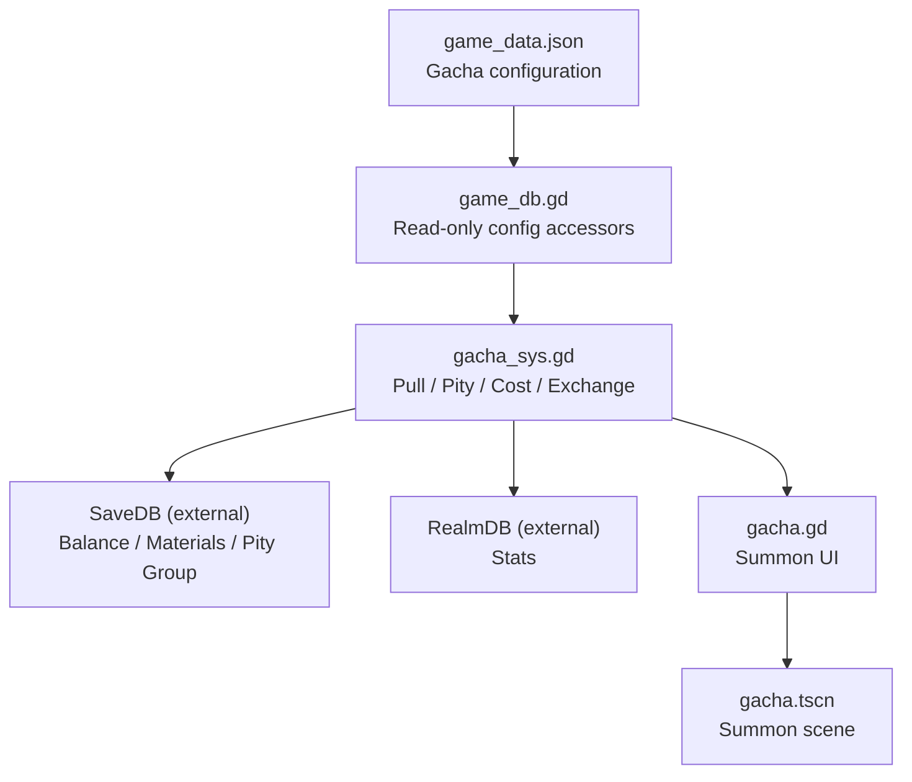
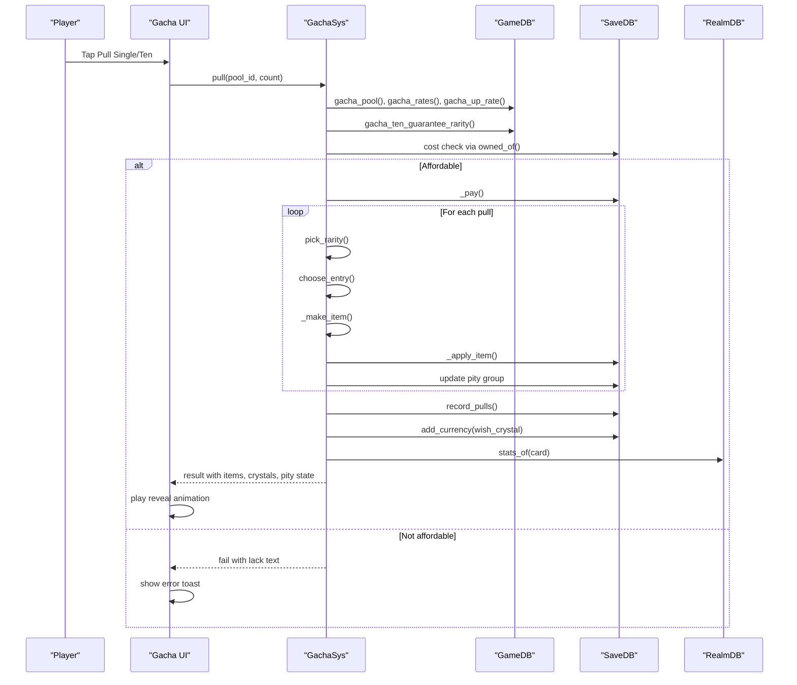
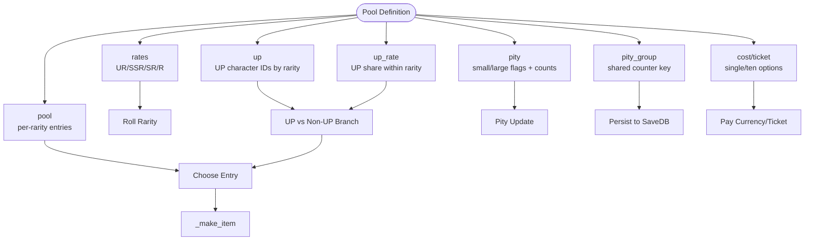
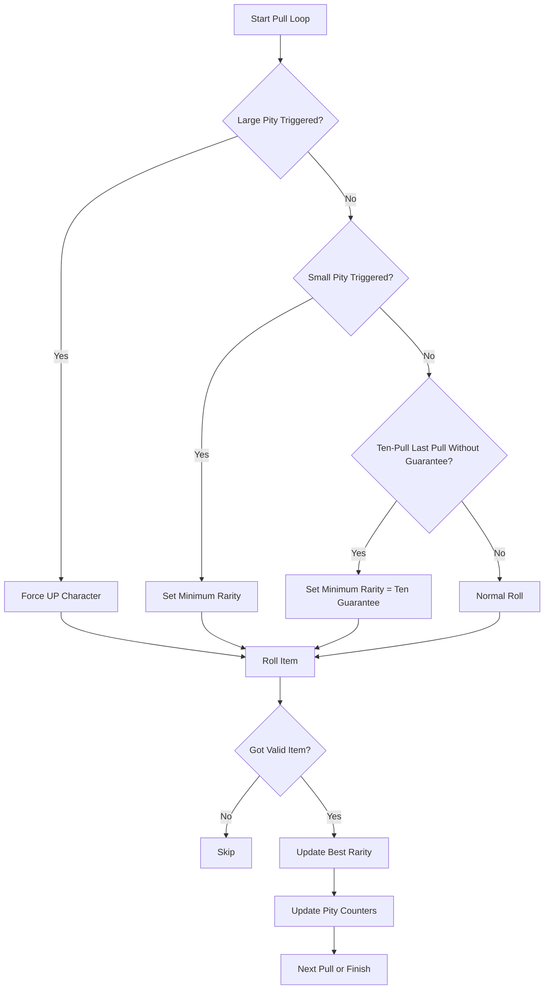
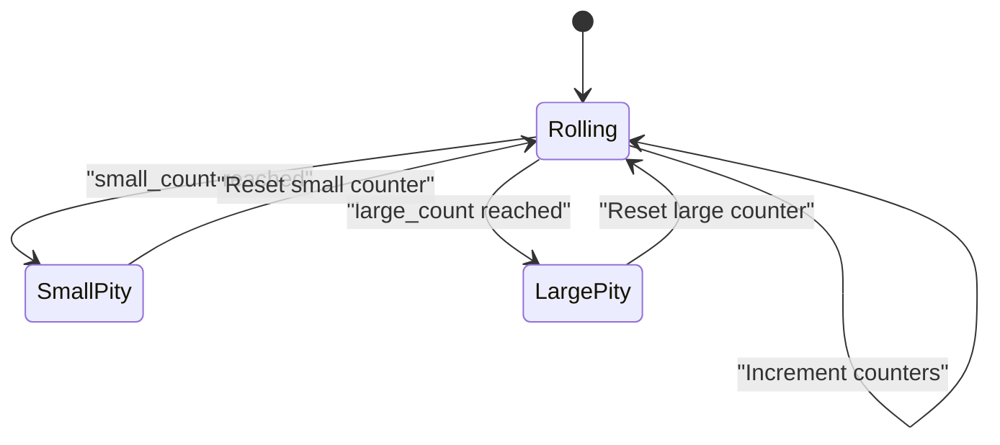
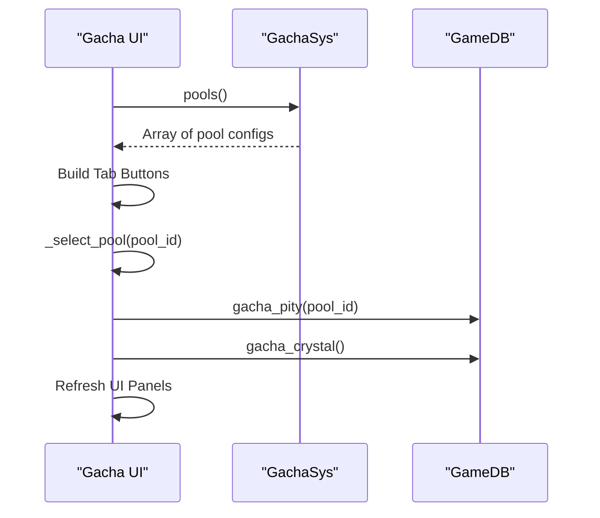
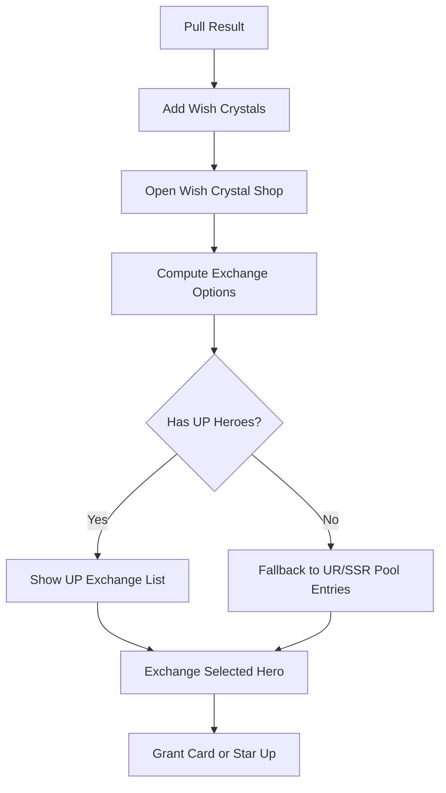
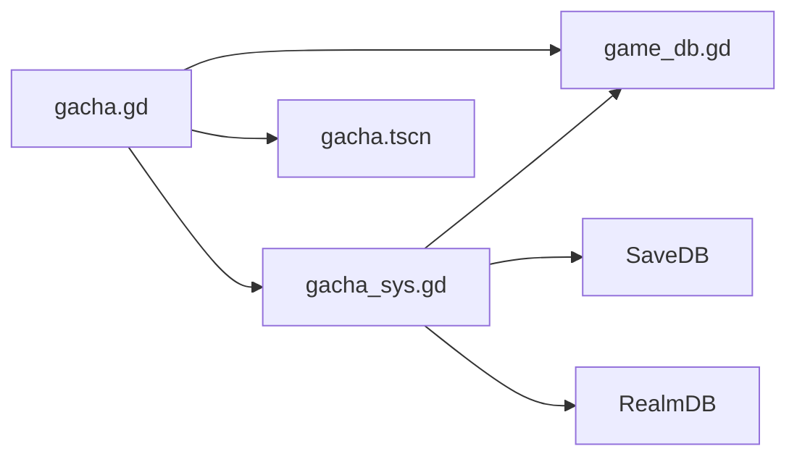

# Gacha Pools & Configuration

<cite>
**Referenced Files in This Document**   
- [game_data.json](file://data/game_data.json)
- [gacha_sys.gd](file://scripts/gacha_sys.gd)
- [gacha.gd](file://scripts/gacha.gd)
- [game_db.gd](file://scripts/game_db.gd)
- [gacha.tscn](file://scenes/gacha.tscn)
</cite>

## Table of Contents
1. [Introduction](#introduction)
2. [Project Structure](#project-structure)
3. [Core Components](#core-components)
4. [Architecture Overview](#architecture-overview)
5. [Detailed Component Analysis](#detailed-component-analysis)
6. [Dependency Analysis](#dependency-analysis)
7. [Performance Considerations](#performance-considerations)
8. [Troubleshooting Guide](#troubleshooting-guide)
9. [Conclusion](#conclusion)
10. [Appendices](#appendices)

## Introduction
This document explains how gacha pools are defined, configured, and consumed by the game. It covers:
- Pool types: standard, limited, and friend.
- Pool structure: entries, rates, UP characters, cost options, pity rules, ten-pull guarantee, wish crystals, and shop exchange.
- How pool definitions live in `game_data.json` and how the engine reads them.
- Inheritance behavior for pity counters across periods.
- Pool switching mechanics in the UI.
- Practical guidance for adding new pools, setting probability distributions, and managing character availability across different pool types.

The goal is to help both designers and engineers configure and reason about gacha systems without needing to trace every line of code.

## Project Structure
Gacha configuration is primarily data-driven:
- `data/game_data.json` contains all gacha-related configuration: global settings, pool list, probabilities, costs, pity defaults, crystal shop, and reveal animations.
- `scripts/game_db.gd` provides read-only accessors that normalize and expose gacha configuration.
- `scripts/gacha_sys.gd` implements the gacha system: pulling, pity tracking, currency deduction, item granting, and wish crystal accumulation.
- `scripts/gacha.gd` is the UI controller for the summoning screen: tabs, rate display, shop panel, pull animation, and result reveal.
- `scenes/gacha.tscn` defines the visual layout and resources used by the gacha screen.

**Diagram sources**
- [game_data.json:1096-1518](file://data/game_data.json#L1096-L1518)
- [game_db.gd:281-538](file://scripts/game_db.gd#L281-L538)
- [gacha_sys.gd:1-568](file://scripts/gacha_sys.gd#L1-L568)
- [gacha.gd:1-1233](file://scripts/gacha.gd#L1-L1233)
- [gacha.tscn:1-800](file://scenes/gacha.tscn#L1-L800)

**Section sources**
- [game_data.json:1096-1518](file://data/game_data.json#L1096-L1518)
- [game_db.gd:281-538](file://scripts/game_db.gd#L281-L538)
- [gacha_sys.gd:1-568](file://scripts/gacha_sys.gd#L1-L568)
- [gacha.gd:1-1233](file://scripts/gacha.gd#L1-L1233)
- [gacha.tscn:1-800](file://scenes/gacha.tscn#L1-L800)

## Core Components
- **GameDB**: Loads `game_data.json` once and exposes typed getters for gacha pools, rates, UP lists, pity rules, ticket/currency costs, ten-pull guarantee, crystal shop, and reveal settings.
- **GachaSys**: The only place where gacha logic happens: deciding rarity, choosing entries, applying pity, paying costs, granting items, recording pulls, and accumulating wish crystals.
- **Gacha UI**: Builds tabs from available pools, shows current pool info, displays rates and shop options, handles single/ten pulls, and plays reveal animations.
- **Scene**: Provides the visual container and assets referenced by the UI script.

Key responsibilities:
- Data definition lives in JSON.
- Data normalization lives in GameDB.
- Stateful logic lives in GachaSys.
- Presentation lives in Gacha UI and scene.

**Section sources**
- [game_db.gd:281-538](file://scripts/game_db.gd#L281-L538)
- [gacha_sys.gd:1-568](file://scripts/gacha_sys.gd#L1-L568)
- [gacha.gd:1-1233](file://scripts/gacha.gd#L1-L1233)

## Architecture Overview
The gacha flow is a layered pipeline:

**Diagram sources**
- [gacha.gd:604-638](file://scripts/gacha.gd#L604-L638)
- [gacha_sys.gd:203-317](file://scripts/gacha_sys.gd#L203-L317)
- [game_db.gd:326-508](file://scripts/game_db.gd#L326-L508)

## Detailed Component Analysis

### Pool Types and Definitions
There are three built-in pool types:

| Pool ID | Name | Kind | Ticket/Cost | Rates | Pity | UP | Notes |
|---|---|---|---|---|---|---|---|
| `standard` | Standard Summon | `standard` | Basic ticket or gems | UR 0.5%, SSR 3.5%, SR 18%, R 78% | Small pity enabled; large pity disabled; inherit enabled | No UP | Permanent pool, uniform distribution |
| `limited` | Limited Event Banner | `limited` | Advanced ticket or gems | Same base rates as standard | Small and large pity enabled; inherit enabled | UR and SSR UP at 50% share | Period-limited banner |
| `friend` | Friend Summon | `friend` | Guild token only | UR 0%, SSR 1%, SR 15%, R 84% | No pity; no inherit | No UP | Daily grind-friendly pool |

Important fields per pool:
- `id`, `name`, `subtitle`, `tag`, `kind`, `accent`, `desc`: metadata and UI labels.
- `ticket`: references a global ticket type (`basic` or `advanced`).
- `cost`: optional override for currency-based pools like friend summon.
- `rates`: normalized by GameDB into valid positive probabilities.
- `pity_group`: groups pity counters so they can be shared across periods.
- `pity`: enables/disables small/large pity and inheritance.
- `up_rate`: fraction of same-rarity drops that go to UP characters.
- `up`: maps rarities to UP character IDs.
- `featured`: shortlist shown on UI cards.
- `pool`: per-rarity entry list with hero/item objects and weights.

Examples of complete pool configurations:
- Standard pool: permanent pool with no UP, small pity only, full hero pool plus some R items.
- Limited pool: period-limited banner with UR and SSR UP, both pities enabled, same base rates but UP gets 50% share.
- Friend pool: guild-token-only pool with zero UR chance, SSR/SR/R entries, no pity.

**Section sources**
- [game_data.json:1210-1490](file://data/game_data.json#L1210-L1490)
- [game_db.gd:326-508](file://scripts/game_db.gd#L326-L508)

### Pool Structure: Entries, Rates, UP Characters, Costs
- **Entries**: Each rarity has an array of entries. Hero entries use `type: "hero"` and `id`; item entries use `type: "item"`, `id`, `name`, `count`, and `icon`. Weights control relative frequency within the same bucket.
- **Rates**: Global per-pool probability table. GameDB normalizes it to sum to 1 over present positive values. If a rarity has no entries, it is excluded from rolling.
- **UP Characters**: Defined under `up` keyed by rarity. `up_rate` controls the branch between UP and non-UP within the chosen rarity.
- **Cost Options**:
  - Default cost uses tickets and gems, ordered by ticket first then gem.
  - Friend pool overrides cost with a direct currency amount.
  - `GachaSys.cost()` computes affordability and selects the first viable option.

**Diagram sources**
- [game_data.json:1210-1490](file://data/game_data.json#L1210-L1490)
- [gacha_sys.gd:366-454](file://scripts/gacha_sys.gd#L366-L454)
- [game_db.gd:326-508](file://scripts/game_db.gd#L326-L508)

**Section sources**
- [game_data.json:1210-1490](file://data/game_data.json#L1210-L1490)
- [gacha_sys.gd:366-454](file://scripts/gacha_sys.gd#L366-L454)
- [game_db.gd:326-508](file://scripts/game_db.gd#L326-L508)

### Probability Distribution and Ten-Pull Guarantee
- **Rarity selection**: Uses `pick_rarity()` with normalized rates and validity checks.
- **Entry selection**: Uses `choose_entry()` to split between UP and non-UP based on `up_rate`, then weighted random among candidates.
- **Ten-pull guarantee**: If the last pull in a ten-pull does not yet meet the guaranteed minimum rarity, the final pull is forced to at least that rarity. The minimum rarity is computed by `gacha_ten_guarantee_rarity()` and must exist in both rates and pool entries.

**Diagram sources**
- [gacha_sys.gd:237-276](file://scripts/gacha_sys.gd#L237-L276)
- [gacha_sys.gd:366-454](file://scripts/gacha_sys.gd#L366-L454)
- [game_db.gd:493-508](file://scripts/game_db.gd#L493-L508)

**Section sources**
- [gacha_sys.gd:237-276](file://scripts/gacha_sys.gd#L237-L276)
- [gacha_sys.gd:366-454](file://scripts/gacha_sys.gd#L366-L454)
- [game_db.gd:493-508](file://scripts/game_db.gd#L493-L508)

### Pity Inheritance and Cross-Period Carryover
- Pity counters are stored by `pity_group`, not strictly by pool ID.
- For limited banners, the group is typically `"limited"`, allowing carryover across periods of the same banner type.
- The UI rule panel explicitly states that limited pools fully inherit cumulative pulls to the next same-type limited pool.
- Standard pool has its own group `"standard"`; friend pool has `"friend"`.

**Diagram sources**
- [gacha_sys.gd:77-97](file://scripts/gacha_sys.gd#L77-L97)
- [gacha_sys.gd:221-276](file://scripts/gacha_sys.gd#L221-L276)
- [game_data.json:1198-1208](file://data/game_data.json#L1198-L1208)

**Section sources**
- [gacha_sys.gd:77-97](file://scripts/gacha_sys.gd#L77-L97)
- [gacha_sys.gd:221-276](file://scripts/gacha_sys.gd#L221-L276)
- [game_data.json:1198-1208](file://data/game_data.json#L1198-L1208)

### Pool Switching Mechanics
- The UI builds tabs dynamically from `GachaSys.pools()`.
- Selecting a tab calls `_select_pool()`, which updates active pool ID, refreshes texts, pity bars, costs, rate panel, shop panel, and rule panel.
- The footer shows total pool count and current period subtitle.

**Diagram sources**
- [gacha.gd:156-215](file://scripts/gacha.gd#L156-L215)
- [gacha.gd:217-251](file://scripts/gacha.gd#L217-L251)
- [gacha.gd:403-426](file://scripts/gacha.gd#L403-L426)

**Section sources**
- [gacha.gd:156-215](file://scripts/gacha.gd#L156-L215)
- [gacha.gd:217-251](file://scripts/gacha.gd#L217-L251)
- [gacha.gd:403-426](file://scripts/gacha.gd#L403-L426)

### Wish Crystals and Shop Exchange
- Every pull grants a configurable number of wish crystals per pull.
- The shop allows exchanging crystals for specific UP heroes. If no UP exists, it falls back to UR/SSR entries in the pool.
- Exchange cost per rarity is defined in `crystal.exchange_cost`.

**Diagram sources**
- [gacha_sys.gd:159-188](file://scripts/gacha_sys.gd#L159-L188)
- [gacha_sys.gd:321-348](file://scripts/gacha_sys.gd#L321-L348)
- [game_data.json:1139-1150](file://data/game_data.json#L1139-L1150)

**Section sources**
- [gacha_sys.gd:159-188](file://scripts/gacha_sys.gd#L159-L188)
- [gacha_sys.gd:321-348](file://scripts/gacha_sys.gd#L321-L348)
- [game_data.json:1139-1150](file://data/game_data.json#L1139-L1150)

### Character Availability Across Pool Types
- **Standard pool**: Includes multiple heroes across rarities and some R items.
- **Limited pool**: Adds UP UR and SSR while keeping other SSR/SR/R entries similar to standard.
- **Friend pool**: Excludes UR entirely, offers SSR/SR/R entries, and uses guild tokens.

To manage availability:
- Add or remove hero IDs from `pool.<rarity>` arrays.
- Adjust weights to tune relative frequency within a rarity.
- Use `up` and `up_rate` to promote specific characters in limited banners.
- Set `rates.UR` to 0 for pools that should never drop UR.

**Section sources**
- [game_data.json:1238-1488](file://data/game_data.json#L1238-L1488)

## Dependency Analysis
- `gacha.gd` depends on `GachaSys` for logic and `GameDB` for static configuration.
- `gacha_sys.gd` depends on `GameDB` for configuration and `SaveDB`/`RealmDB` for persistent state and stats.
- `game_db.gd` is pure configuration access; it does not mutate state.
- `gacha.tscn` is a view resource referenced by `gacha.gd`.

**Diagram sources**
- [gacha.gd:1-1233](file://scripts/gacha.gd#L1-L1233)
- [gacha_sys.gd:1-568](file://scripts/gacha_sys.gd#L1-L568)
- [game_db.gd:1-871](file://scripts/game_db.gd#L1-L871)
- [gacha.tscn:1-800](file://scenes/gacha.tscn#L1-L800)

**Section sources**
- [gacha.gd:1-1233](file://scripts/gacha.gd#L1-L1233)
- [gacha_sys.gd:1-568](file://scripts/gacha_sys.gd#L1-L568)
- [game_db.gd:1-871](file://scripts/game_db.gd#L1-L871)
- [gacha.tscn:1-800](file://scenes/gacha.tscn#L1-L800)

## Performance Considerations
- **Free mode testing**: `GachaSys.pull()` supports free mode to simulate draws without writing save data, enabling statistical validation of distributions.
- **Normalized rates**: GameDB normalizes rates to avoid out-of-range rolls when configuration is incomplete.
- **Weighted picks**: Within a rarity, weighted selection avoids heavy branching and keeps roll complexity linear in candidate count.
- **UI refresh batching**: The UI refreshes currencies, pity, cost, recent heroes, and panels together to reduce redundant work.

[No sources needed since this section provides general guidance]

## Troubleshooting Guide
Common issues and resolutions:
- **Unknown pool error**: Occurs when calling `pull()` with an invalid pool ID. Ensure the pool exists in `gacha.pools`.
- **Resource insufficient**: Happens when no payment method is affordable. Check ticket inventory, gem balance, or friend pool guild token balance.
- **Empty exchange list**: When no UP heroes are configured for the current pool, the shop may show empty text. Add UP entries or fallback UR/SSR entries.
- **Pity not triggering**: Verify `pity.small_on`/`pity.large_on` and `pity_group` mapping. Confirm that the pool’s `rates` include the target rarity and that entries exist for that rarity.
- **Ten-pull guarantee not working**: Ensure the guaranteed rarity exists in both `rates` and pool entries; otherwise, the system falls back to a lower valid rarity.

**Section sources**
- [gacha_sys.gd:203-317](file://scripts/gacha_sys.gd#L203-L317)
- [gacha_sys.gd:550-563](file://scripts/gacha_sys.gd#L550-L563)
- [game_db.gd:493-508](file://scripts/game_db.gd#L493-L508)

## Conclusion
Gacha in this project is cleanly separated into configuration, accessors, system logic, and UI. Designers define pools, rates, UP characters, costs, and pity rules in JSON. Engineers rely on GameDB for safe access and GachaSys for deterministic, testable logic. The UI presents pool tabs, probabilities, and shop exchanges while playing reveal animations. With this structure, adding new pools, adjusting probabilities, and managing character availability is straightforward and consistent.

[No sources needed since this section summarizes without analyzing specific files]

## Appendices

### How to Configure a New Pool
Steps:
1. Add a new object under `gacha.pools` in `game_data.json`.
2. Set `id`, `name`, `kind`, `accent`, `desc`, and `featured`.
3. Define `rates` for UR/SSR/SR/R.
4. Define `pool` entries per rarity with hero/item objects and weights.
5. Configure `up` and `up_rate` if you want UP characters.
6. Set `pity_group` and `pity` flags to enable/disable small/large pity and inheritance.
7. Define `ticket` or `cost` for payment methods.
8. Optionally set `period.start`/`period.end` and `period.inherit` for limited banners.

Example reference paths:
- Standard pool template: [game_data.json:1210-1303](file://data/game_data.json#L1210-L1303)
- Limited pool template: [game_data.json:1305-1401](file://data/game_data.json#L1305-L1401)
- Friend pool template: [game_data.json:1403-1489](file://data/game_data.json#L1403-L1489)

**Section sources**
- [game_data.json:1210-1489](file://data/game_data.json#L1210-L1489)

### Probability Distribution Checklist
- Ensure `rates` sums to a reasonable total; GameDB will normalize, but keep it intentional.
- Make sure each selected rarity has at least one entry in `pool`; otherwise, it will be skipped during rolling.
- For limited banners, verify `up_rate` matches design intent (e.g., 0.5 means UP gets half of same-rarity drops).
- Validate ten-pull guarantee rarity exists in both `rates` and pool entries.

**Section sources**
- [game_db.gd:326-369](file://scripts/game_db.gd#L326-L369)
- [game_db.gd:493-508](file://scripts/game_db.gd#L493-L508)
- [gacha_sys.gd:366-454](file://scripts/gacha_sys.gd#L366-L454)

### Managing Character Availability
- To add a character to a pool: insert its ID into the appropriate `pool.<rarity>` array.
- To adjust weight: modify the `weight` field for that entry.
- To promote a character as UP: add its ID to `up.<rarity>` and set `up_rate`.
- To exclude UR from a pool: set `rates.UR` to 0 and leave `pool.UR` empty.

**Section sources**
- [game_data.json:1238-1488](file://data/game_data.json#L1238-L1488)