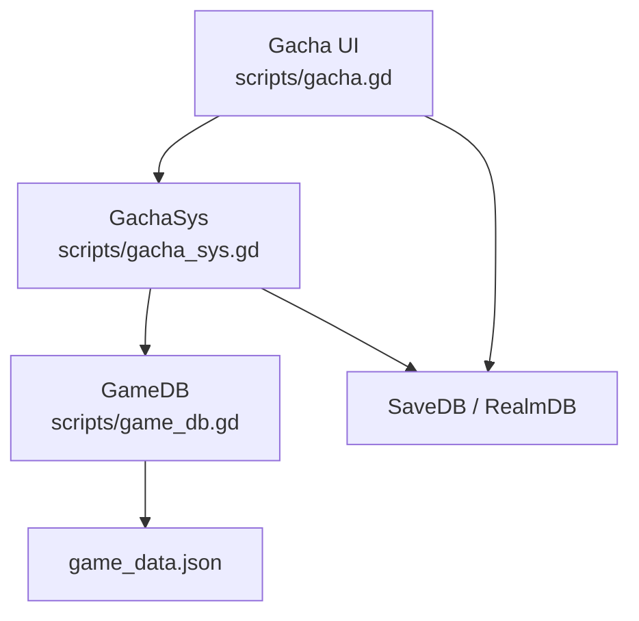
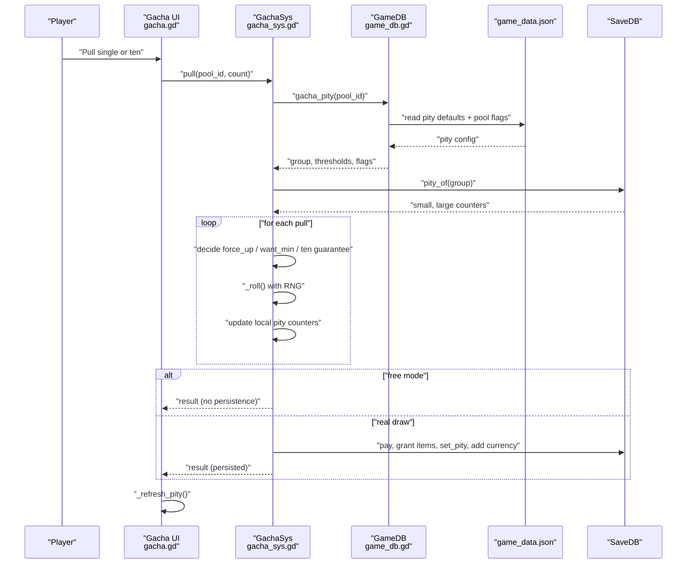
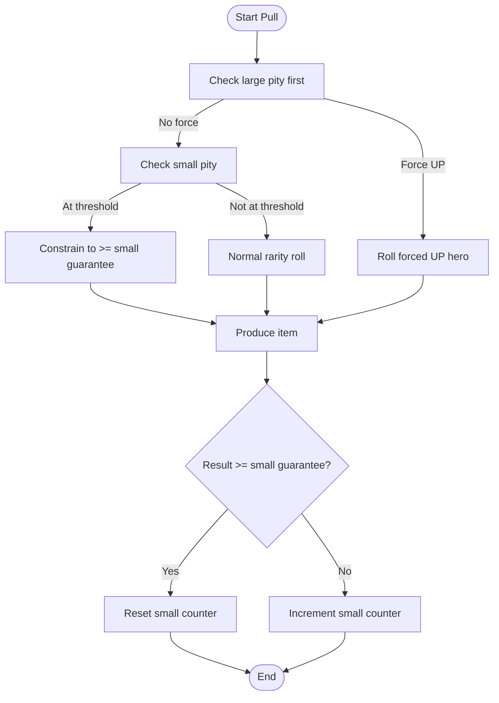
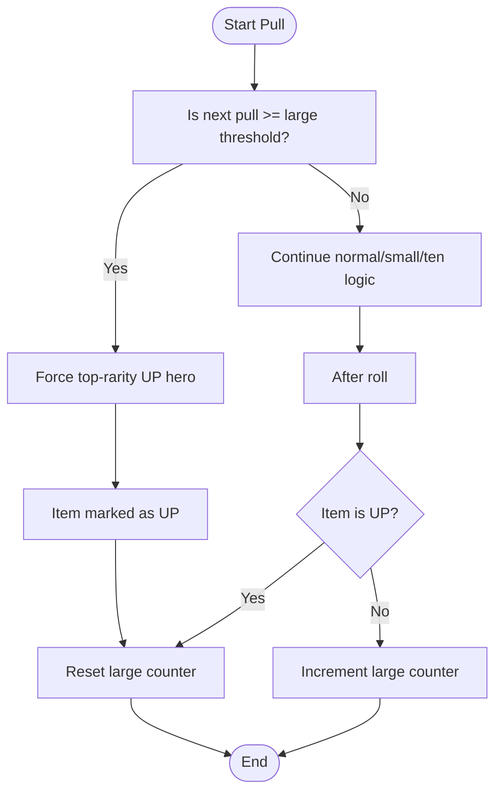
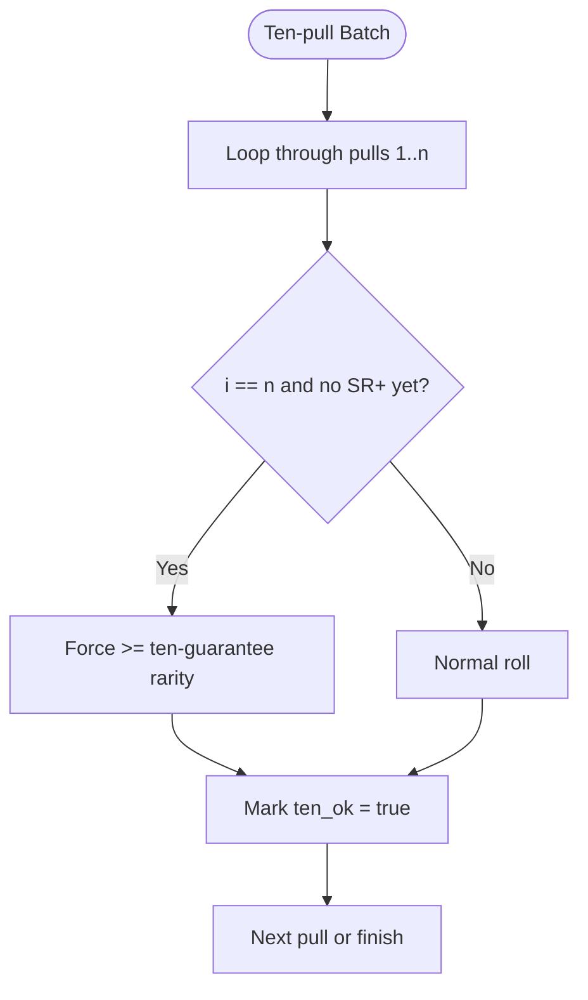
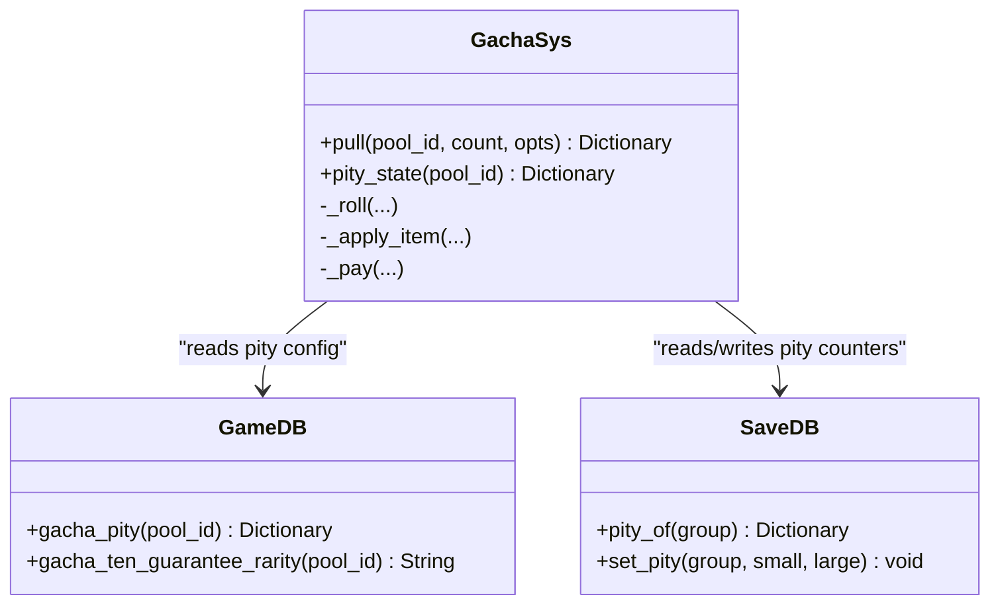
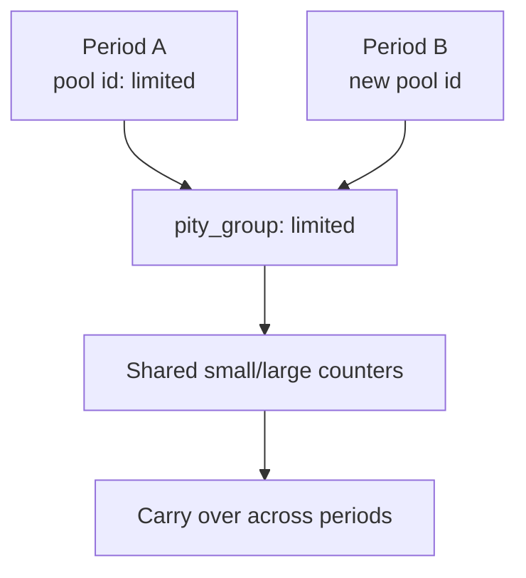
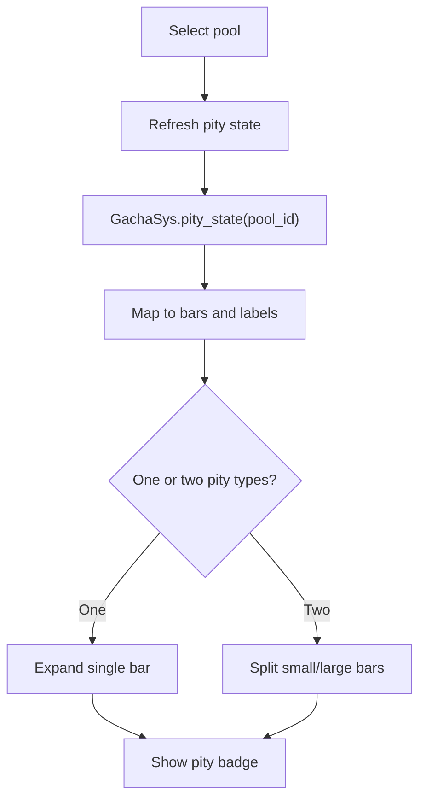
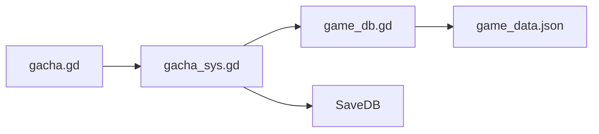

# Pity & Guarantee Mechanics

<cite>
**Referenced Files in This Document**
- [gacha_sys.gd](file://scripts/gacha_sys.gd)
- [gacha.gd](file://scripts/gacha.gd)
- [game_db.gd](file://scripts/game_db.gd)
- [game_data.json](file://data/game_data.json)
- [gacha_suite.gd](file://tools/suites/gacha_suite.gd)
</cite>

## Table of Contents
1. [Introduction](#introduction)
2. [Project Structure](#project-structure)
3. [Core Components](#core-components)
4. [Architecture Overview](#architecture-overview)
5. [Detailed Component Analysis](#detailed-component-analysis)
6. [Dependency Analysis](#dependency-analysis)
7. [Performance Considerations](#performance-considerations)
8. [Troubleshooting Guide](#troubleshooting-guide)
9. [Conclusion](#conclusion)

## Introduction
This document explains the pity and guarantee systems used by the gacha (summon) feature. It covers:
- Small pity: SSR+ guarantee.
- Large pity: UP character guarantee.
- Ten-pull guarantee: at least one SR or higher per ten pulls.
- Pity counter tracking, reset conditions, and cross-period inheritance.
- How the UI visualizes pity progress.
- Configuration options for thresholds, guarantee types, and pool behavior.

The system is designed so that core probability decisions are deterministic when random inputs are supplied, making boundary cases such as “which pull triggers pity” verifiable without relying on long simulations.

## Project Structure
The pity mechanics live primarily in the gacha subsystem:
- `scripts/gacha_sys.gd` implements the actual draw logic, pity state, and persistence.
- `scripts/gacha.gd` renders the UI, including pity bars and rule panels.
- `scripts/game_db.gd` reads configuration from `data/game_data.json`.
- `data/game_data.json` defines global pity defaults, ten-pull guarantee, pools, and per-pool flags.
- `tools/suites/gacha_suite.gd` contains tests that validate pity timing, priority, and group-based inheritance.

**Diagram sources**
- [gacha.gd:117-125](file://scripts/gacha.gd#L117-L125)
- [gacha_sys.gd:203-317](file://scripts/gacha_sys.gd#L203-L317)
- [game_db.gd:468-508](file://scripts/game_db.gd#L468-L508)
- [game_data.json:1134-1208](file://data/game_data.json#L1134-L1208)

**Section sources**
- [gacha_sys.gd:1-18](file://scripts/gacha_sys.gd#L1-L18)
- [gacha.gd:1-15](file://scripts/gacha.gd#L1-L15)
- [game_db.gd:468-508](file://scripts/game_db.gd#L468-L508)
- [game_data.json:1134-1208](file://data/game_data.json#L1134-L1208)

## Core Components
- **Small pity**: Guarantees an item of at least the configured small-guarantee rarity (default SSR) within a threshold (default 50). The counter resets when a result meets or exceeds the small-guarantee rarity; otherwise it increments.
- **Large pity**: Guarantees the current top-rarity UP hero within a threshold (default 100). The counter resets when an item is marked as UP; otherwise it increments.
- **Ten-pull guarantee**: In a ten-pull batch, if no SR or higher appears before the final pull, the last pull is forced to meet the configured ten-pull minimum rarity.
- **Pity groups**: Counters are stored under a group key rather than strictly per pool ID. This enables cross-period inheritance when multiple periods share the same group.
- **Persistence**: Real draws persist pity counters, currency, items, and history. Free-mode draws simulate outcomes without writing save data.

Key responsibilities:
- `GachaSys.pull`: orchestrates cost, roll, pity decision, item application, persistence, and result emission.
- `GachaSys.pity_state`: exposes current pity counters, thresholds, left-to-trigger values, and configuration flags.
- `GameDB.gacha_pity` and `GameDB.gacha_ten_guarantee_rarity`: resolve effective pity configuration and ten-pull target rarity.
- `Gacha._refresh_pity`: maps pity state to visible bars and labels.

**Section sources**
- [gacha_sys.gd:77-97](file://scripts/gacha_sys.gd#L77-L97)
- [gacha_sys.gd:203-317](file://scripts/gacha_sys.gd#L203-L317)
- [game_db.gd:468-508](file://scripts/game_db.gd#L468-L508)
- [gacha.gd:280-325](file://scripts/gacha.gd#L280-L325)

## Architecture Overview
The pity flow combines configuration, saved state, and per-draw randomness into deterministic rules.

**Diagram sources**
- [gacha.gd:604-625](file://scripts/gacha.gd#L604-L625)
- [gacha_sys.gd:203-317](file://scripts/gacha_sys.gd#L203-L317)
- [game_db.gd:468-508](file://scripts/game_db.gd#L468-L508)
- [game_data.json:1134-1208](file://data/game_data.json#L1134-L1208)

## Detailed Component Analysis

### Small Pity (SSR+ Guarantee)
- Threshold: default 50 pulls.
- Guarantee target: default SSR.
- Reset condition: any result whose rarity is at least the small-guarantee rarity resets the small counter to zero.
- Increment condition: results below the small-guarantee rarity increment the counter.
- Trigger: when the next pull would reach the threshold, the roll is constrained to the small-guarantee rarity or higher.

**Diagram sources**
- [gacha_sys.gd:237-275](file://scripts/gacha_sys.gd#L237-L275)

**Section sources**
- [gacha_sys.gd:20-23](file://scripts/gacha_sys.gd#L20-L23)
- [gacha_sys.gd:221-275](file://scripts/gacha_sys.gd#L221-L275)
- [game_db.gd:474-490](file://scripts/game_db.gd#L474-L490)
- [game_data.json:1198-1208](file://data/game_data.json#L1198-L1208)

### Large Pity (UP Character Guarantee)
- Threshold: default 100 pulls.
- Guarantee target: the highest-rarity UP hero in the current pool.
- Reset condition: any item marked as UP resets the large counter.
- Increment condition: non-UP items increment the large counter.
- Trigger: when the next pull reaches the threshold, the system forces the top-rarity UP hero.

**Diagram sources**
- [gacha_sys.gd:237-275](file://scripts/gacha_sys.gd#L237-L275)
- [gacha_sys.gd:62-73](file://scripts/gacha_sys.gd#L62-L73)

**Section sources**
- [gacha_sys.gd:62-73](file://scripts/gacha_sys.gd#L62-L73)
- [gacha_sys.gd:237-275](file://scripts/gacha_sys.gd#L237-L275)
- [game_db.gd:474-490](file://scripts/game_db.gd#L474-L490)
- [game_data.json:1198-1208](file://data/game_data.json#L1198-L1208)

### Ten-Pull Guarantee
- Applies only to batches of ten or more pulls.
- If no SR or higher appears before the final pull, the last pull is forced to meet the configured ten-pull minimum rarity.
- The effective target rarity is validated against both the pool’s rates and available entries; if not possible, it falls back to a lower valid rarity.

**Diagram sources**
- [gacha_sys.gd:232-253](file://scripts/gacha_sys.gd#L232-L253)
- [game_db.gd:493-508](file://scripts/game_db.gd#L493-L508)

**Section sources**
- [gacha_sys.gd:232-253](file://scripts/gacha_sys.gd#L232-L253)
- [game_db.gd:493-508](file://scripts/game_db.gd#L493-L508)
- [game_data.json:1134-1138](file://data/game_data.json#L1134-L1138)

### Pity Counter Tracking and Persistence
- Counters are read from `SaveDB.pity_of(group)` using the resolved pity group.
- On real draws, after all items are processed, `SaveDB.set_pity(group, p_small, p_large)` persists the updated counters.
- Free-mode draws update local copies only and do not write to disk.

**Diagram sources**
- [gacha_sys.gd:203-317](file://scripts/gacha_sys.gd#L203-L317)
- [game_db.gd:468-508](file://scripts/game_db.gd#L468-L508)

**Section sources**
- [gacha_sys.gd:203-317](file://scripts/gacha_sys.gd#L203-L317)

### Cross-Period Inheritance Behavior
- Pity counters are grouped by `pity_group`, not strictly by pool ID.
- When multiple periods share the same group, their counters continue accumulating across period changes.
- Tests assert that limited pools use a shared group and that remaining counts reflect correct subtraction from thresholds.

**Diagram sources**
- [gacha_sys.gd:14-15](file://scripts/gacha_sys.gd#L14-L15)
- [game_db.gd:468-470](file://scripts/game_db.gd#L468-L470)
- [gacha_suite.gd:328-336](file://tools/suites/gacha_suite.gd#L328-L336)

**Section sources**
- [gacha_sys.gd:14-15](file://scripts/gacha_sys.gd#L14-L15)
- [game_db.gd:468-470](file://scripts/game_db.gd#L468-L470)
- [gacha_suite.gd:328-336](file://tools/suites/gacha_suite.gd#L328-L336)

### Pity State Visualization
The UI displays:
- Two progress bars for small and large pity.
- Labels showing current count, maximum, and “left until guaranteed”.
- Visibility toggles based on whether small/large pity is enabled for the selected pool.
- When only one pity type is active, its bar expands to fill the badge area.

**Diagram sources**
- [gacha.gd:280-325](file://scripts/gacha.gd#L280-L325)
- [gacha_sys.gd:77-97](file://scripts/gacha_sys.gd#L77-L97)

**Section sources**
- [gacha.gd:280-325](file://scripts/gacha.gd#L280-L325)
- [gacha_sys.gd:77-97](file://scripts/gacha_sys.gd#L77-L97)

### Pity Progression Scenarios and Edge Cases
- Small pity trigger: at counter 49, the next pull guarantees SSR or higher and marks the item as small pity; the counter resets to zero afterward.
- Small pity non-trigger: at counter 48, the next pull does not force SSR+ and increments the counter to 49.
- Ten-pull guarantee: across many ten-pulls, every batch must contain at least one SR or higher.
- Group-based storage: counters are stored under the configured group name, not necessarily the pool ID.

These behaviors are validated by the test suite.

**Section sources**
- [gacha_suite.gd:275-336](file://tools/suites/gacha_suite.gd#L275-L336)

## Dependency Analysis
- `GachaSys` depends on:
  - `GameDB` for probabilities, pool definitions, pity configuration, and ten-pull guarantee resolution.
  - `SaveDB` for balance, materials, pity counters, and history.
- `Gacha` UI depends on `GachaSys` for state and actions, and on `GameDB` for display text and rules.

**Diagram sources**
- [gacha.gd:117-125](file://scripts/gacha.gd#L117-L125)
- [gacha_sys.gd:203-317](file://scripts/gacha_sys.gd#L203-L317)
- [game_db.gd:468-508](file://scripts/game_db.gd#L468-L508)

**Section sources**
- [gacha.gd:117-125](file://scripts/gacha.gd#L117-L125)
- [gacha_sys.gd:203-317](file://scripts/gacha_sys.gd#L203-L317)
- [game_db.gd:468-508](file://scripts/game_db.gd#L468-L508)

## Performance Considerations
- Core probability functions (`pick_rarity`, `choose_entry`) are pure and deterministic when seeded, enabling fast statistical validation without heavy simulation.
- Free-mode draws avoid I/O by skipping payment, item granting, and persistence, which is useful for testing distribution and pity boundaries.
- Ten-pull checks are O(n) per batch but trivial since n ≤ 10.

[No sources needed since this section provides general guidance]

## Troubleshooting Guide
Common issues and where to inspect:
- Pity not triggering: verify the effective threshold via `pity_state` and ensure the relevant pity flag is enabled for the pool.
- Wrong guarantee target: check `small_guarantee` and `ten_guarantee_rarity`; the latter may fall back if the configured rarity is unavailable in the pool.
- Counters not carrying over: confirm the pool’s `pity_group` matches expectations and that the same group is reused across periods.
- Ten-pull not guaranteeing SR+: ensure the pool’s rate table includes the target rarity and that the pool actually has entries for it.

Relevant inspection points:
- Pity state output: `GachaSys.pity_state`.
- Pity configuration resolution: `GameDB.gacha_pity`.
- Ten-pull target resolution: `GameDB.gacha_ten_guarantee_rarity`.
- Test assertions for expected behavior: `tools/suites/gacha_suite.gd`.

**Section sources**
- [gacha_sys.gd:77-97](file://scripts/gacha_sys.gd#L77-L97)
- [game_db.gd:474-508](file://scripts/game_db.gd#L474-L508)
- [gacha_suite.gd:275-336](file://tools/suites/gacha_suite.gd#L275-L336)

## Conclusion
The pity system cleanly separates configuration, state, and randomness:
- Small pity ensures SSR+ within a configurable threshold.
- Large pity ensures the top-rarity UP hero within a configurable threshold.
- Ten-pull guarantee ensures at least one SR+ in every ten-pull batch.
- Counters are grouped and can carry across periods, supporting fair cross-banner progression.
- The UI provides clear visibility into current progress and remaining pulls to guarantee.

For designers, most tuning happens in `game_data.json` and `GameDB` helpers; for developers, `GachaSys.pull` and `_roll` are the central places to reason about pity interactions and edge cases.