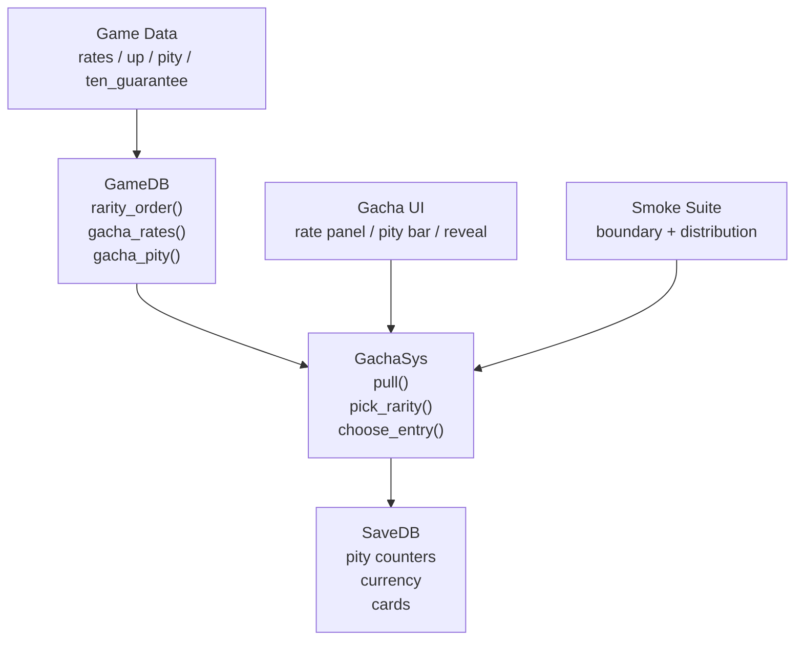
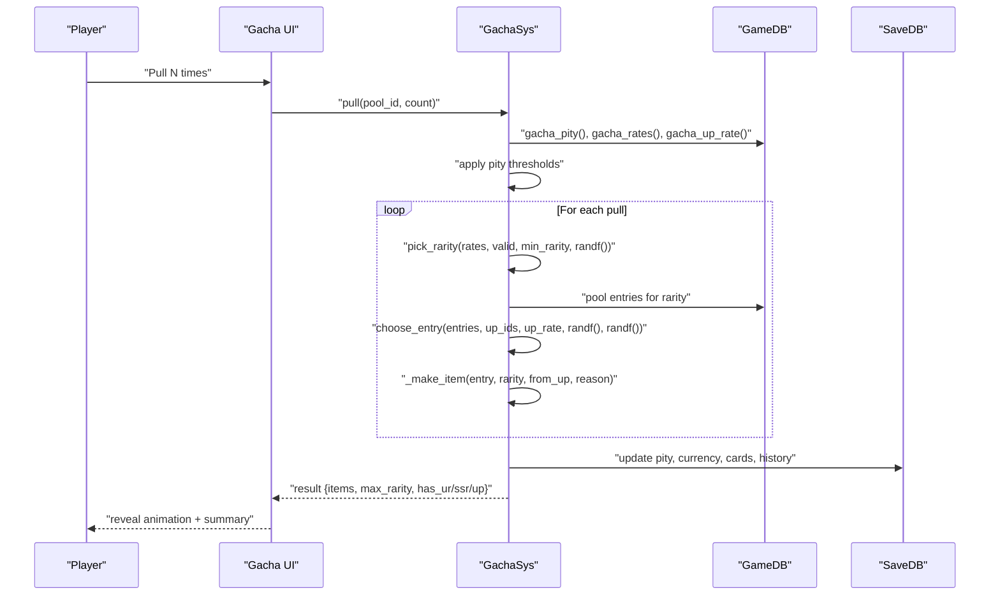
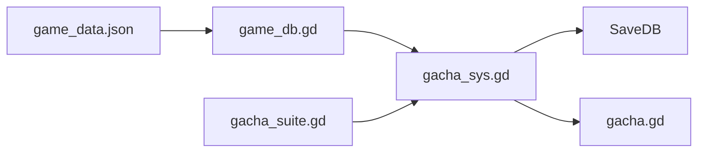

# Probability & Distribution System

<cite>
**Referenced Files in This Document**   
- [gacha_sys.gd](file://scripts/gacha_sys.gd)
- [gacha.gd](file://scripts/gacha.gd)
- [game_db.gd](file://scripts/game_db.gd)
- [game_data.json](file://data/game_data.json)
- [gacha_suite.gd](file://tools/suites/gacha_suite.gd)
</cite>

## Table of Contents
1. [Introduction](#introduction)
2. [Project Structure](#project-structure)
3. [Core Components](#core-components)
4. [Architecture Overview](#architecture-overview)
5. [Detailed Component Analysis](#detailed-component-analysis)
6. [Dependency Analysis](#dependency-analysis)
7. [Performance Considerations](#performance-considerations)
8. [Troubleshooting Guide](#troubleshooting-guide)
9. [Conclusion](#conclusion)

## Introduction
This document explains the probability and distribution system used by the gacha (summoning) feature. It focuses on:
- The core algorithms `pick_rarity()` and `choose_entry()`.
- How base rates are modified by pity mechanics, UP rate adjustments, and minimum rarity guarantees.
- Weighted selection within each rarity tier and how UP characters receive priority.
- Mathematical explanations of probability normalization, cumulative distribution functions, and random number generation.
- Examples of calculating actual drop rates under different conditions.
- Fairness guarantees built into the system.

The implementation is designed so that critical decisions are pure functions with external randomness injected. This makes it possible to verify probability boundaries, UP share, and pity triggers without relying on long-running simulations.

## Project Structure
The probability system spans configuration, data access, simulation logic, UI wiring, and tests:
- Configuration defines pool rates, UP lists, pity rules, ten-pull guarantee, and crystal shop costs.
- Data access reads configuration and exposes helpers for rarity ordering and normalization.
- Simulation performs pulls, applies pity, selects rarities and entries, updates state, and records results.
- UI displays rates, pity progress, cost options, and pull animations.
- Tests validate boundary behavior, distribution convergence, pity timing, and scene interactions.

**Diagram sources**
- [game_data.json:1100-1490](file://data/game_data.json#L1100-L1490)
- [game_db.gd:311-324](file://scripts/game_db.gd#L311-L324)
- [game_db.gd:326-328](file://scripts/game_db.gd#L326-L328)
- [game_db.gd:475-508](file://scripts/game_db.gd#L475-L508)
- [gacha_sys.gd:203-317](file://scripts/gacha_sys.gd#L203-L317)
- [gacha.gd:431-488](file://scripts/gacha.gd#L431-L488)
- [gacha_suite.gd:145-208](file://tools/suites/gacha_suite.gd#L145-L208)

**Section sources**
- [game_data.json:1100-1490](file://data/game_data.json#L1100-L1490)
- [game_db.gd:311-324](file://scripts/game_db.gd#L311-L324)
- [gacha_sys.gd:203-317](file://scripts/gacha_sys.gd#L203-L317)
- [gacha.gd:431-488](file://scripts/gacha.gd#L431-L488)
- [gacha_suite.gd:145-208](file://tools/suites/gacha_suite.gd#L145-L208)

## Core Components
- GachaSys: orchestrates a single pull or multi-pull, applies pity, selects rarity and entry, updates persistence, and emits results.
- GameDB: provides read-only configuration and helpers such as rarity order, normalized rates, pity configuration, and ten-pull guarantee.
- Gacha UI: binds GachaSys results to panels like rate display, pity bars, cost labels, and reveal animation.
- Smoke Suite: validates pure probability functions, distribution convergence, pity timing, payment flow, exchange, star cap, history, and scene wiring.

Key responsibilities:
- Pure probability functions: `pick_rarity()` and `choose_entry()`.
- Pity state management: small pity (SSR+), large pity (UP), ten-pull guarantee (SR+).
- UP weighting: within a selected rarity, UP candidates get a configured share of the branch.
- Weighted item selection: within an UP or non-UP group, items are chosen by weight.

**Section sources**
- [gacha_sys.gd:1-16](file://scripts/gacha_sys.gd#L1-L16)
- [gacha_sys.gd:366-430](file://scripts/gacha_sys.gd#L366-L430)
- [game_db.gd:311-324](file://scripts/game_db.gd#L311-L324)
- [game_db.gd:326-328](file://scripts/game_db.gd#L326-L328)
- [game_db.gd:475-508](file://scripts/game_db.gd#L475-L508)

## Architecture Overview
The end-to-end flow from user input to result:

**Diagram sources**
- [gacha.gd:604-625](file://scripts/gacha.gd#L604-L625)
- [gacha_sys.gd:203-317](file://scripts/gacha_sys.gd#L203-L317)
- [gacha_sys.gd:435-454](file://scripts/gacha_sys.gd#L435-L454)
- [game_db.gd:475-508](file://scripts/game_db.gd#L475-L508)

## Detailed Component Analysis

### pick_rarity(): Rarity Selection with Normalization and Minimum Guarantee
`pick_rarity()` implements a weighted cumulative distribution over rarities:
- Input:
  - `rates`: dictionary mapping rarity to base probability.
  - `valid`: boolean flags indicating which rarities have pool content.
  - `min_rarity`: optional minimum rarity threshold for pity.
  - `roll`: uniform random float in [0, 1).
- Algorithm:
  1. Filter rarities by `valid` and `min_rarity`.
  2. Sum weights of kept rarities to compute total.
  3. Normalize roll to [0, total) via clamping and multiplication.
  4. Accumulate weights until the accumulated sum exceeds the normalized roll; return that rarity.
  5. If no valid rarities remain or total is zero, return empty.

Mathematical interpretation:
- Let R be the set of valid rarities after applying `min_rarity`.
- Let w(r) be the base rate for rarity r.
- Total W = Σ_{r∈R} w(r).
- The probability of selecting rarity r is w(r)/W.
- The algorithm uses a standard inverse transform sampling approach on the cumulative distribution function (CDF) of the normalized weights.

Edge cases:
- Empty valid set or zero total: returns empty string, signaling fallback handling elsewhere.
- Clamping roll to [0, 0.999999] avoids floating-point edge issues at exactly 1.0.

Fairness guarantees:
- Only rarities present in the pool participate.
- Pity thresholds preserve relative proportions among eligible rarities while ensuring a minimum quality floor.

**Section sources**
- [gacha_sys.gd:366-388](file://scripts/gacha_sys.gd#L366-L388)
- [gacha_suite.gd:145-171](file://tools/suites/gacha_suite.gd#L145-L171)

### choose_entry(): UP Branching and Weighted Selection Within Rarity
After a rarity is selected, `choose_entry()` decides whether the result comes from the UP list or the rest of the pool:
- Input:
  - `entries`: all items for the selected rarity.
  - `up_ids`: IDs of UP characters for this rarity.
  - `up_rate`: fraction of the selected rarity’s probability mass allocated to UP.
  - `branch_roll`: uniform random float for UP vs non-UP branching.
  - `pick_roll`: uniform random float for weighted selection within the chosen group.
- Algorithm:
  1. Partition entries into UP and non-UP groups.
  2. Clamp `up_rate` to [0, 1].
  3. If UP group is non-empty and `branch_roll < up_rate`, select from UP group using `_weighted_pick()`.
  4. Else if non-UP group is empty, fall back to UP group and mark degradation.
  5. Otherwise, select from non-UP group.

UP priority:
- UP candidates receive a configured share of the selected rarity’s output. In the default limited pool, UP accounts for 50% of SSR and UR outputs.
- If only UP exists for a rarity, both branches resolve to UP, marked as degraded to indicate insufficient alternative content.

Weighted selection:
- Within the chosen group, items are selected proportionally to their `weight`.
- If all weights are zero, the first entry is returned.
- Uses the same CDF-based inverse transform sampling as `pick_rarity()`.

**Section sources**
- [gacha_sys.gd:393-430](file://scripts/gacha_sys.gd#L393-L430)
- [gacha_suite.gd:173-208](file://tools/suites/gacha_suite.gd#L173-L208)

### Pity Mechanics: Small Pity, Large Pity, Ten-Pull Guarantee
Pity modifies the effective probability space per pull:
- Small pity: ensures a minimum rarity (default SSR+) after a configured number of pulls without achieving it.
- Large pity: ensures the current period’s top UP character after a configured number of pulls without obtaining any UP.
- Ten-pull guarantee: ensures at least one SR+ item in a ten-pull sequence if none appeared in the first nine pulls.

Priority and interaction:
- Large pity overrides small pity when both thresholds are reached simultaneously.
- Ten-pull guarantee applies only on the final pull of a ten-pull batch if no SR+ was obtained earlier.

State tracking:
- Small pity counter resets upon obtaining at least the small guarantee rarity.
- Large pity counter resets upon obtaining any UP character.
- Ten-pull flag resets per ten-pull batch once SR+ is achieved.

Persistence:
- Pity counters are grouped by `pity_group`, enabling cross-period inheritance for limited pools.

**Section sources**
- [gacha_sys.gd:221-276](file://scripts/gacha_sys.gd#L221-L276)
- [game_db.gd:475-508](file://scripts/game_db.gd#L475-L508)
- [gacha_suite.gd:277-336](file://tools/suites/gacha_suite.gd#L277-L336)

### Random Number Generation and Reproducibility
- A seeded RNG instance is initialized and randomized at startup.
- Each call to `_roll()` consumes fresh random values for rarity selection, UP branching, and weighted selection.
- Tests can inject a fixed seed via options to reproduce specific outcomes.

Implications:
- Deterministic testing is supported through seed injection.
- Production runs use system-randomized seeds for fairness.

**Section sources**
- [gacha_sys.gd:25-29](file://scripts/gacha_sys.gd#L25-L29)
- [gacha_sys.gd:203-208](file://scripts/gacha_sys.gd#L203-L208)
- [gacha_suite.gd:212-237](file://tools/suites/gacha_suite.gd#L212-L237)

### Probability Normalization and Cumulative Distribution Functions
Normalization:
- Base rates may not sum to exactly 1 due to configuration errors or pool-specific exclusions.
- `gacha_rates()` filters out zero-probability rarities and normalizes remaining weights to sum to 1.
- This prevents out-of-range roll values from causing undefined behavior.

Cumulative distribution:
- Both `pick_rarity()` and `_weighted_pick()` implement inverse transform sampling:
  - Compute total weight W.
  - Map uniform roll u ∈ [0, 1) to t = clamp(u, 0, 0.999999) × W.
  - Traverse items in order, accumulating weights until acc > t; select that item.
  - Fallback to last item if accumulation never exceeds t.

Mathematical correctness:
- For item i with weight w_i, probability P(i) = w_i / W.
- The CDF at step k is Σ_{j=1..k} w_j / W.
- Selecting the first index where CDF > t yields the correct distribution.

**Section sources**
- [game_db.gd:326-328](file://scripts/game_db.gd#L326-L328)
- [gacha_sys.gd:366-388](file://scripts/gacha_sys.gd#L366-L388)
- [gacha_sys.gd:416-430](file://scripts/gacha_sys.gd#L416-L430)

### Weighted Selection Within Rarity Tiers
Within each rarity:
- Entries include heroes and items, each with a `weight`.
- UP and non-UP groups are separately weighted.
- Default configurations often assign equal weights to heroes, but items may have different weights to tune drop frequency.

Example structure:
- Standard pool R tier includes multiple heroes and items with varying weights.
- Limited pool mirrors similar structures but adjusts UP lists and notes.

**Section sources**
- [game_data.json:1238-1303](file://data/game_data.json#L1238-L1303)
- [game_data.json:1344-1401](file://data/game_data.json#L1344-L1401)
- [gacha_sys.gd:416-430](file://scripts/gacha_sys.gd#L416-L430)

### UP Character Priority and Actual Drop Rates
UP allocation:
- For limited pools, UP characters receive a configured share of the selected rarity’s probability mass.
- Default limited pool sets `up_rate = 0.5`, meaning half of SSR and UR outputs go to UP candidates.

Actual drop rate calculation examples:
- Base UR rate: 0.005.
- UR UP share: 50%.
- Effective UR UP rate: 0.005 × 0.5 = 0.0025.
- Non-UR UR rate: 0.005 − 0.0025 = 0.0025.
- Base SSR rate: 0.035.
- SSR UP share: 50%.
- Effective SSR UP rate: 0.035 × 0.5 = 0.0175.
- Non-SSR SSR rate: 0.035 − 0.0175 = 0.0175.

If a rarity contains only UP candidates:
- Both branches resolve to UP, marked as degraded.
- The overall rarity probability remains unchanged; only the internal partition shifts.

**Section sources**
- [game_data.json:1314-1335](file://data/game_data.json#L1314-L1335)
- [gacha_sys.gd:393-413](file://scripts/gacha_sys.gd#L393-L413)
- [gacha_suite.gd:240-272](file://tools/suites/gacha_suite.gd#L240-L272)

### Fairness Guarantees
- Independent probabilities: each pull is independent except for pity-driven modifications.
- Transparent公示: the UI shows per-rarity rates, contents, and UP markers.
- Guaranteed outcomes:
  - Small pity ensures SSR+ after a configured streak.
  - Large pity ensures the period’s top UP after a configured streak.
  - Ten-pull guarantee ensures SR+ in a ten-pull batch.
- Cross-period inheritance: limited pool pity counters persist across periods, preventing unfair resets.
- Deterministic testing: pure functions and seedable RNG allow precise verification of boundaries and distributions.

**Section sources**
- [gacha.gd:431-488](file://scripts/gacha.gd#L431-L488)
- [gacha_sys.gd:221-276](file://scripts/gacha_sys.gd#L221-L276)
- [gacha_suite.gd:212-237](file://tools/suites/gacha_suite.gd#L212-L237)
- [gacha_suite.gd:277-336](file://tools/suites/gacha_suite.gd#L277-L336)

## Dependency Analysis
The probability system depends on:
- Configuration layer: game_data.json defines rates, UP lists, pity rules, ten-guarantee, and crystal shop costs.
- Data access layer: game_db.gd provides helpers for rarity ordering, normalized rates, pity config, and ten-guarantee resolution.
- Simulation layer: gacha_sys.gd implements pull orchestration, purity functions, and state updates.
- UI layer: gacha.gd binds results to panels and animations.
- Testing layer: gacha_suite.gd validates behavior across configuration, probability, distribution, state, and scene layers.

**Diagram sources**
- [game_data.json:1100-1490](file://data/game_data.json#L1100-L1490)
- [game_db.gd:311-324](file://scripts/game_db.gd#L311-L324)
- [gacha_sys.gd:203-317](file://scripts/gacha_sys.gd#L203-L317)
- [gacha.gd:431-488](file://scripts/gacha.gd#L431-L488)
- [gacha_suite.gd:145-208](file://tools/suites/gacha_suite.gd#L145-L208)

**Section sources**
- [game_data.json:1100-1490](file://data/game_data.json#L1100-L1490)
- [game_db.gd:311-324](file://scripts/game_db.gd#L311-L324)
- [gacha_sys.gd:203-317](file://scripts/gacha_sys.gd#L203-L317)
- [gacha.gd:431-488](file://scripts/gacha.gd#L431-L488)
- [gacha_suite.gd:145-208](file://tools/suites/gacha_suite.gd#L145-L208)

## Performance Considerations
- Complexity:
  - `pick_rarity()`: O(R) where R is the number of rarities (typically 4).
  - `choose_entry()`: O(E) where E is the number of entries in the selected rarity (small constant).
  - `_weighted_pick()`: O(K) where K is the number of items in the chosen group (small constant).
- Memory:
  - Minimal allocations; primarily iterates over arrays and dictionaries.
- RNG:
  - Seeded RNG supports deterministic testing without performance penalties.
- I/O:
  - Persistence operations occur once per multi-pull batch to reduce disk writes.

[No sources needed since this section provides general guidance]

## Troubleshooting Guide
Common issues and diagnostics:
- Empty rarity selection:
  - Check `valid` flags and ensure the pool actually contains entries for the selected rarity.
  - Verify `min_rarity` does not exclude all rarities.
- Zero total weight:
  - Ensure at least one entry has positive weight in the chosen group.
- UP not appearing:
  - Confirm UP list is defined for the rarity and that `up_rate` is greater than zero.
  - Validate that the selected rarity’s entries include UP IDs.
- Pity not triggering:
  - Verify pity counters and thresholds in configuration and saved state.
  - Ensure `use_pity` is enabled during real pulls.
- Ten-pull guarantee failing:
  - Confirm the ten-guarantee rarity is present in the pool and rates.
  - Check that the flag resets correctly after SR+ appears.

**Section sources**
- [gacha_sys.gd:366-430](file://scripts/gacha_sys.gd#L366-L430)
- [gacha_sys.gd:221-276](file://scripts/gacha_sys.gd#L221-L276)
- [game_db.gd:475-508](file://scripts/game_db.gd#L475-L508)

## Conclusion
The probability and distribution system combines transparent configuration, pure probability functions, and robust pity mechanics to deliver fair and verifiable gacha outcomes. Key strengths include:
- Clear mathematical foundations using normalized weights and CDF-based selection.
- Explicit UP prioritization with configurable shares.
- Multi-layered fairness guarantees via small pity, large pity, and ten-pull guarantees.
- Deterministic testing support through seedable RNG and pure functions.
- Comprehensive validation across configuration, probability, distribution, state, and scene layers.

These design choices ensure that players experience predictable fairness while developers maintain control over balance and transparency.

[No sources needed since this section summarizes without analyzing specific files]