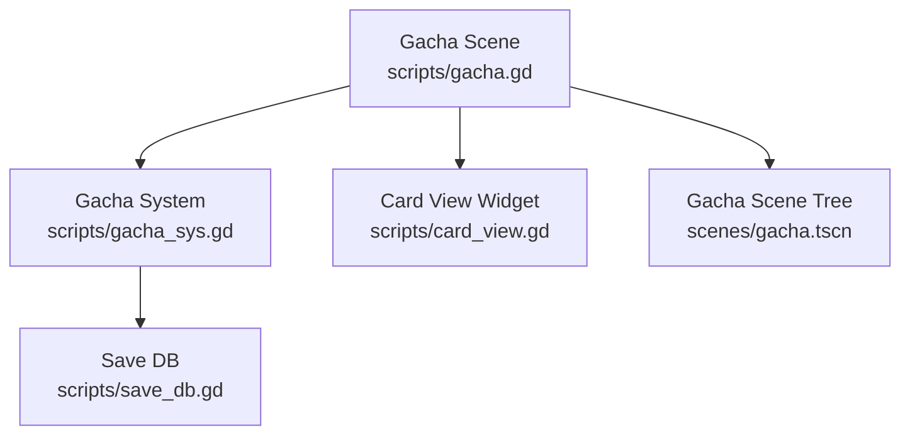
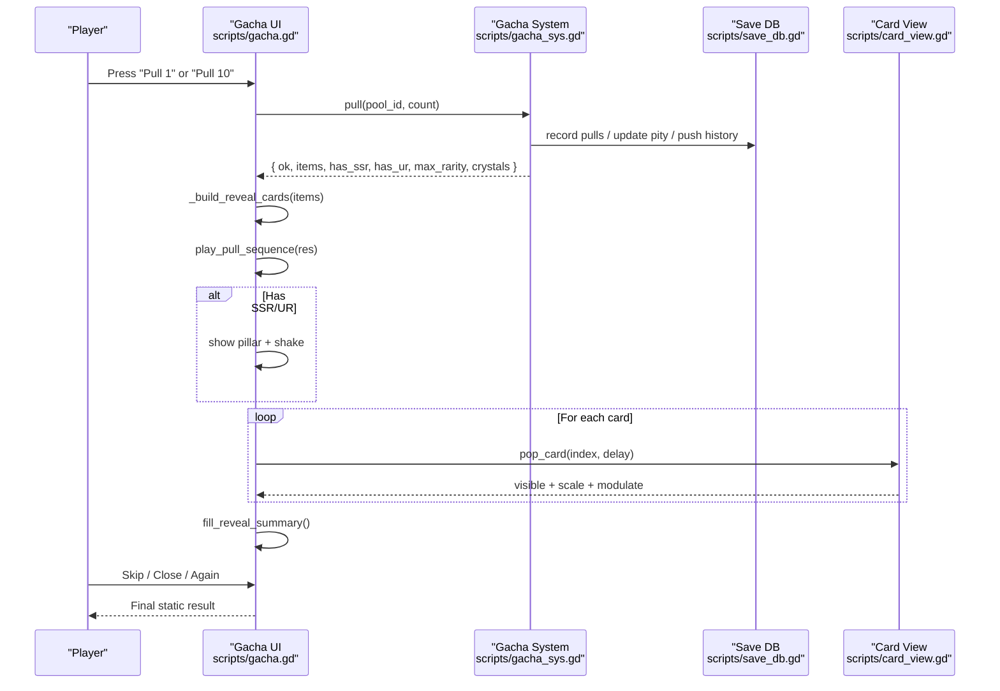
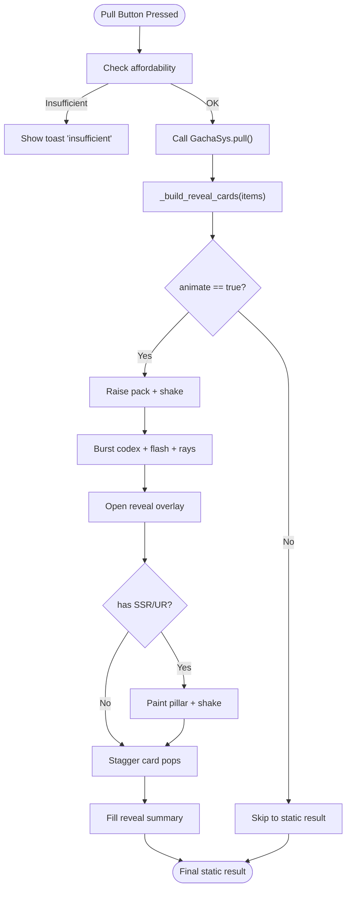
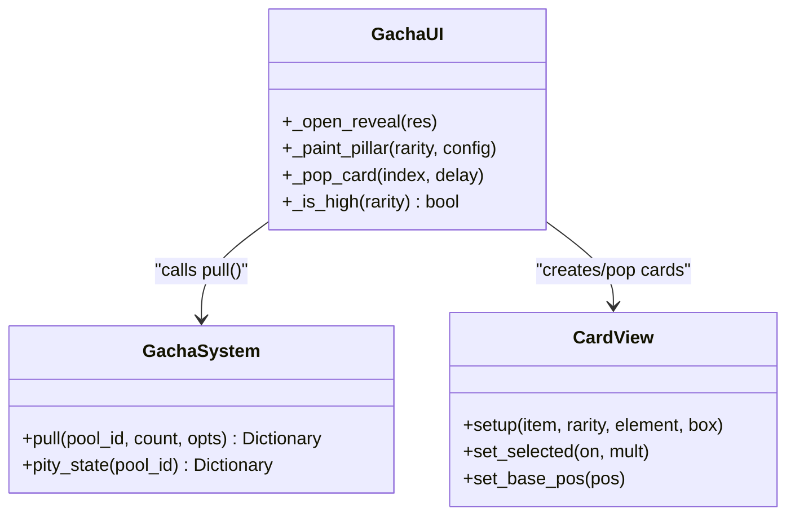
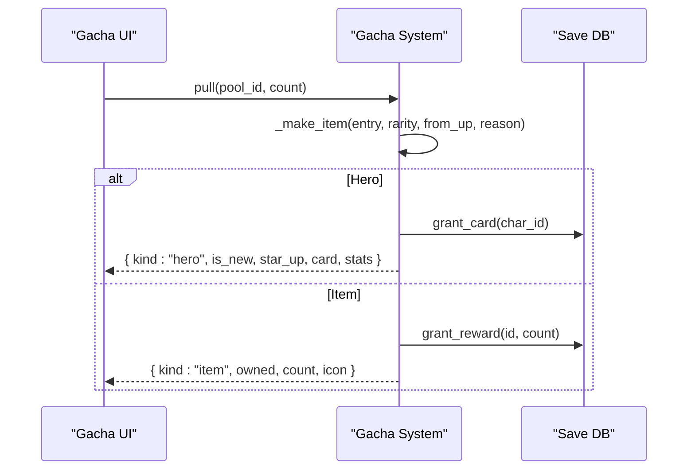
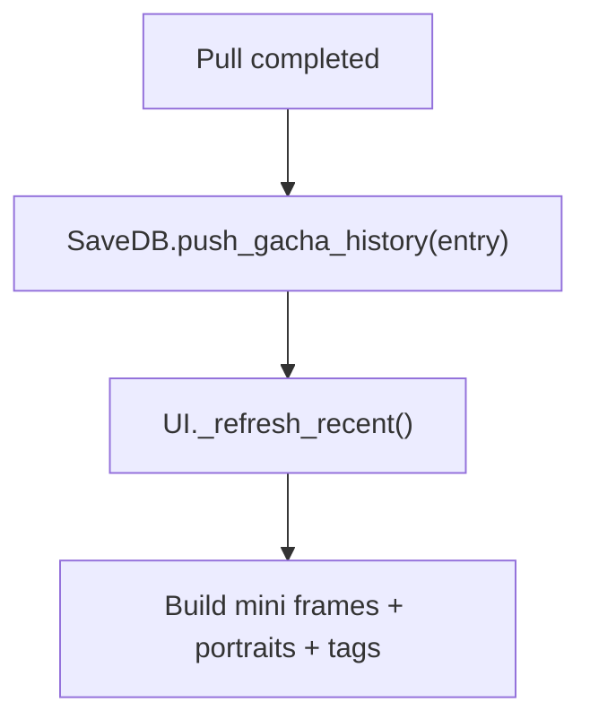
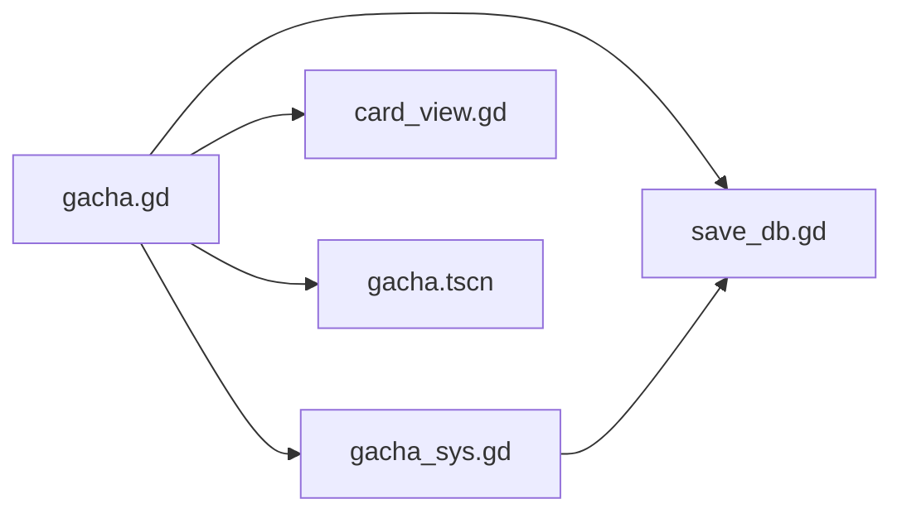

# Pull Animation & Presentation

<cite>
**Referenced Files in This Document**
- [gacha.gd](file://scripts/gacha.gd)
- [gacha_sys.gd](file://scripts/gacha_sys.gd)
- [card_view.gd](file://scripts/card_view.gd)
- [save_db.gd](file://scripts/save_db.gd)
- [gacha.tscn](file://scenes/gacha.tscn)
</cite>

## Table of Contents
1. Introduction
2. Project Structure
3. Core Components
4. Architecture Overview
5. Detailed Component Analysis
6. Dependency Analysis
7. Performance Considerations
8. Troubleshooting Guide
9. Conclusion

## Introduction
This document explains how pull results are processed and presented to the player in the gacha system, focusing on card reveal animations, rarity-based visual effects, multi-pull sequencing, and user interaction during animations. It also covers how different result types (new characters, duplicates, items) are handled visually, and how pull history, recent heroes showcase, and result summary screens integrate with the core logic.

## Project Structure
The gacha presentation layer is implemented as a Godot scene with a script controller that orchestrates UI, animation, and data binding. The core gacha logic lives in a separate system module that computes pulls, applies pity rules, updates persistence, and emits events. A reusable card widget renders character cards with rarity-aware visuals.

**Diagram sources**
- [gacha.gd:1-120](file://scripts/gacha.gd#L1-L120)
- [gacha_sys.gd:1-60](file://scripts/gacha_sys.gd#L1-L60)
- [card_view.gd:1-60](file://scripts/card_view.gd#L1-L60)
- [save_db.gd:557-605](file://scripts/save_db.gd#L557-L605)
- [gacha.tscn:1-120](file://scenes/gacha.tscn#L1-L120)

**Section sources**
- [gacha.gd:1-120](file://scripts/gacha.gd#L1-L120)
- [gacha.tscn:1-120](file://scenes/gacha.tscn#L1-L120)

## Core Components
- Gacha UI controller: handles user input, builds reveal cards, plays pull sequence animations, manages skip behavior, and updates UI state like currency, pity bars, and panels.
- Gacha system: pure-function-driven probability, pity, UP selection, cost calculation, item application, crystal accumulation, and history recording.
- Card view widget: renders character cards with rarity frames, element badges, stats band, hover/selection animations, and portrait layout.
- Save database: persists pulls, pity counters, history, and provides recent heroes for the showcase row.

Key responsibilities and interactions:
- UI calls system.pull() to compute results, then constructs reveal cards and animates them.
- System returns structured results including flags for SSR/UR, max rarity, new/duplicate status, and item metadata.
- UI uses these flags to trigger light pillars, screen shake, staggered card pops, and summary text.
- History and recent heroes are updated by the system and refreshed by the UI.

**Section sources**
- [gacha.gd:602-742](file://scripts/gacha.gd#L602-L742)
- [gacha_sys.gd:196-318](file://scripts/gacha_sys.gd#L196-L318)
- [card_view.gd:44-111](file://scripts/card_view.gd#L44-L111)
- [save_db.gd:557-605](file://scripts/save_db.gd#L557-L605)

## Architecture Overview
The flow from user action to animated result display:

**Diagram sources**
- [gacha.gd:602-742](file://scripts/gacha.gd#L602-L742)
- [gacha_sys.gd:196-318](file://scripts/gacha_sys.gd#L196-L318)
- [save_db.gd:557-605](file://scripts/save_db.gd#L557-L605)
- [card_view.gd:321-363](file://scripts/card_view.gd#L321-L363)

## Detailed Component Analysis

### Pull Sequence and Reveal Animations
- Pull initiation:
  - Validates affordability via cost calculation and triggers system.pull().
  - Builds reveal cards before starting animations so skipping remains safe.
- Sequence phases:
  - Pack raise and shake.
  - Burst codex with flash and radial rays.
  - Open reveal overlay with backdrop/title/subtitle fade-in.
  - If SSR/UR present: paint pillar color (purple for SSR, rainbow for UR), apply screen shake, then stagger card pops.
  - Cards animate with scale bounce and alpha fade; high-rarity cards continue subtle modulate shimmer.
- User interaction:
  - Skip collapses remaining animations into final static state immediately.
  - Close button hides reveal overlay and resets busy flag.
  - Again button reopens reveal without recomputing results.

**Diagram sources**
- [gacha.gd:602-742](file://scripts/gacha.gd#L602-L742)
- [gacha.gd:742-894](file://scripts/gacha.gd#L742-L894)

**Section sources**
- [gacha.gd:602-742](file://scripts/gacha.gd#L602-L742)
- [gacha.gd:742-894](file://scripts/gacha.gd#L742-L894)

### Rarity-Based Visual Effects
- Light pillar:
  - SSR: purple pillar strips and base glow.
  - UR: rainbow-colored strips with warm base glow.
  - Non-high rarity: pillar hidden.
- Screen shake:
  - Amplitude and duration derived from reveal configuration keyed by max rarity.
- Card shimmer:
  - High-rarity cards (SSR/UR) receive looping modulate oscillation after landing to emphasize dynamic card faces.

**Diagram sources**
- [gacha.gd:742-894](file://scripts/gacha.gd#L742-L894)
- [gacha_sys.gd:196-318](file://scripts/gacha_sys.gd#L196-L318)
- [card_view.gd:44-111](file://scripts/card_view.gd#L44-L111)

**Section sources**
- [gacha.gd:742-894](file://scripts/gacha.gd#L742-L894)

### Handling Different Result Types Visually
- New characters:
  - Item includes is_new flag; UI can highlight new acquisition contextually (e.g., shop panel shows “未持有 · 兑换即得新卡”).
- Duplicates:
  - System tracks star_up when granting a duplicate hero; UI can reflect upgrade outcomes where applicable.
- Items:
  - Non-hero entries include name, icon, and count; UI displays compact cards for multi-pulls and omits character-specific details.

**Diagram sources**
- [gacha_sys.gd:457-529](file://scripts/gacha_sys.gd#L457-L529)

**Section sources**
- [gacha_sys.gd:457-529](file://scripts/gacha_sys.gd#L457-L529)

### Pull History Display and Recent Heroes Showcase
- Pull history:
  - Each pull pushes an entry with pool, char_id, rarity, star, up flag, timestamp.
  - History list is capped to prevent save bloat.
- Recent heroes:
  - UI reads the last N hero entries (excluding items) and renders small framed thumbnails with rarity tags and names.
  - Glow accents match rarity colors.

**Diagram sources**
- [gacha_sys.gd:295-318](file://scripts/gacha_sys.gd#L295-L318)
- [save_db.gd:575-605](file://scripts/save_db.gd#L575-L605)
- [gacha.gd:356-400](file://scripts/gacha.gd#L356-L400)

**Section sources**
- [gacha_sys.gd:295-318](file://scripts/gacha_sys.gd#L295-L318)
- [save_db.gd:575-605](file://scripts/save_db.gd#L575-L605)
- [gacha.gd:356-400](file://scripts/gacha.gd#L356-L400)

### Result Summary Screens
- Summary content:
  - Shows wish crystals gained, total pulls, and current pity progress (small/large).
  - Populated lazily when reveal opens or when all cards are revealed.
- Contextual subtitle:
  - Displays “彩虹光柱冲天 · UR 降临” or “紫色光柱冲天 · SSR 降临” based on max rarity.

**Section sources**
- [gacha.gd:742-796](file://scripts/gacha.gd#L742-L796)
- [gacha.gd:907-916](file://scripts/gacha.gd#L907-L916)

### Multi-Pull Timing and Sequencing
- Single vs multi layout:
  - Single pull uses full-size card; multi-pull uses compact cards arranged in columns.
- Staggered reveals:
  - Each card pops with a delay proportional to its index, creating cascading effect.
- Interaction during animations:
  - Skip collapses remaining steps instantly to final state.
  - Busy flag prevents overlapping pulls until finish.

**Section sources**
- [gacha.gd:853-905](file://scripts/gacha.gd#L853-L905)

### Card View Rendering Details
- Layering:
  - Rarity glow → shadow → bed → portrait (clipped to inner rect) → frame → info band.
- Info band:
  - Stats band split into three equal sections to avoid overflow under thick frames.
- Element badge and rarity marks:
  - Badge positioned within inner rect; rarity label and stars placed relative to right edge.
- Hover and selection:
  - Hover scales and lifts card; selection adds golden ring and adjusts z-index.

**Section sources**
- [card_view.gd:44-111](file://scripts/card_view.gd#L44-L111)
- [card_view.gd:115-218](file://scripts/card_view.gd#L115-L218)
- [card_view.gd:220-321](file://scripts/card_view.gd#L220-L321)
- [card_view.gd:337-363](file://scripts/card_view.gd#L337-L363)

## Dependency Analysis
- UI depends on:
  - Gacha system for deterministic pull results and pity state.
  - Save database for currency, materials, pity counters, and history.
  - Card view widget for rendering individual cards.
- System depends on:
  - GameDB for rates, pools, UP lists, pity config, and ten-guarantee settings.
  - SaveDB for balance checks, material counts, granting cards/rewards, and persisting state.
- Scene tree defines nodes referenced by UI script (reveal layers, buttons, labels, panels).

**Diagram sources**
- [gacha.gd:1-120](file://scripts/gacha.gd#L1-L120)
- [gacha_sys.gd:1-60](file://scripts/gacha_sys.gd#L1-L60)
- [save_db.gd:557-605](file://scripts/save_db.gd#L557-L605)
- [card_view.gd:1-60](file://scripts/card_view.gd#L1-L60)
- [gacha.tscn:1-120](file://scenes/gacha.tscn#L1-L120)

**Section sources**
- [gacha.gd:1-120](file://scripts/gacha.gd#L1-L120)
- [gacha_sys.gd:1-60](file://scripts/gacha_sys.gd#L1-L60)
- [save_db.gd:557-605](file://scripts/save_db.gd#L557-L605)
- [card_view.gd:1-60](file://scripts/card_view.gd#L1-L60)
- [gacha.tscn:1-120](file://scenes/gacha.tscn#L1-L120)

## Performance Considerations
- Pre-build reveal cards before animations to ensure skip and close do not cause missing data.
- Use staggered card pops to distribute per-frame workload across multiple frames.
- Limit history size to prevent save growth and reduce UI rebuild costs.
- Avoid redundant tweens by killing existing ones before starting new sequences.
- Keep high-rarity shimmer loops lightweight; they run only on SSR/UR cards.

[No sources needed since this section provides general guidance]

## Troubleshooting Guide
- Pull fails due to insufficient resources:
  - UI shows toast with reason and refreshes cost labels.
- No SSR/UR but still shows pillar:
  - Verify has_ssr/has_ur flags in result and pillar painting logic.
- Cards not popping or stuck:
  - Check _card_nodes array population and _pop_card delays; ensure animate flag is set correctly.
- Skip does not finalize:
  - Confirm _skip_reveal sets _skipped, hides pillar, forces overlays opaque, reveals all cards, and calls finish.
- Recent heroes not updating:
  - Ensure push_gacha_history is called and _refresh_recent runs after pull completion.

**Section sources**
- [gacha.gd:602-638](file://scripts/gacha.gd#L602-L638)
- [gacha.gd:742-796](file://scripts/gacha.gd#L742-L796)
- [gacha.gd:883-905](file://scripts/gacha.gd#L883-L905)
- [gacha_sys.gd:295-318](file://scripts/gacha_sys.gd#L295-L318)
- [save_db.gd:575-605](file://scripts/save_db.gd#L575-L605)

## Conclusion
The gacha presentation system cleanly separates core logic from UI orchestration. The UI controller drives animations, manages user interactions, and binds results to visual components, while the system ensures deterministic, configurable probabilities and persistence. Rarity-based effects, multi-pull staggering, and summary/history features provide clear feedback and engagement. The design supports testability, performance, and extensibility through configuration-driven behaviors and modular components.