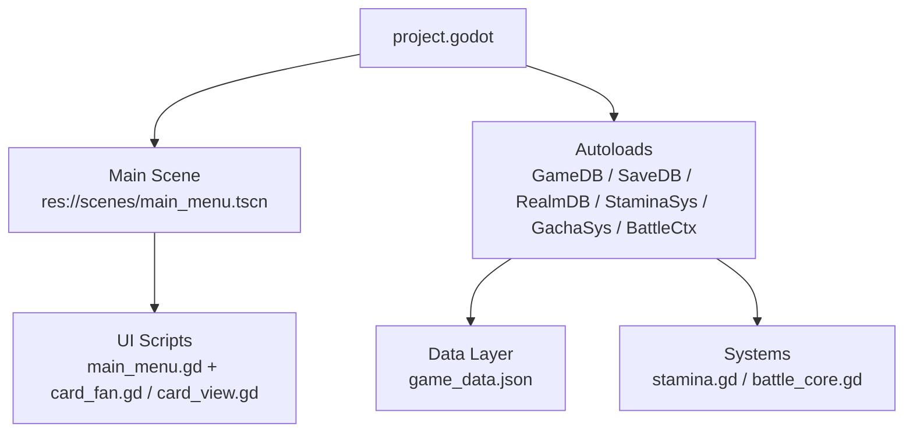
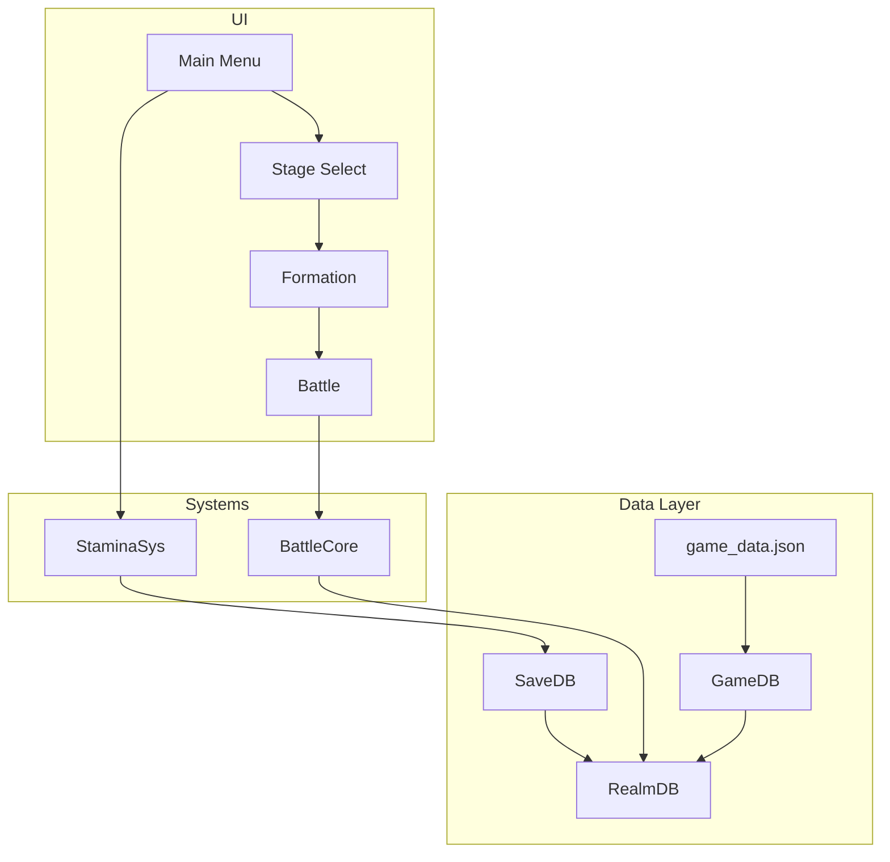
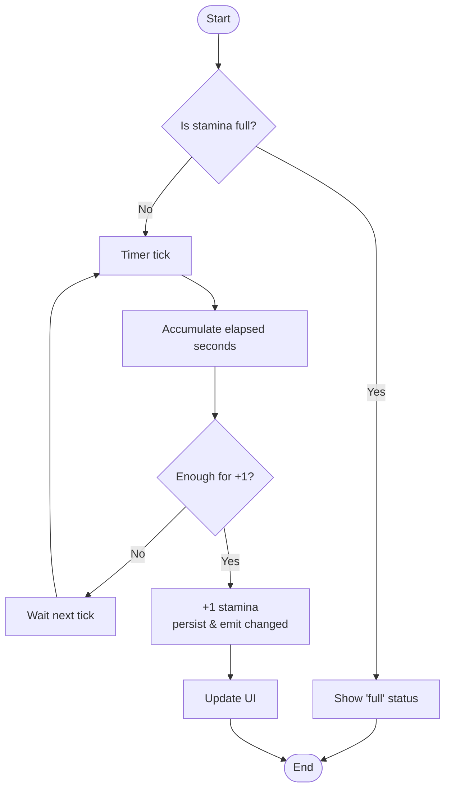
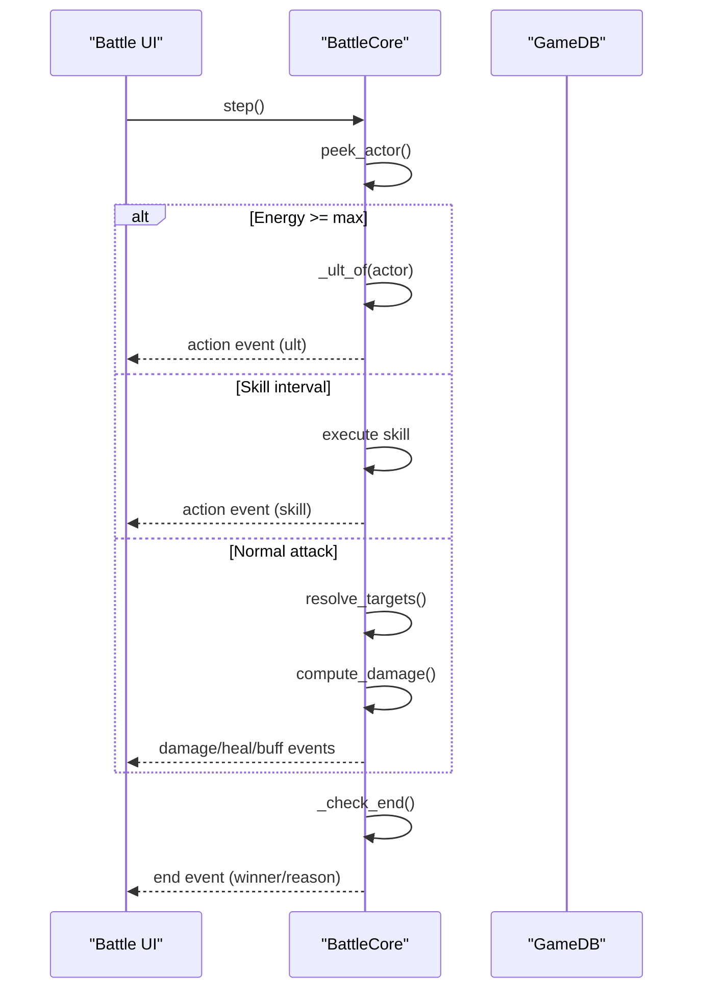
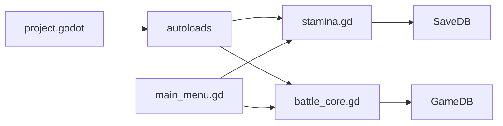

# Getting Started

<cite>
**Referenced Files in This Document**
- [README.md](file://README.md)
- [project.godot](file://project.godot)
- [scripts/main_menu.gd](file://scripts/main_menu.gd)
- [scenes/main_menu.tscn](file://scenes/main_menu.tscn)
- [scripts/stamina.gd](file://scripts/stamina.gd)
- [scripts/battle_core.gd](file://scripts/battle_core.gd)
- [data/game_data.json](file://data/game_data.json)
</cite>

## Table of Contents
1. Introduction
2. Project Structure
3. Core Components
4. Architecture Overview
5. Detailed Component Analysis
6. Dependency Analysis
7. Performance Considerations
8. Troubleshooting Guide
9. Conclusion
10. Appendices

## Introduction
This guide helps new developers set up and run Card Adventure (卡牌大冒险) on Godot 4.7.2, understand the project layout, navigate scenes, and learn core gameplay loops such as stamina usage, character collection via gacha, and the 3×3 semi-automatic ATB battle system. It is written for both newcomers to Godot and experienced developers who need a fast orientation to this codebase.

## Project Structure
At a high level:
- project.godot defines engine features, main scene, autoloads, display settings, and rendering driver.
- data/game_data.json is the single source of truth for game configuration (characters, monsters, stages, combat, economy, menus).
- scenes/ contains generated UI scenes; scripts/ contains logic and autoload systems.
- tools/ provides build, smoke tests, screenshot helpers, and asset prep utilities.

**Diagram sources**
- [project.godot:1-22](file://project.godot#L1-L22)
- [scenes/main_menu.tscn:1-20](file://scenes/main_menu.tscn#L1-L20)
- [scripts/main_menu.gd:1-20](file://scripts/main_menu.gd#L1-L20)

**Section sources**
- [project.godot:1-50](file://project.godot#L1-L50)
- [README.md:62-96](file://README.md#L62-L96)

## Core Components
- GameDB: read-only configuration access to game_data.json.
- SaveDB: persistent save layer (user://save.json).
- RealmDB: derived stats, power, synergies, counters (no persistence).
- StaminaSys: stamina recovery with offline accounting.
- BattleCore: deterministic, config-driven 3×3 ATB battle logic.
- Scenes: main_menu, stage_select, formation, battle, gacha (generated by tools/build_*.gd).

Key entry points:
- Main menu scene drives navigation to stage selection and other modules.
- StaminaSys updates UI and enforces stamina costs before battles.
- BattleCore runs battles deterministically based on configurations.

**Section sources**
- [README.md:76-84](file://README.md#L76-L84)
- [scripts/main_menu.gd:1-20](file://scripts/main_menu.gd#L1-L20)
- [scripts/stamina.gd:1-10](file://scripts/stamina.gd#L1-L10)
- [scripts/battle_core.gd:1-15](file://scripts/battle_core.gd#L1-L15)

## Architecture Overview
The runtime architecture separates concerns into layers:
- Data layer: GameDB reads JSON; SaveDB persists user state; RealmDB computes derived values.
- Systems: StaminaSys manages stamina; BattleCore executes battles.
- UI: Scenes are generated and wired by scripts that bind data to visuals.

**Diagram sources**
- [project.godot:14-21](file://project.godot#L14-L21)
- [scripts/main_menu.gd:46-68](file://scripts/main_menu.gd#L46-L68)
- [scripts/stamina.gd:19-36](file://scripts/stamina.gd#L19-L36)
- [scripts/battle_core.gd:44-66](file://scripts/battle_core.gd#L44-L66)

## Detailed Component Analysis

### Setup and First Run
- Use Godot 4.7.2 exactly; mismatched versions will cause project config errors.
- Import resources and generate caches:
  - Headless import: run the engine with --headless --path . --import.
- Launch the game:
  - Default main scene is res://scenes/main_menu.tscn.
  - Optional resolution flag supported.

Notes:
- Export presets must be created in-editor first if you plan to export Windows builds.
- Save file location follows Godot’s user:// path under app_userdata.

**Section sources**
- [README.md:14-30](file://README.md#L14-L30)
- [README.md:32-46](file://README.md#L32-L46)
- [README.md:48-58](file://README.md#L48-L58)
- [project.godot:6-12](file://project.godot#L6-L12)

### Project Import and Initial Configuration
- The project uses Forward Plus renderer and sets the default window size to 1920×1080 with canvas_items stretch mode.
- Global UI font is configured in gui/theme.
- Rendering driver defaults to d3d12 on Windows.

What to check after import:
- Ensure assets imported correctly (textures, fonts, icons).
- Confirm main scene loads without errors.
- Verify autoloads initialize (GameDB, SaveDB, RealmDB, StaminaSys, GachaSys, BattleCtx).

**Section sources**
- [project.godot:23-32](file://project.godot#L23-L32)
- [project.godot:47-50](file://project.godot#L47-L50)

### Development Workflow: Running and Navigating
- Start from the main menu:
  - Click “进入冒险” to go to stage selection.
  - Click “召集” to open gacha.
- Stage selection:
  - Choose a node; click “进入关卡” to proceed to formation.
- Formation:
  - Adjust lineup; click “确认选择” to spend stamina and start battle.
- Battle:
  - Controls: speed toggle, pause, skip, retreat.
  - Results: retry or close back to stage select.

Important stamina rules:
- Stamina cost is checked at stage select and deducted when confirming lineup.
- Retreat does not refund stamina.

**Section sources**
- [scripts/main_menu.gd:94-125](file://scripts/main_menu.gd#L94-L125)
- [scripts/main_menu.gd:217-225](file://scripts/main_menu.gd#L217-L225)
- [README.md:102-117](file://README.md#L102-L117)
- [README.md:136-150](file://README.md#L136-L150)
- [README.md:207-224](file://README.md#L207-L224)
- [README.md:246-253](file://README.md#L246-L253)

### Quick Tutorial: Core Gameplay Concepts

#### Stamina Usage
- Max stamina and recovery rate come from configuration.
- Recovery is time-based and accounts for offline time.
- UI shows current/max and next recovery countdown.

**Diagram sources**
- [scripts/stamina.gd:19-36](file://scripts/stamina.gd#L19-L36)
- [scripts/stamina.gd:120-141](file://scripts/stamina.gd#L120-L141)
- [scripts/stamina.gd:155-165](file://scripts/stamina.gd#L155-L165)

**Section sources**
- [scripts/stamina.gd:52-82](file://scripts/stamina.gd#L52-L82)
- [scripts/stamina.gd:86-117](file://scripts/stamina.gd#L86-L117)
- [scripts/stamina.gd:120-141](file://scripts/stamina.gd#L120-L141)

#### Character Collection (Gacha)
- Three pools: standard, limited UP, friend.
- Probabilities and pity rules are defined in configuration.
- New player gifts ensure early pulls.
- Wish crystals accumulate and can be used in the shop.

How it fits in the flow:
- From main menu, open gacha page to pull cards.
- Pull results show animations and add cards to your roster.

**Section sources**
- [README.md:254-276](file://README.md#L254-L276)
- [README.md:411-429](file://README.md#L411-L429)

#### Simple Battle Mechanics
- 3×3 grid: front row tanks, middle deals damage, back heals/supports; assassins target lowest HP back row.
- Semi-automatic ATB: units act based on speed; players control speed/pause/skip/retreat.
- Damage formula includes mitigation, element counter, crit, variance, and traits.
- Ultimates trigger when energy reaches max; boss ults may be defined via traits.

**Diagram sources**
- [scripts/battle_core.gd:392-425](file://scripts/battle_core.gd#L392-L425)
- [scripts/battle_core.gd:441-466](file://scripts/battle_core.gd#L441-L466)
- [scripts/battle_core.gd:477-516](file://scripts/battle_core.gd#L477-L516)
- [scripts/battle_core.gd:672-711](file://scripts/battle_core.gd#L672-L711)
- [scripts/battle_core.gd:766-800](file://scripts/battle_core.gd#L766-L800)

**Section sources**
- [README.md:207-224](file://README.md#L207-L224)
- [README.md:302-318](file://README.md#L302-L318)
- [scripts/battle_core.gd:269-284](file://scripts/battle_core.gd#L269-L284)

### Understanding the Project Structure
- Scenes are generated by tools/build_*.gd; do not edit .tscn files directly.
- All major behaviors are driven by configuration in game_data.json.
- Autoloads centralize cross-scene state and services.

Practical tips:
- To adjust UI layout, modify build scripts then regenerate scenes.
- To tweak gameplay numbers, edit game_data.json and re-run relevant tooling if needed.

**Section sources**
- [README.md:550-563](file://README.md#L550-L563)
- [README.md:432-464](file://README.md#L432-L464)

## Dependency Analysis
- project.godot wires autoloads that are consumed across scenes and systems.
- main_menu.gd binds UI to data layers and navigates to other scenes.
- stamina.gd persists and updates stamina, emitting signals for UI refresh.
- battle_core.gd depends on GameDB for combat parameters and uses RealmDB-derived entries for player units.

**Diagram sources**
- [project.godot:14-21](file://project.godot#L14-L21)
- [scripts/main_menu.gd:46-68](file://scripts/main_menu.gd#L46-L68)
- [scripts/stamina.gd:19-36](file://scripts/stamina.gd#L19-L36)
- [scripts/battle_core.gd:44-66](file://scripts/battle_core.gd#L44-L66)

**Section sources**
- [project.godot:14-21](file://project.godot#L14-L21)
- [scripts/main_menu.gd:94-125](file://scripts/main_menu.gd#L94-L125)
- [scripts/stamina.gd:86-117](file://scripts/stamina.gd#L86-L117)
- [scripts/battle_core.gd:108-188](file://scripts/battle_core.gd#L108-L188)

## Performance Considerations
- Deterministic ATB: using fixed gauge_max and speed avoids delta accumulation drift, enabling reproducible runs and reliable smoke tests.
- Low-frequency persistence: stamina saves periodically to reduce disk writes.
- Config-driven behavior: changes to gameplay often require only edits to game_data.json rather than code.

[No sources needed since this section provides general guidance]

## Troubleshooting Guide
Common setup issues and solutions:
- Engine version mismatch:
  - Symptom: project.godot config_version error.
  - Fix: use Godot 4.7.2 exactly.
- Missing export templates:
  - Symptom: editor prompts for templates during export.
  - Fix: install templates via editor or import existing template package.
- Scenes missing or not loading:
  - Symptom: toast messages about missing scenes/routes.
  - Fix: ensure scenes exist and routes point to valid paths; rebuild scenes via tools/build_*.gd if needed.
- Stamina not recovering:
  - Symptom: stamina stuck or no countdown.
  - Fix: verify stamina.cfg values and that apply_offline runs on load; check saved timestamps.
- Battle not starting:
  - Symptom: cannot enter battle from formation.
  - Fix: ensure stamina is sufficient and team is valid; confirm stage_id is set in context.

Where to look:
- project.godot for engine and main scene settings.
- README.md for headless import/export commands and known pitfalls.
- scripts/stamina.gd for recovery logic and persistence.
- scripts/main_menu.gd for route checks and scene transitions.
- scripts/battle_core.gd for battle setup and termination conditions.

**Section sources**
- [README.md:14-30](file://README.md#L14-L30)
- [README.md:32-46](file://README.md#L32-L46)
- [scripts/stamina.gd:19-36](file://scripts/stamina.gd#L19-L36)
- [scripts/main_menu.gd:106-125](file://scripts/main_menu.gd#L106-L125)
- [scripts/battle_core.gd:44-66](file://scripts/battle_core.gd#L44-L66)

## Conclusion
You now have the essentials to set up Card Adventure, run it, navigate its scenes, and understand how stamina, gacha, and battles work. For deeper changes, focus on game_data.json for content and tools/build_*.gd for UI generation. Use smoke tests and screenshots to validate changes quickly.

[No sources needed since this section summarizes without analyzing specific files]

## Appendices

### Appendix A: Key Commands
- Headless import: run engine with --headless --path . --import.
- Run game: run engine with --path . (main scene auto-loaded).
- Screenshot tools: use provided shot scripts with desired parameters.

**Section sources**
- [README.md:14-30](file://README.md#L14-L30)
- [README.md:521-545](file://README.md#L521-L545)

### Appendix B: Data Layer Index
- Economy currencies, elements, combat parameters, roles, characters, growth, gacha, idle, stamina, adventure chapters, modes, menu, monsters, formation rules are all defined in game_data.json.

**Section sources**
- [data/game_data.json:1-200](file://data/game_data.json#L1-L200)
- [README.md:432-464](file://README.md#L432-L464)