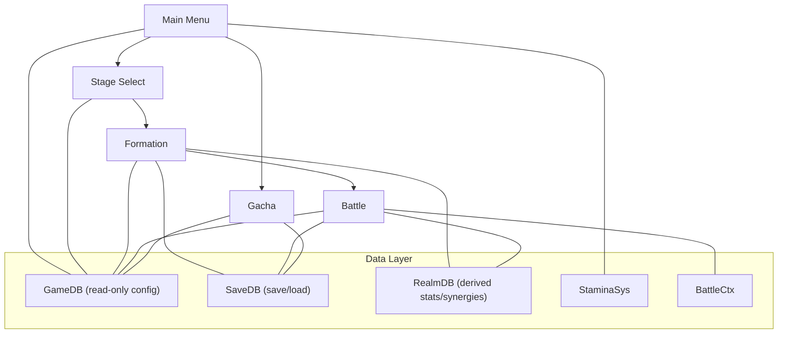
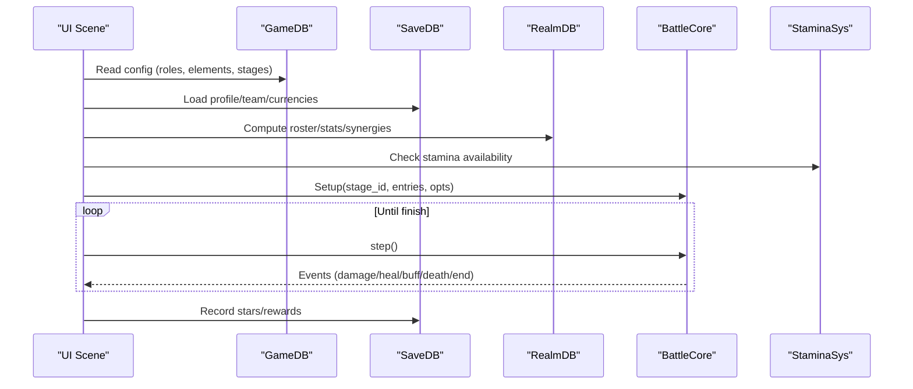
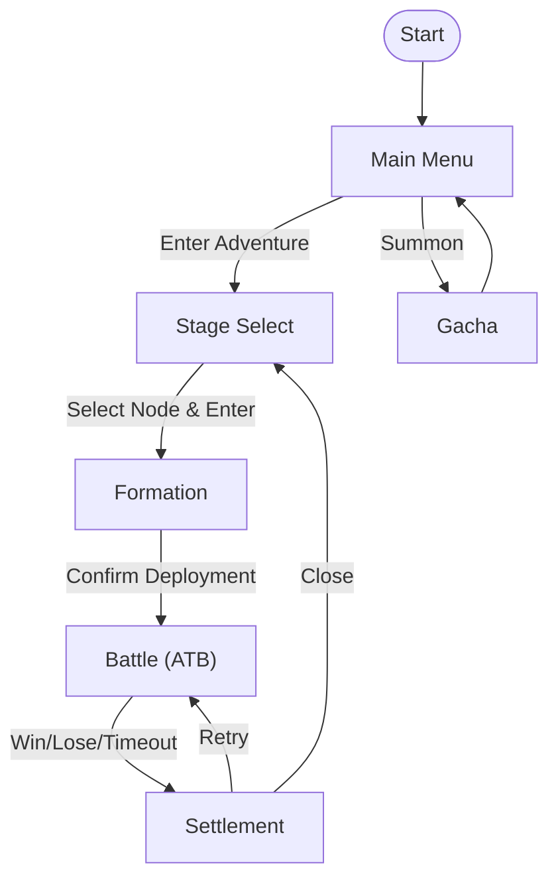
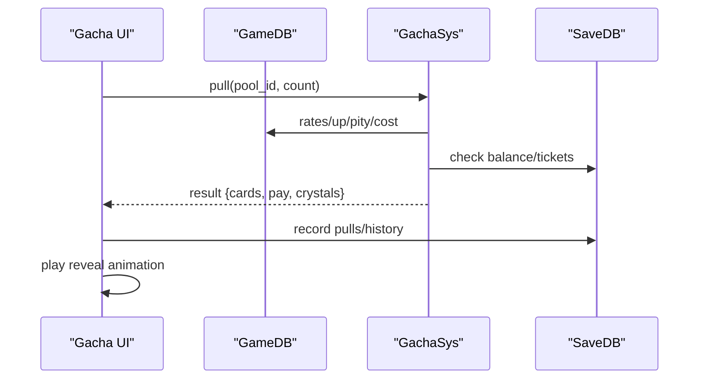
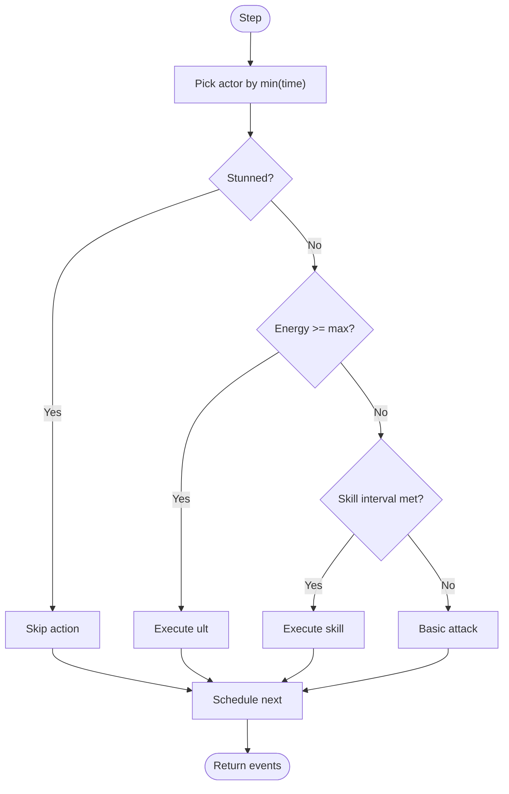
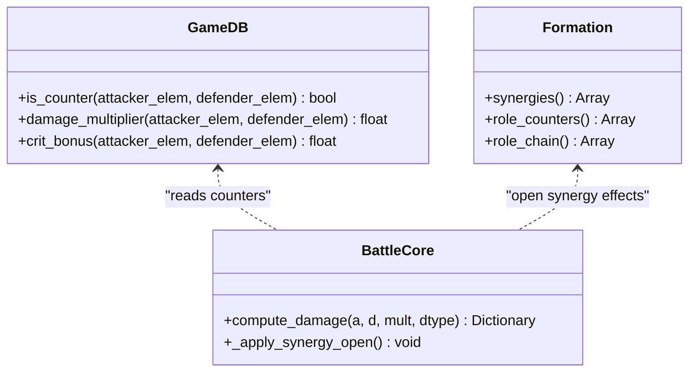
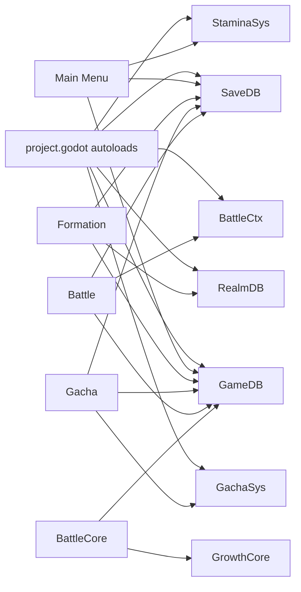

# Project Overview

<cite>
**Referenced Files in This Document**
- [README.md](file://README.md)
- [project.godot](file://project.godot)
- [game_data.json](file://data/game_data.json)
- [main_menu.gd](file://scripts/main_menu.gd)
- [battle_core.gd](file://scripts/battle_core.gd)
- [growth_core.gd](file://scripts/growth_core.gd)
- [stamina.gd](file://scripts/stamina.gd)
- [formation.gd](file://scripts/formation.gd)
- [gacha.gd](file://scripts/gacha.gd)
- [game_db.gd](file://scripts/game_db.gd)
</cite>

## Table of Contents
1. Introduction
2. Project Structure
3. Core Components
4. Architecture Overview
5. Detailed Component Analysis
6. Dependency Analysis
7. Performance Considerations
8. Troubleshooting Guide
9. Conclusion

## Introduction
Card Adventure is a 2.5D strategy card RPG that blends card collection with formation-based tactical combat. The game runs on Godot Engine 4.7.2 using GDScript for gameplay logic and Python tools for data preparation, scene generation, and testing. The core loop takes players from the main menu to stage selection, formation setup, a 3x3 semi-automatic ATB battle simulation, and settlement with rewards and star ratings. Key features include gacha mechanics (standard, limited UP, friend pools), element counters with damage multipliers and bonus crit chance, team synergy bonuses applied as final stat multipliers, and a stamina system that regenerates offline.

## Project Structure
The project separates configuration, scenes, scripts, assets, and tooling:
- Configuration: centralized JSON defines characters, monsters, stages, combat rules, gacha, stamina, menus, and more.
- Scenes: main menu, stage select, formation, battle, and gacha are generated programmatically by build scripts; runtime UIs wire data to nodes.
- Scripts: autoload singletons provide read-only config (GameDB), save persistence (SaveDB), derived stats and synergies (RealmDB), stamina management (StaminaSys), per-battle context (BattleCtx), and pure logic cores (BattleCore, GrowthCore).
- Tools: Python and GDScript utilities generate scenes, run smoke tests, capture screenshots, and prepare assets.

**Diagram sources**
- [project.godot:14-21](file://project.godot#L14-L21)
- [game_db.gd:1-10](file://scripts/game_db.gd#L1-L10)
- [stamina.gd:1-10](file://scripts/stamina.gd#L1-L10)
- [battle_core.gd:1-15](file://scripts/battle_core.gd#L1-L15)

**Section sources**
- [README.md:62-96](file://README.md#L62-L96)
- [project.godot:6-21](file://project.godot#L6-L21)

## Core Components
- GameDB: Loads and exposes read-only access to game_data.json sections (elements, roles, rarities, stages, gacha, stamina, etc.).
- SaveDB: Persists player profile, currencies, cards, progress, stamina timestamps, and team presets.
- RealmDB: Derives final stats, power, synergies, counters, and roster for UI and battle.
- StaminaSys: Tracks current stamina, regeneration rate, offline recovery, and persistence.
- BattleCore: Pure logic engine for 3x3 ATB battles: turn scheduling, target resolution, damage/healing/shield/buff execution, boss traits, timeouts, and win conditions.
- GrowthCore: Centralized formulas for attribute growth and unified power calculation used across UI and battle.
- Formation: UI and rules for hero selection, filtering/sorting/search, 3x3 board placement, preset switching, quick fill, and confirmation flow.
- Gacha: UI for pulling, rates display, pity tracking, wish crystal shop, reveal animations, and result handling.
- Main Menu: Hub wiring player info, showcase lineup, stamina, and navigation to adventure or gacha.

**Section sources**
- [game_db.gd:1-10](file://scripts/game_db.gd#L1-L10)
- [stamina.gd:1-10](file://scripts/stamina.gd#L1-L10)
- [battle_core.gd:1-15](file://scripts/battle_core.gd#L1-L15)
- [growth_core.gd:1-10](file://scripts/growth_core.gd#L1-L10)
- [formation.gd:1-13](file://scripts/formation.gd#L1-L13)
- [gacha.gd:1-12](file://scripts/gacha.gd#L1-L12)
- [main_menu.gd:1-8](file://scripts/main_menu.gd#L1-L8)

## Architecture Overview
The architecture follows a layered approach:
- Data layer: GameDB reads configuration; SaveDB persists state; RealmDB computes derived values without writing to disk.
- Systems: StaminaSys manages stamina; BattleCtx holds per-battle context; GachaSys encapsulates pull/pity/exchange logic.
- Logic cores: GrowthCore provides shared math; BattleCore executes deterministic ATB steps returning events for UI playback.
- UI layers: Each scene wires data to visuals and handles user input, delegating to systems and cores.

**Diagram sources**
- [game_db.gd:17-37](file://scripts/game_db.gd#L17-L37)
- [stamina.gd:19-36](file://scripts/stamina.gd#L19-L36)
- [battle_core.gd:44-66](file://scripts/battle_core.gd#L44-L66)
- [battle_core.gd:392-425](file://scripts/battle_core.gd#L392-L425)

## Detailed Component Analysis

### Gameplay Loop: Main Menu → Stage Select → Formation → Battle → Settlement
- Main Menu displays player info, stamina, showcase lineup, and routes to adventure or gacha.
- Stage Select shows map nodes, history stars, and stamina cost; entering a stage validates stamina and sets BattleCtx.
- Formation allows filtering/sorting/search, 3x3 board placement, presets, quick fill, and confirms deployment; stamina is deducted here based on configuration.
- Battle runs a deterministic ATB loop; UI plays events; timeout or wipe decides winner.
- Settlement awards currency/materials, updates stars (only increases), and returns to stage select.

**Section sources**
- [README.md:100-117](file://README.md#L100-L117)
- [README.md:136-152](file://README.md#L136-L152)
- [README.md:153-206](file://README.md#L153-L206)
- [README.md:207-253](file://README.md#L207-L253)
- [README.md:225-245](file://README.md#L225-L245)

### Gacha Mechanics
- Three pools: standard (basic tickets/bound gems), limited UP (advanced tickets, UP hero share), friend (guild tokens, no UR, no pity).
- Probabilities: UR 0.5%, SSR 3.5%, SR 18.0%, R 78.0%; UP within same rarity shares 50% of that rarity’s pool.
- Pity: small pity guarantees SSR+ at threshold; large pity guarantees UP hero; counts persist across periods for limited pools.
- Wish crystals accumulate per pull and can be exchanged for UP heroes in the shop.
- Animations: pack raise, burst, light rays, pillar effects for SSR/UR, staggered card reveals.

**Diagram sources**
- [gacha.gd:604-625](file://scripts/gacha.gd#L604-L625)
- [gacha.gd:667-686](file://scripts/gacha.gd#L667-L686)
- [game_db.gd:287-538](file://scripts/game_db.gd#L287-L538)

**Section sources**
- [README.md:254-276](file://README.md#L254-L276)
- [README.md:411-429](file://README.md#L411-L429)
- [gacha.gd:117-125](file://scripts/gacha.gd#L117-L125)
- [gacha.gd:176-186](file://scripts/gacha.gd#L176-L186)
- [gacha.gd:256-264](file://scripts/gacha.gd#L256-L264)
- [gacha.gd:280-325](file://scripts/gacha.gd#L280-L325)
- [gacha.gd:327-353](file://scripts/gacha.gd#L327-L353)
- [gacha.gd:403-415](file://scripts/gacha.gd#L403-L415)
- [gacha.gd:502-599](file://scripts/gacha.gd#L502-L599)
- [gacha.gd:604-686](file://scripts/gacha.gd#L604-L686)

### ATB Combat System
- Turn order: each unit’s next action time = current time + gauge_max / speed; pick smallest time to act.
- Actions: auto basic attack per role, periodic skills, ult when energy reaches max; boss ult via traits.
- Target resolution: nearest front, middle/back rows, lowest HP ally/foe, all allies, self and adjacent front.
- Damage formula: ATK × skill multiplier × mitigation; element counter adds multiplier and crit bonus; crit multiplier; physical cut; variance; minimum 1 damage.
- Buffs/Shields/Heals: support buffs stackable; shields absorb damage; heals use percentage or flat amounts.
- End conditions: wipe (all enemies/allies dead) or timeout after max actions decided by HP ratio.

**Diagram sources**
- [battle_core.gd:366-425](file://scripts/battle_core.gd#L366-L425)
- [battle_core.gd:441-466](file://scripts/battle_core.gd#L441-L466)
- [battle_core.gd:477-571](file://scripts/battle_core.gd#L477-L571)
- [battle_core.gd:574-667](file://scripts/battle_core.gd#L574-L667)
- [battle_core.gd:672-761](file://scripts/battle_core.gd#L672-L761)
- [battle_core.gd:764-800](file://scripts/battle_core.gd#L764-L800)

**Section sources**
- [README.md:207-224](file://README.md#L207-L224)
- [README.md:302-318](file://README.md#L302-L318)
- [battle_core.gd:1-15](file://scripts/battle_core.gd#L1-L15)
- [battle_core.gd:44-66](file://scripts/battle_core.gd#L44-L66)
- [battle_core.gd:269-284](file://scripts/battle_core.gd#L269-L284)
- [battle_core.gd:392-425](file://scripts/battle_core.gd#L392-L425)
- [battle_core.gd:477-571](file://scripts/battle_core.gd#L477-L571)
- [battle_core.gd:574-667](file://scripts/battle_core.gd#L574-L667)
- [battle_core.gd:672-761](file://scripts/battle_core.gd#L672-L761)
- [battle_core.gd:764-800](file://scripts/battle_core.gd#L764-L800)

### Element Counters and Team Synergy Bonuses
- Element counters: water > fire > wind > earth > light > dark > light; counter hits multiply damage and add crit chance.
- Synergies: declarative rules in formation config evaluate conditions (member counts, roles, elements, rows, rarities) and apply multiplicative stat boosts; open-energy/open-shield effects are applied at battle start.

**Diagram sources**
- [game_db.gd:83-102](file://scripts/game_db.gd#L83-L102)
- [game_db.gd:748-796](file://scripts/game_db.gd#L748-L796)
- [battle_core.gd:242-267](file://scripts/battle_core.gd#L242-L267)
- [battle_core.gd:672-710](file://scripts/battle_core.gd#L672-L710)

**Section sources**
- [README.md:281-289](file://README.md#L281-L289)
- [README.md:379-392](file://README.md#L379-L392)
- [game_db.gd:83-102](file://scripts/game_db.gd#L83-L102)
- [battle_core.gd:242-267](file://scripts/battle_core.gd#L242-L267)
- [battle_core.gd:672-710](file://scripts/battle_core.gd#L672-L710)

### Installation and Setup Guide
- Requirements: Godot 4.7.2 (Forward Plus); Windows uses D3D12 rendering driver.
- Run from source: import resources, then run with project path set to root; optional resolution flag.
- Export to Windows: create export preset if missing, install templates if prompted, export project to produce executable and package.
- Save location: user://save.json under AppData/Roaming/Godot/app_userdata; delete to reset; backup before running screenshot/test scripts.

**Section sources**
- [README.md:12-58](file://README.md#L12-L58)
- [project.godot:6-12](file://project.godot#L6-L12)
- [project.godot:47-50](file://project.godot#L47-L50)

### Basic Developer Setup
- Scene generation: scenes are built by tools/build_*.gd; modify build scripts to change layout constants; do not edit .tscn directly.
- Smoke tests: headless scripts validate configuration, battle logic, formation, stage select, main menu, and gacha; also a quit-after test for regression.
- Screenshots: require windowed mode; scripts drive scenes and capture frames; they write real saves so back up first.
- Data editing: game_data.json is the single source of truth; Python tools in tools/_inspect regenerate chapter stages, maps, formation rules, and menu rail.

**Section sources**
- [README.md:489-578](file://README.md#L489-L578)
- [README.md:465-486](file://README.md#L465-L486)

## Dependency Analysis
- Autoloads defined in project.godot centralize cross-scene services: GameDB, SaveDB, RealmDB, StaminaSys, GachaSys, BattleCtx.
- UI scenes depend on GameDB for configuration and SaveDB for persistent state; Formation and Gacha also rely on RealmDB and GachaSys respectively.
- BattleCore depends on GameDB for combat/board configs and GrowthCore for power calculations; it does not touch UI or persistence.
- StaminaSys persists to SaveDB and emits signals for UI updates.

**Diagram sources**
- [project.godot:14-21](file://project.godot#L14-L21)
- [game_db.gd:1-10](file://scripts/game_db.gd#L1-L10)
- [stamina.gd:1-10](file://scripts/stamina.gd#L1-L10)
- [battle_core.gd:1-15](file://scripts/battle_core.gd#L1-L15)
- [growth_core.gd:1-10](file://scripts/growth_core.gd#L1-L10)

**Section sources**
- [project.godot:14-21](file://project.godot#L14-L21)
- [game_db.gd:1-10](file://scripts/game_db.gd#L1-L10)
- [stamina.gd:1-10](file://scripts/stamina.gd#L1-L10)
- [battle_core.gd:1-15](file://scripts/battle_core.gd#L1-L15)
- [growth_core.gd:1-10](file://scripts/growth_core.gd#L1-L10)

## Performance Considerations
- Deterministic ATB: using fixed gauge_max and speed avoids delta accumulation drift; ensures reproducible logs and enables precise assertions.
- Minimal I/O: StaminaSys batches persistence and only writes periodically; SaveDB centralizes file operations.
- Shared math: GrowthCore prevents duplicated formulas across UI and battle, reducing maintenance risk and ensuring consistent power numbers.
- Scene generation: building scenes from scripts keeps layout constants in one place and reduces runtime overhead.

[No sources needed since this section provides general guidance]

## Troubleshooting Guide
- Version mismatch: ensure Godot 4.7.2; project.godot config_version must match expected version.
- Missing export templates: install via editor template manager before exporting.
- Headless script limitations: autoload globals are not visible in --script mode; use get_node_or_null("/root/X").call() or load suites after first frame.
- Dynamic node naming: remove child before queue_free to avoid auto-renamed duplicates when adding same-named nodes in the same frame.
- Custom minimum size: treat as lower bound; zero out x before scaling proportional bars.
- UI.place/fill: place writes custom_minimum_size; fill requires clearing offsets explicitly.
- Save backups: screenshot/test scripts write real saves; back up save.json before running.

**Section sources**
- [README.md:565-578](file://README.md#L565-L578)
- [README.md:521-549](file://README.md#L521-L549)

## Conclusion
Card Adventure delivers a cohesive 2.5D strategy card RPG experience with clear separation between configuration, persistence, derived computation, and UI. The ATB combat system is deterministic and extensible through configuration-driven actions and traits. Gacha mechanics offer transparent probabilities, robust pity, and engaging presentation. With centralized data and tooling, developers can iterate quickly on content while maintaining consistency across systems.

[No sources needed since this section summarizes without analyzing specific files]