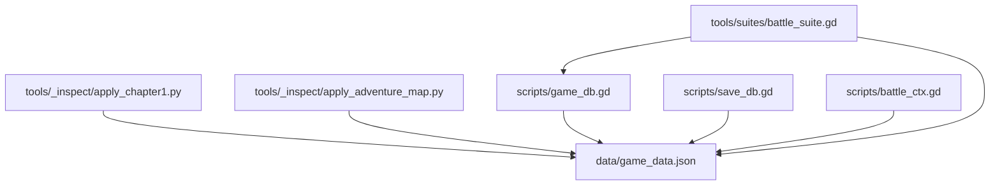
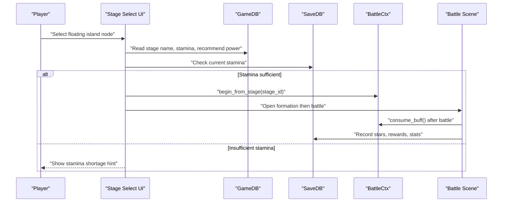
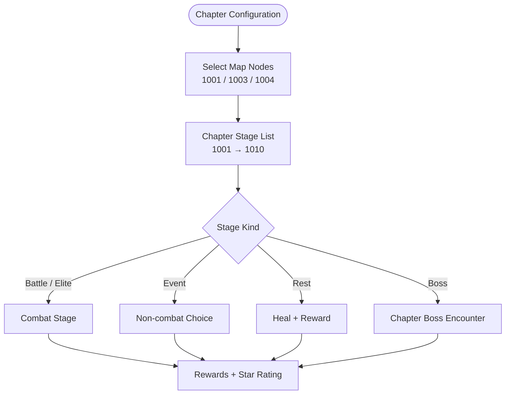
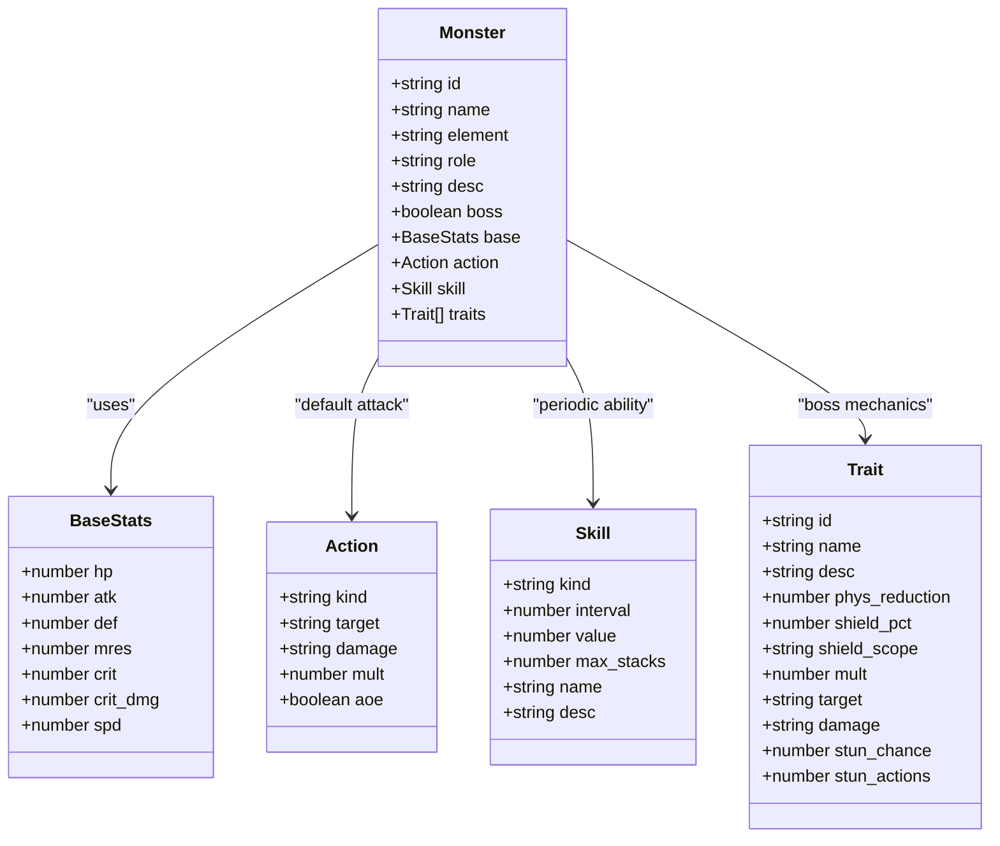
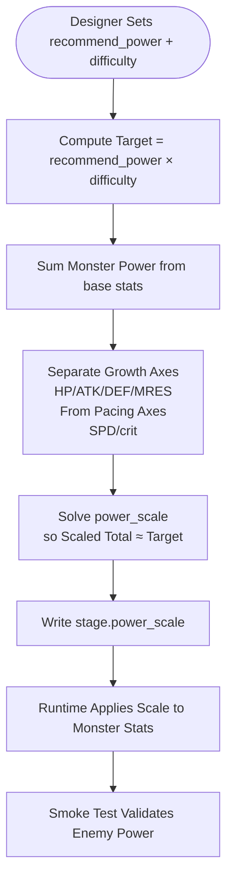
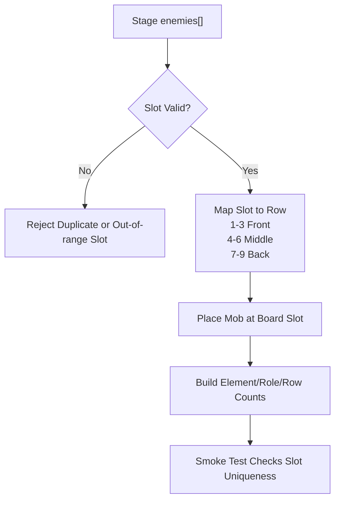
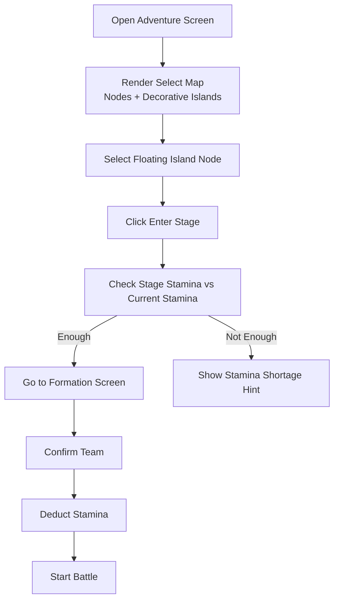
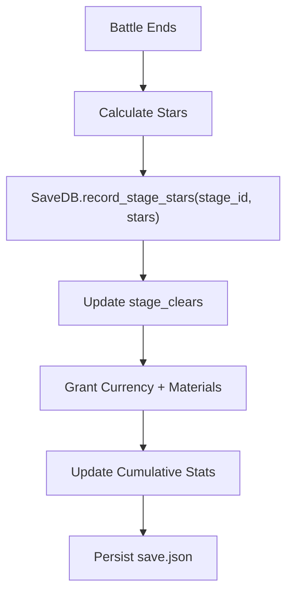
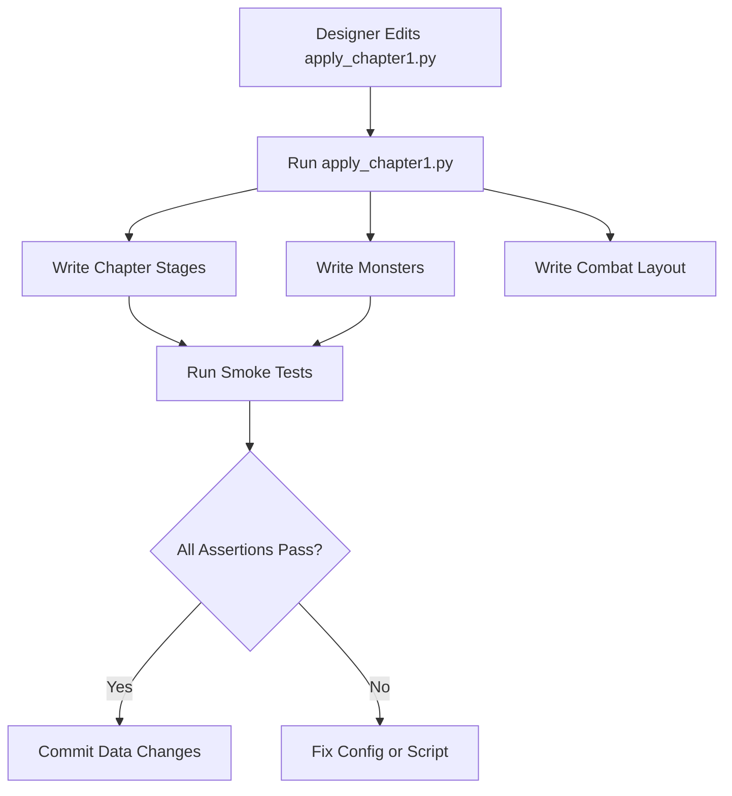
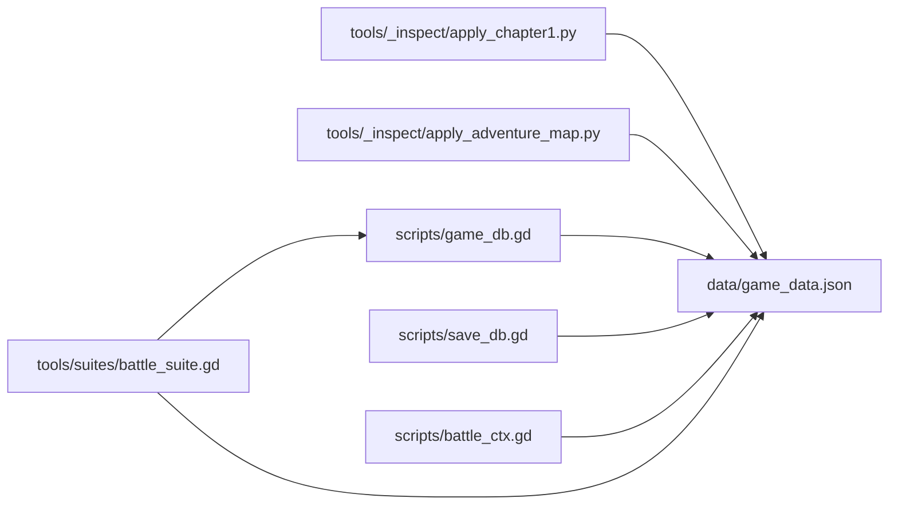

# Stage & Level Design

<cite>
**Referenced Files in This Document**   
- [README.md](file://README.md)
- [game_data.json](file://data/game_data.json)
- [game_db.gd](file://scripts/game_db.gd)
- [save_db.gd](file://scripts/save_db.gd)
- [battle_ctx.gd](file://scripts/battle_ctx.gd)
- [apply_chapter1.py](file://tools/_inspect/apply_chapter1.py)
- [apply_adventure_map.py](file://tools/_inspect/apply_adventure_map.py)
- [battle_suite.gd](file://tools/suites/battle_suite.gd)
</cite>

## Table of Contents
1. [Introduction](#introduction)
2. [Project Structure](#project-structure)
3. [Core Components](#core-components)
4. [Architecture Overview](#architecture-overview)
5. [Detailed Component Analysis](#detailed-component-analysis)
6. [Dependency Analysis](#dependency-analysis)
7. [Performance Considerations](#performance-considerations)
8. [Troubleshooting Guide](#troubleshooting-guide)
9. [Conclusion](#conclusion)
10. [Appendices](#appendices)

## Introduction
This document explains the stage and level design system for the project’s first chapter: a floating-island adventure with three visible map nodes, ten stages, progressive difficulty scaling, enemy unit definitions, power scaling, encounter templates, map layout, navigation interface, and the tools used to create or expand content. It also clarifies how stage completion ties into player progression and where designers should edit data versus code.

The chapter is titled “Cloud Floating Islands · Initial Scar” and currently exposes three selectable islands on the map while all ten stages remain playable through the battle flow. Difficulty scales by adjusting each stage’s `power_scale`, which rescales monster base stats so that total enemy power matches the configured recommended power multiplied by a difficulty coefficient.

**Section sources**
- [README.md:7-8](file://README.md#L7-L8)
- [README.md:136-151](file://README.md#L136-L151)
- [README.md:345-360](file://README.md#L345-L360)
- [README.md:465-485](file://README.md#L465-L485)

## Project Structure
Stage and level content lives primarily in one configuration file, with runtime accessors and tooling scripts around it:

- `data/game_data.json` — single source of truth for chapters, stages, monsters, combat geometry, stamina, rewards, themes, and the select-map layout.
- `scripts/game_db.gd` — read-only accessor layer that resolves stage names, stamina, recommend power, enemy units, and enemy composition.
- `scripts/save_db.gd` — persistence layer for progress, stars, cleared counts, materials, and team presets.
- `scripts/battle_ctx.gd` — per-battle context carrying selected stage ID, temporary buffs, and deterministic seed.
- `tools/_inspect/apply_chapter1.py` — writes chapter stages, monsters, combat layout, and theme data; computes `power_scale`.
- `tools/_inspect/apply_adventure_map.py` — writes the select-map node coordinates, icons, labels, and decorative islands.
- `tools/suites/battle_suite.gd` — smoke tests that assert stamina values, slot validity, and enemy power self-consistency.

**Diagram sources**
- [game_data.json:1776-2365](file://data/game_data.json#L1776-L2365)
- [game_db.gd:676-870](file://scripts/game_db.gd#L676-L870)
- [save_db.gd:407-447](file://scripts/save_db.gd#L407-L447)
- [battle_ctx.gd:1-52](file://scripts/battle_ctx.gd#L1-L52)
- [apply_chapter1.py:1-528](file://tools/_inspect/apply_chapter1.py#L1-L528)
- [apply_adventure_map.py:1-156](file://tools/_inspect/apply_adventure_map.py#L1-L156)
- [battle_suite.gd:123-193](file://tools/suites/battle_suite.gd#L123-L193)

**Section sources**
- [README.md:62-96](file://README.md#L62-L96)
- [README.md:432-464](file://README.md#L432-L464)

## Core Components
The stage system is built from five core components:

| Component | Responsibility | Key Fields / Methods |
|---|---|---|
| Chapter & Stages | Defines chapter identity, title, stage list, and per-stage difficulty/rewards/theme | `adventure.chapter_stages.chapter_id`, `title`, `list[]` |
| Select Map | Defines three floating island nodes, positions, icons, pre-stage links, and decorative islands | `adventure.select_map.nodes[]`, `decor_islands[]` |
| Enemy Units | Defines 14 monsters with base stats, actions, skills, traits, and boss flags | `monsters.table[]` |
| Power Scaling | Rescales monster stats so enemy team power equals `recommend_power × difficulty` | `stage.power_scale`, `solve_scale()` |
| Progression | Tracks best stars, clear counts, pending items, and mode unlocks | `SaveDB.progress`, `record_stage_stars()`, `stage_clears_table()` |

Stamina is per-stage: the guide stage costs zero, ordinary stages cost six, elite stages cost eight, the high-difficulty side branch costs ten, and event/rest nodes cost zero. The select map currently only has interactive anchors for stages 1001, 1003, and 1004; the remaining stages are reachable through battle logic but not yet placed as clickable map nodes.

**Section sources**
- [game_data.json:1700-1775](file://data/game_data.json#L1700-L1775)
- [game_data.json:1776-2365](file://data/game_data.json#L1776-L2365)
- [game_db.gd:676-706](file://scripts/game_db.gd#L676-L706)
- [README.md:246-252](file://README.md#L246-L252)
- [README.md:136-151](file://README.md#L136-L151)

## Architecture Overview
The stage-to-battle flow connects UI, configuration, persistence, and the battle kernel:

**Diagram sources**
- [README.md:100-149](file://README.md#L100-L149)
- [game_db.gd:676-706](file://scripts/game_db.gd#L676-L706)
- [save_db.gd:407-447](file://scripts/save_db.gd#L407-L447)
- [battle_ctx.gd:20-52](file://scripts/battle_ctx.gd#L20-L52)

## Detailed Component Analysis

### Chapter Structure and Three Floating Islands
The chapter defines ten stages under `adventure.chapter_stages.list`. Each stage entry includes:

- `id`: numeric stage identifier.
- `name` and `subtitle`: display text.
- `kind`: `battle`, `elite`, `event`, `rest`, or `boss`.
- `recommend_power`: target player power.
- `stamina`: stamina cost.
- `pre_stage_id`: previous stage shown as a guiding link on the select map.
- `is_boss`: whether this is a chapter boss.
- `difficulty`: multiplier against `recommend_power`.
- `enemies`: array of `{slot, mob}` entries.
- `mechanic` and `tactics`: designer notes for gameplay intent.
- `rewards`: currency, materials, equipment, shards, or hero grants.
- `power_scale`: computed scaling factor applied to monster base stats.
- `theme`: procedural battlefield colors, optionally overridden by a background image path.

The select map currently contains three playable nodes:

| Node | Stage ID | Name | Kind | Pre-stage | Demo Stars | Stamina | Recommend Power |
|---|---:|---|---|---:|---:|---:|---:|
| Island 1 | 1001 | Initial Ground | Battle | 0 | 0 | 0 | 1,000 |
| Island 2 | 1003 | Cloud Castle | Elite | 1001 | 1 | 8 | 4,800 |
| Island 3 | 1004 | Storm Elemental | Battle | 1003 | 2 | 6 | 6,200 |

Decorative islands exist as layout references but do not enter battle logic.

**Diagram sources**
- [game_data.json:1700-1775](file://data/game_data.json#L1700-L1775)
- [game_data.json:1776-2365](file://data/game_data.json#L1776-L2365)
- [README.md:345-360](file://README.md#L345-L360)

**Section sources**
- [game_data.json:1700-1775](file://data/game_data.json#L1700-L1775)
- [game_data.json:1776-2365](file://data/game_data.json#L1776-L2365)
- [README.md:136-151](file://README.md#L136-L151)

### Enemy Unit Definitions
Enemy units are defined in `monsters.table`, generated by `apply_chapter1.py`. Each monster has:

- `name`, `element`, `role`, `desc`.
- `base`: HP, ATK, DEF, MRES, crit, crit_dmg, spd.
- `action`: default attack behavior, including target row and damage type.
- `skill`: periodic abilities such as buffing, shielding, healing, or debuffing.
- `traits`: boss-specific mechanics like physical reduction, shields, and ultimates.
- `boss`: boolean flag for boss-type enemies.

Current monsters include slimes, nut soldiers, forest archers, castle guards, ballistae, castle bards, storm elementals, cloud sprites, ruin guards, puppet mages, goblin chiefs, stone slingers, goblin shamans, and the chapter boss stone warden.

**Diagram sources**
- [apply_chapter1.py:30-134](file://tools/_inspect/apply_chapter1.py#L30-L134)
- [game_data.json:1776-2365](file://data/game_data.json#L1776-L2365)

**Section sources**
- [apply_chapter1.py:30-134](file://tools/_inspect/apply_chapter1.py#L30-L134)
- [game_data.json:1776-2365](file://data/game_data.json#L1776-L2365)

### Power Scaling and Difficulty Balancing
Difficulty balancing uses two layers:

1. Designer-facing numbers: `recommend_power` and `difficulty`.
2. Engine-facing number: `power_scale`, which rescales monster base stats so the total enemy team power equals `recommend_power × difficulty`.

The scaling function separates growth axes (HP, ATK, DEF, MRES) from pacing axes (SPD, crit). Only growth axes are scaled, preventing speed or crit from artificially inflating perceived difficulty.

Smoke tests assert that enemy team power stays within tolerance of the target:

- Ordinary stages without environment effects use a tighter tolerance.
- Stages with environment effects allow extra tolerance because environmental bonuses are applied after scale computation.

**Diagram sources**
- [apply_chapter1.py:374-397](file://tools/_inspect/apply_chapter1.py#L374-L397)
- [apply_chapter1.py:438-456](file://tools/_inspect/apply_chapter1.py#L438-L456)
- [battle_suite.gd:130-147](file://tools/suites/battle_suite.gd#L130-L147)

**Section sources**
- [README.md:465-485](file://README.md#L465-L485)
- [apply_chapter1.py:374-397](file://tools/_inspect/apply_chapter1.py#L374-L397)
- [battle_suite.gd:130-147](file://tools/suites/battle_suite.gd#L130-L147)

### Encounter Templates
Encounters are expressed as arrays of enemy entries with a `mob` reference and a `slot`. Slots follow the same numbering as the player board:

- Slots 1–3: front row.
- Slots 4–6: middle row.
- Slots 7–9: back row.

This shared slot system means UI placement and battle logic use the same coordinate semantics.

Examples from the chapter:

| Stage | Enemies | Design Intent |
|---|---|---|
| 1001 | Two slimes in slots 1 and 3 | Beginner tutorial; simple frontal threats. |
| 1002 | Two nut soldiers in slots 1 and 3, forest archer in slot 8 | Front-row tanks plus a back-row sniper targeting the weakest unit. |
| 1003 | Castle guard slot 1, ballista slot 5, castle bard slot 8 | Tank, middle-row AOE, and stacking support that must be cut quickly. |
| 1004 | Two storm elementals in slots 4 and 6, cloud sprite in slot 8 | Wind-heavy lineup with an environment effect boosting wind SPD. |
| 1006 | Two ruin guards in slots 1 and 3, puppet mage in slot 5 | High-defense front row plus a periodic team shield mechanic. |
| 1008 | Goblin chief slot 1, two stone slingers in slots 4 and 6, goblin shaman slot 8 | Mixed frontline/midline/backline with healing and back-row AOE. |
| 1009 | Two nut soldiers, storm elemental, goblin shaman | Pre-boss tuning test requiring shield break, back-cut, and sustain. |
| 1010 | Two nut soldiers, two storm elementals, stone warden, goblin shaman | Chapter boss with physical reduction, starting shield, and frontline slam. |

**Diagram sources**
- [game_data.json:1776-2365](file://data/game_data.json#L1776-L2365)
- [game_db.gd:838-870](file://scripts/game_db.gd#L838-L870)
- [battle_suite.gd:185-193](file://tools/suites/battle_suite.gd#L185-L193)

**Section sources**
- [game_data.json:1776-2365](file://data/game_data.json#L1776-L2365)
- [game_db.gd:838-870](file://scripts/game_db.gd#L838-L870)
- [battle_suite.gd:185-193](file://tools/suites/battle_suite.gd#L185-L193)

### Map Layout System and Navigation Interface
The select map is defined by `adventure.select_map`. Its key fields include:

- `title`: page title.
- `chapter_id`: linked chapter.
- `nodes`: playable stage nodes with `stage_id`, `name`, `kind`, `pos`, `label_dy`, `radius`, `z`, `pre_stage_id`, `demo_stars`, and optional `icon`.
- `decor_islands`: decorative floating islands used as background references.
- `enter_button`: button text for entering the selected stage.
- `team_panel`: preview team panel rows, columns, deployed count, label, and demo lineup.
- `promo_entry`: placeholder promotional entry.

Coordinates are pixel anchors based on a 1920×1080 viewport. The script converts concept-art coordinates using a cover-scale transformation so the background image aligns with node positions.

Navigation behavior:

1. Player opens the adventure screen.
2. Three floating islands are displayed.
3. Clicking a node selects it and highlights it.
4. Clicking “Enter Stage” checks stamina against the stage’s own cost.
5. If stamina is sufficient, the game moves to the formation screen.
6. Stamina is deducted when confirming the team, not when selecting the stage.

**Diagram sources**
- [apply_adventure_map.py:43-131](file://tools/_inspect/apply_adventure_map.py#L43-L131)
- [README.md:136-151](file://README.md#L136-L151)

**Section sources**
- [apply_adventure_map.py:1-156](file://tools/_inspect/apply_adventure_map.py#L1-L156)
- [README.md:136-151](file://README.md#L136-L151)

### Relationship Between Stage Completion and Player Progression
Stage completion affects several persistent values:

- `progress.stage_stars[str(stage_id)]`: best star rating, only increases.
- `progress.stage_clears[str(stage_id)]`: number of times the stage has been cleared.
- `progress.stats`: cumulative battles, wins, total stars, and total materials.
- `progress.pending_items`: non-currency rewards accumulated before the inventory UI exists.
- `wallet`: currency rewards go directly into the wallet.

Star rating rules:

- 1★ for clearing.
- +1★ for wiping all enemies.
- +1★ if ally survival rate is at least 60%.
- Retreat or failure yields 0★ and does not write progress.

**Diagram sources**
- [save_db.gd:407-447](file://scripts/save_db.gd#L407-L447)
- [save_db.gd:449-505](file://scripts/save_db.gd#L449-L505)
- [save_db.gd:622-643](file://scripts/save_db.gd#L622-L643)
- [README.md:225-244](file://README.md#L225-L244)

**Section sources**
- [save_db.gd:407-447](file://scripts/save_db.gd#L407-L447)
- [save_db.gd:449-505](file://scripts/save_db.gd#L449-L505)
- [save_db.gd:622-643](file://scripts/save_db.gd#L622-L643)
- [README.md:225-244](file://README.md#L225-L244)

### Tools and Workflows for Creating New Stages and Content Expansion

#### Adding or Editing Stages
Use `apply_chapter1.py` to regenerate chapter stages, monsters, combat layout, and themes. The script:

- Writes `monsters.table` with base stats, actions, skills, and traits.
- Writes `adventure.chapter_stages.list` with stage metadata, enemies, rewards, themes, and computed `power_scale`.
- Updates `combat.battle` layout constants.
- Aligns chapter metadata and stage kinds.
- Syncs the three existing select-map nodes’ names and stamina.

When adding new stages:

1. Add stage entries to the script’s stage list.
2. Define or reuse monster IDs.
3. Set `recommend_power`, `stamina`, `difficulty`, `enemies`, and rewards.
4. Run the script to compute `power_scale` and write JSON.
5. Run smoke tests to validate stamina, slot validity, and enemy power.

**Diagram sources**
- [apply_chapter1.py:1-528](file://tools/_inspect/apply_chapter1.py#L1-L528)
- [battle_suite.gd:123-193](file://tools/suites/battle_suite.gd#L123-L193)

**Section sources**
- [README.md:465-485](file://README.md#L465-L485)
- [apply_chapter1.py:1-528](file://tools/_inspect/apply_chapter1.py#L1-L528)
- [battle_suite.gd:123-193](file://tools/suites/battle_suite.gd#L123-L193)

#### Adding or Editing the Select Map
Use `apply_adventure_map.py` to write `adventure.select_map`. It handles:

- Concept-art coordinate conversion.
- Playable node definitions.
- Decorative island references.
- Button text and preview team panel.

Important constraints:

- Coordinates are 1920×1080 pixel anchors.
- The script assumes the background image uses the same cover-scale mapping.
- Currently only three nodes are playable on the map; other stages can still be reached via battle flow.

**Section sources**
- [apply_adventure_map.py:1-156](file://tools/_inspect/apply_adventure_map.py#L1-L156)
- [README.md:136-151](file://README.md#L136-L151)

#### Runtime Accessors and Validation
At runtime:

- `GameDB.stage_enemy_units(stage_id)` resolves stage enemies to readable unit summaries.
- `GameDB.stage_enemy_comp(stage_id)` returns element, role, and row counts for counter hints.
- `GameDB.stage_stamina(stage_id)` reads per-stage stamina with fallbacks.
- `GameDB.stage_recommend_power(stage_id)` reads recommended power.
- `GameDB.stage_display_name(stage_id)` prefers stage config over select-map node name.

Smoke tests verify:

- Guide stage stamina is zero.
- Elite and boss stages have expected stamina.
- Event nodes do not consume stamina.
- Enemy power matches recommended power × difficulty within tolerance.
- Enemy slots are unique and within 1–9.

**Section sources**
- [game_db.gd:676-870](file://scripts/game_db.gd#L676-L870)
- [battle_suite.gd:123-193](file://tools/suites/battle_suite.gd#L123-L193)

## Dependency Analysis
The stage system has clear separation between configuration, runtime access, persistence, and tooling:

**Diagram sources**
- [game_data.json:1700-2365](file://data/game_data.json#L1700-L2365)
- [game_db.gd:676-870](file://scripts/game_db.gd#L676-L870)
- [save_db.gd:407-505](file://scripts/save_db.gd#L407-L505)
- [battle_ctx.gd:1-52](file://scripts/battle_ctx.gd#L1-L52)
- [apply_chapter1.py:1-528](file://tools/_inspect/apply_chapter1.py#L1-L528)
- [apply_adventure_map.py:1-156](file://tools/_inspect/apply_adventure_map.py#L1-L156)
- [battle_suite.gd:123-193](file://tools/suites/battle_suite.gd#L123-L193)

Coupling summary:

- `GameDB` depends only on `game_data.json`.
- `SaveDB` persists player state derived from configuration and gameplay.
- `BattleCtx` holds transient battle state and does not persist.
- Tooling scripts write configuration; they are not part of runtime execution.
- Smoke tests depend on both configuration and `GameDB` to enforce balance and correctness.

Potential risks:

- Editing `game_data.json` manually without re-running generator scripts can drift `power_scale` away from `recommend_power × difficulty`.
- Adding map nodes requires updating both stage data and select-map data if the node should appear on the floating-island map.
- Environment effects like stage 1004’s wind-speed aura are applied after scale computation, so smoke-test tolerance must account for them.

**Section sources**
- [README.md:432-485](file://README.md#L432-L485)
- [game_db.gd:676-870](file://scripts/game_db.gd#L676-L870)
- [save_db.gd:407-505](file://scripts/save_db.gd#L407-L505)
- [battle_suite.gd:123-193](file://tools/suites/battle_suite.gd#L123-L193)

## Performance Considerations
Stage and level design is mostly data-driven, so performance concerns are light:

- Reading stage data is dictionary lookups in JSON-backed configuration.
- Enemy composition aggregation is linear in the number of enemies per stage.
- Power scaling is computed once by the generator script, not every battle.
- Smoke tests run headless and assert deterministic outcomes.

For future expansion:

- Keep stage enemy lists small enough that composition aggregation remains trivial.
- Avoid excessive nested dictionaries in stage entries unless needed by UI or battle logic.
- Use generator scripts instead of hand-editing large generated sections to keep JSON consistent.

[No sources needed since this section provides general guidance]

## Troubleshooting Guide

Common issues and resolutions:

| Symptom | Likely Cause | Resolution |
|---|---|---|
| Enemy power does not match recommended power | `power_scale` was not regenerated after changing recommended power or monster stats | Re-run `apply_chapter1.py` |
| Stage stamina mismatch | Edited stage stamina incorrectly or relied on fallback | Check stage `stamina`; confirm with `GameDB.stage_stamina()` and smoke tests |
| Enemy appears in wrong row | `slot` outside 1–9 or duplicate slot | Ensure slots follow front/middle/back mapping and are unique |
| Select map node missing | Node not added to `select_map.nodes` | Edit `apply_adventure_map.py` and regenerate |
| Stars not increasing | Star calculation or persistence path not reached | Verify battle result handling and `record_stage_stars()` |
| Rewards not appearing | Non-currency reward routed to materials instead of wallet | Check `grant_reward()` routing and `pending_items` |

**Section sources**
- [README.md:465-485](file://README.md#L465-L485)
- [save_db.gd:407-505](file://scripts/save_db.gd#L407-L505)
- [battle_suite.gd:123-193](file://tools/suites/battle_suite.gd#L123-L193)

## Conclusion
The stage and level design system centers on a single configuration file with clear responsibilities split across readers, writers, persistence, and tests. The chapter presents three floating islands on the map and ten stages with progressive difficulty. Enemy strength is balanced through `power_scale`, encounters are templated by mob and slot, and progression is tracked through stars, clears, materials, and statistics. For content expansion, designers should edit the generator scripts rather than hand-modifying generated JSON, then validate with smoke tests.

[No sources needed since this section summarizes without analyzing specific files]

## Appendices

### Appendix A: Chapter Stage Summary
| No | ID | Name | Kind | Recommend Power | Stamina | Enemies | Notes |
|---:|---:|---|---|---:|---:|---|---|
| 1 | 1001 | Initial Ground | Battle | 1,000 | 0 | Slime ×2 | Tutorial |
| 2 | 1002 | Floating Forest | Battle | 2,500 | 6 | Nut Soldier ×2 + Forest Archer | Front/middle/back introduction |
| 3 | 1003 | Cloud Castle | Elite | 4,800 | 8 | Castle Guard + Ballista + Castle Bard | Support stacking threat |
| 4 | 1004 | Storm Elemental | Battle | 6,200 | 6 | Storm Elemental ×2 + Cloud Sprite | Wind environment buff |
| 5 | 1005 | Element Altar | Event | 0 | 0 | None | Choice-based non-combat |
| 6 | 1006 | Broken Ruins | Battle | 7,800 | 6 | Ruin Guard ×2 + Puppet Mage | Shield-breaking focus |
| 7 | 1007 | Wonder Fountain | Rest | 0 | 0 | None | Heal + reward |
| 8 | 1008 | Elite Tribe | Elite | 10,500 | 10 | Goblin Chief + Stone Slinger ×2 + Goblin Shaman | Healing + back-row AOE |
| 9 | 1009 | Skull Gate Outpost | Battle | 11,200 | 6 | Nut Soldier ×2 + Storm Elemental + Goblin Shaman | Pre-boss tuning |
| 10 | 1010 | Skull Gate · Stone Warden | Boss | 12,500 | 8 | Multiple elites + Stone Warden + Shaman | Chapter boss |

**Section sources**
- [README.md:345-360](file://README.md#L345-L360)
- [game_data.json:1776-2365](file://data/game_data.json#L1776-L2365)