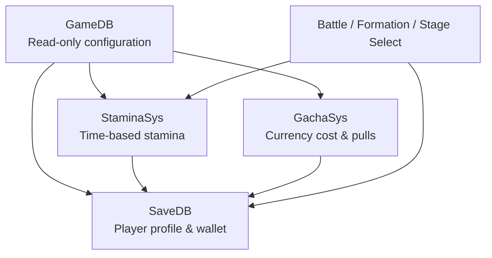
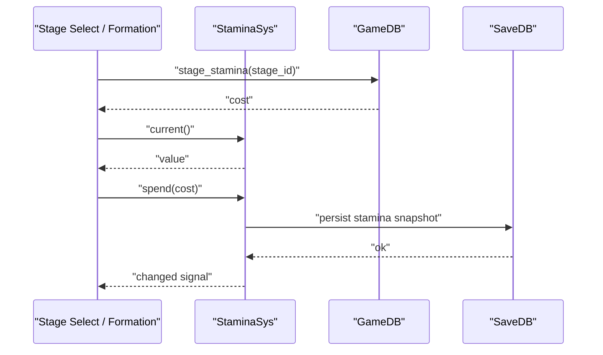
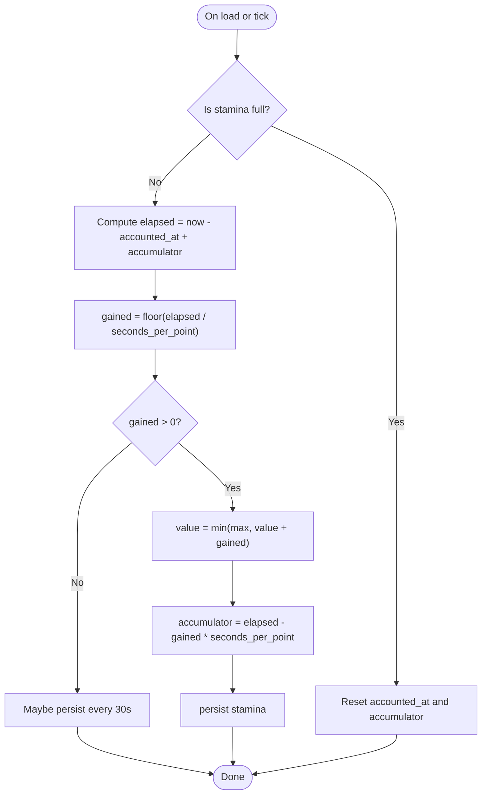
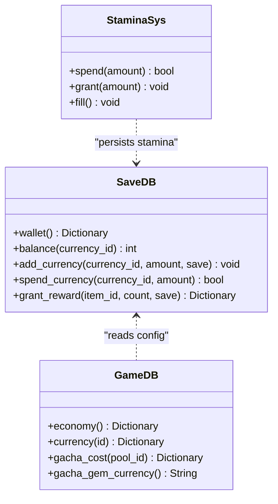
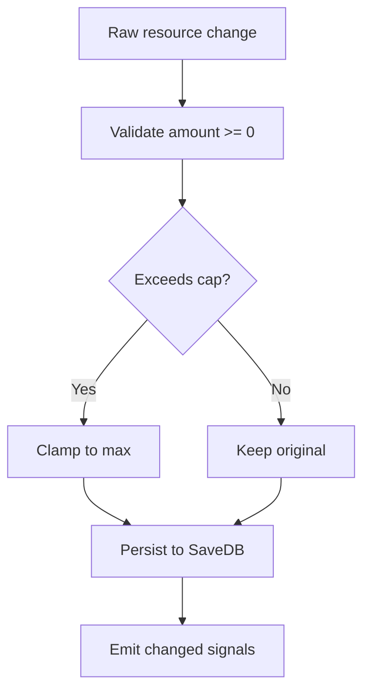
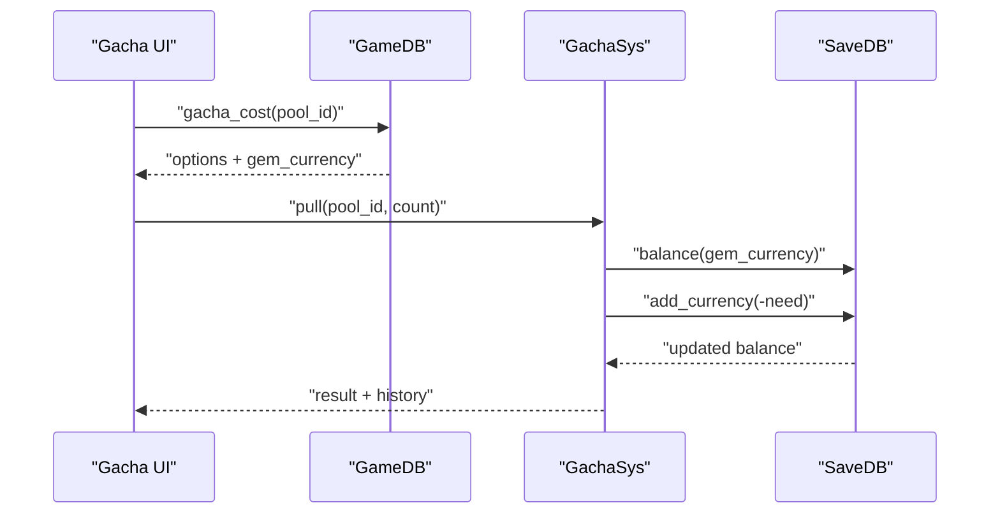
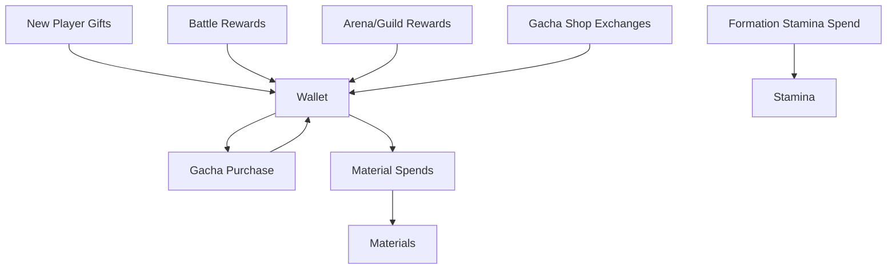
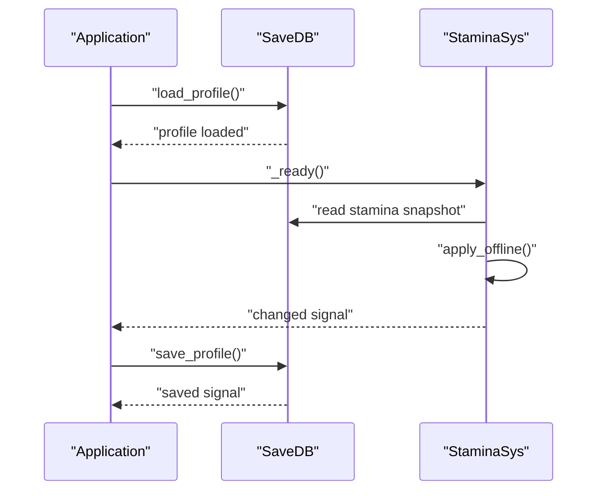
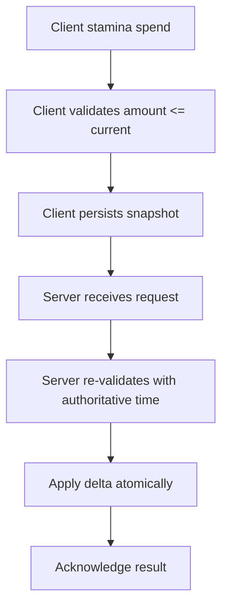
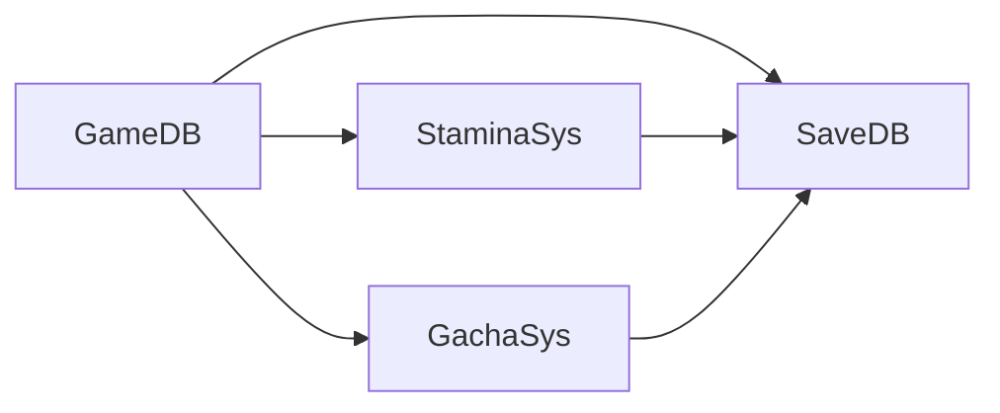

# Stamina & Resource Management

<cite>
**Referenced Files in This Document**   
- [stamina.gd](file://scripts/stamina.gd)
- [save_db.gd](file://scripts/save_db.gd)
- [game_db.gd](file://scripts/game_db.gd)
- [game_data.json](file://data/game_data.json)
- [schema.sql](file://data/db/schema.sql)
- [stage_select_suite.gd](file://tools/suites/stage_select_suite.gd)
- [formation_suite.gd](file://tools/suites/formation_suite.gd)
- [battle_suite.gd](file://tools/suites/battle_suite.gd)
- [gacha_sys.gd](file://scripts/gacha_sys.gd)
</cite>

## Table of Contents
1. [Introduction](#introduction)
2. [Project Structure](#project-structure)
3. [Core Components](#core-components)
4. [Architecture Overview](#architecture-overview)
5. [Detailed Component Analysis](#detailed-component-analysis)
6. [Dependency Analysis](#dependency-analysis)
7. [Performance Considerations](#performance-considerations)
8. [Troubleshooting Guide](#troubleshooting-guide)
9. [Conclusion](#conclusion)

## Introduction
This document explains the stamina regeneration and resource management systems implemented in the project. It covers:
- Time-based stamina recovery with offline accumulation support.
- Currency definitions, sources, sinks, and transaction flow.
- Resource validation and consistency checks.
- Persistence layer integration for save/load.
- Anti-cheat considerations and server-side validation guidance.
- Concrete examples of stamina calculations, currency transactions, and resource flows.

The goal is to make these systems understandable for both technical and non-technical readers while preserving precise implementation details from the codebase.

## Project Structure
Stamina and resources are primarily handled by three layers:
- Configuration layer: reads game rules and economy definitions.
- State/persistence layer: holds player state and writes it to disk.
- Feature modules: stamina timer, gacha system, battle rewards, and UI/test suites that exercise the logic.

**Diagram sources**
- [game_db.gd:541-551](file://scripts/game_db.gd#L541-L551)
- [stamina.gd:19-36](file://scripts/stamina.gd#L19-L36)
- [save_db.gd:213-232](file://scripts/save_db.gd#L213-L232)
- [gacha_sys.gd:303-342](file://scripts/gacha_sys.gd#L303-L342)

**Section sources**
- [game_db.gd:1-10](file://scripts/game_db.gd#L1-L10)
- [save_db.gd:1-17](file://scripts/save_db.gd#L1-L17)
- [stamina.gd:1-17](file://scripts/stamina.gd#L1-L17)

## Core Components
- Stamina system: manages current stamina, maximum capacity, per-point recovery time, offline calculation, and persistence.
- Save layer: centralizes all player data including wallet currencies, stamina snapshot, items, progress, gacha state, and statistics.
- Configuration layer: defines stamina rules, economy currencies, stage stamina costs, and gacha pricing.

Key responsibilities:
- Stamina: only increases through recovery or explicit grant/fill; decreases only via spend.
- Wallet: supports add/spend/balance for multiple currencies.
- Validation: enforces non-negative balances, caps at maximums, and normalizes team/item structures.

**Section sources**
- [stamina.gd:19-116](file://scripts/stamina.gd#L19-L116)
- [save_db.gd:213-232](file://scripts/save_db.gd#L213-L232)
- [game_db.gd:541-551](file://scripts/game_db.gd#L541-L551)

## Architecture Overview
The stamina and resource systems follow a clear separation:
- GameDB provides read-only configuration.
- SaveDB owns mutable player state and file I/O.
- Feature modules (stamina, gacha, battle, formation, stage select) call into SaveDB and GameDB.

**Diagram sources**
- [game_db.gd:684-691](file://scripts/game_db.gd#L684-L691)
- [stamina.gd:86-97](file://scripts/stamina.gd#L86-L97)
- [stamina.gd:144-146](file://scripts/stamina.gd#L144-L146)

## Detailed Component Analysis

### Stamina Regeneration System
Stamina is a time-based resource with:
- Maximum capacity from configuration.
- Recovery rate defined as seconds per point.
- Offline accumulation using last-accounted timestamp and accumulated seconds.
- Low-frequency persistence to avoid excessive disk writes.

**Diagram sources**
- [stamina.gd:119-141](file://scripts/stamina.gd#L119-L141)
- [stamina.gd:155-165](file://scripts/stamina.gd#L155-L165)

#### Key Behaviors
- Recovery rule: one point per configured seconds; capped at maximum.
- Offline support: uses Unix timestamps and accumulator to compute recovered points since last save.
- Spend semantics: only subtracts if enough stamina; resets accounting start when transitioning from full to non-full.
- Persistence: saves `value` and `accounted_at`; low-frequency writes during idle ticks.

#### Example Calculations
- If `seconds_per_point = 300`, then each point takes 5 minutes.
- If last accounted time was 10 minutes ago and no points were spent, two points should be recovered.
- If stamina reaches full, accumulator resets and next recovery starts fresh.

**Section sources**
- [stamina.gd:54-81](file://scripts/stamina.gd#L54-L81)
- [stamina.gd:86-116](file://scripts/stamina.gd#L86-L116)
- [stamina.gd:119-165](file://scripts/stamina.gd#L119-L165)

### Currency Systems: Gold, Gems, Tokens
Currencies are defined in configuration and stored in the player wallet:
- Hard currency: gem.
- Soft currencies: gold, bound_gem, arena_token, guild_token, wish_crystal.

Sources and sinks include:
- New player gifts: initial wallet funding.
- Battle rewards: currency drops routed through unified reward handler.
- Gacha purchases: gem or ticket-based costs; optional crystal currency.
- Arena/guild rewards: token earnings.
- Wish crystal shop: exchange mechanics.

**Diagram sources**
- [save_db.gd:213-232](file://scripts/save_db.gd#L213-L232)
- [game_db.gd:545-551](file://scripts/game_db.gd#L545-L551)
- [stamina.gd:86-116](file://scripts/stamina.gd#L86-L116)

#### Currency Transaction Flow
- Add: `add_currency` ensures non-negative balance and optionally persists immediately.
- Spend: `spend_currency` checks balance before deducting.
- Unified reward routing: `grant_reward` routes currency vs material based on configuration.

**Section sources**
- [save_db.gd:213-232](file://scripts/save_db.gd#L213-L232)
- [save_db.gd:482-492](file://scripts/save_db.gd#L482-L492)
- [game_data.json:19-57](file://data/game_data.json#L19-L57)

### Resource Validation and Consistency Checks
Validation is enforced at multiple levels:
- Non-negative balances: wallet additions clamp to zero minimum.
- Caps: stamina cannot exceed maximum; card star levels cap by rarity.
- Normalization: equipment slots always filled; team entries normalized to valid slots and unique heroes.
- Error reporting: team normalization returns errors for invalid inputs.

**Diagram sources**
- [save_db.gd:221-232](file://scripts/save_db.gd#L221-L232)
- [stamina.gd:100-116](file://scripts/stamina.gd#L100-L116)
- [save_db.gd:293-316](file://scripts/save_db.gd#L293-L316)

**Section sources**
- [save_db.gd:221-232](file://scripts/save_db.gd#L221-L232)
- [save_db.gd:293-316](file://scripts/save_db.gd#L293-L316)
- [save_db.gd:184-192](file://scripts/save_db.gd#L184-L192)

### Examples of Stamina Calculations
- Base case: stamina at 40/60, `seconds_per_point = 300`. After 10 minutes offline, recover 2 points → 42/60.
- Full case: stamina at 60/60; any offline time resets accumulator and does not over-cap.
- Spend case: spending 5 stamina when at 40 results in 35; if already below required amount, spend fails.

These behaviors are validated by test suites:
- Free stages do not consume stamina.
- Insufficient stamina blocks progression.
- Stamina deduction occurs at configured step (formation).

**Section sources**
- [stamina.gd:70-81](file://scripts/stamina.gd#L70-L81)
- [stamina.gd:86-97](file://scripts/stamina.gd#L86-L97)
- [stage_select_suite.gd:396-438](file://tools/suites/stage_select_suite.gd#L396-L438)
- [formation_suite.gd:116](file://tools/suites/formation_suite.gd#L116)

### Examples of Currency Transactions
- New player gift: initial wallet funded with configured amounts for gem/gold/bound_gem.
- Battle reward: currency added via unified reward router; balance updated.
- Gacha purchase: cost options resolved from configuration; balance checked before deduction.

**Diagram sources**
- [game_db.gd:407-442](file://scripts/game_db.gd#L407-L442)
- [gacha_sys.gd:303-342](file://scripts/gacha_sys.gd#L303-L342)
- [save_db.gd:213-232](file://scripts/save_db.gd#L213-L232)

**Section sources**
- [save_db.gd:26-47](file://scripts/save_db.gd#L26-L47)
- [save_db.gd:482-492](file://scripts/save_db.gd#L482-L492)
- [gacha_sys.gd:303-342](file://scripts/gacha_sys.gd#L303-L342)

### Resource Flow Patterns
- Sources:
  - New player gifts.
  - Battle rewards.
  - Gacha shop exchanges.
  - Arena/guild activities.
- Sinks:
  - Stamina consumption at formation confirmation.
  - Gacha purchases.
  - Item/material spends.

**Diagram sources**
- [save_db.gd:26-47](file://scripts/save_db.gd#L26-L47)
- [save_db.gd:482-492](file://scripts/save_db.gd#L482-L492)
- [stamina.gd:86-97](file://scripts/stamina.gd#L86-L97)

**Section sources**
- [save_db.gd:26-47](file://scripts/save_db.gd#L26-L47)
- [save_db.gd:482-492](file://scripts/save_db.gd#L482-L492)
- [stamina.gd:86-97](file://scripts/stamina.gd#L86-L97)

### Persistence Layer and Save/Load Integration
- Stamina persistence:
  - Stores `value` and `accounted_at` in profile.
  - On load, applies offline recovery and emits signals.
  - Low-frequency writes during idle ticks to reduce IO.
- Wallet persistence:
  - Centralized in SaveDB; changes can be saved immediately or batched.
- Profile structure:
  - Includes version, player info, wallet, stamina, cards, team, progress, gacha state, settings.

**Diagram sources**
- [save_db.gd:146-176](file://scripts/save_db.gd#L146-L176)
- [stamina.gd:19-36](file://scripts/stamina.gd#L19-L36)
- [stamina.gd:144-146](file://scripts/stamina.gd#L144-L146)

**Section sources**
- [save_db.gd:146-176](file://scripts/save_db.gd#L146-L176)
- [stamina.gd:19-36](file://scripts/stamina.gd#L19-L36)
- [stamina.gd:144-146](file://scripts/stamina.gd#L144-L146)

### Anti-Cheat Measures and Server-Side Validation Considerations
Current client-side safeguards:
- Stamina spend validates sufficient value before deduction.
- Wallet operations enforce non-negative balances and caps.
- Team normalization prevents illegal formations.
- Test suites assert stamina behavior across stage selection and formation.

Server-side recommendations:
- Re-validate stamina spend against authoritative server time and last-stamina timestamp.
- Enforce currency transaction integrity: check balance before spend, apply atomic updates.
- Normalize and validate team/item data server-side before accepting.
- Use database constraints where possible (e.g., non-negative columns) and application-layer checks for cross-table references.

**Diagram sources**
- [stamina.gd:86-97](file://scripts/stamina.gd#L86-L97)
- [save_db.gd:221-232](file://scripts/save_db.gd#L221-L232)
- [schema.sql:178-193](file://data/db/schema.sql#L178-L193)

**Section sources**
- [stamina.gd:86-97](file://scripts/stamina.gd#L86-L97)
- [save_db.gd:221-232](file://scripts/save_db.gd#L221-L232)
- [schema.sql:178-193](file://data/db/schema.sql#L178-L193)

## Dependency Analysis
Stamina depends on:
- GameDB for configuration (max, seconds_per_point).
- SaveDB for persistence and profile events.

Wallet depends on:
- GameDB for currency metadata and gacha cost resolution.
- SaveDB for balance and transaction methods.

**Diagram sources**
- [game_db.gd:541-551](file://scripts/game_db.gd#L541-L551)
- [stamina.gd:19-36](file://scripts/stamina.gd#L19-L36)
- [save_db.gd:213-232](file://scripts/save_db.gd#L213-L232)
- [gacha_sys.gd:303-342](file://scripts/gacha_sys.gd#L303-L342)

**Section sources**
- [game_db.gd:541-551](file://scripts/game_db.gd#L541-L551)
- [stamina.gd:19-36](file://scripts/stamina.gd#L19-L36)
- [save_db.gd:213-232](file://scripts/save_db.gd#L213-L232)
- [gacha_sys.gd:303-342](file://scripts/gacha_sys.gd#L303-L342)

## Performance Considerations
- Stamina persistence frequency:
  - Immediate on significant changes (spend/grant/fill).
  - Low-frequency during idle ticks (every 30 seconds) to reduce disk writes.
- Wallet operations:
  - Optional immediate save; batched saves recommended for bulk operations like multi-pull gacha.
- Data normalization:
  - Equipment slots and team entries normalized once per write path to prevent repeated validation overhead.

[No sources needed since this section provides general guidance]

## Troubleshooting Guide
Common issues and diagnostics:
- Stamina not recovering after restart:
  - Verify `accounted_at` is set and not zero unless first run.
  - Ensure `apply_offline` runs on load and emits signals.
- Stamina deducted unexpectedly:
  - Confirm spend occurs at configured step (formation vs stage select).
  - Check test suite assertions for free stages and insufficient stamina.
- Currency discrepancies:
  - Validate balance before spend; ensure add_currency clamps negatives.
  - Review unified reward routing for correct currency vs material classification.

**Section sources**
- [stamina.gd:19-36](file://scripts/stamina.gd#L19-L36)
- [stamina.gd:119-141](file://scripts/stamina.gd#L119-L141)
- [stage_select_suite.gd:396-438](file://tools/suites/stage_select_suite.gd#L396-L438)
- [save_db.gd:221-232](file://scripts/save_db.gd#L221-L232)

## Conclusion
The stamina and resource systems are designed around clear separation of concerns:
- Stamina uses time-based recovery with robust offline support and conservative persistence.
- Currencies are centrally managed with validation, caps, and unified reward routing.
- Persistence is centralized in SaveDB, ensuring consistent save/load behavior.
- Anti-cheat measures exist at the client level; server-side validation is essential for production integrity.

These patterns provide a solid foundation for extending resource types, adding new sinks/sources, and integrating with backend services.

[No sources needed since this section summarizes without analyzing specific files]