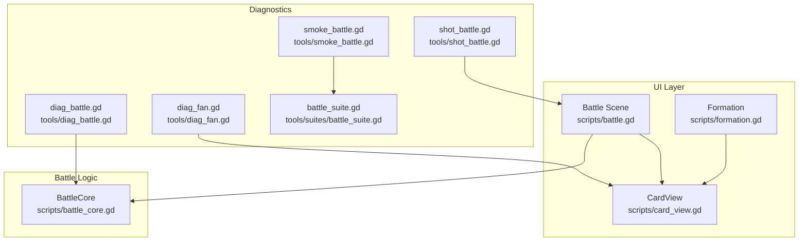
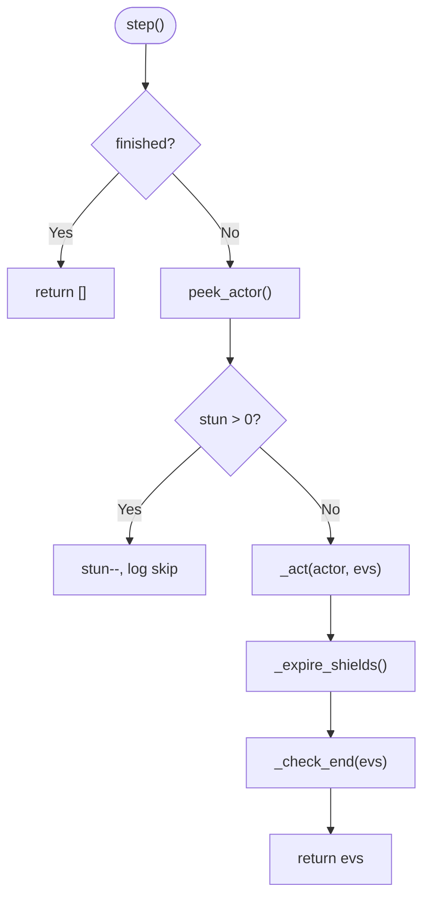
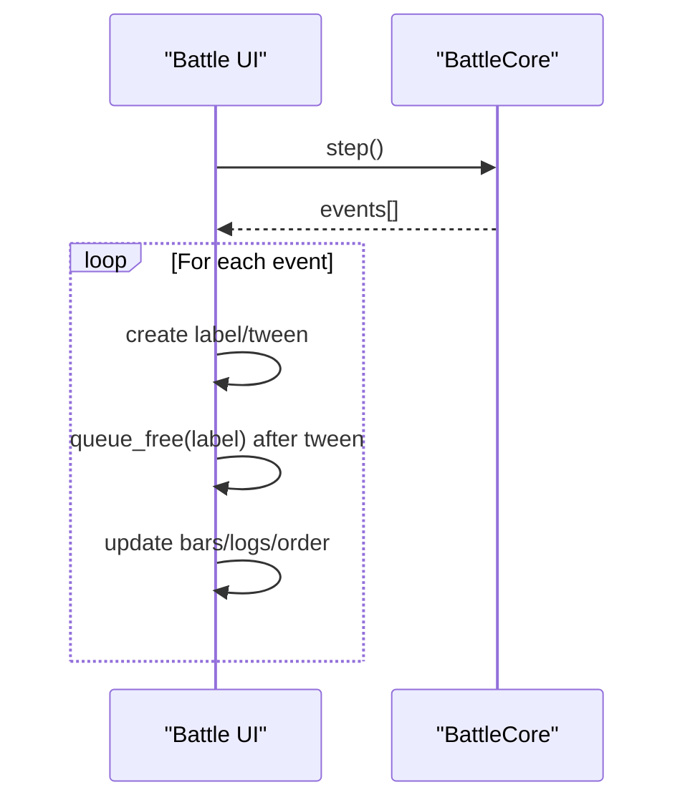
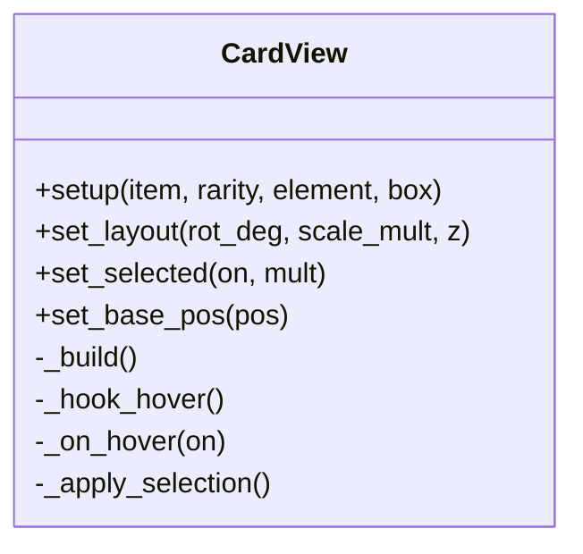
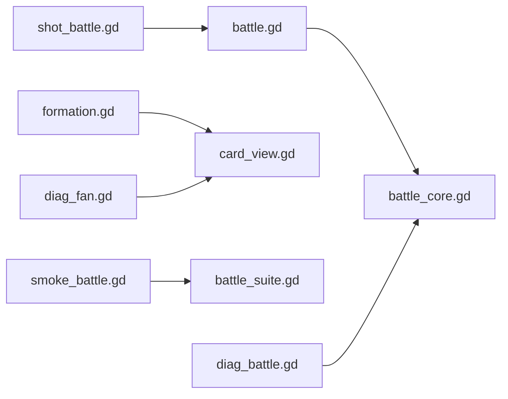

# Performance & Memory Validation

<cite>
**Referenced Files in This Document**
- [battle.gd](file://scripts/battle.gd)
- [battle_core.gd](file://scripts/battle_core.gd)
- [card_view.gd](file://scripts/card_view.gd)
- [formation.gd](file://scripts/formation.gd)
- [diag_battle.gd](file://tools/diag_battle.gd)
- [diag_fan.gd](file://tools/diag_fan.gd)
- [smoke_battle.gd](file://tools/smoke_battle.gd)
- [battle_suite.gd](file://tools/suites/battle_suite.gd)
- [shot_battle.gd](file://tools/shot_battle.gd)
- [stamina.gd](file://scripts/stamina.gd)
</cite>

## Table of Contents
1. [Introduction](#introduction)
2. [Project Structure](#project-structure)
3. [Core Components](#core-components)
4. [Architecture Overview](#architecture-overview)
5. [Detailed Component Analysis](#detailed-component-analysis)
6. [Dependency Analysis](#dependency-analysis)
7. [Performance Considerations](#performance-considerations)
8. [Troubleshooting Guide](#troubleshooting-guide)
9. [Conclusion](#conclusion)
10. [Appendices](#appendices)

## Introduction
This document provides a comprehensive guide to performance validation and memory leak detection for the card game’s battle system, focusing on profiling under load, measuring memory allocation patterns, identifying bottlenecks in card rendering and animations, and using built-in diagnostic utilities to analyze frame rates, CPU usage, and GPU performance during gameplay. It also includes stress-testing guidelines for large formations, high-level characters, and complex battles, along with best practices for memory management and garbage collection optimization in Godot.

## Project Structure
The project separates core logic from UI and diagnostics:
- Battle logic is implemented in a pure logic core that emits events for the UI to play as animations.
- The UI layer renders units, cards, and effects without performing numerical calculations.
- Diagnostic tools run headless or in windowed mode to validate correctness, capture screenshots, and analyze layout overlap.



**Diagram sources**
- [battle.gd:1-120](file://scripts/battle.gd#L1-L120)
- [battle_core.gd:1-120](file://scripts/battle_core.gd#L1-L120)
- [card_view.gd:1-60](file://scripts/card_view.gd#L1-L60)
- [formation.gd:1-120](file://scripts/formation.gd#L1-L120)
- [diag_battle.gd:1-45](file://tools/diag_battle.gd#L1-L45)
- [diag_fan.gd:1-52](file://tools/diag_fan.gd#L1-L52)
- [smoke_battle.gd:1-33](file://tools/smoke_battle.gd#L1-L33)
- [battle_suite.gd:1-58](file://tools/suites/battle_suite.gd#L1-L58)
- [shot_battle.gd:31-77](file://tools/shot_battle.gd#L31-L77)

**Section sources**
- [battle.gd:1-120](file://scripts/battle.gd#L1-L120)
- [battle_core.gd:1-120](file://scripts/battle_core.gd#L1-L120)
- [card_view.gd:1-60](file://scripts/card_view.gd#L1-L60)
- [formation.gd:1-120](file://scripts/formation.gd#L1-L120)
- [diag_battle.gd:1-45](file://tools/diag_battle.gd#L1-L45)
- [diag_fan.gd:1-52](file://tools/diag_fan.gd#L1-L52)
- [smoke_battle.gd:1-33](file://tools/smoke_battle.gd#L1-L33)
- [battle_suite.gd:1-58](file://tools/suites/battle_suite.gd#L1-L58)
- [shot_battle.gd:31-77](file://tools/shot_battle.gd#L31-L77)

## Core Components
- BattleCore: Pure logic engine driving ATB turns, target selection, damage/healing/shield/buff resolution, and event emission. It exposes methods to query team power, unit positions, and action order.
- Battle UI: Consumes events from BattleCore each fixed interval and plays animations (float text, flashes, sprite motion). It maintains tokens for units and updates health bars, shields, energy bars, and logs.
- CardView: Reusable card widget used in formation and fan layouts; handles hover/select animations and z-indexing to avoid overlapping issues.
- Formation: Manages hero selection, filtering, sorting, and board placement; drives CardFan layout and selection states.
- Diagnostics: Headless and windowed scripts to run smoke tests, print battle logs, analyze card fan overlaps, and capture screenshots.

Key responsibilities:
- Separation of concerns: BattleCore computes; Battle UI animates.
- Deterministic runs via seed-based RNG.
- Extensive assertions in smoke tests to ensure configuration, geometry, math, and scene integrity.

**Section sources**
- [battle_core.gd:1-120](file://scripts/battle_core.gd#L1-L120)
- [battle.gd:93-117](file://scripts/battle.gd#L93-L117)
- [card_view.gd:44-60](file://scripts/card_view.gd#L44-L60)
- [formation.gd:77-100](file://scripts/formation.gd#L77-L100)
- [smoke_battle.gd:16-33](file://tools/smoke_battle.gd#L16-L33)
- [battle_suite.gd:30-58](file://tools/suites/battle_suite.gd#L30-L58)

## Architecture Overview
The architecture follows a clear pipeline:
- Setup: Battle scene initializes BattleCore with stage data and player entries.
- Loop: Every fixed time step, Battle UI calls BattleCore.step() to get events and plays them.
- Rendering: Units, cards, and effects are updated based on events; floating text and flashes are animated and freed after use.
- Diagnostics: Smoke tests and diag scripts exercise core logic and UI independently to validate behavior and performance characteristics.

```mermaid
sequenceDiagram
participant UI as "Battle UI<br/>scripts/battle.gd"
participant Core as "BattleCore<br/>scripts/battle_core.gd"
participant Fan as "CardView<br/>scripts/card_view.gd"
participant Diag as "Diagnostics<br/>tools/*"
UI->>Core : setup(stage_id, player_entries, opts)
loop Fixed interval
UI->>Core : step()
Core-->>UI : events[]
UI->>UI : play(events), update bars/logs
Note over UI : Animations created per event; queued free after tween
end
Diag->>Core : run_all()/step() for headless validation
Diag->>UI : load scenes / screenshot capture
```

**Diagram sources**
- [battle.gd:640-671](file://scripts/battle.gd#L640-L671)
- [battle_core.gd:392-426](file://scripts/battle_core.gd#L392-L426)
- [card_view.gd:264-322](file://scripts/card_view.gd#L264-L322)
- [smoke_battle.gd:16-33](file://tools/smoke_battle.gd#L16-L33)
- [shot_battle.gd:31-77](file://tools/shot_battle.gd#L31-L77)

## Detailed Component Analysis

### BattleCore: Time-driven simulation and event emission
- ATB scheduling: Each unit has a next-action time computed from speed; the earliest actor moves each step.
- Action execution: Ult > skill > default attack; targets resolved by role and spec; damage/heal/shield/buff applied with counters, crits, variance, and element bonuses.
- End conditions: Wipe or timeout; final HP ratios and actions recorded.
- Determinism: Seed controls RNG; same seed yields identical sequences.



**Diagram sources**
- [battle_core.gd:392-426](file://scripts/battle_core.gd#L392-L426)
- [battle_core.gd:441-466](file://scripts/battle_core.gd#L441-L466)
- [battle_core.gd:477-572](file://scripts/battle_core.gd#L477-L572)
- [battle_core.gd:672-762](file://scripts/battle_core.gd#L672-L762)

**Section sources**
- [battle_core.gd:392-426](file://scripts/battle_core.gd#L392-L426)
- [battle_core.gd:441-466](file://scripts/battle_core.gd#L441-L466)
- [battle_core.gd:477-572](file://scripts/battle_core.gd#L477-L572)
- [battle_core.gd:672-762](file://scripts/battle_core.gd#L672-L762)

### Battle UI: Event playback and resource lifecycle
- Fixed-step loop advances one action every ACTION_SECONDS scaled by speed.
- Events drive float text, flashes, sprite motion; all temporary nodes are queued for deletion after animation completes.
- Health/shield/energy bars updated proportionally; logs appended and scrolled.



**Diagram sources**
- [battle.gd:640-671](file://scripts/battle.gd#L640-L671)
- [battle.gd:743-775](file://scripts/battle.gd#L743-L775)

**Section sources**
- [battle.gd:640-671](file://scripts/battle.gd#L640-L671)
- [battle.gd:743-775](file://scripts/battle.gd#L743-L775)

### CardView: Layout, hover/select, and z-index management
- Builds layered visuals: glow, shadow, bed, portrait holder, frame, info band, badges.
- Hover lifts position and scale; selection adds golden ring and higher z-index.
- Base position synchronization prevents conflicts when scrolling or repositioning fans.



**Diagram sources**
- [card_view.gd:44-60](file://scripts/card_view.gd#L44-L60)
- [card_view.gd:264-322](file://scripts/card_view.gd#L264-L322)
- [card_view.gd:337-363](file://scripts/card_view.gd#L337-L363)

**Section sources**
- [card_view.gd:44-60](file://scripts/card_view.gd#L44-L60)
- [card_view.gd:264-322](file://scripts/card_view.gd#L264-L322)
- [card_view.gd:337-363](file://scripts/card_view.gd#L337-L363)

### Formation: Fan layout and selection state
- Configures CardFan with items, rarities, elements, and box size.
- Applies selection scaling and ensures base position sync to avoid jitter during scroll.
- Filters and sort options affect view list and fan rebuild.

**Section sources**
- [formation.gd:495-508](file://scripts/formation.gd#L495-L508)
- [formation.gd:503-508](file://scripts/formation.gd#L503-L508)

### Diagnostics: Headless validation and visual checks
- diag_battle: Runs multiple stages with seeds, prints key events and results; useful for balance checks without UI overhead.
- diag_fan: Loads main menu, waits for settle, reports global rects and overlap percentages for stat rows and labels; helps detect card fan occlusion issues.
- smoke_battle: Entry point to dynamically load and run battle_suite; asserts configuration, geometry, combat math, determinism, scene structure, interactions, and settlement sync.
- shot_battle: Captures screenshots after waiting for settle; useful for visual regression and GPU/CPU profiling via frame callbacks.

**Section sources**
- [diag_battle.gd:18-44](file://tools/diag_battle.gd#L18-L44)
- [diag_battle.gd:62-105](file://tools/diag_battle.gd#L62-L105)
- [diag_fan.gd:24-52](file://tools/diag_fan.gd#L24-L52)
- [diag_fan.gd:54-130](file://tools/diag_fan.gd#L54-L130)
- [smoke_battle.gd:16-33](file://tools/smoke_battle.gd#L16-L33)
- [battle_suite.gd:30-58](file://tools/suites/battle_suite.gd#L30-L58)
- [shot_battle.gd:31-77](file://tools/shot_battle.gd#L31-L77)

## Dependency Analysis
- Battle UI depends on BattleCore for deterministic events and queries.
- CardView is used by Formation and potentially other UI components; it relies on UI kit helpers for panels, labels, and icons.
- Diagnostics depend on loading scenes/scripts at runtime to avoid autoload visibility issues in headless mode.
- Stamina system persists values and applies offline recovery; not directly tied to battle but part of overall game state management.



**Diagram sources**
- [battle.gd:1-120](file://scripts/battle.gd#L1-L120)
- [battle_core.gd:1-120](file://scripts/battle_core.gd#L1-L120)
- [formation.gd:1-120](file://scripts/formation.gd#L1-L120)
- [card_view.gd:1-60](file://scripts/card_view.gd#L1-L60)
- [smoke_battle.gd:16-33](file://tools/smoke_battle.gd#L16-L33)
- [battle_suite.gd:1-58](file://tools/suites/battle_suite.gd#L1-L58)
- [diag_battle.gd:18-44](file://tools/diag_battle.gd#L18-L44)
- [diag_fan.gd:24-52](file://tools/diag_fan.gd#L24-L52)
- [shot_battle.gd:31-77](file://tools/shot_battle.gd#L31-L77)

**Section sources**
- [battle.gd:1-120](file://scripts/battle.gd#L1-L120)
- [battle_core.gd:1-120](file://scripts/battle_core.gd#L1-L120)
- [formation.gd:1-120](file://scripts/formation.gd#L1-L120)
- [card_view.gd:1-60](file://scripts/card_view.gd#L1-L60)
- [smoke_battle.gd:16-33](file://tools/smoke_battle.gd#L16-L33)
- [battle_suite.gd:1-58](file://tools/suites/battle_suite.gd#L1-L58)
- [diag_battle.gd:18-44](file://tools/diag_battle.gd#L18-L44)
- [diag_fan.gd:24-52](file://tools/diag_fan.gd#L24-L52)
- [shot_battle.gd:31-77](file://tools/shot_battle.gd#L31-L77)

## Performance Considerations
- Frame pacing: Battle UI advances one action every fixed interval; ensure this interval aligns with desired gameplay speed and avoids excessive per-frame allocations.
- Animation lifecycle: Floating text and effects are created per event and freed after tween completion; verify no lingering references keep nodes alive.
- Node counts: Ensure unit layers match active units; avoid creating extra nodes during refresh loops.
- Resource reuse: Prefer pooling where possible for frequently created/destroyed nodes (e.g., float text) to reduce GC pressure.
- Deterministic runs: Use fixed seeds in smoke tests to stabilize performance measurements across runs.
- Screenshot capture: Use frame_post_draw hooks to capture stable frames for visual regression and GPU profiling.

[No sources needed since this section provides general guidance]

## Troubleshooting Guide
Common issues and how to diagnose:
- Card fan overlap: Run diag_fan to report global rectangles and overlap percentages for stat rows and labels; adjust layout or z-index accordingly.
- Battle imbalance: Run diag_battle to print key events and results; compare against expected outcomes and tune configs or formulas.
- Scene structure problems: Use smoke_battle to assert node presence, unit counts, and HUD text; fix missing nodes or incorrect bindings.
- Screenshot timing: Adjust wait times in shot_battle to ensure animations settle before capture; verify RenderingServer hook is connected.

Memory leak detection techniques:
- Inspect queue_free usage: Ensure all temporary nodes are queued for deletion after animations complete; check tween callbacks for proper cleanup.
- Validate node counts: In smoke tests, assert child counts for layers (cells, units, plates) to catch unexpected growth.
- Filter live children: When asserting UI state, ignore nodes queued for deletion to avoid false positives.
- Profile allocations: Use Godot’s built-in profiler to identify hotspots in _process, event playback, and card layout updates.

Garbage collection optimization:
- Minimize per-frame allocations: Reuse arrays and dictionaries where feasible; avoid creating new objects inside tight loops.
- Batch updates: Consolidate bar updates and log appends to reduce frequent UI changes.
- Avoid heavy operations in _process: Move expensive computations to BattleCore and call lightweight steps from UI.

Resource management best practices:
- Preload resources: Use preload for constants and shared scripts to avoid runtime loading overhead.
- Free unused nodes promptly: Remove and free nodes when rebuilding lists or switching screens.
- Persist state efficiently: Save profile changes at controlled intervals to avoid frequent disk writes.

**Section sources**
- [diag_fan.gd:54-130](file://tools/diag_fan.gd#L54-L130)
- [diag_battle.gd:62-105](file://tools/diag_battle.gd#L62-L105)
- [smoke_battle.gd:16-33](file://tools/smoke_battle.gd#L16-L33)
- [battle_suite.gd:568-666](file://tools/suites/battle_suite.gd#L568-L666)
- [shot_battle.gd:31-77](file://tools/shot_battle.gd#L31-L77)
- [battle.gd:743-775](file://scripts/battle.gd#L743-L775)
- [stamina.gd:111-172](file://scripts/stamina.gd#L111-L172)

## Conclusion
The project implements a robust separation between battle logic and UI, enabling precise performance validation and memory leak detection. Built-in diagnostics provide headless validation, visual overlap analysis, and screenshot capture to support both functional correctness and performance tuning. By following the outlined stress-testing guidelines, monitoring frame pacing, and adhering to resource management best practices, developers can maintain smooth gameplay even under heavy loads.

[No sources needed since this section summarizes without analyzing specific files]

## Appendices
- Stress testing scenarios:
  - Large formations: Load many heroes in formation; monitor fan layout and overlap via diag_fan.
  - High-level characters: Increase stats and run battle_suite to validate damage/healing/shield behaviors.
  - Complex battles: Use diag_battle with multiple stages and seeds to simulate extended engagements; review logs for bottlenecks.
- Profiling tips:
  - Use Godot’s profiler to measure CPU/GPU usage during battle loops and card fan interactions.
  - Capture frames with shot_battle to correlate visual artifacts with performance spikes.
  - Analyze node creation/deletion patterns to identify potential leaks or excessive allocations.

[No sources needed since this section provides general guidance]