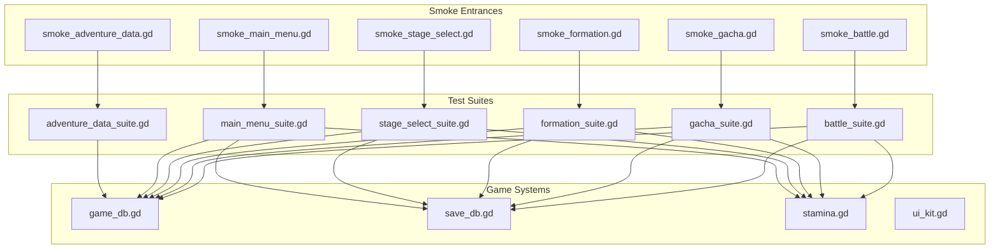
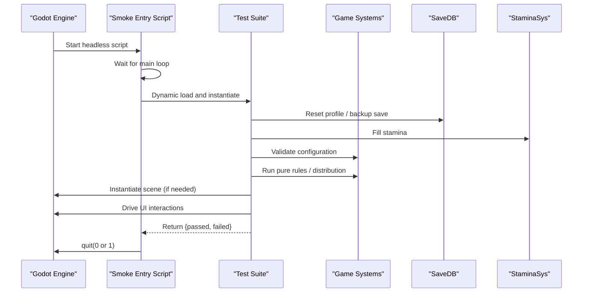
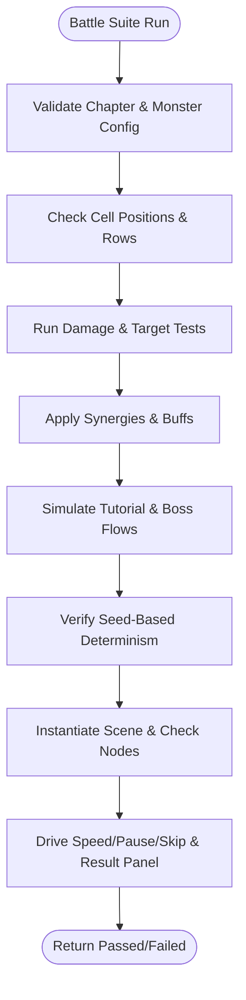
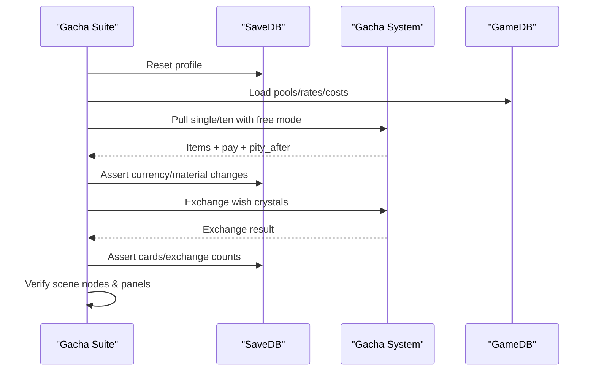
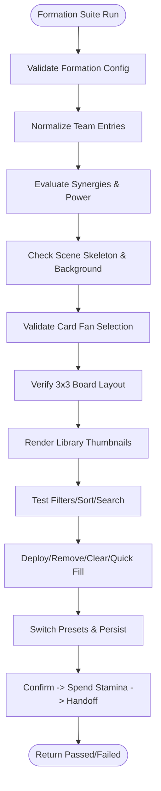
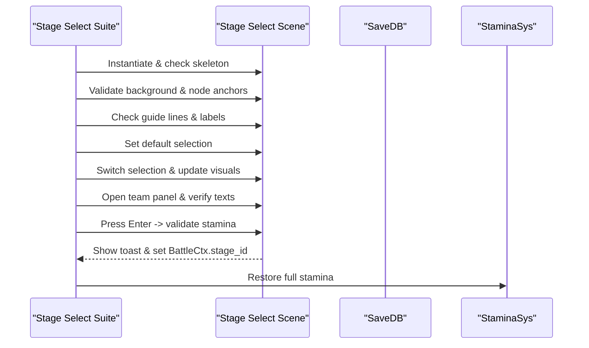
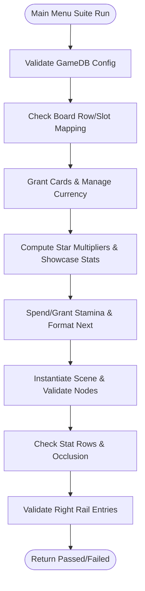
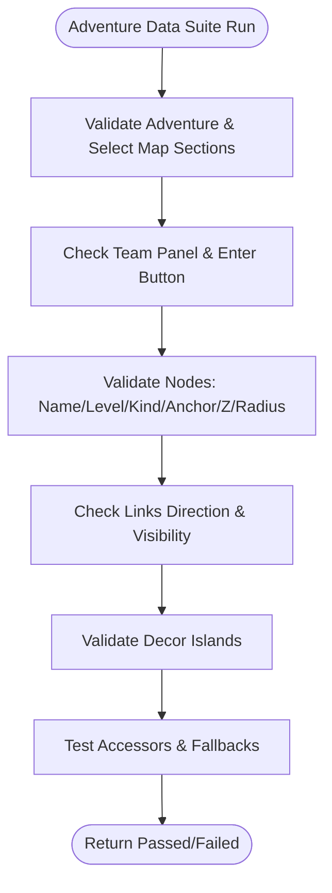
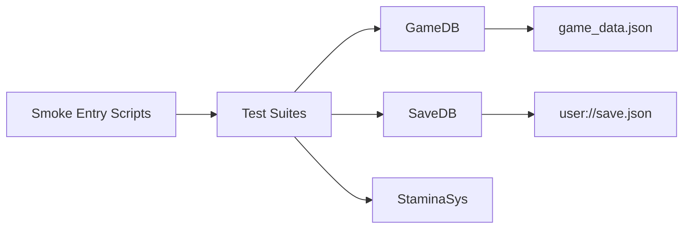

# Smoke Testing Suite

<cite>
**Referenced Files in This Document**
- [smoke_battle.gd](file://tools/smoke_battle.gd)
- [smoke_gacha.gd](file://tools/smoke_gacha.gd)
- [smoke_formation.gd](file://tools/smoke_formation.gd)
- [smoke_stage_select.gd](file://tools/smoke_stage_select.gd)
- [smoke_main_menu.gd](file://tools/smoke_main_menu.gd)
- [smoke_adventure_data.gd](file://tools/smoke_adventure_data.gd)
- [battle_suite.gd](file://tools/suites/battle_suite.gd)
- [gacha_suite.gd](file://tools/suites/gacha_suite.gd)
- [formation_suite.gd](file://tools/suites/formation_suite.gd)
- [stage_select_suite.gd](file://tools/suites/stage_select_suite.gd)
- [main_menu_suite.gd](file://tools/suites/main_menu_suite.gd)
- [adventure_data_suite.gd](file://tools/suites/adventure_data_suite.gd)
- [game_db.gd](file://scripts/game_db.gd)
- [save_db.gd](file://scripts/save_db.gd)
- [stamina.gd](file://scripts/stamina.gd)
- [ui_kit.gd](file://tools/ui_kit.gd)
</cite>

## Table of Contents
1. [Introduction](#introduction)
2. [Project Structure](#project-structure)
3. [Core Components](#core-components)
4. [Architecture Overview](#architecture-overview)
5. [Detailed Component Analysis](#detailed-component-analysis)
6. [Dependency Analysis](#dependency-analysis)
7. [Performance Considerations](#performance-considerations)
8. [Troubleshooting Guide](#troubleshooting-guide)
9. [Conclusion](#conclusion)
10. [Appendices](#appendices)

## Introduction
This document explains the smoke testing framework that validates core game functionality for the card game project. The suite automatically verifies critical paths such as battle simulation, gacha pulling, formation setup, stage navigation, main menu behavior, and adventure map data integrity. It uses headless Godot execution to load scene trees, instantiate scenes, drive UI interactions, assert game state changes, and report pass/fail results.

The framework is organized around:
- Entry scripts that bootstrap a headless run and dynamically load test suites after the main loop starts.
- Test suites that cover configuration, pure rules, distribution, state transitions, scene skeletons, and user interaction flows.
- Shared game systems accessed through autoloads like GameDB, SaveDB, StaminaSys, and others.

## Project Structure
The smoke testing framework lives under `tools/` and `tools/suites/`:
- Entry scripts: `smoke_battle.gd`, `smoke_gacha.gd`, `smoke_formation.gd`, `smoke_stage_select.gd`, `smoke_main_menu.gd`, `smoke_adventure_data.gd`.
- Suites: `battle_suite.gd`, `gacha_suite.gd`, `formation_suite.gd`, `stage_select_suite.gd`, `main_menu_suite.gd`, `adventure_data_suite.gd`.
- Core game systems: `game_db.gd`, `save_db.gd`, `stamina.gd`.
- UI utilities: `ui_kit.gd`.

**Diagram sources**
- [smoke_battle.gd:1-33](file://tools/smoke_battle.gd#L1-L33)
- [smoke_gacha.gd:1-33](file://tools/smoke_gacha.gd#L1-L33)
- [smoke_formation.gd:1-33](file://tools/smoke_formation.gd#L1-L33)
- [smoke_stage_select.gd:1-33](file://tools/smoke_stage_select.gd#L1-L33)
- [smoke_main_menu.gd:1-33](file://tools/smoke_main_menu.gd#L1-L33)
- [smoke_adventure_data.gd:1-33](file://tools/smoke_adventure_data.gd#L1-L33)
- [battle_suite.gd:1-58](file://tools/suites/battle_suite.gd#L1-L58)
- [gacha_suite.gd:1-40](file://tools/suites/gacha_suite.gd#L1-L40)
- [formation_suite.gd:1-68](file://tools/suites/formation_suite.gd#L1-L68)
- [stage_select_suite.gd:1-47](file://tools/suites/stage_select_suite.gd#L1-L47)
- [main_menu_suite.gd:1-34](file://tools/suites/main_menu_suite.gd#L1-L34)
- [adventure_data_suite.gd:1-27](file://tools/suites/adventure_data_suite.gd#L1-L27)
- [game_db.gd:1-37](file://scripts/game_db.gd#L1-L37)
- [save_db.gd:1-21](file://scripts/save_db.gd#L1-L21)
- [stamina.gd:1-36](file://scripts/stamina.gd#L1-L36)
- [ui_kit.gd:1-8](file://tools/ui_kit.gd#L1-L8)

**Section sources**
- [smoke_battle.gd:1-33](file://tools/smoke_battle.gd#L1-L33)
- [smoke_gacha.gd:1-33](file://tools/smoke_gacha.gd#L1-L33)
- [smoke_formation.gd:1-33](file://tools/smoke_formation.gd#L1-L33)
- [smoke_stage_select.gd:1-33](file://tools/smoke_stage_select.gd#L1-L33)
- [smoke_main_menu.gd:1-33](file://tools/smoke_main_menu.gd#L1-L33)
- [smoke_adventure_data.gd:1-33](file://tools/smoke_adventure_data.gd#L1-L33)
- [battle_suite.gd:1-58](file://tools/suites/battle_suite.gd#L1-L58)
- [gacha_suite.gd:1-40](file://tools/suites/gacha_suite.gd#L1-L40)
- [formation_suite.gd:1-68](file://tools/suites/formation_suite.gd#L1-L68)
- [stage_select_suite.gd:1-47](file://tools/suites/stage_select_suite.gd#L1-L47)
- [main_menu_suite.gd:1-34](file://tools/suites/main_menu_suite.gd#L1-L34)
- [adventure_data_suite.gd:1-27](file://tools/suites/adventure_data_suite.gd#L1-L27)
- [game_db.gd:1-37](file://scripts/game_db.gd#L1-L37)
- [save_db.gd:1-21](file://scripts/save_db.gd#L1-L21)
- [stamina.gd:1-36](file://scripts/stamina.gd#L1-L36)
- [ui_kit.gd:1-8](file://tools/ui_kit.gd#L1-L8)

## Core Components
- Smoke entry scripts: Each entry extends SceneTree, waits for the main loop, loads its corresponding suite dynamically, runs it with the SceneTree, and exits with status 0 or 1 based on failures.
- Test suites: Each suite implements a `run(tree)` method returning `{passed, failed}`. They reset profiles, fill stamina, and execute layered checks (configuration, math/rules, distribution/state, scene skeleton, interaction).
- Game systems:
  - GameDB: Read-only configuration access; used by suites to validate constants, tables, and derived values.
  - SaveDB: Persistent profile storage; suites reset and restore save files to ensure deterministic runs.
  - StaminaSys: Regenerable resource; suites fill or spend stamina to simulate gameplay constraints.
  - UIKit: UI construction helpers; not directly invoked by smoke tests but part of the engine’s UI tooling.

Key responsibilities:
- Determinism: Use fixed seeds where applicable and avoid global autoload visibility issues by dynamic loading.
- Isolation: Backup and restore `user://save.json` before and after each suite run.
- Assertions: Consistent `_ok` and `_eq` helpers print `[PASS]` or `[FAIL]` with details.

**Section sources**
- [smoke_battle.gd:1-33](file://tools/smoke_battle.gd#L1-L33)
- [smoke_gacha.gd:1-33](file://tools/smoke_gacha.gd#L1-L33)
- [smoke_formation.gd:1-33](file://tools/smoke_formation.gd#L1-L33)
- [smoke_stage_select.gd:1-33](file://tools/smoke_stage_select.gd#L1-L33)
- [smoke_main_menu.gd:1-33](file://tools/smoke_main_menu.gd#L1-L33)
- [smoke_adventure_data.gd:1-33](file://tools/smoke_adventure_data.gd#L1-L33)
- [battle_suite.gd:15-58](file://tools/suites/battle_suite.gd#L15-L58)
- [gacha_suite.gd:14-40](file://tools/suites/gacha_suite.gd#L14-L40)
- [formation_suite.gd:15-68](file://tools/suites/formation_suite.gd#L15-L68)
- [stage_select_suite.gd:10-47](file://tools/suites/stage_select_suite.gd#L10-L47)
- [main_menu_suite.gd:12-34](file://tools/suites/main_menu_suite.gd#L12-L34)
- [adventure_data_suite.gd:8-27](file://tools/suites/adventure_data_suite.gd#L8-L27)
- [game_db.gd:1-37](file://scripts/game_db.gd#L1-L37)
- [save_db.gd:1-21](file://scripts/save_db.gd#L1-L21)
- [stamina.gd:1-36](file://scripts/stamina.gd#L1-L36)
- [ui_kit.gd:1-8](file://tools/ui_kit.gd#L1-L8)

## Architecture Overview
The smoke testing architecture follows a consistent pattern:
- Headless entry script boots the engine without a visible window.
- After a few frames, it loads the target suite via dynamic `load()`.
- The suite resets persistent state, initializes systems, and executes layered checks.
- Results are aggregated and returned to the entry script, which sets the process exit code accordingly.

**Diagram sources**
- [smoke_battle.gd:16-31](file://tools/smoke_battle.gd#L16-L31)
- [smoke_gacha.gd:16-31](file://tools/smoke_gacha.gd#L16-L31)
- [smoke_formation.gd:16-31](file://tools/smoke_formation.gd#L16-L31)
- [smoke_stage_select.gd:16-31](file://tools/smoke_stage_select.gd#L16-L31)
- [smoke_main_menu.gd:16-31](file://tools/smoke_main_menu.gd#L16-L31)
- [smoke_adventure_data.gd:16-31](file://tools/smoke_adventure_data.gd#L16-L31)
- [battle_suite.gd:30-58](file://tools/suites/battle_suite.gd#L30-L58)
- [gacha_suite.gd:21-40](file://tools/suites/gacha_suite.gd#L21-L40)
- [formation_suite.gd:38-68](file://tools/suites/formation_suite.gd#L38-L68)
- [stage_select_suite.gd:27-47](file://tools/suites/stage_select_suite.gd#L27-L47)
- [main_menu_suite.gd:19-34](file://tools/suites/main_menu_suite.gd#L19-L34)
- [adventure_data_suite.gd:16-27](file://tools/suites/adventure_data_suite.gd#L16-L27)
- [save_db.gd:146-181](file://scripts/save_db.gd#L146-L181)
- [stamina.gd:19-36](file://scripts/stamina.gd#L19-L36)

## Detailed Component Analysis

### Battle Simulation Smoke Test
Covers:
- Configuration consistency: chapter stages, enemy counts, boss traits, environment effects, power scaling.
- Battlefield geometry: cell positions, row ordering, spacing, visibility.
- Combat math: element counters, damage multipliers, defense/resistance, ATB order, target resolution.
- Synergy application: starting energy/shield, elemental damage bonuses.
- Flow validation: tutorial win, boss mechanics, healing, environment buffs, timeout handling.
- Determinism: same seed yields identical action sequences and logs.
- Scene verification: node hierarchy, unit placement, HUD text, speed/pause/skip controls, result panel, rewards, star ratings.

**Diagram sources**
- [battle_suite.gd:30-58](file://tools/suites/battle_suite.gd#L30-L58)
- [battle_suite.gd:96-183](file://tools/suites/battle_suite.gd#L96-L183)
- [battle_suite.gd:228-276](file://tools/suites/battle_suite.gd#L228-L276)
- [battle_suite.gd:280-355](file://tools/suites/battle_suite.gd#L280-L355)
- [battle_suite.gd:374-443](file://tools/suites/battle_suite.gd#L374-L443)
- [battle_suite.gd:447-523](file://tools/suites/battle_suite.gd#L447-L523)
- [battle_suite.gd:535-563](file://tools/suites/battle_suite.gd#L535-L563)
- [battle_suite.gd:568-672](file://tools/suites/battle_suite.gd#L568-L672)
- [battle_suite.gd:677-770](file://tools/suites/battle_suite.gd#L677-L770)

**Section sources**
- [battle_suite.gd:15-58](file://tools/suites/battle_suite.gd#L15-L58)
- [battle_suite.gd:96-183](file://tools/suites/battle_suite.gd#L96-L183)
- [battle_suite.gd:228-276](file://tools/suites/battle_suite.gd#L228-L276)
- [battle_suite.gd:280-355](file://tools/suites/battle_suite.gd#L280-L355)
- [battle_suite.gd:374-443](file://tools/suites/battle_suite.gd#L374-L443)
- [battle_suite.gd:447-523](file://tools/suites/battle_suite.gd#L447-L523)
- [battle_suite.gd:535-563](file://tools/suites/battle_suite.gd#L535-L563)
- [battle_suite.gd:568-672](file://tools/suites/battle_suite.gd#L568-L672)
- [battle_suite.gd:677-770](file://tools/suites/battle_suite.gd#L677-L770)

### Gacha Pulling Smoke Test
Covers:
- Configuration: pool list, rates, costs, pity scales, wish crystals, rate notice, reveal config.
- Pure probability rules: rarity selection boundaries, pity normalization, UP allocation, weight-based selection, degradation fallback.
- Distribution: large-sample frequency within tolerance.
- State management: pity triggers, cross-period inheritance, payment logic, crystal accumulation, exchange shop, star cap, history.
- Scene interactions: tabs, pull buttons, reveal layer, rate panel, shop panel, toast messages.

**Diagram sources**
- [gacha_suite.gd:21-40](file://tools/suites/gacha_suite.gd#L21-L40)
- [gacha_suite.gd:63-136](file://tools/suites/gacha_suite.gd#L63-L136)
- [gacha_suite.gd:145-208](file://tools/suites/gacha_suite.gd#L145-L208)
- [gacha_suite.gd:212-237](file://tools/suites/gacha_suite.gd#L212-L237)
- [gacha_suite.gd:243-272](file://tools/suites/gacha_suite.gd#L243-L272)
- [gacha_suite.gd:277-336](file://tools/suites/gacha_suite.gd#L277-L336)
- [gacha_suite.gd:341-404](file://tools/suites/gacha_suite.gd#L341-L404)
- [gacha_suite.gd:408-443](file://tools/suites/gacha_suite.gd#L408-L443)
- [gacha_suite.gd:447-474](file://tools/suites/gacha_suite.gd#L447-L474)
- [gacha_suite.gd:479-681](file://tools/suites/gacha_suite.gd#L479-L681)

**Section sources**
- [gacha_suite.gd:14-40](file://tools/suites/gacha_suite.gd#L14-L40)
- [gacha_suite.gd:63-136](file://tools/suites/gacha_suite.gd#L63-L136)
- [gacha_suite.gd:145-208](file://tools/suites/gacha_suite.gd#L145-L208)
- [gacha_suite.gd:212-237](file://tools/suites/gacha_suite.gd#L212-L237)
- [gacha_suite.gd:243-272](file://tools/suites/gacha_suite.gd#L243-L272)
- [gacha_suite.gd:277-336](file://tools/suites/gacha_suite.gd#L277-L336)
- [gacha_suite.gd:341-404](file://tools/suites/gacha_suite.gd#L341-L404)
- [gacha_suite.gd:408-443](file://tools/suites/gacha_suite.gd#L408-L443)
- [gacha_suite.gd:447-474](file://tools/suites/gacha_suite.gd#L447-L474)
- [gacha_suite.gd:479-681](file://tools/suites/gacha_suite.gd#L479-L681)

### Formation Setup Smoke Test
Covers:
- Data layer: team max size, normalization (duplicate hero, out-of-bounds slots, overflow truncation), synergy evaluation, power calculation, counter reports.
- UI skeleton: scene root, script attachment, unique node names, background texture.
- Card fan: default selection, highlight ring, zoom scale, switching selection.
- Board layout: 3x3 grid, slot-to-cell mapping, front/back row ordering, real-time board reflection.
- Library: thumbnails, deployed markers, count labels, selection via library grid.
- Filter/sort/search: element/role chips, sort by power/name, search by name/rarity, empty state.
- Team operations: deploy/remove/clear, quick fill, presets, confirm flow (stamina deduction, persistence, handoff to battle).

**Diagram sources**
- [formation_suite.gd:38-68](file://tools/suites/formation_suite.gd#L38-L68)
- [formation_suite.gd:110-132](file://tools/suites/formation_suite.gd#L110-L132)
- [formation_suite.gd:143-188](file://tools/suites/formation_suite.gd#L143-L188)
- [formation_suite.gd:192-225](file://tools/suites/formation_suite.gd#L192-L225)
- [formation_suite.gd:232-300](file://tools/suites/formation_suite.gd#L232-L300)
- [formation_suite.gd:304-324](file://tools/suites/formation_suite.gd#L304-L324)
- [formation_suite.gd:328-362](file://tools/suites/formation_suite.gd#L328-L362)
- [formation_suite.gd:366-401](file://tools/suites/formation_suite.gd#L366-L401)
- [formation_suite.gd:405-447](file://tools/suites/formation_suite.gd#L405-L447)
- [formation_suite.gd:451-489](file://tools/suites/formation_suite.gd#L451-L489)
- [formation_suite.gd:494-579](file://tools/suites/formation_suite.gd#L494-L579)
- [formation_suite.gd:583-637](file://tools/suites/formation_suite.gd#L583-L637)
- [formation_suite.gd:641-675](file://tools/suites/formation_suite.gd#L641-L675)
- [formation_suite.gd:680-719](file://tools/suites/formation_suite.gd#L680-L719)
- [formation_suite.gd:724-784](file://tools/suites/formation_suite.gd#L724-L784)

**Section sources**
- [formation_suite.gd:15-68](file://tools/suites/formation_suite.gd#L15-L68)
- [formation_suite.gd:110-132](file://tools/suites/formation_suite.gd#L110-L132)
- [formation_suite.gd:143-188](file://tools/suites/formation_suite.gd#L143-L188)
- [formation_suite.gd:192-225](file://tools/suites/formation_suite.gd#L192-L225)
- [formation_suite.gd:232-300](file://tools/suites/formation_suite.gd#L232-L300)
- [formation_suite.gd:304-324](file://tools/suites/formation_suite.gd#L304-L324)
- [formation_suite.gd:328-362](file://tools/suites/formation_suite.gd#L328-L362)
- [formation_suite.gd:366-401](file://tools/suites/formation_suite.gd#L366-L401)
- [formation_suite.gd:405-447](file://tools/suites/formation_suite.gd#L405-L447)
- [formation_suite.gd:451-489](file://tools/suites/formation_suite.gd#L451-L489)
- [formation_suite.gd:494-579](file://tools/suites/formation_suite.gd#L494-L579)
- [formation_suite.gd:583-637](file://tools/suites/formation_suite.gd#L583-L637)
- [formation_suite.gd:641-675](file://tools/suites/formation_suite.gd#L641-L675)
- [formation_suite.gd:680-719](file://tools/suites/formation_suite.gd#L680-L719)
- [formation_suite.gd:724-784](file://tools/suites/formation_suite.gd#L724-L784)

### Stage Navigation Smoke Test
Covers:
- Scene skeleton and script attachment.
- Background texture correctness and dimensions.
- Map node placement relative to configured anchors.
- Guide lines endpoints and visibility.
- Labels, stars, tags, and sync stats.
- Default selection and switching.
- Team panel and button texts.
- Interaction flow: select stage -> validate stamina -> handoff to formation page.

**Diagram sources**
- [stage_select_suite.gd:27-47](file://tools/suites/stage_select_suite.gd#L27-L47)
- [stage_select_suite.gd:85-107](file://tools/suites/stage_select_suite.gd#L85-L107)
- [stage_select_suite.gd:114-131](file://tools/suites/stage_select_suite.gd#L114-L131)
- [stage_select_suite.gd:135-211](file://tools/suites/stage_select_suite.gd#L135-L211)
- [stage_select_suite.gd:215-262](file://tools/suites/stage_select_suite.gd#L215-L262)
- [stage_select_suite.gd:267-316](file://tools/suites/stage_select_suite.gd#L267-L316)
- [stage_select_suite.gd:320-350](file://tools/suites/stage_select_suite.gd#L320-L350)
- [stage_select_suite.gd:354-373](file://tools/suites/stage_select_suite.gd#L354-L373)
- [stage_select_suite.gd:377-439](file://tools/suites/stage_select_suite.gd#L377-L439)

**Section sources**
- [stage_select_suite.gd:10-47](file://tools/suites/stage_select_suite.gd#L10-L47)
- [stage_select_suite.gd:85-107](file://tools/suites/stage_select_suite.gd#L85-L107)
- [stage_select_suite.gd:114-131](file://tools/suites/stage_select_suite.gd#L114-L131)
- [stage_select_suite.gd:135-211](file://tools/suites/stage_select_suite.gd#L135-L211)
- [stage_select_suite.gd:215-262](file://tools/suites/stage_select_suite.gd#L215-L262)
- [stage_select_suite.gd:267-316](file://tools/suites/stage_select_suite.gd#L267-L316)
- [stage_select_suite.gd:320-350](file://tools/suites/stage_select_suite.gd#L320-L350)
- [stage_select_suite.gd:354-373](file://tools/suites/stage_select_suite.gd#L354-L373)
- [stage_select_suite.gd:377-439](file://tools/suites/stage_select_suite.gd#L377-L439)

### Main Menu Smoke Test
Covers:
- Configuration semantics: elements, rarities, character fields, role/class counts.
- Board positioning: row-slot mapping and cell coordinates.
- Save layer: player info, granting/upgrading cards, equipment slots, currency spending.
- Derived stats: star multipliers, showcase lineup calculations.
- Stamina system: limits, regeneration, formatting.
- Scene structure: card fan layout, stat rows, occlusion checks, right rail entries, start button routing.

**Diagram sources**
- [main_menu_suite.gd:19-34](file://tools/suites/main_menu_suite.gd#L19-L34)
- [main_menu_suite.gd:52-98](file://tools/suites/main_menu_suite.gd#L52-L98)
- [main_menu_suite.gd:100-113](file://tools/suites/main_menu_suite.gd#L100-L113)
- [main_menu_suite.gd:117-157](file://tools/suites/main_menu_suite.gd#L117-L157)
- [main_menu_suite.gd:162-193](file://tools/suites/main_menu_suite.gd#L162-L193)
- [main_menu_suite.gd:197-210](file://tools/suites/main_menu_suite.gd#L197-L210)
- [main_menu_suite.gd:219-260](file://tools/suites/main_menu_suite.gd#L219-L260)
- [main_menu_suite.gd:277-327](file://tools/suites/main_menu_suite.gd#L277-L327)
- [main_menu_suite.gd:390-442](file://tools/suites/main_menu_suite.gd#L390-L442)
- [main_menu_suite.gd:462-613](file://tools/suites/main_menu_suite.gd#L462-L613)

**Section sources**
- [main_menu_suite.gd:12-34](file://tools/suites/main_menu_suite.gd#L12-L34)
- [main_menu_suite.gd:52-98](file://tools/suites/main_menu_suite.gd#L52-L98)
- [main_menu_suite.gd:100-113](file://tools/suites/main_menu_suite.gd#L100-L113)
- [main_menu_suite.gd:117-157](file://tools/suites/main_menu_suite.gd#L117-L157)
- [main_menu_suite.gd:162-193](file://tools/suites/main_menu_suite.gd#L162-L193)
- [main_menu_suite.gd:197-210](file://tools/suites/main_menu_suite.gd#L197-L210)
- [main_menu_suite.gd:219-260](file://tools/suites/main_menu_suite.gd#L219-L260)
- [main_menu_suite.gd:277-327](file://tools/suites/main_menu_suite.gd#L277-L327)
- [main_menu_suite.gd:390-442](file://tools/suites/main_menu_suite.gd#L390-L442)
- [main_menu_suite.gd:462-613](file://tools/suites/main_menu_suite.gd#L462-L613)

### Adventure Data Smoke Test
Covers:
- Section metadata: mode, stamina per stage, chapters, select_map title/chapter/coord note.
- Team panel and enter button: rows/columns/deployed count, label text, lineup references, promo entry icon.
- Node validation: presence of name/level/kind/anchor/z/label_dy/radius, uniqueness, overlap checks, radius vs gap.
- Links: directionality from pre_stage_id, endpoint visibility.
- Decor islands: anchor in screen, positive scale, id uniqueness, distance to nodes.
- Accessors: position lookup, unknown node fallback, kind name mapping.

**Diagram sources**
- [adventure_data_suite.gd:16-27](file://tools/suites/adventure_data_suite.gd#L16-L27)
- [adventure_data_suite.gd:56-69](file://tools/suites/adventure_data_suite.gd#L56-L69)
- [adventure_data_suite.gd:73-93](file://tools/suites/adventure_data_suite.gd#L73-L93)
- [adventure_data_suite.gd:97-187](file://tools/suites/adventure_data_suite.gd#L97-L187)
- [adventure_data_suite.gd:199-211](file://tools/suites/adventure_data_suite.gd#L199-L211)
- [adventure_data_suite.gd:215-237](file://tools/suites/adventure_data_suite.gd#L215-L237)
- [adventure_data_suite.gd:241-250](file://tools/suites/adventure_data_suite.gd#L241-L250)

**Section sources**
- [adventure_data_suite.gd:8-27](file://tools/suites/adventure_data_suite.gd#L8-L27)
- [adventure_data_suite.gd:56-69](file://tools/suites/adventure_data_suite.gd#L56-L69)
- [adventure_data_suite.gd:73-93](file://tools/suites/adventure_data_suite.gd#L73-L93)
- [adventure_data_suite.gd:97-187](file://tools/suites/adventure_data_suite.gd#L97-L187)
- [adventure_data_suite.gd:199-211](file://tools/suites/adventure_data_suite.gd#L199-L211)
- [adventure_data_suite.gd:215-237](file://tools/suites/adventure_data_suite.gd#L215-L237)
- [adventure_data_suite.gd:241-250](file://tools/suites/adventure_data_suite.gd#L241-L250)

## Dependency Analysis
- Suites depend on GameDB for read-only configuration queries.
- Suites depend on SaveDB for resetting profiles, reading/writing persistent state, and restoring backups.
- Suites depend on StaminaSys for filling/spending stamina to simulate gameplay constraints.
- Entry scripts depend on ResourceLoader to dynamically load suites and on push_error/quit for error reporting and exit codes.

**Diagram sources**
- [smoke_battle.gd:24-31](file://tools/smoke_battle.gd#L24-L31)
- [smoke_gacha.gd:24-31](file://tools/smoke_gacha.gd#L24-L31)
- [smoke_formation.gd:24-31](file://tools/smoke_formation.gd#L24-L31)
- [smoke_stage_select.gd:24-31](file://tools/smoke_stage_select.gd#L24-L31)
- [smoke_main_menu.gd:24-31](file://tools/smoke_main_menu.gd#L24-L31)
- [smoke_adventure_data.gd:24-31](file://tools/smoke_adventure_data.gd#L24-L31)
- [battle_suite.gd:30-58](file://tools/suites/battle_suite.gd#L30-L58)
- [gacha_suite.gd:21-40](file://tools/suites/gacha_suite.gd#L21-L40)
- [formation_suite.gd:38-68](file://tools/suites/formation_suite.gd#L38-L68)
- [stage_select_suite.gd:27-47](file://tools/suites/stage_select_suite.gd#L27-L47)
- [main_menu_suite.gd:19-34](file://tools/suites/main_menu_suite.gd#L19-L34)
- [adventure_data_suite.gd:16-27](file://tools/suites/adventure_data_suite.gd#L16-L27)
- [game_db.gd:17-37](file://scripts/game_db.gd#L17-L37)
- [save_db.gd:146-181](file://scripts/save_db.gd#L146-L181)
- [stamina.gd:19-36](file://scripts/stamina.gd#L19-L36)

**Section sources**
- [smoke_battle.gd:24-31](file://tools/smoke_battle.gd#L24-L31)
- [smoke_gacha.gd:24-31](file://tools/smoke_gacha.gd#L24-L31)
- [smoke_formation.gd:24-31](file://tools/smoke_formation.gd#L24-L31)
- [smoke_stage_select.gd:24-31](file://tools/smoke_stage_select.gd#L24-L31)
- [smoke_main_menu.gd:24-31](file://tools/smoke_main_menu.gd#L24-L31)
- [smoke_adventure_data.gd:24-31](file://tools/smoke_adventure_data.gd#L24-L31)
- [battle_suite.gd:30-58](file://tools/suites/battle_suite.gd#L30-L58)
- [gacha_suite.gd:21-40](file://tools/suites/gacha_suite.gd#L21-L40)
- [formation_suite.gd:38-68](file://tools/suites/formation_suite.gd#L38-L68)
- [stage_select_suite.gd:27-47](file://tools/suites/stage_select_suite.gd#L27-L47)
- [main_menu_suite.gd:19-34](file://tools/suites/main_menu_suite.gd#L19-L34)
- [adventure_data_suite.gd:16-27](file://tools/suites/adventure_data_suite.gd#L16-L27)
- [game_db.gd:17-37](file://scripts/game_db.gd#L17-L37)
- [save_db.gd:146-181](file://scripts/save_db.gd#L146-L181)
- [stamina.gd:19-36](file://scripts/stamina.gd#L19-L36)

## Performance Considerations
- Headless execution avoids rendering overhead; suites focus on logic and minimal UI instantiation.
- Large sample tests (e.g., gacha distribution) use deterministic seeds and batched pulls to validate statistical properties efficiently.
- Save file I/O is minimized by backing up once per suite and restoring at the end.
- Stamina regeneration uses low-frequency persistence ticks to reduce disk writes during long runs.

[No sources needed since this section provides general guidance]

## Troubleshooting Guide
Common issues and resolutions:
- Missing suite file: Entry scripts call `push_error` and `quit(1)` if the suite path does not exist. Ensure the suite exists at the expected path.
- Autoload visibility: Entry scripts intentionally avoid autoload references until the main loop starts; suites are loaded dynamically. If globals are missing, verify autoload initialization order.
- Save corruption: Suites back up and restore `user://save.json`; if assertions fail due to stale state, ensure `_backup_save` and `_restore_save` are called.
- Scene parsing errors: Some suites explicitly check whether the scene script is attached; parse failures can silently fall back to static skeletons. Verify script paths and syntax.
- Stamina constraints: If tests block on stamina, call `StaminaSys.fill()` or adjust test scenarios to handle insufficient stamina gracefully.

**Section sources**
- [smoke_battle.gd:24-31](file://tools/smoke_battle.gd#L24-L31)
- [smoke_gacha.gd:24-31](file://tools/smoke_gacha.gd#L24-L31)
- [smoke_formation.gd:24-31](file://tools/smoke_formation.gd#L24-L31)
- [smoke_stage_select.gd:24-31](file://tools/smoke_stage_select.gd#L24-L31)
- [smoke_main_menu.gd:24-31](file://tools/smoke_main_menu.gd#L24-L31)
- [smoke_adventure_data.gd:24-31](file://tools/smoke_adventure_data.gd#L24-L31)
- [battle_suite.gd:61-79](file://tools/suites/battle_suite.gd#L61-L79)
- [formation_suite.gd:73-90](file://tools/suites/formation_suite.gd#L73-L90)
- [stage_select_suite.gd:50-67](file://tools/suites/stage_select_suite.gd#L50-L67)
- [main_menu_suite.gd:23-25](file://tools/suites/main_menu_suite.gd#L23-L25)
- [adventure_data_suite.gd:16-27](file://tools/suites/adventure_data_suite.gd#L16-L27)
- [save_db.gd:146-181](file://scripts/save_db.gd#L146-L181)
- [stamina.gd:111-116](file://scripts/stamina.gd#L111-L116)

## Conclusion
The smoke testing suite provides comprehensive coverage of core game systems through deterministic, headless execution. It validates configuration integrity, pure rules, state transitions, scene skeletons, and user interactions across battle, gacha, formation, stage selection, main menu, and adventure data. By consistently resetting state, using fixed seeds, and asserting both logic and UI outcomes, the suite ensures critical paths remain stable as the game evolves.

[No sources needed since this section summarizes without analyzing specific files]

## Appendices

### How to Extend the Smoke Test Suite
- Add a new smoke entry script following the pattern: extend SceneTree, wait for the main loop, dynamically load the suite, run it, and quit with appropriate status.
- Create a new suite under `tools/suites/` implementing a `run(tree)` method that returns `{passed, failed}`.
- In the suite:
  - Reset SaveDB and fill StaminaSys to ensure deterministic runs.
  - Validate configuration via GameDB.
  - Test pure rules and distributions with fixed seeds.
  - Instantiate scenes when necessary and assert node hierarchies and unique names.
  - Drive UI interactions and assert resulting state changes.
  - Backup and restore save files to isolate test runs.
- Integrate into development workflow:
  - Run individual suites via Godot headless commands.
  - Aggregate results by checking process exit codes.
  - Add CI steps to execute all smoke entries and fail builds on non-zero exit.

**Section sources**
- [smoke_battle.gd:1-33](file://tools/smoke_battle.gd#L1-L33)
- [smoke_gacha.gd:1-33](file://tools/smoke_gacha.gd#L1-L33)
- [smoke_formation.gd:1-33](file://tools/smoke_formation.gd#L1-L33)
- [smoke_stage_select.gd:1-33](file://tools/smoke_stage_select.gd#L1-L33)
- [smoke_main_menu.gd:1-33](file://tools/smoke_main_menu.gd#L1-L33)
- [smoke_adventure_data.gd:1-33](file://tools/smoke_adventure_data.gd#L1-L33)
- [battle_suite.gd:30-58](file://tools/suites/battle_suite.gd#L30-L58)
- [gacha_suite.gd:21-40](file://tools/suites/gacha_suite.gd#L21-L40)
- [formation_suite.gd:38-68](file://tools/suites/formation_suite.gd#L38-L68)
- [stage_select_suite.gd:27-47](file://tools/suites/stage_select_suite.gd#L27-L47)
- [main_menu_suite.gd:19-34](file://tools/suites/main_menu_suite.gd#L19-L34)
- [adventure_data_suite.gd:16-27](file://tools/suites/adventure_data_suite.gd#L16-L27)