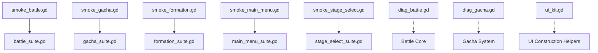
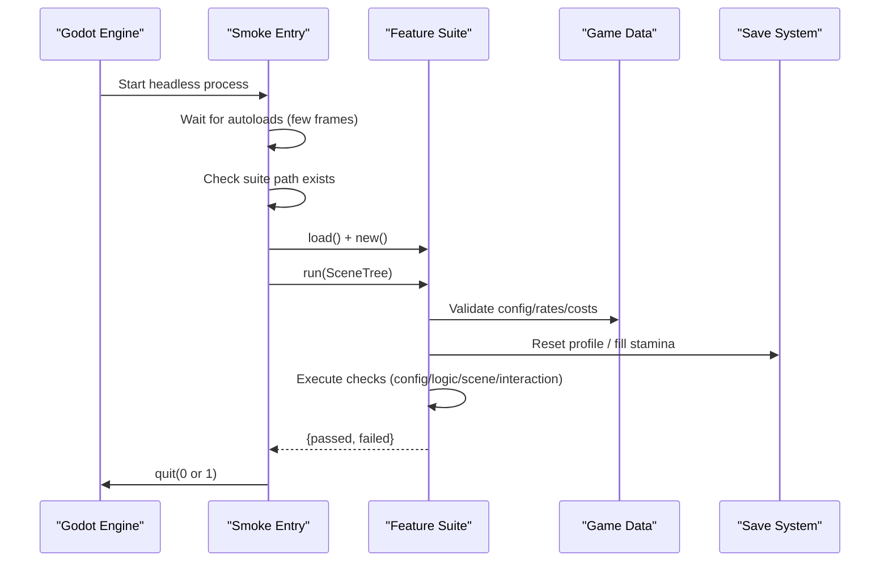
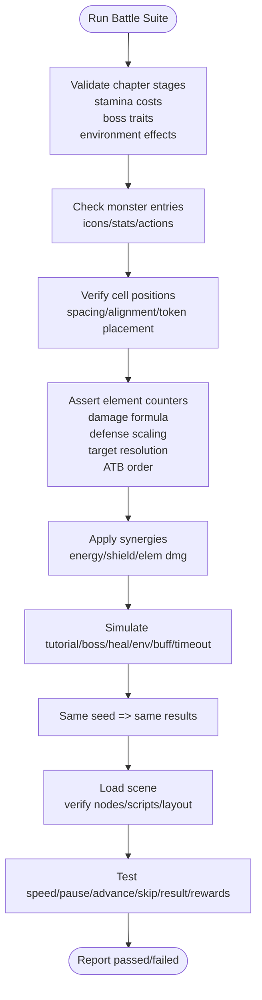
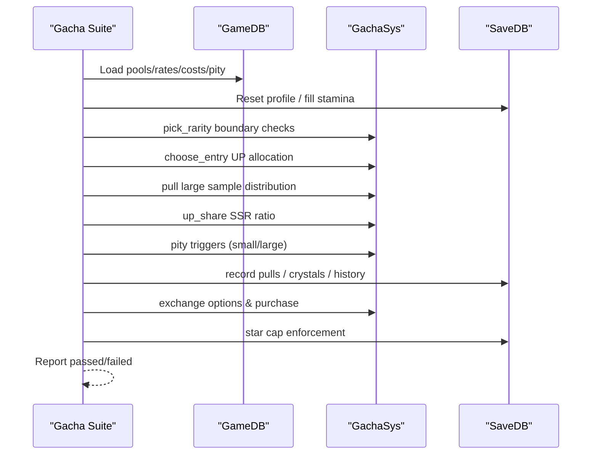
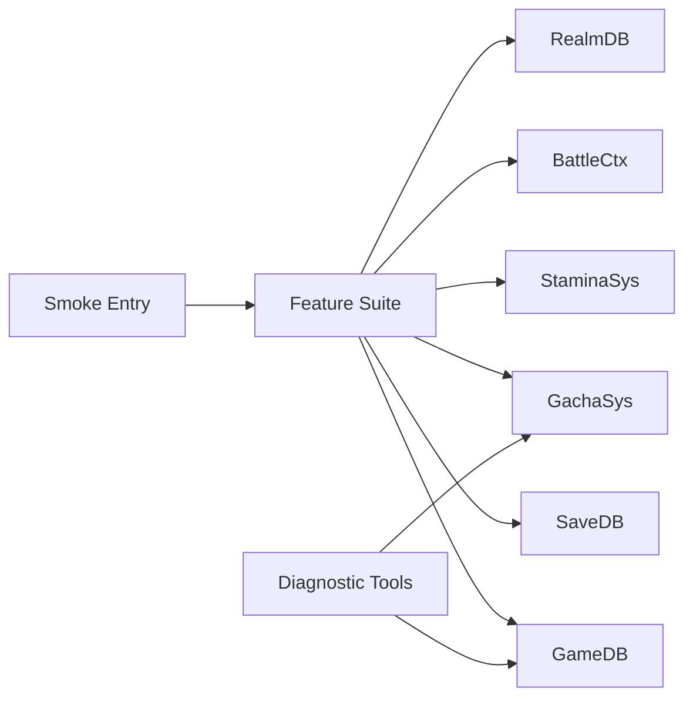

# Testing & Quality Assurance

<cite>
**Referenced Files in This Document**
- [smoke_battle.gd](file://tools/smoke_battle.gd)
- [smoke_gacha.gd](file://tools/smoke_gacha.gd)
- [smoke_formation.gd](file://tools/smoke_formation.gd)
- [smoke_main_menu.gd](file://tools/smoke_main_menu.gd)
- [smoke_stage_select.gd](file://tools/smoke_stage_select.gd)
- [battle_suite.gd](file://tools/suites/battle_suite.gd)
- [gacha_suite.gd](file://tools/suites/gacha_suite.gd)
- [formation_suite.gd](file://tools/suites/formation_suite.gd)
- [main_menu_suite.gd](file://tools/suites/main_menu_suite.gd)
- [stage_select_suite.gd](file://tools/suites/stage_select_suite.gd)
- [diag_battle.gd](file://tools/diag_battle.gd)
- [diag_gacha.gd](file://tools/diag_gacha.gd)
- [ui_kit.gd](file://tools/ui_kit.gd)
</cite>

## Table of Contents
1. [Introduction](#introduction)
2. [Project Structure](#project-structure)
3. [Core Components](#core-components)
4. [Architecture Overview](#architecture-overview)
5. [Detailed Component Analysis](#detailed-component-analysis)
6. [Dependency Analysis](#dependency-analysis)
7. [Performance Considerations](#performance-considerations)
8. [Troubleshooting Guide](#troubleshooting-guide)
9. [Conclusion](#conclusion)
10. [Appendices](#appendices)

## Introduction
This document explains the testing framework and quality assurance processes for the card game project. It focuses on:
- Smoke testing suites that validate core gameplay across scenarios (battle, gacha, formation, main menu, stage selection).
- Unit-testing style assertions embedded in smoke suites for battle math, gacha probabilities, growth calculations, and UI behavior.
- Visual regression checks for UI components and asset validation.
- Automated workflows using headless execution to run tests and return exit codes.
- Debugging utilities and diagnostics for development.
- Guidance for performance validation, memory leak detection, and cross-platform compatibility testing.

## Project Structure
The testing system is organized into two layers:
- Entry points: Headless scripts that bootstrap the engine, wait for autoloads, then dynamically load a suite and run it.
- Suites: Feature-focused test modules that assert configuration, logic, scene structure, interactions, and data persistence.

**Diagram sources**
- [smoke_battle.gd:10-31](file://tools/smoke_battle.gd#L10-L31)
- [smoke_gacha.gd:10-31](file://tools/smoke_gacha.gd#L10-L31)
- [smoke_formation.gd:10-31](file://tools/smoke_formation.gd#L10-L31)
- [smoke_main_menu.gd:10-31](file://tools/smoke_main_menu.gd#L10-L31)
- [smoke_stage_select.gd:10-31](file://tools/smoke_stage_select.gd#L10-L31)

**Section sources**
- [smoke_battle.gd:1-33](file://tools/smoke_battle.gd#L1-L33)
- [smoke_gacha.gd:1-33](file://tools/smoke_gacha.gd#L1-L33)
- [smoke_formation.gd:1-33](file://tools/smoke_formation.gd#L1-L33)
- [smoke_main_menu.gd:1-33](file://tools/smoke_main_menu.gd#L1-L33)
- [smoke_stage_select.gd:1-33](file://tools/smoke_stage_select.gd#L1-L33)

## Core Components
- Smoke entry points: Minimal scripts that wait for the engine loop, check suite availability, load the suite, execute it, and quit with an appropriate exit code.
- Suites: Feature-specific modules that perform layered checks:
  - Configuration layer: Validate game data tables, rates, costs, and constants.
  - Logic layer: Assert deterministic outcomes, probability distributions, synergy effects, and combat math.
  - Scene layer: Verify scene skeleton, node names, script attachment, and layout correctness.
  - Interaction layer: Simulate user actions (button presses), verify state changes, and confirm persistence.
- Diagnostics: Standalone headless tools to print logs, distributions, and key events without asserting.

Key assertion patterns used across suites:
- Equality checks: Compare actual vs expected values with detailed messages.
- Approximate equality: Tolerances for floating-point comparisons.
- Existence checks: Ensure nodes, resources, and fields exist.
- Distribution checks: Large-sample statistical bounds for random systems.
- Determinism checks: Same seed yields identical sequences.

**Section sources**
- [battle_suite.gd:30-58](file://tools/suites/battle_suite.gd#L30-L58)
- [gacha_suite.gd:21-40](file://tools/suites/gacha_suite.gd#L21-L40)
- [formation_suite.gd:38-68](file://tools/suites/formation_suite.gd#L38-L68)
- [main_menu_suite.gd:19-34](file://tools/suites/main_menu_suite.gd#L19-L34)
- [stage_select_suite.gd:27-47](file://tools/suites/stage_select_suite.gd#L27-L47)

## Architecture Overview
Each smoke entry point follows the same pattern:
1. Wait a few frames until autoloads are ready.
2. Check if the suite file exists.
3. Dynamically load and instantiate the suite.
4. Call its run method with the current SceneTree.
5. Quit with exit code 0 if no failures, else non-zero.

**Diagram sources**
- [smoke_battle.gd:16-31](file://tools/smoke_battle.gd#L16-L31)
- [smoke_gacha.gd:16-31](file://tools/smoke_gacha.gd#L16-L31)
- [smoke_formation.gd:16-31](file://tools/smoke_formation.gd#L16-L31)
- [smoke_main_menu.gd:16-31](file://tools/smoke_main_menu.gd#L16-L31)
- [smoke_stage_select.gd:16-31](file://tools/smoke_stage_select.gd#L16-L31)

## Detailed Component Analysis

### Battle Smoke Suite
Covers:
- Configuration: Chapter stages count, titles, mechanics, themes, backgrounds, stamina costs, boss traits, environment effects.
- Monster table: Count, icons, stats, actions.
- Geometry: Cell positions within screen rect, spacing, row alignment, token placement.
- Combat math: Element counters, damage multipliers, shield behavior, defense scaling, target resolution, ATB order.
- Synergy opening effects: Energy, shields, element damage bonuses applied at start.
- Flow: Tutorial win, boss features, healing, environment effects, external buffs, timeout handling.
- Determinism: Same seed produces identical action counts, winners, damage series, and log sizes.
- Scene: Load scene, attach script, verify unique node names, unit/plate counts, anchor alignment, boss visuals, HUD text, log box, order layer, info panel.
- Interaction: Speed cycling, pause/resume, advancing turns, health bar sync, unit detail panel, skip to end, result panel, rewards accounting, star rating persistence, retreat button.

Example assertions:
- Exact equality for stage IDs, stamina costs, and counts.
- Floating-point tolerance for ratios and percentages.
- Existence checks for nodes and resources.
- Statistical sampling for damage reduction and buff amplification.

**Diagram sources**
- [battle_suite.gd:30-58](file://tools/suites/battle_suite.gd#L30-L58)
- [battle_suite.gd:96-183](file://tools/suites/battle_suite.gd#L96-L183)
- [battle_suite.gd:228-276](file://tools/suites/battle_suite.gd#L228-L276)
- [battle_suite.gd:280-355](file://tools/suites/battle_suite.gd#L280-L355)
- [battle_suite.gd:374-443](file://tools/suites/battle_suite.gd#L374-L443)
- [battle_suite.gd:447-523](file://tools/suites/battle_suite.gd#L447-L523)
- [battle_suite.gd:535-563](file://tools/suites/battle_suite.gd#L535-L563)
- [battle_suite.gd:568-770](file://tools/suites/battle_suite.gd#L568-L770)

**Section sources**
- [battle_suite.gd:30-58](file://tools/suites/battle_suite.gd#L30-L58)
- [battle_suite.gd:96-183](file://tools/suites/battle_suite.gd#L96-L183)
- [battle_suite.gd:228-276](file://tools/suites/battle_suite.gd#L228-L276)
- [battle_suite.gd:280-355](file://tools/suites/battle_suite.gd#L280-L355)
- [battle_suite.gd:374-443](file://tools/suites/battle_suite.gd#L374-L443)
- [battle_suite.gd:447-523](file://tools/suites/battle_suite.gd#L447-L523)
- [battle_suite.gd:535-563](file://tools/suites/battle_suite.gd#L535-L563)
- [battle_suite.gd:568-770](file://tools/suites/battle_suite.gd#L568-L770)

### Gacha Smoke Suite
Covers:
- Configuration: Pool list, rates normalization, costs (tickets/gems), pity scales, crystal currency, rate notice, reveal hooks.
- Pure rules: Boundary conditions for rarity picks, pity re-normalization, UP allocation, weighted selection, degradation when only UP exists.
- Distribution: Large-sample verification against declared probabilities.
- UP share: SSR pool UP ratio and presence of all candidates.
- Pity: Small/large pity triggers, priority when both reach thresholds, group-based persistence, cross-period inheritance.
- Real pulls: Payment fallback, resource exhaustion handling, history limits, recent heroes.
- Exchange: Currency checks, success/failure branches, item granting, upgrade behavior.
- Star cap: Duplicate cards stop at rarity-defined maximum stars.
- Scene: Tabs, buttons, panels visibility, pull flow, cost refresh, toast messages.

Example assertions:
- Exact boundaries for roll intervals.
- Near-equality for distribution percentages within tolerances.
- State transitions for pity counters and exchange balances.

**Diagram sources**
- [gacha_suite.gd:63-136](file://tools/suites/gacha_suite.gd#L63-L136)
- [gacha_suite.gd:145-208](file://tools/suites/gacha_suite.gd#L145-L208)
- [gacha_suite.gd:212-273](file://tools/suites/gacha_suite.gd#L212-L273)
- [gacha_suite.gd:277-337](file://tools/suites/gacha_suite.gd#L277-L337)
- [gacha_suite.gd:341-404](file://tools/suites/gacha_suite.gd#L341-L404)
- [gacha_suite.gd:408-457](file://tools/suites/gacha_suite.gd#L408-L457)
- [gacha_suite.gd:461-475](file://tools/suites/gacha_suite.gd#L461-L475)
- [gacha_suite.gd:479-647](file://tools/suites/gacha_suite.gd#L479-L647)

**Section sources**
- [gacha_suite.gd:63-136](file://tools/suites/gacha_suite.gd#L63-L136)
- [gacha_suite.gd:145-208](file://tools/suites/gacha_suite.gd#L145-L208)
- [gacha_suite.gd:212-273](file://tools/suites/gacha_suite.gd#L212-L273)
- [gacha_suite.gd:277-337](file://tools/suites/gacha_suite.gd#L277-L337)
- [gacha_suite.gd:341-404](file://tools/suites/gacha_suite.gd#L341-L404)
- [gacha_suite.gd:408-457](file://tools/suites/gacha_suite.gd#L408-L457)
- [gacha_suite.gd:461-475](file://tools/suites/gacha_suite.gd#L461-L475)
- [gacha_suite.gd:479-647](file://tools/suites/gacha_suite.gd#L479-L647)

### Formation Smoke Suite
Covers:
- Configuration: Team max, board slots, stamina spend location, presets, role chain, synergies, counters, role texts, scene paths.
- Normalization: Duplicate hero removal, out-of-range slot filtering, slot conflicts, unknown hero rejection, size caps.
- Synergies: Base vs total power, active synergies, stat application, open effects (energy/shield/elem dmg), schema equivalence.
- Counters: Role and element hints based on enemy composition.
- Scene skeleton: Script attachment, unique node names, background texture, default selection.
- Fan display: Card count, selected highlight, click switching, tactic panel updates.
- Board layout: 3x3 grid, slot-to-cell mapping, front/back ordering, preset population.
- Library: Thumbnail count, labels, deployed markers, selection behavior.
- Filter/sort/search: Element/role filters, sort by power/name, search keywords, empty states, modal toggles.
- Team ops: Clear/deploy/remove, duplicate prevention, conflict handling, preferred rows.
- Quick fill: Heuristic placement respecting roles and preferences.
- Presets: Switching between main/PVP/dungeon, saving/restoring teams.
- Confirm flow: Validation, stamina deduction, persistence, handoff to battle context.

Example assertions:
- Exact matches for team sizes, slot assignments, and preset counts.
- Stat deltas confirming synergy effects.
- Node existence and label content checks.

**Section sources**
- [formation_suite.gd:110-139](file://tools/suites/formation_suite.gd#L110-L139)
- [formation_suite.gd:143-188](file://tools/suites/formation_suite.gd#L143-L188)
- [formation_suite.gd:192-226](file://tools/suites/formation_suite.gd#L192-L226)
- [formation_suite.gd:232-300](file://tools/suites/formation_suite.gd#L232-L300)
- [formation_suite.gd:304-324](file://tools/suites/formation_suite.gd#L304-L324)
- [formation_suite.gd:328-362](file://tools/suites/formation_suite.gd#L328-L362)
- [formation_suite.gd:366-401](file://tools/suites/formation_suite.gd#L366-L401)
- [formation_suite.gd:405-447](file://tools/suites/formation_suite.gd#L405-L447)
- [formation_suite.gd:451-490](file://tools/suites/formation_suite.gd#L451-L490)
- [formation_suite.gd:494-579](file://tools/suites/formation_suite.gd#L494-L579)
- [formation_suite.gd:583-637](file://tools/suites/formation_suite.gd#L583-L637)
- [formation_suite.gd:641-676](file://tools/suites/formation_suite.gd#L641-L676)
- [formation_suite.gd:680-720](file://tools/suites/formation_suite.gd#L680-L720)
- [formation_suite.gd:724-785](file://tools/suites/formation_suite.gd#L724-L785)

### Main Menu Smoke Suite
Covers:
- Configuration: Version, character counts, classes, elements, rarities, field completeness, element cycle, damage multipliers, crit bonuses, frame geometry.
- Board: Slot-to-row mapping and player/enemy coordinates.
- Save: Player profile defaults, card granting, equipment slots, star defaults, duplicate upgrades, currency spending.
- Realm: Star multipliers, showcase lineup stats, demo card shape parity with save cards.
- Stamina: Max, regen interval, per-hour recovery, spend/grant, countdown formatting.
- Scene: Card fan layout, rotation, width sanity, occlusion checks, stat rows inside inner rects, right rail entries, tooltips, route targets, transition behavior.

Visual regression highlights:
- Stat rows must fit within inner rectangles.
- No protected information blocks occluded by adjacent cards beyond tolerance.
- Right rail entries must link to valid scenes and not trigger placeholder messages.

**Section sources**
- [main_menu_suite.gd:52-98](file://tools/suites/main_menu_suite.gd#L52-L98)
- [main_menu_suite.gd:100-113](file://tools/suites/main_menu_suite.gd#L100-L113)
- [main_menu_suite.gd:117-158](file://tools/suites/main_menu_suite.gd#L117-L158)
- [main_menu_suite.gd:162-193](file://tools/suites/main_menu_suite.gd#L162-L193)
- [main_menu_suite.gd:197-211](file://tools/suites/main_menu_suite.gd#L197-L211)
- [main_menu_suite.gd:219-260](file://tools/suites/main_menu_suite.gd#L219-L260)
- [main_menu_suite.gd:277-328](file://tools/suites/main_menu_suite.gd#L277-L328)
- [main_menu_suite.gd:390-448](file://tools/suites/main_menu_suite.gd#L390-L448)
- [main_menu_suite.gd:462-613](file://tools/suites/main_menu_suite.gd#L462-L613)

### Stage Select Smoke Suite
Covers:
- Scene skeleton: Script attachment, unique node names.
- Background: Correct texture, resolution, stretch mode.
- Map nodes: Instance count, anchor alignment, viewport bounds, pivot placement, optional icons, label positioning, z-order, overlap avoidance.
- Guides: Line2D endpoints computed from radii, visible segment lengths.
- Labels/stars: Name/level ordering, star counts, tags.
- Stats sync: Footer info, best stars vs demo stars, tooltip contents.
- Selection: Default highlight, switching behavior.
- Team/buttons: Slots, labels, enter/back buttons, routes.
- Interaction: Route to formation, stamina spend policy, free stage handling, stamina insufficient blocking.

**Section sources**
- [stage_select_suite.gd:85-108](file://tools/suites/stage_select_suite.gd#L85-L108)
- [stage_select_suite.gd:114-131](file://tools/suites/stage_select_suite.gd#L114-L131)
- [stage_select_suite.gd:135-211](file://tools/suites/stage_select_suite.gd#L135-L211)
- [stage_select_suite.gd:215-263](file://tools/suites/stage_select_suite.gd#L215-L263)
- [stage_select_suite.gd:267-286](file://tools/suites/stage_select_suite.gd#L267-L286)
- [stage_select_suite.gd:292-316](file://tools/suites/stage_select_suite.gd#L292-L316)
- [stage_select_suite.gd:320-350](file://tools/suites/stage_select_suite.gd#L320-L350)
- [stage_select_suite.gd:354-373](file://tools/suites/stage_select_suite.gd#L354-L373)
- [stage_select_suite.gd:377-439](file://tools/suites/stage_select_suite.gd#L377-L439)

## Dependency Analysis
- Smoke entries depend on Godot’s SceneTree lifecycle and ResourceLoader to locate suites.
- Suites depend on autoloaded systems:
  - GameDB for configuration and derived data.
  - SaveDB for persistence and state management.
  - StaminaSys for stamina operations.
  - BattleCtx for stage handoff.
  - GachaSys for draw/exchange operations.
  - RealmDB for synergy and power calculations.
- Diagnostics depend on autoloads to access live systems without assertions.

**Diagram sources**
- [smoke_battle.gd:16-31](file://tools/smoke_battle.gd#L16-L31)
- [smoke_gacha.gd:16-31](file://tools/smoke_gacha.gd#L16-L31)
- [smoke_formation.gd:16-31](file://tools/smoke_formation.gd#L16-L31)
- [smoke_main_menu.gd:16-31](file://tools/smoke_main_menu.gd#L16-L31)
- [smoke_stage_select.gd:16-31](file://tools/smoke_stage_select.gd#L16-L31)
- [diag_battle.gd:18-44](file://tools/diag_battle.gd#L18-L44)
- [diag_gacha.gd:16-30](file://tools/diag_gacha.gd#L16-L30)

**Section sources**
- [battle_suite.gd:30-58](file://tools/suites/battle_suite.gd#L30-L58)
- [gacha_suite.gd:21-40](file://tools/suites/gacha_suite.gd#L21-L40)
- [formation_suite.gd:38-68](file://tools/suites/formation_suite.gd#L38-L68)
- [main_menu_suite.gd:19-34](file://tools/suites/main_menu_suite.gd#L19-L34)
- [stage_select_suite.gd:27-47](file://tools/suites/stage_select_suite.gd#L27-L47)
- [diag_battle.gd:18-44](file://tools/diag_battle.gd#L18-L44)
- [diag_gacha.gd:16-30](file://tools/diag_gacha.gd#L16-L30)

## Performance Considerations
- Deterministic seeds ensure reproducible runs; use fixed seeds for stable performance baselines.
- Large-sample checks (e.g., gacha distribution) should be bounded to reasonable iterations to keep CI times manageable.
- Avoid heavy UI instantiation in headless runs; suites often disable animations and rely on static states where possible.
- Use diagnostics to quickly inspect hot paths without full scene overhead.

[No sources needed since this section provides general guidance]

## Troubleshooting Guide
- Exit codes: Smoke entries quit with 0 on success and non-zero on failure; integrate with CI pipelines accordingly.
- Missing suites: If suite path does not exist, smoke entries push an error and quit; verify resource paths.
- Autoload readiness: Smoke entries wait several frames before loading suites to ensure autoloads are available.
- Diagnostics:
  - Battle diagnostic prints key events, winner, end reason, action count, HP ratios, and per-unit stats.
  - Gacha diagnostic prints random samples, UP lists, choose_entry distributions, and pull distributions.

**Section sources**
- [smoke_battle.gd:24-31](file://tools/smoke_battle.gd#L24-L31)
- [smoke_gacha.gd:24-31](file://tools/smoke_gacha.gd#L24-L31)
- [smoke_formation.gd:24-31](file://tools/smoke_formation.gd#L24-L31)
- [smoke_main_menu.gd:24-31](file://tools/smoke_main_menu.gd#L24-L31)
- [smoke_stage_select.gd:24-31](file://tools/smoke_stage_select.gd#L24-L31)
- [diag_battle.gd:18-44](file://tools/diag_battle.gd#L18-L44)
- [diag_battle.gd:62-105](file://tools/diag_battle.gd#L62-L105)
- [diag_gacha.gd:16-30](file://tools/diag_gacha.gd#L16-L30)
- [diag_gacha.gd:58-83](file://tools/diag_gacha.gd#L58-L83)

## Conclusion
The project employs a robust, layered smoke testing strategy that validates configuration, logic, scene integrity, and user interactions across core systems. Assertions are precise, deterministic, and backed by large-sample statistics where randomness is involved. Diagnostics complement suites by providing readable outputs for balance tuning and debugging. The headless workflow enables automated integration into CI pipelines for continuous quality assurance.

[No sources needed since this section summarizes without analyzing specific files]

## Appendices

### Automated Testing Workflows
- Run individual smoke suites headlessly:
  - Example: `Godot --headless --path <project> --script res://tools/smoke_battle.gd`
  - Example: `Godot --headless --path <project> --script res://tools/smoke_gacha.gd`
  - Example: `Godot --headless --path <project> --script res://tools/smoke_formation.gd`
  - Example: `Godot --headless --path <project> --script res://tools/smoke_main_menu.gd`
  - Example: `Godot --headless --path <project> --script res://tools/smoke_stage_select.gd`
- Integrate with CI:
  - Execute each smoke suite and capture exit codes.
  - Fail the pipeline if any suite returns non-zero.
  - Collect logs for diagnostics when failures occur.

[No sources needed since this section provides general guidance]

### Visual Regression and Asset Validation
- Main menu suite verifies:
  - Stat rows fit within inner rectangles.
  - Protected information blocks are not occluded beyond tolerance.
  - Right rail entries link to valid scenes and do not show placeholder messages.
- Stage select suite verifies:
  - Background texture and resolution match expectations.
  - Map nodes align to configured anchors and remain within viewport bounds.
  - Labels and stars reflect correct ordering and counts.

**Section sources**
- [main_menu_suite.gd:219-260](file://tools/suites/main_menu_suite.gd#L219-L260)
- [main_menu_suite.gd:277-328](file://tools/suites/main_menu_suite.gd#L277-L328)
- [main_menu_suite.gd:390-448](file://tools/suites/main_menu_suite.gd#L390-L448)
- [stage_select_suite.gd:114-131](file://tools/suites/stage_select_suite.gd#L114-L131)
- [stage_select_suite.gd:135-211](file://tools/suites/stage_select_suite.gd#L135-L211)
- [stage_select_suite.gd:267-286](file://tools/suites/stage_select_suite.gd#L267-L286)

### Cross-Platform Compatibility Notes
- Headless execution avoids platform-specific UI concerns; suites focus on logic and scene structure.
- Tests rely on absolute coordinates and textures; ensure consistent resolutions and assets across platforms.
- Use diagnostics to compare outputs across builds and platforms.

[No sources needed since this section provides general guidance]

### Memory Leak Detection
- Suites reset profiles and restore saves to avoid state leakage between runs.
- For deeper memory analysis:
  - Run suites under platform debug builds with memory profiling enabled.
  - Inspect node trees after scene teardown to detect lingering references.
  - Use diagnostics to minimize runtime overhead during profiling.

[No sources needed since this section provides general guidance]

### Debugging Utilities
- Battle diagnostic: Prints key events, winner, end reason, action count, HP ratios, and per-unit stats for multiple stages.
- Gacha diagnostic: Prints random samples, UP lists, choose_entry distributions, and pull distributions for analysis.

**Section sources**
- [diag_battle.gd:18-44](file://tools/diag_battle.gd#L18-L44)
- [diag_battle.gd:62-105](file://tools/diag_battle.gd#L62-L105)
- [diag_gacha.gd:16-30](file://tools/diag_gacha.gd#L16-L30)
- [diag_gacha.gd:58-83](file://tools/diag_gacha.gd#L58-L83)