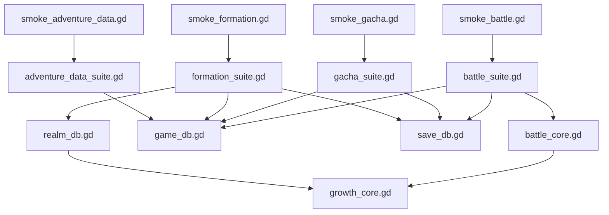
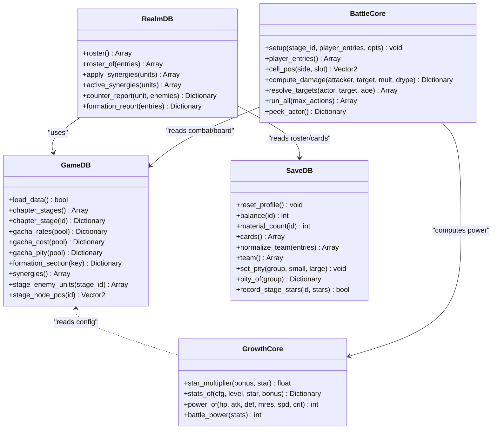
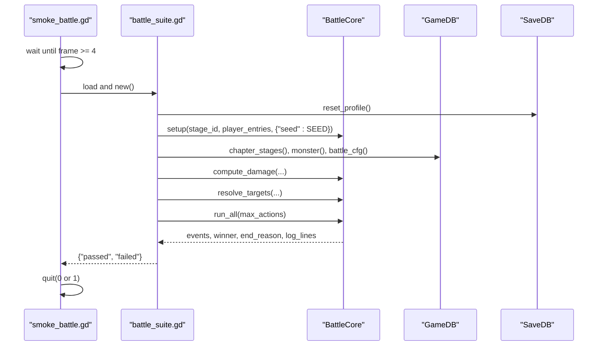
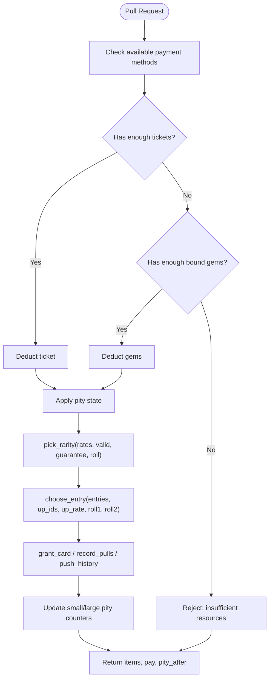
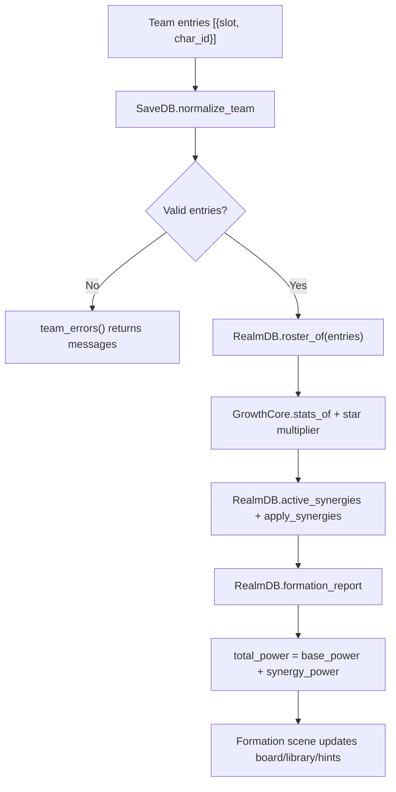
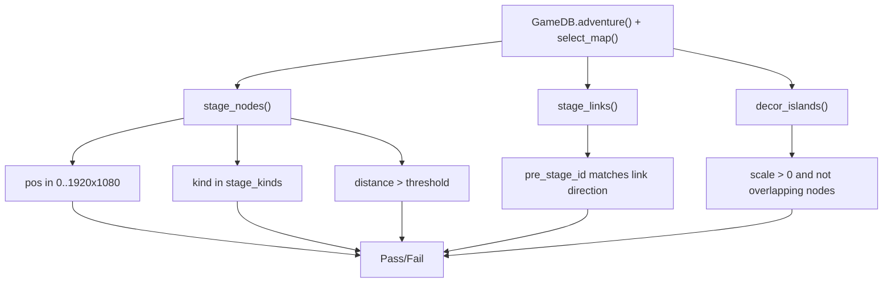
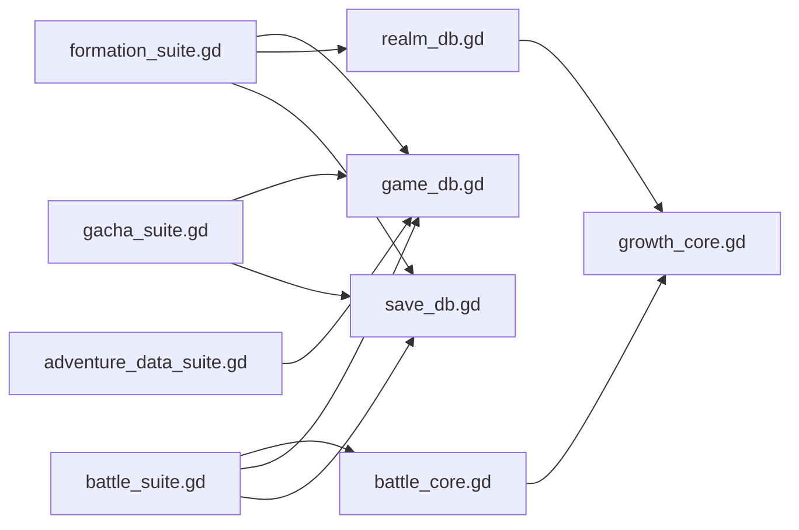

# Unit Testing Framework

<cite>
**Referenced Files in This Document**   
- [smoke_battle.gd](file://tools/smoke_battle.gd)
- [smoke_gacha.gd](file://tools/smoke_gacha.gd)
- [smoke_formation.gd](file://tools/smoke_formation.gd)
- [smoke_adventure_data.gd](file://tools/smoke_adventure_data.gd)
- [battle_suite.gd](file://tools/suites/battle_suite.gd)
- [gacha_suite.gd](file://tools/suites/gacha_suite.gd)
- [formation_suite.gd](file://tools/suites/formation_suite.gd)
- [adventure_data_suite.gd](file://tools/suites/adventure_data_suite.gd)
- [battle_core.gd](file://scripts/battle_core.gd)
- [growth_core.gd](file://scripts/growth_core.gd)
- [game_db.gd](file://scripts/game_db.gd)
- [realm_db.gd](file://scripts/realm_db.gd)
- [save_db.gd](file://scripts/save_db.gd)
</cite>

## Table of Contents
1. [Introduction](#introduction)
2. [Project Structure](#project-structure)
3. [Core Components](#core-components)
4. [Architecture Overview](#architecture-overview)
5. [Detailed Component Analysis](#detailed-component-analysis)
6. [Dependency Analysis](#dependency-analysis)
7. [Performance Considerations](#performance-considerations)
8. [Troubleshooting Guide](#troubleshooting-guide)
9. [Conclusion](#conclusion)
10. [Appendices](#appendices)

## Introduction
This document explains the unit testing framework used to validate isolated game systems: battle calculations, gacha probability and state, formation logic, and adventure map data integrity. The project uses a smoke-test style approach rather than a third-party test runner: each system has a headless entry script that waits for the main loop, dynamically loads a suite script, runs assertions, prints pass/fail counts, and exits with a non-zero status when failures occur.

The suites cover:
- Battle: configuration consistency, battlefield geometry, combat math, synergy effects, full battle flow, determinism, scene skeleton, interaction, and settlement sync.
- Gacha: pool/rate/pity/cost configuration, pure probability rules, statistical distribution, pity timing, payment fallback, exchange shop, star cap, history, and UI scene behavior.
- Formation: team normalization, synergy evaluation, counter hints, scene skeleton, card fan, 3x3 board layout, library, filter/sort/search, deploy/remove, quick fill, presets, and confirm-to-battle flow.
- Adventure data: section fields, team panel, node coordinates, links, decorative islands, and accessor correctness.

The framework is intentionally lightweight: it does not use an external assertion library. Each suite defines its own `_ok` and `_eq` helpers, which increment counters and print `[PASS]` / `[FAIL]` lines. External dependencies are handled by resetting or backing up persistent state before tests run.

## Project Structure
The testing layer sits under `tools/`:
- `smoke_*.gd` scripts are headless entry points invoked via Godot’s `--script` mode. They wait a few frames so autoloads and resources are ready, then load the corresponding suite.
- `suites/*.gd` scripts contain the actual test cases.
- `scripts/*.gd` contains the production code being tested: configuration access (`GameDB`), runtime derivation (`RealmDB`, `SaveDB`), growth formulas (`GrowthCore`), and battle simulation (`BattleCore`).

**Diagram sources**
- [smoke_battle.gd:10-31](file://tools/smoke_battle.gd#L10-L31)
- [smoke_gacha.gd:10-31](file://tools/smoke_gacha.gd#L10-L31)
- [smoke_formation.gd:10-31](file://tools/smoke_formation.gd#L10-L31)
- [smoke_adventure_data.gd:10-31](file://tools/smoke_adventure_data.gd#L10-L31)
- [battle_suite.gd:18-58](file://tools/suites/battle_suite.gd#L18-L58)
- [gacha_suite.gd:21-40](file://tools/suites/gacha_suite.gd#L21-L40)
- [formation_suite.gd:38-68](file://tools/suites/formation_suite.gd#L38-L68)
- [adventure_data_suite.gd:16-27](file://tools/suites/adventure_data_suite.gd#L16-L27)

**Section sources**
- [smoke_battle.gd:1-33](file://tools/smoke_battle.gd#L1-L33)
- [smoke_gacha.gd:1-33](file://tools/smoke_gacha.gd#L1-L33)
- [smoke_formation.gd:1-33](file://tools/smoke_formation.gd#L1-L33)
- [smoke_adventure_data.gd:1-33](file://tools/smoke_adventure_data.gd#L1-L33)

## Core Components
The testing framework is built around four layers:

1. **Headless entry scripts**: `smoke_battle.gd`, `smoke_gacha.gd`, `smoke_formation.gd`, `smoke_adventure_data.gd`. Each extends `SceneTree`, waits until frame 4, checks that the suite file exists, loads it, calls `run(SceneTree)`, and quits with exit code 0 on success or 1 on failure.
2. **Suite scripts**: `battle_suite.gd`, `gacha_suite.gd`, `formation_suite.gd`, `adventure_data_suite.gd`. Each extends `RefCounted`, exposes a `run(tree)` method, and organizes tests into named sections like `_check_config`, `_check_combat_math`, `_check_pure_rules`, etc.
3. **Assertion helpers**: `_ok(label, cond, detail)` and `_eq(label, got, want)` are defined locally in each suite. They update `passed` / `failed` counters and print structured logs.
4. **Production targets**: `GameDB`, `RealmDB`, `SaveDB`, `GrowthCore`, and `BattleCore`. Suites call these modules directly; they do not mock them, but they isolate behavior by resetting save state, using fixed seeds, and avoiding UI side effects where possible.

Key design patterns:
- Deterministic randomness: suites set explicit RNG seeds for battle and gacha sampling so results can be compared across runs.
- State isolation: suites reset profiles, refill stamina, and back up/restore `user://save.json` before and after tests.
- Configuration-driven validation: many assertions read from `GameDB` to ensure JSON config and runtime behavior stay consistent.
- Scene-level smoke tests: some suites instantiate scenes and assert node structure, text, and button signals, but keep animation off where possible.

**Section sources**
- [smoke_battle.gd:16-31](file://tools/smoke_battle.gd#L16-L31)
- [smoke_gacha.gd:16-31](file://tools/smoke_gacha.gd#L16-L31)
- [smoke_formation.gd:16-31](file://tools/smoke_formation.gd#L16-L31)
- [smoke_adventure_data.gd:16-31](file://tools/smoke_adventure_data.gd#L16-L31)
- [battle_suite.gd:15-58](file://tools/suites/battle_suite.gd#L15-L58)
- [gacha_suite.gd:14-58](file://tools/suites/gacha_suite.gd#L14-L58)
- [formation_suite.gd:15-105](file://tools/suites/formation_suite.gd#L15-L105)
- [adventure_data_suite.gd:8-40](file://tools/suites/adventure_data_suite.gd#L8-L40)

## Architecture Overview
At runtime, the suites exercise a layered architecture:

- `GameDB` reads `res://data/game_data.json` and provides typed accessors for characters, elements, rarities, gacha pools, battle config, formation rules, and adventure map data.
- `GrowthCore` holds pure functions for stat scaling, star multipliers, and power calculation.
- `RealmDB` derives final stats, synergies, counters, and roster entries from `GameDB` and `SaveDB`.
- `SaveDB` persists player profile, cards, team, presets, progress, gacha state, and statistics.
- `BattleCore` simulates ATB-based battles, resolves targets, computes damage, applies traits/environment/synergy open effects, and emits events.

**Diagram sources**
- [game_db.gd:17-37](file://scripts/game_db.gd#L17-L37)
- [game_db.gd:328-344](file://scripts/game_db.gd#L328-L344)
- [game_db.gd:409-442](file://scripts/game_db.gd#L409-L442)
- [game_db.gd:474-490](file://scripts/game_db.gd#L474-L490)
- [game_db.gd:748-784](file://scripts/game_db.gd#L748-L784)
- [game_db.gd:575-604](file://scripts/game_db.gd#L575-L604)
- [growth_core.gd:18-52](file://scripts/growth_core.gd#L18-L52)
- [realm_db.gd:13-70](file://scripts/realm_db.gd#L13-L70)
- [realm_db.gd:86-178](file://scripts/realm_db.gd#L86-L178)
- [realm_db.gd:189-243](file://scripts/realm_db.gd#L189-L243)
- [realm_db.gd:281-333](file://scripts/realm_db.gd#L281-L333)
- [realm_db.gd:340-359](file://scripts/realm_db.gd#L340-L359)
- [save_db.gd:179-181](file://scripts/save_db.gd#L179-L181)
- [save_db.gd:294-316](file://scripts/save_db.gd#L294-L316)
- [save_db.gd:425-437](file://scripts/save_db.gd#L425-L437)
- [save_db.gd:547-550](file://scripts/save_db.gd#L547-L550)
- [battle_core.gd:44-66](file://scripts/battle_core.gd#L44-L66)
- [battle_core.gd:75-103](file://scripts/battle_core.gd#L75-L103)
- [battle_core.gd:344-357](file://scripts/battle_core.gd#L344-L357)
- [battle_core.gd:672-710](file://scripts/battle_core.gd#L672-L710)
- [battle_core.gd:580-611](file://scripts/battle_core.gd#L580-L611)
- [battle_core.gd:418-425](file://scripts/battle_core.gd#L418-L425)
- [battle_core.gd:373-380](file://scripts/battle_core.gd#L373-L380)

## Detailed Component Analysis

### Battle Calculation Validation
The battle suite validates four layers:
- Configuration: chapter stage count, IDs, stamina costs, enemy composition, boss traits, environment effects, and self-consistency between recommended power and computed enemy power.
- Geometry: all 18 cells fall inside the configured screen rectangle, rows are ordered correctly, and spacing matches `row_step`.
- Combat math: element counters, shield and physical reduction, defense mitigation, target selection, ATB order, synergy open effects, healing, stun, environment buff, external attack bonus, timeout handling, and determinism.
- Scene and interaction: scene skeleton, unit/plate nodes, health bars, speed/pause/skip buttons, result panel, reward accounting, star rating persistence, and retreat.

**Diagram sources**
- [smoke_battle.gd:16-31](file://tools/smoke_battle.gd#L16-L31)
- [battle_suite.gd:30-58](file://tools/suites/battle_suite.gd#L30-L58)
- [battle_core.gd:44-66](file://scripts/battle_core.gd#L44-L66)
- [battle_core.gd:418-425](file://scripts/battle_core.gd#L418-L425)
- [battle_core.gd:672-710](file://scripts/battle_core.gd#L672-L710)
- [battle_core.gd:580-611](file://scripts/battle_core.gd#L580-L611)
- [game_db.gd:658-691](file://scripts/game_db.gd#L658-L691)
- [save_db.gd:179-181](file://scripts/save_db.gd#L179-L181)

Key implementation notes:
- Determinism is enforced by passing explicit seeds to `BattleCore.setup`; the suite compares action counts, winners, damage series, and log line counts across runs.
- Damage sampling uses repeated calls to `compute_damage` and averages ratios to tolerate random crit/variance while still asserting expected trends like physical armor reducing damage.
- Environment effects and external buffs are validated by comparing baseline vs buffed outcomes.

**Section sources**
- [battle_suite.gd:96-193](file://tools/suites/battle_suite.gd#L96-L193)
- [battle_suite.gd:228-276](file://tools/suites/battle_suite.gd#L228-L276)
- [battle_suite.gd:280-355](file://tools/suites/battle_suite.gd#L280-L355)
- [battle_suite.gd:374-443](file://tools/suites/battle_suite.gd#L374-L443)
- [battle_suite.gd:447-523](file://tools/suites/battle_suite.gd#L447-L523)
- [battle_suite.gd:535-563](file://tools/suites/battle_suite.gd#L535-L563)
- [battle_core.gd:207-266](file://scripts/battle_core.gd#L207-L266)
- [battle_core.gd:441-515](file://scripts/battle_core.gd#L441-L515)
- [battle_core.gd:672-710](file://scripts/battle_core.gd#L672-L710)

### Gacha Probability and State Validation
The gacha suite covers:
- Configuration: pool list, rates, ten-guarantee rarity, cost options, pity group flags, crystal currency, reveal config, and rate notice rows.
- Pure rules: boundary values for `pick_rarity`,保底区间 re-normalization, empty bucket behavior, UP allocation, weight-based selection, and degradation when only UP entries exist.
- Distribution: 20,000 pulls in free mode without pity, checking UR/SSR/SR/R frequencies within tolerance bands.
- Pity: small pity at 50, large pity at 100, priority when both trigger, ten-guarantee behavior, and cross-period inheritance via `pity_group`.
- Payment: ticket-first fallback to bound gems, resource exhaustion rejection, guild token friend pool, and crystal accumulation.
- Exchange and star cap: wish crystal shop redemption, duplicate card star capping, and recruitment history limits.
- Scene: tab switching, pull buttons, reveal layer, rate panel, shop panel, and disabled-state handling.

**Diagram sources**
- [gacha_suite.gd:145-208](file://tools/suites/gacha_suite.gd#L145-L208)
- [gacha_suite.gd:277-336](file://tools/suites/gacha_suite.gd#L277-L336)
- [gacha_suite.gd:341-404](file://tools/suites/gacha_suite.gd#L341-L404)
- [game_db.gd:328-344](file://scripts/game_db.gd#L328-L344)
- [game_db.gd:409-442](file://scripts/game_db.gd#L409-L442)
- [game_db.gd:474-490](file://scripts/game_db.gd#L474-L490)
- [save_db.gd:547-550](file://scripts/save_db.gd#L547-L550)
- [save_db.gd:563-583](file://scripts/save_db.gd#L563-L583)

Important testing strategies:
- Pure functions are tested with exact boundary rolls instead of relying on randomness.
- Statistical tests use large sample sizes and tolerance bands rather than exact equality.
- Stateful operations reset the profile and explicitly write/read the save file to verify persistence.

**Section sources**
- [gacha_suite.gd:63-136](file://tools/suites/gacha_suite.gd#L63-L136)
- [gacha_suite.gd:145-208](file://tools/suites/gacha_suite.gd#L145-L208)
- [gacha_suite.gd:212-237](file://tools/suites/gacha_suite.gd#L212-L237)
- [gacha_suite.gd:243-272](file://tools/suites/gacha_suite.gd#L243-L272)
- [gacha_suite.gd:277-336](file://tools/suites/gacha_suite.gd#L277-L336)
- [gacha_suite.gd:341-404](file://tools/suites/gacha_suite.gd#L341-L404)
- [gacha_suite.gd:408-443](file://tools/suites/gacha_suite.gd#L408-L443)
- [gacha_suite.gd:447-474](file://tools/suites/gacha_suite.gd#L447-L474)

### Formation Logic Verification
The formation suite validates:
- Data layer: team max members, board slots, stamina spend location, presets, role chain, synergies, role counters, and battle role text.
- Normalization: duplicate hero removal, invalid slot filtering, same-slot deduplication, unknown hero rejection, and truncation to team max.
- Synergy: base vs total power, active synergies, stat application, battle-side synergy buffs, schema compatibility, and edge cases like single-unit or empty teams.
- Counter hints: element and role counter reports against staged enemies.
- UI skeleton: scene loading, script attachment, unique node names, background texture, card fan selection, board layout, library grid, filters, sorting, search, deploy/remove, quick fill, presets, and confirm-to-battle flow.

**Diagram sources**
- [formation_suite.gd:143-187](file://tools/suites/formation_suite.gd#L143-L187)
- [formation_suite.gd:192-225](file://tools/suites/formation_suite.gd#L192-L225)
- [formation_suite.gd:232-300](file://tools/suites/formation_suite.gd#L232-L300)
- [formation_suite.gd:304-323](file://tools/suites/formation_suite.gd#L304-L323)
- [realm_db.gd:34-70](file://scripts/realm_db.gd#L34-L70)
- [realm_db.gd:86-178](file://scripts/realm_db.gd#L86-L178)
- [realm_db.gd:189-243](file://scripts/realm_db.gd#L189-L243)
- [realm_db.gd:281-333](file://scripts/realm_db.gd#L281-L333)
- [realm_db.gd:340-359](file://scripts/realm_db.gd#L340-L359)
- [save_db.gd:294-316](file://scripts/save_db.gd#L294-L316)

Testing highlights:
- Board positions are asserted against `GameDB.slot_cell` and hardcoded constants, ensuring UI layout stays aligned with configuration.
- Quick fill uses heuristic placement respecting preferred rows and avoids placing ranged units in front rows.
- Confirm flow verifies stamina deduction, preset saving, team persistence, and battle context handoff.

**Section sources**
- [formation_suite.gd:110-139](file://tools/suites/formation_suite.gd#L110-L139)
- [formation_suite.gd:143-187](file://tools/suites/formation_suite.gd#L143-L187)
- [formation_suite.gd:192-300](file://tools/suites/formation_suite.gd#L192-L300)
- [formation_suite.gd:304-323](file://tools/suites/formation_suite.gd#L304-L323)
- [formation_suite.gd:328-447](file://tools/suites/formation_suite.gd#L328-L447)
- [formation_suite.gd:451-579](file://tools/suites/formation_suite.gd#L451-L579)
- [formation_suite.gd:583-675](file://tools/suites/formation_suite.gd#L583-L675)
- [formation_suite.gd:680-784](file://tools/suites/formation_suite.gd#L680-L784)

### Data Integrity Checks
The adventure data suite validates:
- Section presence and fields: adventure mode, stamina per stage, chapters, select_map title, chapter ID, coord note, team panel rows/columns/deployed, lineup references, enter button text, and promo icon.
- Node integrity: name, level, kind, screen-in bounds, z-order, label offset, radius, unique IDs, demo star display, icon presence/size, and inter-node distances.
- Link directionality: links go from pre-stage to current stage and reference existing nodes.
- Decorative islands: screen bounds, positive scale, unique IDs, and no overlap with stage nodes.
- Accessors: `stage_node_pos`, missing node fallbacks, and stage kind name mapping.

**Diagram sources**
- [adventure_data_suite.gd:56-68](file://tools/suites/adventure_data_suite.gd#L56-L68)
- [adventure_data_suite.gd:97-177](file://tools/suites/adventure_data_suite.gd#L97-L177)
- [adventure_data_suite.gd:199-210](file://tools/suites/adventure_data_suite.gd#L199-L210)
- [adventure_data_suite.gd:215-237](file://tools/suites/adventure_data_suite.gd#L215-L237)
- [adventure_data_suite.gd:241-249](file://tools/suites/adventure_data_suite.gd#L241-L249)
- [game_db.gd:565-604](file://scripts/game_db.gd#L565-L604)
- [game_db.gd:618-622](file://scripts/game_db.gd#L618-L622)

**Section sources**
- [adventure_data_suite.gd:56-93](file://tools/suites/adventure_data_suite.gd#L56-L93)
- [adventure_data_suite.gd:97-177](file://tools/suites/adventure_data_suite.gd#L97-L177)
- [adventure_data_suite.gd:199-210](file://tools/suites/adventure_data_suite.gd#L199-L210)
- [adventure_data_suite.gd:215-237](file://tools/suites/adventure_data_suite.gd#L215-L237)
- [adventure_data_suite.gd:241-249](file://tools/suites/adventure_data_suite.gd#L241-L249)

## Dependency Analysis
The suites depend on production modules in a controlled way:

- `battle_suite.gd` depends on `BattleCore`, `GameDB`, and `SaveDB`. It constructs battle cores with deterministic seeds and asserts both numeric outputs and scene structure.
- `gacha_suite.gd` depends on `GameDB` for configuration and `SaveDB` for state. It also exercises UI scenes indirectly through button signals and node queries.
- `formation_suite.gd` depends on `GameDB`, `RealmDB`, and `SaveDB`. It validates both pure data transformations and UI layout.
- `adventure_data_suite.gd` depends primarily on `GameDB` to validate generated map data.

**Diagram sources**
- [battle_suite.gd:18-58](file://tools/suites/battle_suite.gd#L18-L58)
- [gacha_suite.gd:21-40](file://tools/suites/gacha_suite.gd#L21-L40)
- [formation_suite.gd:38-68](file://tools/suites/formation_suite.gd#L38-L68)
- [adventure_data_suite.gd:16-27](file://tools/suites/adventure_data_suite.gd#L16-L27)
- [realm_db.gd:10-18](file://scripts/realm_db.gd#L10-L18)
- [battle_core.gd:20-20](file://scripts/battle_core.gd#L20-L20)

Potential coupling concerns:
- Suites mix pure function validation with scene validation. For example, `battle_suite.gd` and `gacha_suite.gd` instantiate scenes and assert node existence, which makes them sensitive to UI changes even when core logic is unchanged.
- Some suites rely on global autoloads like `SaveDB`, `StaminaSys`, and `BattleCtx`. The smoke entry scripts avoid direct autoload usage in the entry point, but suites assume these globals are available after the engine initializes.

Mitigations present in the codebase:
- Explicit seed usage for deterministic outcomes.
- Save backup/restore helpers in suites that touch persistent files.
- Clear separation between configuration-only checks and stateful checks.

**Section sources**
- [battle_suite.gd:61-78](file://tools/suites/battle_suite.gd#L61-L78)
- [formation_suite.gd:73-90](file://tools/suites/formation_suite.gd#L73-L90)
- [smoke_battle.gd:16-31](file://tools/smoke_battle.gd#L16-L31)
- [smoke_gacha.gd:16-31](file://tools/smoke_gacha.gd#L16-L31)
- [smoke_formation.gd:16-31](file://tools/smoke_formation.gd#L16-L31)
- [smoke_adventure_data.gd:16-31](file://tools/smoke_adventure_data.gd#L16-L31)

## Performance Considerations
The suites balance thoroughness with execution time:

- Statistical tests use bounded loops: gacha distribution samples 20,000 pulls; damage ratio tests sample hundreds of iterations to average out randomness.
- Deterministic seeds reduce flakiness and allow smaller sample sizes for regression checks.
- Scene tests avoid animations where possible (e.g., disabling `animate` in gacha scene tests) to keep assertions fast and stable.
- Heavy operations like full battle runs are limited by `max_actions` or configured battle step limits.

Recommendations for adding new tests:
- Prefer pure-function assertions over full-scene assertions when possible.
- Use sampling with tolerance for probabilistic outcomes rather than exact equality.
- Keep fixture data minimal: reuse character IDs and stage IDs already present in configuration instead of creating synthetic data structures.
- Avoid blocking the main loop; if you must interact with UI, emit signals and assert immediately visible state.

[No sources needed since this section provides general guidance]

## Troubleshooting Guide
Common issues and how the framework helps detect them:

- Missing or malformed configuration: `GameDB.load_data()` pushes errors when the JSON file is missing or unparseable; suites assert expected counts and field presence.
- Save file corruption or leftover state: suites reset profiles and back up/restore `user://save.json`. If tests fail due to unexpected resource balances, check whether previous runs left tokens or crystals.
- Scene parsing failures: formation and battle suites explicitly check that the root node has the expected script attached; if parsing fails, the scene may silently fall back to static nodes, which the tests catch by verifying unique node names.
- Randomness drift: suites use fixed seeds for battle and gacha sampling; if a test becomes flaky, verify that the same seed path is exercised.
- Resource exhaustion paths: gacha tests assert that insufficient funds reject pulls without changing totals; formation tests assert stamina不足 prevents departure.

Useful debugging steps:
- Run the specific smoke script headlessly to get clean output: `Godot --headless --path <project> --script res://tools/smoke_<system>.gd`.
- Inspect printed `[PASS]` / `[FAIL]` lines; the detail string often includes expected vs actual values.
- Temporarily increase sample size for statistical tests if variance causes false negatives.
- Verify that `user://save.json` is writable and not locked by another process.

**Section sources**
- [game_db.gd:17-37](file://scripts/game_db.gd#L17-L37)
- [battle_suite.gd:61-78](file://tools/suites/battle_suite.gd#L61-L78)
- [formation_suite.gd:73-90](file://tools/suites/formation_suite.gd#L73-L90)
- [gacha_suite.gd:479-540](file://tools/suites/gacha_suite.gd#L479-L540)
- [smoke_battle.gd:24-31](file://tools/smoke_battle.gd#L24-L31)
- [smoke_gacha.gd:24-31](file://tools/smoke_gacha.gd#L24-L31)
- [smoke_formation.gd:24-31](file://tools/smoke_formation.gd#L24-L31)
- [smoke_adventure_data.gd:24-31](file://tools/smoke_adventure_data.gd#L24-L31)

## Conclusion
The unit testing framework is a pragmatic smoke-test system tailored to a Godot project with heavy configuration-driven gameplay. It prioritizes:
- Determinism through explicit seeds.
- Isolation through save resets and backups.
- Configuration fidelity by reading `GameDB` during assertions.
- Layered coverage from pure math to scene behavior.

For future expansion:
- Add more boundary cases for growth formulas and synergy effects.
- Separate pure-function suites from scene suites to reduce UI coupling.
- Introduce parameterized fixtures for common team compositions and gacha scenarios.
- Consider a lightweight test runner wrapper that aggregates results across multiple smoke scripts for continuous integration.

[No sources needed since this section summarizes without analyzing specific files]

## Appendices

### How to Write Effective Unit Tests for Pure Functions
When writing tests for pure functions like growth calculations, damage formulas, and stat computations:
- Use explicit inputs and expected outputs.
- Test boundaries: zero, negative, maximum, overflow-prone, and rounding-sensitive values.
- For probabilistic components, fix the RNG seed and compare sequences or distributions.
- Avoid depending on autoloads or UI; pass all required data as parameters.
- Group related assertions into logical sections with descriptive labels.

Examples of patterns used in this repository:
- Boundary roll testing for gacha rarity selection.
- Repeated sampling for damage ratios to account for variance.
- Exact equality for deterministic state transitions like pity counters and team normalization.

**Section sources**
- [growth_core.gd:18-52](file://scripts/growth_core.gd#L18-L52)
- [battle_core.gd:672-710](file://scripts/battle_core.gd#L672-L710)
- [gacha_suite.gd:145-208](file://tools/suites/gacha_suite.gd#L145-L208)
- [battle_suite.gd:280-355](file://tools/suites/battle_suite.gd#L280-L355)

### Test Case Organization and Fixture Creation
- Organize tests by subsystem: configuration, pure rules, distribution/state, and scene.
- Create fixtures by reading live configuration rather than hardcoding large datasets.
- Use helper functions like `_ok`, `_eq`, `_near`, `_has_line`, and `_damage_series` to keep assertions readable.
- Back up and restore persistent state before and after tests that modify files.

**Section sources**
- [battle_suite.gd:81-92](file://tools/suites/battle_suite.gd#L81-L92)
- [gacha_suite.gd:43-58](file://tools/suites/gacha_suite.gd#L43-L58)
- [formation_suite.gd:95-105](file://tools/suites/formation_suite.gd#L95-L105)
- [adventure_data_suite.gd:30-40](file://tools/suites/adventure_data_suite.gd#L30-L40)

### Continuous Integration Setup
To integrate these tests into CI:
- Run each smoke script headlessly.
- Capture stdout to parse `[PASS]` / `[FAIL]` lines.
- Treat non-zero exit codes as test failures.
- Fail the pipeline if any suite reports failures.

Example commands:
- `Godot --headless --path <project> --script res://tools/smoke_battle.gd`
- `Godot --headless --path <project> --script res://tools/smoke_gacha.gd`
- `Godot --headless --path <project> --script res://tools/smoke_formation.gd`
- `Godot --headless --path <project> --script res://tools/smoke_adventure_data.gd`

**Section sources**
- [smoke_battle.gd:4-8](file://tools/smoke_battle.gd#L4-L8)
- [smoke_gacha.gd:4-8](file://tools/smoke_gacha.gd#L4-L8)
- [smoke_formation.gd:4-8](file://tools/smoke_formation.gd#L4-L8)
- [smoke_adventure_data.gd:4-8](file://tools/smoke_adventure_data.gd#L4-L8)
- [smoke_battle.gd:29-31](file://tools/smoke_battle.gd#L29-L31)
- [smoke_gacha.gd:29-31](file://tools/smoke_gacha.gd#L29-L31)
- [smoke_formation.gd:29-31](file://tools/smoke_formation.gd#L29-L31)
- [smoke_adventure_data.gd:29-31](file://tools/smoke_adventure_data.gd#L29-L31)