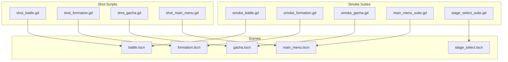
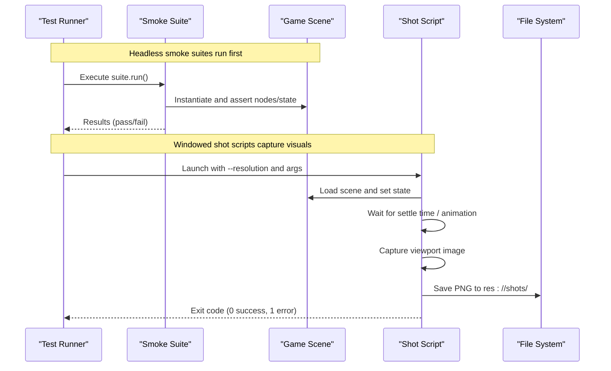
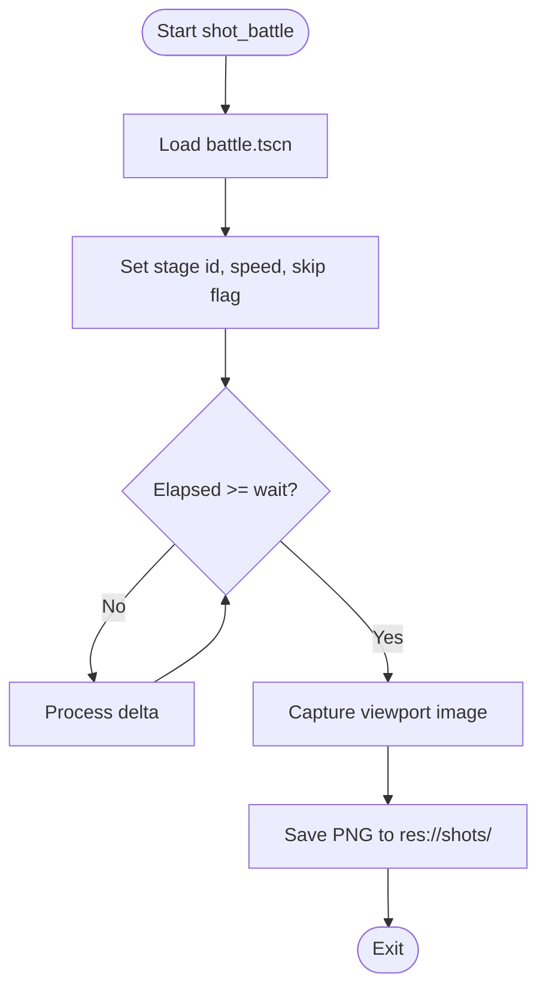
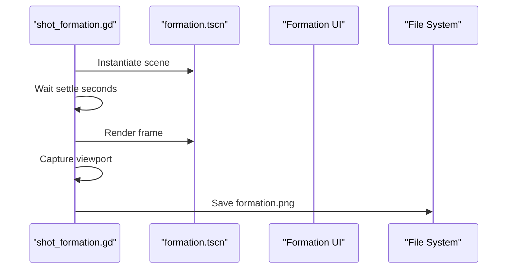
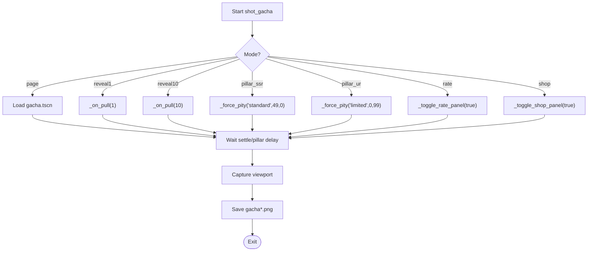
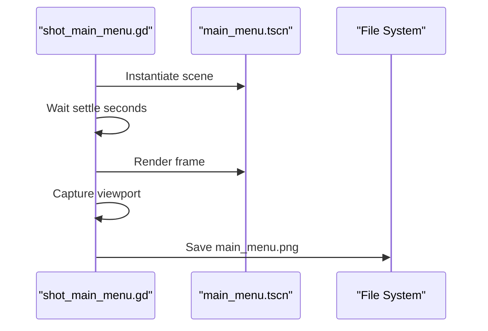
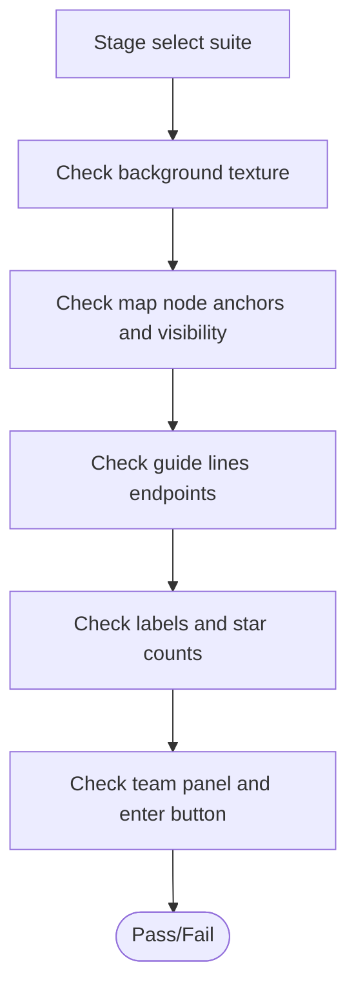
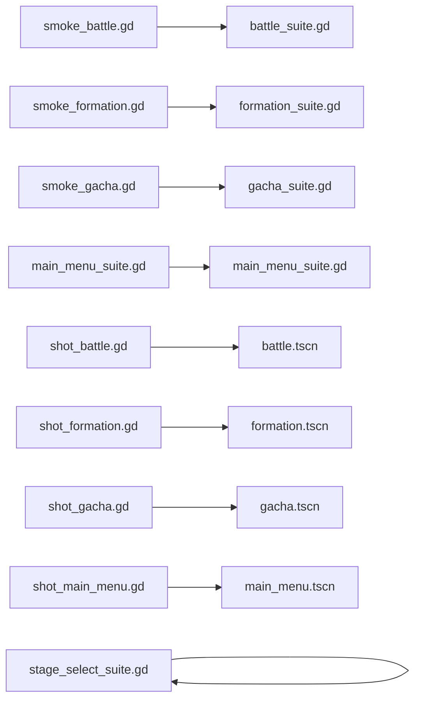

# Visual Regression & Asset Validation

<cite>
**Referenced Files in This Document**
- [shot_battle.gd](file://tools/shot_battle.gd)
- [shot_formation.gd](file://tools/shot_formation.gd)
- [shot_gacha.gd](file://tools/shot_gacha.gd)
- [shot_main_menu.gd](file://tools/shot_main_menu.gd)
- [battle_suite.gd](file://tools/suites/battle_suite.gd)
- [formation_suite.gd](file://tools/suites/formation_suite.gd)
- [gacha_suite.gd](file://tools/suites/gacha_suite.gd)
- [main_menu_suite.gd](file://tools/suites/main_menu_suite.gd)
- [stage_select_suite.gd](file://tools/suites/stage_select_suite.gd)
- [smoke_battle.gd](file://tools/smoke_battle.gd)
- [smoke_formation.gd](file://tools/smoke_formation.gd)
- [smoke_gacha.gd](file://tools/smoke_gacha.gd)
- [battle.gd](file://scripts/battle.gd)
- [formation.gd](file://scripts/formation.gd)
- [gacha.gd](file://scripts/gacha.gd)
- [main_menu.gd](file://scripts/main_menu.gd)
</cite>

## Table of Contents
1. Introduction
2. Project Structure
3. Core Components
4. Architecture Overview
5. Detailed Component Analysis
6. Dependency Analysis
7. Performance Considerations
8. Troubleshooting Guide
9. Conclusion

## Introduction
This document explains how the project performs visual regression testing and asset validation across key game screens: battle scenes, formation layouts, gacha animations, stage selection interfaces, and the main menu. It covers automated screenshot capture, baseline comparison techniques, visual diff analysis, asset loading verification, sprite rendering checks, font display validation, responsive layout behavior, performance profiling during tests, memory monitoring, and cross-platform consistency strategies.

The system uses headless smoke suites for functional assertions and windowed shot scripts to render and capture screenshots. Together they form a robust pipeline that validates both logic and visuals.

## Project Structure
Visual regression and asset validation are implemented through two complementary layers:
- Smoke suites (headless): assert configuration, data, UI structure, and interactions without rendering.
- Shot scripts (windowed): load scenes, drive state transitions, wait for stable frames, and capture PNGs into res://shots/.

**Diagram sources**
- [smoke_battle.gd:10-31](file://tools/smoke_battle.gd#L10-L31)
- [smoke_formation.gd:10-31](file://tools/smoke_formation.gd#L10-L31)
- [smoke_gacha.gd:10-31](file://tools/smoke_gacha.gd#L10-L31)
- [shot_battle.gd:14-17](file://tools/shot_battle.gd#L14-L17)
- [shot_formation.gd:11-15](file://tools/shot_formation.gd#L11-L15)
- [shot_gacha.gd:21-26](file://tools/shot_gacha.gd#L21-L26)
- [shot_main_menu.gd:9-14](file://tools/shot_main_menu.gd#L9-L14)

**Section sources**
- [smoke_battle.gd:10-31](file://tools/smoke_battle.gd#L10-L31)
- [smoke_formation.gd:10-31](file://tools/smoke_formation.gd#L10-L31)
- [smoke_gacha.gd:10-31](file://tools/smoke_gacha.gd#L10-L31)
- [shot_battle.gd:14-17](file://tools/shot_battle.gd#L14-L17)
- [shot_formation.gd:11-15](file://tools/shot_formation.gd#L11-L15)
- [shot_gacha.gd:21-26](file://tools/shot_gacha.gd#L21-L26)
- [shot_main_menu.gd:9-14](file://tools/shot_main_menu.gd#L9-L14)

## Core Components
- Automated screenshot capture: Each shot script loads a scene, waits for a stable frame, reads the viewport texture, and saves a PNG to res://shots/.
- Baseline management: Store reference images per screen; compare new captures against baselines using pixel or structural similarity metrics.
- Visual diff analysis: Generate diffs highlighting changed regions; thresholding controls sensitivity to minor changes.
- Asset validation: Ensure textures, fonts, icons, and sprites load correctly and render within expected bounds.
- Responsive layout checks: Validate UI elements remain within safe areas and do not overlap critical UI.
- Performance and memory: Profile CPU/GPU usage and memory during test runs; detect regressions in draw calls or memory spikes.

Key behaviors implemented in code:
- Screenshot capture via RenderingServer frame callbacks and Image.save_png.
- Scene-driven state setup (e.g., forcing pity counters, skipping animations).
- Headless smoke suites asserting scene skeleton, node names, and interaction flows.

**Section sources**
- [shot_battle.gd:31-120](file://tools/shot_battle.gd#L31-L120)
- [shot_formation.gd:24-84](file://tools/shot_formation.gd#L24-L84)
- [shot_gacha.gd:37-149](file://tools/shot_gacha.gd#L37-L149)
- [shot_main_menu.gd:22-79](file://tools/shot_main_menu.gd#L22-L79)
- [battle_suite.gd:30-58](file://tools/suites/battle_suite.gd#L30-L58)
- [formation_suite.gd:38-68](file://tools/suites/formation_suite.gd#L38-L68)
- [gacha_suite.gd:21-40](file://tools/suites/gacha_suite.gd#L21-L40)
- [main_menu_suite.gd:19-34](file://tools/suites/main_menu_suite.gd#L19-L34)

## Architecture Overview
The pipeline integrates headless smoke suites with windowed screenshot capture to validate both logic and visuals.

**Diagram sources**
- [smoke_battle.gd:16-31](file://tools/smoke_battle.gd#L16-L31)
- [smoke_formation.gd:16-31](file://tools/smoke_formation.gd#L16-L31)
- [smoke_gacha.gd:16-31](file://tools/smoke_gacha.gd#L16-L31)
- [shot_battle.gd:31-120](file://tools/shot_battle.gd#L31-L120)
- [shot_formation.gd:24-84](file://tools/shot_formation.gd#L24-L84)
- [shot_gacha.gd:37-149](file://tools/shot_gacha.gd#L37-L149)
- [shot_main_menu.gd:22-79](file://tools/shot_main_menu.gd#L22-L79)

## Detailed Component Analysis

### Battle Screenshots and Visual Checks
- Captures normal battle frames and result panels by controlling speed and optionally skipping to settlement.
- Validates scene skeleton, unit placement, health bars, labels, and interactive buttons.
- Ensures assets like backgrounds, portraits, and icons load and render correctly.

**Diagram sources**
- [shot_battle.gd:31-120](file://tools/shot_battle.gd#L31-L120)

**Section sources**
- [shot_battle.gd:31-120](file://tools/shot_battle.gd#L31-L120)
- [battle_suite.gd:568-666](file://tools/suites/battle_suite.gd#L568-L666)
- [battle.gd:93-116](file://scripts/battle.gd#L93-L116)

### Formation Screenshots and Layout Validation
- Loads formation scene, waits for intro animations, then captures a stable frame.
- Verifies grid layout, library thumbnails, filters, sorting, and team board positions.
- Confirms background texture and UI elements render as expected.

**Diagram sources**
- [shot_formation.gd:24-84](file://tools/shot_formation.gd#L24-L84)

**Section sources**
- [shot_formation.gd:24-84](file://tools/shot_formation.gd#L24-L84)
- [formation_suite.gd:328-446](file://tools/suites/formation_suite.gd#L328-L446)
- [formation.gd:77-100](file://scripts/formation.gd#L77-L100)

### Gacha Screenshots and Animation States
- Supports multiple modes: page, reveal single/ten, pillar SSR/UR, rate panel, shop panel.
- Forces pity counters and resources to deterministically trigger desired states before capture.
- Disables animations in tests to stabilize output; shot scripts handle timing and capture.

**Diagram sources**
- [shot_gacha.gd:37-149](file://tools/shot_gacha.gd#L37-L149)

**Section sources**
- [shot_gacha.gd:37-149](file://tools/shot_gacha.gd#L37-L149)
- [gacha_suite.gd:479-541](file://tools/suites/gacha_suite.gd#L479-L541)
- [gacha.gd:117-125](file://scripts/gacha.gd#L117-L125)

### Main Menu Screenshots and Card Fan Validation
- Loads main menu, waits for intro animations, captures stable frame.
- Validates card fan layout, stat rows, occlusion safety, and right rail entries.
- Ensures assets and fonts render within inner rects and do not overlap UI.

**Diagram sources**
- [shot_main_menu.gd:22-79](file://tools/shot_main_menu.gd#L22-L79)

**Section sources**
- [shot_main_menu.gd:22-79](file://tools/shot_main_menu.gd#L22-L79)
- [main_menu_suite.gd:462-551](file://tools/suites/main_menu_suite.gd#L462-L551)
- [main_menu.gd:35-43](file://scripts/main_menu.gd#L35-L43)

### Stage Selection Screenshots and Map Node Placement
- Validates background texture, map node anchors, guide lines, labels, stars, and team panel.
- Ensures nodes align to configured anchors and remain within viewport bounds.

**Diagram sources**
- [stage_select_suite.gd:114-262](file://tools/suites/stage_select_suite.gd#L114-L262)

**Section sources**
- [stage_select_suite.gd:114-262](file://tools/suites/stage_select_suite.gd#L114-L262)

## Dependency Analysis
- Smoke suites depend on GameDB, SaveDB, StaminaSys, and RealmDB to assert configuration and runtime state.
- Shot scripts depend on RenderingServer and DisplayServer to capture frames and manage windows.
- Scenes expose nodes and methods used by suites and shot scripts to drive state and verify UI.

**Diagram sources**
- [smoke_battle.gd:10-31](file://tools/smoke_battle.gd#L10-L31)
- [smoke_formation.gd:10-31](file://tools/smoke_formation.gd#L10-L31)
- [smoke_gacha.gd:10-31](file://tools/smoke_gacha.gd#L10-L31)
- [shot_battle.gd:14-17](file://tools/shot_battle.gd#L14-L17)
- [shot_formation.gd:11-15](file://tools/shot_formation.gd#L11-L15)
- [shot_gacha.gd:21-26](file://tools/shot_gacha.gd#L21-L26)
- [shot_main_menu.gd:9-14](file://tools/shot_main_menu.gd#L9-L14)

**Section sources**
- [battle_suite.gd:30-58](file://tools/suites/battle_suite.gd#L30-L58)
- [formation_suite.gd:38-68](file://tools/suites/formation_suite.gd#L38-L68)
- [gacha_suite.gd:21-40](file://tools/suites/gacha_suite.gd#L21-L40)
- [main_menu_suite.gd:19-34](file://tools/suites/main_menu_suite.gd#L19-L34)
- [stage_select_suite.gd:27-47](file://tools/suites/stage_select_suite.gd#L27-L47)

## Performance Considerations
- Use headless smoke suites for fast, deterministic logic checks without rendering overhead.
- Limit animation duration in shot scripts by disabling animations or skipping sequences when capturing visuals.
- Monitor frame times and GPU/CPU usage during screenshot capture; avoid heavy effects that can cause inconsistent renders.
- Track memory usage across test runs to detect leaks from scene instantiation or resource loading.
- For cross-platform consistency, lock resolution and DPI settings; validate font rasterization differences between platforms.

[No sources needed since this section provides general guidance]

## Troubleshooting Guide
Common issues and resolutions:
- Viewport texture is null: Ensure a windowed renderer is used for screenshots; headless mode cannot capture frames.
- Timeout errors: Increase settle/wait times to allow animations and UI initialization to complete.
- Missing scenes or nodes: Verify scene paths and unique node names; suites assert these explicitly.
- Resource loading failures: Confirm assets exist and are imported; suites check icon and texture existence.
- Inconsistent visuals: Disable animations, fix resolution, and ensure deterministic seeds where applicable.

**Section sources**
- [shot_battle.gd:63-66](file://tools/shot_battle.gd#L63-L66)
- [shot_battle.gd:101-120](file://tools/shot_battle.gd#L101-L120)
- [shot_formation.gd:53-56](file://tools/shot_formation.gd#L53-L56)
- [shot_formation.gd:61-84](file://tools/shot_formation.gd#L61-L84)
- [shot_gacha.gd:72-76](file://tools/shot_gacha.gd#L72-L76)
- [shot_gacha.gd:130-149](file://tools/shot_gacha.gd#L130-L149)
- [shot_main_menu.gd:48-51](file://tools/shot_main_menu.gd#L48-L51)
- [shot_main_menu.gd:56-79](file://tools/shot_main_menu.gd#L56-L79)

## Conclusion
The project’s visual regression and asset validation framework combines headless smoke suites with windowed screenshot capture to ensure both logical correctness and visual fidelity. By standardizing capture workflows, enforcing baseline comparisons, validating asset loading and layout, and monitoring performance and memory, the system provides reliable detection of regressions across battle, formation, gacha, stage selection, and main menu screens. Integrating these practices into CI pipelines will help maintain consistent user experience across updates and platforms.

[No sources needed since this section summarizes without analyzing specific files]