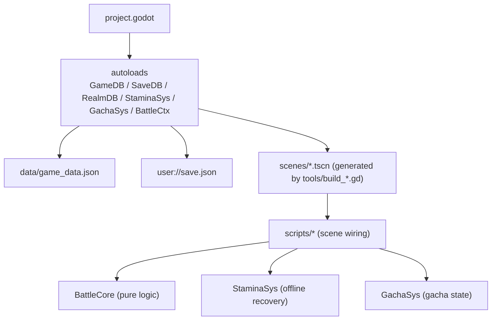
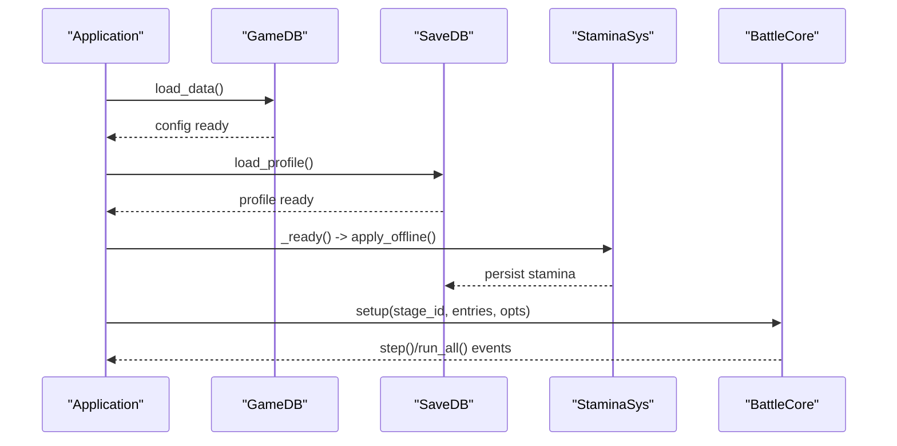
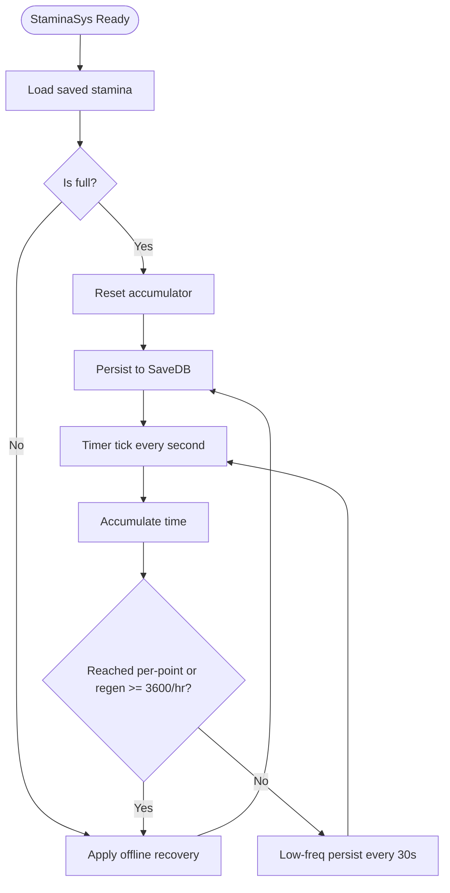
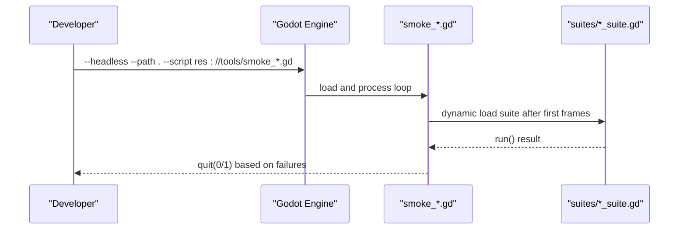
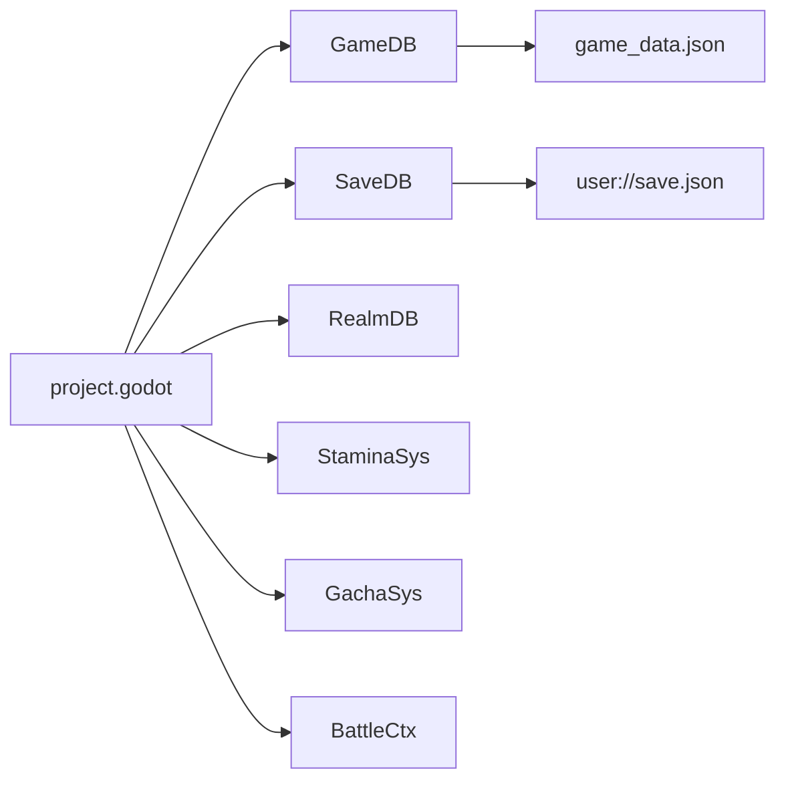

# Troubleshooting & FAQ

<cite>
**Referenced Files in This Document**
- [README.md](file://README.md)
- [project.godot](file://project.godot)
- [scripts/game_db.gd](file://scripts/game_db.gd)
- [scripts/save_db.gd](file://scripts/save_db.gd)
- [scripts/stamina.gd](file://scripts/stamina.gd)
- [scripts/battle_core.gd](file://scripts/battle_core.gd)
- [tools/smoke_battle.gd](file://tools/smoke_battle.gd)
- [tools/smoke_main_menu.gd](file://tools/smoke_main_menu.gd)
- [tools/smoke_formation.gd](file://tools/smoke_formation.gd)
- [tools/smoke_stage_select.gd](file://tools/smoke_stage_select.gd)
- [tools/smoke_gacha.gd](file://tools/smoke_gacha.gd)
- [tools/shot_battle.gd](file://tools/shot_battle.gd)
- [tools/shot_formation.gd](file://tools/shot_formation.gd)
</cite>

## Table of Contents
1. Introduction
2. Project Structure
3. Core Components
4. Architecture Overview
5. Detailed Component Analysis
6. Dependency Analysis
7. Performance Considerations
8. Troubleshooting Guide
9. Conclusion
10. Appendices

## Introduction
This document provides comprehensive troubleshooting and FAQ guidance for the project, focusing on common setup issues, development workflow pitfalls, debugging techniques, performance optimization, memory management, profiling methods, Godot engine-specific problems, asset loading issues, platform-specific bugs, diagnostic steps, conflict resolution, validation strategies, and how to seek help or report bugs. It is designed for both new contributors and experienced developers working with this Godot 4.7.2 card RPG.

## Project Structure
The project follows a layered architecture:
- Data layer: GameDB reads configuration from JSON; SaveDB persists player state; RealmDB derives final stats and synergies.
- Systems: StaminaSys manages stamina; GachaSys handles gacha logic; BattleCore runs deterministic ATB combat.
- Scenes: main_menu, stage_select, formation, battle, gacha are generated by build scripts and wired by scene scripts.
- Tools: smoke tests, screenshot tools, and asset preparation utilities support CI-like validation and QA.

**Diagram sources**
- [project.godot:14-21](file://project.godot#L14-L21)
- [README.md:62-96](file://README.md#L62-L96)

**Section sources**
- [README.md:62-96](file://README.md#L62-L96)
- [project.godot:14-21](file://project.godot#L14-L21)

## Core Components
Key runtime components and responsibilities:
- GameDB: read-only configuration loader and query interface over game_data.json.
- SaveDB: single persistence entry point for user data under user://save.json.
- StaminaSys: offline-capable stamina recovery with periodic persistence.
- BattleCore: deterministic ATB combat core that emits events for UI playback.
- Tools: smoke test runners and screenshot helpers for automated validation.

**Section sources**
- [scripts/game_db.gd:1-37](file://scripts/game_db.gd#L1-L37)
- [scripts/save_db.gd:1-22](file://scripts/save_db.gd#L1-L22)
- [scripts/stamina.gd:1-36](file://scripts/stamina.gd#L1-L36)
- [scripts/battle_core.gd:1-14](file://scripts/battle_core.gd#L1-L14)

## Architecture Overview
The system separates concerns cleanly:
- Configuration is centralized and immutable at runtime via GameDB.
- Player state is persisted through SaveDB, ensuring consistency across systems.
- StaminaSys integrates with SaveDB and Time to provide offline recovery without background processes.
- BattleCore is pure logic and deterministic, enabling reliable smoke tests and reproducible results.
- Scene generation via tools/build_*.gd keeps layout constants out of .tscn files, reducing manual drift.

**Diagram sources**
- [scripts/game_db.gd:13-37](file://scripts/game_db.gd#L13-L37)
- [scripts/save_db.gd:146-176](file://scripts/save_db.gd#L146-L176)
- [scripts/stamina.gd:19-36](file://scripts/stamina.gd#L19-L36)
- [scripts/battle_core.gd:44-67](file://scripts/battle_core.gd#L44-L67)

## Detailed Component Analysis

### GameDB: Configuration Loading and Queries
Common issues:
- Missing or invalid game_data.json leads to startup failures.
- JSON parse errors cause silent fallbacks if not handled.

Diagnostics:
- Check push_error logs for file existence and parse status.
- Validate JSON structure using tools/_inspect scripts before running.

Optimization tips:
- Keep game_data.json well-formatted and versioned; avoid unnecessary large arrays.
- Use targeted queries instead of scanning entire tables repeatedly.

Error handling highlights:
- File open and JSON parse errors are logged with clear messages.

**Section sources**
- [scripts/game_db.gd:17-37](file://scripts/game_db.gd#L17-L37)

### SaveDB: Persistence and Migration
Common issues:
- Save file corruption or permission errors prevent saving/loading.
- Legacy fields require migration to new schema.

Diagnostics:
- Inspect push_error on save failure.
- Verify default profile creation when no save exists.

Migration notes:
- Gacha pity counts migrated to grouped structure to support cross-period inheritance.

Best practices:
- Always route writes through SaveDB to maintain consistency.
- Normalize team entries to enforce rules (max members, unique hero IDs, valid slots).

**Section sources**
- [scripts/save_db.gd:146-176](file://scripts/save_db.gd#L146-L176)
- [scripts/save_db.gd:195-209](file://scripts/save_db.gd#L195-L209)
- [scripts/save_db.gd:293-316](file://scripts/save_db.gd#L293-L316)

### StaminaSys: Offline Recovery and Persistence
Common issues:
- Stamina not recovering after closing app.
- Incorrect next recovery time display.

Diagnostics:
- Confirm apply_offline runs on startup and periodically.
- Check persisted values in user://save.json.

Performance considerations:
- Low-frequency persistence avoids excessive disk writes.

Flow overview:

**Diagram sources**
- [scripts/stamina.gd:19-36](file://scripts/stamina.gd#L19-L36)
- [scripts/stamina.gd:119-146](file://scripts/stamina.gd#L119-L146)
- [scripts/stamina.gd:155-166](file://scripts/stamina.gd#L155-L166)

**Section sources**
- [scripts/stamina.gd:19-36](file://scripts/stamina.gd#L19-L36)
- [scripts/stamina.gd:119-146](file://scripts/stamina.gd#L119-L146)
- [scripts/stamina.gd:155-166](file://scripts/stamina.gd#L155-L166)

### BattleCore: Deterministic ATB Combat
Common issues:
- Non-deterministic outcomes due to random seed misuse.
- Misconfigured enemy references causing missing monsters.

Diagnostics:
- Ensure seed is set for reproducibility in smoke tests.
- Check warnings for missing monster definitions.

Optimization tips:
- Avoid heavy allocations in tight loops; reuse unit dictionaries.
- Keep event emission minimal to reduce UI overhead.

Validation:
- Smoke tests assert damage formulas, ATB order, and end conditions.

**Section sources**
- [scripts/battle_core.gd:44-67](file://scripts/battle_core.gd#L44-L67)
- [scripts/battle_core.gd:152-188](file://scripts/battle_core.gd#L152-L188)
- [scripts/battle_core.gd:391-425](file://scripts/battle_core.gd#L391-L425)

### Tools: Smoke Tests and Screenshots
Common issues:
- Autoload not available in --script mode.
- Headless rendering cannot capture screenshots.

Diagnostics:
- Use smoke runners to validate subsystems headlessly.
- Run screenshot tools with windowed mode and proper parameters.

Workflow:

**Diagram sources**
- [tools/smoke_battle.gd:16-32](file://tools/smoke_battle.gd#L16-L32)
- [tools/smoke_main_menu.gd:16-32](file://tools/smoke_main_menu.gd#L16-L32)
- [tools/smoke_formation.gd:16-32](file://tools/smoke_formation.gd#L16-L32)
- [tools/smoke_stage_select.gd:16-32](file://tools/smoke_stage_select.gd#L16-L32)
- [tools/smoke_gacha.gd:16-32](file://tools/smoke_gacha.gd#L16-L32)

**Section sources**
- [tools/smoke_battle.gd:16-32](file://tools/smoke_battle.gd#L16-L32)
- [tools/smoke_main_menu.gd:16-32](file://tools/smoke_main_menu.gd#L16-L32)
- [tools/smoke_formation.gd:16-32](file://tools/smoke_formation.gd#L16-L32)
- [tools/smoke_stage_select.gd:16-32](file://tools/smoke_stage_select.gd#L16-L32)
- [tools/smoke_gacha.gd:16-32](file://tools/smoke_gacha.gd#L16-L32)

## Dependency Analysis
Autoloads centralize shared services:
- GameDB, SaveDB, RealmDB, StaminaSys, GachaSys, BattleCtx are registered in project.godot.
- Scenes and scripts depend on these autoloads for configuration, persistence, and system state.

**Diagram sources**
- [project.godot:14-21](file://project.godot#L14-L21)

**Section sources**
- [project.godot:14-21](file://project.godot#L14-L21)

## Performance Considerations
- Use deterministic seeds in BattleCore for reproducible smoke tests and faster iteration.
- Minimize disk writes in StaminaSys by batching persistence and using low-frequency updates.
- Avoid frequent resource reloads; rely on Godot’s import pipeline and caching.
- Prefer configuration-driven behavior (GameDB) to reduce code changes and runtime branching.
- Profile UI-heavy scenes (battle, formation) using Godot’s built-in profiler to identify bottlenecks.

[No sources needed since this section provides general guidance]

## Troubleshooting Guide

### Frequently Asked Questions

- How do I run the project from source?
  - Use Godot 4.7.2, import resources, then run the main scene. See README quick start for commands.

- Where is my save file located?
  - Under user://save.json, typically in %APPDATA%\Godot\app_userdata\卡牌大冒险\save.json.

- Why does stamina not recover after closing the game?
  - Ensure apply_offline runs on startup and that SaveDB persists correctly. Check logs for errors.

- How do I reset progress?
  - Delete save.json; the game will create a fresh default profile on next launch.

- Why can’t I see certain stages on the map?
  - Only three nodes have map anchors; other stages are reachable via battle flow but not mapped.

- How do I generate scenes safely?
  - Use tools/build_*.gd to regenerate scenes; do not edit .tscn manually.

- How do I run smoke tests?
  - Execute smoke_*.gd scripts headlessly to validate subsystems and catch regressions.

- How do I take screenshots for QA?
  - Run shot_*.gd with a windowed engine; headless cannot render textures.

**Section sources**
- [README.md:12-58](file://README.md#L12-L58)
- [README.md:520-548](file://README.md#L520-L548)
- [README.md:550-563](file://README.md#L550-L563)
- [scripts/stamina.gd:119-146](file://scripts/stamina.gd#L119-L146)
- [scripts/save_db.gd:146-176](file://scripts/save_db.gd#L146-L176)

### Debugging Techniques

- Enable detailed logging:
  - GameDB logs configuration load status and errors.
  - SaveDB logs save/load success/failure.
  - BattleCore logs action sequences and end reasons.

- Use smoke tests:
  - Run smoke_battle, smoke_main_menu, smoke_formation, smoke_stage_select, smoke_gacha to assert correctness.

- Validate assets:
  - Ensure game_data.json paths exist; missing art or fonts cause fallbacks or errors.

- Reproduce deterministically:
  - Set BattleCore seed to fix RNG and verify exact outcomes.

**Section sources**
- [scripts/game_db.gd:17-37](file://scripts/game_db.gd#L17-L37)
- [scripts/save_db.gd:146-176](file://scripts/save_db.gd#L146-L176)
- [scripts/battle_core.gd:44-67](file://scripts/battle_core.gd#L44-L67)
- [tools/smoke_battle.gd:16-32](file://tools/smoke_battle.gd#L16-L32)

### Common Issues and Solutions

- Project fails to start due to version mismatch:
  - Ensure Godot 4.7.2 is used; mismatch triggers config_version errors.

- Autoload not visible in --script mode:
  - Dynamically load suites after first frames; avoid direct autoload access in entry scripts.

- Custom minimum size issues:
  - Reset dimensions before scaling; UI.place() writes custom_minimum_size.

- Dynamic node naming conflicts:
  - Remove child before queue_free to avoid auto-renaming to @XXX@2.

- Rendering device driver:
  - Windows uses D3D12; ensure drivers are up-to-date if encountering GPU issues.

**Section sources**
- [README.md:565-577](file://README.md#L565-L577)
- [project.godot:47-50](file://project.godot#L47-L50)

### Platform-Specific Bugs

- Windows D3D12 rendering:
  - If experiencing graphical glitches, update GPU drivers or try alternative rendering devices in project settings.

- Headless limitations:
  - Screenshot tools require a windowed renderer; headless cannot capture viewport textures.

**Section sources**
- [project.godot:47-50](file://project.godot#L47-L50)
- [tools/shot_battle.gd:64-106](file://tools/shot_battle.gd#L64-L106)
- [tools/shot_formation.gd:35-77](file://tools/shot_formation.gd#L35-L77)

### Diagnostic Steps for Bottlenecks

- Identify slow frames:
  - Use Godot’s profiler to find CPU/GPU hotspots in battle and formation scenes.

- Reduce draw calls:
  - Batch similar UI elements; avoid excessive dynamic node creation.

- Optimize data access:
  - Cache frequently accessed GameDB queries; avoid repeated JSON parsing.

- Memory pressure:
  - Monitor heap usage; free temporary objects promptly; avoid retaining large arrays.

[No sources needed since this section provides general guidance]

### Conflict Resolution and Validation

- Resolve conflicting team entries:
  - SaveDB.normalize_team enforces max members, unique hero IDs, and valid slots.

- Validate stage configurations:
  - Use apply_chapter1.py and related scripts to recompute power scales and ensure consistency.

- Assert gacha probabilities:
  - Run diag_gacha.gd to inspect distribution and confirm adherence to公示 rates.

**Section sources**
- [scripts/save_db.gd:293-316](file://scripts/save_db.gd#L293-L316)
- [README.md:465-485](file://README.md#L465-L485)
- [README.md:503-508](file://README.md#L503-L508)

### Seeking Help and Reporting Bugs

- Provide reproduction steps:
  - Include Godot version, OS, and exact commands used to trigger the issue.

- Attach logs and outputs:
  - Capture console output from smoke tests and any push_error messages.

- Share save and config:
  - Include save.json (sanitized) and relevant sections of game_data.json if applicable.

- Use smoke tests to isolate:
  - Run specific smoke_*.gd scripts to narrow down failing subsystems.

[No sources needed since this section provides general guidance]

## Conclusion
This troubleshooting guide consolidates common issues, diagnostics, and best practices for developing and maintaining the project. By leveraging structured logging, deterministic combat, robust persistence, and automated smoke tests, contributors can quickly identify and resolve problems while maintaining performance and reliability.

[No sources needed since this section summarizes without analyzing specific files]

## Appendices

### Quick Commands for Validation
- Import and run:
  - Godot --headless --path . --import
  - Godot --path .
- Run smoke tests:
  - Godot --headless --path . --script res://tools/smoke_battle.gd
  - Godot --headless --path . --script res://tools/smoke_main_menu.gd
  - Godot --headless --path . --script res://tools/smoke_formation.gd
  - Godot --headless --path . --script res://tools/smoke_stage_select.gd
  - Godot --headless --path . --script res://tools/smoke_gacha.gd
- Take screenshots:
  - Godot --path . --resolution 1920x1080 --script res://tools/shot_battle.gd -- <stage_id> <wait> <speed>
  - Godot --path . --resolution 1920x1080 --script res://tools/shot_formation.gd -- <wait>

**Section sources**
- [README.md:12-58](file://README.md#L12-L58)
- [README.md:520-548](file://README.md#L520-L548)