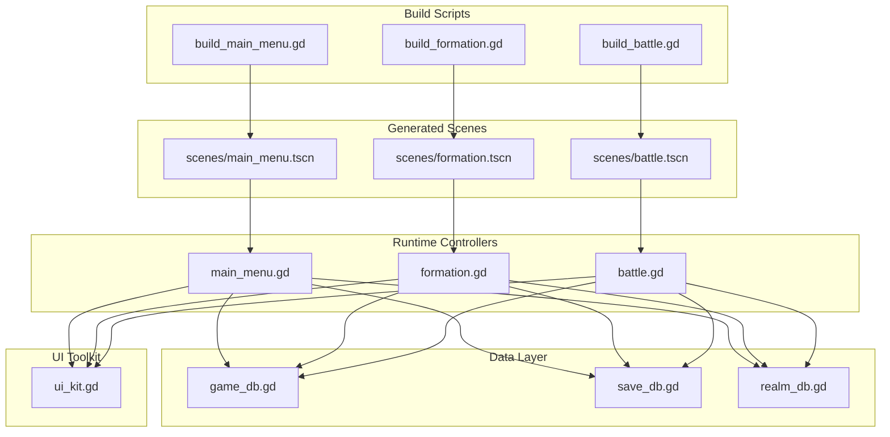
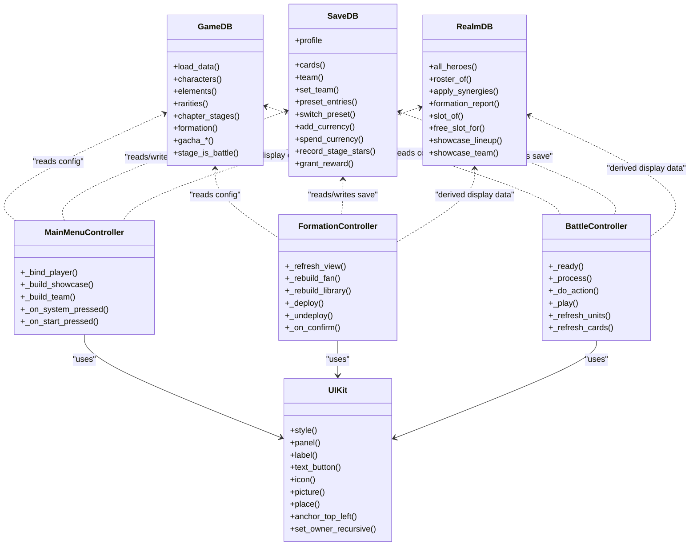
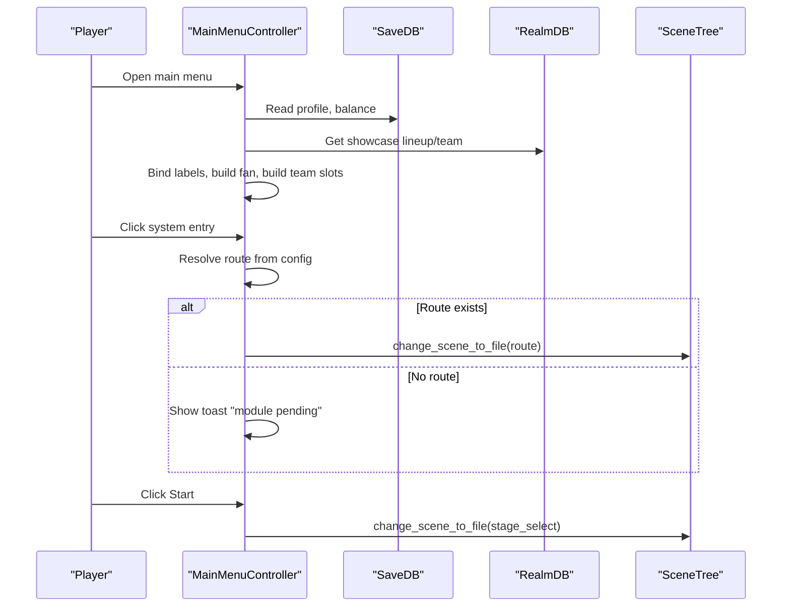
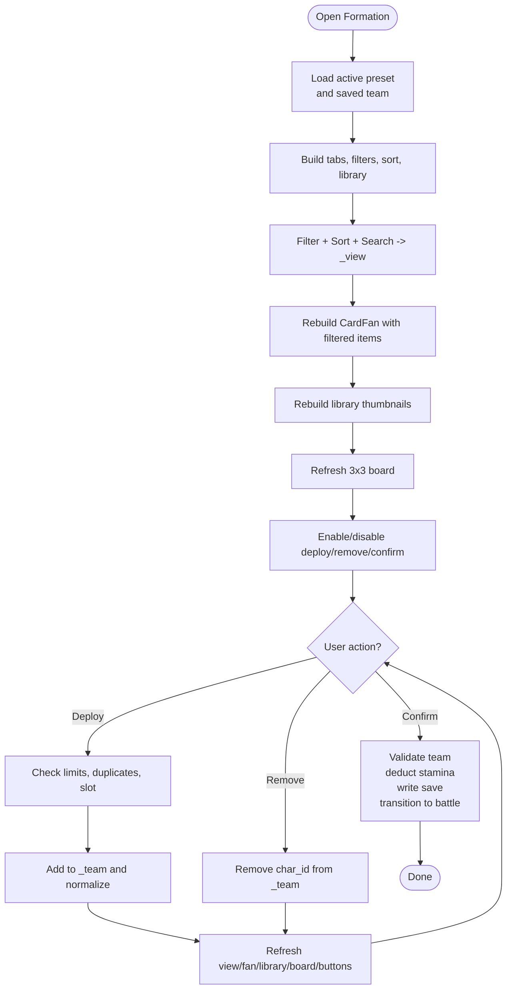
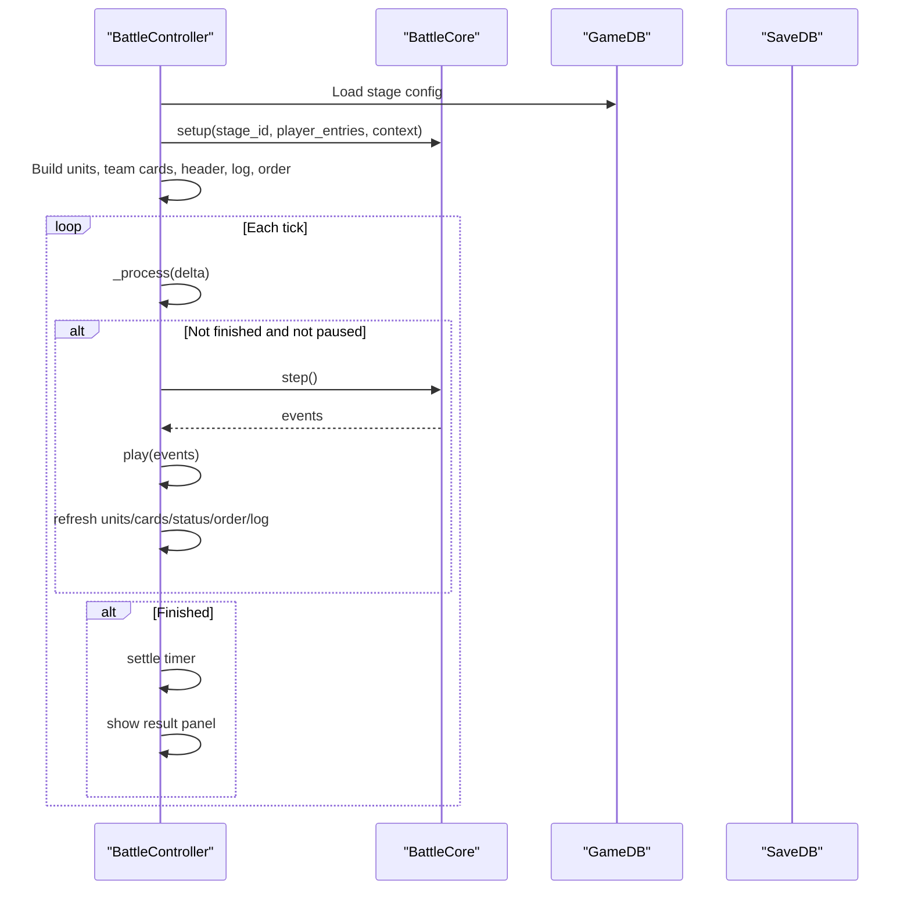
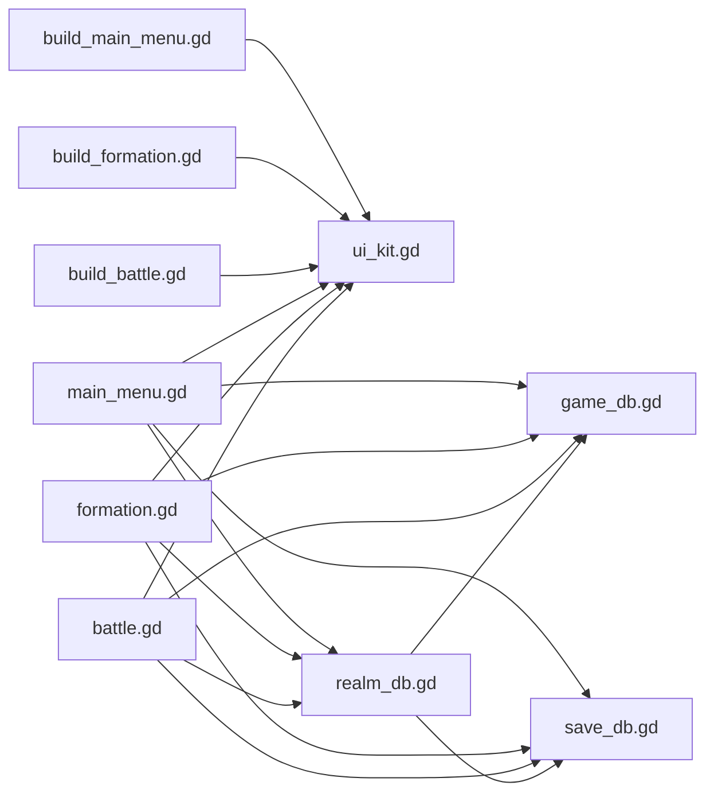

# UI & Scene Management

<cite>
**Referenced Files in This Document**   
- [build_main_menu.gd](file://tools/build_main_menu.gd)
- [build_formation.gd](file://tools/build_formation.gd)
- [build_battle.gd](file://tools/build_battle.gd)
- [ui_kit.gd](file://tools/ui_kit.gd)
- [main_menu.gd](file://scripts/main_menu.gd)
- [formation.gd](file://scripts/formation.gd)
- [battle.gd](file://scripts/battle.gd)
- [game_db.gd](file://scripts/game_db.gd)
- [realm_db.gd](file://scripts/realm_db.gd)
- [save_db.gd](file://scripts/save_db.gd)
</cite>

## Table of Contents
1. [Introduction](#introduction)
2. [Project Structure](#project-structure)
3. [Core Components](#core-components)
4. [Architecture Overview](#architecture-overview)
5. [Detailed Component Analysis](#detailed-component-analysis)
6. [Dependency Analysis](#dependency-analysis)
7. [Performance Considerations](#performance-considerations)
8. [Troubleshooting Guide](#troubleshooting-guide)
9. [Conclusion](#conclusion)

## Introduction
This document explains the programmatic UI and scene management system used by the card game project. Instead of hand-editing static `.tscn` files for every screen, the project uses dedicated build scripts to generate scene skeletons at headless build time. Runtime scripts then bind data, handle input, and drive animations. The design separates:
- Configuration (read-only): `GameDB`
- Persistent state (save/load): `SaveDB`
- Derived runtime values (stats, synergies, team power): `RealmDB`
- UI logic (scene controllers): `main_menu.gd`, `formation.gd`, `battle.gd`
- Build-time scene generators: `build_main_menu.gd`, `build_formation.gd`, `build_battle.gd`
- Shared UI primitives: `ui_kit.gd`

The result is a responsive, configuration-driven UI layer where layout is generated once and content is filled at runtime.

## Project Structure
At a high level, each major screen follows the same pattern:
- A build script under `tools/` generates a scene file under `scenes/`.
- A runtime controller under `scripts/` owns user interaction and data binding.
- Data flows from `GameDB` + `SaveDB` → `RealmDB` → UI.

**Diagram sources**
- [build_main_menu.gd:1-571](file://tools/build_main_menu.gd#L1-L571)
- [build_formation.gd:1-695](file://tools/build_formation.gd#L1-L695)
- [build_battle.gd:1-431](file://tools/build_battle.gd#L1-L431)
- [main_menu.gd:1-256](file://scripts/main_menu.gd#L1-L256)
- [formation.gd:1-800](file://scripts/formation.gd#L1-L800)
- [battle.gd:1-800](file://scripts/battle.gd#L1-L800)
- [game_db.gd:1-871](file://scripts/game_db.gd#L1-L871)
- [save_db.gd:1-643](file://scripts/save_db.gd#L1-L643)
- [realm_db.gd:1-498](file://scripts/realm_db.gd#L1-L498)
- [ui_kit.gd:1-388](file://tools/ui_kit.gd#L1-L388)

**Section sources**
- [build_main_menu.gd:1-571](file://tools/build_main_menu.gd#L1-L571)
- [build_formation.gd:1-695](file://tools/build_formation.gd#L1-L695)
- [build_battle.gd:1-431](file://tools/build_battle.gd#L1-L431)

## Core Components
### Programmatic Build Scripts
Each build script:
- Loads `res://data/game_data.json` directly (no autoload dependency).
- Creates a root `Control` with fixed base resolution and anchors.
- Builds background, HUD panels, buttons, labels, and dynamic containers.
- Assigns unique node names so runtime scripts can find them via `%Name`.
- Packs and saves the scene to `res://scenes/<screen>.tscn`.

Key responsibilities:
- Static layout: anchor-based positioning, panel styling, typography.
- Preview data: editor-friendly demo cards and labels.
- Dynamic placeholders: empty containers that runtime fills.

**Section sources**
- [build_main_menu.gd:43-144](file://tools/build_main_menu.gd#L43-L144)
- [build_formation.gd:113-213](file://tools/build_formation.gd#L113-L213)
- [build_battle.gd:44-159](file://tools/build_battle.gd#L44-L159)

### UI Toolkit
`UIKit` provides stateless helpers:
- StyleBox creation with rounded corners, borders, shadows.
- Gradient and glow textures.
- Icon and picture wrappers.
- Label and button factories.
- Layout helpers: fill, place, anchor variants, centering.
- Owner propagation for dynamically created nodes.

This ensures consistent visual language across all screens without duplicating style code.

**Section sources**
- [ui_kit.gd:1-388](file://tools/ui_kit.gd#L1-L388)

### Data Layer
- `GameDB`: read-only configuration loader; exposes typed accessors for characters, elements, rarities, stages, gacha rules, formation rules, etc.
- `SaveDB`: persistent profile, currencies, stamina, cards, team presets, progress, gacha state, stats.
- `RealmDB`: derived runtime values: stats, synergy effects, team power, hero list, showcase lineup, slot helpers.

Data flow rule: UI never writes directly to disk or reads raw JSON. It calls `GameDB` / `SaveDB` / `RealmDB`.

**Section sources**
- [game_db.gd:1-871](file://scripts/game_db.gd#L1-L871)
- [save_db.gd:1-643](file://scripts/save_db.gd#L1-L643)
- [realm_db.gd:1-498](file://scripts/realm_db.gd#L1-L498)

## Architecture Overview
The system separates concerns into layers:

**Diagram sources**
- [game_db.gd:1-871](file://scripts/game_db.gd#L1-L871)
- [save_db.gd:1-643](file://scripts/save_db.gd#L1-L643)
- [realm_db.gd:1-498](file://scripts/realm_db.gd#L1-L498)
- [ui_kit.gd:1-388](file://tools/ui_kit.gd#L1-L388)
- [main_menu.gd:1-256](file://scripts/main_menu.gd#L1-L256)
- [formation.gd:1-800](file://scripts/formation.gd#L1-L800)
- [battle.gd:1-800](file://scripts/battle.gd#L1-L800)

## Detailed Component Analysis

### Main Menu
The main menu is a showcase screen:
- Player info, stamina badge, title, top-right entries, right rail modes/system entries, toast, card fan, team preview bar, start button, footer.
- Build script creates the skeleton; runtime binds real player data, builds showcase lineup, wires inputs, refreshes stamina, and handles navigation.

Key behaviors:
- Data binding: player name, level, avatar, gold/gem balances.
- Showcase lineup: uses `RealmDB.showcase_lineup()` plus rarity/element tables and card box size.
- Team preview: dynamically creates small portrait slots based on `RealmDB.showcase_team()`.
- Navigation: system entries route to scenes if configured; otherwise show toast. Start button routes to stage select.
- Stamina: subscribes to `StaminaSys.changed` and ticks per second to update current/next refill.

**Diagram sources**
- [main_menu.gd:35-43](file://scripts/main_menu.gd#L35-L43)
- [main_menu.gd:48-93](file://scripts/main_menu.gd#L48-L93)
- [main_menu.gd:94-129](file://scripts/main_menu.gd#L94-L129)
- [main_menu.gd:154-169](file://scripts/main_menu.gd#L154-L169)
- [main_menu.gd:217-224](file://scripts/main_menu.gd#L217-L224)

**Section sources**
- [main_menu.gd:1-256](file://scripts/main_menu.gd#L1-L256)
- [build_main_menu.gd:74-144](file://tools/build_main_menu.gd#L74-L144)

### Formation Screen
The formation screen is the hero selection and team builder:
- Top bar tabs (filter/sort/search), search field, title/subtitle.
- Card fan for browsing heroes.
- 3x3 board grid for deployment.
- Library grid for thumbnails.
- Tactical info boxes.
- Preset bar, quick fill/clear/deploy/remove, confirm/back.
- Toast and popup layers for filters and sorting.

Responsibilities:
- Load active preset and saved team.
- Build filter chips and sort options from config.
- Filter/sort/search the hero list.
- Deploy/remove units to board slots.
- Compute formation report and power breakdown.
- Confirm selection triggers stamina deduction and transitions to battle scene.

**Diagram sources**
- [formation.gd:77-100](file://scripts/formation.gd#L77-L100)
- [formation.gd:237-317](file://scripts/formation.gd#L237-L317)
- [formation.gd:320-351](file://scripts/formation.gd#L320-L351)
- [formation.gd:403-419](file://scripts/formation.gd#L403-L419)
- [formation.gd:614-700](file://scripts/formation.gd#L614-L700)
- [formation.gd:722-758](file://scripts/formation.gd#L722-L758)

**Section sources**
- [formation.gd:1-800](file://scripts/formation.gd#L1-L800)
- [build_formation.gd:142-213](file://tools/build_formation.gd#L142-L213)

### Battle Interface
The battle interface is an event-driven renderer:
- Background built from stage theme or image.
- 3x3 cell dots for both sides.
- Unit tokens with sprites, nameplates, HP/shield bars, energy bars.
- Team cards showing ally status.
- Log panel scrolling events.
- Order strip showing next actions.
- Speed/pause/skip/retreat controls.
- Result panel with rewards and star rating.

Important rule: battle logic is delegated to `BattleCore`; this controller only plays events and updates visuals.

**Diagram sources**
- [battle.gd:93-116](file://scripts/battle.gd#L93-L116)
- [battle.gd:640-670](file://scripts/battle.gd#L640-L670)
- [battle.gd:673-741](file://scripts/battle.gd#L673-L741)

**Section sources**
- [battle.gd:1-800](file://scripts/battle.gd#L1-L800)
- [build_battle.gd:71-159](file://tools/build_battle.gd#L71-L159)

### Responsive Layout Handling
Layout strategy:
- Base resolution is fixed (e.g., 1920x1080).
- Root nodes use anchors to cover full viewport.
- Child nodes are positioned using `UI.place`, `UI.anchor_top_left`, `UI.anchor_right_center`, etc.
- Dynamic content uses containers (`HBoxContainer`, `GridContainer`, `ScrollContainer`) and runtime-generated children.
- Card fan and other complex layouts compute positions mathematically but still respect container sizes.

Benefits:
- Consistent look across resolutions.
- Predictable pixel placement for static panels.
- Flexible composition for dynamic lists and grids.

**Section sources**
- [ui_kit.gd:233-388](file://tools/ui_kit.gd#L233-L388)
- [build_main_menu.gd:74-144](file://tools/build_main_menu.gd#L74-L144)
- [build_formation.gd:142-213](file://tools/build_formation.gd#L142-L213)
- [build_battle.gd:71-159](file://tools/build_battle.gd#L71-L159)

### Component Composition Patterns
Common patterns:
- Build script creates named containers and leaves dynamic areas empty.
- Runtime controller finds nodes by unique name (`%Name`).
- UI toolkit functions create styled widgets consistently.
- Data binding methods rebuild only affected parts (fan, library, board, logs).
- Toast feedback uses tweens for fade-in/out.

Examples:
- Main menu: `_build_showcase()` configures `CardFan` with realm data.
- Formation: `_rebuild_fan()`, `_rebuild_library()`, `_rebuild_board()`.
- Battle: `_build_units()`, `_make_token()`, `_refresh_units()`.

**Section sources**
- [main_menu.gd:62-93](file://scripts/main_menu.gd#L62-L93)
- [formation.gd:495-500](file://scripts/formation.gd#L495-L500)
- [formation.gd:512-609](file://scripts/formation.gd#L512-L609)
- [formation.gd:614-700](file://scripts/formation.gd#L614-L700)
- [battle.gd:291-399](file://scripts/battle.gd#L291-L399)
- [battle.gd:532-570](file://scripts/battle.gd#L532-L570)

### Event Handling Patterns
- Button presses wired in `_bind_inputs()` or during build.
- System entries resolved from config; missing routes show toast instead of crashing.
- Stamina changes observed via signal; timer ticks refresh UI.
- Battle events dispatched by core and played as animations/text.

Best practices:
- Keep UI logic separate from game state.
- Use config for routing and labels.
- Provide fallback messages for missing resources.

**Section sources**
- [main_menu.gd:94-129](file://scripts/main_menu.gd#L94-L129)
- [main_menu.gd:154-169](file://scripts/main_menu.gd#L154-L169)
- [formation.gd:361-387](file://scripts/formation.gd#L361-L387)
- [battle.gd:133-150](file://scripts/battle.gd#L133-L150)
- [battle.gd:673-741](file://scripts/battle.gd#L673-L741)

### Separation Between UI Logic and Game State
- UI controllers do not calculate damage, healing, shield, stun, or rage.
- `BattleController` consumes events from `BattleCore`.
- `FormationController` validates and persists team through `SaveDB.normalize_team()` and `SaveDB.set_team()`.
- `RealmDB` computes final stats and synergies; UI displays results.

This separation ensures deterministic gameplay and testability.

**Section sources**
- [battle.gd:1-11](file://scripts/battle.gd#L1-L11)
- [battle.gd:640-670](file://scripts/battle.gd#L640-L670)
- [save_db.gd:294-316](file://scripts/save_db.gd#L294-L316)
- [realm_db.gd:13-77](file://scripts/realm_db.gd#L13-L77)

### Examples: Building Complex Screens

#### Main Menu
- Build background, player plate, stamina badge, title, top-right entries, right rail, toast, card fan, team bar, start button, footer.
- Runtime binds player data, builds showcase lineup, wires inputs, refreshes stamina, navigates to stage select.

**Section sources**
- [build_main_menu.gd:149-524](file://tools/build_main_menu.gd#L149-L524)
- [main_menu.gd:35-43](file://scripts/main_menu.gd#L35-L43)
- [main_menu.gd:48-93](file://scripts/main_menu.gd#L48-L93)
- [main_menu.gd:217-224](file://scripts/main_menu.gd#L217-L224)

#### Formation Grid
- Build top bar, card stage, power badge, board panel, library panel, tactical panel, command panel, back button, toast, popups.
- Runtime filters/sorts heroes, deploys/removes units, computes formation report, confirms selection.

**Section sources**
- [build_formation.gd:235-631](file://tools/build_formation.gd#L235-L631)
- [formation.gd:403-419](file://scripts/formation.gd#L403-L419)
- [formation.gd:614-700](file://scripts/formation.gd#L614-L700)
- [formation.gd:722-758](file://scripts/formation.gd#L722-L758)

#### Battle Interface
- Build top bar, team panel, info panel, log panel, status panel, order strip, result panel, footer, toast.
- Runtime initializes core, builds units and team cards, drives steps, plays events, shows results.

**Section sources**
- [build_battle.gd:162-413](file://tools/build_battle.gd#L162-L413)
- [battle.gd:93-116](file://scripts/battle.gd#L93-L116)
- [battle.gd:291-399](file://scripts/battle.gd#L291-L399)
- [battle.gd:640-670](file://scripts/battle.gd#L640-L670)

## Dependency Analysis
High-level dependencies:
- Build scripts depend on `ui_kit.gd` and sometimes `growth_core.gd` for preview stats.
- Runtime controllers depend on `GameDB`, `SaveDB`, `RealmDB`, and `ui_kit.gd`.
- `RealmDB` depends on `GameDB` and `SaveDB`.
- `SaveDB` depends on `GameDB` for defaults and validation.

**Diagram sources**
- [build_main_menu.gd:1-571](file://tools/build_main_menu.gd#L1-L571)
- [build_formation.gd:1-695](file://tools/build_formation.gd#L1-L695)
- [build_battle.gd:1-431](file://tools/build_battle.gd#L1-L431)
- [main_menu.gd:1-256](file://scripts/main_menu.gd#L1-L256)
- [formation.gd:1-800](file://scripts/formation.gd#L1-L800)
- [battle.gd:1-800](file://scripts/battle.gd#L1-L800)
- [game_db.gd:1-871](file://scripts/game_db.gd#L1-L871)
- [save_db.gd:1-643](file://scripts/save_db.gd#L1-L643)
- [realm_db.gd:1-498](file://scripts/realm_db.gd#L1-L498)
- [ui_kit.gd:1-388](file://tools/ui_kit.gd#L1-L388)

**Section sources**
- [game_db.gd:1-871](file://scripts/game_db.gd#L1-L871)
- [save_db.gd:1-643](file://scripts/save_db.gd#L1-L643)
- [realm_db.gd:1-498](file://scripts/realm_db.gd#L1-L498)

## Performance Considerations
For large datasets and frequent UI updates:
- Avoid recreating entire trees unnecessarily; rebuild only changed sections (fan, library, board, logs).
- Use `queue_free()` for removed nodes to defer cleanup.
- Limit text reflows by setting autowrap and sizing containers appropriately.
- Prefer precomputed data structures in `RealmDB` (rosters, reports) rather than recomputing in UI loops.
- Use timers and signals for periodic updates (stamina) instead of heavy `_process` work.
- In battle, batch event playback and avoid redundant refreshes; only update visible metrics.

[No sources needed since this section provides general guidance]

## Troubleshooting Guide
Common issues and fixes:
- Missing scene route: check config `route` and ensure resource path exists before transition.
- Missing scene file: verify generated `.tscn` exists and build script ran successfully.
- Node not found: ensure unique names match between build script and runtime controller.
- Stamina not updating: confirm signal connection and timer lifecycle.
- Team invalid: validate entries through `SaveDB.normalize_team()` and check errors via `team_errors()`.
- Battle visuals misaligned: verify unit token positions and plate layer ordering.

**Section sources**
- [main_menu.gd:106-129](file://scripts/main_menu.gd#L106-L129)
- [main_menu.gd:217-224](file://scripts/main_menu.gd#L217-L224)
- [save_db.gd:319-344](file://scripts/save_db.gd#L319-L344)
- [battle.gd:291-399](file://scripts/battle.gd#L291-L399)

## Conclusion
The project’s UI and scene management system is built around a clear separation of concerns:
- Build scripts generate stable scene skeletons with consistent styling and layout.
- Runtime controllers bind data, handle interactions, and drive animations.
- Data layers encapsulate configuration, persistence, and derived values.
- UI toolkit enforces visual consistency and simplifies dynamic construction.

This architecture supports responsive layouts, complex screens like the main menu, formation grid, and battle interface, and maintains clean boundaries between UI logic and game state. It also enables robust testing, predictable behavior, and scalable performance for large datasets.

[No sources needed since this section summarizes without analyzing specific files]