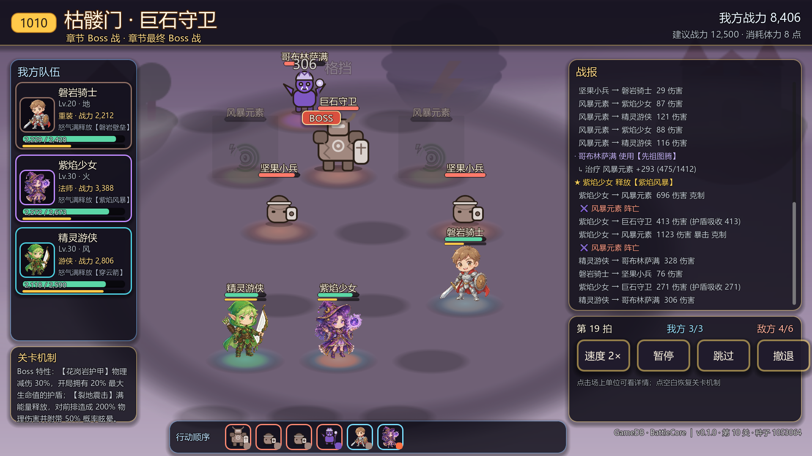

# 卡牌大冒险 · PROJECT: CARD ADVENTURE

> 2.5D 策略卡牌放置 RPG —— 卡牌收集养成 + 阵型位面战术
> 美术风格：Q 版手绘潮玩 + 正等轴测 2.5D ｜ 基准视口 1920×1080（`canvas_items` / `expand`）
> 引擎：**Godot 4.7.2**（Forward Plus，Windows 下走 D3D12）

当前可玩内容：第一章《云上浮岛 · 初始之痕》全 10 关（含精英关、Boss 关、事件 / 休息节点）、
8 张卡牌（R / SR / SSR / UR 四档）、14 只怪物、**卡牌选择与编队**、卡片图鉴、
**群星召唤（抽卡）**、3×3 半自动 ATB 战斗、星级评定与材料结算闭环。

---

## 界面一览

以下截图均为 1920×1080 实机画面，可用 `tools/shot_*.gd` 复现（见 §6.2）。

主界面（主城）：立体卡牌扇形陈列 + 右侧系统竖栏 + 底部 3×3 出战阵容预览条


| 冒险选关地图 | 卡牌选择与编队 |
|---|---|
|  |  |

| 章节 Boss 战（3×3 等轴测九宫格 / 飘字 / 战报 / 行动顺序） | 精英关首通结算（星级评定 / 战利品 / 物资统计） |
|---|---|
|  |  |

| 抽卡：十连结果汇总 | 抽卡：UR 彩虹光柱登场 |
|---|---|
|  |  |

卡片图鉴：已获取 / 未获取筛选，未获得的卡走剪影 + 锁章 + `???` 名牌


其余可复现画面：`shots/battle_normal.png`（普通关胜利结算，非首通故无星级行）、
`shots/gacha.png`（召唤静止界面）、`shots/gacha_reveal1.png`（单抽结果）、
`shots/gacha_pillar_ssr.png`（SSR 紫光柱）、`shots/gacha_rate.png`（概率公示）、
`shots/gacha_shop.png`（心愿水晶商店）、`shots/collection_detail.png`（图鉴详情弹层）、
`shots/collection_owned.png` / `collection_unowned.png`（图鉴两档筛选）、
`shots/formation_scroll_before.png` / `formation_scroll_after.png`（卡库滚动）、
`shots/monsters_sheet.png`（14 只怪物头像表）。

---

## 一、快速开始（部署）

### 1.1 从源码运行（开发 / 试玩，推荐）

```bash
# 1) 需要 Godot 4.7.2（版本不匹配会报 project.godot 的 config_version 错误）
G="D:/Godot_v4.7.2-stable_win64.exe/Godot_v4.7.2-stable_win64.exe"

# 2) 首次打开：导入资源、生成 .godot 缓存（改了资源 / 加了新脚本后也该跑一次）
"$G" --headless --path . --import

# 3) 直接运行（主场景 = res://scenes/main_menu.tscn）
"$G" --path .

# 指定分辨率运行
"$G" --path . --resolution 1920x1080
```

> 有别的工作目录时把 `--path .` 换成 `--path <项目根目录>`（`project.godot` 所在目录）。

### 1.2 打包成 Windows 可执行文件（导出）

项目**还没有** `export_presets.cfg`，导出前需要先在编辑器里建一次预设：

1. 用编辑器打开项目：`"$G" --path . --editor`
2. 菜单 **项目 → 导出… → 添加… → Windows Desktop**，预设名随意（如 `Windows Desktop`）
3. 若提示缺少导出模板：**编辑器 → 管理导出模板…** 安装
   （本机已有 `Godot_v4.7.2-stable_export_templates.tpz`，可直接导入）
4. 点 **导出项目…**，产物即所需目录下同名 `.exe` + `.pck`

建好预设后也可以用命令行复现：

```bash
"$G" --headless --path . --export-release "Windows Desktop" ./build/卡牌大冒险.exe
```

### 1.3 存档位置与重置

存档是单个 JSON，路径随 Godot 的 `user://` 走：

```
%APPDATA%\Godot\app_userdata\卡牌大冒险\save.json
# 即 C:\Users\<你>\AppData\Roaming\Godot\app_userdata\卡牌大冒险\save.json
```

- **重置进度**：删掉 `save.json` 再启动，会自动写入一份默认存档（满体力、空卡池、章节 ch1）。
- **备份 / 还原**：直接复制该文件即可。跑截图脚本前务必先备份 —— 它会真实写档（评星、领奖）。

---

## 二、目录结构

```
卡牌大冒险/
├─ project.godot              # 主场景、autoload、视口、渲染驱动
├─ data/
│  ├─ game_data.json          # ★ 唯一配置源（角色 / 怪物 / 关卡 / 战斗 / 经济 / 文案）
│  └─ db/*.db, schema.sql     # 早期 SQLite 设计的遗留物，运行时已不再读取
├─ scenes/
│  ├─ main_menu.tscn          # 主界面（主城）
│  ├─ stage_select.tscn       # 冒险关卡选择
│  ├─ formation.tscn          # 卡牌选择与编队
│  ├─ battle.tscn             # 战斗界面
│  ├─ gacha.tscn              # 群星召唤（抽卡）
│  └─ collection.tscn         # 卡片图鉴（已获取 / 未获取）
├─ scripts/
│  ├─ game_db.gd              # GameDB  — 只读配置层（autoload）
│  ├─ save_db.gd              # SaveDB  — 存档读写层（autoload，含编队与阵容预设）
│  ├─ realm_db.gd             # RealmDB — 派生属性层（autoload，含羁绊 / 克制推导）
│  ├─ stamina.gd              # StaminaSys — 体力（autoload）
│  ├─ gacha_sys.gd            # GachaSys — 抽卡结算（autoload，掷点 / 保底 / 发放）
│  ├─ battle_ctx.gd           # BattleCtx — 单场战斗上下文（autoload）
│  ├─ battle_core.gd          # 纯逻辑战斗内核（不含任何渲染）
│  ├─ growth_core.gd          # 纯函数养成公式层（属性/星级系数/战力权重，构建脚本共用）
│  ├─ main_menu.gd / stage_select.gd / formation.gd / battle.gd / gacha.gd / collection.gd
│  │                          # 六个界面的接线脚本
│  └─ card_fan.gd / card_view.gd                   # 卡牌扇形陈列与卡面（含选中态）
├─ assets/
│  ├─ fonts/ui_font.tres      # 全局 UI 字体
│  ├─ icons/*.svg             # 货币 / 元素 / 职业 / 关卡 / 卡牌 / 搜索图标
│  └─ art/{characters,frames,bg}/  # 角色立绘、卡框、背景
├─ tools/                     # 构建、测试、截图、资源预处理（不参与游戏运行）
│  ├─ build_*.gd              # 程序化生成六个场景（见 §6.3）
│  ├─ smoke_*.gd + suites/    # 冒烟测试入口与套件（见 §6.1）
│  ├─ shot_*.gd               # 截图自检（见 §6.2）
│  └─ _inspect/apply_*.py     # 关卡数值反解、地图数据与编队配置写入（见 §5.1）
├─ shots/                     # 截图产出（README「界面一览」引用这里的图）
└─ .workbuddy/memory/         # 项目开发记忆（日志 + 长期约定）
```

---

## 三、怎么玩（游戏流程）

### 3.1 界面流转

```
main_menu.tscn（主城）
   ├─ 点右栏「召集」 → gacha.tscn（抽卡，见 §3.8）
   ├─ 点右栏「图鉴」 → collection.tscn（卡片图鉴：已获取 / 未获取 + 详情弹层）
   ├─ 点右栏「编队」 → formation.tscn（不选关直接逛阵容，见 §3.4）
   └─ 点「进入冒险」
        └─ stage_select.tscn（冒险关卡选择）
             └─ 选一个浮岛 → 点「进入关卡」（此刻只校验体力，不扣）
                  └─ formation.tscn（卡牌选择与编队）
                       └─ 改好阵容 → 点「确认选择」（此刻扣体力）
                            └─ battle.tscn（战斗）
                                 └─ 结算：重试 / 关闭（关闭回选关页）
```

> 编队页「返回主界面」回主城。因为体力挪到了「确认选择」才扣，去编队页逛一圈**不会**损失体力。

### 3.2 主界面（主城）

- 中央是一排**卡牌扇形陈列**，点任意一张卡弹出详情浮条：
  名称 · 品质 · 元素 · 定位 ／ 战力 · HP · ATK · DEF ／ 绝技名。
- 左下 / 顶部显示体力（`当前/上限` + 距下一点恢复的倒计时）、金币、宝石、玩家名与等级。
- 「进入冒险」→ 切到选关页。**此步不扣体力**，体力要一路走到编队页点「确认选择」才扣。
- 右侧竖栏分两组，中间有一条分隔线：

  | 组 | 条目 | 行为 |
  |---|---|---|
  | 玩法模式（`modes`） | `无限之塔 / 迷宫探索 / 竞技场 / 巅峰对决` | 占位，弹「模块待接入」 |
  | 系统入口（`menu.system_entries`） | `召集（抽卡 / 水晶商店）`、`卡牌（编队 / 收藏）` | 按配置的 `route` **直接切场景** → 抽卡页 / 编队页 |

  两组的差别只在「点击行为」：`modes` 没有 `route`，`system_entries` 有。
  想再加一个直达入口（背包 / 抽卡……）只要往 `menu.system_entries` 里追加一条，
  带上 `id / name / tag / icon / color / route` 即可，竖栏会自动加高、不用改代码。
- 右上 `设置 / 邮件 / 活动` 仍是占位按钮（弹提示）。

### 3.3 冒险关卡选择

- 地图上目前有 **3 个浮岛节点**：`1001 初始之地`、`1003 云端城堡（精英，带「精」角标）`、
  `1004 风暴元素`。默认选中本关第一个节点并高亮（带呼吸光晕）。
- 节点上的星星读的是**存档里的历史最佳星数**（`progress.stage_stars`）；
  无记录时才回落到配置里的展演值（`select_map.nodes[].demo_stars`）。
- 点节点选中 → 点「进入关卡」：
  1. 拿**该关自身的体力消耗**跟当前体力比一比，不够就提示「体力不足，还有多久 +1」并拦下；
  2. 把「打哪一关」写进 `BattleCtx`，切到**编队页**。
  - 按钮 tooltip 会显示本关名称、类型、历史最佳星数与体力消耗。
  - **这一步不扣体力** —— 真正的扣除放在编队页点「确认选择」时（见 §3.4）。

> 关卡体力在哪一步扣由配置 `formation.spend_stamina_at` 决定（`formation` / `stage_select`），
> 默认 `formation`。

> ⚠️ 地图上只有这 3 个节点有锚点，其余 7 关（含 1010 Boss）**战斗侧可达、地图侧暂无入口**。

### 3.4 卡牌选择与编队

选关页点「进入关卡」后落到的就是这一页，是**出门前的最后一站**。

- **顶部操作栏**：`选择 / 筛选 / 排序` 三个标签页 + 搜索框。
  - `筛选` 弹出面板，按 **品质（R/SR/SSR/UR）/ 元素（水火风地光暗）/ 职业** 多选过滤；
    筛选是**实时生效**的，「确定」只负责收起面板，「重置」清空全部条件。
  - `排序` 提供 默认顺序 / 战力↓ / 等级↓ / 品质↓ / 元素 / 名称 六种。
  - 搜索框模糊匹配 **名称 / 称号 / 品质（含 SSR 这种缩写）/ 元素 / 职业**。
  - 筛选与排序**同时作用于**中央卡牌陈列与左侧备选英雄库。
- **中央陈列**：全部英雄以 2.5D 倾斜姿态一字排开，点任意一张即「选中」——
  该卡放大并套上**金色高亮边框**，底部四格战术面板随之刷新。默认选中 `formation.default_selected`
  指定的英雄（概念稿里高亮的是 SSR）。
- **四条战术信息**（底部中区 2×2）：
  | 格 | 内容 | 数据来源 |
  |---|---|---|
  | 职业克制 | 配置里的克制链图标（敌方出现过的职业高亮） | `formation.role_chain` + 关卡敌方职业 |
  | 克制加成 | 选中卡对**本关敌方阵容**的属性 / 职业克制文案 | `RealmDB.counter_report()` |
  | 羁绊加成 | 当前编队激活的羁绊条数与首条效果 | `formation.synergies` 声明式规则 |
  | 战斗定位 | 位置 + 职责 + 推荐排 + 绝技 | `formation.role_tactics` |
- **3×3 编队棋盘**（底部左区）：9 个槽位直接由 `combat.board.slot_to_cell` 落位，
  前排在上、正对敌方。点空位放置当前选中的英雄，点已上阵的格子再点一次即下阵。
- **备选英雄库**（底部第二栏）：缩略图列出全部英雄，已上阵的带「已上阵 · 槽位」标记；
  不足一屏时用「空位」补齐。
- **阵容预设 / 指令**（底部右区）：三栏预设 `主线队 / PVP队 / 副本队`，切换时**当前阵容会先存回旧预设**，
  再载入目标预设；`一键上阵` 按「战力 + 本关克制收益」打分自动填满；另有 `上阵 / 下阵 / 清空`。
- **队伍战力**实时刷新在**右上角**：`基础战力 ｜ 羁绊加成 ｜ 上阵人数`。

**上阵规则**（口径在配置里，代码只执行）：

- 标准队伍**最多 5 人**（`formation.team.max_members`），棋盘槽位有 9 个，能放的比能上的多；
- 同一支队伍里**不可重复上阵相同 `hero_id`**；
- 槽位必须是 `1..9`；同一槽位不能被两个人占；
- 队伍总战力 = **卡牌基础战力（含装备属性）+ 羁绊加成**，与战斗侧同一口径
  （`RealmDB.formation_report()` 与 `RealmDB.roster()` 走同一套结算，见 §4.8）。

**羁绊**是**声明式规则**：条件（`cond`）与效果（`effect`）都写在 `formation.synergies` 里，
引擎只负责求值与结算，不在代码里写死任何组合。支持的条件类型：

| `cond.type` | 含义 |
|---|---|
| `member_count` | 上阵总人数 ≥ min |
| `role_count` | 队内命中 `roles` 的人数 ≥ min |
| `element_count` | 队内命中 `elements` 的人数 ≥ min |
| `distinct_elements` | 队内不同元素的**种类数** ≥ min |
| `rarity_count` | 队内命中 `rarities` 的人数 ≥ min |
| `row_count` | 队内在 `row` 这一排的人数 ≥ min |

`effect.stat` ∈ `hp / atk / def / mres / spd / all`，`pct` 为乘算增幅；
多条羁绊同时生效时**乘算叠乘**，结果直接写回单位的最终属性 —— 所以羁绊不只影响界面数字，**战斗里真的生效**。

**「确认选择」会做什么**：校验（队伍非空、已选关卡）→ 扣本关体力 → 把阵容写进出战编队
（`SaveDB.team`，同时存回当前预设）→ 切到战斗场景。体力不足时整条链路原样退出，不写档、不切场景。

### 3.5 战斗：3×3 半自动 ATB

- **九宫格阵型**：每侧 3×3，槽位 `1–3 前排 / 4–6 中排 / 7–9 后排`。
  前排吃伤害、中排输出、后排治疗与突袭；刺客专打**后排血量最低**的目标。
- **半自动**：我方自动出手，玩家负责**速度 / 暂停 / 跳过 / 撤退**四件套：

  | 按钮 | 行为 |
  |---|---|
  | `速度` | `1× / 2× / 3×` 循环切换（1× 每拍演出约 0.72 秒）|
  | `暂停` | 暂停 / 继续逐拍演出 |
  | `跳过` | 立刻把整场算完（`core.run_all()`），直接进结算 |
  | `撤退` | 本场不计胜负、**体力不返还**，0★ |

- 右侧面板是**人话战报**逐行滚动；点任意单位可在面板里看到它的
  属性 / 行动目标与倍率 / 技能 / 特性（Boss 与精英会额外列出特性）。
- 底部是**行动顺序条**，显示下一拍谁先动。
- 超时保护：打到 `max_actions = 400` 拍仍未分胜负，按双方剩余血量百分比裁定（高者胜）。

### 3.6 战斗结算

- 胜负判定后弹出结算面板：星级行、战利品行（每行带**入账后的持有量**）、
  底部「物资统计：材料 N 种 · 共 M 件 ｜ 累计 ★X · 通关 Y 场」。
- 结算面板只有两个按钮：**重试**（原地重开本关，清掉临时增益）、
  **关闭**（回选关页）。
- **星级评定**（口径在配置 `adventure.star_rating`，只判定不改口径）：

  | 星 | 条件 |
  |---|---|
  | 1★ | 通关 |
  | +1★ | 全歼敌方（wipe）|
  | +1★ | 我方存活率 ≥ 60% |

  **撤退 / 失败 = 0★**，不写档。写档走 `SaveDB.record_stage_stars()`，**只升不降**
  （打得差不会把地图上的星星擦掉）。

- **奖励入账**：货币（`gold` / `gem` 等）走 `SaveDB.wallet`；非货币奖励
  （经验、召唤券、装备石…）统一落进材料仓 `progress.pending_items`
  —— 背包系统还没做，但账目不丢。

### 3.7 体力

- 上限 **60**，恢复 **1 点 / 5 分钟**，关掉游戏也照算（按 `accounted_at` 时间戳离线结算）。
- 各关消耗以**关卡自身配置**为准（见 §4.6）：`1001` 免体力（新手引导关）、
  `1002/1004/1006/1009` 各 6 点、`1003/1010` 各 8 点、`1008` 10 点；
  事件与休息节点（`1005/1007`）不消耗。
- 体力只在选关页「进入关卡」时扣；撤退不返还。

### 3.8 抽卡（群星召唤）

```
main_menu.tscn ──点右栏「召集」──► gacha.tscn（2.5D 魔法祭坛 + 悬浮卡包）
                                     ├─ 单抽（券 ×1 → 绑定钻石 ×160 → 金币 ×1600）
                                     ├─ 十连（券 ×10 → 1600 钻 → 16000 金币，必得 SR 及以上）
                                     ├─ 概率公示 / 心愿水晶商店（弹层）
                                     └─ 结算：撕包散射 → SSR 紫柱 / UR 彩虹柱 + 震屏 → 卡牌逐张弹出
```

- **三个卡池**（`gacha.pools`）：`standard` 常驻（基础召唤券 / 绑定钻石 / 金币兜底）、
  `limited` 限时 UP（高级召唤卷轴，当期 UP = 神圣牧师）、`friend` 友情（公会代币，无 UR 无保底）。
- **概率公示**（策划案 §2.1）：UR 0.5% / SSR 3.5% / SR 18.0% / R 78.0%，页面「概率公示」逐条展示。
- **UP 机制**：限时池同品质内 UP 英雄占该品质产出率的 **50%**（SSR 桶：紫焰少女 UP，
  秘法少女 / 暗夜刺客分其余 50%）。
- **保底**：小保底 50 抽必出 SSR 及以上；大保底 100 抽必出当期 UP（仅限时池启用）。
  计数按 `pity_group` 存档，**不跟卡池期数绑定** —— 限时池换代后同一 group 继续累计，即「跨期全额继承」。
- **心愿水晶**：每抽 +1，攒 120 点可在招募商店**指定兑换**当期 UP 的 UR / SSR（防非酋兜底）。
- **演出**（`gacha.reveal`）：卡包抬起 → 上下两半撕开 + 白闪 + 16 根散射光 →
  SSR 紫柱 / UR 彩虹柱 + 震屏 → 卡牌逐张弹出（单抽给完整卡面，十连给 2×5 紧凑卡）。
  语音 / 音效在 `reveal.voice / sfx` 里留了钩子，填上 `res://` 路径即生效，现为空即静默跳过。
- 新号赠送（`gacha.new_player_gift`）：基础券 ×10、高级券 ×10、绑定钻石 ×1600 —— 保证进游戏就能抽。
  新号初始金币为 0（`menu.player.gold`），金币完全靠战斗产出累积。

---

## 四、数值与规则速查

### 4.1 元素克制

```
水 克 火      火 克 风      风 克 地
地 克 水      光 克 暗      暗 克 光
```

克制时伤害 ×1.25，且额外 +10% 暴击率。

### 4.2 职业定位与推荐站位

| 职业 | 定位 | 推荐排 | 默认行动 |
|---|---|---|---|
| 重装 tank | 承伤 / 嘲讽控制 | 前排 | 攻击最近前排 |
| 战士 warrior | 近战物理输出 | 前排 / 中排 | 攻击最近前排 |
| 法师 mage | 魔法群攻 | 中排 | 中排群攻（×0.9，魔法）|
| 游侠 archer | 远程物理输出 | 中排 / 后排 | 攻击最近前排 |
| 刺客 assassin | 突袭后排脆皮 | 后排 | 打**后排血量最低**目标 |
| 牧师 healer | 治疗与驱散 | 后排 | 治疗血量最低的队友（18% 最大生命）|
| 辅助 support | 增益与控制 | 后排 | 全体 +8% 攻击（最多叠 3 层）|

### 4.3 伤害公式（`battle_core.compute_damage`）

```
atk     = 攻击 × (1 + buff_atk) × 外部增益(atk_bonus)
base    = atk × 技能倍率
减伤     = k / (k + 防御)         k = 300；物理吃 def，魔法吃 mres
dmg     = base × 减伤
克制     → × 1.25（counter_damage_mult），暴击率 +10%
暴击     → × 1.5（base_crit_damage，逐卡可覆盖）
物理减免 → 特性如「花岗岩护甲」再乘 (1 - cut)
随机浮动 → × (1 ± 5%)
最终      → 至少 1 点
```

**ATB 节奏**：每个单位的「下次行动时刻 = 已用时 + 1000 / 速度」，每次取最早的那个执行。
不用 `delta` 累积，所以同一颗种子跑出的战报逐字节一致 —— 冒烟测试能断言具体数值，
截图和断言才有意义。

**怒气大招**：怒气满 100 即释放。命中 +12 / 挨打 +8。Boss 的大招优先取 `traits` 里
带 `mult + target` 的主动特性。

### 4.4 战力公式（全项目统一口径）

```
战力 = HP×0.12 + ATK×2.4 + DEF×1.6 + MRES×1.1 + SPD×2.0 + 暴击×600
```

选关页「建议战力」、结算页「我方战力」、主界面「阵容战力」、编队页「队伍战力」读的都是同一份权重
（`GrowthCore.power_of`，由 `RealmDB.battle_power` 与 `BattleCore.unit_power` 各自转调）。

### 4.5 属性成长

```
最终属性 = (基础值 + 成长值 × (等级 - 1)) × 星级系数
星级系数 = 1 + per_star_attr_bonus[星级-1]
         = [0%, 15%, 30%, 50%, 75%]   （1★~5★）
```

公式实现只在 `scripts/growth_core.gd`（纯函数、无 autoload）：运行时经 `RealmDB.stats_of` 调用，
`tools/build_*.gd` 在无 autoload 的 `--script` 环境里 preload 同一份，两边不会再分叉。
`crit / crit_dmg / hit` 是比率，配置里没有成长字段，原样透传；`spd` 吃成长曲线与星级。
装备加成（`+ 装备加成`）**尚未接入**：`stats_of` 不读 `card.equipment`，编队战力拆解里 `装备` 恒为 0。

### 4.6 第一章关卡一览

| # | id | 名称 | 类型 | 建议战力 | 体力 | 敌怪 |
|---|---|---|---|---|---|---|
| 1 | 1001 | 初始之地 | 普通 | 1,000 | 0 | 软泥怪 ×2 |
| 2 | 1002 | 浮空森林 | 普通 | 2,500 | 6 | 坚果兵 ×2 + 森林弓手 |
| 3 | 1003 | 云端城堡 | 精英 Boss | 4,800 | 8 | 城堡卫兵 + 弩车 + 城堡吟游诗人 |
| 4 | 1004 | 风暴元素 | 普通 | 6,200 | 6 | 风暴元素 ×2 + 云精灵 |
| 5 | 1005 | 元素祭坛 | 事件 | — | 0 | 无战斗（祭坛祝福，见 §七）|
| 6 | 1006 | 破碎遗迹 | 普通 | 7,800 | 6 | 遗迹守卫 ×2 + 傀儡法师 |
| 7 | 1007 | 奇遇喷泉 | 休息 / 宝箱 | — | 0 | 无战斗 |
| 8 | 1008 | 精英部落 | 精英 Boss | 10,500 | 10 | 哥布林酋长 + 投石手 ×2 + 萨满 |
| 9 | 1009 | 枯髅门前哨 | 普通 | 11,200 | 6 | 坚果兵 ×2 + 风暴元素 + 萨满 |
| 10 | 1010 | 枯髅门 · 巨石守卫 | 章节 Boss | 12,500 | 8 | 坚果兵 ×2 + 风暴元素 ×2 + 石守卫 + 萨满 |

敌方强度 = 怪物基础面板 × 该关 `power_scale`（由建议战力反解，见 §5.1）。

### 4.7 可选角色

| id | 名称 | 品质 | 元素 | 职业 | 推荐槽位 | 绝技 |
|---|---|---|---|---|---|---|
| `knight_rock` | 磐岩骑士 · 不屈的岩盾 | R | 土 | 重装 | 1 | 磐岩壁垒 |
| `pyro_girl` | 紫焰少女 · 燎原的魔女 | SSR | 火 | 法师 | 5 | 紫焰风暴 |
| `elf_ranger` | 精灵游侠（莱恩） · 穿云的箭 | SR | 风 | 游侠 | 6 | 穿云箭 |
| `holy_priest` | 神圣牧师（依莲） · 黎明祷告者 | UR | 光 | 牧师 | 8 | 圣光洗礼 |
| `arcane_girl` | 秘法少女 · 许知夏 | SSR | 火 | 法师 | 5 | 陨星风暴（敌方全体 + 破盾/灼烧） |
| `shadow_assassin` | 暗夜刺客 · 影刃 | SSR | 暗 | 刺客 | 7 | 瞬狱影杀阵（后排斩杀） |
| `earth_guardian` | 大地守卫 · 托尔 | SR | 土 | 重装 | 2 | 大地咆哮（全队护盾 / 嘲讽待接入） |
| `flame_knight` | 炎赫骑士 · 亚瑟 | R | 火 | 战士 | 1 | 烈焰斩（前排单体 + 自愈待接入） |

每条英雄的图鉴信息（英雄名 / 战斗定位 / 普攻 / 绝技 / 被动）挂在
`data/game_data.json` 的 `characters[].codex` 下，由 GameDB 的 codex 系列接口读取，
战斗只读 `base / growth / skill`，图鉴字段纯展示。

GDD 羁绊（`formation.synergies` 后 4 条）：

| id | 名称 | 触发条件 | 效果 |
|---|---|---|---|
| `cloud_vanguard` | 云端先锋队 | 同时上阵炎赫骑士 + 秘法少女 | 全队攻击 +8%，火元素伤害 +10% |
| `nature_guard` | 自然之护 | 同时上阵精灵游侠 + 大地守卫 | 己方前排生命 +12%、防御 +10% |
| `light_dark_weave` | 光暗交织 | 同时上阵神圣牧师 + 暗夜刺客 | 全队暴击率 +5%，开局 15 点能量 |
| `all_element_resonance` | 全元素共鸣 | 上阵 4 种不同元素 | 全员开局获得 15% 最大生命的护盾 |

羁绊 schema 扩展（与旧的单条 `effect` 写法兼容）：条件新增 `char_ids`
（指定英雄组合），效果改用 `effects` 数组逐条声明——属性乘算（`pct`）、
暴击加算（`value`）、前排定向（`target: "row:front"`）与战斗级效果
（`open_energy` / `open_shield` / `elem_dmg`，由 `RealmDB.apply_synergies`
算进 `synergy_buffs`，`battle_core` 开局兑现）。

### 4.8 编队口径

```
队伍总战力 = Σ battle_power(卡牌最终属性)
           = 基础战力（含装备属性）+ 羁绊加成
```

- **单一出口**：界面与战斗都走 `RealmDB.formation_report(entries)` / `RealmDB.roster()`，
  两者内部共用 `roster_of()`，不存在「界面上算一遍、战斗里再算一遍」。
- `roster_of()` 在存档里找不到这张卡时，回落到配置的展演态（`demo_level` / `demo_star`）——
  编队是**有卡就能排**的，不该因为「还没抽到」而算不出属性。
- **羁绊写回最终属性**：`apply_synergies()` 就地乘进 `hp/atk/def/mres/spd` 并重算 `power`，
  所以羁绊不只改界面数字，**战斗里真的生效**。`roster()` 内部就调它。
- 克制提示（编队页底部）走 `RealmDB.counter_report(unit, 敌方单位表)`：
  属性部分复用 `GameDB.is_counter / damage_multiplier`（与战斗内核同一张克制表），
  职业部分按 `formation.role_counters` 声明式匹配，敌方单位表来自 `GameDB.stage_enemy_units(关卡)`。

### 4.9 抽卡口径

```
掷品质   = pick_rarity(归一化概率表, 品质桶是否非空, 保底下限, roll)
选内容   = choose_entry(该品质桶, UP 名单, up_rate, branch_roll, pick_roll)
```

- **两个决策都是纯函数**（随机数从参数进），「roll=0.78 给 SR」「UP 分配 roll<0.5 走 UP 组」
  这类边界可以直接断言，不靠跑一万次去猜 —— 见 `gacha_suite` 的「概率规则」一节。
- **品质桶按 `rarities.order` 升序累加**：R [0,0.78) → SR [0.78,0.96) → SSR [0.96,0.995) → UR [0.995,1)。
- **保底实现**：`min_rarity` 非空时只在「不低于它」的品质里按原比例重新归一，
  所以第 50 抽的 SSR 也会按 1:7 分给 UR（不冻结 UR 概率）。
- **空桶不参与**：配置里写空的品质（如友情池 UR）权重为 0，不会被掷中。
- **十连保底**：抽到第 10 张仍无 SR 及以上时，最后一抽按 `ten_guarantee.rarity` 兜底。
- **扣费顺序**：券优先 → 绑定钻石 → 金币兜底（不拆着混用，前一档不够才整体回落到下一档）；友情池只有公会代币一种。
- **重复卡**：`grant_card` 重复即升星，星级钳制在该品质 `star_max` 内（存档层统一管，属性不会滚飞）。
- **分布实测**：两万抽（free + 冻结保底 = 纯基础概率）UR/SSR/SR/R 四档全部落在公示概率 3σ 内；
  限时池 SSR 实测 UP 占比 ≈ 47%（规则值 50%，容差 ±6%）。

---

## 五、数据层：改什么去哪改

三级数据层，**任何一个模块要持久化都必须走 `SaveDB`，不允许各自开文件**。

| 层 | 类型 | 职责 | 数据源 |
|---|---|---|---|
| `GameDB` | autoload | 只读配置查询；新增查询接口都往这里加 | `res://data/game_data.json` |
| `SaveDB` | autoload | 唯一存档读写入口 | `user://save.json` |
| `RealmDB` | autoload | 由配置 + 存档推导最终属性、战力、羁绊与克制，不落盘 | 上面两者 |
| `StaminaSys` | autoload | 体力值与恢复计时，离线按时间戳结算 | `SaveDB.profile.stamina` |
| `BattleCtx` | autoload | 单场战斗上下文（本场哪一关、祭坛增益、固定种子），**不落盘** | 内存 |

`game_data.json` 主要段落索引：

| 段 | 内容 |
|---|---|
| `meta` | 标题、品类、画风、基准视口、等轴测倾角 |
| `economy.currencies` | 货币定义（gem / gold / bound_gem / arena_token / guild_token）|
| `elements` | 6 元素 + 克制表 |
| `combat` | 伤害系数、暴击、ATB 参数、九宫格几何与战场像素布局 |
| `roles` | 7 职业定位与推荐站位 |
| `rarities` | R / SR / SSR / UR 与配套卡框 |
| `characters` | 4 张可养成卡的 base / growth / skill |
| `growth` | 升级 / 突破 / 升星 / 装备 / 羁绊 |
| `gacha` | 卡池、保底、付费点 |
| `idle` | 离线收益上限与产出 |
| `stamina` | 上限与恢复速率 |
| `adventure` | 玩法模式、星级规则、关卡类型、章节、选关地图、第一章全 10 关 |
| `modes` | 无限之塔 / 迷宫 / 竞技场 / 巅峰对决（未实现）|
| `menu` | 主界面卡牌盒子尺寸、扇形排布、展演阵容、玩家初始值、右侧竖栏的系统入口 |
| `monsters` | 14 只怪物的面板、行动、技能、特性 |
| `formation` | 编队页：上阵上限、筛选 / 排序项、职业克制链与克制表、羁绊规则、战斗定位文案、3 栏阵容预设、文案与扣体力时机 |

### 5.1 关卡数值的反解流程（**改战力后必须重跑**）

关卡的 `power_scale` 不是手填的，是脚本按「建议战力 × 难度系数」反解出来的。
一旦手改建议战力却忘了重跑，数值会悄悄跑偏 —— 冒烟测试里专门钉了这条自洽性。

```bash
# 第一章全 10 关写回 game_data.json（幂等：整段覆写 chapter_stages / monsters / combat.battle）
python tools/_inspect/apply_chapter1.py

# 选关地图的节点坐标 / 名称写回（幂等：select_map 整段覆写）
python tools/_inspect/apply_adventure_map.py

# 编队页的规则与文案写回（幂等：formation 整段覆写）
python tools/_inspect/apply_formation.py

# 主界面右侧竖栏的系统入口写回（幂等：只覆写 menu.system_entries）
python tools/_inspect/apply_menu_rail.py
```

> `apply_*.py` 都是**整段覆写**：改完脚本再跑，等于把这一段恢复成脚本里的样子。
> 只想临时试数，直接在编辑器里改 `game_data.json` 即可（下一轮跑脚本会被覆盖回去）。

---

## 六、开发与验证

### 6.1 冒烟测试（每轮收尾都跑）

```bash
G="D:/Godot_v4.7.2-stable_win64.exe/Godot_v4.7.2-stable_win64.exe"

"$G" --headless --path . --script res://tools/smoke_adventure_data.gd   # 114 断言
"$G" --headless --path . --script res://tools/smoke_battle.gd           # 317 断言
"$G" --headless --path . --script res://tools/smoke_stage_select.gd     # 140 断言
"$G" --headless --path . --script res://tools/smoke_main_menu.gd        # 158 断言
"$G" --headless --path . --script res://tools/smoke_formation.gd        # 252 断言
"$G" --headless --path . --script res://tools/smoke_gacha.gd            # 216 断言
"$G" --headless --path . --script res://tools/smoke_collection.gd        # 92 断言

# 抽卡分布诊断（只打印事实不做断言：改概率表 / UP 名单 / 保底尺后先看这里）
"$G" --headless --path . --script res://tools/diag_gacha.gd

# 常规启动回归（跑 120 帧后退出，检查有无报错）
"$G" --headless --path . --quit-after 120
```

> `smoke_battle` / `smoke_stage_select` / `smoke_formation` 会临时改档并在结束时**自动还原**存档；
> 若中途被杀进程，手动还原 `save.json.bak`。
> `smoke_main_menu` / `smoke_gacha` / `smoke_collection` 起手就调 `SaveDB.reset_profile()`，
> **会把 `user://save.json` 重置成新档且不还原**——手玩的进度要留就先自己备份一份。

覆盖范围：配置自洽（关卡 / 怪物 / 战力反解）、战场几何（18 格落点与可视区）、
战斗内核（ATB 顺序、伤害公式、克制、减伤、治疗、怒气、胜负、确定性）、
编队（上阵上限 / 同名限制 / 槽位合法性 / 羁绊求值与战力口径 / 属性与职业克制 /
棋盘按 `slot_to_cell` 落位 / 筛选排序搜索 / 3 栏预设切换 / 确认扣体力与写档）、
界面骨架与交互、结算入账与只升不降语义，
抽卡（概率边界 / 两万抽分布 / UP 占比 / 小大保底触发时机与跨期继承 / 十连保底 /
扣费与券优先 / 心愿水晶累积 / 商店兑换 / 星级封顶 / 招募记录 / 场景交互与弹层）、
图鉴（全卡目录与 rarities 一致性 / 持卡判定位 / 未持有回落展演态 / 三档筛选 /
锁章与剪影 / 详情弹层上一张下一张环游）。

### 6.2 截图自检（**必须带窗口**，headless 的假渲染器取不到画面）

```bash
# 抓战斗中某一拍： <关卡id> <抓图前等待秒> <初始倍速 0/1/2>
"$G" --path . --resolution 1920x1080 --script res://tools/shot_battle.gd -- 1003 4.0 3
# 产出：shots/battle.png

# 第 4 个参数给 skip：直接跳结算，抓的是结算面板（等待秒数给 ≥1.5s）
"$G" --path . --resolution 1920x1080 --script res://tools/shot_battle.gd -- 1003 2.0 2 skip
# 产出：shots/battle_result.png

# 另外两个界面同理
"$G" --path . --resolution 1920x1080 --script res://tools/shot_main_menu.gd
"$G" --path . --resolution 1920x1080 --script res://tools/shot_stage_select.gd
"$G" --path . --resolution 1920x1080 --script res://tools/shot_formation.gd
# 编队页可选参数：抓图前等待秒数（默认 2.8）
"$G" --path . --resolution 1920x1080 --script res://tools/shot_formation.gd -- 1.2

# 抽卡页：mode = page / reveal1 / reveal10 / pillar_ssr / pillar_ur / rate / shop
"$G" --path . --resolution 1920x1080 --script res://tools/shot_gacha.gd -- page
"$G" --path . --resolution 1920x1080 --script res://tools/shot_gacha.gd -- reveal10
# 光柱没法靠运气：pillar_ssr 先把小保底计到 49（必出 SSR 紫柱），
# pillar_ur 把限时池大保底计到 99（必出当期 UP = UR 彩虹柱）
"$G" --path . --resolution 1920x1080 --script res://tools/shot_gacha.gd -- pillar_ur 1.35
```

> ⚠️ 截图脚本会**真实写档**（评星、领奖）。跑之前先备份
> `%APPDATA%/Godot/app_userdata/卡牌大冒险/save.json`，跑完还原。

### 6.3 场景是程序化生成的，别手改 .tscn

六个场景由 `tools/build_*.gd`（`extends SceneTree`）生成，**布局常量都写在构建脚本里**：

```bash
"$G" --headless --path . --script res://tools/build_main_menu.gd    # → scenes/main_menu.tscn
"$G" --headless --path . --script res://tools/build_stage_select.gd # → scenes/stage_select.tscn
"$G" --headless --path . --script res://tools/build_formation.gd    # → scenes/formation.tscn
"$G" --headless --path . --script res://tools/build_battle.gd       # → scenes/battle.tscn
"$G" --headless --path . --script res://tools/build_gacha.gd        # → scenes/gacha.tscn
"$G" --headless --path . --script res://tools/build_collection.gd   # → scenes/collection.tscn
```

要调尺寸 / 位置，改构建脚本再重建，**不要手改 `.tscn`**（下次重建就没了）。
构建脚本不依赖 autoload，直接读 JSON；动态内容只留空容器，运行时由界面脚本填充。

### 6.4 Godot 4.7 踩坑提醒

- `var x := dict.get(...)` 是**编译错误**（Variant 无法推断），必须显式标注类型。
  **设置里把这条警告当成错误**，所以 `var x := <Variant 表达式>` 会直接卡住编译。
- `--script` 模式的入口脚本**看不到 autoload 全局名**，要走 `get_node_or_null("/root/X")` + `.call()`，
  或（本项目做法）等第一帧后再 `load()` 测试套件。
- `custom_minimum_size` 是尺寸**下限**：按比例缩的血条必须先把 `.x` 归零。
- `UI.place()` 会写 `custom_minimum_size`；`UI.fill()` 必须显式清四个 offset。
- 动态生成的节点一律 `remove_child()` 后再 `queue_free()`：`queue_free` 是延迟释放，
  同帧 `add_child` 同名节点会被自动改名成 `@XXX@2`，之后按名取就取不到了。
- `Node` 静态类型上访问 `visible` / `position` 这类属性不会报错，但**参数**传给
  `Control` 形参时要保证实参真的是 `Control`（本项目的 `_mk()` 返回 `Node`，调用处按需标注）。

---

## 七、已知边界 / 待接入

- **选关地图只有 3 个节点**（1001 / 1003 / 1004 有背景锚点）；其余 7 关战斗侧可达、地图侧无入口。
- **英雄只有 4 名，编队上限是 5 人** —— 目前无论怎么排都会空出一个槽位。
  加英雄只需往 `characters` 里追加（带 `portrait` 与 `prefer_slot`），编队页会自动跟上，不用改代码；
  因此「上阵 5 人」相关的界面分支（满员拒绝）暂时无法在真机上走到，只在 `SaveDB` 层有断言。
- **存档没有 `team` 时**（比如从没进过编队页），战斗回落用配置里的演示阵容
  （`menu.demo_team_slots`）保证「点进去就能打」；进过一次编队页后就走存档的 `team`。
- **编队页快捷编队只做了「一键上阵」**：按战力 + 本关克制收益打分填满，没有做按克制自动换位。
- **`growth.equipment` 未接入**：编队页的战力拆解里 `装备` 一项恒为 0，等装备系统落地后接上即可。
- **无背包界面**：材料全部堆在 `progress.pending_items`，只能看数量。
- **养成未闭环**：升级 / 突破 / 升星 / 装备 / 羁绊的公式与消耗已在 `growth` 里定义，
  但没有对应的操作界面。
- **抽卡已接入**（见 §3.8 / §4.9）：常驻 / 限时 UP / 友情三池、小大保底与跨期继承、
  心愿水晶商店、撕包 + 光柱 + 震屏演出都已就位。
  尚未闭环的部分：`reveal.voice / sfx` 语音音效钩子为空（等音频资源，填路径即生效）；
  召唤记录只存最近 30 条、无独立记录页；心愿水晶没有独立抽卡动画计数展示。
- **`无限之塔 / 迷宫探索 / 竞技场 / 巅峰对决`、`设置 / 邮件 / 活动`** 均为占位按钮（弹提示）；
  右侧竖栏里 `召集`（抽卡页）与 `卡牌`（编队页）是**真入口**（按配置 route 切场景）。
- **新英雄只有配置没有立绘时**，抽卡结算卡面与「最近获得」缩略图会画
  品质色底 + 元素徽记 + 「立绘待接入」占位，不会留空洞；美术图放进配置的 `portrait` 路径即自动替换。
- **编队页目前只有两个入口**：主界面的 `卡牌`，以及选关页点「进入关卡」。
  从主界面直接进编队页时 `BattleCtx.stage_id` 还是 0，所以「克制加成」会显示「未选择关卡」、
  「一键上阵」也不会按关卡收益加权 —— 这是预期行为，不是 bug。
- **祭坛节点（1005）已接闭环**：祈祷（扣 100 金币）下发「下一场全队 ATK +15%」增益、
  献祭（扣 20 体力）发放碎片——余额不足会被拦下，增益跨场景存活到下一场战斗结算时消费（见 `gold_suite`）。
- **`data/db/*.db` 与 `schema.sql`** 是早期 SQLite 方案的遗留，运行时不再读取，改动无效。
